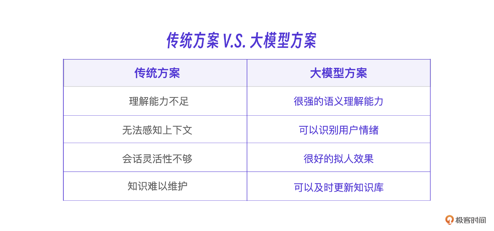
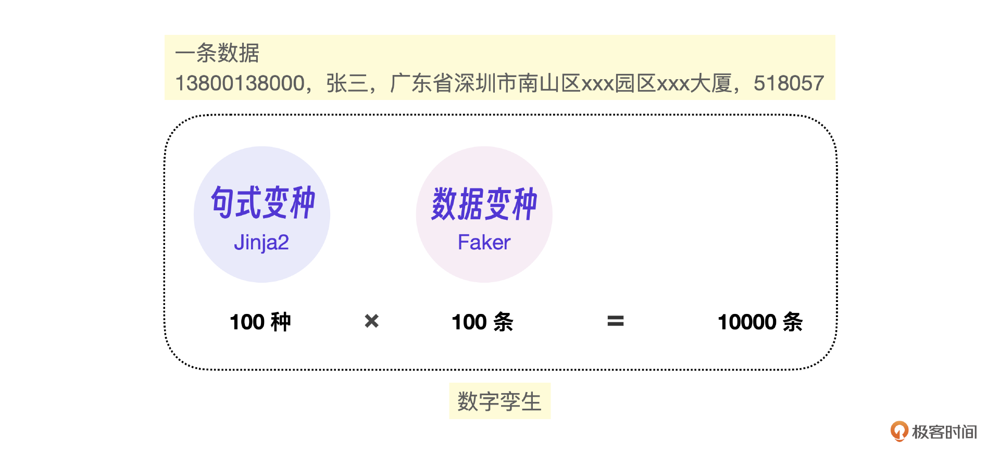
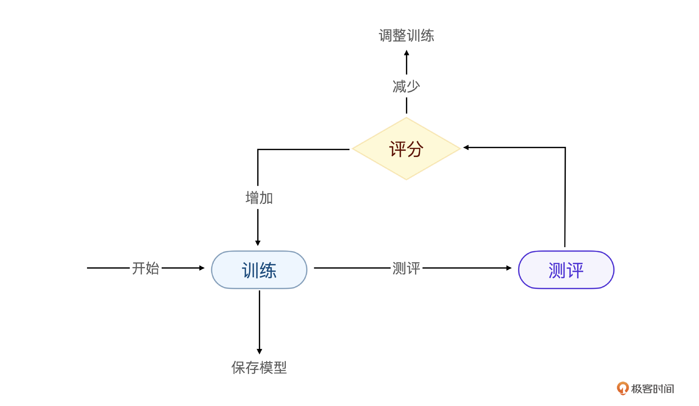
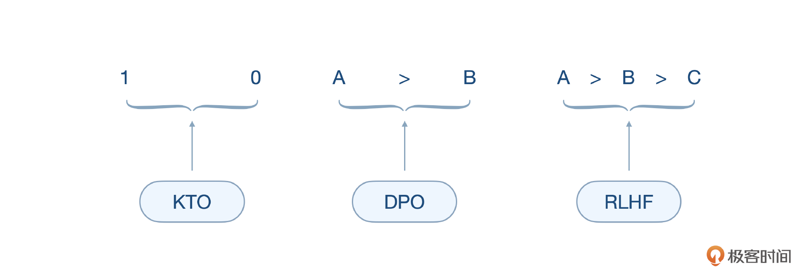
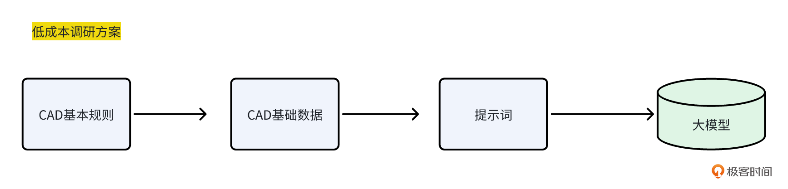

# 阶段自测题（二）

你好，我是晓蕾。咱们的课程即将结束，在发布结束语之前，小编为你带来了阶段自测题（二）。

题目针对课程的第四、五、六章，分别涵盖了专有模型微调、评估模型设计、真实项目分析三个部分的知识点，欢迎来挑战！

## 专有模型微调

**题目一：**你认为什么时候需要微调大模型？

**题目二：**微调数据。

微调大模型的数据不够，怎么办？请简述生成更多训练数据的过程。

**题目三：**模型测评。

完成模型训练后，我们通常会进行模型能力测评。模型能力测评分为三种，人工测评、通用测评和私有 task 测评。它们分别是什么意思？人工测评、通用测评、私有 task 测评，分别会在什么时候用到？

## 设计一个评估模型

**题目四：**什么是评估专家模型？它的作用是什么？

**题目四：**评估模型数据集

在评估专家模型的数据集准备中，我们讲过三类数据集，分别是 KTO、DPO、RLHF，它们是什么意思？适用于什么场景呢？

**题目五：**请简述评估方法的核心原理。

## **真实项目**

**题目六：**我们讲过快速验证能否利用大模型处理其他行业（建筑行业）的基础数据，还记得这个快速验证的过程是怎么样的吗？请你简述。如果后续遇到新项目，相信你一定能举一反三，快速验证！

以上题目，欢迎挑战！如果有疑问，也可以进入[课程交流群]()和大家一起讨论。

我们结束语见！

---
来源：极客时间
链接：https://time.geekbang.org/column/article/816865
日期：2026-05-12
