# 01｜如何在前端调用文本大模型API

你好，我是月影。

这一节课，我们先来了解如何通过调用 API 的方式来使用最基础的文本大模型。

由于几乎所有开放给用户使用的大模型服务都提供 HTTP 协议的 API，所以对于前端工程师来说，使用大模型最简单的入门方式其实就是直接调用由服务平台提供的 API。

由于各种不同类型的大模型和不同服务平台的 API 略有差异，我们也无法穷尽，所以这节课我们主要了解 Deepseek 和 Coze 这两个通用文本大模型服务的前端使用方法，以及不同的调用方式。

因为是课程的第一部分，所以内容不会太过于深入细节，但是在这一讲中，我们将通过实战操作，来熟悉大模型的 API 调用方法、数据协议和格式，为后续深入学习打下基础。

## 使用 DeepSeek Platform

要说最近国内哪个大模型得到最多人关注，那毫无疑问应该是 DeepSeek，它不仅以极低的成本实现了和行业巨头相媲美的推理能力和性能，而且最近发布的深度推理 R1 模型在性能和效果上都表现极其优越，它的团队还将模型训练中的技术创新全部公开，促进了技术社区之间的深入交流与协同创新。

实际上在 Deepseek v3 和 R1 推出的近一年之前，我的业务中就在部分使用它，因为它极低廉的价格和不错的推理能力，也因为它提供了非常好用的官方 API 平台，所以它对我们这些 AI 应用创业者非常友好。

好，让我们言归正传，来看看作为前端工程师，应当如何使用 Deepseek 官方 API。

DeepSeek 官方 API 平台是 [https://platform.deepseek.com/]() ，我们可以用手机号注册或者微信登录。登录后，就能进入 API 后台：

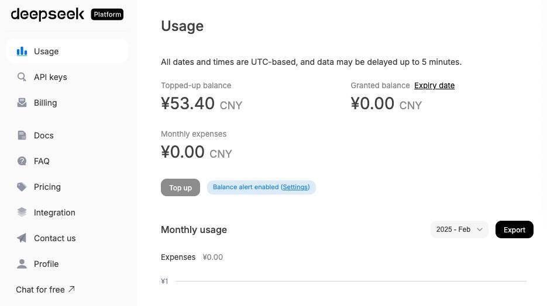

在这里，我们需要注意两个信息，一个是主页面上的余额信息，它决定了还有多少 token 剩余量。根据文档，Deepseek 目前的价格如下：

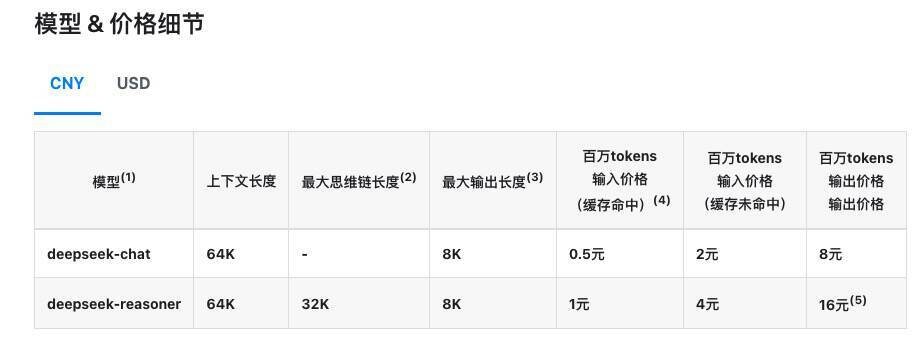

如果你是第一次接触大模型 API 调用，需要了解一下 token 的概念。token 是模型用来表示自然语言文本的基本单位，通常一个中文词语或一个英文单词、数字或符号计为一个 token。在每次 API 调用成功后，我们可以通过返回结果的 usage 得到 token 的消耗量。

除了余额，第二个需要关注的信息是 API Keys，它是我们的应用调用 API 的许可凭证。我们可以点击左侧菜单来创建、查看和管理它。

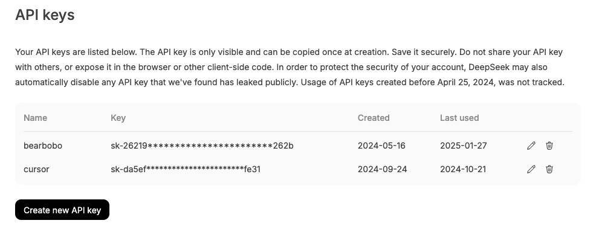

接下来我们就从最简单的做起，从浏览器端调用 Deepseek API。因为它支持 HTTPS 协议的接口，API 调用 URL 是`[https://api.deepseek.com/chat/completions](https://api.deepseek.com/chat/completions)`。

让我们用 Trae 创建一个项目，写一个简单的页面。

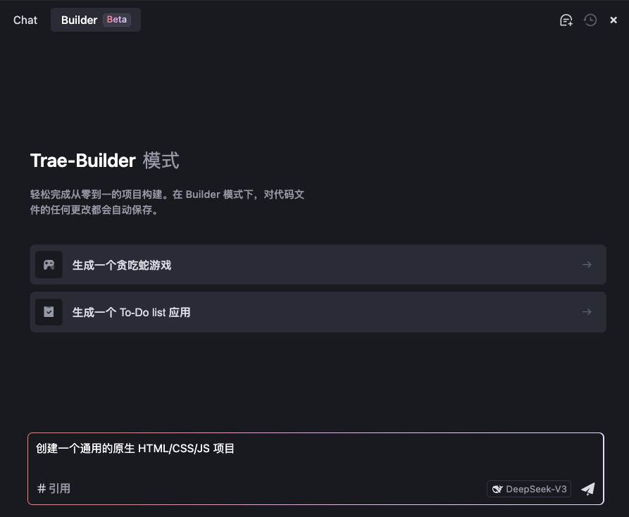

Trae 的 AI Builder 自动创建的项目结构如下：

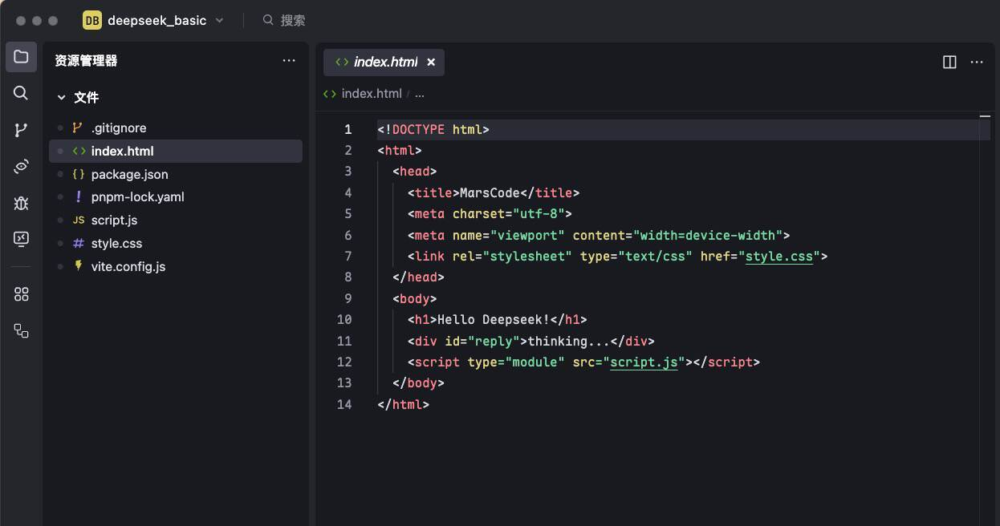

项目创建完毕后，别忘了分别修改项目目录下的 index.html 文件以及 script.js 文件：

> index.html

```
<body>
    <h1>Hello Deepseek!</h1>
    <div id="reply">thinking...</div>
    <script type="module" src="script.js"></script>
</body>
```

> script.js

```
const endpoint = 'https://api.deepseek.com/chat/completions';
const headers = {
    'Content-Type': 'application/json',
    Authorization: `Bearer ${import.meta.env.VITE_DEEPSEEK_API_KEY}`
};
const payload = {
    model: 'deepseek-chat',
    messages: [
        {role: "system", content: "You are a helpful assistant."},
        {role: "user", content: "你好 Deepseek"}
    ],
    stream: false,
};
const response = await fetch(endpoint, {
    method: 'POST',
    headers: headers,
    body: JSON.stringify(payload)
});
const data = await response.json();
document.getElementById('reply').textContent = data.choices[0].message.content;
```

同时在项目目录下创建 .env.local 文件，内容如下，其中 sk-xxxxxxxx 为你在 Deepseek Platform 中创建的 API Key。

```
VITE_DEEPSEEK_API_KEY=sk-xxxxxxxxx
```

运行代码，等待几秒，你大概会得到如下输出：

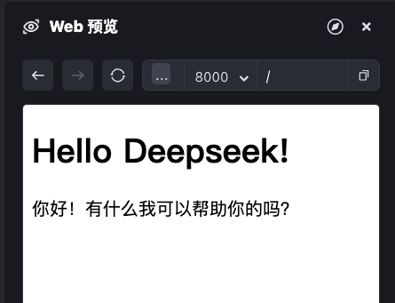

如果你没有看到如上图的结果，请检查项目目录下是否有 vite.config.ts 文件。如果没有，你在 Trae 中用 Command+U（macOS） 或 Ctrl+U（windows）唤起 Builder 对话框，在对话框中输入“帮我初始化 vite 配置”，然后再重启 vue 服务运行代码，应该就可以正常运行了。

在这里，主要看一下 `script.js` 这个文件。

首先我们声明 endpoint 变量为 `https://api.deepseek.com/chat/completions` 。前面说过，这是 Deepseek 的 API 调用 URL。接着，我们通过声明 headers 变量来设置 HTTP Headers。

这里需要注意的是，根据 API 鉴权规范，**我们需要将 Deepseek Platform 申请的 API Key 放在 Authorization 请求头字段中传给服务器以完成权限验证**。由于请求是通过 HTTPS 加密传输的，所以不用担心在这个过程中我们的 API Key 被第三方窃取。

接着，我们设置要发送给 API 服务的 body 内容，它是一份 JSON 格式的文本数据：

```
{
    "model": "deepseek-chat",
    "messages": [
        {role: "system", content: "You are a helpful assistant."},
        {role: "user", content: "你好 Deepseek"}
    ],
    "stream": false,
}
```

数据中，model 字段指定了要调用的模型类型，Deepseek Platform 支持两个模型。其中 deepseek-chat 是基础模型，目前版本是 v3，deepseek-reasoner 是深度思考模型，目前版本号是 r1。与基础模型相比，深度思考模型的推理能力更强，相应的响应速度要慢一些，价格也要贵不少。这里我们先使用基础模型。

messages 字段是要发送给大模型的具体消息，一条消息本身也是 JSON 格式的，role 字段是一个枚举字段，可选的值分别是 system、user 和 assistant，依次表示该条消息是系统消息（也就是我们一般俗称的提示词）、用户消息和 AI 应答消息。其中 user 和 assistant 消息是必须成对的，以表示聊天上下文，且最后一条消息必须是 user 消息，而 system 消息的条数和位置一般没有限制。消息体的 content 则是具体的消息文本内容。

stream 字段为 false，表示它是以标准的 HTTP 方式传输而非流式（streaming）传输（关于流式传输的内容，我们下节课再详细展开）。

最终，我们将内容发送给大模型服务，并获得返回值，这一过程是一个异步请求过程。

```
const response = await fetch(endpoint, {
    method: 'POST',
    headers: headers,
    body: JSON.stringify(payload)
});
const data = await response.json();
```

当数据从大模型 API 服务返回后，如果你打开控制台，你可以看到完整的 API 响应数据，大致如下：

```
{
    "id": "91e192ff-5adf-4955-92bb-5ac8fe9d3c22",
    "object": "chat.completion",
    "created": 1739870580,
    "model": "deepseek-chat",
    "choices": [
        {
            "index": 0,
            "message": {
                "role": "assistant",
                "content": "你好！有什么我可以帮助你的吗？"
            },
            "logprobs": null,
            "finish_reason": "stop"
        }
    ],
    "usage": {
        "prompt_tokens": 12,
        "completion_tokens": 8,
        "total_tokens": 20,
        "prompt_tokens_details": {
            "cached_tokens": 0
        },
        "prompt_cache_hit_tokens": 0,
        "prompt_cache_miss_tokens": 12
    },
    "system_fingerprint": "fp_3a5770e1b4"
}
```

其中我们关注的数据主要是 choices 字段返回的内容，choices.message.content 就是 AI 返回的文本响应内容，我们将它在网页上显示出来。

```
document.getElementById('reply').textContent 
  = data.choices[0].message.content;
```

此外，如果需要的话，我们还可以通过 usage 字段得到消耗的 token 数量，从而计算出我们这一次调用的费用消耗，在这里就不展开细说了。

这样我们就完成了一次最简单的 Deepseek 大模型 API 调用。是不是很简单呢？

## 使用 Coze

接下来，我们介绍另一个平台——Coze。

Coze（扣子）是由字节跳动推出的一款 AI 机器人和智能体创建平台，旨在帮助用户快速构建、调试和优化 AI 聊天机器人应用程序。

严格来说，Coze 不同于 Deepseek Platform，因为它不仅提供 API，更重要的是集成了创建智能体和 AI 应用机器人的能力。

API 是底层，智能体和 AI 机器人可以理解为上层应用，在后续的课程里，我们会详细了解它们的区别。但是在这一节课中，我们先不用管这些区别，重点来看一下如何使用 Coze 的 API 来生成文本。

首先我们在 [https://www.coze.cn/]() 完成注册，进入 Coze 控制台，选择“工作空间 > 个人空间 > 项目开发”，然后点击创建，选择创建智能体。

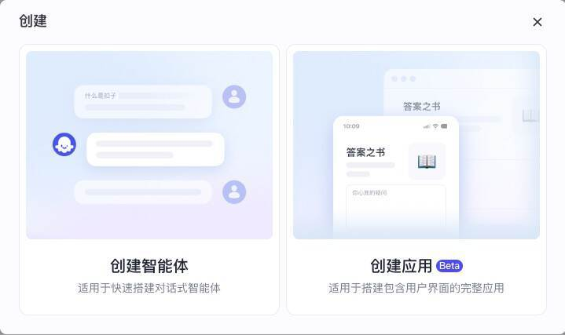

智能体名称中，我们输入“通用智能体 for API”，点击确认按钮完成创建。

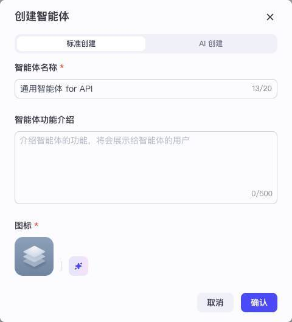

Coze 智能体的系统提示词支持模板变量，我们在人设与回复逻辑中只输入一个变量{{prompt}}，模型选择豆包.1.5 Pro 32k。

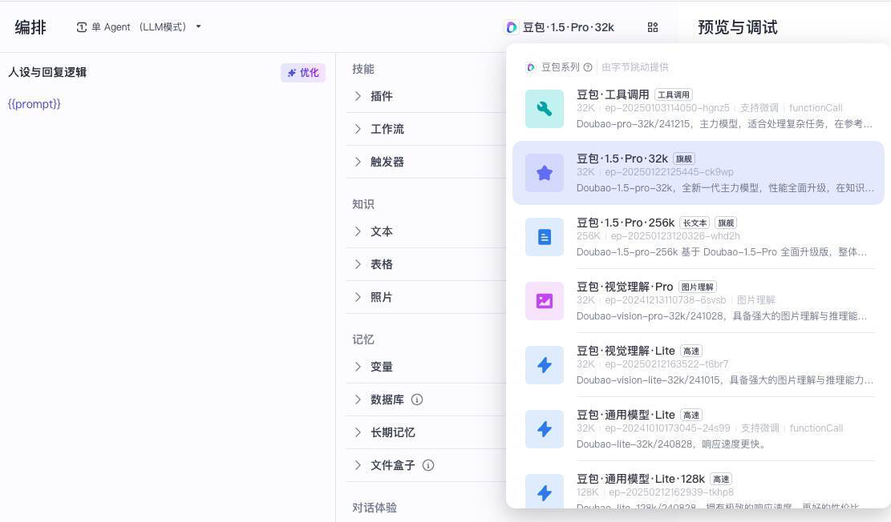

接着我们点发布按钮，选择发布平台只勾选发布为 API。

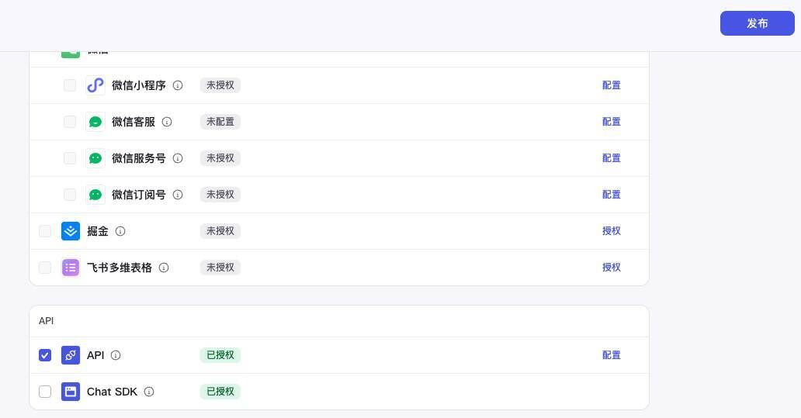

继续点发布按钮完成发布。

发布完成后，你可以从浏览器地址栏中获取到 bot_id，此时浏览器地址栏类似于 [https://www.coze.cn/space/7472697029454872613/bot/7473317995184865307]()，这里的 7473317995184865307 这串数字就是 bot_id，接下来我们在 API 调用中会用到它。

接着我们选择左侧菜单中的“扣子 API”，展开后选择授权，切换到“个人访问令牌”，点击添加新令牌，创建个人访问令牌，之后我们就可以通过个人访问令牌来进行 API 调用的鉴权了。

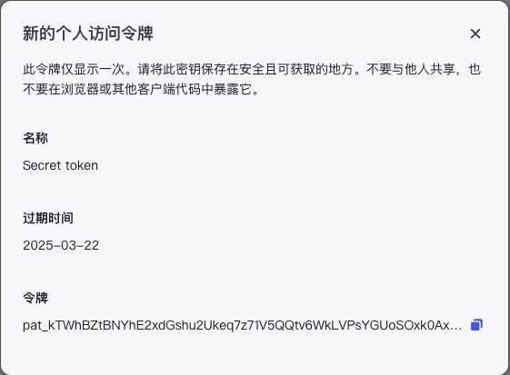

接下来我们还是在 Trae 中创建一个新的 Web 项目 Coze API。

项目创建后，添加.env.local 文件如下：

```
VITE_API_KEY=pat_kTWhBZtBNYhE2xdGshu2Ukeq7z71V**********
VITE_BOT_ID=7473317995184865307
```

然后修改 index.html 和 script.js。

> index.html

```
<!DOCTYPE html>
<html>
  <head>
    <title>Coze API</title>
    <meta charset="utf-8">
    <meta name="viewport" content="width=device-width">
    <link rel="stylesheet" type="text/css" href="style.css">
  </head>
  <body>
    <h1>Hello Coze!</h1>
    <div id="reply">thinking...</div>
    <script type="module" src="script.js"></script>
  </body>
</html>
```

> script.js

```
const endpoint = 'https://api.coze.cn/open_api/v2/chat';
const payload = {
    bot_id: import.meta.env.VITE_BOT_ID,
    user: 'yvo',
    query: '你好',
    chat_history: [],
    stream: false,
    custom_variables: {
        prompt: "你是一个AI助手"
    }
};
const response = await fetch(endpoint, {
    method: 'POST',
    headers: {
        'Content-Type': 'application/json',
        Authorization: `Bearer ${import.meta.env.VITE_API_KEY}`,
    },
    body: JSON.stringify(payload),
});
const data = await response.json();
document.getElementById('reply').textContent = data.messages[0].content;
```

从上面的代码，我们看到，Coze API 和 Deepseek Platform 的 API 调用逻辑基本类似，只是参数和返回结果有所不同。

Coze 的 API 调用需要传 bot_id 和 user 参数，其中 bot_id 就是我们创建的通用智能体的 ID，前面我们说过它可以从浏览器地址栏的 URL 中获得，user 可以是一个任意字符串，只是用来标识。

此外，Coze API 的 query 和 chat_history 是分开的，当前输入内容以 query 字段传入，格式是一个字符串，而历史消息以 chat_history 字段传入，格式和前面 Deepseek 的 messages 差不多，具体可以看 Coze 的官方文档。如果不需要历史消息，只需要传入一个空的数组。

由于 Coze 没有 system 消息，它的提示词是在人设与回复逻辑中设置，我们在前面创建时，已经定义了一个叫 prompt 的模板变量，所以在这里我们可以通过 custom_variables 参数将 prompt 变量的具体值传入。

这样，我们就完成了 Coze 智能体的 API 调用，点击运行代码，等待几秒钟，就可以在网页上看到推理结果。


## 要点总结

今天，我们以 Deepseek Platform 和 Coze 为例，详细介绍了如何在浏览器端调用文本大模型 API。

实际上，除了 Deepseek 和 Coze 外，包括月之暗面、智谱清言在内的大部分文本大模型 API 都是兼容 OpenAI 的 API 参数格式的，因此基本上都可以用同样的方式对它们进行调用，只需要变更 API key 和 endpoint 即可。有兴趣的同学，可以在课后尝试修改例子，调用其他平台的大模型。这样也可以体验一下不同模型的输出效率和推理能力的差别。

## 课后练习

我们前面了解了 Deepseek API 的基本用法，它还有一些配置参数，会影响大模型内容的生成，比较常用的参数比如 temperature，它的设定会影响内容输出的随机性，你可以在 Deepseek Platform 中详细浏览一下文档，并通过修改上面的例子动手实践，学习这些参数的作用和效果，这对你将来在项目中具体应用会很有帮助。

常用的文本大模型，除了 Deepseek 和 Coze 外，还有很多其他的选择，它们各有特点和长处，比如月之暗面的大模型 Moonshot，在多模态（支持视觉模型）和处理长文本方面表现比较不错。月之暗面也提供了 Moonshot AI 的开放平台 [https://platform.moonshot.cn/]()，你可以在这个平台上完成注册，并根据文档练习如何调用 Moonshot API，体验它和 Deepseek 有哪些不同，将你的体验结果分享到评论中。

---
来源：极客时间
链接：https://time.geekbang.org/column/article/868006
日期：2026-05-12
