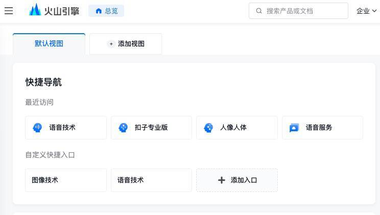
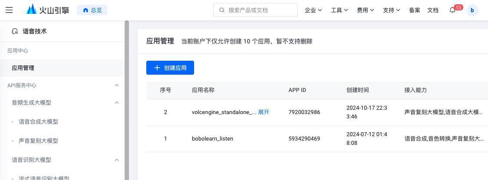
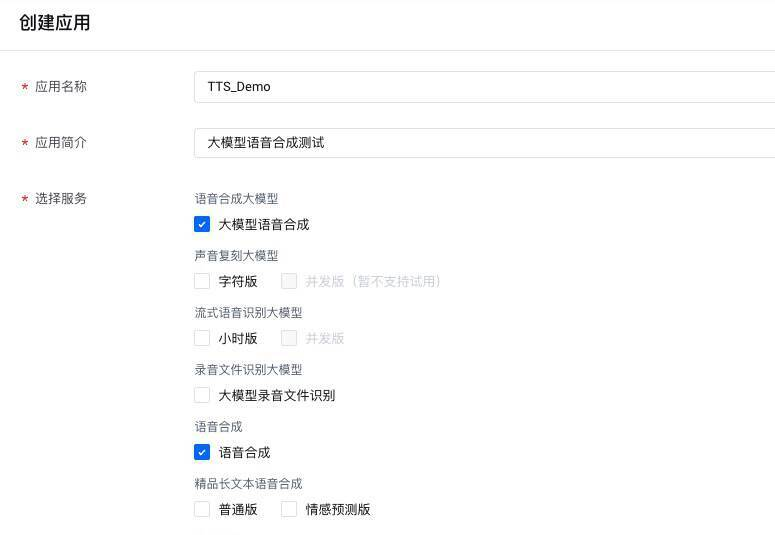
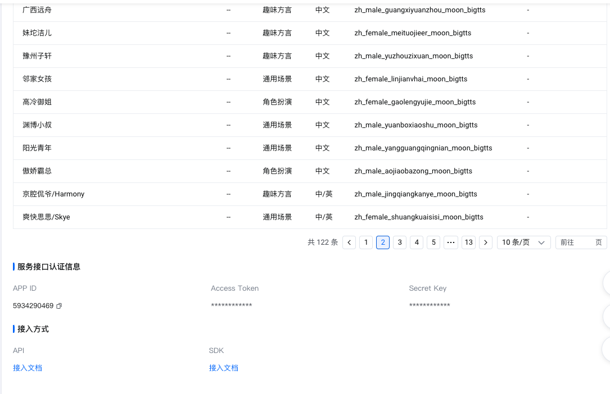
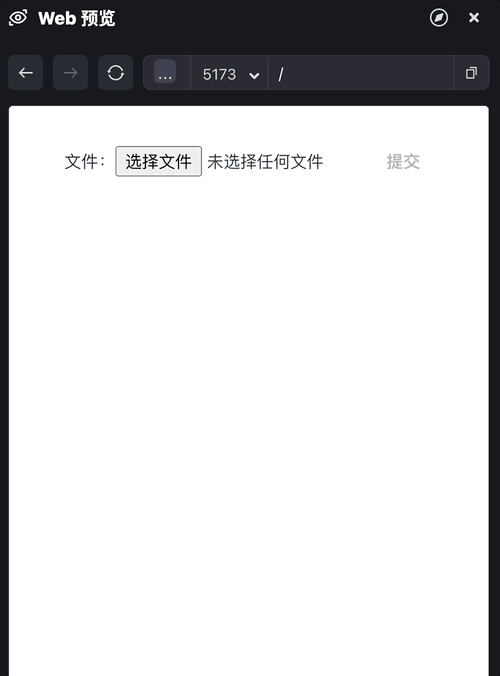

# 04｜如何在前端调用语音合成和视觉模型

你好，我是月影。

我们知道，AI 大模型应用的输入、输出通常是多模态的，不论大模型本身是否支持不同格式的输入输出，在业务上，我们都能够通过调用不同的服务整合来做到这一点。

在这节课里，我们就来体验一下火山引擎和月之暗面的服务，通过具体实践了解如何使用语音合成和视觉模型。

## 使用火山引擎语音合成

首先我们注册火山引擎账号，然后进入控制台，搜索并选择“语音技术”。



进入语音技术操作面板后，点击右侧创建应用按钮创建应用。



选择服务勾选“大模型语音合成”和“语音合成”。



创建完毕后，左侧菜单切换到“API 服务中心 > 音频生成大模型 > 语音合成大模型”，右侧可以看到“服务详情”、“音色详情”、“服务接口认证信息”等内容。注意我们要将服务接口认证信息里的 APP ID 和 Access Token 保存下来，后续调用需要用到。



至此火山引擎注册和开通服务部分已经完成，接下来我们就可以创建项目了。

还是在 Trae 中创建一个 Vue 项目并添加 .env.local，配置 AppID、AccessToken 和 ClusterID，以备后续使用。

```
VITE_APP_ID=5934290469
VITE_ACCESS_TOKEN=c-*********Ln4N
VITE_CLUSTER_ID=volcano_tts
```

接着我们修改 App.vue，实现具体功能和 UI：

```
<script setup lang="ts">
import { ref } from 'vue';
const prompt = ref('您好，请问有什么可以帮您？');
const status = ref('ready');
const audioEl = ref<HTMLAudioElement>();
function createBlobURL(base64AudioData: string): string {
  var byteArrays = [];
  var byteCharacters = atob(base64AudioData); 
  for (var offset = 0; offset < byteCharacters.length; offset++) {
      var byteArray = byteCharacters.charCodeAt(offset);
      byteArrays.push(byteArray);
  }
  var blob = new Blob([new Uint8Array(byteArrays)], { type: 'audio/mp3' });
  // 创建一个临时 URL 供音频播放
  return URL.createObjectURL(blob);
}
const generateAudio = async () => {
  const token = import.meta.env.VITE_ACCESS_TOKEN;
  const appId = import.meta.env.VITE_APP_ID;
  const clusterId = import.meta.env.VITE_CLUSTER_ID;
  const voiceName = "zh_female_shuangkuaisisi_moon_bigtts";
  const endpoint = '/tts/api/v1/tts';
  const headers = {
    'Content-Type': 'application/json',
    Authorization: `Bearer;${token}`,
  };
  const payload = {
    app: {
      appid: appId,
      token,
      cluster: clusterId,
    },
    user: {
      uid: 'bearbobo',
    },
    audio: {
      voice_type: voiceName,
      encoding: 'ogg_opus',
      compression_rate: 1,
      rate: 24000,
      speed_ratio: 1.0,
      volume_ratio: 1.0,
      pitch_ratio: 1.0,
      emotion: 'happy',
    },
    request: {
      reqid: Math.random().toString(36).substring(7),
      text: prompt.value,
      text_type: 'plain',
      operation: 'query',
      silence_duration: '125',
      with_frontend: '1',
      frontend_type: 'unitTson',
      pure_english_opt: '1',
    },
  };
  status.value = 'generating';
  const res = await fetch(endpoint, {
    method: 'POST',
    headers,
    body: JSON.stringify(payload),
  });
  const data = await res.json();
  if (!data.data) {
    throw new Error(JSON.stringify(data));
  }
  const url = createBlobURL(data.data);
  audioEl.value && (audioEl.value.src = url)
  audioEl.value?.play();
  status.value = 'done';
};
</script>
<template>
  <div class="container">
    <div>
      <label>Prompt </label>
      <button @click="generateAudio">Generate & Play</button>
      <textarea class="input" type="text" v-model="prompt" />
    </div>
    <div class="output">
      <div>>> {{ status }}</div>
      <audio ref="audioEl"></audio>
    </div>
  </div>
</template>
<style scoped>
.input {
  width: 100%;
  height: 2rem;
  font-size: 1rem;
  padding: 0.5rem;
  border: 1px solid #ccc;
  border-radius: 0.5rem;
}
.progress {
  width: 100%;
  height: 0.1rem;
  margin: .4rem 0;
  background: #ccc;
}
.progress > div {
  background: #c00;
  height: 100%;
}
.container {
  display: flex;
  flex-direction: column;
  align-items: start;
  justify-content: start;
  height: 100vh;
}
.output {
  display: flex;
  flex-direction: column;
  align-items: center;
  justify-content: center;
}
.output > div {
  width: 100%;
  max-width: 600px;
}
</style>
```

我们看一下主要的实现代码。

首先，我们读取配置项，并设置语音的音色：

```
  const token = import.meta.env.VITE_ACCESS_TOKEN;
  const appId = import.meta.env.VITE_APP_ID;
  const clusterId = import.meta.env.VITE_CLUSTER_ID;
  const voiceName = "zh_female_shuangkuaisisi_moon_bigtts";
```

然后我们设置请求的 URL，注意直接调用火山引擎服务会有跨域问题，所以我们仍然要先修改 vite.config.ts 配置，添加 server 代理：

> vite.config.ts

```
  server: {
    allowedHosts: true,
    proxy: {
      '/tts': {
        target: 'https://openspeech.bytedance.com',
        changeOrigin: true,
        rewrite: path => path.replace(/^\/tts/, ''),
      }
    },
  },
```

好了，接着继续，我们设置 headers 和 payload，这个和我们前几节课内容差不多，相信大家已经很熟悉了。

```
  const endpoint = '/tts/api/v1/tts';
  const headers = {
    'Content-Type': 'application/json',
    Authorization: `Bearer;${token}`,
  };
  const payload = {
    app: {
      appid: appId,
      token,
      cluster: clusterId,
    },
    user: {
      uid: 'bearbobo',
    },
    audio: {
      voice_type: voiceName,
      encoding: 'ogg_opus',
      compression_rate: 1,
      rate: 24000,
      speed_ratio: 1.0,
      volume_ratio: 1.0,
      pitch_ratio: 1.0,
      emotion: 'happy',
    },
    request: {
      reqid: Math.random().toString(36).substring(7),
      text: prompt.value,
      text_type: 'plain',
      operation: 'query',
      silence_duration: '125',
      with_frontend: '1',
      frontend_type: 'unitTson',
      pure_english_opt: '1',
    },
  };
```

注意，这里有一些必要的语音参数：

- voice_type：音色，火山引擎支持数十种不同的音色，我们的例子用的是“爽快思思”，你也可以换成其他的音色。注意，当你希望转换的内容包含非中文内容时，通常应当选择支持多语言的音色或者当前语种的音色，具体你可以根据需求在音色列表中选择。
- encoding：语音格式，这里我们可以选择使用 mp3、ogg 等多种格式，注意如果你的应用希望兼容多个终端，应当考虑适配最广的模式，例如有些设备对于 ogg 格式的文件无法播放，那么我们最好是生成 mp3 格式。
- compression_rate：控制音频压缩率，通常这个值影响音频文件的大小和质量。
- rate：表示音频的采样率（samples per second），通常影响音频的质量和清晰度。24000 是音频的常用采样率，即每秒钟的采样次数。24000 Hz（赫兹）是一个常见的采样率，它的音质较好。
- speed_ratio：表示语速，1.0 表示正常语速。
- volume_ratio：表示音量，1.0 是正常音量。
- pitch_ratio：表示音调，音调的调整影响语音的高低，1.0 为正常音调。
- emotion：表示语音的情感表达，大模型根据它来调整语音的情感色彩，happy 表示欢快，语音可能会更轻松愉快，语气上会有更多的高低起伏。

最后，我们发起请求，拿到 JSON 格式的返回数据，其中 data 字段内是音频的 Base64 编码，我们可以直接使用。

```
  status.value = 'generating';
  const res = await fetch(endpoint, {
    method: 'POST',
    headers,
    body: JSON.stringify(payload),
  });
  const data = await res.json();
  if (!data.data) {
    throw new Error(JSON.stringify(data));
  }
  const url = createBlobURL(data.data);
  audioEl.value && (audioEl.value.src = url)
  audioEl.value?.play();
  status.value = 'done';
```

这里我们通过 createBlobURL 函数将 Base64 编码的数据转换成二进制对象，然后生成 URL，将 URL 设置为 audio 标签的 src，再执行 play 方法，就可以直接将语音播放出来了。

```
function createBlobURL(base64AudioData: string): string {
  var byteArrays = [];
  var byteCharacters = atob(base64AudioData); 
  for (var offset = 0; offset < byteCharacters.length; offset++) {
      var byteArray = byteCharacters.charCodeAt(offset);
      byteArrays.push(byteArray);
  }
  var blob = new Blob([new Uint8Array(byteArrays)], { type: 'audio/mp3' });
  // 创建一个临时 URL 供音频播放
  return URL.createObjectURL(blob);
}
```

到此为止，我们就实现了一个最简单的文字合成语音功能。

在一般情况下，我们的产品功能不会直接将任意文字转语音，通常是将文本模型生成的回答内容转为语音，所以我们会将语音合成结合文本模型使用，组成特定的智能体来实现应用。关于这部分内容，在后续的课程中我们有机会进一步深入探讨。在这一节课里，我们先了解如何通过 API 将文字合成语音就可以了。

我们可以听一下将上面这段文字转语音的效果。

## 使用 Kimi 视觉模型

在有些 AI 应用中，我们不仅仅让用户提供文字的信息，还可以让用户提供图像信息。这时候，视觉（Vision）模型就起到了分析和理解图片内容的重要作用。

国内也有一些平台支持了视觉模型，这里我们以月之暗面的 Kimi 为例，来学习如何使用视觉模型。

首先，我们在 [https://platform.moonshot.cn/]() 完成注册，进入控制台。Kimi 和我们之前了解的 Deepseek 平台差不多，我们先点击控制台的左侧菜单，选择 API Key 管理，新建一个 API Key。

创建了 API Key 之后，我们就可以通过 API 调用 Kimi 大模型了，其中 kimi 的视觉模型包括 moonshot-v1-8k-vision-preview/moonshot-v1-32k-vision-preview/moonshot-v1-128k-vision-preview 等，它们能力基本一样，区别是 token 的数量限制。在这里我们使用 moonshot-v1-8k-vision-preview。

首先依然是使用 Trae 创建一个新的项目 Kimi Vision Demo。

添加.env.local：

```
VITE_API_KEY=sk-qi2o**********xbp4
```

修改 App.vue 文件为如下内容：

```
<script setup lang="ts">
import { ref, computed } from 'vue';
const content = ref('');
const imgBase64Data = ref('');
const isValid = computed(() => imgBase64Data.value !== '');
const updateBase64Data = async (e: Event) => {
  imgBase64Data.value = '';
  const file = (e.target as HTMLInputElement).files?.[0];
  if (!file) {
    return;
  }
  const reader = new FileReader();
  reader.readAsDataURL(file);
  reader.onload = () => {
    imgBase64Data.value = reader.result as string;
  };
};
const update = async () => {
  if(!imgBase64Data.value) {
    return;
  }
  const endpoint = 'https://api.moonshot.cn/v1/chat/completions';
  const headers = {
    'Content-Type': 'application/json',
    Authorization: `Bearer ${import.meta.env.VITE_API_KEY}`
  };
  content.value = '思考中...'
  const response = await fetch(endpoint, {
    method: 'POST',
    headers: headers,
    body: JSON.stringify({
      model: 'moonshot-v1-8k-vision-preview',
      messages: [
        { role: 'user',
          content: [{
            type: "image_url", 
            image_url: {
                "url": imgBase64Data.value,
            },
          }, {
            type: "text",
            text: "请描述图片的内容。",
          }] 
        }
      ],
      stream: false,
    })
  });
  const data = await response.json();
  content.value = data.choices[0].message.content;
};
</script>
<template>
  <div class="container">
    <div>
      <label>文件：</label>
      <input class="input" type="file"
        accept=".jpg, .jpeg, .png, .gif"
        @change="updateBase64Data"/>
      <button @click="update" :disabled="!isValid">提交</button>
    </div>
    <div class="output">
      <div class="preview">
        
      </div>
      <div>{{ content }}</div>
    </div>
  </div>
</template>
<style scoped>
.container {
  display: flex;
  flex-direction: column;
  align-items: start;
  justify-content: start;
  height: 100vh;
  font-size: .85rem;
}
.input {
  width: 200px;
}
.output {
  margin-top: 10px;
  min-height: 300px;
  width: 100%;
  text-align: left;
}
.preview img {
  max-width: 100%;
}
button {
  padding: 0 10px;
  margin-left: 6px;
}
</style>
```

我们看一下代码的关键部分。其实它和调用前面文本模型的区别很小，只是输入由文本内容换成了图片内容。

注意这里我们使用了 FileReader，直接在浏览器端获取图片的 Base64 数据，然后将它传给 Kimi 的多模态大模型进行处理。

```
const updateBase64Data = async (e: Event) => {
  imgBase64Data.value = '';
  const file = (e.target as HTMLInputElement).files?.[0];
  if (!file) {
    return;
  }
  
  const reader = new FileReader();
  reader.readAsDataURL(file);
  reader.onload = () => {
    imgBase64Data.value = reader.result as string;
  };
};
```

reader.readAsDataURL 会将文件的文本或者二进制内容自动解析为 Base64 编码的字符串，并带上格式头，也就是说，对于 png 图片来说，它会生成以 `data:image/png;base64,`开头的字符串，我们可以将这内容直接传给 Kimi 的多模态大模型服务。

在传递参数给大模型时，Kimi 多模态的大模型支持 type 为 image_url 的内容，当 type 设置为 image_url 时，对应的 image_url 字段可以支持图片的 Base64 数据，因此我们只需要按照下面这个数据结构将数据发给 Kimi 的多模态大模型进行处理就可以了。整个代码也非常的简单，和之前的文本大模型的调用，除了参数格式的区别外，几乎没有其他区别。

```
  const response = await fetch(endpoint, {
    method: 'POST',
    headers: headers,
    body: JSON.stringify({
      model: 'moonshot-v1-8k-vision-preview',
      messages: [
        { role: 'user',
          content: [{
            type: "image_url", 
            image_url: {
                "url": imgBase64Data.value,
            },
          }, {
            type: "text",
            text: "请描述图片的内容。",
          }] 
        }
      ],
      stream: false,
    })
  });
```

这样，我们就实现了视觉识别，让我们的应用具有了接受和分析图片内容的能力。



## 要点总结

在这一节课，我们通过实战，继续学习了其他类型的大模型能力，包括语音合成和视觉模型。

语音合成和视觉模型引入，对于我们实现多模态的 AI 应用非常有帮助。

语音合成的作用是将一段文本文字，通过大模型转换为带有类似真人感情的语音，这样我们就能将语音内容在前端播放出来。

视觉大模型的能力是接受图片输入，然后按照用户的要求，分析图片中的内容，将其中的内容用文字描述出来，或者进行其他处理。

## 课后练习

火山引擎的语音模型可以支持数十种不同的音色，修改上面的例子，给界面增加音色选择功能，对同样的文本合成不同音色的语音效果，同时配合修改 emotion 情感参数，体验一下它们的区别。在使用语音合成模型的实践中，我们采用了将 Base64 字符串转换为 Blob（二进制对象）的方式来播放语音，我们为什么这么做，这么做有什么好处？有没有其他可行的办法？请大家思考、自行搜索资料或者询问 AI 来深入学习。在前面视觉大模型的例子里，我们只输入图片，然后固定要求 AI 描述图片内容。实际上，我们还可以通过指令控制 AI 对图片做其他的处理，比如对物品进行分类，说出主要物品的英文单词、看图说话撰写一篇作文等等。请你修改前面的例子，增加一个用户要求的输入框，让用户可以输入不同的要求，看 AI 是否能够根据用户的要求完成对图片的解读。

欢迎把你的学习心得体会分享到评论区。

---
来源：极客时间
链接：https://time.geekbang.org/column/article/869011
日期：2026-05-12
