# 05｜如何用Coze快速构建AI应用智能体

你好，我是月影。

通过之前的学习，我们已经了解了常用类型的大模型 API 如何调用。然而除了大模型 API 调用，我想你一定也经常听到一个名词，叫做“智能体”，对应的英文叫做 Agent。

那么，究竟大模型和智能体有什么区别呢？

今天这节课，我们就来聊聊智能体的基本概念，看看智能体对于 AI 应用意味着什么，掌握什么时候需要构建智能体，以及如何快速构建 AI 应用智能体。

## 什么是智能体和智能体工作流

顾名思义，智能体（Agent）是指能够感知环境、做出决策并根据决策采取行动的系统。在 AI 大模型应用中，智能体可以理解为利用大模型核心能力，通过适当的流程编排，构成能够感知、理解、分析**环境信息**，并根据**环境信息**（通常是用户输入）和**指导信息**（通常是提示词）进行综合处理，得到用户需要反馈的独立应用单元。

在这其中，构成智能体主要功能的流程，就叫智能体的**核心工作流，****也叫****智能体工作流。**

这么说还是比较抽象，让我通过一个简单的例子来说明。

假设我们要设计一个给 6～8 岁孩子讲睡前故事的 AI 应用，该应用设定一个故事主题，让 AI 尽可能讲述经典民间故事，如果该主题的经典民间故事不存在，那么让 AI 根据主题编撰一个故事。

在讲述故事时，我们要求的内容和语言风格是适合 6～8 岁孩子的年龄和认知，不要超出年龄范围。另外讲述故事时，要求采用比较亲切的语音将故事念出来。

上述需求的核心就是一个讲故事的智能体，很显然，它不能只通过简单地调用文本模型来实现的。

首先，很容易知道，这个智能体需要具备搜索引擎能力和语音合成能力。其次，由于我们对故事的内容和文字风格有所要求，因此也需要有改写内容和润色语言表达的能力。这些能力必须通过合理的**工作流**编排，才可以最终实现智能体的功能。

下面这张图，大致描绘了这个智能体的整体工作逻辑，也即这个智能体的核心工作流。


首先我们根据用户输入的主题来分析用户的意图，生成搜索 query。然后用生成的搜索 query 去调用搜索 API（在大模型里，这个技术通常又被称为 RAG，即检索增强生成）。随后对返回内容进行整理，利用整理的内容编写草稿，再对语言和文字风格进行检查和润色。最后还要根据输出的文本内容进行语音合成，然后将文本和语音最终输出。

上面这样一个完整的过程，最终成为我们应用的业务核心，它就是一个完整的智能体。这个智能体的整体工作流是串行的，还是比较简单的，实际的业务中，还会遇到比这更加复杂的智能体，有可能有多个任务并行处理，在后续的课程中，我们会有机会进一步探索。

## 使用 Coze 编排工作流

字节跳动的扣子 (Coze）平台提供了低代码方式，通过编排工作流来创建智能体的能力，我们通过实践来看一下。

首先，进入 Coze 的管理后台，选择左侧菜单项“工作空间”，在个人空间中选择“资源库”，点击右上角新建资源，选择“工作流”。

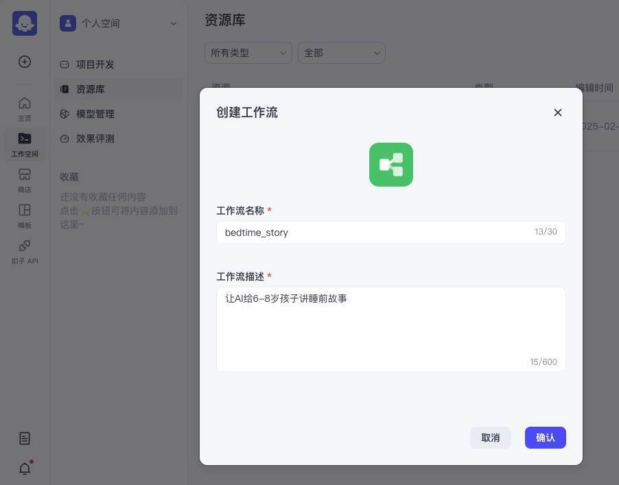

我们创建一个工作流，叫做 bedtime_story，工作流的描述为“让 AI 给 6-8 岁孩子讲睡前故事”。

点击确认按钮，就进入工作流主界面，此时界面上只有“开始”和“结束”两个节点。

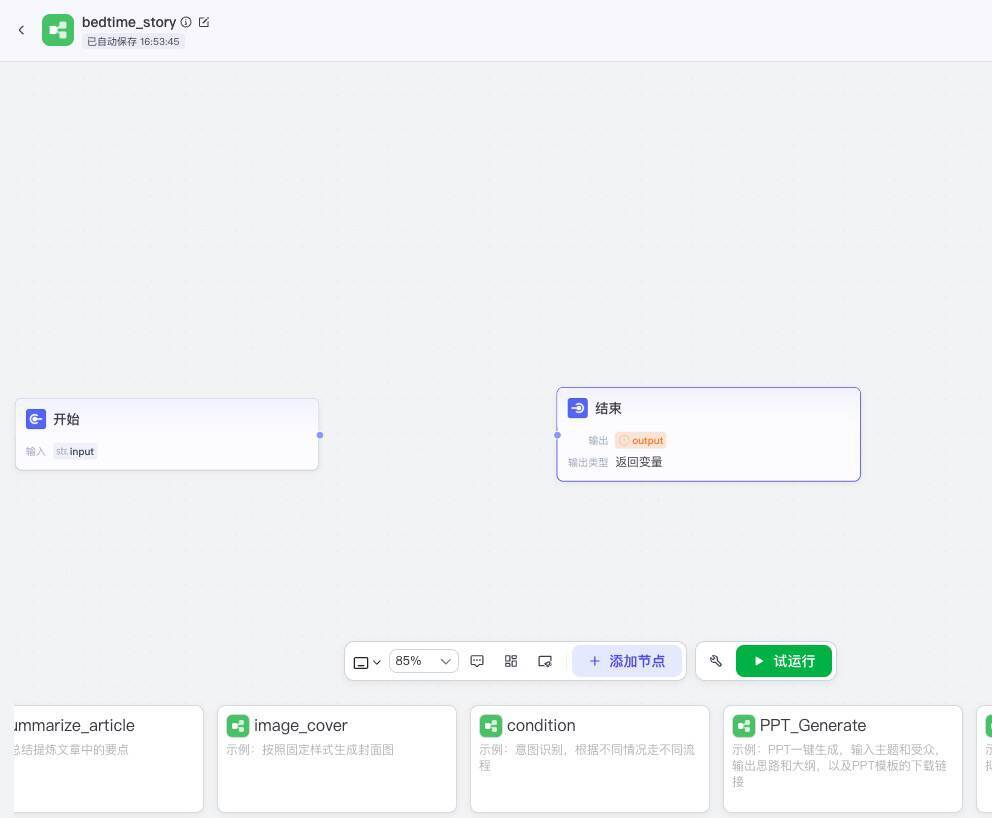

接下来，我们来创建第一个新节点。

点击添加节点，选择大模型节点：

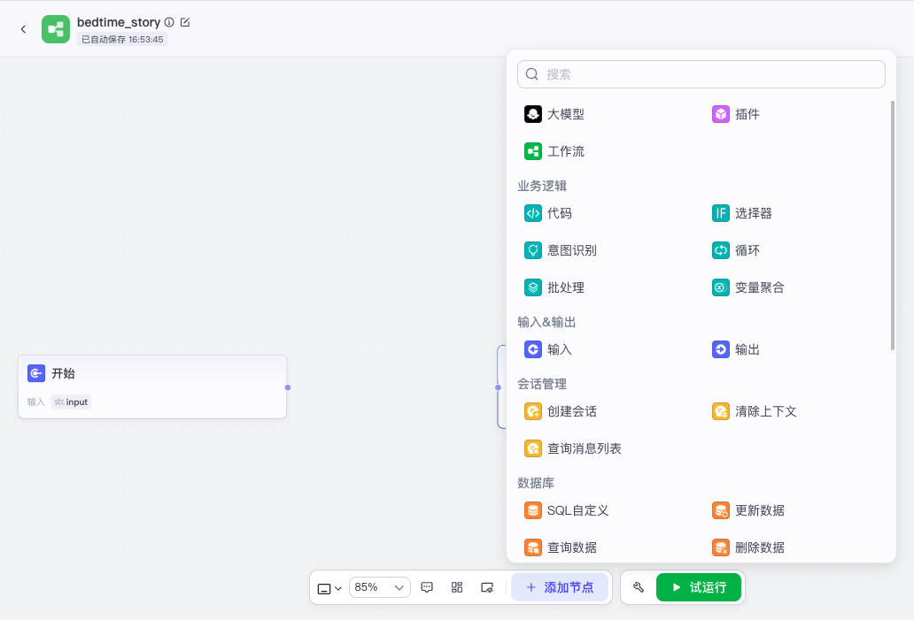

这样就添加了一个新的大模型节点，我们来配置它：

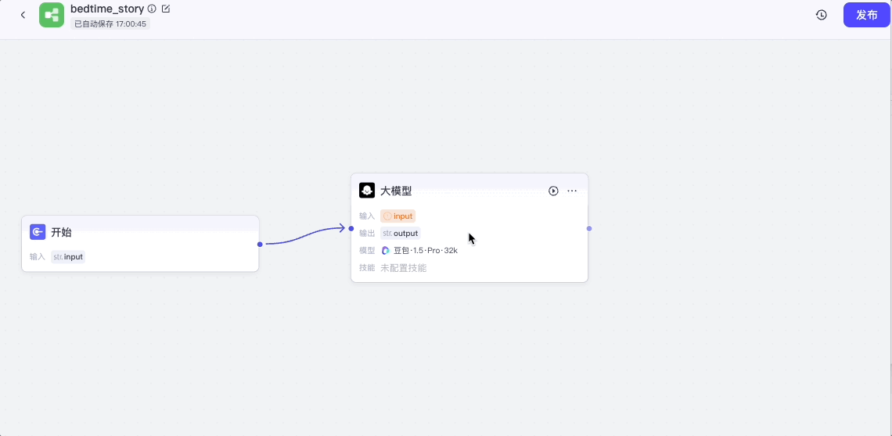

我们将开始节点的输出接入大模型节点的输入，点击大模型节点，打开配置面板，模型选择“豆包 1.5 Pro”，输入选择开始节点的 input。

接下来，我们要配置系统提示词和用户提示词，系统提示词就是我们给当前 AI 节点的操作指令。这个节点呢，我们要让它做一件事，就是根据用户原始输入信息，判断用户的意图，提供一组 query 词，便于后续执行网页搜索。

于是我们在配置面板中输入系统提示词和用户提示词：

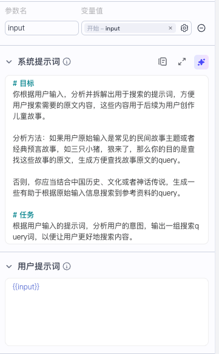

系统提示词如下：

```
# 目标
你根据用户输入，分析并拆解出用于搜索的提示词，方便用户搜索需要的原文内容，这些内容用于后续为用户创作儿童故事。
分析方法：如果用户原始输入是常见的民间故事主题或者经典预言故事，如三只小猪，狼来了，那么你的目的是查找这些故事的原文，生成方便查找故事原文的query。
否则，你应当结合中国历史、文化或者神话传说，生成一些有助于根据原始输入信息搜索到参考资料的query。
# 任务
根据用户输入的提示词，分析用户的意图，输出一组搜索query词，以便让用户更好地搜索内容。
```

用户提示词我们只需要直接使用原始输入，Coze 中可以用模板变量：

```
{{input}}
```

这里用双花括号表示模板变量，input 对应模块的输入参数名，默认就是 input。

最后我们还要配置输出项。我们一共要配置两个输出项，一个是 querys，类型是字符串数组，表示生成的多个搜索项，另一个是 intent，表示用户意图。

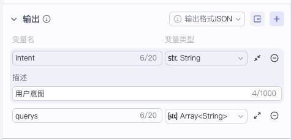

注意，这个 intent 并不是我们后续模块要用到的内容，但是我们仍然让 AI 输出，这里其实是用了一个小技巧，就是**我们让 AI 输出一些对它生成内容有参考价值的字段**，其实是强化了它推理过程中的思考，有助于生成更高质量的内容。

现在我们完成了工作流的第一步，也就是让大模型根据用户输入生成 query。实际上如果你想要测试，我们可以立即测试这一步，只需要将这个节点的输出和结束节点的输入连接在一起，并在结束节点的配置面板中，修改输出变量的参数值就可以。

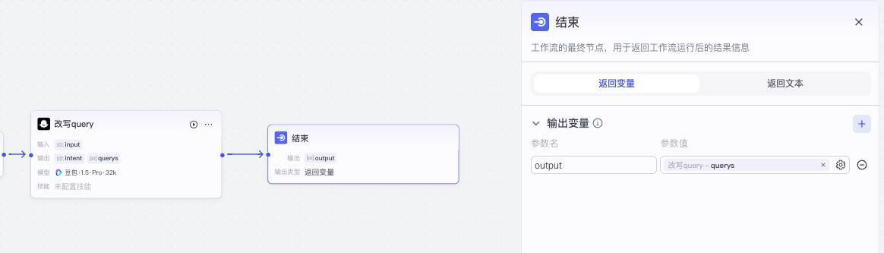

接下来点击下方的“试运行”按钮。

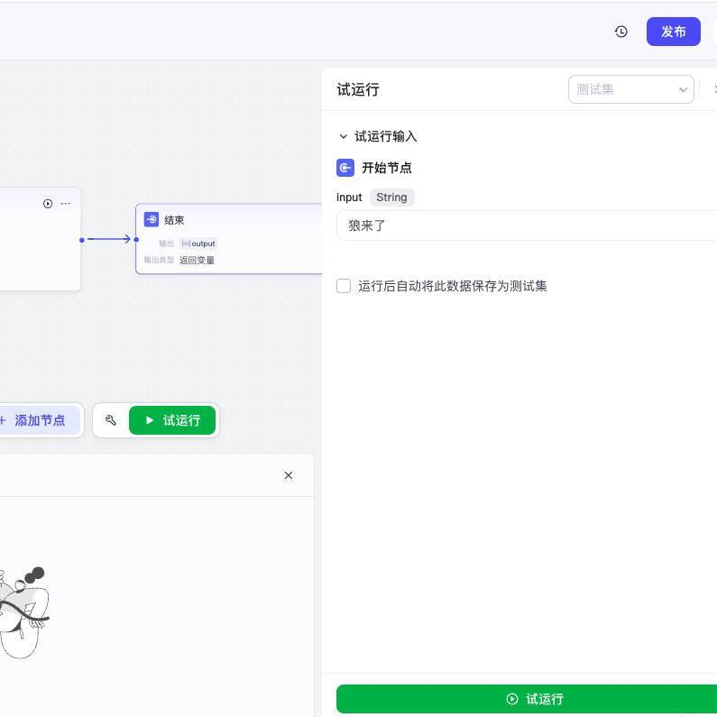

在开始节点输入“狼来了”，点击试运行，我们就可以看到运行结果，它返回了一个 output 数组，里面的内容就是当用户输入“狼来了”时，准备进一步搜索的 query 内容。

根据我们的设计，搜索 query 是一个数组，也就是说有可能返回多个内容，让用户一一搜索，所以下一个节点，我们需要一个循环模块。

选择“添加节点 > 业务逻辑 > 循环”，添加一个循环节点。

将之前创建的“改写 query”节点的输出和循环节点的输入连接起来，并设置循环数组 input 的参数值为前一个节点输出的变量 querys。由于我们循环不需要中间变量，所以我们可以将中间变量删除掉。

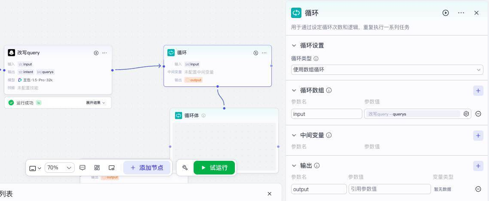

接下来我们选中“循环体”，再添加节点，选择“插件 > 必应搜索 >bingWebSearch”。

我们将 bingWebSearch 插件的输入输出与循环体的输入输出连接起来，并打开循环体配置面板，设置输入 query 值为循环的输入参数 input。

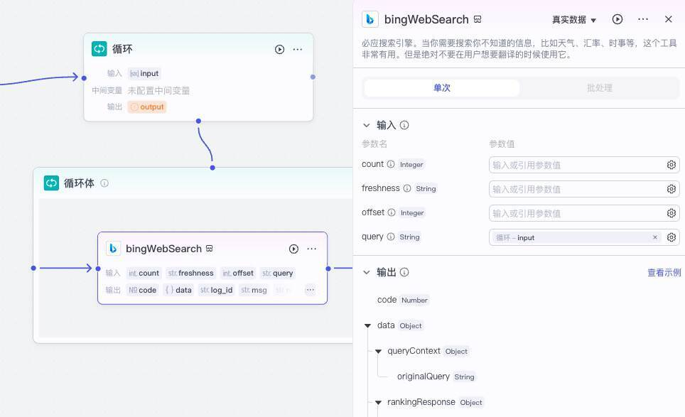

然后我们再切换到循环的配置面板，将输入参数 output 的值设置为 response_for_model。

这样我们就完成了工作流第二个节点，也就是“搜索并整理内容”节点的配置。

接着我们继续添加第三个节点，它依然是一个大模型节点，作用是撰写草稿。大模型我们仍然选择“豆包 1.5 Pro”。我们将循环节点的输出与它的输入连接到一起，依次设置好输入、输出以及系统提示词和用户提示词。

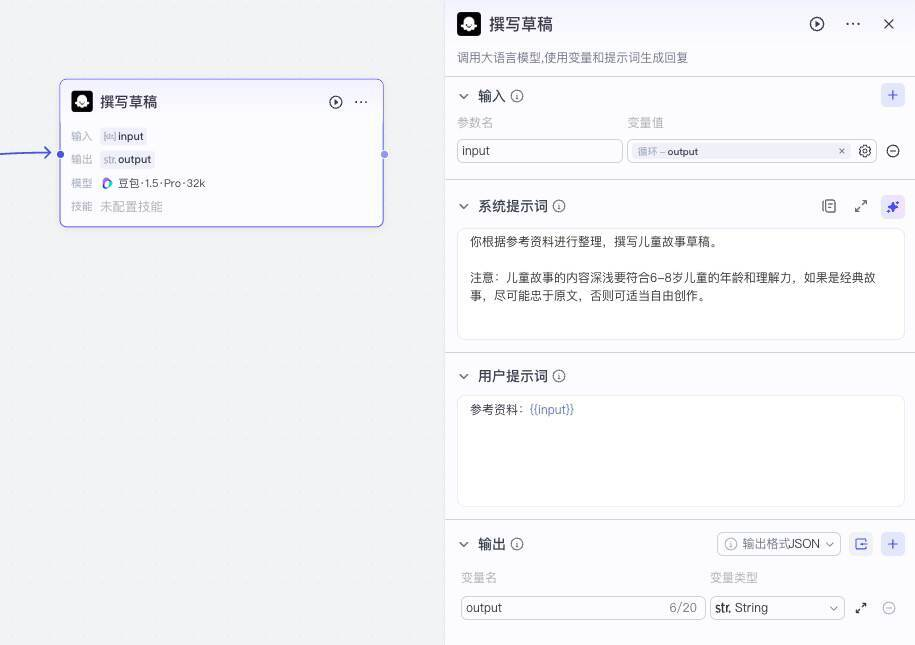

以下是它的系统提示词和用户提示词：

> 系统提示词

```
你根据参考资料进行整理，撰写儿童故事草稿。
注意：儿童故事的内容深浅要符合6-8岁儿童的年龄和理解力，如果是经典故事，尽可能忠于原文，否则可适当自由创作。
```

> 用户提示词

```
参考资料：{{input}}
```

接着，我们继续创建大模型节点，这次我们要做的工作是润色，依然采用“豆包 1.5 Pro”大模型，系统提示词和用户提示词如下：

> 系统提示词

```
你扮演一位知性而有耐心的温柔大姐姐，正在为你6岁的妹妹讲一个睡前故事。根据用户提供的故事材料，用口语的表达方式，使用简短生动的句子，并以温柔、舒适的语气讲述。为了让故事易于孩子理解，你可以加入互动性问题，比如：“你觉得接下来会发生什么？”来吸引孩子的注意力。保持故事简短，时间不超过5分钟。
```

> 用户提示词

```
故事材料：{{input}}
```

最后我们添加一个插件节点，搜索语音，添加官方中文文本转语音，选择柔美女声。


我们将润色节点的输出连接到 roumei_nvsheng 插件输入，并打开配置面板将输入项配置好，最后我们将 roumei_nvsheng 的输出和润色的输出都与结束节点的输入连接，再打开结束节点的配置面板，设置输出为 text 和 audio。

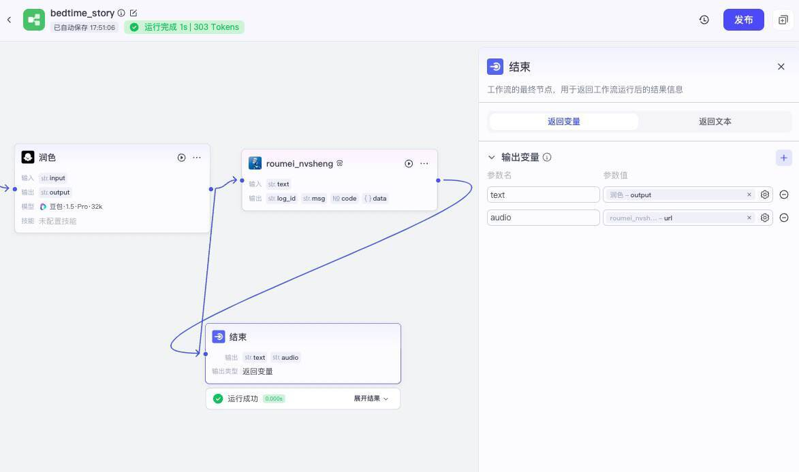

这样我们就完成了工作流的全部配置，我们现在可以测试一下，点击下方的试运行按钮，在面板输入“狼来了”，我们可以等待工作流的输出结果，并可以查询每一个节点运行后的输入输出。

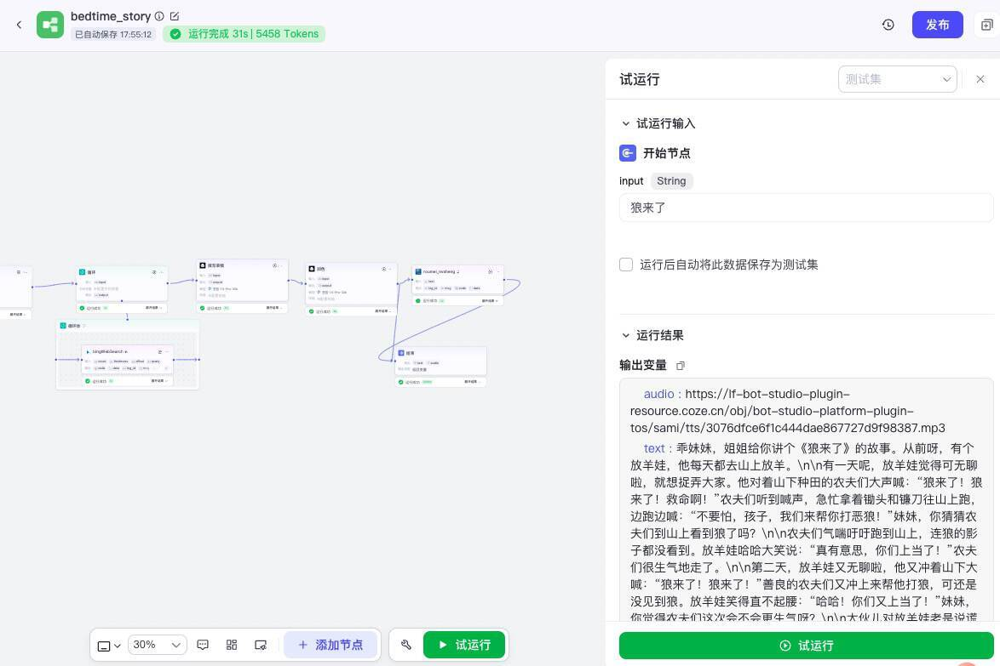

试运行成功后，我们就可以拿到音频和文本了。

比如下面是我们输入“小松鼠历险记”之后。工作流生成的音频（在课程音频 8:05～10:57 左右）。

## 在 Coze 智能体中使用工作流

有了工作流，我们再创建智能体就非常简单了。

首先，我们先将上面创建的工作流发布一下，发布流程非常简单，只要点击右上角发布按钮，填写一下发布信息，点击确认就发布完成了。

接下来我们回到菜单项的“个人空间 > 项目开发”，点击创建按钮创建智能体。

我们创建一个新的智能体“儿童睡前故事”。

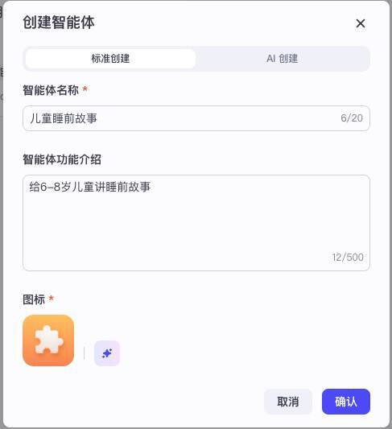

点击确认后，我们在智能体编排面板中选择“技能 > 工作流”，将我们的工作流添加进去。

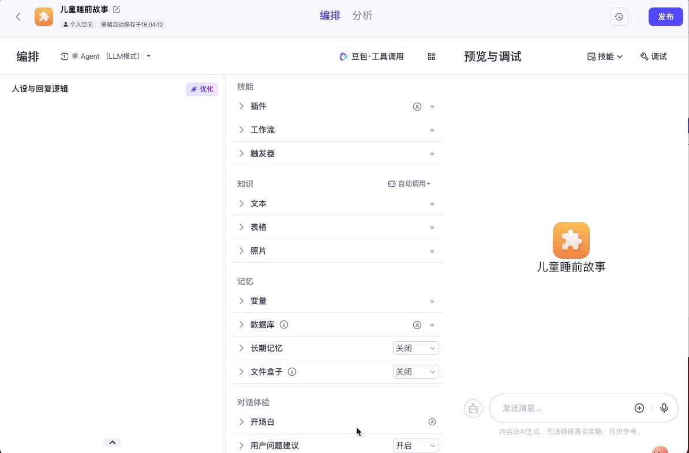

然后配置我们的人设与回复逻辑：

```
根据用户输入的主题，调用bedtime_story工作流给孩子讲睡前故事。
```

然后我们就可以测试这个智能体了。

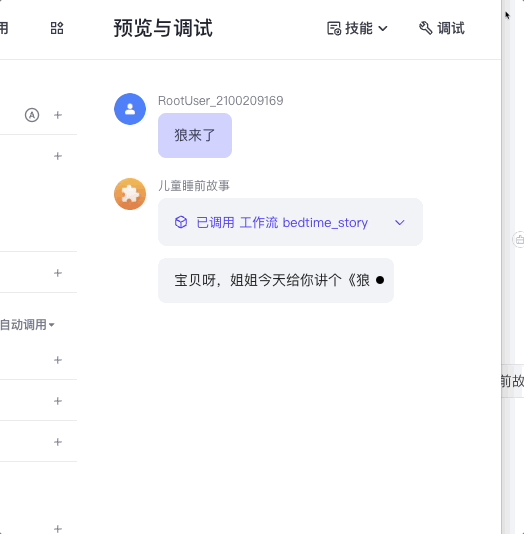

最终，你可以选择把这个智能体发布到豆包或者其他平台，或者像前面的课程那样发布成 API，通过我们的代码来进行调用。

这样我们就实现了用 Coze 创建编排工作流，然后用智能体来调用工作流的全过程。

## Coze 工作流的优缺点

实际上，Coze 是一个非常优秀的智能体创建和分享平台，它提供的工作流编排能力非常强大，通过前面的实践我们就能体会一二。

Coze 的最大优点就是通过它的低代码平台，我们能够非常快速地创建复杂的工作流和功能强大的智能体，并且迅速验证效果。而且 Coze 还提供将中间推理过程的消息输出的节点，支持流式和非流式两种形式，能够很好地实现对用户快速响应。它还提供了丰富的生态插件和工具。

总体上来说，Coze 平台对于像我这样的 AI 创业者非常友好，它对我们的产品和业务而言，是一个强大的产品原型设计和验证平台，能够大大节省我们的时间和成本。

当然 Coze 也有一些不足的地方，比如它将工作流完全集成在它自己的平台上，有时候我们考虑业务隐私和安全性，希望自己在公司内部搭建和管理工作流。另外相比于 Coze 的节点之间的调用，节点内部的调用还是比较黑盒，我们希望做一些数据结构级别的优化，会比较难实现。

因此我们在业务中，通常会在原型验证阶段使用 Coze，真正产品开发时，还是通过 Node.js 来实现我们自己的业务工作流。

好在只要我们理解了工作流的原理，使用 Node.js 来实现编排工作流，也并不算太复杂。在下一节课里，我们通过一个实战的例子来学习怎么在 Node.js 服务器实现自己的智能体工作流。

## 要点总结

这一节课，我们学习了智能体和工作流的概念，并通过 Coze 平台的工作流编排实践，掌握了工作流的设计原理，这也给我们后续课程的进一步深入打下基础。

今天我们实现的是一个给 6～8 岁讲睡前故事的智能体，除了文本能力，实现它还需要搜索引擎、文字改写润色、语音合成等功能。

其实利用 Coze 低代码平台实现简单的智能体并没有想象中那么复杂，关键在于理清步骤，设定合理的工作流。这种方式非常适合项目初期做原型验证，你也可以参考今天课程的思路，来快速实现一个你想要的智能体。

## 课后练习

1. 在工作流编排时，我们在最开始设计了一个改写 query 的节点，如果不添加这个节点会有什么问题？你可以自己尝试修改工作流，把这个节点去掉，采用用户的原始输入进行搜索，看看会有什么差别。

2. 我们在工作流最后的节点生成 mp3 语音文件，本意是让用户可以下载保存这个文件，以便将来重复播放给孩子听。但是你会发现我们的智能体在使用工作流回答问题的时候，并没有将这个语音文件放到回答内容里，这样用户就没法获得这个语音文件。那么问题来了，我们要如何让智能体将这个文件输出给用户呢？你可以想一想，然后亲自动手试试。

3. 如果我们要给每一个故事配一张插图，我们可以给工作流添加一个绘制插图的节点，你可以尝试修改工作流，添加这个插图节点，给每一个故事配置一个插图吗？动手试试，将结果分享到评论区吧。

---
来源：极客时间
链接：https://time.geekbang.org/column/article/870510
日期：2026-05-12
