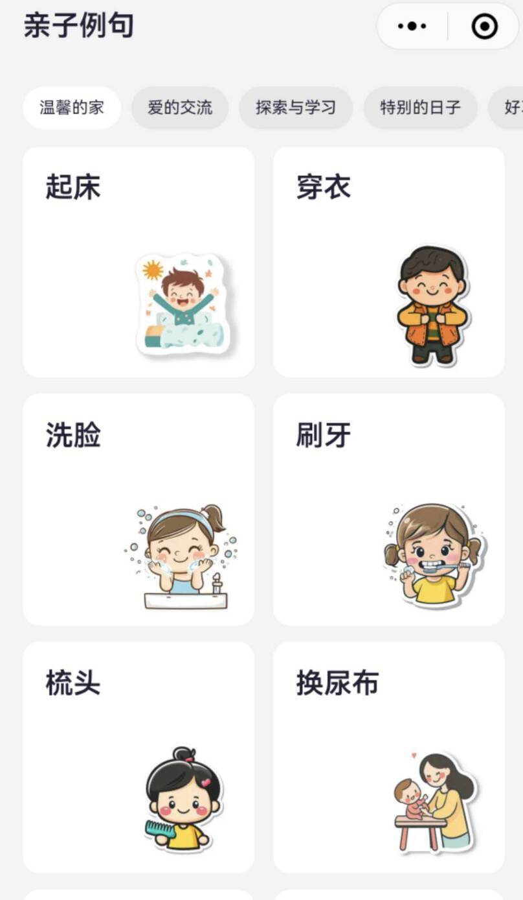
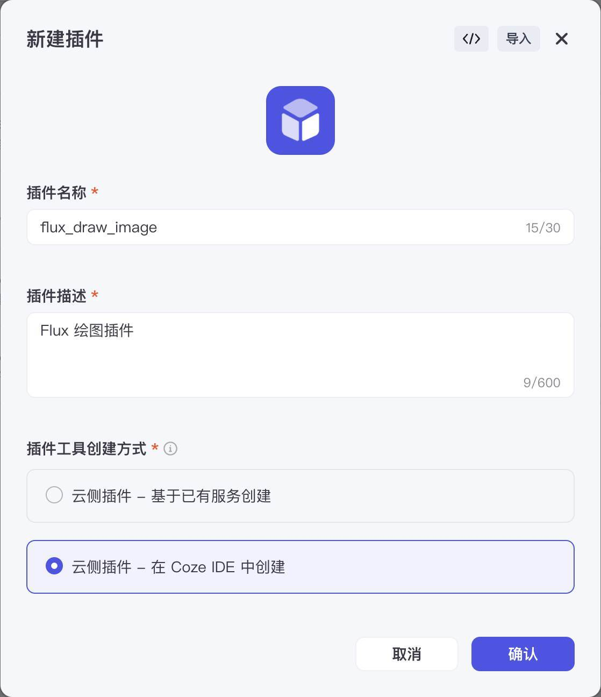
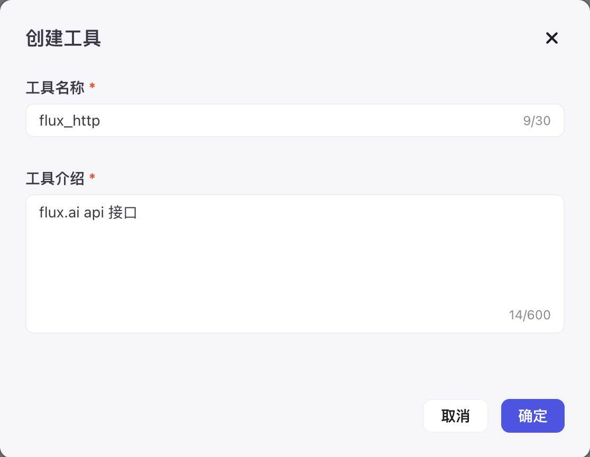
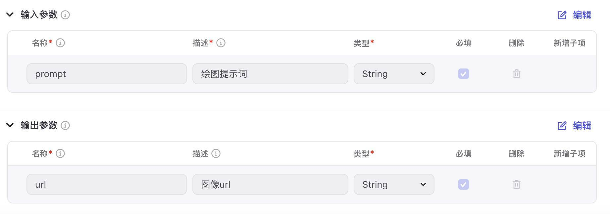
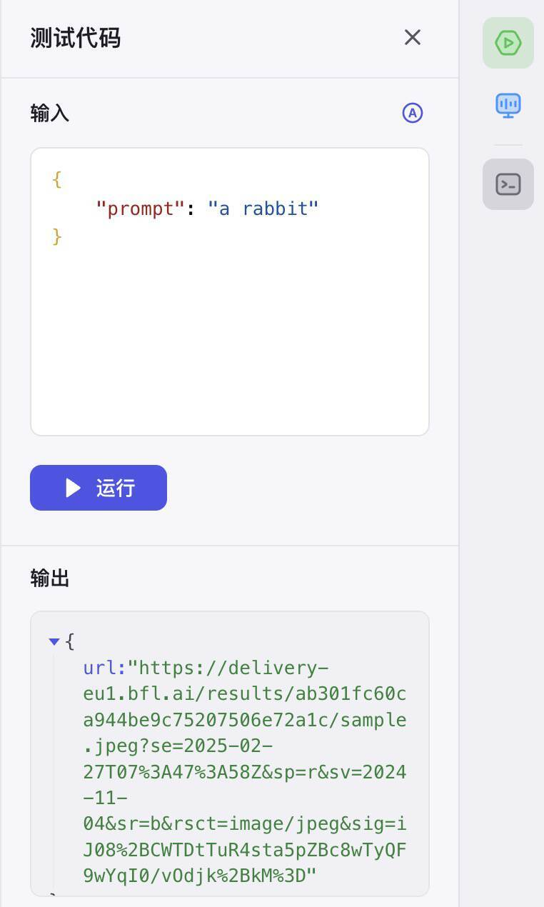
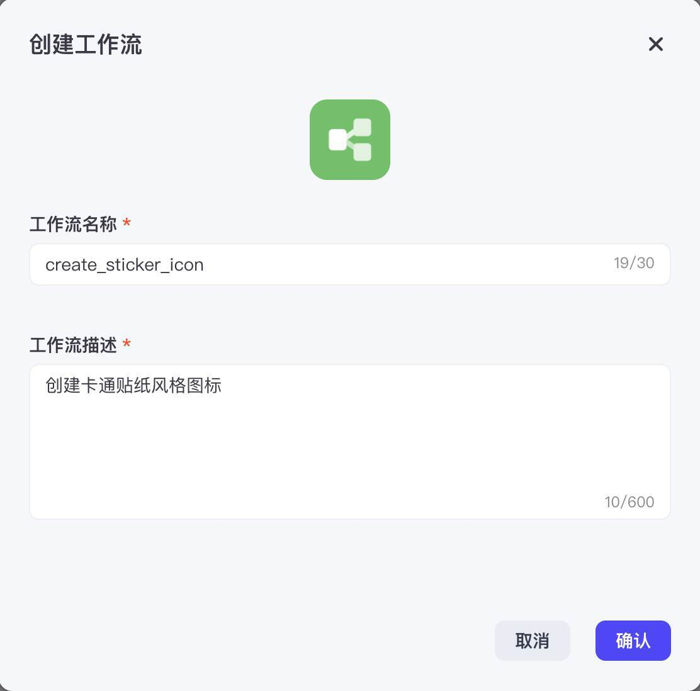
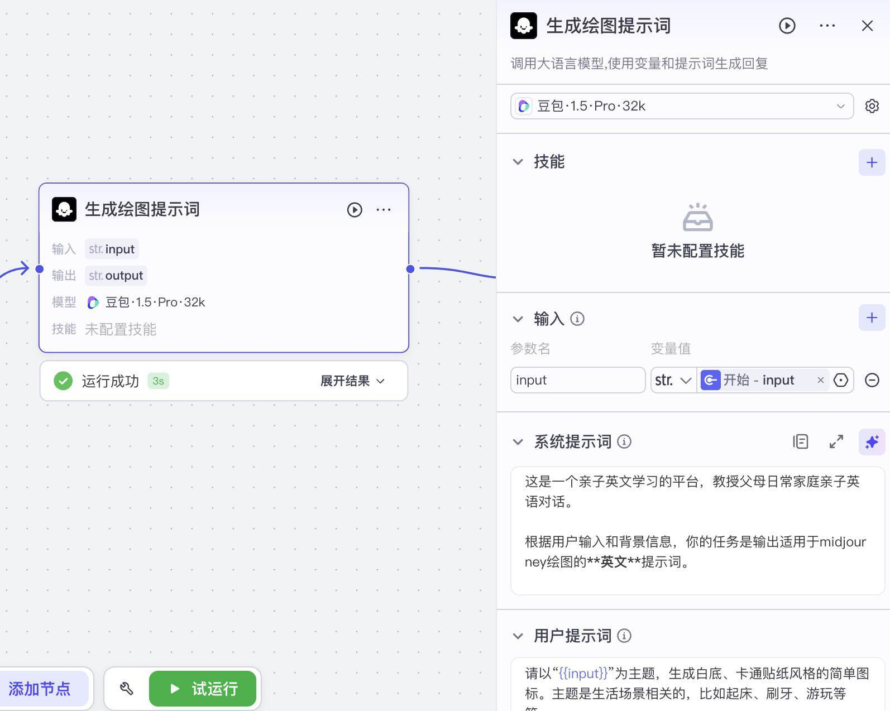
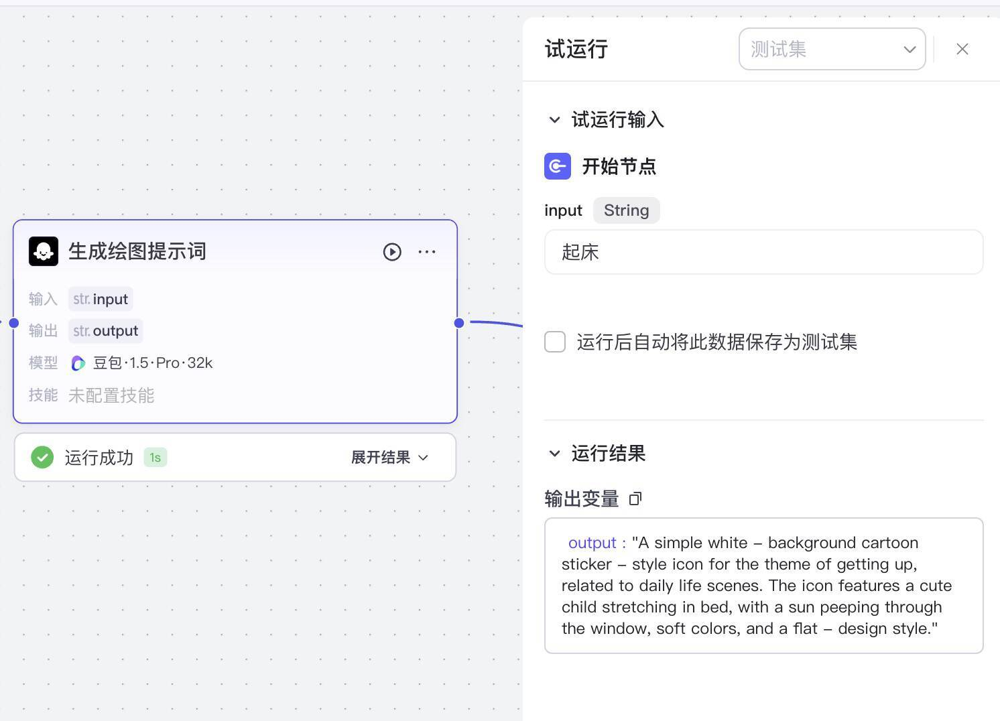
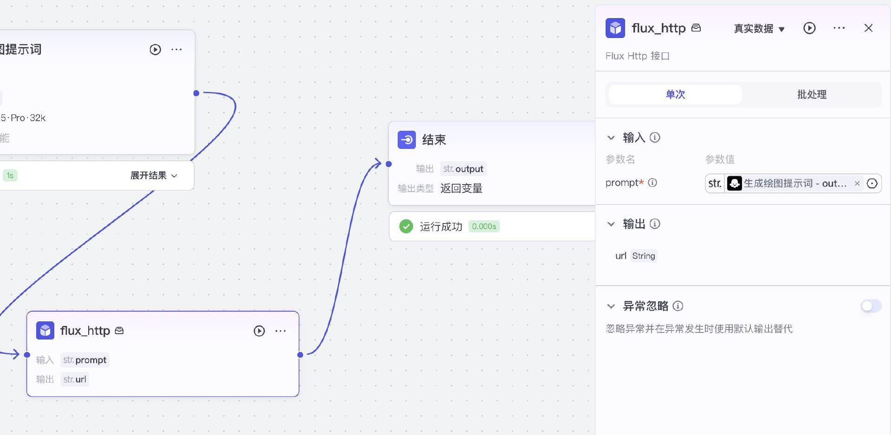
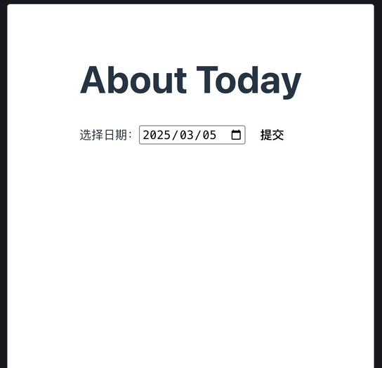

# 08｜提示词工程（二）：如何使用元提示（Meta-Prompt）和动态提示词

你好，我是月影。

在上一节，我们学到了一些基础技巧，来帮助我们撰写和优化提示词，达到优化 AI 反馈结果的目的。而在今天这一节课，我们将讨论两个更高级的优化方法，它们是**元提示（Meta-Prompt）****和****动态提示词**。

## 如何使用元提示（Meta-Prompt）

“元提示”是一种让 AI 写提示词的技巧。顾名思义，就是让一个智能体负责撰写提示词，再将提示词给后续的智能体执行。

这个技巧通常用于不同类型的智能体协作的工作流中。我们看一个实际的例子：



这是我最近开发的 AI 产品“波波熊亲子英语”的小程序界面截图。注意到在每一个例句分类目录里，界面都配了一张图，这张图是用 AI 生成的。

还记得我们在前面课程里使用过 Flux.ai 绘图吗？在这一节，我们继续使用它来绘图。

我们在 Coze 的工作空间中，选择“资源库 > 添加资源 > 新建插件”。



添加 Flux 绘图插件，选择“云侧插件 > 在 Coze IDE 中创建”。

进入 Coze IDE 后，在左侧菜单工具列表点添加按钮创建工具。



创建工具后，在 IDE 编辑器中，切换到“元数据”Tab，设置输入参数和输出参数。



然后切回“代码”Tab，修改代码如下：

```
import { Args } from '@/runtime';
import { Input, Output } from "@/typings/flux_http/flux_http";
/**
  * Each file needs to export a function named `handler`. This function is the entrance to the Tool.
  * @param {Object} args.input - input parameters, you can get test input value by input.xxx.
  * @param {Object} args.logger - logger instance used to print logs, injected by runtime
  * @returns {*} The return data of the function, which should match the declared output parameters.
  * 
  * Remember to fill in input/output in Metadata, it helps LLM to recognize and use tool.
  */
export async function handler({ input, logger }: Args<Input>): Promise<Output> {
  const endpoint = `https://api.bfl.ml/v1`;
  const modelName = 'flux-dev';
  const headers = {
    'Content-Type': 'application/json',
    'x-key': '<你的flux api key>',
  };
  const payload = {
    prompt: input.prompt,
    width: 1024,
    height: 1024,
    steps: 40,
    prompt_upsampling: true,
    seed: 42,
    guidance: 3,
    sampler: 'dpmpp_2m',
    safety_tolerance: 2,
  };
  const res = await fetch(`${endpoint}/${modelName}`, {
    headers,
    method: 'POST',
    body: JSON.stringify(payload),
  });
  const id = (await res.json()).id;
  const resultUrl = `${endpoint}/get_result?id=${id}`;
  do {
    await new Promise((resolve) => setTimeout(resolve, 100));
    const result = await fetch(resultUrl);
    const resultJson = await result.json();
    if (resultJson.status === 'Pending') {
      continue;
    }
    const sample = resultJson.result?.sample;
    if (sample) {
      return { url: sample };
    } else {
      return { url: 'https://res.bearbobo.com/resource/upload/vNg4ALJv/6659895-ox36cbkajrr.png'};
    }
  } while (1);
};
```

将 “< 你的 flux api key>” 替换为有效 key，然后点击右侧测试代码按钮。



添加输入参数，等待一会儿，如果你能看到输出结果里的 url，插件功能就完成了，点击发布就可以了。

我们现在已经使用 Coze 的插件功能实现了一个 Flux.ai 插件，但是它只是提供了通用功能，即根据传入的提示词生成图片。

接下来我们看我们的业务需求，实际上我们需要的是生成卡通贴纸风格的 icon，需要生成类似如下的提示词：

```
Cartoon sticker-style icon, pure white background, minimalistic and clean design, showing a cheerful child sitting by a tent or roasting marshmallows over a campfire, surrounded by playful details like a backpack, trees, and a starry sky, warm and adventurous atmosphere, colorful but simple elements, family-friendly aesthetic.
```

接下来我们回到资源库，创建工作流。



在工作流编排界面，首先添加一个大模型节点，用来生成提示词。



模型选择豆包 1.5 Pro，系统提示词和用户提示词如下：

> 系统提示词

```
这是一个亲子英文学习的平台，教授父母日常家庭亲子英语对话。
根据用户输入和背景信息，你的任务是输出适用于midjourney绘图的**英文**提示词。
```

> 用户提示词

```
请以“{{input}}”为主题，生成白底、卡通贴纸风格的简单图标。主题是生活场景相关的，比如起床、刷牙、游玩等等。
```

我们可以将它和开始、结束节点连接，试运行一下：



如果正确的话，会看到它输出的提示词：

```
A simple white - background cartoon sticker - style icon for the theme of getting up, related to daily life scenes. The icon features a cute child stretching in bed, with a sun peeping through the window, soft colors, and a flat - design style.
```

接下来，我们添加一个插件节点，左侧菜单选择“添加节点 > 插件 > 资源库工具”，把刚才创建的 Flux 绘图插件加进来。



然后再次试运行，就可以生成我们想要的结果了，比如“起床”，生成的图标可能是：


可以看到，这就是我们想要的结果。

在这个过程中，我们用豆包模型生成 Flux 模型需要的提示词，从而让 Flux 模型更好地生成结果，这个模式就是“元提示”模式。

## 如何使用动态提示词

在有些场景中，我们需要动态生成提示词，比如在波波熊亲子英语产品，我们给用户生成场景对话的时候，会把当天的日期、节日之类的信息考虑进去，那么我们就要在用户调用大模型的时候将这些内容包含在提示词中。

另外还有更复杂的场景，比如我们针对用户提出的问题类型，采用不同的 AI 节点来处理，每一个节点用来处理一类特定问题，这种做法叫做“多专家模型（MoE）”。

> 多专家模型（Mixture of Experts, MoE）是一种深度学习架构，它通过引入多个专家模型（即多个子模型）来解决一个任务。每个专家模型都有不同的专长，而在实际任务中，系统会根据输入数据选择最合适的专家模型进行处理。通过这种方式，可以在模型的不同部分灵活地分配计算资源，从而提高效率和性能。这里，我们借鉴了多专家模型的叫法，但实际上我们的多专家模型是应用层的技术，和模型层面上的并不相同。

使用动态提示词有多种办法，像 Coze 中的智能体，因为本身支持自定义参数，所以我们可以直接通过传参数来实现动态提示词。

而其他平台的 API，大部分不提供自定义参数，但是没有关系，我们可以用我们前端比较熟悉的模板引擎技术来实现提示词的动态编译，这种方法更加通用。

下面我们就通过一个简单的例子来讲讲使用模版引擎实现动态提示词。

我们先用 Trae 创建一个 Vue 项目 “About Today”。

然后在终端安装 nunjucks 引擎：

```
pnpm i nunjucks
```

接下来我们需要配置.env.local 文件，为了更好的扩展性，我们这次将 API_KEY、BASE_URL 和 MODEL 都写入配置。

```
VITE_API_KEY=sk-qi2oJBN**********txbp4
VITE_BASE_URL=https://api.moonshot.cn/v1/chat/completions
VITE_AI_MODEL=moonshot-v1-8k
```

接着创建一个 DatePicker 组件：

> src/components/DatePicker.vue

```
<script setup lang="ts">
import { ref, onMounted } from "vue";
const selectedDate = ref('');
const props = defineProps({
    value: {
        type: String,
        default: '',
    },
});
onMounted(() => {
    selectedDate.value = props.value;
});
const emit = defineEmits(["dateUpdate"]);
const handleDateChange = () => {
    emit("dateUpdate", selectedDate.value);
};
</script>
<template>
    <div>
        <label for="date">选择日期：</label>
        <input type="date" id="date" v-model="selectedDate" @change="handleDateChange"/>
    </div>
</template>
```

再创建一个提示词模板文件：

> src/tpl/prompt.tpl.ts

```
export default `
今天的日期是 {{today}}
针对今天的日期、节日、节气等信息，整理出以下内容：
1. 今天的日期如果是特殊节日，介绍节日的文化和意义，以及节日的历史和背景。
2. 今天的日期如果是特殊节气，介绍节气的文化和意义，以及节气的历史和背景。
3. 今天的日期如果在历史上的重要事件中，介绍该事件的文化和意义，以及该事件的历史和背景。
`;
```

最后修改 App.vue 文件：

```
<script setup lang="ts">
import DatePicker from "./components/DatePicker.vue";
import { ref } from "vue";
import nunjucks from "nunjucks";
import systemPrompt from "./tpl/prompt.tpl.ts";
const today = ref(new Date().toISOString().split("T")[0]);
const reply = ref("");
const dateUpdate = (date: string) => {
  today.value = date;
};
const submit = async () => {
  const apiKey = import.meta.env.VITE_API_KEY;
  const endpoint = import.meta.env.VITE_BASE_URL;
  const model = import.meta.env.VITE_AI_MODEL;
  const headers = {
    'Content-Type': 'application/json',
    Authorization: `Bearer ${apiKey}`,
  };
  const prompt = nunjucks.renderString(systemPrompt, {
    today: today.value,
  });
  const response = await fetch(endpoint, {
    method: 'POST',
    headers: headers,
    body: JSON.stringify({
      model,
      messages: [
        { role:'system', content: prompt},
        { role: 'user', content: "介绍今天相关的知识" }
      ],
      stream: true,
    })
  });
  const reader = response.body?.getReader();
    const decoder = new TextDecoder();
    let done = false;
    let buffer = '';
    reply.value = '';
    while (!done) {
      const { value, done: doneReading } = await (reader?.read() as Promise<{ value: any; done: boolean }>);
      done = doneReading;
      const chunkValue = buffer + decoder.decode(value);
      const lines = chunkValue.split('\n').filter((line) => line.startsWith('data: '));
      for (const line of lines) {
        const incoming = line.slice(6);
        if(incoming === '[DONE]') {
          done = true;
          break;
        }
        try {
          const data = JSON.parse(incoming);
          const delta = data.choices[0].delta.content;
          if(delta) reply.value += delta;
        } catch(ex) {
          buffer += incoming + '\n';
        }
      }
    }
};
</script>
<template>
  <div class="container">
    <h1>About Today</h1>
    <div class="panel">
      <DatePicker @date-update="dateUpdate" :value="today"/>
      <button @click="submit">提交</button>
    </div>
    <div class="output">
      <div>{{ reply }}</div>
    </div>
  </div>
</template>
<style scoped>
.container {
  display: flex;
  flex-direction: column;
  align-items: start;
  justify-content: start;
  height: 100vh;
  font-size: .85rem;
}
.panel {
  display: flex;
  flex-direction: row;
  align-items: center;
  justify-content: start;
  width: 100%;
}
.input {
  width: 200px;
}
.output {
  margin-top: 10px;
  min-height: 300px;
  width: 100%;
  text-align: left;
}
button {
  padding: 0 10px;
  margin-left: 6px;
}
</style>
```

这样就实现了小应用 About Today。

我们来简单看一下关键代码。

日期选择器就是一个普通的 Vue 组件，通过 dateUpdate 事件将日期向上传递给父级组件，这里就不详细介绍了。

最主要的地方就是后面这部分。

```
const prompt = nunjucks.renderString(systemPrompt, {
  today: today.value,
});
```

我们通过 [nunjucks]() 模板引擎对系统提示词进行解析，而系统提示词设定在`src/tpl/prompt.tpl.ts`中，内容如下。

```
export default `
今天的日期是 {{today}}
针对今天的日期、节日、节气等信息，整理出以下内容：
1. 今天的日期如果是特殊节日，介绍节日的文化和意义，以及节日的历史和背景。
2. 今天的日期如果是特殊节气，介绍节气的文化和意义，以及节气的历史和背景。
3. 今天的日期如果在历史上的重要事件中，介绍该事件的文化和意义，以及该事件的历史和背景。
`;
```

最后，我们可以选择日期，点击提交按钮，看一下执行效果：



## 要点总结

这节课里，我们学习了两种比较高级的优化 AI 反馈结果的技巧，分别是元提示和动态提示词，合理使用这两种技巧，可以有效提升 AI 反馈结果质量。甚至用推理能力较弱的 AI，我们也能实现推理能力较强的 AI 的效果。

在实际 AI 应用中，这两种方法都是非常常用且有效的方法，同学们应当重点掌握。

## 课后练习

我们这一节课的元提示例子，一次输入只能生成一张图片，请思考能否修改代码或流程，让我们能够输入多个主题，同时生成多张图片。有兴趣的同学可以动手做一下，将你们的心得分享到评论区。

在第二个例子里，我们使用 nunjucks 模版引擎来实现动态提示词模板，nunjucks 过去是 Web 开发中一种比较常用的服务端模板引擎，可能很多同学曾经使用过。除了 nunjucks 外，你还使用过哪些模板引擎？可以尝试将 nunjucks 替换为其他模板引擎，再试试看效果。

---
来源：极客时间
链接：https://time.geekbang.org/column/article/874027
日期：2026-05-12
