# 27｜如何创建AI智能体管理笔记和收集信息（一）

你好，我是月影。

从这一节课开始，我们进入新的单元，将讨论如何借助 AI 来全面提升个人能力。

在这个时代，AI 给我们带来的是全新的机会，不仅仅是狭义的工作机会和工作能力，还包括个人成长。作为开发者，我们和不懂技术的普通人相比，有一个得天独厚的优势，那就是我们不仅能够使用现成的 AI 工具，还能够利用技术，为自己的学习和成长打造最适合的效率工具，从而节省学习时间和加速个人成长。

这节课，我们先从将 AI 用于知识的获取和收集讲起，通过一个智能收藏助手的例子来看看 AI 能够如何帮助我们成长。

## 基于 AI 的智能收藏助手

我们先看一下具体产品形态，它是一个智能体，作用是帮我们整理网页、转写英文资料、记笔记以及管理资料。


这个智能收藏助手有好几个功能，分别是：

- 当你发一个网址给助手，它会将网址保存起来。
- 当你发一个英文网站给助手并让它转写，它会将其转写成中文笔记再保存。
- 当你想记录一段笔记时，可以将内容发给它，内容可以是文本、图片或语音，助手都能将之记录下来。
- 助手会给这些内容打上标签，所以你可以让助手帮你从收藏中整理某些类型的内容并输出。

接下来我们一一来看这些内容的具体实现。

## 收藏网址

接下来，我们实现收藏网址功能的工作流，这个具体逻辑有点复杂，我们先来拆解一下：

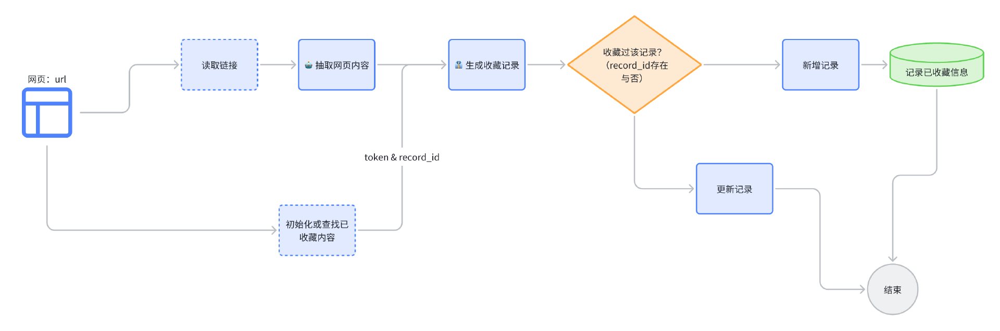

看上面的流程图，我们首先读需要取链接并抽取整理网页内容。同时，由于收藏夹需要去重内容，而且存放收藏内容的数据表格在第一次使用也需要初始化，所以我们还要调用初始化或查找已收藏内容的子流程。接着，我们将整理好的网页内容以及查找到的已收藏 record_id（如有）结合生成收藏记录。然后通过已收藏 record_id 判断是否收藏过该记录，如果已收藏过，则更新记录，否则新建一条记录，并更新已收藏数据。最后结束收藏流程。

注意在这个过程里面，一共有两个子流程，我们先来分别实现一下。

### 链接读取子流程

首先我们需要一个读取网页链接的子流程，这是因为虽然 Coze 提供了读取链接的插件，但是因为一些网站的限制，这个插件不一定能很好地工作，另外如果读取的资源是飞书文档，我们有更好的方式获取内容。

因此，这里我实现了一个增强的读取网页链接的子流程 **LinkReadPro**，它的工作流逻辑如下图所示。

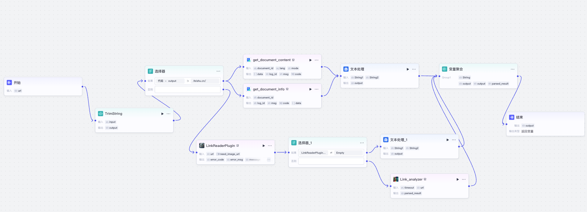

首先，在开始节点中，我们设置输入参数 url。

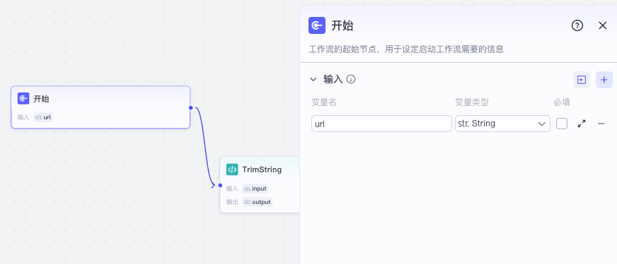

接着我们在这里做一个细节上的处理，因为我发现有时候智能体发给工作流的 url 参数前后会多余空白符号，这个可以通过代码节点处理掉。

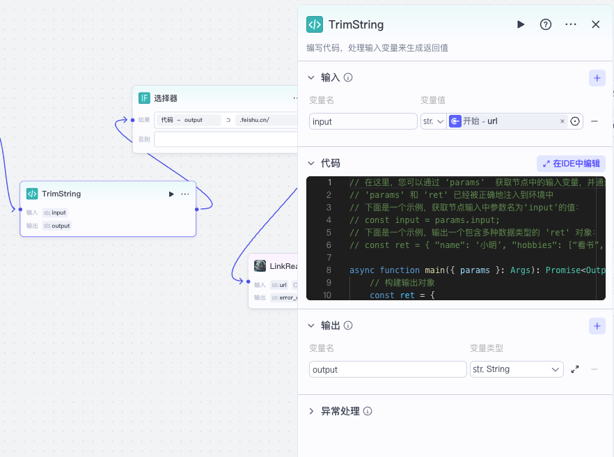

具体代码逻辑如下：

```
async function main({ params }: Args): Promise<Output> {
    // 构建输出对象
    const ret = {
        output: params.input.trim()
    };
    return ret;
}
```

接着是一个条件分支，我们通过 url 中的域名来判断是飞书文档还是其他链接。

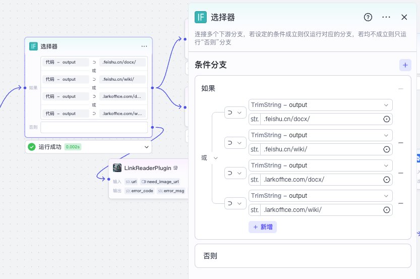

当网址包含  `*.feishu.cn/docx/` 或  `*.feishu.cn/wiki/` 或  `*.larkoffice.com/docx/` 或  `*.larkoffice.com/wiki/` 时，说明该内容是飞书文档，此时走飞书文档内容读取的分支。否则说明是普通链接，走普通链接读取分支。

接下来，我们先看飞书文档的读取，我们添加插件，搜飞书文档，选择官方飞书文档插件中的  `get_document_conten` 和  `get_document_info` 插件，分别获取文档正文和包括文档标题在内的文档信息。

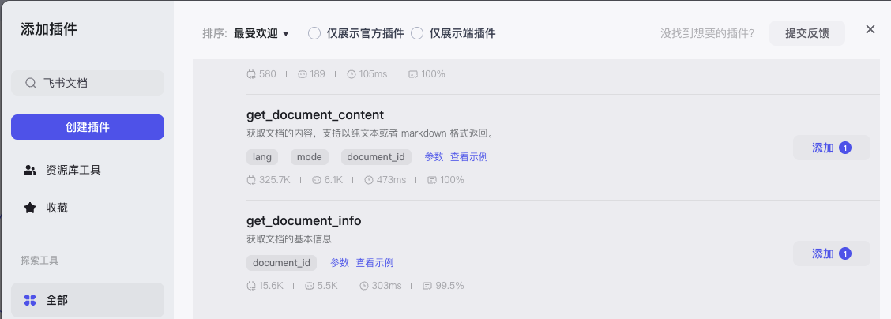

我们先把去掉首尾空白的文档 url 作为 document_id 分别传入两个飞书插件。

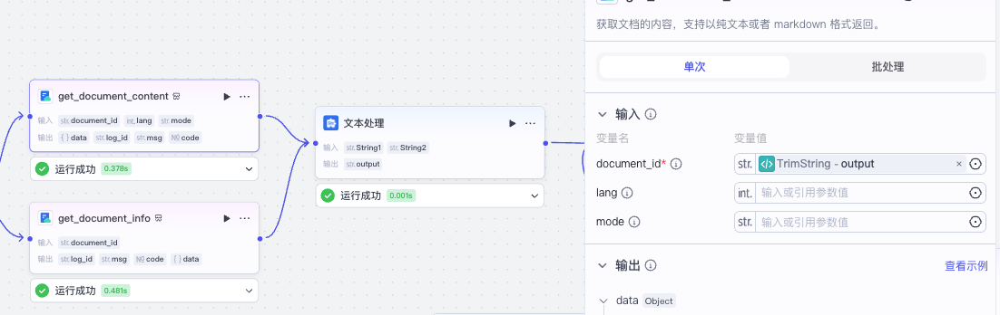

然后进行文本拼接处理。

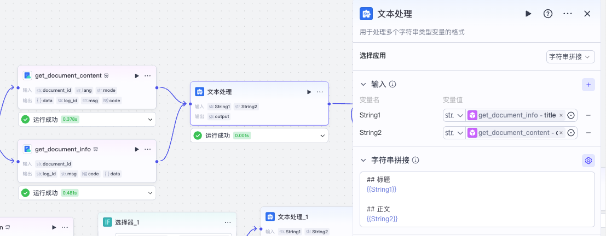

接下来，我们处理普通链接的分支。

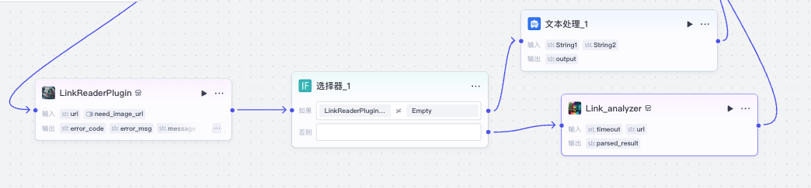

我们先尝试用官方的 LinkReaderPlugin 去获取链接内容，有时候它获取不到某个网页的内容，此时，我们再尝试用 Link_analyzer 这个第三方插件去获取内容，这样可以增加成功率。

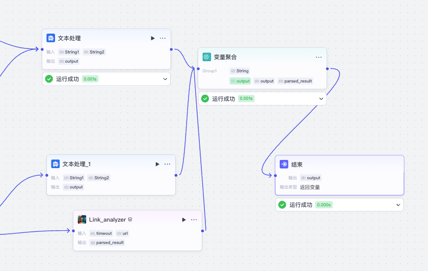

最后我们将两个分支的三个变量聚合起来，输出结果，这样就完成了链接读取的子工作流。

### 初始化或查找已收藏内容子流程

接下来我们实现第二个子工作流，这个工作流负责初始化收藏表以及根据 url 查找已收藏内容，防止重复收藏。

首先我们创建一个数据库表 fav_table，但是我们只用这个表来记录以收藏的 url，真正的收藏信息我们不用数据库表来保存，而是使用飞书多维表格来实现。

之所以这么做，是因为飞书多维表格对使用者更为友好，而且还天然支持各种视图，方便我们直接管理收藏内容。但是飞书多维表格毕竟不是数据库，所以查询能力弱一些，因此将飞书多维表格和数据库结合，能同时结合两者的优点。

我们创建一个新的工作流 **AI_Favorites_Init_or_Updated**，功能是**初始化或检查已收藏网址**。

它的流程如下：

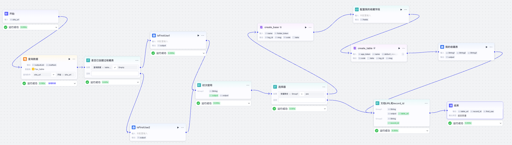

看起来流程稍微有点复杂，不过不着急，我们一步一步来。

首先要创建数据库表 fav_table。

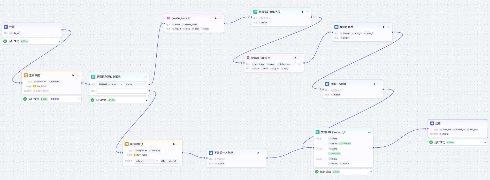

添加三个字段分别如下。

- table_url ：自动创建的多维表格文档 URL。
- record_id：创建的多维表格中收藏记录的 ID，用于准确更新数据。
- site_url：收藏网址，在数据库表中每个用户下唯一。

接着我们给开始节点设置输入变量 site_url，然后不用查询条件，先查一下数据库表，看 table_url 是否是空的。

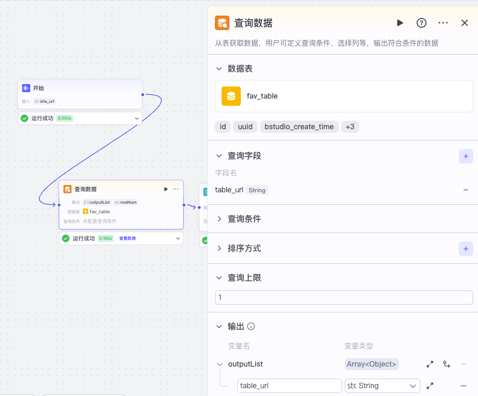

这里我们将查询条件设置为空，查询上限设置为 1，然后查询数据，如果内容不存在，说明该用户是第一次使用收藏助手，需要创建多维表格，否则说明已经创建过表格。

接着我们根据是否返回 table_url，走两个分支。

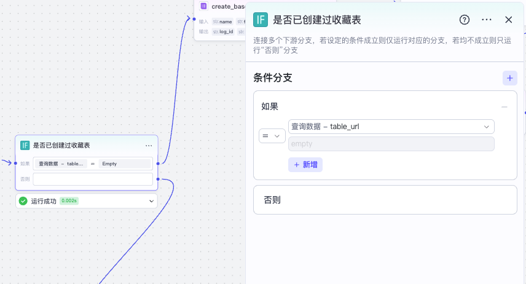

如果 table_url 为空，那么我们先通过多维表格官方插件的 **create_base** 创建一个多维表格文件。

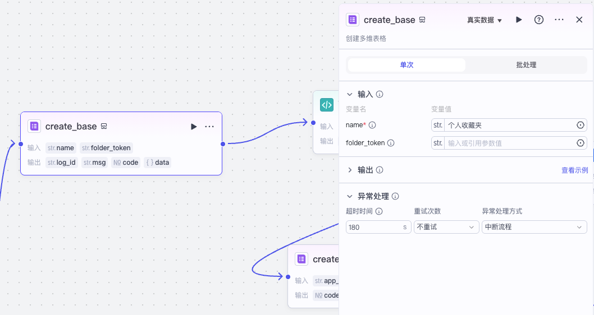

然后我们通过代码节点配置多维表格收藏字段，并在多维表格文件中用官方插件 **create_table** 创建一个多维表格。

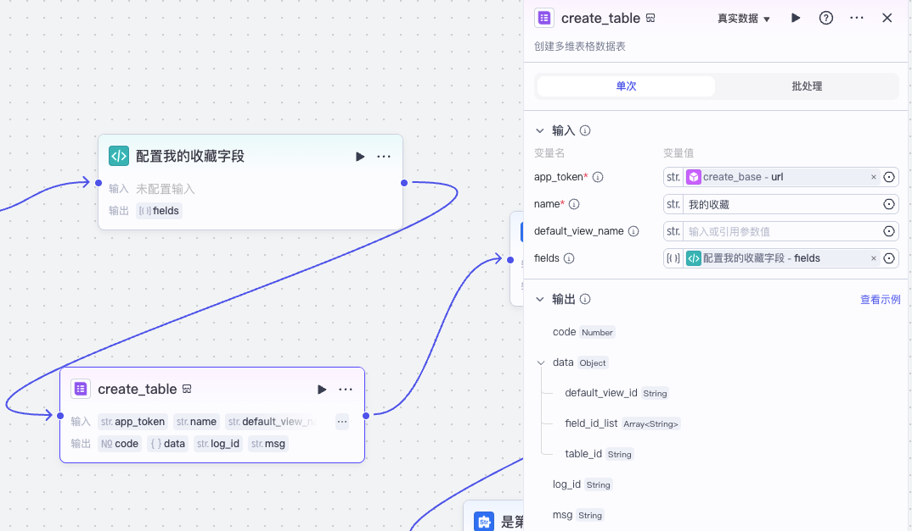

代码节点配置收藏字段的代码如下。

```
async function main({ params }: Args): Promise<Output> {
    // 构建输出对象
    const ret = {
        fields : [
            {
                "field_name": "内容",
                "type": 15 // 超链接
            },
            {
                "field_name": "摘要",
                "type": 1 // 多行文本
            },
            {
                "field_name": "平台",
                "type": 3 // 单选
            },
            {
                "field_name": "标签",
                "type": 4 // 多选
            },
            {
                "field_name": "收藏时间",
                "type": 5 // 日期（时间戳）
            },
            {
                "field_name": "状态",
                "type": 3 // 单选
            },
        ]
    };
    return ret;
}
```

接着我们就可以用文本处理节点把收藏表的完整 url 拼接出来。

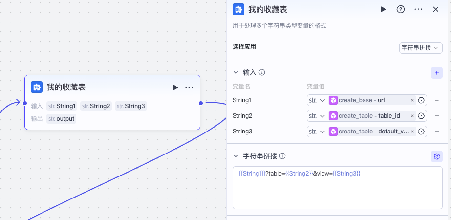

因为这个分支是第一次使用收藏夹助手，我需要将这信息也输出给结束节点，它对后续工作流有用，所以我用一个文本处理节点，生成一个常量 yes。

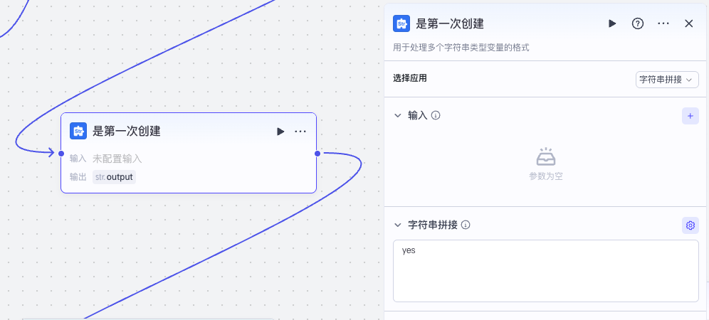

至此这个分支就完成了。

然后是 table_url 不为空的分支。这时我们先通过 site_url 查一下记录在数据库表里是否存在。

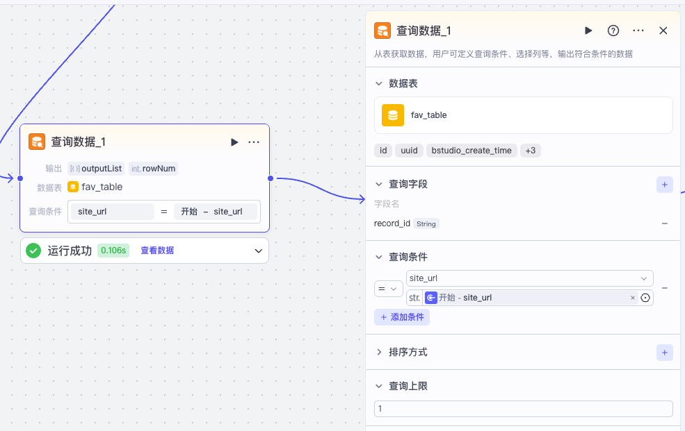

而走这个分支表示不是第一次使用收藏助手，我们同样用文本处理节点记一个常量 no。

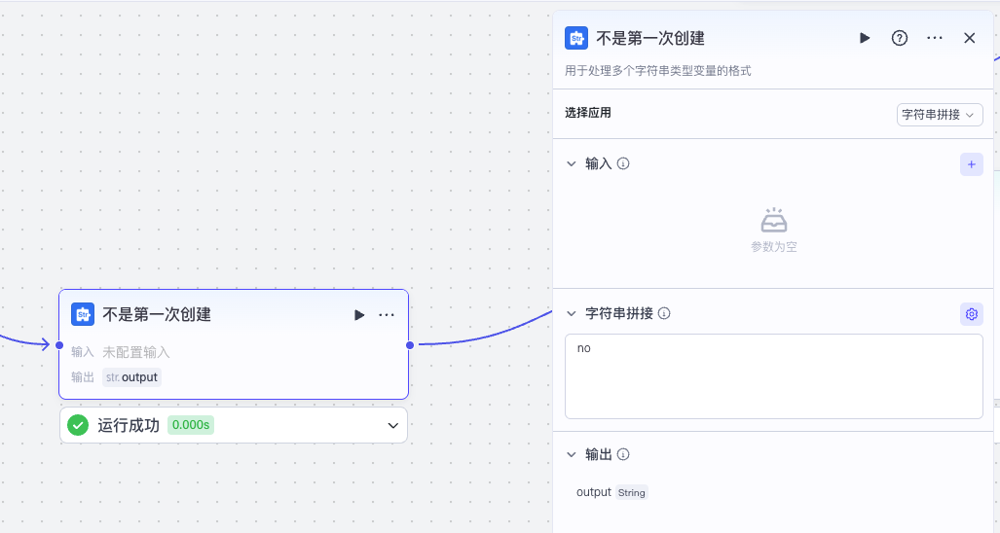

接着我们将两个分支聚合起来。

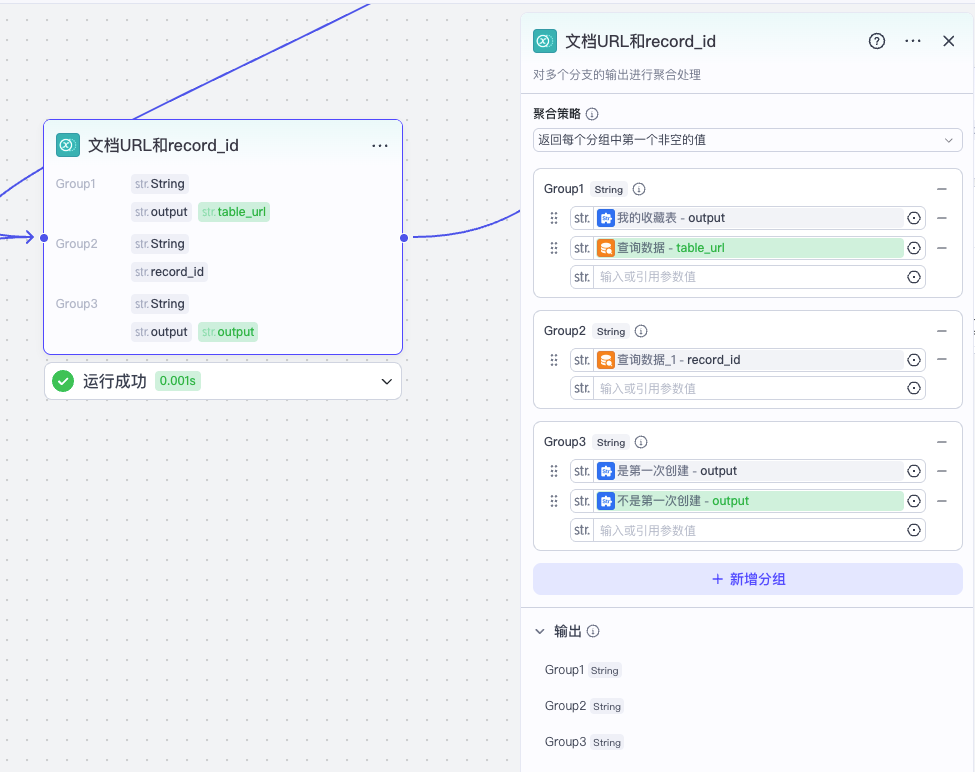

这里 Group1 是多维表格的 URL；Group2 是 record_id，如有，则表示网址已经收藏过；Group3 是一个标记，表示是否第一次使用收藏助手，它的值可能是 yes 或 no。

最终我们将数据设置给结束节点，测试后将工作流发布即可。

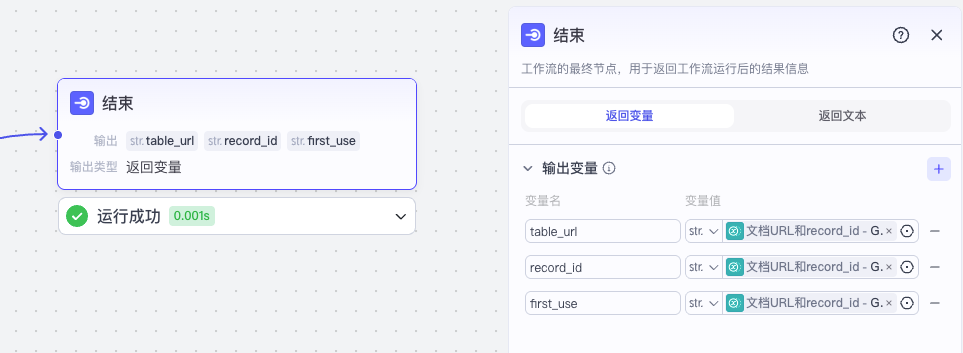

### 收藏网址主流程

接下来就是收藏网址的主体流程了：

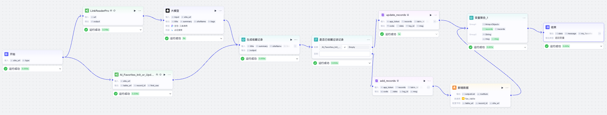

我们一步步来看。

首先开始节点接受两个参数，site_url 必填，type 非必填，默认值为“网页”。

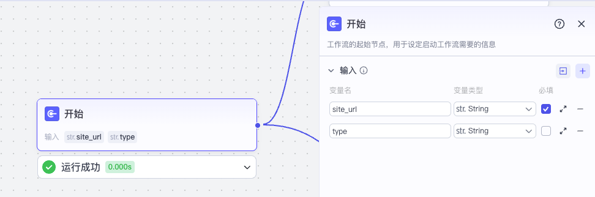

type 参数我们暂时用不着，但是这个保留，为了后续转写和笔记功能可以复用。

接着我们并行两个流程，一个是读取网页链接并用大模型提取内容，一个是初始化或查找是否已收藏该网页。

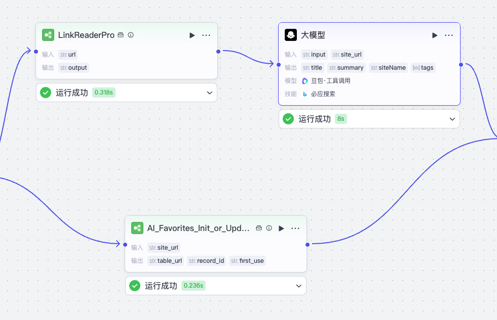

注意这个提取内容的大模型节点，我们直接用默认的豆包：

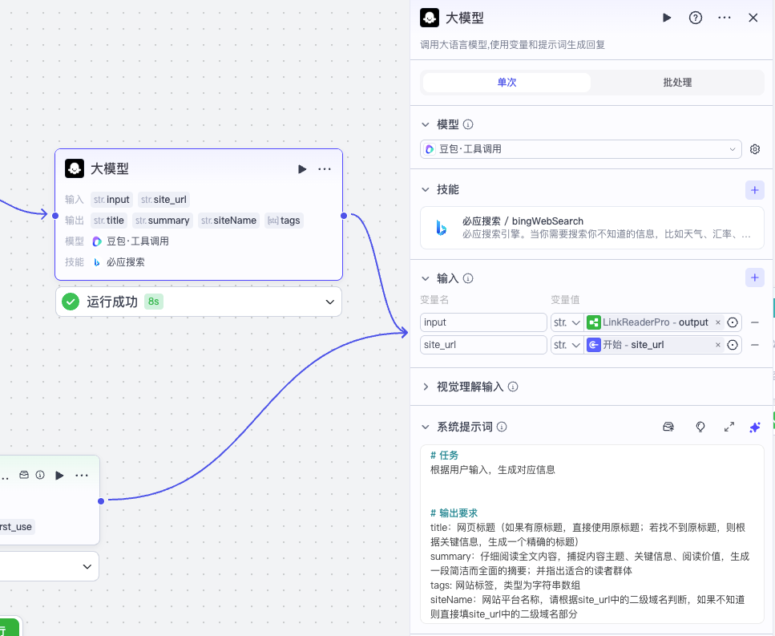

系统提示词和用户提示词分别如下：

> 系统提示词

```
# 任务  
根据用户输入，生成对应信息  
# 输出要求  
title：网页标题（如果有原标题，直接使用原标题；若找不到原标题，则根据关键信息，生成一个精确的标题）  
summary：仔细阅读全文内容，捕捉内容主题、关键信息、阅读价值，生成一段简洁而全面的摘要；并指出适合的读者群体  
tags: 网站标签，类型为字符串数组
siteName：网站平台名称，请根据site_url中的二级域名判断，如果不知道则直接填site_url中的二级域名部分
```

用户提示词：

```
# 内容
{{input}}
# 来源
{{site_url}}
```

内容提取完成之后，我们用一个代码节点生成收藏记录，并且根据 AI_Faviors_Init_or_Updated 工作流中返回的 record_id 是否存在来决定是新增还是更新记录。

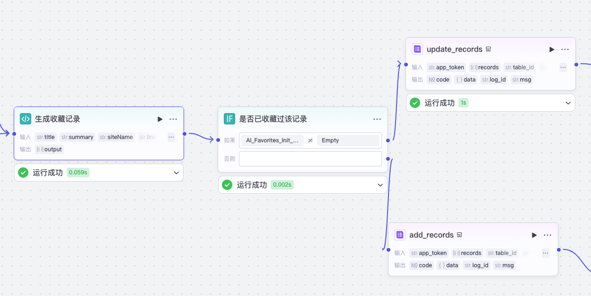

生成收藏记录的代码节点代码逻辑如下：

```
async function main({ params }: Args): Promise<Output> {
    const {title, summary, siteName, link, tags, record_id, status} = params;
    const fields = {
        "内容": {
            link,
            text: title,
        },
        "摘要": summary,
        "平台": siteName,
        "标签": tags,
        "收藏时间": Date.now(),
        "状态": status || '网页',
    };
    const output0: any = {fields: JSON.stringify(fields)};
    if(record_id) output0.record_id = record_id;
    // 构建输出对象
    const ret = {
        "output": [
            output0,
        ]
    };
    return ret;
}
```

我们根据 record_id 是否存在的不同情况，使用飞书多维表格官方的 update_records 插件或 add_records 插件来更新收藏记录数据到多维表格，如果是 add_records，那么我们还要将新增数据写入数据库，这个可以通过新增数据节点，配置数据库表 fav_table 和数据字段来实现。

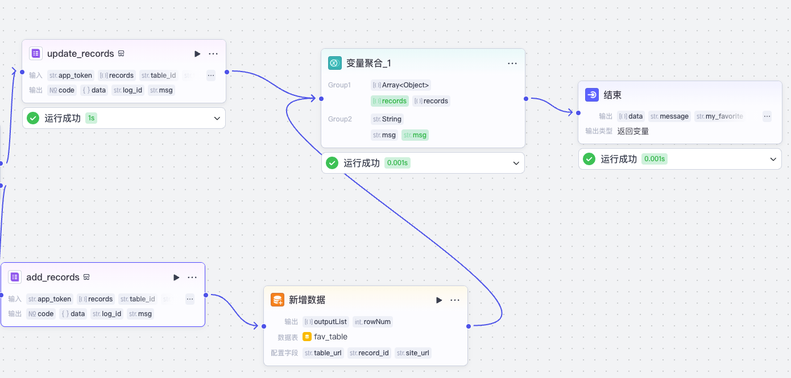

最后我们将结果通过结束节点输出，就完成了智能收藏助手收藏网页的核心工作流。

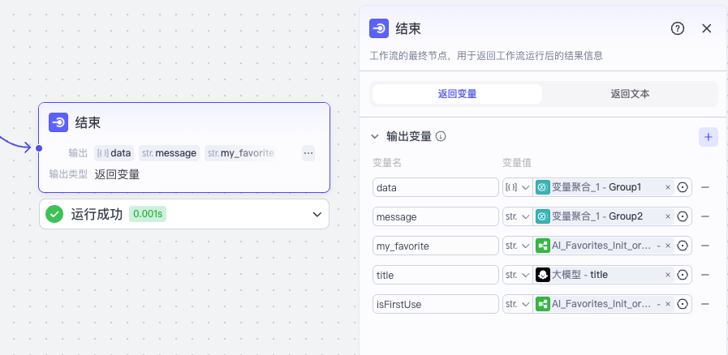

## 要点总结

到此为止，我们的智能收藏主题流程就完成了，它比较复杂，可能是我们课程到目前为止遇到的最复杂的工作流。

但是在这里，很关键的一点是，我们采用了**自顶向下的思路来设计和拆解流程**，你会发现我将它拆成了三个流程，其中**链接读取子流程、初始化或查找收藏内容子流程**成为两个独立的工作流，这样方便我们独立开发和测试，然后我们再通过收藏网页主流程将它们整合在一起。

这是一种非常重要的 AI 工作流设计思想，希望大家能够通过学习这节课牢牢掌握。

智能收藏助手的内容还未结束，我们才实现了基础的网页收藏功能。下一节课，我们将继续讨论，在这个网页收藏工作流的基础上，逐步实现其他功能，最终实现这个完整应用。

## 课后练习

我们目前只是实现了收藏网页核心工作流，并没有将它和任何智能体绑定，在后续实现其他功能后，我会最后创建智能体，实现完整的助手应用。但是你可以在这一节课后自己提前创建一个智能体，先试用这个收藏网页的核心功能效果。将你的创建过程和体验分享到评论区吧。

---
来源：极客时间
链接：https://time.geekbang.org/column/article/883359
日期：2026-05-12
