# 32｜Vibe Coding：使用Trae Builder开发实战项目（二）

你好，我是月影。

上节课，我们通过 Node Module Builder 创建了项目 CEFR-analyzer。

这一节课，我们将在 AI 创建代码的基础上，具体深入到业务中，去迭代开发，从而实现我们想要的具体功能。

## AI 辅助下的业务开发具体过程

还记得上一节课 AI 创建的项目结构吗？

```
📁 src/                # 核心源码
├── index.ts           # 模块入口
├── vocabulary/        # 词汇表相关
│   └── dict.ts        # CEFR词汇字典
├── analyzer/          # 分析器模块
│   ├── index.ts       # 分析器入口
│   └── types.ts       # 分析器类型定义
├── utils/             # 工具函数
├── services/          # 外部服务封装
└── types/             # 全局类型定义
📁 tests/              # 单元测试文件夹
├── analyzer.test.ts   # 分析器测试
└── utils.test.ts      # 工具函数测试
📁 .trae/              # 项目配置和记忆
├── project_rules.md   # 项目规则
└── memory_bank/       # 项目记忆库
```

现在我们可以进入具体业务逻辑。我们大致看一下具体代码逻辑，主要是 analyzer 和 utils 这两部分。首先是 analyzer：

> ./src/analyzer/index.ts

```
import winkNLP from 'wink-nlp';
import model from 'wink-eng-lite-web-model';
import {
  CEFRLevel,
  ICEFRAnalysisResult,
  IAnalyzerOptions,
  type PartOfSpeech,
  IWordWithPos,
} from '../types';
import { vocabularyManager } from '../vocabulary';
import { ITextAnalyzer, IWordProcessingResult } from './types';
/**
 * 基于wink-nlp的CEFR文本分析器
 * 用于分析文本中各CEFR级别单词的分布
 */
export class CEFRTextAnalyzer implements ITextAnalyzer {
  private nlp: any;
  /**
   * 创建分析器实例
   */
  constructor() {
    // 初始化wink-nlp
    this.nlp = winkNLP(model);
    // 确保词汇表已初始化
    vocabularyManager.initialize();
  }
  /**
   * 分析文本中的CEFR级别单词分布
   * @param text 要分析的文本
   * @param options 分析选项
   * @returns 分析结果
   */
  public analyze(text: string, options?: IAnalyzerOptions): ICEFRAnalysisResult {
    const defaultOptions: IAnalyzerOptions = {
      caseSensitive: false,
      includeUnknownWords: true,
      analyzeByPartOfSpeech: false,
    };
    const mergedOptions = { ...defaultOptions, ...options };
    // 使用wink-nlp处理文本
    const doc = this.nlp.readDoc(text);
    // 提取所有单词（过滤掉标点符号和数字）
    const tokens = doc.tokens().filter((token: any) => {
      return token.out(this.nlp.its.type) === 'word' && !token.out(this.nlp.its.stopWordFlag);
    });
    // 处理每个单词，获取其CEFR级别
    const processedWords: IWordProcessingResult[] = [];
    const uniqueWords = new Set<string>();
    const levelCounts: Record<CEFRLevel, number> = {
      a1: 0,
      a2: 0,
      b1: 0,
      b2: 0,
      c1: 0,
      c2: 0,
    };
...
    // 返回分析结果
    return {
      totalWords,
      levelCounts,
      levelPercentages,
      unknownWords,
      unknownWordsList: mergedOptions.includeUnknownWords ? [...unknownWordsList] : [],
    };
  }
  /**
   * 获取文本中指定CEFR级别的单词列表
   * @param text 要分析的文本
   * @param level CEFR级别
   * @param options 分析选项
   * @returns 指定级别的单词列表（包含词性）
   */
  public getWordsAtLevel(
    text: string,
    level: CEFRLevel,
    options?: IAnalyzerOptions
  ): IWordWithPos[] {
    // 通过analyze方法获取分析结果，确保includeUnknownWords选项为false，因为我们只关心特定级别的单词
    const analysisResult = this.analyze(text, {
      ...options,
      includeUnknownWords: false, // 不需要未知单词列表
    });
    // 直接返回指定级别的单词列表
    return analysisResult.wordsAtLevel[level];
  }
  /**
   * 获取文本的CEFR级别分布统计
   * @param text 要分析的文本
   * @param options 分析选项
   * @returns 各级别单词数量的统计
   */
  public getLevelDistribution(text: string, options?: IAnalyzerOptions): Record<CEFRLevel, number> {
    const result = this.analyze(text, options);
    return result.levelPercentages;
  }
  /**
   * 将wink-nlp的词性映射到我们的词性类型
   * @param winkPos wink-nlp的词性标记
   * @returns 映射后的词性，如果无法映射则返回undefined
   */
  private mapPartOfSpeech(winkPos: string): PartOfSpeech | undefined {
    // wink-nlp使用Penn Treebank词性标记
    // 这里将其映射到我们的词性类型
    const posMapping: Record<string, string> = {
      NN: 'noun', // 名词
      NNS: 'noun', // 复数名词
      NNP: 'noun', // 专有名词
      NNPS: 'noun', // 复数专有名词
      VB: 'verb', // 动词原形
      VBD: 'verb', // 过去式动词
      VBG: 'verb', // 现在分词
      VBN: 'verb', // 过去分词
      VBP: 'verb', // 非第三人称单数现在时
      VBZ: 'verb', // 第三人称单数现在时
      JJ: 'adjective', // 形容词
      JJR: 'adjective', // 比较级形容词
      JJS: 'adjective', // 最高级形容词
      RB: 'adverb', // 副词
      RBR: 'adverb', // 比较级副词
      RBS: 'adverb', // 最高级副词
      DT: 'determiner', // 限定词
      PRP: 'pronoun', // 人称代词
      PRP$: 'pronoun', // 所有格代词
      WP: 'pronoun', // wh-代词
      WP$: 'pronoun', // 所有格wh-代词
      IN: 'preposition', // 介词
      CC: 'conjunction', // 并列连词
      UH: 'interjection', // 感叹词
    };
    return posMapping[winkPos] as PartOfSpeech;
  }
}
// 导出分析器实例
export const cefrAnalyzer = new CEFRTextAnalyzer();
```

我们先看 analyzer.ts，这个代码并不复杂，它实现了一个 CEFRTextAnalyzer 类，这个类继承 ITextAnalyzer 接口，有三个方法，类型定义里都已经描述得很清楚了，也符合我们的需求。

> ./src/analyzer/types.ts

```
/**
 * 文本分析器接口
 */
export interface ITextAnalyzer {
  /**
   * 分析文本中的CEFR级别单词分布
   * @param text 要分析的文本
   * @param options 分析选项
   * @returns 分析结果
   */
  analyze(text: string, options?: IAnalyzerOptions): ICEFRAnalysisResult;
  /**
   * 获取文本中指定CEFR级别的单词列表
   * @param text 要分析的文本
   * @param level CEFR级别
   * @param options 分析选项
   * @returns 指定级别的单词列表（包含词性）
   */
  getWordsAtLevel(text: string, level: CEFRLevel, options?: IAnalyzerOptions): IWordWithPos[];
  /**
   * 获取文本的CEFR级别分布统计
   * @param text 要分析的文本
   * @param options 分析选项
   * @returns 各级别单词分布的百分比统计
   */
  getLevelDistribution(text: string, options?: IAnalyzerOptions): Record<CEFRLevel, number>;
}
```

在具体代码实现上，除了细节以外，基本上没有什么大问题。接下来我们只要调整细节就好。首先是 mapPartOfSpeech 这个私有函数我们需要检查。它的作用是将 wink-eng-lite-web-model 模型返回的词性结果 map 到我们字典中的词性结果。

但是这里有个问题，就是我们字典中采用的词性描述是非标准的约定描述，例如名词是 `noun` 、动词是  `verb` ，而 NLP 模型中通常采用标准的 Penn Treebank 或者 UPOS（Universal POS Tags），这里 AI 生成的代码默认 wink-eng-lite-web-model 采用的是 Penn Treebank，而根据官方文档它应该是 UPOS 才对，所以我们需要让 AI 进行修复。

我们可以找官方的 [wiki 文档]()，让 AI 按照这个文档描述的方式进行代码修复，这是一种常用的 Vibe Coding 技巧。

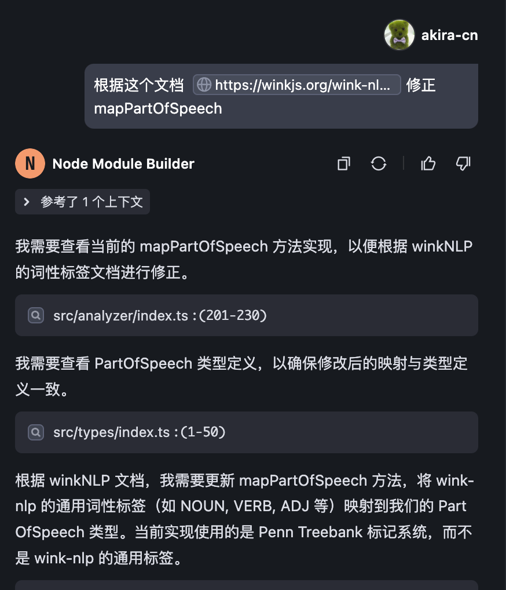

AI 修复的代码如下：

```
 /**
   * 将wink-nlp的词性映射到我们的词性类型
   * @param winkPos wink-nlp的词性标记
   * @returns 映射后的词性，如果无法映射则返回undefined
   */
  private mapPartOfSpeech(winkPos: string): PartOfSpeech | undefined {
    // wink-nlp使用通用词性标签 (Universal POS tags)
    // 这里将其映射到我们的词性类型
    const posMapping: Record<string, string> = {
      NOUN: 'noun', // 名词
      PROPN: 'noun', // 专有名词
      VERB: 'verb', // 动词
      ADJ: 'adjective', // 形容词
      ADV: 'adverb', // 副词
      DET: 'determiner', // 限定词
      PRON: 'pronoun', // 代词
      ADP: 'preposition', // 介词
      CCONJ: 'conjunction', // 并列连词
      SCONJ: 'conjunction', // 从属连词
      INTJ: 'interjection', // 感叹词
      // 其他通用标签没有直接映射到我们的词性类型
      // AUX (助动词), PART (助词), NUM (数词),
      // PUNCT (标点), SYM (符号), X (其他), SPACE (空格)
    };
    return posMapping[winkPos] as PartOfSpeech;
  }
}
```

可是我们发现一个问题，就是有些 UPOS 标签没有对应上。我们检查类型声明代码，发现问题出在类型声明文件  `./src/types/index.ts` 里的 PartOfSpeech 上，这段代码是这样定义的：

```
/**
 * 词性类型
 */
export type PartOfSpeech =
  | 'noun'
  | 'verb'
  | 'adjective'
  | 'adverb'
  | 'determiner'
  | 'pronoun'
  | 'preposition'
  | 'conjunction'
  | 'interjection';
```

上面代码的词性肯定是不全的，我们应该根据  `./src/vocabulary/dict.ts` 的数据将其补全：

```
/**
 * 词性类型
 */
export type PartOfSpeech =
  | 'determiner'
  | 'verb'
  | 'noun'
  | 'adjective'
  | 'adverb'
  | 'preposition'
  | 'conjunction'
  | 'exclamation'
  | 'pronoun'
  | 'auxiliary verb'
  | 'number'
  | 'modal verb'
  | 'ordinal number'
  | 'linking verb'
  | 'definite article'
  | 'infinitive marker'
  | 'be-verb'
  | 'modal auxiliary'
  | 'interjection'
  | 'do-verb'
  | 'have-verb'
  | 'infinitive-to'
  | 'vern';
```

然后我们再让 AI 根据补全后的 PartOfSpeech 更新 mapPartOfSpeech 方法。

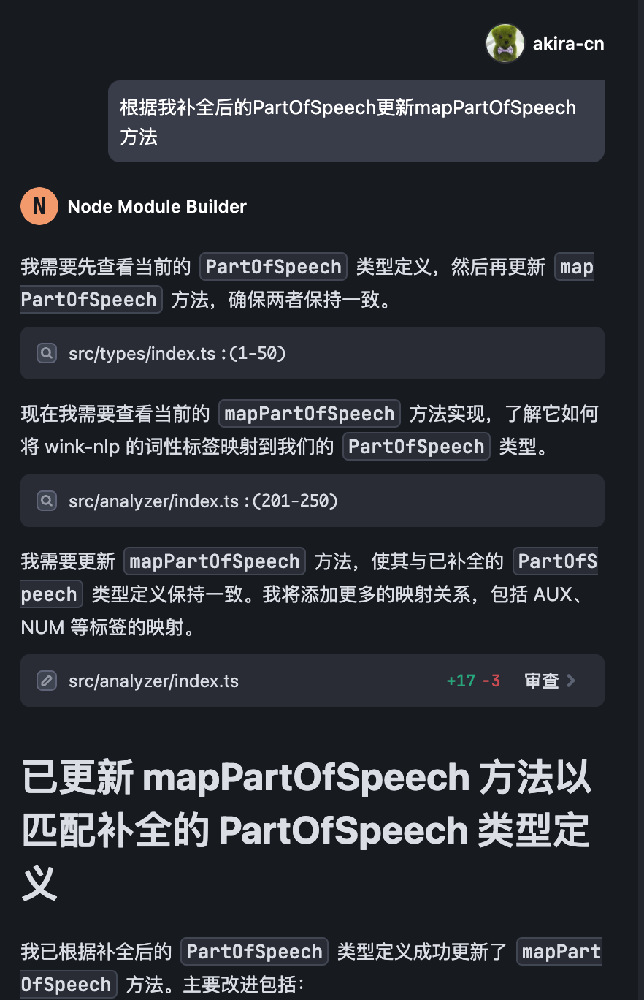

最终补全后的代码如下：

```
  /**
   * 将wink-nlp的词性映射到我们的词性类型
   * @param winkPos wink-nlp的词性标记
   * @returns 映射后的词性，如果无法映射则返回undefined
   */
  private mapPartOfSpeech(winkPos: string): PartOfSpeech | undefined {
    // wink-nlp使用通用词性标签 (Universal POS tags)
    // 这里将其映射到我们的词性类型
    const posMapping: Record<string, PartOfSpeech> = {
      // 基本词性映射
      NOUN: 'noun', // 名词
      PROPN: 'noun', // 专有名词
      VERB: 'verb', // 动词
      ADJ: 'adjective', // 形容词
      ADV: 'adverb', // 副词
      DET: 'determiner', // 限定词
      PRON: 'pronoun', // 代词
      ADP: 'preposition', // 介词
      CCONJ: 'conjunction', // 并列连词
      SCONJ: 'conjunction', // 从属连词
      INTJ: 'interjection', // 感叹词
      // 扩展词性映射
      AUX: 'auxiliary verb', // 助动词
      NUM: 'number', // 数词
      // 特殊动词类型
      'AUX-MD': 'modal verb', // 情态动词
      'AUX-BE': 'be-verb', // be动词
      'AUX-DO': 'do-verb', // do动词
      'AUX-HV': 'have-verb', // have动词
      // 其他特殊类型
      PART: 'infinitive-to', // 不定式标记 to
      // 其他通用标签没有直接映射到我们的词性类型
      // PUNCT (标点), SYM (符号), X (其他), SPACE (空格)
    };
    return posMapping[winkPos];
  }
```

这样就符合我们的需求了。我们跑一下单元测试，执行 `pnpm test` 命令，将其中的测试用例报错的修复一下。

不过有个地方要提一下。我测试发现，虽然 wink-nlp 文档里提到词性采用 UPOS，但是测试结果却显示返回的词性标签是“NN”一类，也就是说很有可能**官方文档有误**，实际上它用的真的是 Penn Treebank 标准，为了保险起见，我们可以将两种 map 都加上：

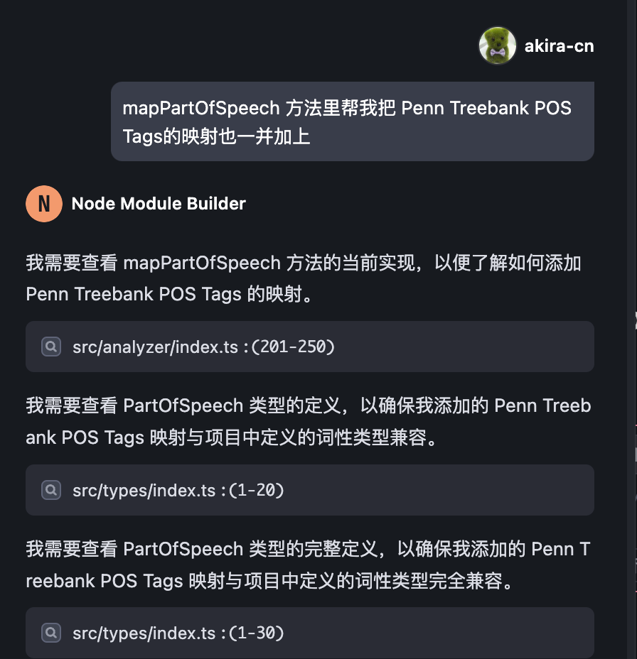

最终代码如下：

```
  /**
   * 将wink-nlp的词性映射到我们的词性类型
   * @param winkPos wink-nlp的词性标记
   * @returns 映射后的词性，如果无法映射则返回undefined
   */
  private mapPartOfSpeech(winkPos: string): PartOfSpeech | undefined {
    // wink-nlp使用通用词性标签 (Universal POS tags)
    // 这里将其映射到我们的词性类型
    const posMapping: Record<string, PartOfSpeech> = {
      // 基本词性映射
      NOUN: 'noun', // 名词
      PROPN: 'noun', // 专有名词
      VERB: 'verb', // 动词
      ADJ: 'adjective', // 形容词
      ADV: 'adverb', // 副词
      DET: 'determiner', // 限定词
      PRON: 'pronoun', // 代词
      ADP: 'preposition', // 介词
      CCONJ: 'conjunction', // 并列连词
      SCONJ: 'conjunction', // 从属连词
      INTJ: 'interjection', // 感叹词
      // 扩展词性映射
      AUX: 'auxiliary verb', // 助动词
      NUM: 'number', // 数词
      // 特殊动词类型
      'AUX-MD': 'modal verb', // 情态动词
      'AUX-BE': 'be-verb', // be动词
      'AUX-DO': 'do-verb', // do动词
      'AUX-HV': 'have-verb', // have动词
      // 其他特殊类型
      PART: 'infinitive-to', // 不定式标记 to
      // 其他通用标签没有直接映射到我们的词性类型
      // PUNCT (标点), SYM (符号), X (其他), SPACE (空格)
      // Penn Treebank POS Tags 映射
      // 名词类
      NN: 'noun', // 单数名词
      NNS: 'noun', // 复数名词
      NNP: 'noun', // 单数专有名词
      NNPS: 'noun', // 复数专有名词
      // 动词类
      VB: 'verb', // 动词原形
      VBD: 'verb', // 过去式动词
      VBG: 'verb', // 动名词或现在分词
      VBN: 'verb', // 过去分词
      VBP: 'verb', // 非第三人称单数现在时动词
      VBZ: 'verb', // 第三人称单数现在时动词
      // 形容词类
      JJ: 'adjective', // 形容词
      JJR: 'adjective', // 比较级形容词
      JJS: 'adjective', // 最高级形容词
      // 副词类
      RB: 'adverb', // 副词
      RBR: 'adverb', // 比较级副词
      RBS: 'adverb', // 最高级副词
      WRB: 'adverb', // WH-副词
      // 代词类
      PRP: 'pronoun', // 人称代词
      PRP$: 'pronoun', // 所有格代词
      WP: 'pronoun', // WH-代词
      WP$: 'pronoun', // 所有格WH-代词
      // 限定词类
      DT: 'determiner', // 限定词
      PDT: 'determiner', // 前限定词
      WDT: 'determiner', // WH-限定词
      // 介词类
      IN: 'preposition', // 介词或从属连词
      // 连词类
      CC: 'conjunction', // 并列连词
      // 数词类
      CD: 'number', // 基数词
      // 特殊类
      MD: 'modal verb', // 情态动词
      TO: 'infinitive-to', // to作为不定式标记
      EX: 'pronoun', // 存在句there
      FW: 'noun', // 外来词
      LS: 'number', // 列表项标记
      POS: 'noun', // 所有格标记
      RP: 'adverb', // 小品词
      SYM: 'noun', // 符号
      UH: 'interjection', // 感叹词
    };
    return posMapping[winkPos];
  }
```

现在我们再看一下 utils：

> ./src/utils/index.ts

```
import { CEFRLevel, ICEFRAnalysisResult } from '../types';
/**
 * 格式化CEFR分析结果为可读文本
 * @param result CEFR分析结果
 * @returns 格式化后的文本
 */
export function formatAnalysisResult(result: ICEFRAnalysisResult): string {
  const { totalWords, levelCounts, levelPercentages, unknownWords } = result;
  // 构建结果字符串
  let formattedResult = '## CEFR 词汇分析结果\n\n';
  // 添加总览信息
  formattedResult += `总单词数: ${totalWords}\n`;
  formattedResult += `已识别单词: ${totalWords - unknownWords} (${(
    ((totalWords - unknownWords) / totalWords) *
    100
  ).toFixed(2)}%)\n`;
  formattedResult += `未识别单词: ${unknownWords} (${((unknownWords / totalWords) * 100).toFixed(
    2
  )}%)\n\n`;
  // 添加各级别统计
  formattedResult += '### 各CEFR级别单词分布\n\n';
  formattedResult += '| 级别 | 单词数 | 百分比 |\n';
  formattedResult += '|------|--------|--------|\n';
  const levels: CEFRLevel[] = ['a1', 'a2', 'b1', 'b2', 'c1', 'c2'];
  levels.forEach(level => {
    const count = levelCounts[level];
    const percentage = levelPercentages[level].toFixed(2);
    formattedResult += `| ${level.toUpperCase()} | ${count} | ${percentage}% |\n`;
  });
  return formattedResult;
}
/**
 * 计算文本的CEFR复杂度得分
 * 基于各级别单词的加权平均值
 * @param result CEFR分析结果
 * @returns 复杂度得分（1-6，对应A1-C2）
 */
export function calculateComplexityScore(result: ICEFRAnalysisResult): number {
  const { levelCounts, totalWords } = result;
  // 如果没有识别到任何单词，返回0
  if (totalWords === 0) {
    return 0;
  }
  // 各级别的权重
  const levelWeights: Record<CEFRLevel, number> = {
    a1: 1,
    a2: 2,
    b1: 3,
    b2: 4,
    c1: 5,
    c2: 6,
  };
  // 计算加权和
  let weightedSum = 0;
  let recognizedWords = 0;
  Object.entries(levelCounts).forEach(([level, count]) => {
    const cefrLevel = level as CEFRLevel;
    weightedSum += levelWeights[cefrLevel] * count;
    recognizedWords += count;
  });
  // 计算加权平均值
  return recognizedWords > 0 ? weightedSum / recognizedWords : 0;
}
/**
 * 根据复杂度得分获取对应的CEFR级别
 * @param score 复杂度得分（1-6）
 * @returns 对应的CEFR级别
 */
export function getComplexityLevel(score: number): CEFRLevel {
  if (score < 1.5) return 'a1';
  if (score < 2.5) return 'a2';
  if (score < 3.5) return 'b1';
  if (score < 4.5) return 'b2';
  if (score < 5.5) return 'c1';
  return 'c2';
}
/**
 * 生成CEFR级别分布的简单可视化
 * @param result CEFR分析结果
 * @returns ASCII图表字符串
 */
export function generateSimpleVisualization(result: ICEFRAnalysisResult): string {
  const { levelPercentages } = result;
  const levels: CEFRLevel[] = ['a1', 'a2', 'b1', 'b2', 'c1', 'c2'];
  let visualization = '### CEFR级别分布可视化\n\n';
  levels.forEach(level => {
    const percentage = levelPercentages[level];
    const barLength = Math.floor(percentage / 2); // 每2%对应1个字符
    const bar = '█'.repeat(barLength);
    visualization += `${level.toUpperCase()}: ${bar} ${percentage.toFixed(2)}%\n`;
  });
  return visualization;
}
```

我们看到，根据 AI 设计，utils 这部分代码其实只依赖于 analyzer 返回的结果数据，对于 analyzer 的逻辑来说是独立的，这是非常好的设计，我们看一下它的几个方法。

- formatAnalysisResult：这个方法将 CEFR 分析结果的 JSON 数据可视化为可读性好的表格文本。
- calculateComplexityScore：计算文本的 CEFR 加权分值，以此分值来衡量文本的难度。
- getComplexityLevel：根据加权分值给出这段文字的综合难度。
- generateSimpleVisualization：将 CEFR 分析结果用可视化图表的方式展现。

其中 formatAnalysisResult、generateSimpleVisualization 有固然很好，但我们业务用不着，暂时不用管它，主要还是看 calculateComplexityScore 和 getComplexityLevel 这两个方法，需要根据我的要求调整。

我们根据策略，将 calculateComplexityScore 调整为：

```
/**
 * 计算文本的CEFR复杂度得分
 * 基于各级别单词的加权平均值
 * @param result CEFR分析结果
 * @returns ICEFRAnalysisResult score得分1～6，level对应等级
 */
export function calculateComplexityScore(result: ICEFRAnalysisResult): DifficultyScoreResult {
  const { totalWords, levelPercentages } = result;
  // ✅ 1. 权重设定
  const weights: Record<CEFRLevel, number> = {
    a1: 1,
    a2: 2,
    b1: 3,
    b2: 4,
    c1: 5,
    c2: 6,
  };
  // ✅ 2. 基础难度得分（加权平均）
  let baseScore = 0;
  for (const level of Object.keys(weights) as CEFRLevel[]) {
    baseScore += (levelPercentages[level] || 0) * weights[level];
  }
  baseScore /= 100;
  // ✅ 3. 超短文本特殊处理
  if (totalWords < 30) {
    return {
      score: baseScore,
      level: getComplexityLevel(baseScore),
      note: 'Too short to evaluate CEFR level reliably.',
    };
  }
  // ✅ 4. 惩罚短文本，奖励长文本
  const shortPenalty = totalWords < 100 ? ((100 - totalWords) / 100) * 0.5 : 0;
  const longBonus = Math.min(Math.log(totalWords + 1) / 10, 0.3);
  const adjustedScore = Math.max(0, baseScore + longBonus - shortPenalty);
  return {
    score: parseFloat(adjustedScore.toFixed(2)),
    level: getComplexityLevel(adjustedScore),
  };
}
```

这里，具体的策略是 a1~c2 一共 6 级，分别给予 1～6 权重，然后用百分比分布去进行加权求和，得出基础分数。再根据词汇量的多少进行修正，通过 longBonus 奖励长文本，通过 shortPenalty 惩罚短文本。

修改完之后，我们可以让 AI 帮我们更新 utils.test.ts：

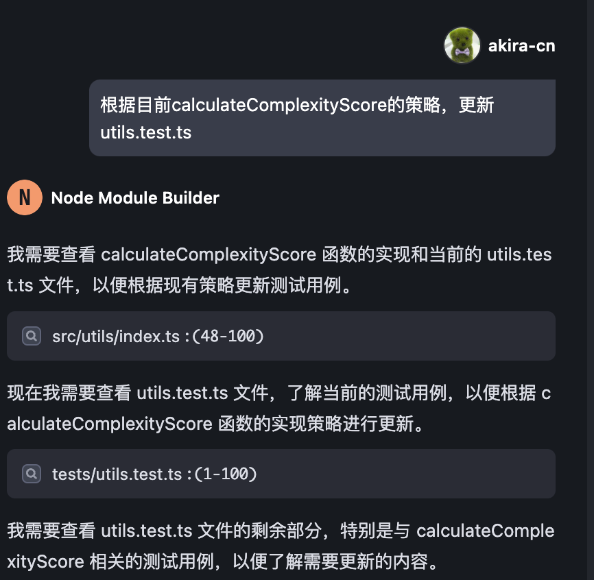

这样我们就实现了基本的难度计算策略，可以在业务中使用了。

接下来，我们继续深入 Review 代码，按我们的需求，对代码功能进行迭代。

首先，我们注意到代码里 CEFRTextAnalyzer 类中的 analyze 方法返回的 JSON 内容是如下数据格式：

```
{
      totalWords,
      levelCounts,
      levelPercentages,
      unknownWords,
      unknownWordsList: mergedOptions.includeUnknownWords ? unknownWordsList : [],
}
```

这些数据对应的含义如下。

- totalWords：文章的总单词数
- levelCounts：每个级别的单词数统计
- levelPercentages：每个级别的单词百分比分布数
- unknownWords；未能归入级别的单词数
- unknownWordsList：未能归入级别的单词列表

这里面并未有每个级别下的具体单词信息，而我们需要这些信息以备后续给 AI 分析，比如让 AI 知道一篇文章里究竟哪些单词是“超纲”的，方便它通过改写控制整体难度。

所以我们需要让 AI 添加一个 wordsAtLevel 的返回项，让 AI 帮我返回每个级别的具体单词。

我们可以直接提需求，让 AI 帮我们迭代：

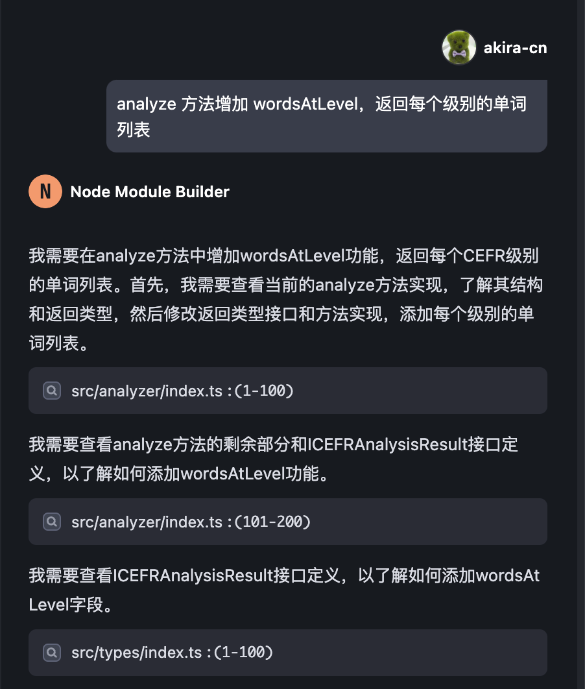

AI 会更新代码文件，并且会同步更新单元测试：

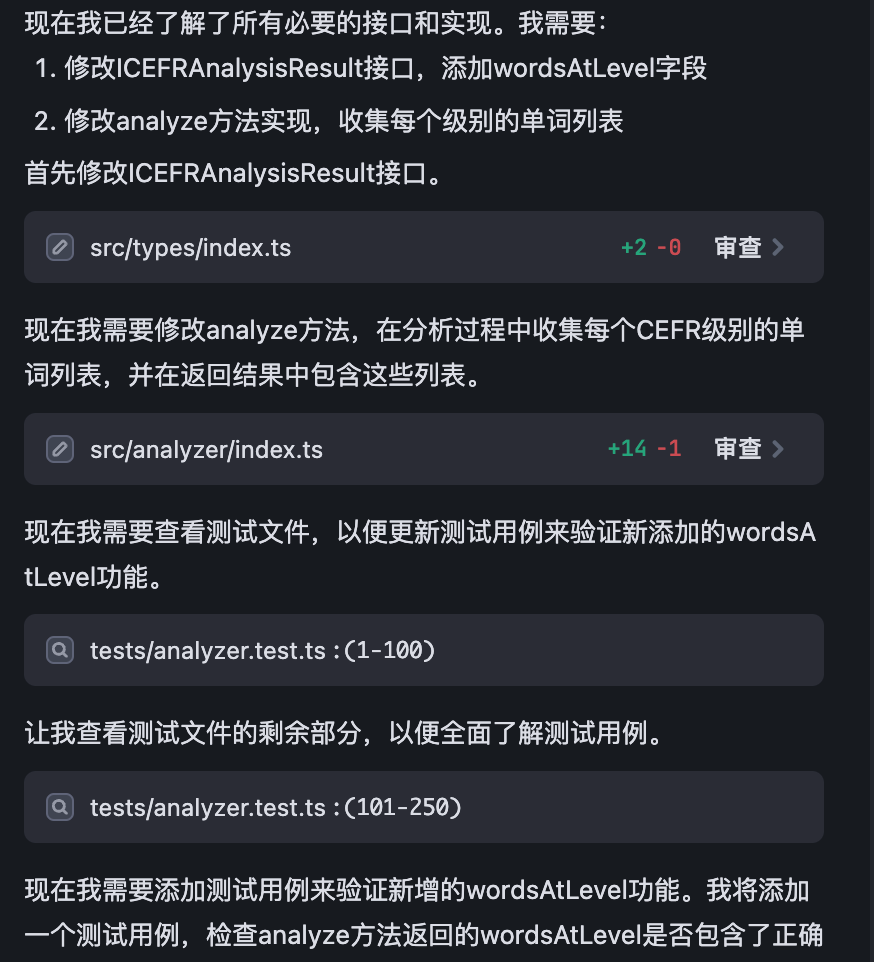

AI 这样修改代码之后，我们会看到 AI 修改了  `src/analyzer/index.ts` 添加了代码：

```
    // 初始化各级别单词列表
    const wordsAtLevel: Record<CEFRLevel, string[]> = {
      a1: [],
      a2: [],
      b1: [],
      b2: [],
      c1: [],
      c2: [],
    };
    ...
    ...
      // 更新统计数据
      if (cefrLevel) {
        levelCounts[cefrLevel]++;
        // 将单词添加到对应级别的列表中
        wordsAtLevel[cefrLevel].push(normalizedWord);
      } else if (mergedOptions.includeUnknownWords) {
        unknownWordsList.push(normalizedWord);
      }
```

但是这个代码是有一些不符合我们的预期的，因为它只返回了单词的拼写，并没返回单词的词性，而对于一些单词来说，不同词性是对应不同级别的。例如 “wait” 这个单词，如果作为动词，是一个 CEFR-A1 级别的词汇，但是如果它作为名词使用，则是一个 CEFR-B1 级别的词汇了，所以我们不能丢失词性信息，我们可以让 AI 继续迭代：

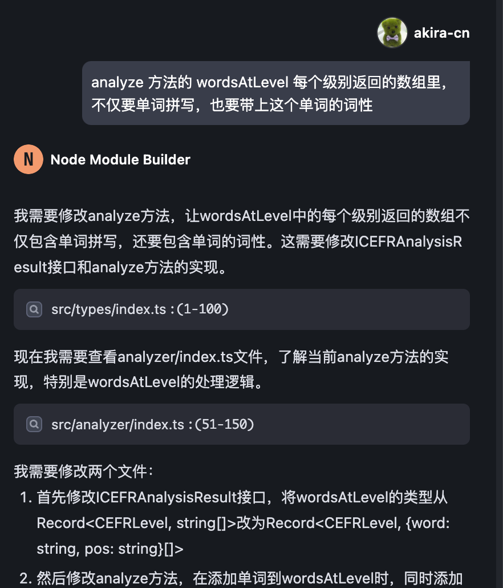

AI 完成修改之后，我们 review 一下代码，我发现一个问题，那就是如果  analyzeByPartOfSpeech 的配置项为 true，我们需要结合单词的词性来判断重复，否则我们只用单词本身拼写来判断重复：

```
const uniqueKey = mergedOptions.analyzeByPartOfSpeech
  ? `${normalizedWord}-${pos}`
  : normalizedWord;
// 如果已处理过该单词，则跳过
if (uniqueWords.has(uniqueKey)) {
  return;
}
uniqueWords.add(uniqueKey);
```

这么做的话，我们还要修改一下 unknownWordList 的部分，将它修改为 Set 类型，因为它只要返回单词不需要词性：

```
    const unknownWordsList: Set<string> = new Set();
... 
...
    return {
      totalWords,
      levelCounts,
      levelPercentages,
      unknownWords,
      unknownWordsList: mergedOptions.includeUnknownWords ? [...unknownWordsList] : [],
      wordsAtLevel,
    };
```

然后，我们发现这样调整之后，我们可以将 getWordsAtLevel 优化成直接用 analyze 方法实现：

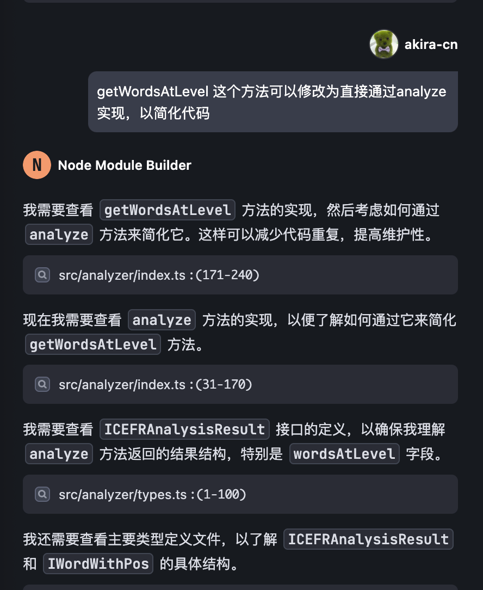

接下来，我们需要协助 AI 一起修复 jest 的测试用例，因为 AI 独自修复 jest 可能因测试信息不完整而不能很好地完成修复。

修改完成后，我们运行  `pnpm test` ，发现测试覆盖度低于 90% 的阈值：

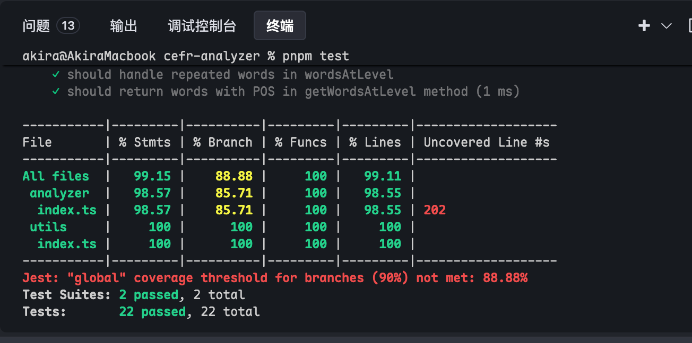

我们可以让 AI 帮我们添加新的测试用例，以增加覆盖度：

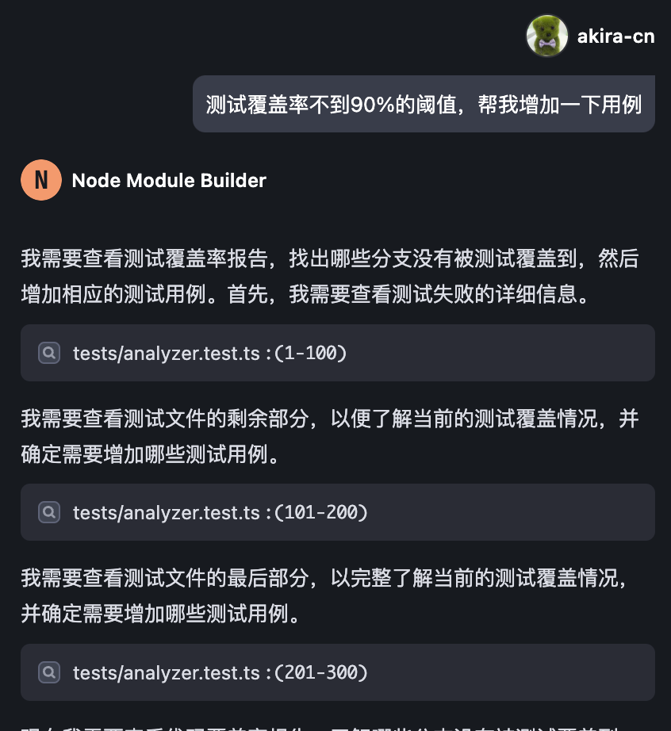

最终我们以很高的测试覆盖度，通过了所有的测试用例：

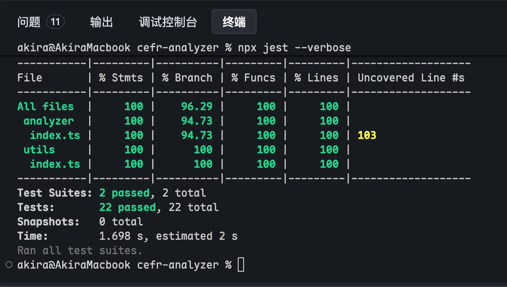

最后别忘了更新 README.md 文件和提交代码。

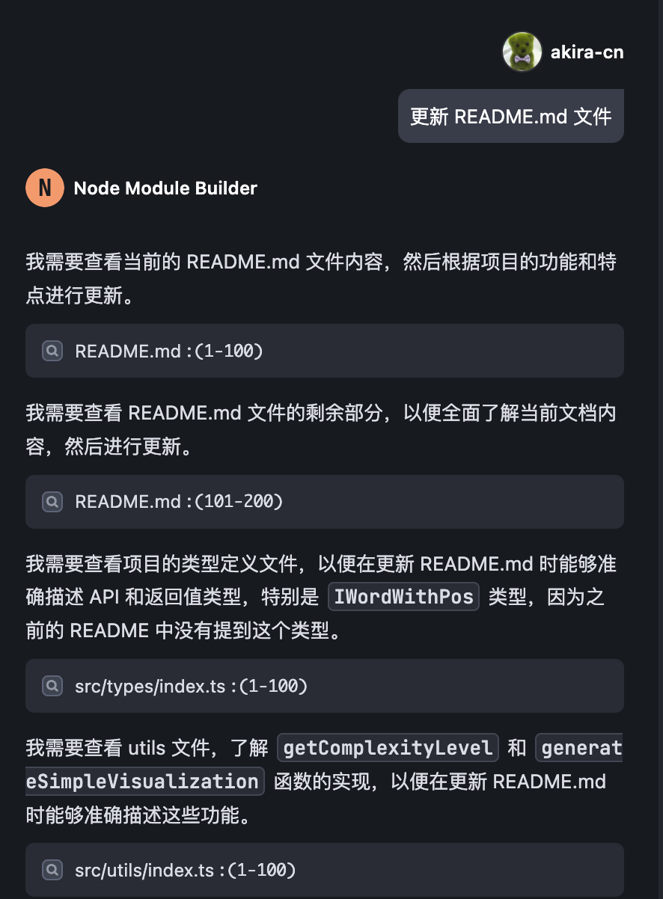

这样我们就完成了整个项目的 Vibe Coding 过程。这个过程也就耗费几个小时的时间，而以往没有 AI 辅助的时候，实现这样一个库，至少也是有几天的工作量的。这就是 Vibe Coding 的魅力所在了。

## 要点总结

这一节课，我们继续上节课的项目，通过与 AI 沟通，结合业务需求对代码进行了迭代。我们看到，有了 AI 辅助，过去非常繁琐的配置类、map 数据类的工作，都可以摆脱人力处理，这极大提升了研发效率，也让我们能更好地聚焦于核心业务策略的制定和实现上。

另外，我们看到，有了 AI 辅助，还能够更好地帮我们**构建单元测试、保证代码测试覆盖度，**让我们的代码质量和可靠性能有所提升。

这种新的 Vibe Coding 开发范式，确实是一种全新的开发革命，值得大家去学习和掌握。

## 课后练习

创建新的业务项目，重复使用这套 Vibe Coding 的开发范式，这有助于你更好地掌握 AI 辅助开发的精髓。将你的实践成果分享到评论区吧。

本项目的完整代码详见 [GitHub 仓库]()。

---
来源：极客时间
链接：https://time.geekbang.org/column/article/887554
日期：2026-05-12
