# 加餐2｜如何用Coze实现一个完整的图片合成AI应用

你好，我是月影。最近有很多产品和前端同学向我提问，想要学习如何快速搭建一个完整的 AI 应用，所以我也把这个内容写个加餐，帮助你快速上手。

因为我们前面的课程中简单介绍了扣子（Coze）平台，这是字节跳动推出的一个在线快速搭建 AI 智能体和应用的平台。它的功能非常强大，完全可以让你以低代码的方式快速搭建基于大模型的各类 AI 应用，并将它发布到各个社交平台、通讯软件，也可以通过 API 或 SDK 将 AI 应用集成到你的业务系统中。

在这里，我用一个完整一些的例子，来讲述用 Coze 开发一个完整的 AI 应用的过程。

我们先看这个例子，它叫做 “KidsCareer”，是一款可以为你家的小朋友合成职业照的小应用。它的界面和功能如下：

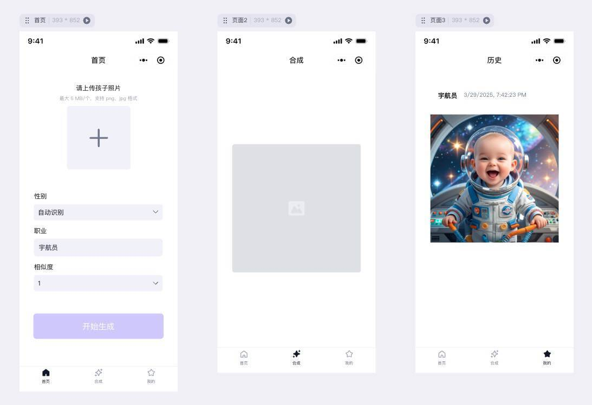

在首页，我们可以上传一张宝宝照片，然后选择性别、职业、相似度，点击“开始生成”按钮，然后应用跳转到合成页开始合成图片，最后将图片展示出来。在历史页面上，可以看到所有历史生成的照片。

你知道吗？我们在扣子上就可以简单实现这个应用，甚至几乎不需要写代码。

你一定很好奇它是如何做到的，那我们一起来看一看吧。

## 用 Coze 搭建照片合成工作流

之前我们使用 Coze 时，都是在资源库创建单独的工作流，今天我们要创建一个应用，所以我们进入 Coze 的控制台，左侧菜单选择“工作空间 > 项目开发 > 创建应用”。

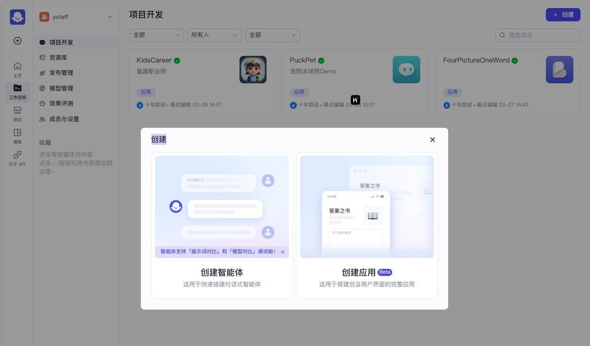

创建应用时，在应用模板列表中选择“创建空白应用”。

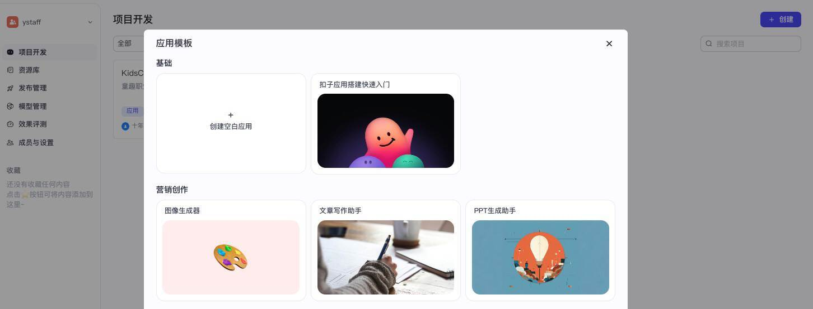

输入应用名称和应用介绍，点击确认按钮创建应用。

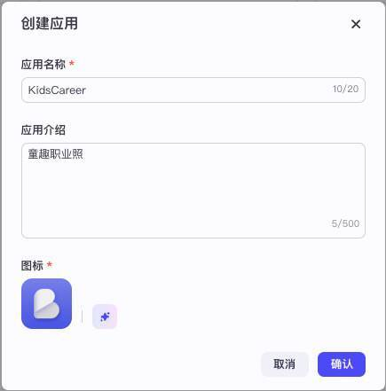

进入到应用开发面板，注意顶部有个 Tab，可以切换“业务逻辑”和“用户界面”，业务逻辑就是构建我们的工作流和数据，用户界面则是搭建 UI。

我们在业务逻辑 Tab 下，左侧菜单中先添加一个工作流 KidsCareer：

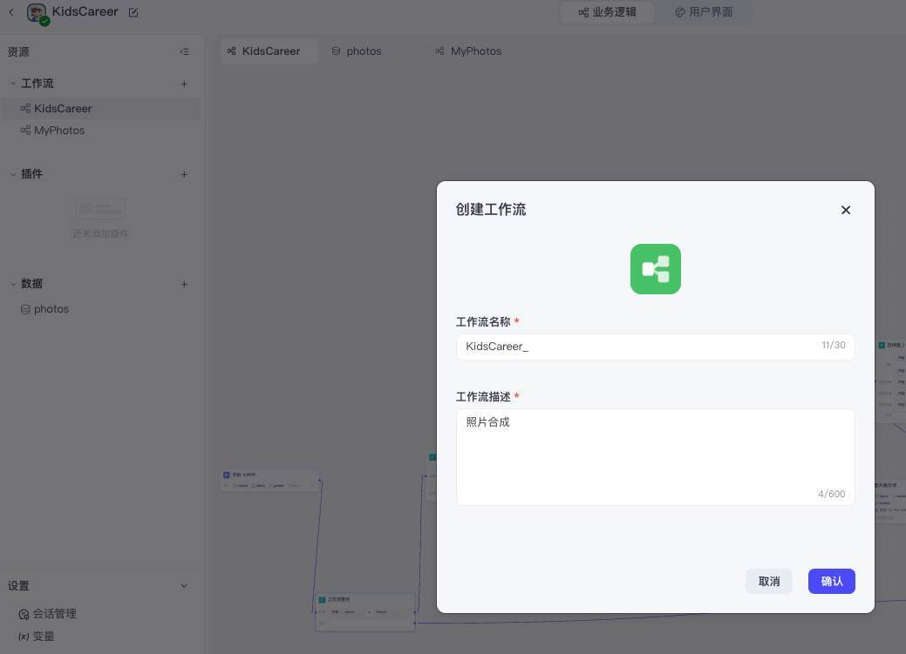

点击确认后，进入工作流编排面板，这个和我们之前在资源库中创建和编排工作流的过程没什么区别。

接下来我们要做的工作流与之前的课程中我们搭建过的那些相比，稍微有点复杂。

这个工作流节点较多，我们后续还得留点时间讨论 UI，所以我就不从零开始搭建了，我先大致介绍一下整体思路，然后给大家过一下工作流中的关键节点和实现方法。

### 工作流整体思路

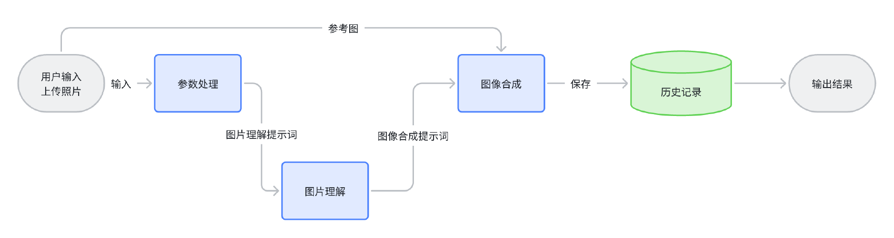

首先，我们接受用户设置的参数和上传的照片，然后将它们处理成图像理解提示词，交给图像理解的大模型（视觉模型），生成图像合成提示词。然后将图像合成提示词以及作为参考图的用户上传照片传给图像合成的大模型，输出合成后的图片，并将图片 url 存入数据库，再将结果返回给用户。

### 具体实现

虽然上面的思路并不复杂，但由于要处理具体细节，所以我们实现的工作流细节还是比较复杂的（如下图）。不过别着急，让我给你一一解释其中的关键部分，这样你就能自己用类似的思路在 Coze 上轻松实现 AI 应用了。

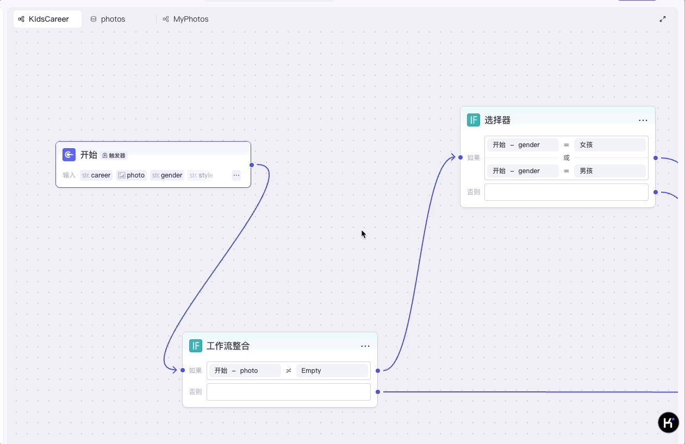

首先，我们要在开始节点上定义用户输入的数据格式：

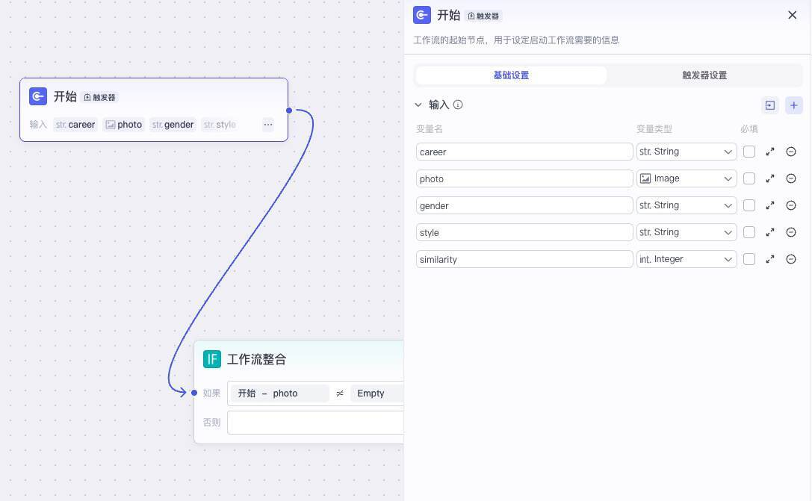

这里我们定义了几个参数，分别如下：

- career：孩子将来的职业
- photo：孩子的照片
- gender：孩子的性别，男孩、女孩或者自动识别
- style：照片的风格，默认为卡通
- similarity：合成图片时的相似度，这个数值越高，合成后照片和孩子越相像

接着有个“工作流整合”的选择器节点，这步是为了读取历史数据设置的，在不传照片的时候，返回历史照片的列表，在这里我们先忽略它。

我们先看下一个选择器节点：

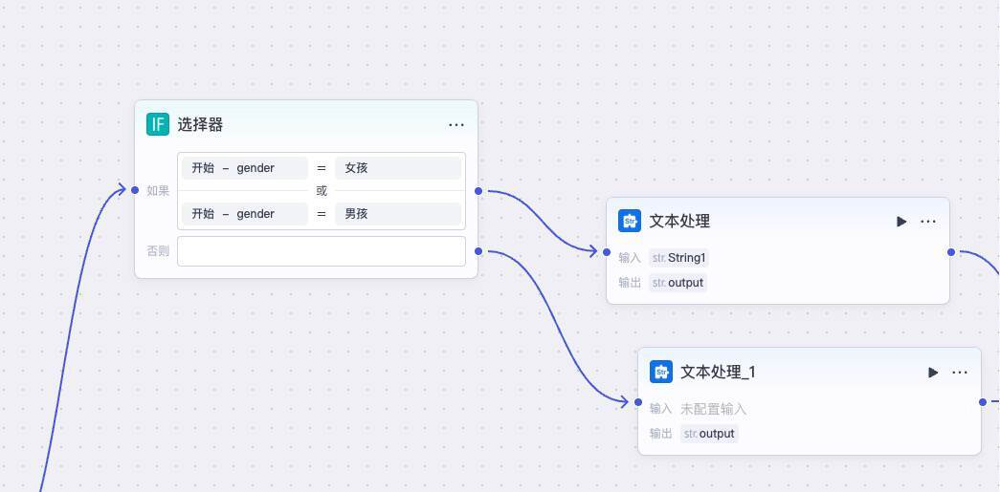

我们的孩子性别参数包含“男孩”、“女孩”、“自动识别”三种选择。这是因为如果传的照片中孩子是婴儿，有时候我们很难通过照片判断性别，所以我们就有两种分支，一是用户主动选择性别，二是用户不主动选择性别，让 AI 来判断性别。

这两个分支对应不同的文本处理节点，用它们来生成提示词，这些提示词后续将会用于图片理解和照片合成。

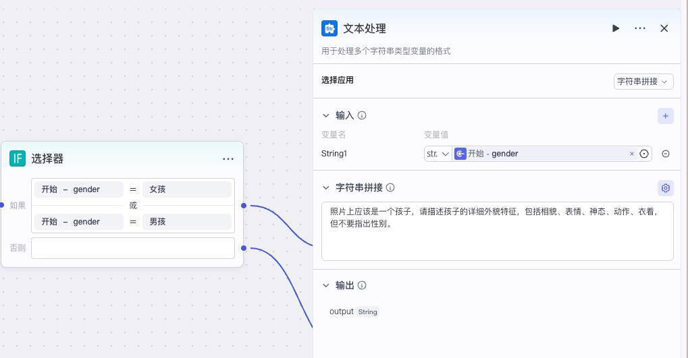

如果用户选择了设置性别，那么字符串拼接时，生成的提示词就是：“照片上应该是一个孩子，请描述孩子的详细外貌特征，包括相貌、表情、神态、动作、衣着，但不要指出性别”，这样就能让 AI 不要在描述图片的时候指出孩子的性别，而是由后续合成图片之前，由我们将性别信息通过提示词模板传入进去。

否则的话，字符串拼接时，生成的提示词就是“照片上应该是一个孩子，请描述孩子的详细外貌特征，包括性别、相貌、表情、神态、动作、衣着”，这样 AI 描述图片时就会给出它认为的孩子性别。

通常情况下，在选择器结束后，我们通过变量聚合节点将分支收拢。

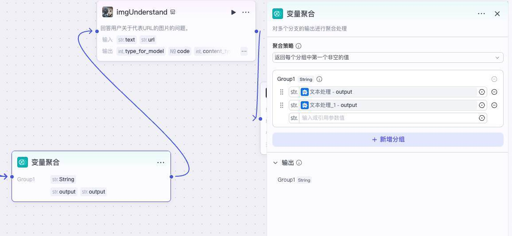

变量聚合的意思是，前面的选择器节点，即 if 条件分支里，有任意一个分支返回非空内容，那么当前节点的输出结果就是该分支的内容。

比如下图这个工作流，当选择器走上面的分支，即 gender 参数是“男孩”或“女孩”时，变量聚合返回的结果就是“文本处理”标签的结果，否则变量聚合返回的结果就是“文本处理 _1”标签的结果。

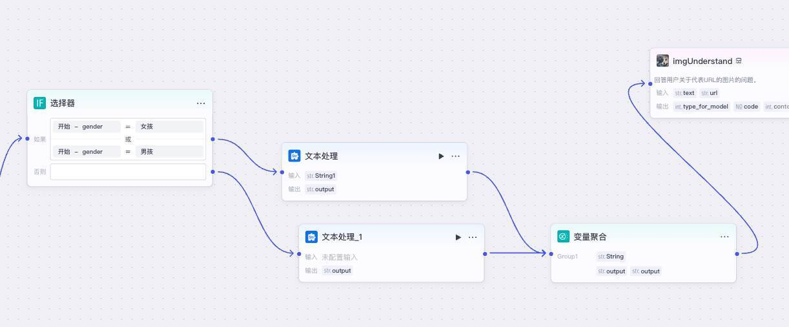

接下来，我们将变量聚合结果和用户上传照片作为输入传给图像识别节点，这是扣子官方的 imgUnderstand 插件：

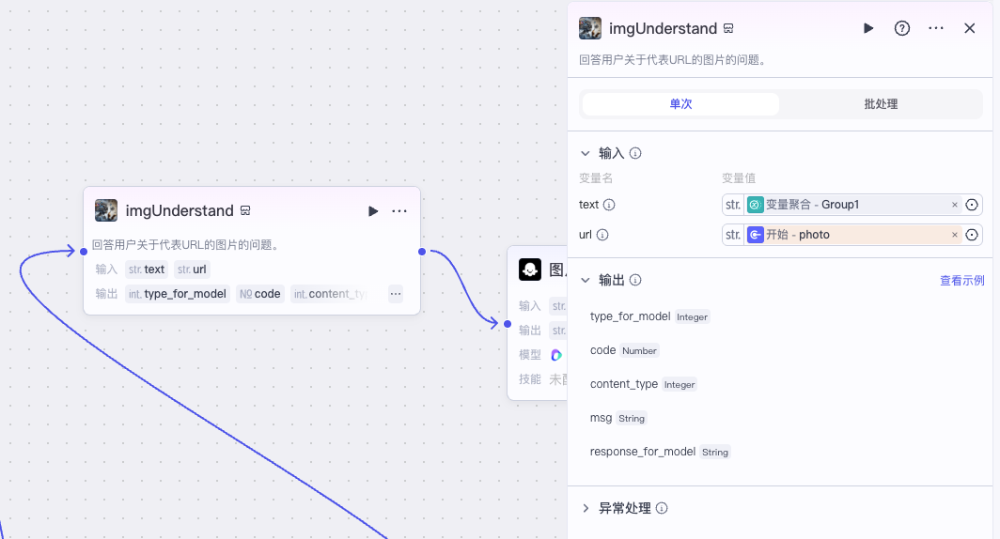

这样它就能返回照片描述。

理论上，有了照片描述和参考图，我们就能让图像大模型生成我们要的结果。但是，为了得到更好的结果，在这里我增加了一个优化图片提示词的大模型节点，系统提示词如下：

```
结合输入的孩子信息和职业信息，生成一段符合该职业形象的孩子照片提示词，要求保留孩子的形象特征，稍微增加一些年龄感，适当结合孩子的表情和符合该职业的着装、神态、动作和道具。
应适当考虑在画面中添加突出职业特征的道具，比如教师类的教具、医生、运动员的道具，知识类工作者的眼镜等等，以强化职业辨识度。
画面整体的场所应该是该职业的工作场所，参考用户描述的衣着，但要替换成该职业的正装衣着。
-孩子性别: {{gender}}
-孩子职业：{{career}}
-照片风格：{{style}}
# 输出内容
输出描述该人物形象和场景的midjourney中文提示词，不要其他内容。
```

这样的话，模型就能将照片描述优化成比较好的提示词。

例如，当原始照片如下图时：


图片识别大模型输出的结果是“图中是一个穿着蓝色衣服的婴儿趴在木地板上，他张着嘴巴，露出牙齿，眼睛弯成月牙形，看起来很开心。”

如果我们设置的职业是宇航员，性别为女性，那么经过大模型节点优化后的提示词是：

```
卡通风格，一个约 3 - 4 岁开心的小女孩，她身着白色宇航服，头戴透明头盔的宇航帽，脸上洋溢着灿烂的笑容，眼睛弯成月牙形，张着嘴巴露出牙齿。她正站在宇宙飞船的驾驶舱内，周围是各种闪烁的仪器和控制按钮，她一只手放在操作台上，另一只手比出胜利的手势。飞船的窗外是浩瀚的宇宙，有闪烁的星星和神秘的星云。
```

然后我们将这个提示词传给图像生成节点，注意我们这里又用了一组选择器：

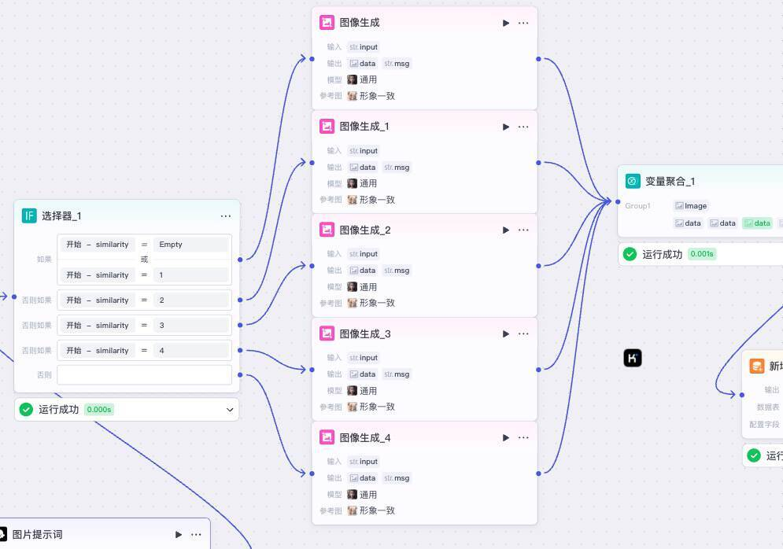

这个地方是一个特殊情况，本来不需要用选择器的，但是因为图像生成节点的参考图相似程度参数不能指定外部变量。所以我们只能人为通过选择器 Copy 图像生成的节点，手动设置参考图不同的相似程度了。

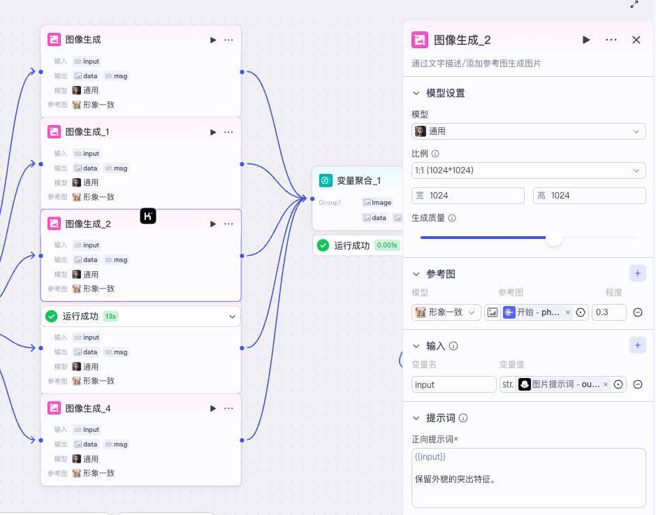

最终呢，我们将图像生成的内容传入新增数据的节点，将数据保存到数据库表里。

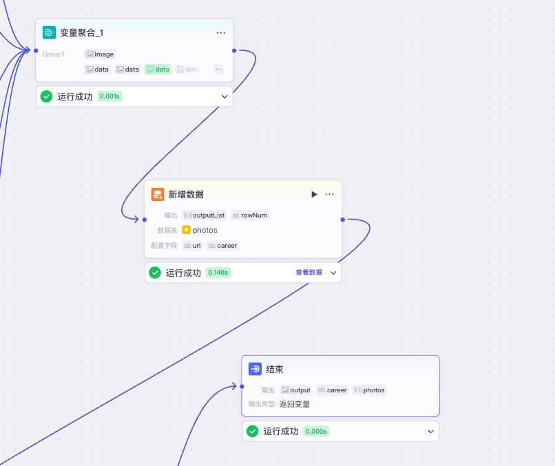

要做这一步，我们还需要创建一个数据表。在左侧菜单区，选择“数据 > 新建数据库”。

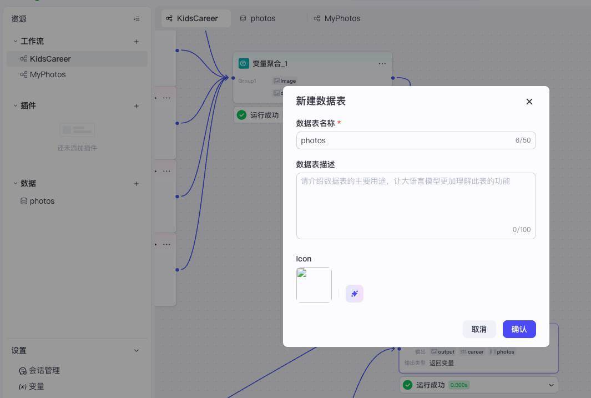

我们输入表名，并点击确认。

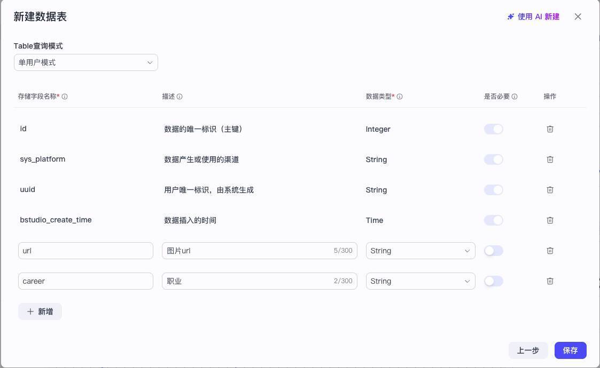

添加两个我们要保存的字段，分别是 url 和 career，前者用来保存图片 url，后者则会保存职业信息。

注意，在左上角有个“Table 查询模式”的设置，默认是单用户模式，也就是每个用户只能查询和操作自己的数据，这样就符合我们的要求，因为我们希望存的就是用户自己的照片生成历史记录。

点击确定后，数据表就创建好了。

然后我们在新增数据节点里选择创建好的数据表，并设置好要保存的字段就可以了。

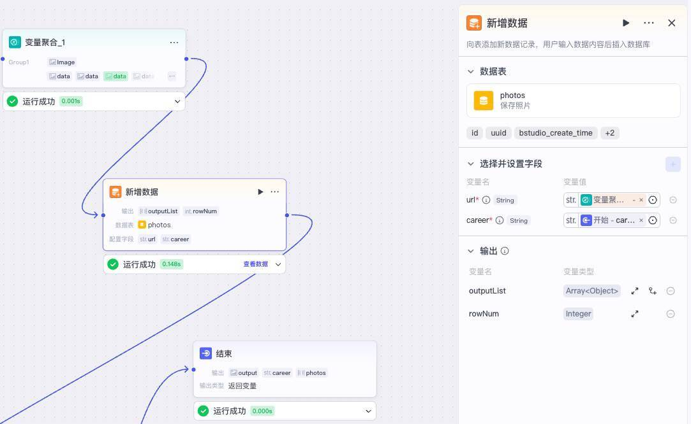

到这里为止，Coze 搭建照片的主体工作流就完成了。

接着我们还需要创建另外一个工作流，用来查询表，输出用户创建的历史记录。

我们新建另一个工作流 MyPhotos，它就比较简单：

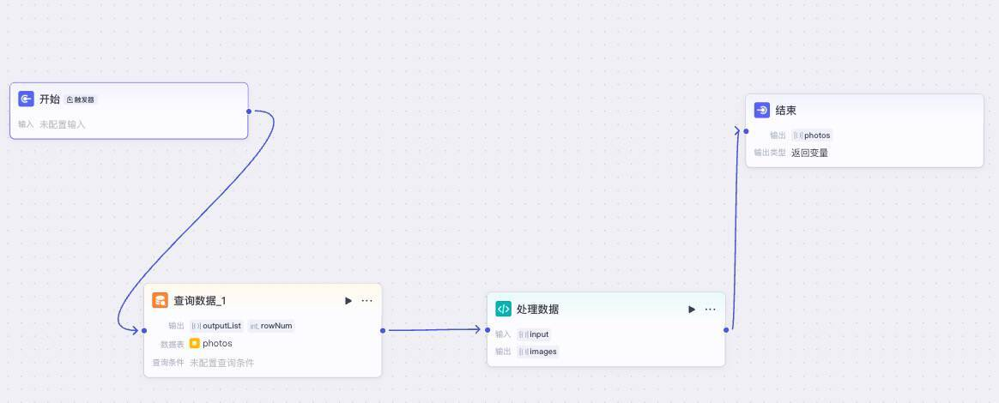

这个工作流不需要用户输入，因为我们前面选择了单用户模式，所以我们什么都不用传入，查询数据结果会自动返回当前用户的数据，我们只需要设置要返回的查询字段，以及查询条件和排序方式即可。

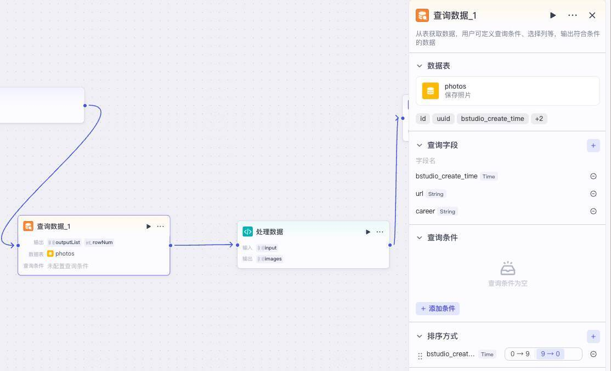

注意我们在查询数据之后，有一个代码节点，用来处理数据。本来这也不需要的，但是因为 Coze 默认的数据查询条件不能按照当前日期回溯若干天来查询记录。也就是说，我本来希望用户默认只能看到最近一个月的历史记录（因为 Coze 保存图片也是有时间期限的），但是通过设置查询字段并不能做到，所以我们只能通过代码自己根据 bstudio_create_time 来过滤数据了。

处理数据的逻辑如下：

```
// 在这里，您可以通过 ‘params’  获取节点中的输入变量，并通过 'ret' 输出结果
// 'params' 和 'ret' 已经被正确地注入到环境中
// 下面是一个示例，获取节点输入中参数名为‘input’的值：
// const input = params.input; 
// 下面是一个示例，输出一个包含多种数据类型的 'ret' 对象：
// const ret = { "name": ‘小明’, "hobbies": [“看书”, “旅游”] };
async function main({ params }: Args): Promise<Output> {
    const data = params.input.filter(d => {
        const time = Date.now() - new Date(d.bstudio_create_time.replace(/\+.*$/g, '')).getTime();
        return time < 1000 * 30 * 86400; // 只保留一个月以内的记录
    });
    // 构建输出对象
    const ret = {
        images: data.map(d => ({
            url: d.url,
            career: d.career,
            createTime: new Date(d.bstudio_create_time.replace(/\+.*$/g, '')).toLocaleString(),
        })),
    };
    return ret;
}
```

代码里还有个小细节，就是我们获取生成时间时，对 bstudio_create_time 时间戳进行了一个处理，去掉了时间戳尾部的时区信息。因为我在写这个 Case 的时候，发现 Coze 默认保存时间有 bug，它的数据库时区设置不对，导致我们用 Node.js 获取到的时间有问题。这个问题我反馈给 Coze 官方了，也许不久就能修复。

这样我们就实现了读取历史记录的工作流。

接下来，我解释一下前面我们看到的那个工作流整合是怎么回事。

我们切换回到之前的工作流 KidsCareer，本来 KidsCareer 和 MyPhotos 两个工作流单独分别调用就好，因为前者是用来生成合成照片使用的，后者是查询历史记录。

但是，Coze 的 UI 并不支持工作流运行完成后的钩子（Hook）操作，所以我们没法实现在 KidsCareer 工作流执行后，调用 MyPhotos 工作流更新历史记录的 UI 这样的操作，无奈之下，我只能将两个工作流融合到一起，当用户传入 photo 参数时，执行合成图片的流程，否则执行获取历史记录的流程，这样我就能在合成图片流程里新增数据之后，也执行一下 MyPhotos，更新 UI 界面上的数据。

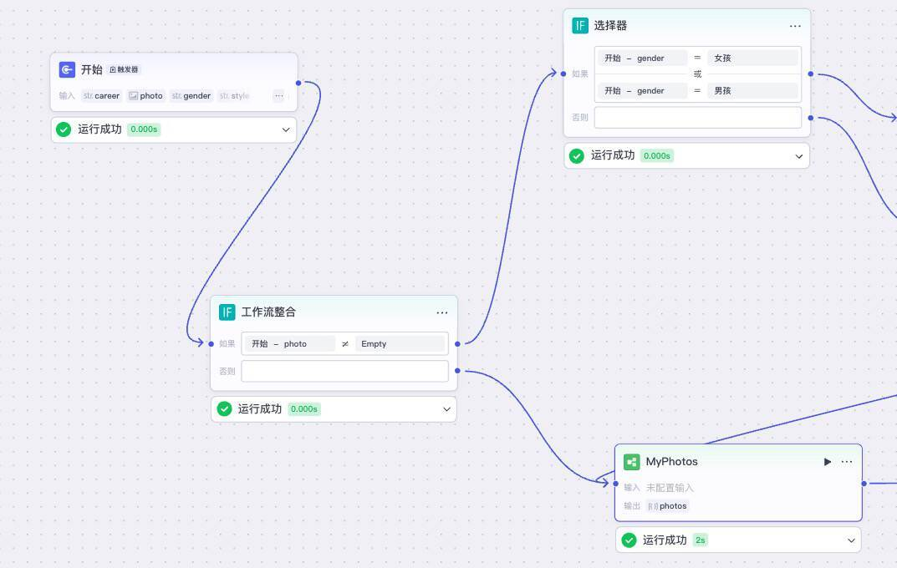

## 实现用户界面

到此为止，我们的业务逻辑部分就完成了，接下来我们可以实现用户界面。

我们切换工作区顶部的 Tab 到用户界面，这里我创建了三个页面，它们通过底部的导航拦切换。

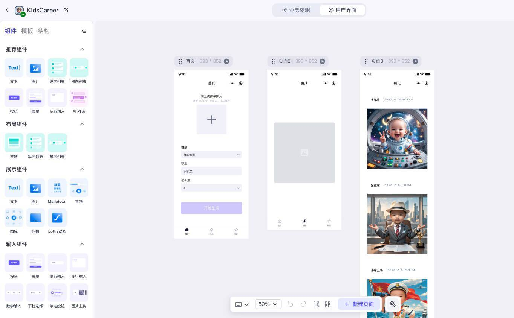

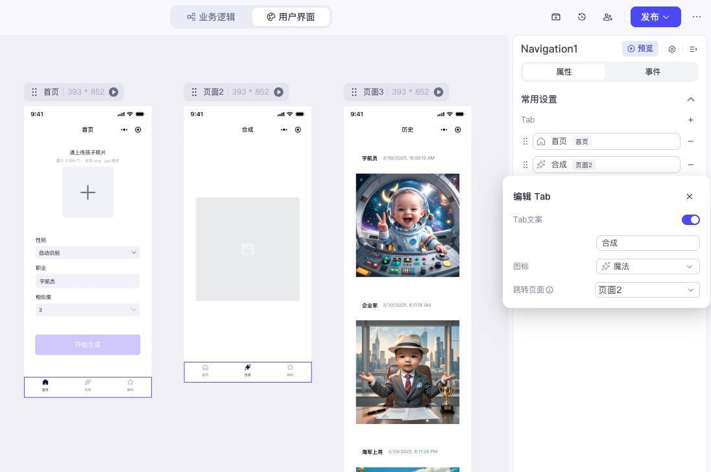

这里的界面设计工具乍一眼看过去可能你会觉得比较复杂，但是如果你比较熟悉 Sketch 或 Figma，你会发现这个设计工具和它们比较像。

一般情况下，你只需要熟悉通过布局组件的容器嵌套来排版的方法，就足以应付绝大多数的界面布局了。

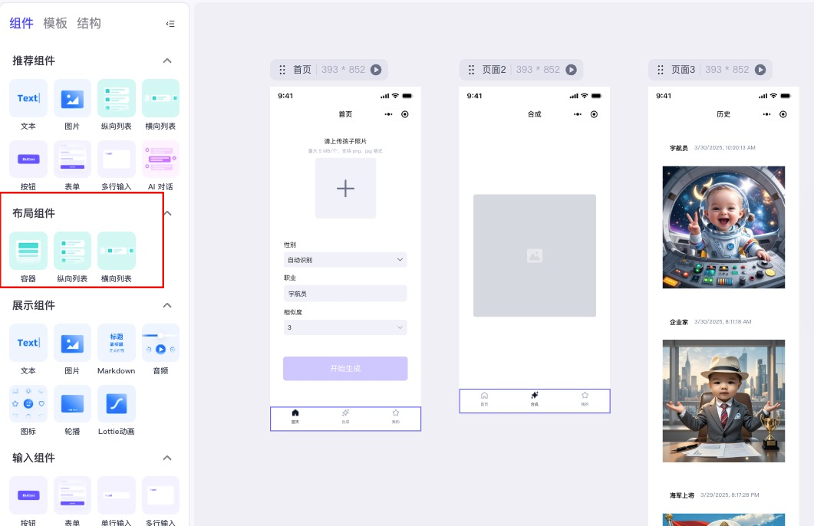

如果对 UI 布局和组件配置不太熟悉，最好的办法是就是亲自动手，创建应用具体尝试一下。如果尝试还有问题，可以发在评论区和我交流，或者关注我的社群，我会定期通过直播带大家一起实践。

在这里我最后要讲一下，我们要怎么传参数发起工作流，其实方法也很简单，我们可以在按钮组件上注册事件。我们选中按钮组件，右侧配置面板切换到事件 Tab，选择新建，事件类型选点击时，执行动作选择调用工作流，工作流选择 KidsCareer 即可。要传入的参数可以通过设置界面上我们添加的组件的 value 值。

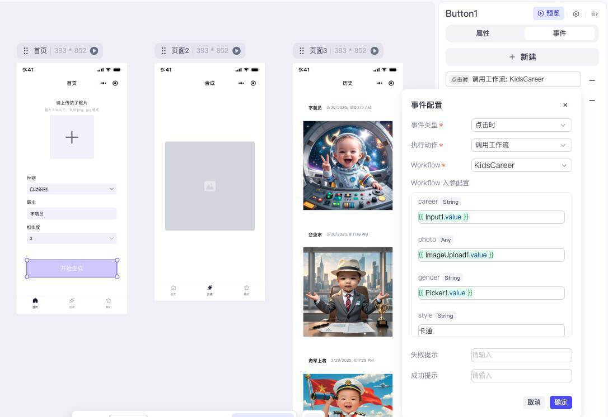

然后工作流执行后，我们要将图片展示出来，配置也很简单，我们在第二页合成图片，界面上放置一个图片组件，右侧属性面板常用设置里，选择绑定数据，来源设置为 `{{ KidsCareer.data.output }}`

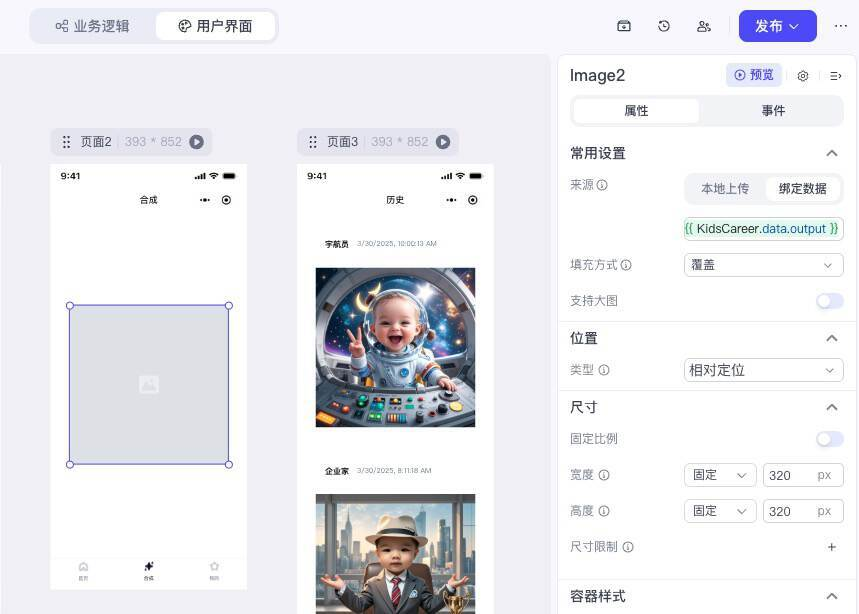

这样当工作流调用完成后，图片就能显示出来了。

在第三个页面上，我们要在页面加载时读取历史记录，我们选中页面，切换到事件 Tab，在页面加载时同样调用工作流 KidsCareer，因为我们已经做了工作流的整合，这里不传任何参数即可。

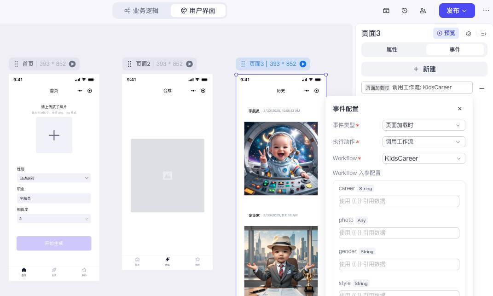

这样我们最后就完成了这个工作流的设置。现在我们可以点击预览，运行并测试我们的应用了。

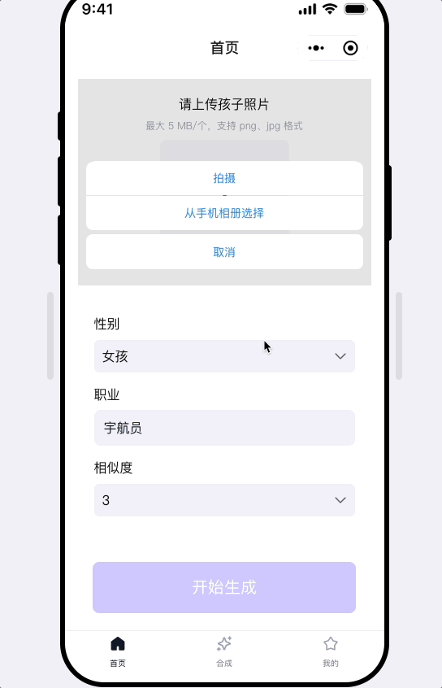

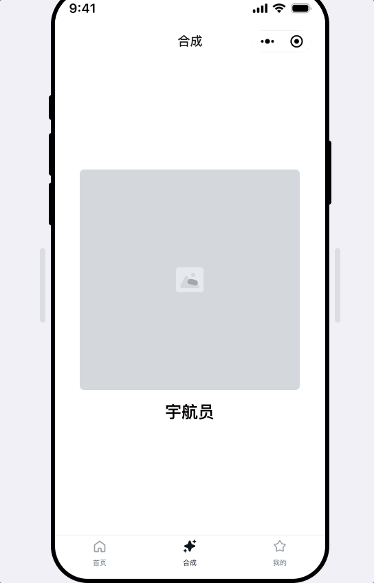

这样我们的“儿童职业照”应用就算完成啦，我们可以将它发布到小程序、H5 或者其他的平台了。

## 要点总结

这一节课我们通过具体实践学习了在扣子（Coze）平台上如何快速搭建一个 A 应用，我们发现，Coze 平台的功能确实很强大和完善，它提供了工作流、数据库、UI 搭建等开发必备的几乎所有的设施，让你能够快速借助扣子平台强大的能力完成你的工作，甚至最终实现产品交付。

在这些工作中，最重要的依然是**核心工作流的设计**，还是秉承着我们课程的核心，只要你理解和学会了如何设计和构建工作流，再借助 Coze 的工具能力，一定会让你的能力得到巨大的提升，可以在很短的时间内，借助大模型底层能力，独立完成各种令人惊叹的 AI 应用。

## 课后练习

“纸上得来终觉浅，绝知此事要躬行” —— 学一百遍不如亲自动手练一遍，你在 Coze 平台上可以自己创建一个 AI 应用，搭建一个自己想做的工具，并将这个工具以及搭建过程的所得分享到评论区。

---
来源：极客时间
链接：https://time.geekbang.org/column/article/875905
日期：2026-05-12
