# 加餐5｜使用Coze自身的文件上传来存储和处理数据

你好，我是月影。

前面我们已经说过，对于我们开发者来说，Coze 是一个非常好的 AI 工具和平台，通过它既能够用低代码方式快速实现一些智能体，还能够搭建简单的应用，以及通过 API 让客户调用，集成到客户的产品和平台上，实现对客户的快速交付。

Coze 不仅提供了平台能力，它的插件还可以实现丰富的应用功能，你完全可以将它当作 serverless 服务来使用，基于插件和配套的 Cloud IDE 开发各种功能的 API，然后再通过封装工作流实现调用。

在这里，我根据最近的深入研究，给大家讲一个 Coze、插件以及工作流有关的小技巧。

## 利用 Coze 插件配合工作流实现文件存储和处理

我们知道，Coze 实际上有文件上传的功能，在工作流配置中，如果我们将开始节点中的某个参数类型设置为 File，或者 Array，那么 Coze 会将文件上传到自己的服务器，以供后续流程使用。

在前面的**加餐 2、加餐 3** 课程中，我们都利用 Coze 上传文件来支持用户上传照片进行处理，其中加餐 2 主要是通过工作流处理上传的图片，而加餐 3 除了工作流之外，还讲了如何通过 API 调用来上传图片文件，之后再进行后续工作流处理。

而在**第 29 节课**我们也是通过在开始节点中配置类型为 Array的 files 参数，将上传的文件批量传给 BunnyCDN 进行处理的。

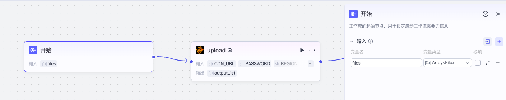

在 29 节课里，我们说过阿里云 OSS 使用门槛较高，所以用了更加简单的 BunnyCDN。但是 BunnyCDN 仍然有一些问题，首先它只有免费 14 天试用，之后还是要收取一些费用的。其次，它的 CDN 是全球节点，服务器部署在海外，在某些时候访问不一定顺畅。

实际上，如果你只是想要临时保存一些文件在线上，还有一个取巧的办法，完全不需要阿里云 OSS 和 BunnyCDN，可以通过 Coze 自带的文件上传来让 Coze 替你保存文件，虽然它有一定的期限（3 个月），但是**方便、快捷，不需要额外的存储服务**。

说起来简单，但是 Coze 和豆包并不能直接使用上传的文件，因为它做了些限制，不允许用户直接获取文件的 URL。比如豆包里，我们上传一张图片，想要获得这张图片上传后的地址，是很难办到的：

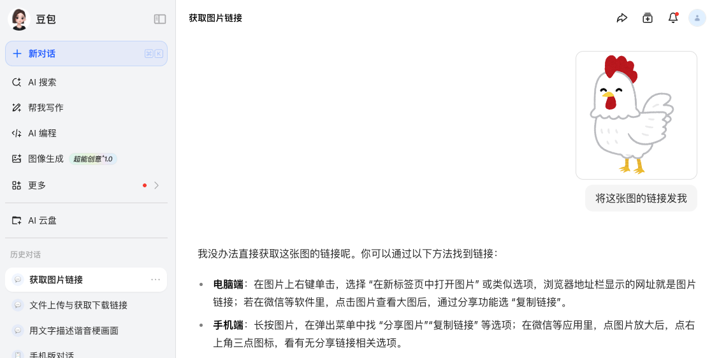

虽然我们可以取巧，比如这样：


之后我们可以在浏览器 dev tools 中拿到图片的临时链接：

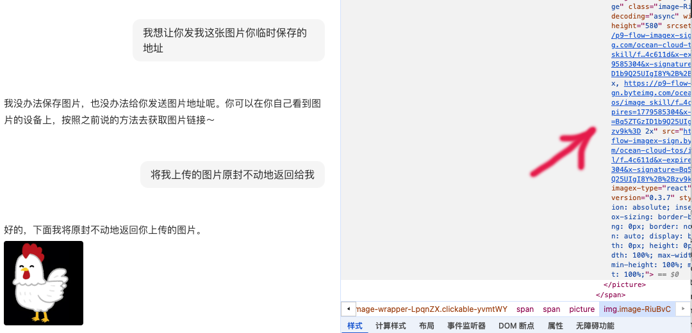

但是这么做还是很麻烦，而且不是所有类型的文件都可以做到。

如果你想要通过文件上传的 API 获取文件上传后的 URL，文档里是这么写的：

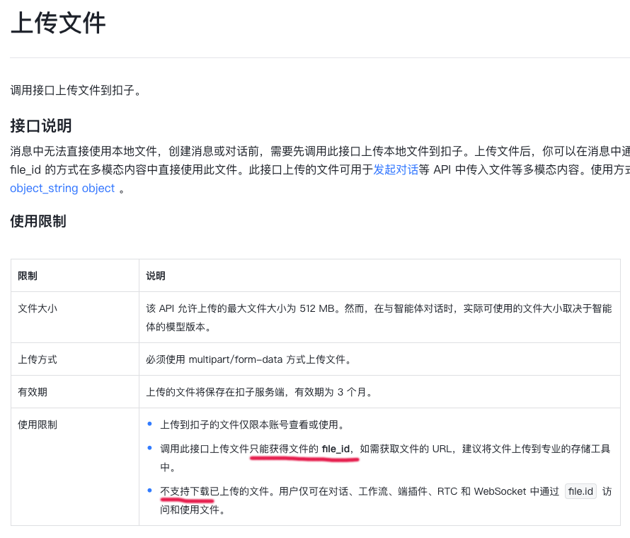

所以，用  `https://api.coze.cn/v1/files/upload`  API 来上传文件，也是拿不到上传后文件的 URL 的。

但是这是否意味着我们确实无法简单拿到文件 URL 呢？答案是否定的，其实我们只需要最简单的一个方式，就可以轻松实现用 Coze 自身临时存储上传的文件资源。

### 用工作流获取文件 URL

我们直接创建一个工作流 **Fetch_FIles**，开始节点设置输入参数 files，变量类型选择 ArrayDefault。

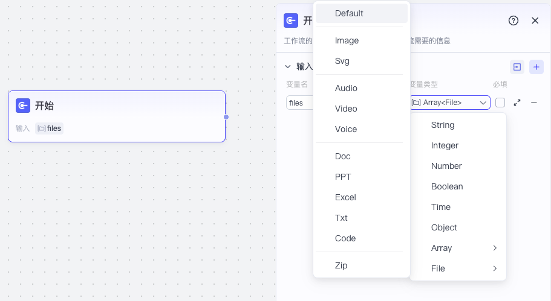

然后我们直接将开始节点和结束节点连接起来，将结束节点的输出变量 output 值设置为输入节点的 files。

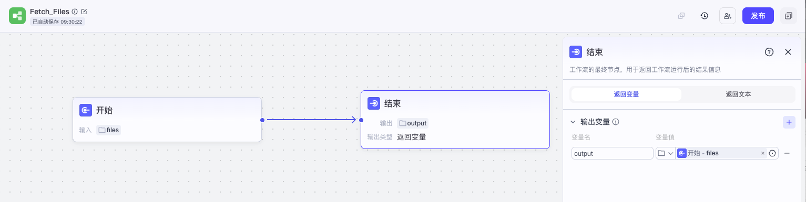

这样我们就实现了最简单的临时存储文件的工作流。

我们可以简单地验证一下效果，先发布这个工作流，然后创建一个智能体，叫做**资源文件暂存**。

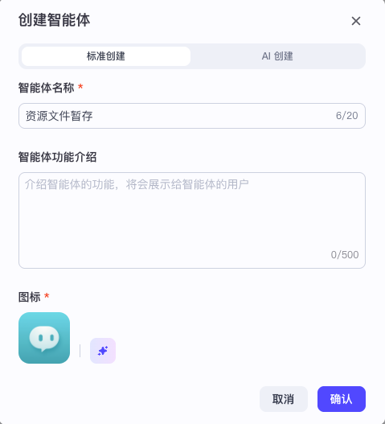

然后我们配置一下提示词和工作流，上传两个文件测试结果：

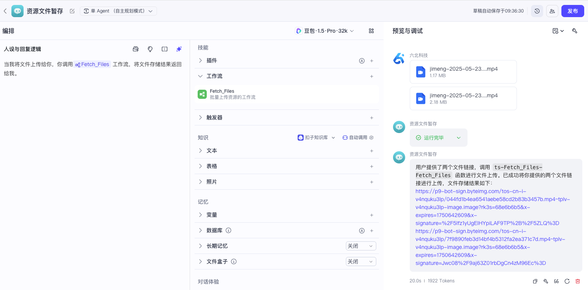

> 提示词

```
当我将文件上传给你，你调用 Fetch_Files 工作流，将文件存储结果返回给我。
```

你会看到这个智能体非常直接地将文件上传到 Coze 后的 URL 地址返回给了我们。这两个文件 URL 现在我们就可以直接使用，Coze 会保存它们三个月时间。

### 用工作流实现数据上传插件

讲到这里，有同学就会问，这样做是不是就可以了，为什么我要提到插件呢？

这是因为我们有时候并不是直接上传文件，而是用插件先进行处理，然后再上传文件。

我们通过一个具体例子来说明。

比如，我最近的业务里经常处理视频和音频的合成，我可以实现一个插件，用来处理音视频的合成：

> 插件 merge_mp4_wav

```
import { Args } from '@/runtime';
import { Input, Output } from "@/typings/merge_mp4_wav/merge_mp4_wav";
import fs from 'node:fs';
import path from 'node:path';
import axios from 'axios';
import ffmpeg from 'fluent-ffmpeg';
import ffmpegPath from 'ffmpeg-static';
ffmpeg.setFfmpegPath(ffmpegPath);
async function downloadToFile(url, filePath) {
  const response = await axios({ url, method: 'GET', responseType: 'stream' });
  const writer = fs.createWriteStream(filePath);
  response.data.pipe(writer);
  return new Promise((resolve: any, reject) => {
    writer.on('finish', resolve);
    writer.on('error', reject);
  });
}
async function mergeVideoAndAudioToBase64(videoUrl, wavUrl) {
  const tempDir = path.join('/tmp/temp_' + Math.random().toString(36).slice(2, 12));
  fs.mkdirSync(tempDir);
  const videoPath = path.join(tempDir, 'video.mp4');
  const wavPath = path.join(tempDir, 'audio.wav');
  const mp3Path = path.join(tempDir, 'audio.mp3');
  const outputPath = path.join(tempDir, 'output.mp4');
  try {
    // 下载视频和音频
    await downloadToFile(videoUrl, videoPath);
    await downloadToFile(wavUrl, wavPath);
    // 将 wav 转 mp3
    await new Promise((resolve, reject) => {
      ffmpeg(wavPath)
        .audioCodec('libmp3lame')
        .format('mp3')
        .save(mp3Path)
        .on('end', resolve)
        .on('error', reject);
    });
    // 合成视频+音频
    await new Promise((resolve, reject) => {
      ffmpeg()
        .input(videoPath)
        .input(mp3Path)
        .outputOptions(['-c:v copy', '-c:a aac', '-shortest'])
        .save(outputPath)
        .on('end', resolve)
        .on('error', reject);
    });
    // 读取为 base64
    const buffer = fs.readFileSync(outputPath);
    return `data:video/mp4;base64,${buffer.toString('base64')}`;
  } finally {
    // 自动清理临时目录
    fs.rmSync(tempDir, { recursive: true, force: true });
  }
}
export async function handler({ input, logger }: Args<Input>): Promise<Output> {
  const {video_url: videoUrl, audio_url: audioUrl} = input;
  const res = await mergeVideoAndAudioToBase64(videoUrl, audioUrl);
  return {
    data: res,
  };
};
```

在这个插件里，我们使用 ffmpeg 来处理音频和视频，将它们进行合成，插件需要依赖三个库。

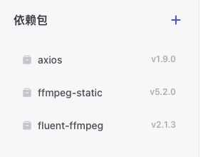

具体的过程不是很复杂，只要将要合成的音频和视频通过 URL 下载，保存到临时目录，然后通过 Node.js 调用 ffmpeg 命令，对文件进行合成，最后将合成的带有声音的 mp4 文件的 base64 数据返回。

这里 [fluent-ffmpeg]() 是 Node.js 对 ffmpeg 的封装，而 ffmpeg-static 是打包好的 ffmpeg 二进制执行文件，这样它就可以加载到 Coze 插件底层的 Serverless 平台上。

然后通过  `ffmpeg.setFfmpegPath(ffmpegPath);`  进行设置，就可以用 ffmpeg 的 Node.js API 进行调用了。

这个插件实现好了，但它只能输出 base64 数据，我们还需要将数据保存起来，才可以使用。一种办法是使用我们前面讲过的阿里云 OSS 或者 BunnyCDN 的对象存储服务，我们将 base64 数据通过 API 传给它们，再保存成二进制数据存储，然后返回 URL。另一种办法，就是**通过 API 调用 Coze 的文件上传，再通过前面的工作流获取文件 URL**，这种办法不需要阿里云，也不需要 BunnyCDN 之类的第三方 SaaS 服务。

我们现在来实现这个插件，通过 API 调用的方式上传文件，然后获取文件的 URL。

首先我们调用 API，需要申请一个 PAT_Token，详细情况我们在加餐 3 中解释过。

我们在控制面板 “API > 授权 > 个人访问令牌” 中选择添加新令牌：

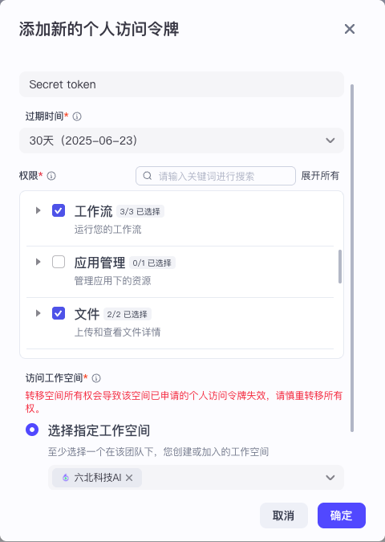

令牌过期时间 30 天，权限勾选**工作流**和**文件**，选择指定工作空间，然后点确定保存 Token，一会我们要用到。

创建好 Token 之后，我们回到工作空间，切换到“资源库”面板，新建资源，选择新建插件。

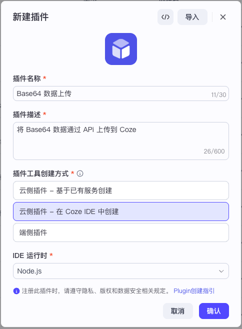

创建好插件后，在 Cloud IDE 的面板中的工具列表添加插件 **upload**，在依赖包处安装依赖。

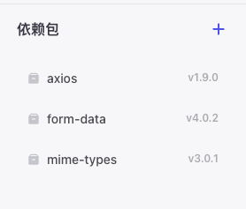

然后我们编辑模块的元数据，设置输入和输出参数。

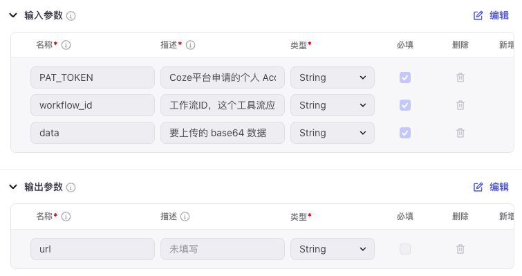

输入参数如下：

- PAT_TOKEN  申请的个人授权令牌
- workflow_id  工作流 ID，该必须是已上线状态
- data  要上传的 base64 数据

输出参数如下：

- url  上传到 Coze 后的文件 URL

接着切换回代码编辑器，将代码修改成后面这样。

```
import { Args } from '@/runtime';
import { Input, Output } from "@/typings/upload/upload";
import FormData from 'form-data';
import axios from 'axios';
import mime from 'mime-types';
// 定义一个函数，接收 base64（带头部）字符串和目标 URL
async function uploadBase64AsFormData(pat_token: string, base64DataURI: string): Promise<any> {
  // 解析 Data URI 格式：data:image/png;base64,xxxxx
  const match = base64DataURI.match(/^data:(.*?);base64,(.*)$/);
  if (!match) {
    throw new Error('Invalid base64 data URI');
  }
  const contentType: string = match[1];
  const base64Body: string = match[2];
  const buffer: Buffer = Buffer.from(base64Body, 'base64');
  const ext = `.${mime.extension(contentType) || ''}`;
  // 构建 form-data
  const form = new FormData();
  form.append('file', buffer, {
    filename: `upload${ext}`,
    contentType
  });
  // 提交请求
  const response = await axios.post('https://api.coze.cn/v1/files/upload', form, {
    headers: {
      'Content-Type': 'multipart/form-data',
      'Authorization': `Bearer ${pat_token}`
    },
  });
  return response.data;
}
export async function handler({ input, logger }: Args<Input>): Promise<Output> {
  const { PAT_TOKEN, data: base64Data, workflow_id } = input;
  const res = await uploadBase64AsFormData(
    PAT_TOKEN,
    base64Data,
  );
  const file_id = res.data.id;
  const headers = {
    Authorization: `Bearer ${PAT_TOKEN}`,
    'Content-Type': 'application/json',
  };
  const body = {
    workflow_id,
    parameters: {
      file: JSON.stringify({ file_id })
    }
  };
  const workflowApi = 'https://api.coze.cn/v1/workflow/run';
  const ret = await fetch(workflowApi, {
    method: 'POST',
    headers,
    body: JSON.stringify(body)
  })
  const { url } = JSON.parse((await ret.json()).data);
  return {
    url,
  };
};
```

在上面的代码中，我们先从 base64 数据头部获取 contentType，然后根据 contentType 得出文件的类型指定扩展名，因为上传 formData 数据的时候要校验类型。

然后我们通过 form-data 模块，创建合法的 form-data 数据，调用 Coze 文件上传 API，将文件上传，得到 file_id，最后，我们通过 file_id 调用对应的工作流，把处理后的结果返回。

这里的需要的工作流是处理单个文件的，和上面的 Fetch_Files 有一点区别，我们重新创建一个 Fetch_File 工作流，输入参数名 file 类型为 File，输出参数名 url，变量值为开始节点的输入参数 file。

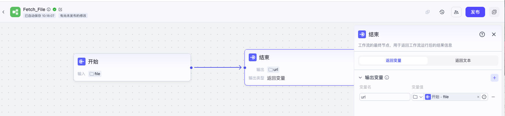

将这个工作流发布后，把浏览器地址栏的 workflow_id 作为上面插件中输入参数 workflow_id 的值传入即可。

现在我们可以随便找个图片，在线转 base64，然后测试一下插件。

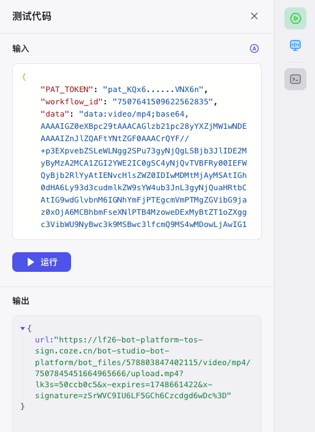

插件测试成功后，将其发布即可使用。

### 结合音视频和数据上传插件实现视频声音合成

接下来我们实现一个简单的音视频合成工作流，通过用户上传音频和视频文件，将它们合成为有声音的视频。

我们创建工作流 Merge_Video_Audio。

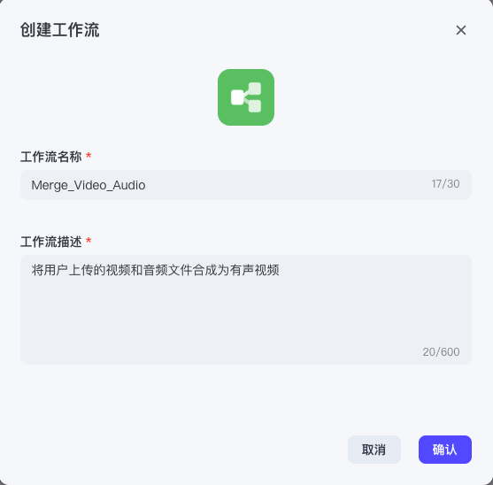

创建工作流之后，添加 base64 上传和音视频两个插件，工作流如下：

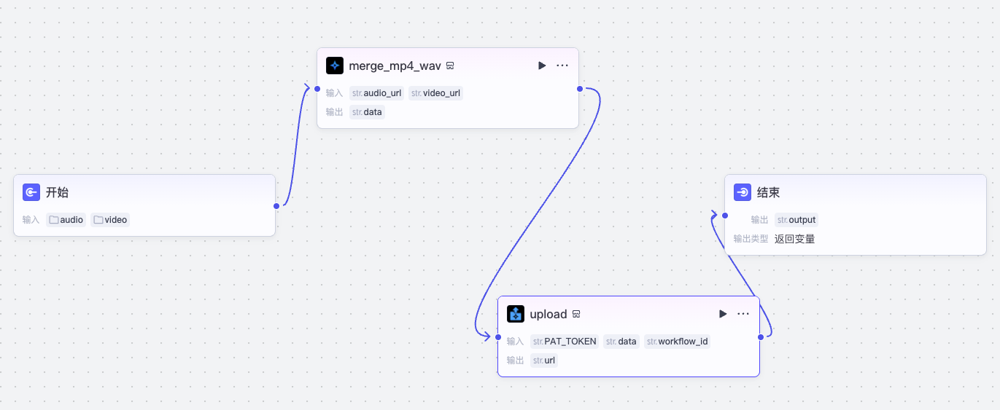

、我之前没有详细介绍 merge_mp4_wav 插件的配置，但我已经将它发布到 Coze 的插件商店里了，所以如果你不想自己实现，可以直接在添加插件时，在插件商店搜“媒体工具”，然后选择“媒体工具箱 > merge_mp4_wav” 即可。

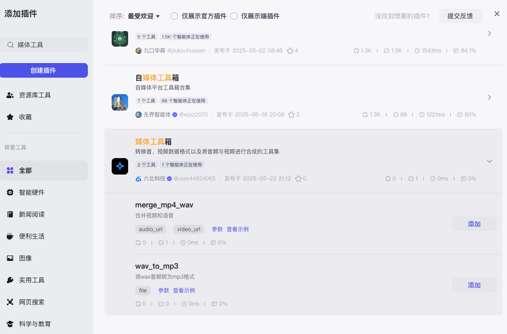

添加两个插件之后，在开始节点配置两个参数：audio，类型为 File/Audio，viedo，类型为 File/video。

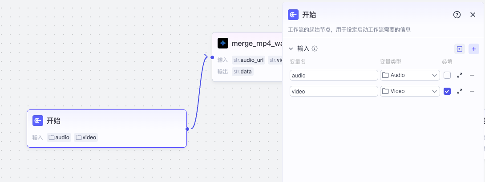

我们将这两个参数传给 merge_mp4_wav，处理为 data（base64 数据格式）。

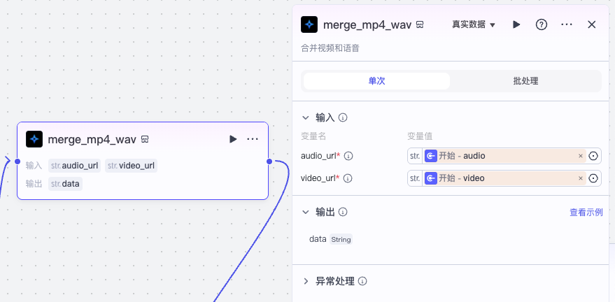

然后配置 upload 插件，将数据上传，得到 url。

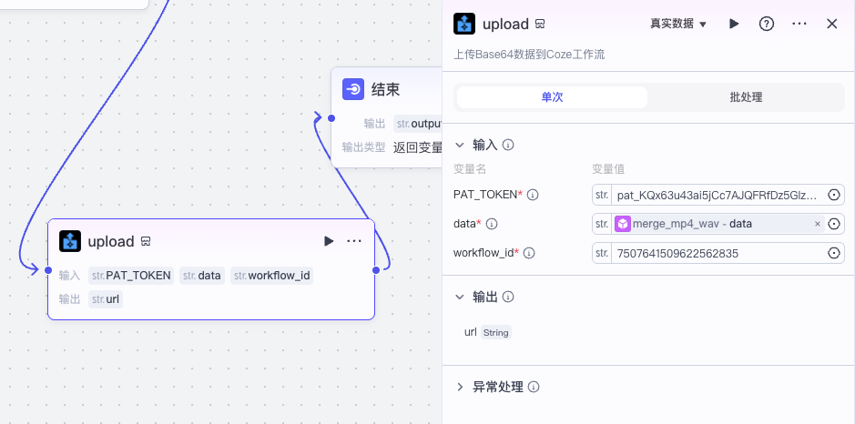

最后我们将结束节点的输出配置给 upload 的输出参数 url，就可以进行测试了：

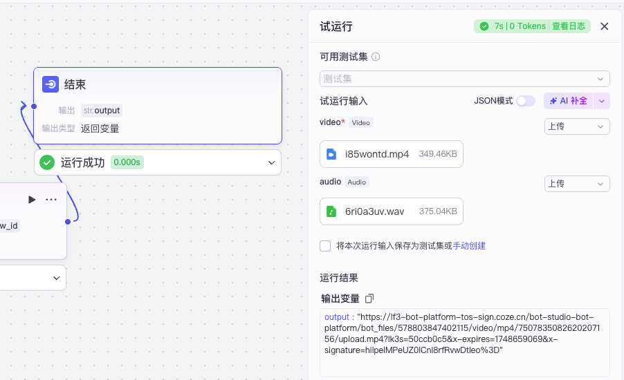

我们上传的视频和音频分别如下：

我们上传的音频和视频你可以通过文稿里的链接获取（[https://pan.baidu.com/s/1JFxUZjtuzAPguAXnx2ifjw ]()提取码: mngv ）。

最终合成的结果如下：

这样我们就利用 Coze 自身的文件上传实现了视频、音频合成的工作流。

接下来我们可以创建并配置智能体，利用这工作流将发送给它的音视频文件进行合成处理了。配置智能体不是很难，有兴趣的同学自行处理。

## 要点总结

这一节，我们讨论了如何巧妙利用 Coze 自身的文件上传来接收、处理和保存数据。这么做的好处是不再依赖任何外部的对象存储服务或 SaaS 平台，只需要 Coze 自身的 API 就可以。

不过，这么做也有一点限制，那就是存储的文件有效期只有三个月，另外使用这个方法需要创建 PAT_Token（Personal Access Token）作为授权凭证，而 PAT_Token 有效期只有一个月，因此长期使用时，还需要我们及时更新 Token。但不管怎么样，对于大多数应用来说，这个临时处理和保存文件的能力也足够了。

## 课后练习

前面我们用的音视频合成插件，是将 mp4 和 wav 进行合成，之所以没有使用 mp3，只是因为我用 Vidu AI 生成的音效默认是 wav 格式。你可以扩展这个插件，让它也支持 mp3、ogg 等其他音频格式与 mp4 的合成，将你扩展后的插件分享到评论区吧。

---
来源：极客时间
链接：https://time.geekbang.org/column/article/885838
日期：2026-05-12
