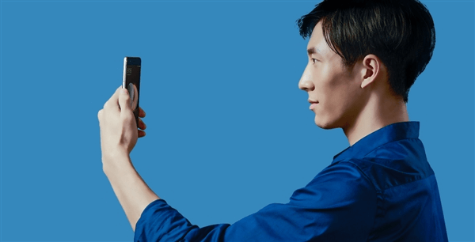
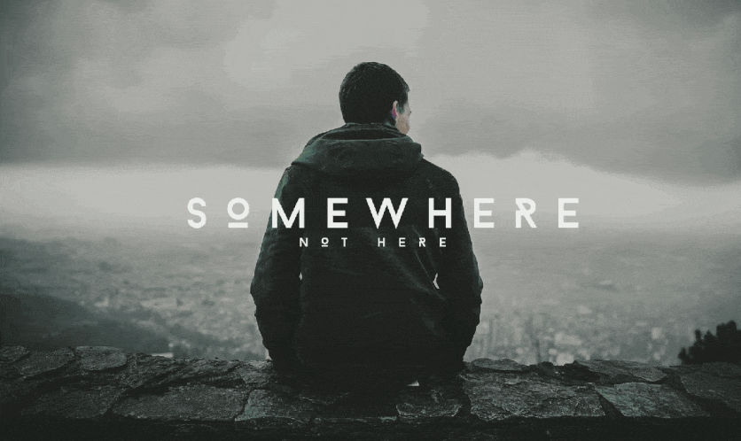
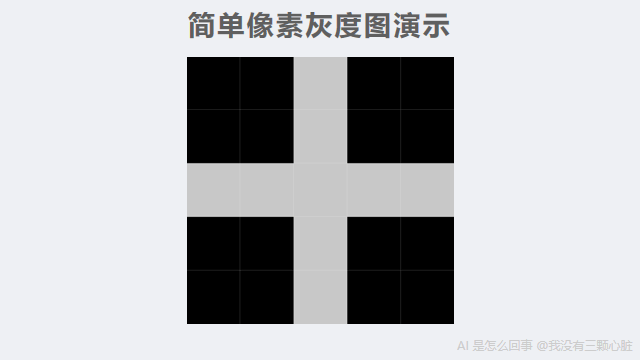
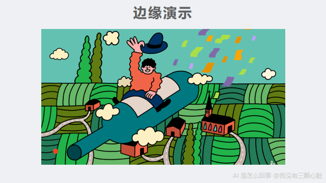
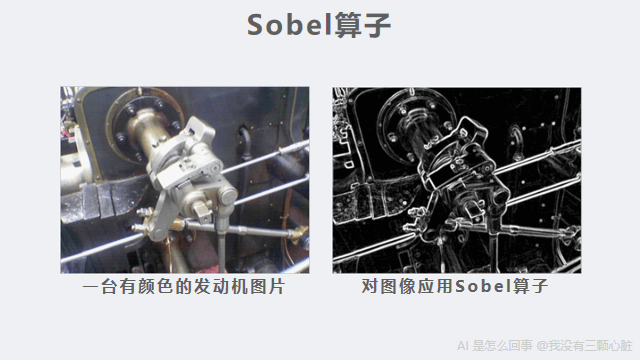
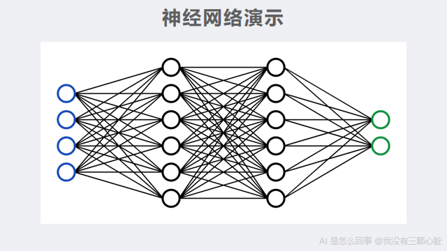
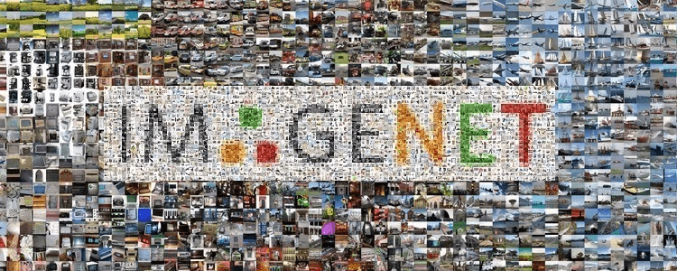
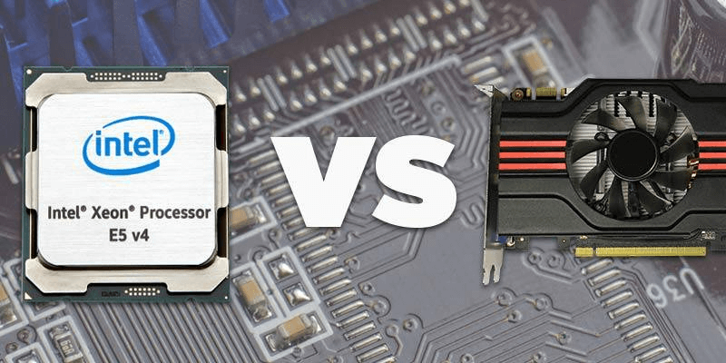
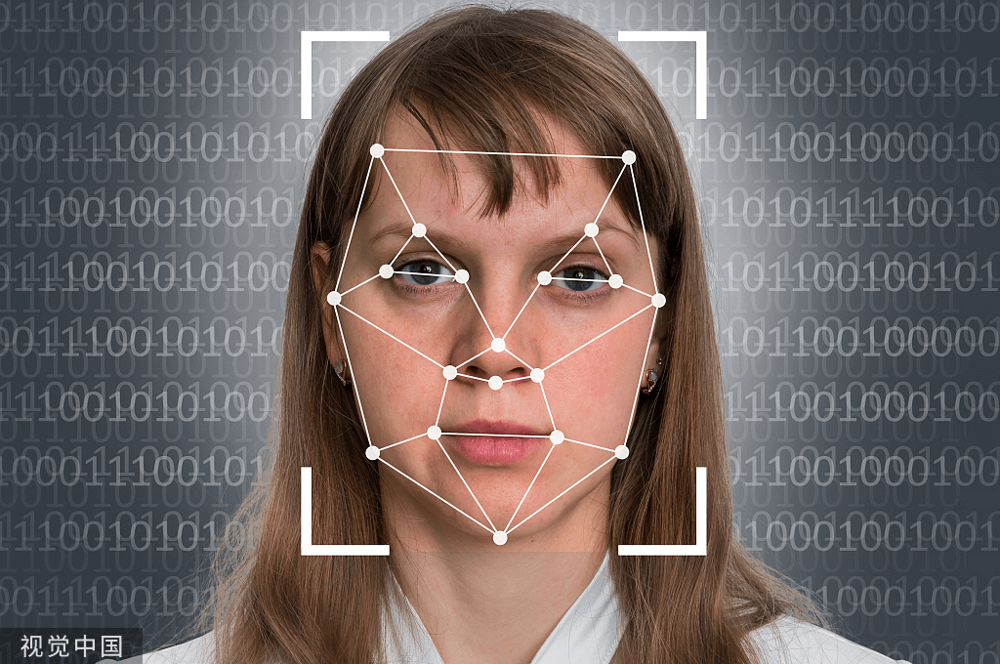

# AI是怎么回事：AI到底聪明在哪——从手机人脸识别说起

> 课程来源：https://wmyskxz.cn/wiki/whats_ai/1/

---

> 这是 **「AI是怎么事」** 系列的第 `1` 篇。我一直很好奇 AI 到底是怎么工作的，于是花了很长时间去拆这个东西——手机为什么换了发型还能认出你，ChatGPT 回答你的那三秒钟里究竟在算什么，AI 为什么能通过律师考试却会一本正经地撒谎。这个系列就是我的探索笔记，发现了很多有意思的东西，想分享给你。觉得不错的话，欢迎分享+关注。



每天早上，你拿起手机，看一眼屏幕，解锁。

整个过程不到一秒。你从来没想过这件事有什么特别的。

不过你可能注意过一个奇怪的事：在几年前，戴上口罩，手机往往就不认识你了。但换了个发型，它照样能解锁。为什么？

先别急着回答。要理解这件事，我们得先搞清楚一个更基本的问题：**手机到底是怎么”人脸识别”的？**

答案要从一个让人意外的事实说起——

**你的手机看到的不是一张脸，而是一堆数字。**

# 电脑眼中的照片
要理解手机怎么”人脸识别”得先回答一个基本问题：**电脑看到的”照片”长什么样？**

一张照片是由很多个小点组成的，这些小点叫**像素**——你把手机照片放大再放大，就能看到一个个小方块，那就是像素。一张 1000×1000 的照片，就有 100 万个像素。



每个像素都有一个颜色，而颜色在电脑里是用数字表示的。

最简单的情况是黑白照片：纯黑是 0，纯白是 255，中间的灰色就是 1 到 254。数字越小越暗，越大越亮。

比如下面这个 5×5 的小图：



在电脑里，它就是这样一张表格：
```
  0   0  200   0   0
  0   0  200   0   0
200 200  200 200 200
  0   0  200   0   0
  0   0  200   0   0
```

0 是黑色，200 是亮色（接近白色）。你能看出来这是一个十字形吗？——中间一横一竖的数字是 200（亮），其余全是 0（暗）。

**这就是电脑”看到”的东西。不是图像，是数字。**

彩色照片稍微复杂一点：每个像素需要三个数字，分别表示红色、绿色、蓝色的强度（也是 0 到 255）。但原理完全一样——归根到底还是数字。

所以当你拿手机对着自己的脸，手机”看到”的是这样的东西：
```
142  98  87 134 156 178 ...
 78  45  52  89 123 145 ...
134 167 189 201 178 156 ...
... (几百万个数字)
```

**手机要做的事情是：看这几百万个数字，判断”这是不是主人的脸”。**

一堆数字，怎么可能认出一张脸？

# 第一个线索：边缘
什么是边缘？就是照片里颜色突然变化的地方。



比如你的脸和背景之间——皮肤是浅色的，背景可能是深色的，这就形成了一条边缘，也就是你脸的轮廓。眼睛也是：眼白是浅色的，瞳孔是深色的，这也是边缘。

**边缘勾勒出了图片里”有东西”的地方。** 找到了边缘，你就找到了轮廓、五官、表情——这些让一张脸变得独特的要素。

但电脑只看到数字啊，它不知道什么是”脸”、什么是”眼睛”。它怎么找到边缘？

答案让我很惊讶：**只用简单的加减乘除就能做到。**

让我用一个具体例子来演示。

# 一道简单的数学题
假设我们有一小块图片，就 9 个像素，排成 3×3：
```
10  10  10
10  10 200
10 200 200
```

左上角是深色（数字 10，接近黑色），右下角是浅色（数字 200，接近白色）。中间有一条从左上到右下的分界线——这就是一条边缘。

现在我用一个”检测器”来扫描它。所谓检测器，就是一组数字组成的小模板——把它叠到图片上，就能检测出图片里有没有某种特征。这个检测器也是 9 个数字：
```
-1  0  1
-2  0  2
-1  0  1
```

这个检测器有个名字，叫 **Sobel 算子**（”算子”就是”计算工具”的意思）。它专门用来检测垂直方向的边缘。为什么这几个数字能检测边缘？先看看它怎么用，你很快就会明白。

怎么用呢？**把检测器叠放到图片上，对应位置的数字相乘，然后全部加起来。**

让我一步一步算给你看：
```
图片:          检测器:
10  10  10     -1  0  1
10  10 200     -2  0  2
10 200 200     -1  0  1

对应位置相乘，然后全部相加：
(10×-1) + (10×0) + (10×1) +
(10×-2) + (10×0) + (200×2) +
(10×-1) + (200×0) + (200×1)

= -10 + 0 + 10 +
  -20 + 0 + 400 +
  -10 + 0 + 200

= 570
```

结果是 570，一个很大的正数。

**这个数字的意思是：这里有一条明显的边缘，从左到右颜色在变亮。** 数字越大，说明边缘越明显。

如果我们换一块颜色完全相同、没有边缘的区域呢？
```
图片:          检测器:
100 100 100    -1  0  1
100 100 100    -2  0  2
100 100 100    -1  0  1

计算：
(100×-1) + (100×0) + (100×1) +
(100×-2) + (100×0) + (100×2) +
(100×-1) + (100×0) + (100×1)

= -100 + 0 + 100 +
  -200 + 0 + 200 +
  -100 + 0 + 100

= 0
```

结果是 0。**没有边缘。**

你看，完全不需要知道什么是”脸”、什么是”眼睛”，只用加减乘除，就能找到图片里颜色变化的地方。

实际使用时，这个检测器会在整张图片上一格一格地滑动，对每个位置都做一次这样的计算。这样就能得到一张新的”边缘地图”——原图中每个位置的数字，变成了”这个位置有没有边缘”的数字。数字大的地方，就是边缘。

**这就是电脑”看”图片的第一步：找到所有颜色突变的位置。**

# 为什么这个检测器能工作？
你可能会好奇：`-1, 0, 1, -2, 0, 2, -1, 0, 1` 这几个数字是怎么来的？为什么这样排列就能检测边缘？

让我解释一下它的逻辑。

仔细看这个检测器的结构：**左边一列全是负数，右边一列全是正数，中间一列全是 0。**
```
-1  0  1
-2  0  2
-1  0  1
```

当它扫描图片的一个区域时，实际上在做这件事：

- **右边像素的亮度 × 正数**（加分）

- **左边像素的亮度 × 负数**（减分）

- **中间像素 × 0**（不影响结果）

所以最终的结果，本质上就是：**右边的亮度 - 左边的亮度。**


- 如果左右两边颜色一样——正数和负数互相抵消，结果是 0（没有边缘）

- 如果右边比左边亮——正数那边贡献更大，结果是正数（有一条从暗到亮的边缘）

- 如果左边比右边亮——负数那边贡献更大，结果是负数（有一条从亮到暗的边缘）

**差异越大，结果的数字越大（不管是正还是负），说明边缘越明显。**

至于中间那列的系数（-2, 0, 2）比两侧的（-1, 0, 1）更大，是为了让检测器更关注正中间一行的变化，让检测结果更稳定。

这个设计很聪明，但也很简单——本质就是”比较左右两边的亮度差”。

顺便说一下这个检测器的来历：Sobel 算子是 [1968 年由 Irwin Sobel 和 Gary Feldman 在斯坦福人工智能实验室的一次演讲中提出的](https://en.wikipedia.org/wiki/Sobel_operator)，至今已经用了半个多世纪。

但你可能已经发现了一个问题：**这个检测器只能找到垂直方向的边缘（左右亮度差）。如果边缘是水平的（上下亮度差）呢？**

很简单——把检测器旋转 90°：
```
-1  -2  -1
 0   0   0
 1   2   1
```

看出来了吗？现在**上面一行全是负数，下面一行全是正数，中间一行全是 0。** 原理完全一样，只是方向变了：它比较的是”下面的亮度 - 上面的亮度”。

- 如果上下颜色一样——结果是 0（没有水平边缘）

- 如果下面比上面亮——结果是正数（有一条水平边缘）

两个检测器配合使用——一个管左右，一个管上下——就能找到图片中任意方向的边缘。哪怕是一条 45° 的斜线，也会同时在左右和上下两个方向上产生亮度差，两个检测器都会给出非零结果。把两个结果综合起来，就能得到每个位置的”边缘强度”和”边缘方向”。

# 从边缘到形状：AI 卡了几十年
找到边缘之后呢？

1968 年的 Sobel 算子能找到边缘，但边缘只是一堆线条。一堆线条还不能告诉我们”这是一张脸”。



**这就是 AI 在”看”这件事上卡住了几十年的地方。**

科学家们尝试了很多方法：

- 有人试着写规则：”如果有两个圆形在上面，一个三角形在中间，下面有一条横线，那可能是一张脸”

- 有人试着提取更复杂的特征：”检测眼睛的形状”、”测量鼻子的位置”

但这些方法都撞上了同一堵墙：**要人类告诉电脑什么是”眼睛”、什么是”鼻子”。**

一个人的脸可以有无数种表情、无数种角度、无数种光线。侧脸怎么办？戴帽子怎么办？只露出半张脸怎么办？

你怎么可能把所有情况都写成规则？

**规则越写越多，但永远覆盖不了真实世界的复杂性。**

这个困境持续了几十年，直到一个想法改变了一切：

**不要人类来设计检测器，让电脑自己学。**

# 核心突破：让电脑自己学
还记得前面的 Sobel 算子吗？
```
-1  0  1
-2  0  2
-1  0  1
```

这 9 个数字是人类设计的。人类知道”要检测垂直边缘，就要比较左右两边的亮度”，所以选择了这样的数字组合。

**但如果让电脑自己来选呢？**

假设我们不指定这 9 个数字，而是把它们变成”空的”——可以填入任何数值：
```
?  ?  ?
?  ?  ?
?  ?  ?
```

一开始，随机填一组数字，比如：
```
0.1  -0.3   0.5
0.2   0.1  -0.4
0.3   0.2   0.1
```

用这个随机检测器去扫描图片，结果肯定是乱七八糟的。

**但如果我们告诉电脑”正确答案”呢？**

就像老师批改作业一样。我们先用一个更简单的任务来说明这个过程——区分猫和狗。别担心，人脸识别的学习过程完全一样。

给电脑看 1000 张猫的照片和 1000 张狗的照片，每张都贴好标签——“这是猫”、”这是狗”。

电脑用随机检测器算出一个结，和正确答案对比：

- 如果猜对了——不错，保持

- 如果猜错了——**调整那 9 个数字**，让下次更可能猜对

怎么调整？不是随机乱调，而是有一套精巧的方法能算出每个数字该往大了调还是往小了调。这个方法叫”反向传播”，我后面会专门讲。现在你只需要知道：电脑有办法算出调整的方向和幅度。

重复这个过程几百万次。

**神奇的事情发生了：那些原本随机的数字，会自己变成有意义的检测器。**

有的变成了边缘检测器（类似 Sobel 算子——电脑自己”发明”了类似的东西）。
有的变成了颜色变化检测器。
有的变成了纹理检测器。
还有一些，检测的东西连人类都说不清楚——但它们确实对区分猫和狗有用。

**电脑没有被告知”要检测边缘”。它自己发现了”检测边缘有助于区分猫和狗”。**

这就是”学习”的本质：不是有人教了它规则，而是它从大量的对错反馈中，自己找到了有用的规律。

# 叠加：从线条到人脸
但一检测器还不够。

一个边缘检测器只能告诉你”这里有一条线”，不能告诉你”这是一只眼睛”。

**解决方法是：叠加很多层。**

想象这样一个过程：

- **第一层检测器**：从原始像素中找到各种边缘——横线、竖线、斜线、曲线

- **第二层检测器**：把第一层找到的边缘组合起来，识别简单形状——圆形、三角形、弧线

- **第三层检测器**：把形状组合成部件——眼睛（两条弧线围成的椭圆）、鼻子（一个三角形轮廓）、嘴巴（两条曲线）

- **第四层检测器**：把部件组合成整体——人脸、猫脸、汽车
```
像素 → 边缘 → 形状 → 部件 → 整体
```


每一层都是在上一层的基础上，检测更复杂的东西。第一层只能看到线条，但叠加四五层之后，就能看到”脸”了。

**这就是”深度学习”里”深度”的含义——很多检测器叠加在一起。** 层数越多，能识别的东西就越复杂。

这种”很多层检测器叠加”的结构，有一个名字，叫**神经网络**。之所以叫这个名字，是因为它的工作方式有点像人脑中的神经元——每个神经元接收信号、处理一下、再传给下一个。



这个类比最早来自 [1943 年 McCulloch 和 Pitts 的论文](https://en.wikipedia.org/wiki/Artificial_neuron)，他们第一次用数学来描述神经元的工作方式。不过你不需要把这个类比想得太深——它只是一种”层层传递、层层加工”的计算结构。层数很多的神经网络，就叫”深度神经网络”，用它来学习的方法，就是”深度学习”。

而关键是：**每一层的检测器里的数字，都不是人类设计的，是电脑自己从数据里学出来的。**

2012 年，神经网络研究的先驱 Geoffrey Hinton 的学生 Alex Krizhevsky 用这种”多层叠加”的方法做了一个图像识别程序，取名 [AlexNet](https://papers.nips.cc/paper/4824-imagenet-classification-with-deep-convolutional-neural-networks)（Alex 的网络）。它有 8 层。其中前 5 层做的就是我们前面演示的操作——用检测器在图片上滑动、对应位置相乘再相加（这个操作的专业名称叫”卷积”，所以这几层叫”卷积层”）。后 3 层负责把前面提取到的所有信息汇总起来做最终判断（叫”全连接层”——你可以把它想象成”汇总投票”，把所有检测器发现的信息都汇集在一起，综合判断最终结果）。

整个网络包含 [6000 万个可调整的数字](https://en.wikipedia.org/wiki/AlexNet)。这些可调整的数字，在 AI 领域有一个专门的名称，叫”参数”。AlexNet 的 6000 万个参数震惊了整个计算机视觉领域。而今天的大型模型，动辄几十层、上百层，参数量更是以亿计。

# 训练：电脑怎么知道该往哪调？
你可能还记得前面留下的那个问题：猜错的时候，电脑怎么知道该把那些数字往大了调还是往小了调？

这是整个系统最精巧的部分，叫做**反向传播**——[1986 年由 Rumelhart、Hinton 和 Williams 发表在《Nature》（全球最权威的科学期刊之一）上的一篇论文](https://www.nature.com/articles/323533a0)奠定了这个方法的基础。

让我用一个简化的例子来说明。

假设电脑要判断一张图是猫还是狗。经过层层计算，它输出”60% 可能是猫”，但正确答案是”狗”。

它错了。错了多少？差了很多——它说 60% 是猫，但应该是 0%。

**反向传播做的事情是：从最后的错误出发，一层一层往回追溯，算出每一个数字对这个错误的”贡献”有多大。**

就像考试之后对答案：

- 最终结果错了

- 是因为最后一步的某个数字偏了

- 那个数字偏了，是因为上一层的某个检测器输出偏了

- 那个检测器偏了，是因为里面的某个数字该大一点

电脑会计算：如果某个检测器里的某个数字**稍微变大一点**，最终的错误会**变大还是变小**？

- 如果变小——好，把那个数字**调大一点**

- 如果变大——反过来，把那个数字**调小一点**

每次调整的幅度都很小（比如 0.001），但对所有数字同时做这种微调，重复几百次之后，那些数字就会逐渐稳定下来，到达一个”很少出错”的状态。

**这就是”训练”。**

一个现代的人脸识别模型可能有几百万到上亿个参数。比如 Google 在 2015 年发表的 [FaceNet](https://arxiv.org/abs/1503.03832)，旗舰模型超过 1 亿个参数，在人脸识别领域常用的测试集 [LFW](https://vis-www.cs.umass.edu/lfw/)（Labeled Faces in the Wild，从互联网上收集的真实场景人脸照片，包含 5749 个人的 13000 多张照片）上达到了 [99.63% 的准确率](https://arxiv.org/abs/1503.03832)。训练这样一个模型，需要给电脑看几百万张人脸照片，每一张都要把所有参数调整一遍。

这需要大量的计算。

# 为什么 2012 年才成功？
你可能会好奇：如果”让电脑自己学”这个想法这么好，为什么没有更早实现？

事实上，神经网络的概念在 1940 年代就有了，反向传播算法在 [1986 年发表了](https://www.nature.com/articles/323533a0)。

**那为什么到 2012 年才突然成功？**

因为三个条件终于同时凑齐了：

**1. 数据**

2009 年，斯坦福大学的李飞飞教授团队发布了 [ImageNet 数据集](https://www.image-net.org/static_files/papers/imagenet_cvpr09.pdf)。最终这个数据集包含了超过 [1400 万张标注好的图片](https://en.wikipedia.org/wiki/ImageNet)，涵盖 2 万多个类别。



“标注好”的意思是：每张图片都有人告诉你”这是猫”、”这是狗”、”这是汽车”。这些”正确答案”是电脑学习的前提——没有答案，就无法判断对错，也就无法调整那些数字。

在此之前，没有人花这么大力气去收集和标注这么多图片。为了建成 ImageNet，李飞飞团队通过亚马逊的众包平台（一种把任务拆成小块、分给大量网上工人完成的平台），动用了来自 167 个国家的近 [5 万名标注工人](https://qz.com/1034972/the-data-that-changed-the-direction-of-ai-research-and-possibly-the-world)，从 1.6 亿张候选图片中筛选和标注

**2. 算力**

训练一个模型，需要对几百万张图片、几千万个参数反复做计算。用普通电脑的 CPU（中央处理器，电脑的”大脑”，擅长一件一件地处理复杂任务），这可能要算好几个月甚至几年。

2012 年的突破用了一个聪明的办法：**用游戏显卡（GPU，Graphics Processing Unit，图形处理器）来算。**



GPU 原本是用来生成（渲染）游戏画面的。游戏画面需要同时计算屏幕上几百万个像素的颜色，所以 GPU 特别擅长”同时做很多简单的计算”。

而训练神经网络恰好也是这种活——对几百万个数字做大量简单的乘法和加法。

2009 年，斯坦福的吴恩达（Andrew Ng）团队就发表了一篇论文，证明在特定任务上，[GPU 训练神经网络比 CPU 快约 70 倍](https://robotics.stanford.edu/~ang/papers/icml09-LargeScaleUnsupervisedDeepLearningGPU.pdf)。

Alex Krizhevsky 正是用两块游戏显卡（[NVIDIA GTX 580，当时售价 499 美元](https://videocardz.com/nvidia/geforce-500/geforce-gtx-580)），花了大约 5-6 天，训练出了 AlexNet。

**3. 算法**

AlexNet 还用了几个关键的技术改进。比如，一种让深层网络更容易训练的数学技巧（叫 ReLU），以及一种防止网络”死记硬背”训练数据的方法（叫 Dropout——随机”关掉”一部分检测器，逼网络学到更通用的规律，而不是死记每张图的细节）。这些技术让更深的网络变得可训练。

**三个条件——海量数据、GPU 算力、算法改进——同时到位，才有了 2012 年的突破。**

那次突破有多震撼？在 ImageNet 图像识别比赛中，AlexNet 将错误率从同年第二名的 [26.2% 直接降到了 15.3%](https://papers.nips.cc/paper/4824-imagenet-classification-with-deep-convolutional-neural-networks)（这里的”错误率”叫 top-5 错误率——给电脑 5 次机会猜图片内容，5 次都猜错才算错）——领先超过 10 个百分点。打个比方：所有人都在 74 分左右竞争，突然有人考了 85 分。

# 回到手机人脸识别



现在你知道手机是怎么认出你的。

让我把完整的过程串起来：

- **采集面部数据**：手机用摄像头和传感器采集你的面部信息，变成几百万个数字（说明一下：现代手机的人脸解锁不只靠普通摄像头——比如 iPhone 的 Face ID 会用红外线在你脸上投射上万个不可见的小点，测量脸的立体形状，这样就不会被一张照片骗过去。但核心识别原理——把采集到的数据变成数字、层层提取特征——和我们前面讲的完全一样）

- **层层检测**：这些数字经过很多层检测器——第一层找边缘，第二层找形状，第三层找五官部件，层层叠加

- **提取特征**：最后一层输出一组数字——你可以把它理解为你这张脸的”数字指纹”（专业术语叫”特征向量”，就是一串能代表你长相特征的数字）

- **比较**：把这个数字指纹和你第一次录入时存下的数字指纹做比较

- **判断**：如果两组数字足够接近——解锁

**整个过程没有任何”理解”。**

手机不知道什么是眼睛、什么是鼻子。它只是在做加减乘除：把像素变成边缘，把边缘变成形状，把形状变成部件，把部件变成一组代表你这张脸的数字，然后比较两组数字有多接近。

那些检测器里的数字，是从几百万张人脸照片中”学”出来的。没有人告诉电脑”要检测眼睛”，它自己在反复的”猜对了/猜错了”中发现了某些数字组合对区分不同人脸特别有用。

**这就是 AI 的”聪明”：不是真的理解，而是从海量数据中找到了反复出现的模式——比如”眼睛区域的像素通常呈现这样的数字组合”。**

现在可以回答文章开头的那个问题了：为什么戴口罩手机就不认识你，但换发型还能认出来？

因为口罩遮住了脸的下半部分——嘴巴、下巴这些区域的面部特征被口罩挡住了，检测器提取出来的数字指纹和你录入时的差太远了。而发型属于脸的外围，检测器关注的主要是五官区域的特征——发型变了，但眼睛、鼻梁这些区域的数字模式没变，所以还能匹配上。

不过你可能发现了，现在一些新手机即使戴口罩也能解锁——那是因为厂商后来专门用大量戴口罩的照片重新训练了模型，让检测器学会了只靠眼睛和眉毛区域的特征来识别你。

# 一个新的问题
理解了 AI 怎么”认人”之后，我产生了一个新的疑问：

AI 能”看”了——图片在它眼里是数字矩阵，它通过层层检测器从数字中提取特征。

**但文字呢？**

当你对 ChatGPT 说”苹果”，它”看到”的是什么？不是一个水果的画面，不是咬一口的味道——那它”看到”的是什么？

文字怎么变成数字？AI 又怎么”理解”这些数字的意思？

下一篇，我们来聊这个问题。你会看到一个让我非常震撼的例子：”国王”减去”男人”，加上”女人”，等于什么？

# 参考资料

- [Sobel operator - Wikipedia](https://en.wikipedia.org/wiki/Sobel_operator) — Sobel 算子由 Irwin Sobel 和 Gary Feldman 于 1968 年在斯坦福人工智能实验室提出

- [A logical calculus of the ideas immanent in nervous activity - McCulloch & Pitts (1943)](https://en.wikipedia.org/wiki/Artificial_neuron) — 第一个神经元数学模型，”神经网络”名称的起源

- [ImageNet Classification with Deep Convolutional Neural Networks - Krizhevsky, Sutskever, Hinton (2012)](https://papers.nips.cc/paper/4824-imagenet-classification-with-deep-convolutional-neural-networks) — AlexNet 论文，8 层网络，6000 万参数，top-5 错误率 15.3%

- [AlexNet - Wikipedia](https://en.wikipedia.org/wiki/AlexNet) — AlexNet 架构细节与参数量

- [FaceNet: A Unified Embedding for Face Recognition and Clustering - Schroff, Kalenichenko, Philbin (2015)](https://arxiv.org/abs/1503.03832) — Google 的人脸识别模型，LFW 准确率 99.63%

- [Labeled Faces in the Wild](https://vis-www.cs.umass.edu/lfw/) — LFW 人脸识别测试集官方页面

- [Learning representations by back-propagating errors - Rumelhart, Hinton, Williams (1986)](https://www.nature.com/articles/323533a0) — 反向传播算法的奠基论文，发表于 Nature

- [ImageNet: A Large-Scale Hierarchical Image Database - Deng, Dong, Socher, Li, Li, Fei-Fei (2009)](https://www.image-net.org/static_files/papers/imagenet_cvpr09.pdf) — ImageNet 数据集论文，超过 1400 万张标注图片

- [The data that transformed AI research — and possibly the world - Quartz](https://qz.com/1034972/the-data-that-changed-the-direction-of-ai-research-and-possibly-the-world) — ImageNet 的建设过程，49000 名标注工人来自 167 个国家

- [Large-scale Deep Unsupervised Learning using Graphics Processors - Raina, Madhavan, Ng (2009)](https://robotics.stanford.edu/~ang/papers/icml09-LargeScaleUnsupervisedDeepLearningGPU.pdf) — GPU 训练神经网络比 CPU 快约 70 倍

- [NVIDIA GeForce GTX 580 - VideoCardz](https://videocardz.com/nvidia/geforce-500/geforce-gtx-580) — GTX 580 于 2010 年 11 月发布，建议零售价 $499

# 订阅
如果觉得有意思，欢迎关注我，后续文章也会持续更新。同步更新在[个人博客](https://www.wmyskxz.cn/)和[微信公众号](https://weixin.sogou.com/weixin?type=1&s_from=input&query=wmyskxz&ie=utf8&_sug_=n&_sug_type_=&w=01019900&sut=1861&sst0=1612590375262&lkt=8,1612590373961,1612590375161)

微信搜索”我没有三颗心脏”或者扫描二维码，即可订阅。


---

*笔记整理日期：2026-05-18*
