# AI是怎么回事：AI 能创造吗？——从一团噪声到一幅画

> 课程来源：https://wmyskxz.cn/wiki/whats_ai/10/

---

> 这是 **「AI是怎么回事」** 系列的第 10 篇。我一直很好奇 AI 到底是怎么工作的，于是花了很长时间去拆这个东西——手机为什么换了发型还能认出你，ChatGPT 回答你的那三秒钟里究竟在算什么，AI 为什么能通过律师考试却会一本正经地撒谎。这个系列就是我的探索笔记，发现了很多有意思的东西，想分享给你。觉得不错的话，欢迎分享+关注。
> 第一次看到这个系列？从[第1篇](https://wmyskxz.cn/wiki/whats_ai/1/)开始最顺畅，直接读这篇也没问题。

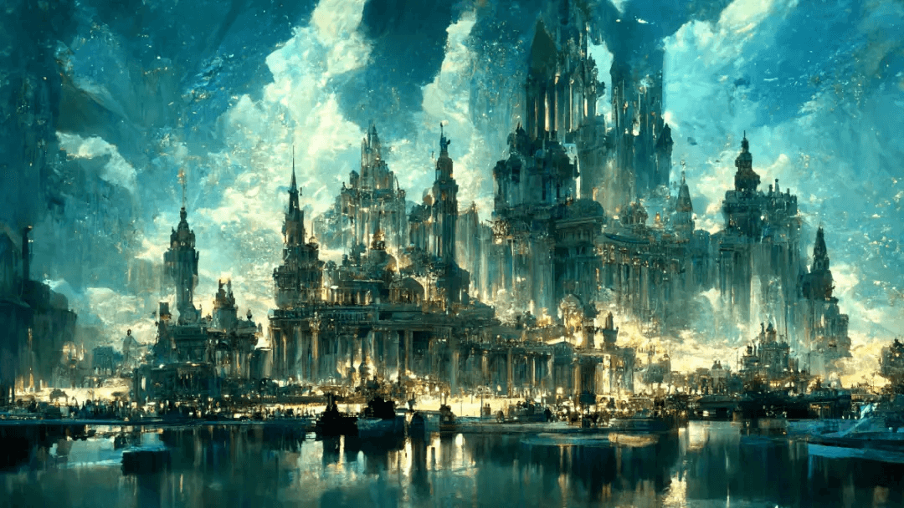

上一篇结尾，我留了一个让我自己困惑了很久的问题：

> 一个只会匹配模式的机器，怎么可能”创作”？

第一章我们花了 8 篇建立了一个核心模型：**AI 是超级模式匹配器。** 上一篇我们用它解释了 ChatGPT 为什么能通过考试却算不对小数——因为每项能力都独立取决于训练数据和任务结构。

但 AI 绘画呢？

你对 AI 说”一只穿宇航服的猫站在月球上”，它画出一张从未存在过的图片。这看起来不是在”匹配”已有的东西——这是在”创造”新的东西。

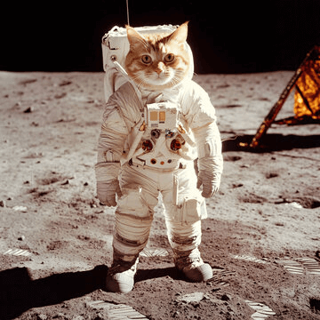

如果我们的”超级模式匹配器”模型真的正确，它应该也能解释这件事。如果解释不了，这个模型就需要修正。

让我们带着这个赌注，把 AI 绘画的黑箱拆开。

# 30 秒回忆——AI 眼中的图片
先用 30 秒回忆第 1 篇的核心结论——

**在 AI 眼中，一张图片就是一堆数字。** 一张 1000x1000 的彩色照片，就是 300 万个 0 到 255 之间的数字。第 1 篇我们用 3x3 像素网格和 Sobel 算子演示过：AI 做的所有”视觉”任务，本质上都是在这些数字上做乘法和加法。

记住这一点。

现在想一个问题：第 6 篇我们知道，ChatGPT 生成文字的方式是”预测下一个词”。那 AI 生成图片，是不是某种”预测下一个像素”？

不完全是。一张 512x512 的图有 78 万个像素，逐个预测每个像素不仅计算量巨大，而且像素之间的关系远比词与词之间的关系复杂——一个像素的颜色取决于周围所有像素。AI 绘画用了一种更巧妙的方法——不是”从无到有地画”，而是**「从一团噪声中把图片找出来」**。

# AI 绘画的核心——“去噪”，不是”画”
2022 年以来，Midjourney、DALL-E、Stable Diffusion——这些 AI 绘画工具背后，都用了同一种核心技术：**扩散模型**（Diffusion Model）。

“扩散”听起来很抽象。让我用一个日常场景类比。

## 从一团雪花说起
想象你在看一张清晰的照片。现在，我一点一点往照片上撒”雪花”——每撒一次，画面就模糊一点。撒一千次之后，整张照片变成纯白的雪花屏——你完全看不出原来是什么了。

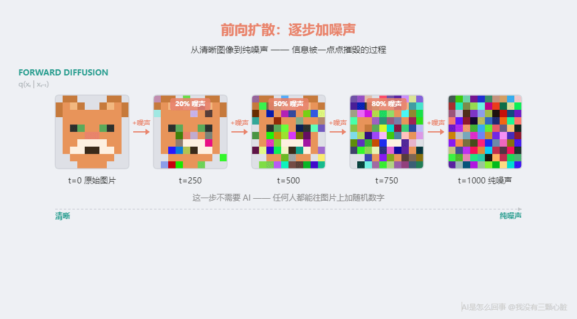

从清晰图片到纯噪声，叫**前向扩散**。这一步不需要 AI，你拿计算器就能做。

**关键的一步是反过来：AI 学会了从纯噪声”还原”出清晰图片。**

这个反向过程叫**反向扩散**，也叫**去噪**。

## 用 3x3 像素看懂全过程
和第 1 篇用 3x3 像素演示 Sobel 算子一样，让我用一个最小的例子把整个过程走一遍——**你可以拿计算器验算每一步。**

**第一步：一张 3x3 的原始图案**

假设我们有一张极简的小图——一个”L”形：
```
原始图片：
  0     0   200
  0     0   200
200   200   200
```

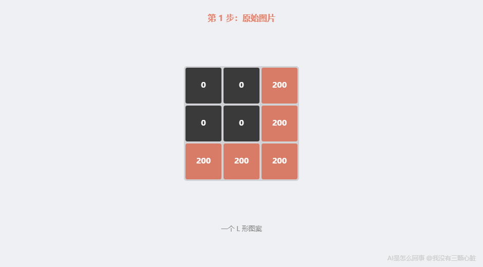

0 表示黑色，200 表示亮色。右边一列和底下一行是亮的，其余是暗的——一个”L”形。

**第二步：加噪声（前向扩散）**

往每个像素加一个随机数字。假设随机生成的噪声是：
```
噪声：
 23   -15   -15
-12    18    20
 15   -12   -22
```

原图加噪声：
```
加噪后（原始 + 噪声）：
  0+23     0+(-15)   200+(-15)       23   -15   185
  0+(-12)  0+18      200+20     =   -12    18   220
200+15     200+(-12)  200+(-22)     215   188   178
```

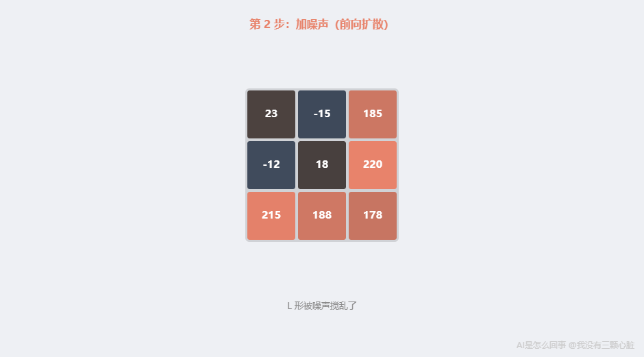

验算：0 + 23 = 23，0 + (-15) = -15，200 + (-15) = 185……每个数字都对得上。

加噪之后，”L”形被搅乱了。噪声再大一些、再加几轮，就变成完全随机的数字。

**第三步：AI 预测噪声**

关键来了。我们把加噪后的图片交给 AI，问它：**「你觉得这张图上面加了什么噪声？」**

AI 经过训练后，输出它对噪声的预测：
```
AI 预测的噪声：
 23   -15   -15
-12    18    20
 15   -12   -22
```

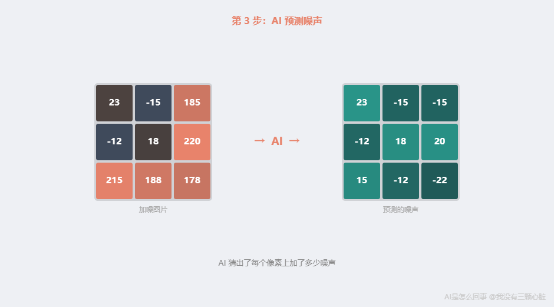

（这个简化例子里我假设预测完美。实际中每步都有误差，所以需要多步去噪——每步去掉一点点，逐渐逼近清晰图片。）

**第四步：去噪（反向扩散）**

用加噪后的图片减去预测的噪声：
```
去噪后（加噪图 - 预测噪声）：
 23-23     (-15)-(-15)   185-(-15)       0     0   200
(-12)-(-12)  18-18       220-20     =    0     0   200
215-15       188-(-12)   178-(-22)     200   200   200
```

验算：23 - 23 = 0，-15 - (-15) = 0，185 - (-15) = 200……
```
去噪结果：
  0     0   200
  0     0   200
200   200   200
```

**“L”形回来了。**

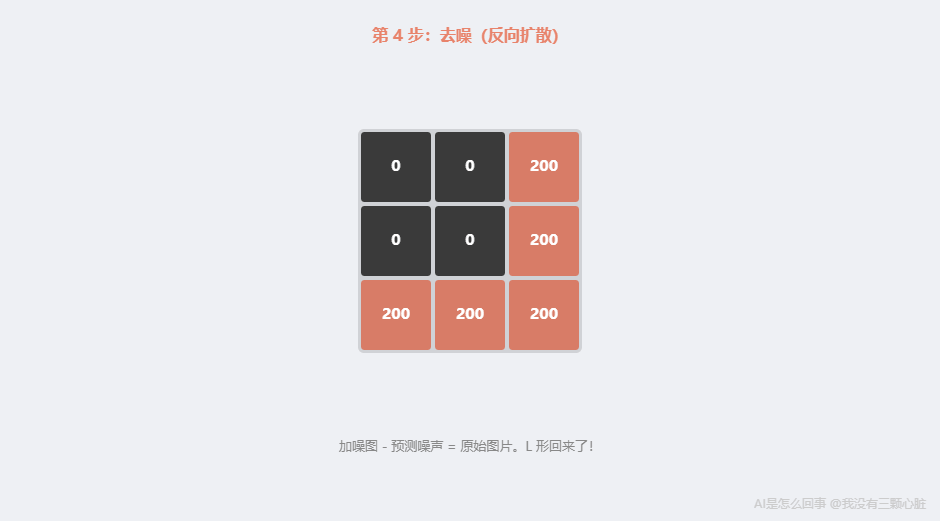

这就是扩散模型的全部核心逻辑：**AI 不是在”画画”，是在”猜噪声”——猜对了噪声，减掉它，图片就”浮现”出来了。**

## 怎么教会 AI “猜噪声”
AI 怎么知道噪声长什么样？

和第 1 篇讲的完全一样：**大量练习 + 批改作业。**

- 拿一张真实照片

- 往上面加一定量的随机噪声（加多少是随机的）

- 让 AI 看加了噪声的图片，猜：加了什么噪声？

- 把 AI 猜的和真正加的做对比——差距越小越好

- 根据差距调整 AI 的参数（第 5 篇：反向传播）

- 用**几百万张图片**，重复**几百万次**

训练完成后，AI 学会了：**给我任何一张带噪声的图片，我能预测它上面的噪声是什么。**

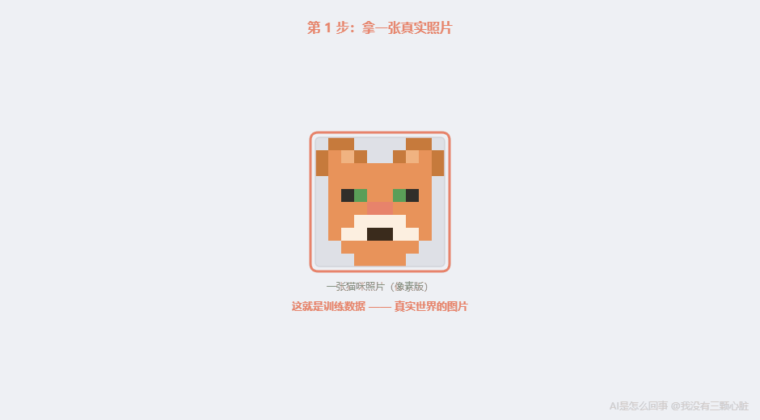

# 关键问题：为什么是”新”图片，不是”复制”？
到这里你可能已经发现了一个问题：

如果 AI 是从噪声中”恢复”图片，恢复出来的不就是训练数据里的某张旧图吗？怎么算”创造”新图？

这是一个非常好的问题。

**AI 在训练中学到的，不是”某张具体图片的噪声”，而是”图片中的统计规律一般长什么样”。**

为什么？因为训练时的噪声每次都是随机的、不可复制的，AI 不可能记住某张特定图片对应的噪声。它能学到的只有一样东西：在数百万张图片中反复出现的视觉规律——五官的位置、天空的颜色、物体的轮廓。正是这些跨图片的统计共性，让 AI 能从任何一团噪声中”还原”出符合规律的新图片。

看过几百万张人脸之后，AI 学到的不是”张三的脸长什么样”，而是——眼睛通常在脸的上半部分，鼻子通常在两眼中间，皮肤颜色在某个范围内。看过几百万张风景照之后，AI 学到的是——天空通常在上方，地面在下方，树通常是绿色的。

当 AI 从纯噪声开始去噪时，它把这些**统计模式**注入到了噪声中。最终生成的图片符合”图片应有的统计规律”，但不是任何一张训练图片的复制品。

**这和 ChatGPT 的逻辑完全一样。** 第 9 篇我们分析过：ChatGPT 不是在”回忆”训练数据中的某段文字，而是根据统计模式”续写”新文字。扩散模型也不是在”回忆”某张图片，而是根据统计模式”去噪出”新图片。

类比：一个读过几百万篇文章的作家，写出的新文章不是任何旧文章的拷贝——但遣词造句受到了所有读过的文章的影响。AI 绘画也是如此：每张新图都带着几百万张训练图片的统计”影子”，但它本身是全新的。

# 文字怎么指导画画？——CLIP
你可能又有一个问题：上面的”去噪”是随机的——AI 从纯噪声出发，可能去噪出猫、风景、或人脸。但 Midjourney 和 DALL-E 明明是你输入一段文字，它就画出对应的图。

**文字是怎么指导画画的？**

这需要另一个关键技术：**CLIP**（Contrastive Language-Image Pretraining，对比语言-图像预训练），由 OpenAI 在 [2021 年发布](https://openai.com/index/clip/)。

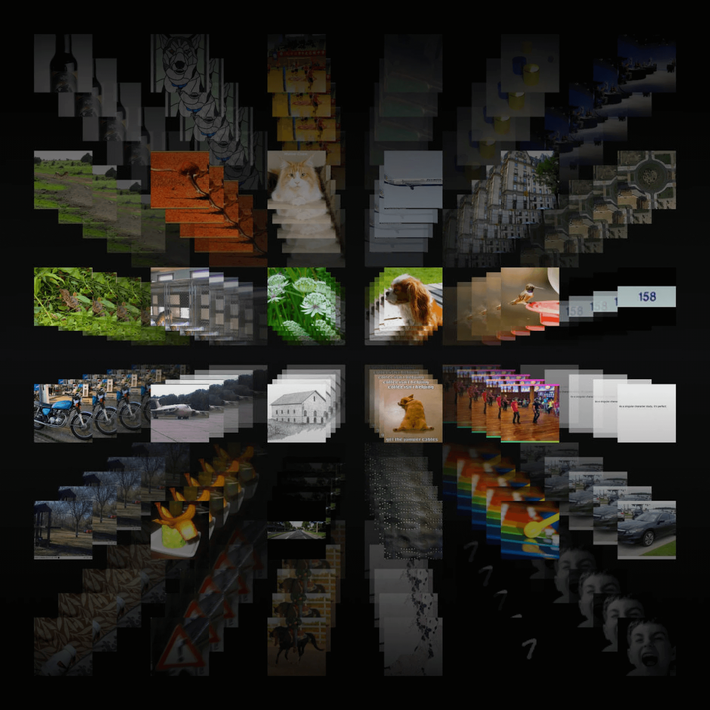

## CLIP：给文字和图片搭桥
CLIP 的训练思路很直观。

想象桌上有 1000 张照片和 1000 段文字描述，某些配对——“一只金毛犬在沙滩上奔跑”配一张对应的照片。你的任务是把每段文字和对应照片配对。

CLIP 做的就是这件事——只不过规模大得多。OpenAI 从互联网上收集了**约 4 亿对图文数据**。4 亿是什么概念？如果你每秒看一对，不吃不喝不睡觉，要看 12 年多。

用这些数据，OpenAI 训练了两个”编码器”：

- **图片编码器**：把一张图片转换成 **512 个数字**（一个 512 维向量）——代表图片的”特征”。还记得第 2 篇的词向量吗？一个词用 768 个数字描述，维度接近。而 CLIP 通过训练让图片向量和文字向量共享同一个数学空间——配对的图文在这个空间中靠近，不配对的远离。

- **文字编码器**：把一段文字也转换成 512 个数字。

训练目标：**让配对的图文向量在 512 维空间中靠近，不配对的远离。**

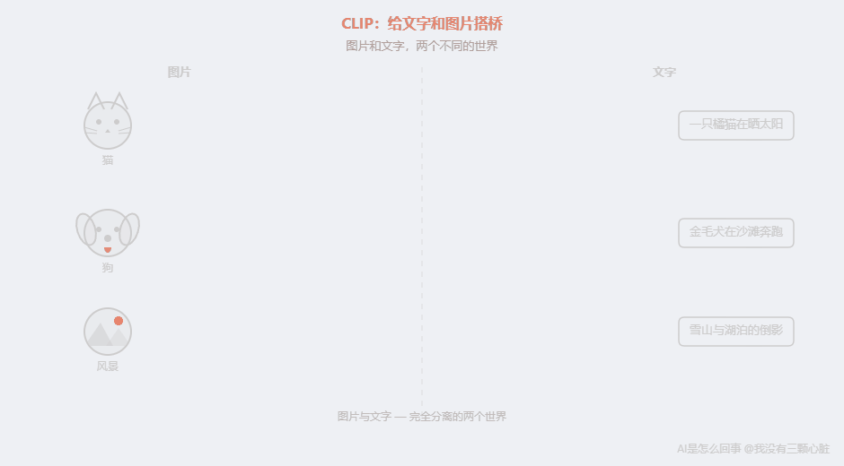

训练完成后，CLIP 建立了一座**文字和图片之间的翻译桥梁**。你给它任何一段文字——哪怕是”一只穿宇航服的柴犬在月球上弹吉他”这种从未出现在训练数据中的描述——它都能把这段文字变成一个 512 维向量，指向”柴犬””宇航服””月球””弹吉他”这些视觉概念组合的方向。

## CLIP + 扩散模型：文字给去噪指方向
有了 CLIP，把文字和画画连起来就顺理成章了。

以 Stable Diffusion 为例：

- 你输入文字：”一只穿宇航服的柴犬在月球上弹吉他”

- CLIP 的文字编码器把这段话变成 512 维向量

- 扩散模型从纯噪声开始去噪——但**每一步**去噪都参考这个文字向量

- “参考”的方式：AI 在决定”去掉多少噪声”时，不仅看当前图片状态，还看文字向量指的方向。文字说”柴犬”，就往”狗的统计模式”方向去噪；说”宇航服”，就同时往”宇航服的统计模式”方向去噪

- 大约 20 到 50 步后，一张符合文字描述的图片从噪声中”浮现”出来

你可以把这想象成雕塑：一块大理石（纯噪声）本身没有形状，雕塑家（AI）根据设计图纸（文字向量），一刀一刀去掉多余材料（噪声），最终雕像（清晰图片）就显现了。文字向量就是那张图纸——告诉 AI 每一步该往哪个方向”雕刻”。

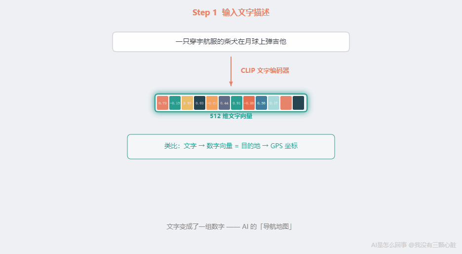

# VAE——在缩略图上画草稿
核心原理你已经知道了。但还有一个重要的工程问题：**直接在原始像素上做去噪太慢了。**

一张 512x512 的彩色图片有 512 × 512 × 3 = **786,432 个数字**。每步去噪都要对这 78 万多个数字做矩阵运算，还要做 20 到 50 步。

Stable Diffusion 的做法很聪明——引入了 **VAE**（Variational Autoencoder，变分自编码器）。

打个比方：你要在一张高清大地图上规划路线。直接在大地图上画，每一笔都要处理海量细节——太慢。更聪明的做法：先把大地图**缩小**成草图，在草图上画好路线，再**放大**回大地图。

VAE 做的就是这个”缩小 + 放大”：

- **压缩**：把 512x512 图片压缩到 64x64x4 的”潜在表示”——体积缩小 **48 倍**

- **在压缩空间里做去噪**：快了几十倍

- **解压**：去噪完成后放大回 512x512

这就是 Stable Diffusion 被称为”**潜在扩散模型**“的原因——去噪发生在压缩后的”潜在空间”里。这个优化让普通人用一张消费级显卡就能在几秒钟内生成一张高质量图片。

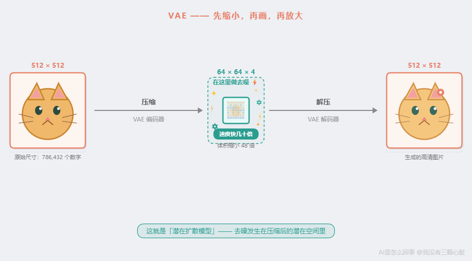

# 为什么 AI 画不好手指？
原理说完了，来看一个有趣的”翻车现场”。

你大概见过 AI 生成的图片中手指画得很诡异——六根手指、两根大拇指、手指从奇怪的角度弯折。一个能画出完美人脸的 AI，为什么画不好手？

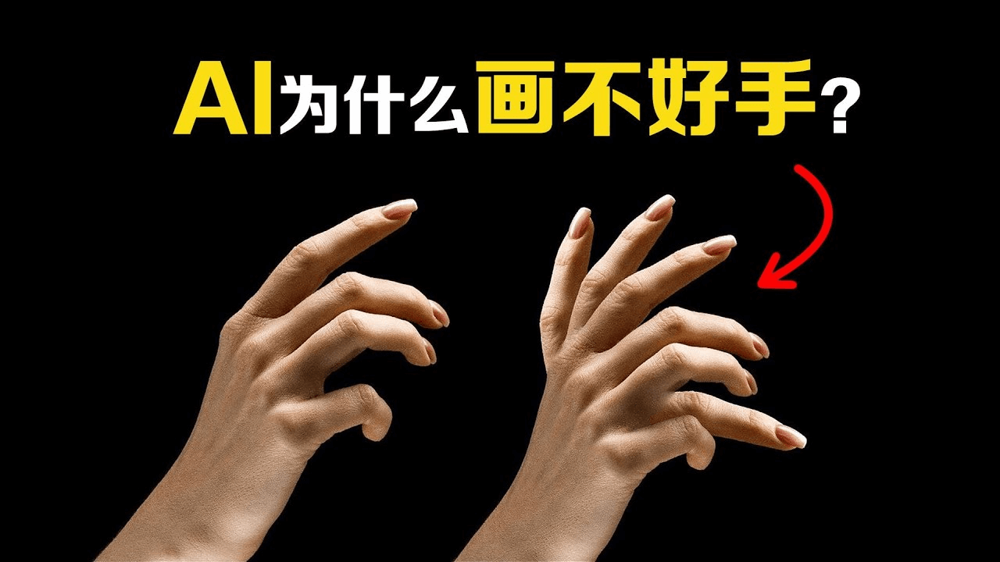

原因有三个，**全部和”模式匹配”有关**。

**第一，训练数据中手指的模式太不稳定。**

人脸在照片中几乎总是正面或侧面，五官相对位置非常固定。AI 很容易学到这个稳定的统计模式。但手可以握拳、摊开、交叉、比剪刀、拿东西、插口袋。五根手指的相对位置在不同照片中差异极大，而且手在大多数照片中是配角——占画面比例小，经常被遮挡。

**第二，AI 不知道”手应该有五根手指”。**

UCL 计算机科学教授 Peter Bentley [在 BBC Science Focus 中指出](https://www.sciencefocus.com/future-technology/why-ai-generated-hands-are-the-stuff-of-nightmares-explained-by-a-scientist)——扩散模型是二维图像生成器，完全没有三维结构的概念。它不知道手是有骨骼、关节、五根手指的三维物体。回忆第 1 篇：AI 看到的不是”手”这个物体，是一堆数字。它不具备”手有五根手指”这个常识——因为常识是对世界的因果理解，而 AI 只做统计模式匹配。

**第三，人类对手的容错率极低。**

人脸有弹性——鼻子稍大一点、眼间距稍宽一点，看起来仍然”正常”。但手指多一根或少一根，立刻被察觉。

值得一提的是，2023 年以来手指问题已经大幅改善——通过更多手部特写训练数据和更精细的模型调优。但这恰恰**印证了**核心逻辑：改善不是因为 AI “学会了”手有五根手指，而是因为训练数据中手指的统计模式变得更稳定充分了。

**AI 画得好不好，取决于训练数据中的统计模式是否稳定充分。** 和第 9 篇的结论一模一样。

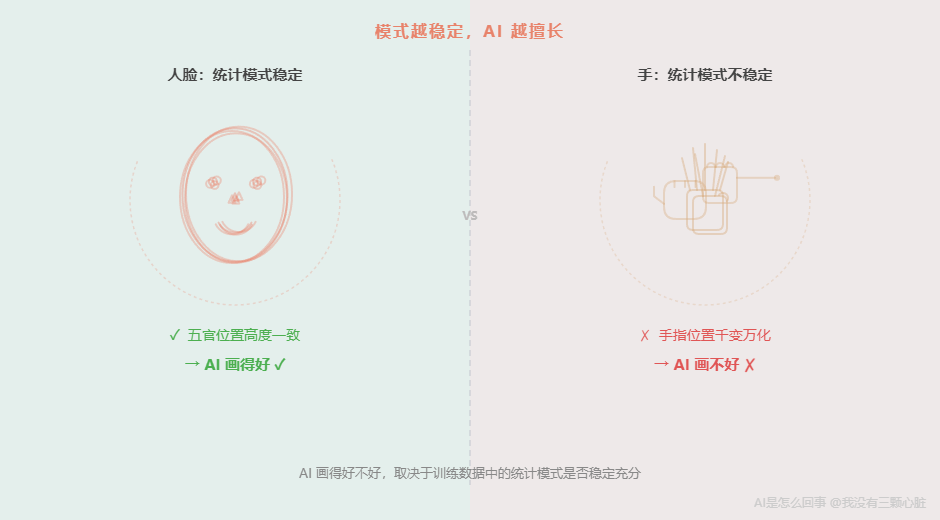

# 核心洞察——“创造”也是模式匹配
现在回到开头的问题：

> 一个只会匹配模式的机器，怎么可能”创作”？

答案：**AI 绘画不是”创造”，是”从噪声中还原统计模式”。**

让我把 ChatGPT 和 AI 绘画放在一起：

- **ChatGPT 续写文字** = 根据上下文，预测”统计上最可能的下一个词”

- **扩散模型生成图片** = 根据文字向量，预测”统计上最可能的噪声”，然后去掉它

两者做的是同一件事：**在训练数据中学到统计模式，然后用这些模式生成新的输出。**

ChatGPT 学了几万亿个词的语言模式——“合同””胁迫”后面大概率跟”可撤销”。扩散模型学了几百万张图片的视觉模式——“眼睛”通常在”脸”上半部分，”天空”通常在”地面”上方。

生成时，ChatGPT 用语言模式组合出新句子。扩散模型用视觉模式从噪声中”雕刻”出新图片。

**都不是”创造”。都是统计模式的新组合。**

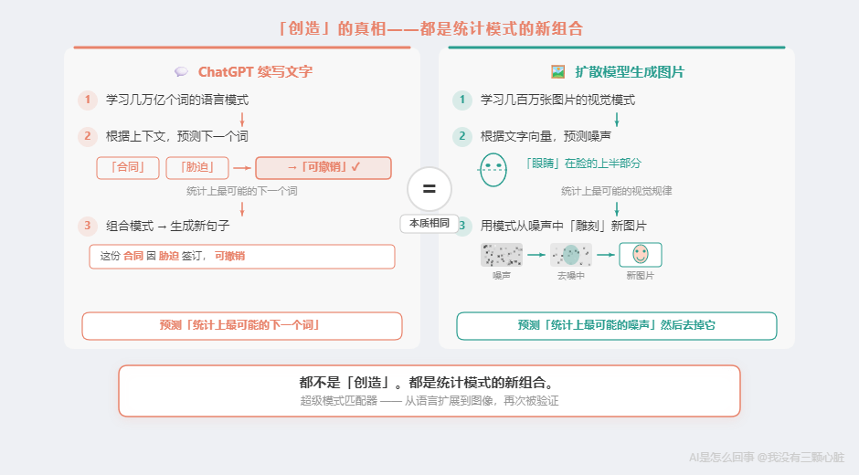

这意味着第一章建立的核心模型——**AI 是超级模式匹配器**——经受住了第二次考验。它不仅能解释 AI 为什么能通过考试却算错小数（第 9 篇），也能解释 AI 为什么能”画画”却画不好手指。

# 个人锚点
说实话，AI 绘画是让我最纠结的话题。

我第一次用 Midjourney 的时候，输入了”暴风雨中一座孤独的灯塔，油画风格，浪漫主义”。几秒钟后，一张我从未见过的画出现了——构图、光影、氛围，都好得让我有点发愣。

那一刻，我真的觉得这是”创造”。

后来我把扩散模型的论文看了一遍又一遍。当我真正理解了”前向加噪、反向去噪”的全过程后，感受发生了一个微妙的变化。

那张灯塔的画，不是 AI “想象”出来的。它是几百万张油画训练数据中的统计模式——“暴风雨”的云层通常什么样、”灯塔”的轮廓通常什么形状、”浪漫主义”的色调通常偏什么颜色——被文字向量引导着，从纯噪声中被”找”了出来。

这让我想起一句据说是米开朗基罗说的话：**「我没有在大理石中看到天使，我只是把多余的石头去掉了。」** 扩散模型做的事还真有点像——它没有”创造”一张画，只是把噪声中”多余的部分”去掉了。

区别在于：米开朗基罗真的看到了天使。而 AI 从来没有看到过任何东西——它只是在做统计上最合理的减法。

理解这一点之后，我不再觉得 AI 绘画”神奇”了。但也没觉得它”没意思”了——恰恰相反，知道原理之后，每次看到一张好图，我想的不再是”AI 好厉害”，而是”几百万张训练数据中的统计规律竟然能组合出这样的东西”——这本身就足够令人惊叹。

# 一句话回顾

> **AI 绘画不是”创造”，是”从噪声中还原统计模式”——和 ChatGPT 续写文字的本质完全一样。”超级模式匹配器”这个模型，从语言扩展到了图像，再次被验证。**

# 下一篇预告
两篇下来，”超级模式匹配器”这个模型看起来无所不能——语言靠它，画画也靠它。

但如果什么都是模式匹配，为什么 AI 在不同领域的表现差距如此巨大？

AI 下围棋赢了世界冠军。但自动驾驶连一辆倒在路边的自行车都认不出来。

同样是模式匹配——一个用来下棋，一个用来开车。都是从大量数据中学习模式。但为什么一个超越了全人类，另一个连新手司机都不如？

下一篇，我们把所有 AI 的强项和弱项摆在一张桌上。你会发现，一条清晰的分界线从数据中浮现出来——而且这条线会给你一套可以随身携带的判断工具。

# 参考资料

- Ho, J., Jain, A., & Abbeel, P. (2020). Denoising Diffusion Probabilistic Models. *NeurIPS 2020*. [https://arxiv.org/abs/2006.11239](https://arxiv.org/abs/2006.11239)

- Rombach, R., et al. (2022). High-Resolution Image Synthesis with Latent Diffusion Models. *CVPR 2022*. [https://arxiv.org/abs/2112.10752](https://arxiv.org/abs/2112.10752)

- Radford, A., et al. (2021). Learning Transferable Visual Models From Natural Language Supervision (CLIP). *OpenAI*. [https://openai.com/index/clip/](https://openai.com/index/clip/)

- Bentley, P. Why AI hands are nightmares. *BBC Science Focus*. [https://www.sciencefocus.com/future-technology/why-ai-generated-hands-are-the-stuff-of-nightmares-explained-by-a-scientist](https://www.sciencefocus.com/future-technology/why-ai-generated-hands-are-the-stuff-of-nightmares-explained-by-a-scientist)

- HuggingFace. (2022). Stable Diffusion with Diffusers. [https://huggingface.co/blog/stable_diffusion](https://huggingface.co/blog/stable_diffusion)

# 订阅
如果觉得有意思，欢迎关注我，后续文章也会持续更新。同步更新在[个人博客](https://www.wmyskxz.cn/)和[微信公众号](https://weixin.sogou.com/weixin?type=1&s_from=input&query=wmyskxz&ie=utf8&_sug_=n&_sug_type_=&w=01019900&sut=1861&sst0=1612590375262&lkt=8,1612590373961,1612590375161)

微信搜索”我没有三颗心脏”或者扫描二维码，即可订阅。


---

*笔记整理日期：2026-05-18*
