# AI是怎么回事：为什么 AI 能赢世界冠军，却开不好车？——一条藏在所有 AI 背后的分界线

> 课程来源：https://wmyskxz.cn/wiki/whats_ai/11/

---

> 这是 **「AI是怎么回事」** 系列的第 11 篇。我一直很好奇 AI 到底是怎么工作的，于是花了很长时间去拆这个东西——手机为什么换了发型还能认出你，ChatGPT 回答你的那三秒钟里究竟在算什么，AI 为什么能通过律师考试却会一本正经地撒谎。这个系列就是我的探索笔记，发现了很多有意思的东西，想分享给你。觉得不错的话，欢迎分享+关注。
> 第一次看到这个系列？从[第1篇](https://wmyskxz.cn/wiki/whats_ai/1/)开始最顺畅，直接读这篇也没问题。

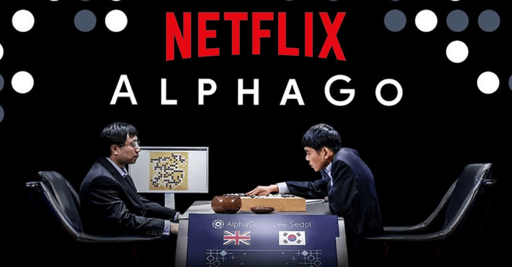

上一篇结尾，我留了一个矛盾：

> AI 下围棋赢了世界冠军。但自动驾驶连一辆倒在路边的自行车都认不出来。同样是模式匹配——为什么差距这么大？

类似的矛盾其实无处不在。如果你跟着这个系列从第 1 篇读到这里，你一定见过很多这样的场景：

- AI 下棋赢世界冠军但开车不如新手司机

- AI 通过律师考试（前 10%），但分不清”谢谢你”是真心还是讽刺

- AI 画画能获奖，但画不好五根手指

- AI 在 X 光片里找到医生遗漏的肿瘤，但不知道这个阴影是不是上次手术留下的

- AI 预测蛋白质形状拿了诺贝尔奖，但解释不了蛋白质为什么折叠成那样

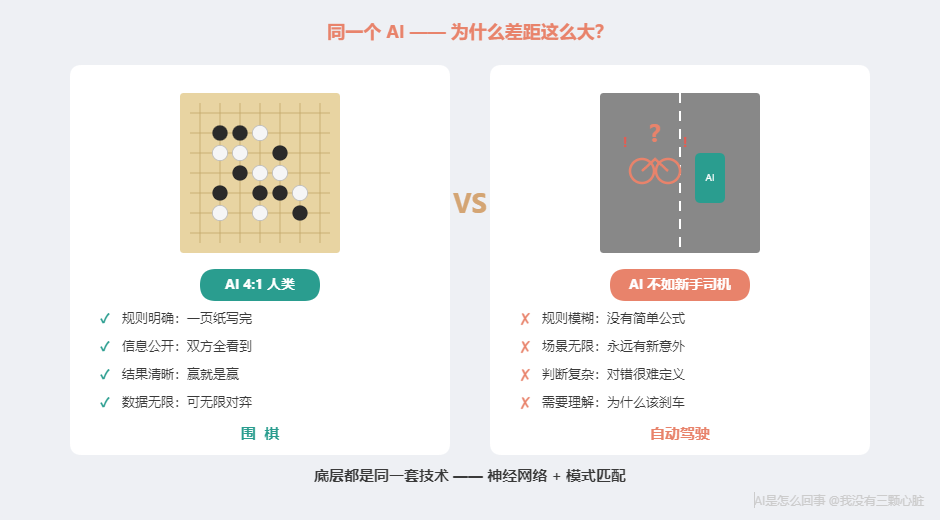

如果你只看新闻标题，AI 的表现像是随机的——这个行、那个不行，毫无规律。

但真的没有规律吗？

有。而且非常简单。

今天这篇，我们做三件事：

- **看几个新案例**——把还没聊过的重要领域补上

- **画一张全景图**——把 AI 在各领域的表现摆在一起，找出规律

- **给你一套「三问判断法」**——以后看到任何 AI 新闻，三个问题就够了

# 先看几个新案例
在画全景图之前，需要补上几个重要案例。它们分别代表了 AI 最强和最具突破性的领域——而且都能用第一章学过的知识解释。

## AlphaGo：赢了世界冠军的 AI

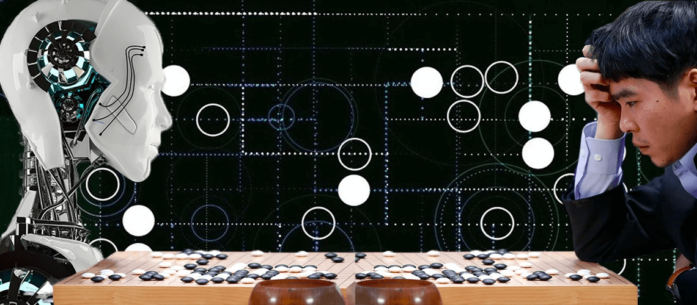

2016 年 3 月，**AlphaGo** 在韩国首尔和围棋世界冠军李世石（Lee Sedol）进行了[五局对弈](https://en.wikipedia.org/wiki/AlphaGo_versus_Lee_Sedol)。

围棋是公认最复杂的棋类——19x19 棋盘，可能的棋盘局面数约为 [10 的 170 次方](https://en.wikipedia.org/wiki/AlphaGo)，比宇宙中的原子数量还多。国际象棋 AI 可以靠穷举搜索赢棋，围棋不行——可能性太多了。

几十年来，围棋被认为是 AI 不可能攻克的最后堡垒。

然后 AlphaGo 以 4:1 赢了。

2017 年 5 月，升级版 AlphaGo 在中国乌镇挑战世界第一柯洁，[**3:0 完胜**](https://en.wikipedia.org/wiki/Future_of_Go_Summit)。柯洁赛后说了一句让我印象很深的话：

> “去年 AlphaGo 下得像人，现在它下得像神。”

**AlphaGo 用的核心零件，和我们学过的完全一样。**

**神经网络**（第 4 篇）：两个网络——“策略网络”预测下一步走哪，”价值网络”评估当前局面谁赢。**训练**（第 5 篇）：先用人类棋谱训练，再让 AI 和自己下棋，几百万盘自我对弈后发现了人类没想过的走法。**模式匹配**：整个决策过程就是在棋盘状态中匹配已知模式，没有”灵感”或”直觉”。

但关键问题是：**围棋为什么特别适合 AI？**

仔细看围棋的特点：

- **规则完全确定**：19x19 棋盘，黑白两色，轮流落子，一页纸写完

- **信息完全公开**：双方都能看到所有棋子，没有隐藏信息

- **结果明确**：赢就是赢，输就是输

- **数据无限**：几千年棋谱 + AI 可以无限自我对弈

**围棋是一个完美的模式匹配战场。** 规则明确、数据无限、不需要理解”为什么”，只需要知道”什么局面下走哪步赢的概率最高”。

记住这个特点。

## AlphaFold：预测蛋白质形状拿了诺贝尔奖

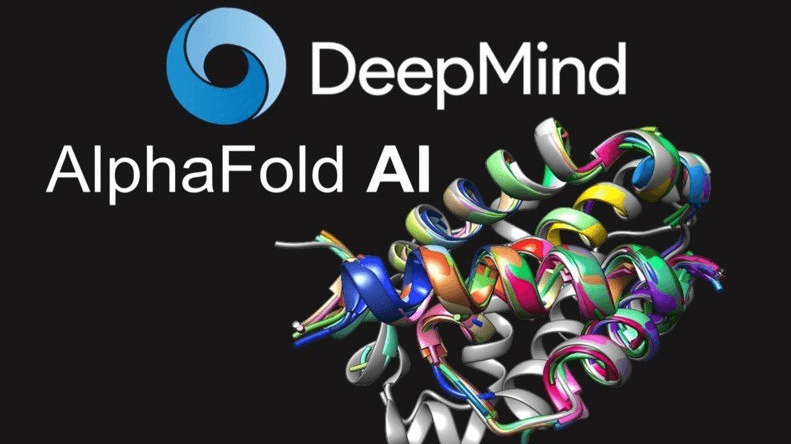

如果说 AlphaGo 证明了 AI 在”规则明确的游戏”里有多强，**AlphaFold** 证明了 AI 在科学研究中也能带来革命。

蛋白质是生命的基本”零件”。每种蛋白质是一串”氨基酸”链条，这条链条会自动折叠成特定的三维形状——**蛋白质的功能完全取决于它折叠成什么形状**。折叠错了，可能导致阿尔茨海默症、帕金森症等疾病。

从 1960 年代起，科学家就想搞清楚：给定氨基酸序列，它折叠成什么形状？这被称为生物学的**「圣杯」之一**。传统方法确定一个蛋白质结构，往往需要几个月甚至几年。

2020 年 11 月，DeepMind 的 AlphaFold2 参加了蛋白质结构预测领域的”奥运会”——[**CASP14 竞赛**](https://www.nature.com/articles/s41586-021-03819-2)。衡量精度的 GDT 指标满分 100，此前几十年最好的方法只能到 60-70 分。AlphaFold2 的**中位数得分 92.4 分**——一下跨越了 20 多分的鸿沟。

还记得第 3 篇讲 AlexNet 在 ImageNet 上的突破吗——错误率从 26% 降到 15%，所有人以为作弊了。AlphaFold 在 CASP14 上带来的震撼是同一级别的。

2024 年，DeepMind 的 Demis Hassabis 和 John Jumper 因此[获得诺贝尔化学奖](https://www.nobelprize.org/prizes/chemistry/2024/press-release/)。

核心原理还是那些——深度神经网络（第 4 篇）加注意力机制（第 6 篇）。本质上和人脸识别一样：**模式匹配**。只不过人脸识别在像素中匹配”这是谁的脸”，AlphaFold 在氨基酸序列中匹配”这串序列折叠成什么形状”。

但 AlphaFold 也有明确的局限：它预测**静态结构**，而蛋白质会运动；对没有固定形状的蛋白质预测不准；最关键的——**它预测”形状”，不理解”为什么”。**

**模式匹配不等于因果理解。**

## 自动驾驶：模式匹配遇到的”长尾问题”

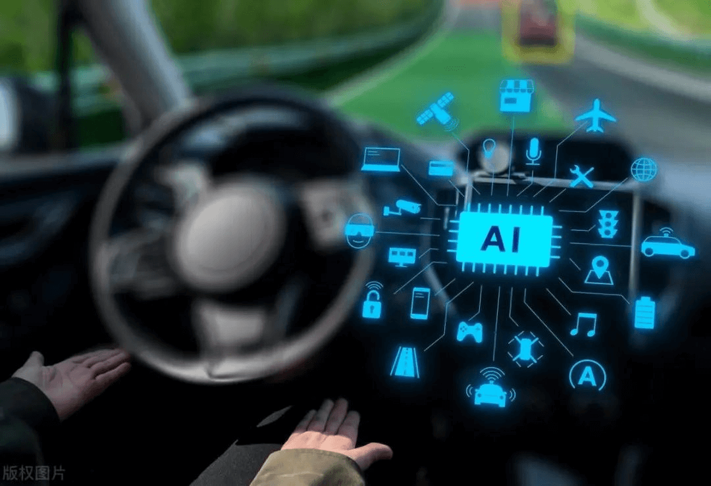

看完了 AI 大获全胜的案例，现在看一个 AI 表现不那么理想的领域。

公平地说，自动驾驶在**绝大多数**路况下表现得很好。Tesla 2025 年第一季度安全报告显示，使用 Autopilot 时平均[约 744 万英里才发生一次碰撞](https://www.tesla.com/VehicleSafetyReport)——相当于绕地球 300 圈。Waymo 2024 年的[同行评审研究](https://waymo.com/research/comparison-of-waymo-rider-only-crash-data-to-human/)显示，714 万英里自动驾驶中，造成伤害的碰撞减少了 **「85%」**。

但有一个根本性的难题：**长尾问题。**

想象一张统计图：横轴是各种驾驶场景，纵轴是出现频率。

- **头部**（最左边）：晴天、直行、正常车流——占 95% 的驾驶时间

- **尾部**（向右拖得很长）：施工区、倒在路边的自行车、突然冲出的动物、逆光致盲——每种出现频率很低，但种类极多

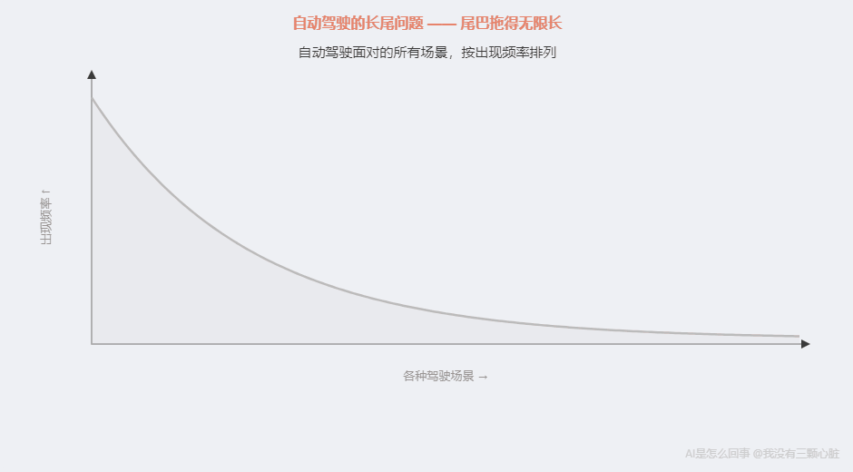

这个”尾巴”拖得极长——你永远列举不完所有可能的异常场景。

头部那 95% 的常见场景，训练数据中有海量例子，AI 处理得得心应手。但尾部罕见场景，训练数据中可能只出现几次，甚至一次也没有。

2016 年，一辆 Tesla Model S 就因此发生了[致命事故](https://en.wikipedia.org/wiki/List_of_Tesla_Autopilot_crashes)——一辆白色卡车横在高速路中间，AI 把卡车白色车身识别成了天空的一部分，径直撞了上去。

你可能想：多收集罕见场景的数据不就行了？

没那么简单。长尾的本质是——**尾部是无限长的**。你收集了”翻倒的卡车”，但”着火的翻倒的卡车”又是新场景。你收集了”行人横穿”，但”穿白婚纱、举反光伞、在逆光中横穿的行人”又是新的。

人类司机遇到没见过的情况时会**理解**——“前面有个大物体挡路，不管是什么，我该减速。”这是因果推理：物体挡路 → 继续走会撞上 → 应该刹车。

AI 做不到。它做模式匹配——在训练数据中找最接近的已知模式，按那个模式行动。当眼前场景和所有已知模式都不匹配时，AI 就”蒙了”。

**自动驾驶的”最后 1%”，需要的恰恰是 AI 目前不具备的能力——在从未见过的情况下，基于对物理世界因果关系的理解做出判断。**

## 医疗影像：AI 的最佳战场之一

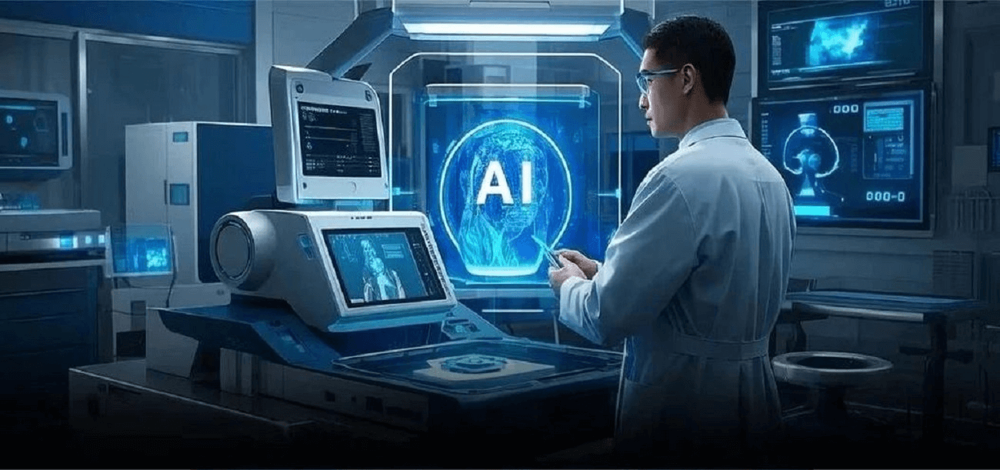

再看一个 AI 大放异彩的领域。

回忆自动驾驶的三个难题：场景不标准、罕见情况多、需要因果理解。医疗影像恰好走向了反面：

**高度标准化**——同一台 CT 机拍出的图片格式和质量高度一致。**判断标准明确**——“这是肿瘤还是正常组织”是有明确答案的二分类问题。**不需要因果理解**——AI 不需要理解”为什么长肿瘤”，只需要识别”这片像素符不符合肿瘤的特征”。

2024 年发表在《npj Digital Medicine》上的[系统综述](https://www.nature.com/articles/s41746-024-01103-x)显示：AI 检测皮肤癌的平均敏感度为 87.0%，而临床医生平均 79.8%。**AI 在总体上已经超过了临床医生的平均水平。**

但”看见异常”不等于”诊断疾病”。AI 在 X 光片中找到可疑阴影，它做的是：这片像素和训练数据中标注为”肿瘤”的模式很相似。它不知道是良性还是恶性，不知道患者的病史，不知道这个阴影是不是上次手术的痕迹。

医疗影像的局限也很熟悉：[罕见病数据太少](https://pmc.ncbi.nlm.nih.gov/articles/PMC8764708/)、[训练数据中的人群偏差](https://pmc.ncbi.nlm.nih.gov/articles/PMC11880872/)（大部分数据来自浅肤色人群）、[不同设备之间的差异](https://www.nature.com/articles/s41591-024-03113-4)。

归根到底是同一个原因：**数据充足且标准化时 AI 强，数据稀缺或分布偏差时 AI 弱。**

# 一张 AI 能力全景图
现在我们有了足够的案例。让我把这个系列到目前为止提到的所有 AI 领域摆在一起：

| 领域 | 代表系统 | 当前水平 | 关键数据 | 关键瓶颈 |
| --- | --- | --- | --- | --- |
| 棋类游戏 | AlphaGo | 远超人类 | 4:1 胜李世石，3:0 胜柯洁 | 仅限规则确定的封闭系统 |
| 图像识别 | ResNet | 超越人类 | 错误率 ~3.6%，人类 ~5%（第 3 篇） | 对抗样本（第 7 篇）、场景理解 |
| 蛋白质结构 | AlphaFold | 突破性 | CASP14 GDT 92.4，诺贝尔化学奖 | 预测形状但不理解机制 |
| 医疗影像 | 多个 | 特定任务超越人类 | 皮肤癌敏感度 87% vs 医生 80% | 罕见病、人群偏差、设备差异 |
| 语音识别 | Whisper | 接近人类 | 68 万小时训练 | 嘈杂环境、幻觉、小众语言 |
| 语言对话 | ChatGPT | 接近人类 | 律师考试前 10%（第 9 篇） | 幻觉（第 7 篇）、事实核查 |
| AI 绘画 | Midjourney / SD | 看情况 | 获艺术比赛一等奖（第 10 篇） | 手指等细节、真正的创意 |
| 自动驾驶 | Tesla FSD / Waymo | 常见优秀，长尾不足 | 常见场景优秀，长尾致命 | 长尾场景、因果理解 |

你可能会问：第 9 篇提到了 2025-2026 年的推理模型——GPT-5.2 数学竞赛满分、o3 在编程上表现惊人——这些新进展改变了全景图吗？

**改变了数字，没有改变规律。**

推理模型（o1、o3、o4-mini）让数学竞赛和编程任务的分数飙升。但第 9 篇也告诉我们：Apple 研究发现仅仅改变题目中的数字，表现就大幅波动；问题复杂度一高，所有推理模型崩溃至 0%。而在事实问答上，推理模型的幻觉率（33%-48%）反而比前代模型更高。

**换句话说：推理模型把全景图中”语言对话”和”棋类游戏”之间的空间填得更满了——但全景图的两端没有改变。** 围棋仍然是 AI 的天堂，需要因果理解的任务仍然是短板。

把推理模型放进全景图，它恰好落在预期的位置上——规则明确的数学竞赛表现最好，规则模糊的现实推理仍然挣扎。谱系没有被打破，反而被进一步验证了。

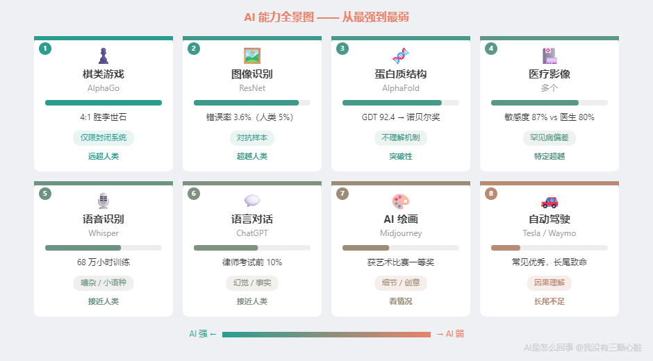

数字很多，但数字不是重点。

**重点是：你有没有看出什么规律？**

按 AI 能力从强到弱排：

- **最强：** 围棋、图像分类、蛋白质结构预测

- **很强：** 医疗影像、语音识别、语言对话

- **看情况：** AI 绘画

- **还不够：** 自动驾驶（长尾场景）

最强的那几个有什么共同点？最弱的又有什么共同点？

# 规律浮现——一条分界线
让我把每个领域的”特征”列出来。

**围棋：** 规则完全确定，信息公开，结果明确，数据无限。不需要理解”为什么这步好”，只需要知道”什么局面走哪步赢的概率高”。

**图像分类：** 任务明确——“这张图是什么”。1400 万张标注图片。标准清晰。

**蛋白质预测：** 输入输出明确——给氨基酸序列，输出三维坐标。17 万个已知结构。可实验验证。

**自动驾驶：** 规则模糊——“安全驾驶”没有简单定义。路况千变万化。罕见场景太少。最关键的：安全驾驶需要因果推理——“那个人举起手，是要招出租车还是要横穿马路？”

看出来了吗？**三个因素在决定一切：**

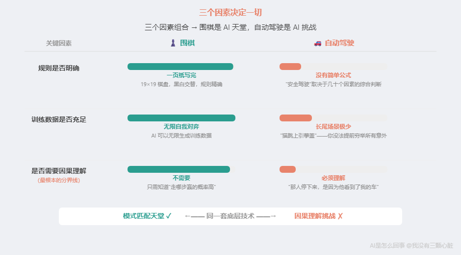

**第一，规则是否明确。** 围棋一页纸写完，每步合法性精确判定。但”安全驾驶”取决于几十个因素的综合判断，没有公式。规则越明确，越容易转化为模式匹配。

**第二，训练数据是否充足。** AlphaGo 可以无限自我对弈，永远不缺数据。自动驾驶面对的是”猫突然从灌木丛跳上引擎盖”——你没法让 AI 提前见过所有意外。

**第三，是否需要因果理解。** 这是最根本的分界线。图像分类只需要知道”这个模式对应什么”（相关性）。自动驾驶需要理解”那个行人停下来，是因为他看到了我的车”——这是因果推理。

三个因素组合，形成一条**谱系**：

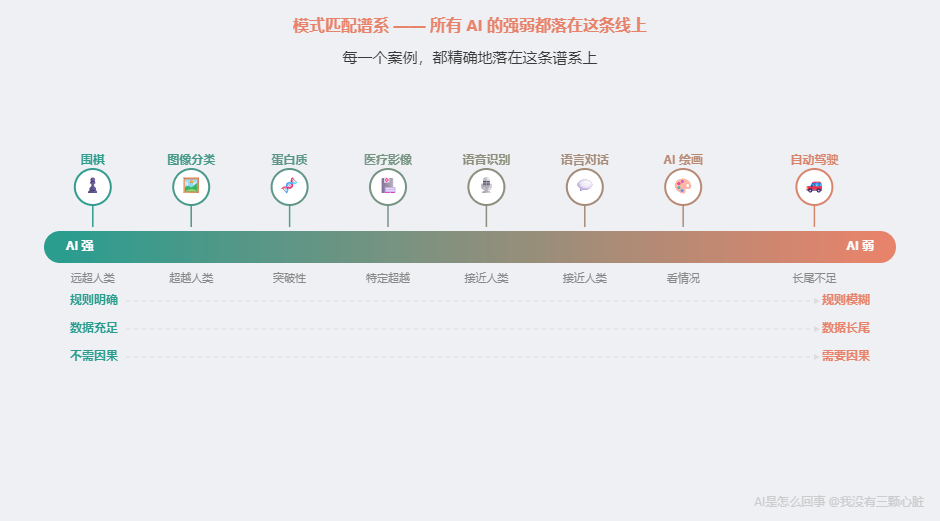

用这条谱系验证前面所有案例：

- **第 7 篇：ChatGPT 编造假判例。** 生成法律格式 = 模式匹配（强）。核实是否存在 = 事实核查（做不到）。谱系预测准确。

- **第 7 篇：对抗样本骗过图像识别。** 图像分类靠像素模式而非概念理解，微小像素变化就骗过它。谱系预测准确。

- **第 10 篇：AI 画不好手指。** 生成风景 = 数据充足（强）。精确控制手指 = 需要”五根手指”的因果理解（做不到）。谱系预测准确。

- **AlphaGo 赢棋。** 规则明确 + 数据无限 + 不需因果 = 模式匹配天堂。谱系预测：远超人类。准确。

- **AlphaFold 预测蛋白质。** 输入输出明确 + 17 万训练样本 + 不需理解物理机制。谱系预测：突破性但不能解释”为什么”。准确。

- **第 9 篇：推理模型数学竞赛满分，但换个数字就错。** 竞赛题 = 模式明确 + 数据充足（强）。但换了数字 = 没见过的”新模式”（弱）。谱系预测准确。

**每一个案例都精确地落在谱系上。** 不是巧合——因为所有系统底层用的都是同一套东西：神经网络（第 4 篇），靠数据学习（第 5 篇），本质是模式匹配（第 8 篇）。

一句话概括这条分界线：

> **AI 的本质是模式匹配。任务越像”纯模式匹配”，AI 越强；越需要因果理解，AI 越弱。**

# 一套随身携带的判断工具：三问判断法
理解了谱系，你可能想：道理懂了，但日常怎么用？每次看新闻难道画谱系图？

不用。我把谱系背后的逻辑压缩成**三个问题**。面对任何 AI 应用，你只需要问自己：

（你可能注意到了，谱系的第三维度是”是否需要因果理解”。但对普通人来说，这个维度不太容易直接判断。所以第三个问题我把它转化成了更实用的形式——你马上会看到。）

## 第一问：这个任务能转化为模式匹配吗？
**能 → AI 可能擅长。不能 → 谨慎使用。**

翻译是模式匹配——给定中文，输出英文。图像分类是模式匹配——给定像素，输出类别。语音识别是模式匹配——给定声波，输出文字。

但”判断这封邮件的语气是否恰当”不太是——“恰当”取决于你和收件人的关系、公司文化、事情的来龙去脉。”我该不该接这个 offer”更不是——这需要对你人生价值观的权衡。

**对应第 8 篇核心结论：AI 是超级模式匹配器。**

## 第二问：训练数据够不够？
**够 → AI 可能很好。不够 → AI 容易出错。**

让 ChatGPT 翻译科技新闻——互联网上有海量科技翻译，数据充足，没问题。让它翻译偏门行业的合同——这类文本稀少得多，容易出错。

让自动驾驶在加州阳光高速上行驶——几百万英里的数据，没问题。让它在暴风雪中过没有标线的乡间路口——数据极少，小心。

**规律很简单：场景越常见，AI 越可靠。场景越罕见，AI 越不可靠。**

**对应第 5 篇核心逻辑：训练数据越多，模式越准确。**

## 第三问：你能验证 AI 的输出吗？
**能验证 → 放心用。不能验证 → 小心用。**

这一问不是评估 AI 的能力，而是评估**你的风险**。

让 AI 写代码——可以运行测试看结果对不对。风险可控。让 AI 做法律研究——需要逐一核实判例，成本高但可验证。但让 AI 写医疗报告，你自己不是医生——你根本判断不了对不对。

**AI 出错是一定会发生的——第 7 篇讲的幻觉。关键不是”会不会出错”，而是”出错时你能不能发现”。**

**对应第 7 篇核心警示：AI 会产生幻觉，它自己不知道。**

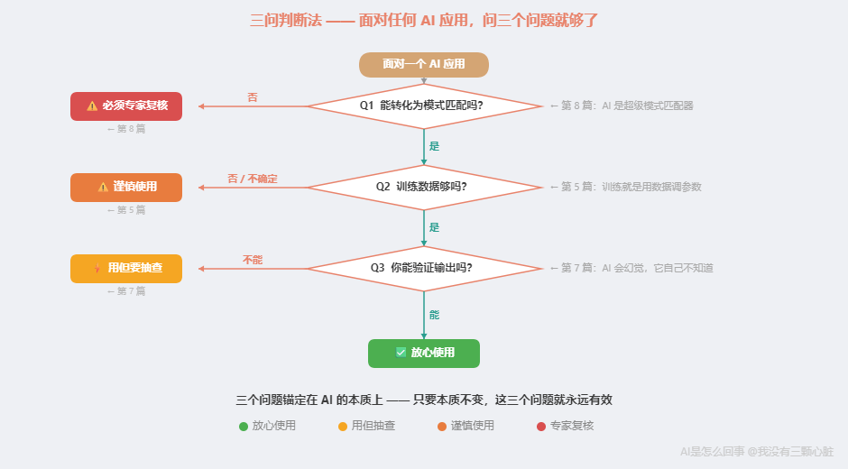

# 两个实战演练
让我用两个具体场景演示。

**场景一：”AI 能帮我翻译合同吗？”**

- 能转化为模式匹配吗？翻译是经典模式匹配。能。

- 训练数据够吗？普通合同模板大量存在。够。但非常专业的领域就不一定了。

- 能验证吗？如果你懂两种语言，可以。不懂的话，至少可以请人审核关键条款。

**结论：可以用 AI 翻译初稿，但关键条款必须人工审核。**

**场景二：”AI 能帮我做投资决策吗？”**

- 能转化为模式匹配吗？短期波动有统计模式，但长期投资涉及宏观经济、公司治理、突发事件——不是简单的模式匹配。部分能，大部分不能。

- 训练数据够吗？历史数据很多，但”未来”的数据永远不够——市场的本质就是不可完全预测。

- 能验证吗？投资结果要很久才知道，而且赚了也不能证明决策正确（可能只是运气好）。

**结论：AI 可以辅助分析历史数据，但不应该让 AI 做最终投资决策。**

**场景三：”AI 推理模型数学竞赛满分，是不是说明 AI 真的学会推理了？”**

- 能转化为模式匹配吗？数学竞赛题有固定题型、标准解法——大量存在模式可匹配。能。但”推理”如果是指”从未见过的情况下灵活运用原则”——不是简单的模式匹配。

- 训练数据够吗？数学竞赛的训练材料在互联网上大量存在。够。但 Apple 的 GSM-Symbolic 研究表明（第 9 篇），仅改变数字就错——这暗示 AI 可能在匹配”题型模式”而非真正推理。

- 能验证吗？数学题有标准答案。能。

**结论：数学竞赛满分是”高度结构化的模式匹配”的胜利——规则明确、答案唯一、训练数据充足。但不等于 AI 学会了”推理”这个更广义的能力。谱系上，它仍然落在”模式匹配强区”一端。**

# 为什么这三个问题不会过时？
你可能注意到了——这三个问题不是凭空编的。它们直接对应第一章建立的三个核心认知：

- **第一问（能否模式匹配）** ←→ 第 8 篇：AI 是超级模式匹配器

- **第二问（数据充足吗）** ←→ 第 5 篇：训练就是用数据调参数

- **第三问（能否验证）** ←→ 第 7 篇：AI 会幻觉，它自己不知道

三个问题之所以有效，是因为它们锚定在 AI 的**本质**上，而不是**当前表现**上。不管从 GPT-4 到 GPT-5，从 Midjourney 到下一代——底层仍然是神经网络、仍然靠训练数据、仍然是模式匹配。

**只要本质不变，这三个问题就永远有效。**

# 个人锚点
有了这个框架之后，我看 AI 新闻的方式彻底变了。

以前看到”震惊！AI 现在能写诗了！”我会认真点进去——AI 真的越来越厉害了。

现在自动跑一遍三问：

写诗能转化为模式匹配吗？——能。训练数据中有海量诗歌，AI 能学到”诗的文字模式”。所以能写出”像诗的文字”，不意外。

但写的诗真的”好”吗？——如果”好”是指”格式工整、意象优美、读起来像诗”，AI 已经很好了——这些都是可以从数据中学到的模式。如果”好”是指”表达了一种只有经历过才能体会的情感”，AI 做不到——它没有”经历”，只有”统计”。

你能验证吗？——诗不像代码可以运行测试。”好不好”是主观判断。

三问跑完，结论清楚：AI 写诗是模式匹配的又一次胜利，但不等于 AI 懂了什么是诗。

**90% 的”震惊！AI 已经能……”新闻，用三个问题一过滤，就没那么震惊了。**

不是说 AI 不厉害——它确实在很多领域做到了惊人的事情。而是当你理解了它的本质，你就能**准确地**评估它有多厉害。你不会在”无所不能”和”什么都不行”之间摇摆——你有了自己的判断力。

这个变化让我想起第 1 篇学到的东西——AI 眼中的图片只是一堆数字，它做的就是加减乘除。那时候我”知道”了。但直到我能用三个问题解构任何一条 AI 新闻，我才真正”理解”了。

# 标题的答案
回到文章标题：为什么 AI 能赢世界冠军，却开不好车？

因为围棋是规则明确、信息公开、数据无限的模式匹配天堂。而开车——一只猫突然跳上引擎盖，一辆白色卡车横在路中间，一个小孩从两辆停着的车之间跑出来——每种场景在训练数据中几乎没有，没有”标准答案”，需要一瞬间理解物理世界的因果关系。

**同一种底层技术，面对”纯模式匹配”任务超越人类，面对”需要因果理解”任务不如人类。**

这不是 AI 的”缺陷”——这就是它的本质。

# 一句话回顾

> **AI 的强弱不是随机的——规则越明确、数据越充足、越不需要因果理解的任务，AI 就越强。反过来，就是 AI 的弱项。记住三个问题：能不能转化为模式匹配？训练数据够不够？你能不能验证输出？**

# 下一篇预告
现在你手里有了一套判断工具——知道 AI 什么时候行、什么时候不行。

但你可能有一个担心：AI 进步这么快，这个框架会不会很快过时？

毕竟两年前 AI 还画不好手指，现在好多了。两年前 ChatGPT 还不能稳定做数学，现在也进步了不少。如果 AI 一直在进步，我们今天画的这条”分界线”，明年还准吗？

下一篇，我们来聊 AI 的天花板——哪些进步是”沿着现有道路走更远”，哪些是”需要换一条全新的路”。你会发现，理解了这个区别之后，框架不但不会过时，反而会帮你更好地判断每一次”突破性进展”到底意味着什么。

# 参考资料

- AlphaGo versus Lee Sedol. *Wikipedia*. [https://en.wikipedia.org/wiki/AlphaGo_versus_Lee_Sedol](https://en.wikipedia.org/wiki/AlphaGo_versus_Lee_Sedol)

- Future of Go Summit. *Wikipedia*. [https://en.wikipedia.org/wiki/Future_of_Go_Summit](https://en.wikipedia.org/wiki/Future_of_Go_Summit)

- AlphaGo. *Wikipedia*. [https://en.wikipedia.org/wiki/AlphaGo](https://en.wikipedia.org/wiki/AlphaGo)

- Jumper, J., et al. (2021). Highly accurate protein structure prediction with AlphaFold. *Nature*. [https://www.nature.com/articles/s41586-021-03819-2](https://www.nature.com/articles/s41586-021-03819-2)

- Nobel Prize in Chemistry 2024. [https://www.nobelprize.org/prizes/chemistry/2024/press-release/](https://www.nobelprize.org/prizes/chemistry/2024/press-release/)

- Tesla. Vehicle Safety Report (Q1 2025). [https://www.tesla.com/VehicleSafetyReport](https://www.tesla.com/VehicleSafetyReport)

- Waymo. Comparison of Waymo Rider-Only Crash Data to Human Benchmarks. [https://waymo.com/research/comparison-of-waymo-rider-only-crash-data-to-human/](https://waymo.com/research/comparison-of-waymo-rider-only-crash-data-to-human/)

- List of Tesla Autopilot crashes. *Wikipedia*. [https://en.wikipedia.org/wiki/List_of_Tesla_Autopilot_crashes](https://en.wikipedia.org/wiki/List_of_Tesla_Autopilot_crashes)

- Salinas, M.P., et al. (2024). A systematic review and meta-analysis of artificial intelligence versus clinicians for skin cancer diagnosis. *npj Digital Medicine*. [https://www.nature.com/articles/s41746-024-01103-x](https://www.nature.com/articles/s41746-024-01103-x)

- Schaefer, J., et al. (2022). AI in Medical Imaging and Rare Diseases. *PMC*. [https://pmc.ncbi.nlm.nih.gov/articles/PMC8764708/](https://pmc.ncbi.nlm.nih.gov/articles/PMC8764708/)

- Xu, Y., et al. (2025). Bias in AI for medical imaging. *PMC*. [https://pmc.ncbi.nlm.nih.gov/articles/PMC11880872/](https://pmc.ncbi.nlm.nih.gov/articles/PMC11880872/)

- Zech, J., et al. (2024). Limits of fair medical imaging AI. *Nature Medicine*. [https://www.nature.com/articles/s41591-024-03113-4](https://www.nature.com/articles/s41591-024-03113-4)

- Radford, A., et al. (2022). Robust Speech Recognition via Large-Scale Weak Supervision (Whisper). [https://arxiv.org/abs/2212.04356](https://arxiv.org/abs/2212.04356)

# 订阅
如果觉得有意思，欢迎关注我，后续文章也会持续更新。同步更新在[个人博客](https://www.wmyskxz.cn/)和[微信公众号](https://weixin.sogou.com/weixin?type=1&s_from=input&query=wmyskxz&ie=utf8&_sug_=n&_sug_type_=&w=01019900&sut=1861&sst0=1612590375262&lkt=8,1612590373961,1612590375161)

微信搜索”我没有三颗心脏”或者扫描二维码，即可订阅。

---

*笔记整理日期：2026-05-18*
