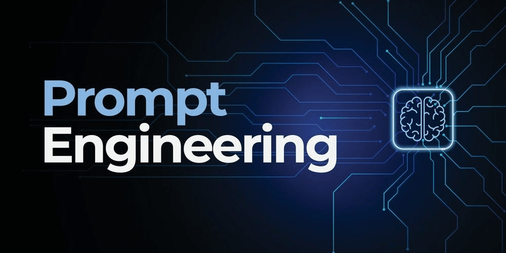
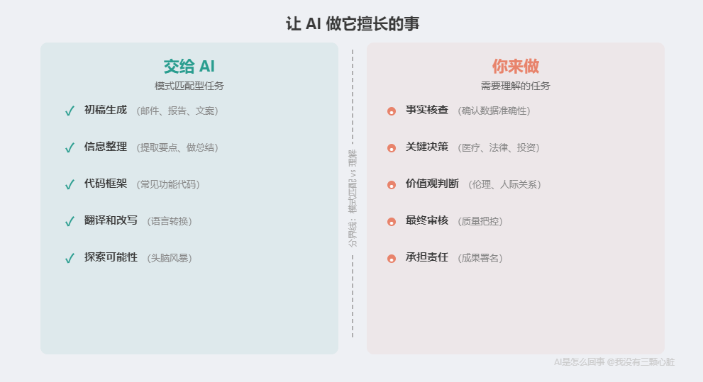
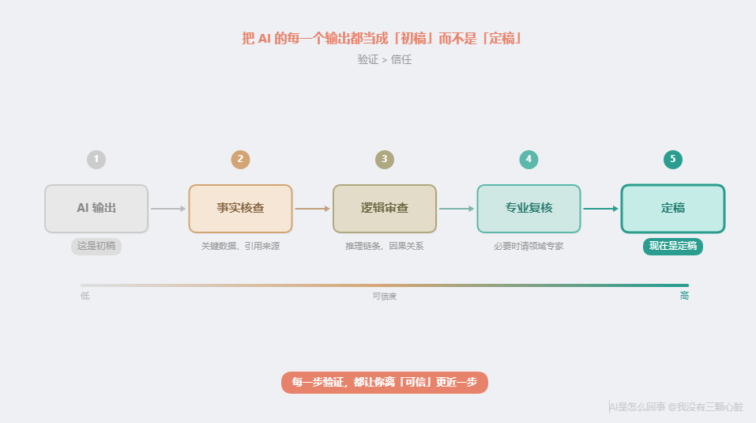

# AI是怎么回事：怎么跟AI协作不翻车——AI说的话你该信几分

> 课程来源：https://wmyskxz.cn/wiki/whats_ai/14/

---

# 怎么跟 AI 协作不翻车？——AI 说的话，你该信几分

> 这是 **「AI是怎么回事」** 系列的第 14 篇。我一直很好奇 AI 到底是怎么工作的，于是花了很长时间去拆这个东西——手机为什么换了发型还能认出你，ChatGPT 回答你的那三秒钟里究竟在算什么，AI 为什么能通过律师考试却会一本正经地撒谎。这个系列就是我的探索笔记，发现了很多有意思的东西，想分享给你。觉得不错的话，欢迎分享+关注。
> 第一次看到这个系列？从[第1篇](https://wmyskxz.cn/wiki/whats_ai/1/)开始最顺畅，直接读这篇也没问题。

上一篇我们搞清楚了一件事：Prompt Engineering 不是玄学，而是给 AI 更精准的上下文，让它的模式匹配更精准。

但掌握了”怎么跟 AI 说话”之后，紧接着一个更重要的问题就来了——**AI 的话，你该信几分？**

我见过两种人：

一种把 AI 当神谕——它说什么就信什么，连引用的论文都不查。结果呢？2023 年，纽约律师 Steven Schwartz 提交了一份法律文书，引用了 6 个判例，[全部是 AI 编造的](https://www.legaldive.com/news/chatgpt-fake-legal-cases-generative-ai-hallucinations/651557/)。他甚至问了 ChatGPT”这些判例是真的吗？”ChatGPT 说”是的”。法官罚了他 5000 美元。到 2025 年，全球已有[超过 100 起类似的法律文书造假事件](https://cronkitenews.azpbs.org/2025/10/28/lawyers-ai-hallucinations-chatgpt/)，涉及 128 名律师。

一种把 AI 当玩具——觉得它不靠谱，从来不用。结果呢？2024 年 Google 的内部实验显示，使用 AI 工具的开发者完成任务[速度平均提高了 55.8%](https://addyo.substack.com/p/the-reality-of-ai-assisted-software)；微软、埃森哲等公司对近 5000 名开发者的研究发现，使用 GitHub Copilot 的开发者生产力[有显著提升](https://www.secondtalent.com/resources/ai-coding-assistant-statistics/)。不用 AI，你在跟一个”每天多出 2 小时”的人竞争。

两种都错了。正确的定位是：**AI 是一个能力很强但完全不靠谱的实习生。**

能力很强——它读过几乎整个互联网的文本，写代码、翻译、起草文档的速度比你快 10 倍。完全不靠谱——它会一本正经地编造事实，而且编的时候比说真话还自信。MIT 在 2025 年 1 月的一项研究发现，AI 在生成错误信息时，使用”肯定””毫无疑问”等高置信度词汇的概率比生成正确信息时[更高](https://medium.com/@naveenmanwani/ai-hallucinations-the-hidden-truth-behind-large-language-models-confident-mistakes-2025-d5e372d49cb9)。

你不会让一个什么都敢说、说错了毫无愧疚的实习生替你做决策。但你也不会因为实习生偶尔出错，就不让他帮你整理资料。

**关键是知道什么时候用他，什么时候盯着他。**

这就是这篇文章要给你的——四条有原理支撑的 AI 协作原则。不是”技巧”，而是”原则”。技巧会过时，原则不会——因为它们建立在 AI 的底层原理之上。

# 原则一：让 AI 做它擅长的事

## 先回顾一个老朋友
还记得第 11 篇的”三问判断法”吗？

> 这个任务能转化为模式匹配吗？
> 训练数据够不够？
> 你能验证 AI 的输出吗？

这三个问题不只是用来判断 AI 新闻的。它们同样适用于判断——**你应该把哪些工作交给 AI。**

## 适合交给 AI 的任务

- **初稿生成**：写邮件、起草报告、生成文案——AI 训练数据中有海量的此类文本，模式匹配精度很高

- **信息整理**：从一堆资料中提取要点、做总结、列大纲——这是经典的模式匹配任务

- **代码框架**：写常见功能的代码、搭建项目结构——代码是 AI 训练数据中最标准化的内容之一

- **翻译和改写**：语言转换、调整语气、格式转换——语言对是训练数据中最丰富的模式之一

- **探索可能性**：头脑风暴、列出方案选项——AI 能快速遍历它见过的所有相关模式

## 不适合交给 AI 的任务

- **事实核查**：确认一个数据是否准确、一个引用是否存在——AI 不区分真假（第 7 篇、第 9 篇）

- **关键决策**：医疗诊断、法律判断、重大投资——这些需要因果推理和责任承担

- **价值观判断**：伦理问题、人际关系建议、涉及个人价值取向的选择——AI 没有价值观，只有统计模式

## 底层原因：为什么是这样？
回到第一章的核心结论：**AI 是超级模式匹配器。**

适合 AI 的任务，共同特征是什么？它们都可以被转化为”在已有数据中找到类似模式然后输出”。初稿生成是匹配”什么样的文字在这个语境中最常出现”；代码框架是匹配”什么样的代码结构最常被用于这类功能”；翻译是匹配”这个词在目标语言中最常对应的是什么”。

不适合 AI 的任务，共同特征又是什么？它们需要的不是”找到类似的模式”，而是”理解这个具体情境的独特性”。医生判断一个症状是心脏病还是焦虑发作，不能只靠”这个症状组合在训练数据中最常对应什么疾病”——他需要理解这个病人的具体病史、生活方式、检查结果之间的因果关系。

**模式匹配型任务 = AI 强项。理解型任务 = AI 弱项。**

这不是 AI”还不够好”的问题——这是当前架构的根本特征。还记得第 12 篇的 AI 认知三角吗？只要 AI 的底层仍然是统计模式匹配，这个区分就永远成立。

# 原则二：验证 > 信任

## AI 幻觉：一个比你想象的更严重的问题
我知道你可能想：”AI 不是在变好吗？幻觉问题不是在解决吗？”

确实在变好。2024 年，顶尖模型在标准化测试中的幻觉率降到了[大约 1.2%](https://www.visualcapitalist.com/sp/ter02-ranked-ai-hallucination-rates-by-model/)。到 2025 年，Google 的 Gemini-2.0-Flash-001 把这个数字压到了[约 0.7%](https://www.aboutchromebooks.com/ai-hallucination-rates-across-different-models/)。

听起来很低对吧？但这里有几个关键的”但是”。

**但是一：这些数字是在标准化测试上测出来的。** 换到专业领域，数字就完全不一样了。斯坦福大学 2025 年发表在《实证法律研究期刊》上的研究发现，即使是专门的法律 AI 工具（包括 LexisNexis 和 Westlaw），幻觉率也高达 [17% 到 33%](https://dho.stanford.edu/wp-content/uploads/Legal_RAG_Hallucinations.pdf)。医疗领域，最好的模型仍然会在 [1.5% 到 20% 的病例中产生临床相关的幻觉](https://www.allaboutai.com/resources/ai-statistics/ai-hallucinations/)。

**但是二：新一代”推理模型”反而可能更容易幻觉。** OpenAI 的 o3 模型在涉及人物的问题上幻觉率高达 [33%](https://www.allaboutai.com/resources/ai-statistics/ai-hallucinations/)，是前代模型 o1 的两倍。更强的推理能力，反而带来了更高的编造风险——因为模型在”推理”的过程中，会生成更多中间步骤，每个步骤都是一次可能出错的”预测下一个词”。

**但是三：0.7% 看着小，但乘以使用量就不小了。** 如果你每天跟 AI 对话 100 轮，0.7% 意味着每天大约有 1 次输出包含虚假信息。一周就是 5-7 次。而且你很难发现——因为这些虚假信息被包裹在 99.3% 的正确信息里，而且 AI 说错话时比说对话时[更加自信](https://www.rev.com/blog/ai-results)。

## 真实后果：不只是”出个小错”
AI 幻觉不是学术概念，它已经造成了真实的后果。

**法律领域：** 除了开头提到的 Schwartz 案，2024 年马萨诸塞州又一位律师因为提交 AI 生成的虚假判例[被法院制裁](https://www.msba.org/site/site/content/News-and-Publications/News/General-News/Massachusetts_Lawyer-Sanctioned_for_AI_Generated-Fictitious_Cases.aspx)。2025 年，加州一位律师因为提交的上诉状中 23 个引用有 21 个是假的，被罚了[历史性的高额罚款](https://calmatters.org/economy/technology/2025/09/chatgpt-lawyer-fine-ai-regulation/)——他承认自己根本没读 AI 生成的文本就直接提交了。

**医疗领域：** 2024 年，一位 63 岁男性因为依赖 ChatGPT 的诊断建议，[延误了短暂性脑缺血发作（TIA）的诊断](https://pmc.ncbi.nlm.nih.gov/articles/PMC11006786/)——这是一种中风的前兆。2025 年，英国 NHS 的 AI 工具为一位患扁桃体炎的患者生成了[一整套虚假的医疗记录](https://fortune.com/2025/07/20/uk-health-service-ai-tool-false-diagnoses-patient-screening-nhs-anima-health-annie/)，声称他有冠心病和 2 型糖尿病，并为他安排了糖尿病眼科筛查——他根本没有这些疾病。

**学术领域：** GPTZero 的分析发现，NeurIPS 2025（全球顶级 AI 学术会议）收录的论文中，至少 50 篇包含 [AI 生成的虚假引用](https://www.allaboutai.com/resources/ai-statistics/ai-hallucinations/)，涉及数百条不存在的参考文献——这些论文都通过了同行评审。

## 底层原因：为什么 AI 会”说谎”？
这个问题我们在第 7 篇和第 9 篇已经从原理上解释过了，但值得再强调一次，因为它是这条原则的根基。

语言模型的优化目标是”预测下一个最可能的词”——不是”预测下一个最准确的词”。当你问 AI 一个问题时，它做的不是”回忆事实”，而是”续写文字”。续写的依据是统计概率：在训练数据中，这个上下文之后最常出现什么词？

关键在于：**「统计上最可能出现的词」和「事实上正确的词」，经常是同一个——但不总是。** 当它们不一致时，AI 会毫不犹豫地选择统计概率更高的那个，即使它是错的。

而且 AI 被训练成”永远给答案”而不是”不知道就说不知道”。这就是为什么 RLHF（第 9 篇讲的”人类反馈训练”）让 AI 变得更礼貌了，但没有消除幻觉——礼貌和准确是两回事。

## 所以怎么办？
一句话：**把 AI 的每一个输出都当成”初稿”而不是”定稿”。**

具体来说：

- **关键数据**：AI 给你一个数字，去原始来源核实

- **引用来源**：AI 给你一个论文标题或链接，打开看看它存不存在

- **代码逻辑**：AI 写的代码能跑不代表逻辑正确，要审查核心逻辑

- **专业建议**：AI 的法律、医疗、财务建议只能作为参考起点，不能直接采纳

不是所有内容都需要同等程度的验证。**按风险等级分类**——一封内部非正式邮件的措辞出了小问题，后果很小；一份提交给法院的文书出了错，后果巨大。把精力集中在高风险内容上。

2024 年的一项企业调查显示，[77% 的企业对 AI 幻觉表示担忧](https://www.rev.com/blog/ai-results)。知识工作者平均每周花[数小时](https://mitsloan.mit.edu/ideas-made-to-matter/when-humans-and-ai-work-best-together-and-when-each-better-alone)核查 AI 输出——这个时间是值得花的。

**验证不是对 AI 的不信任，而是对这种协作方式的正确理解。** 你不会不审稿就发表一篇论文，不会不复核就提交一份财报——AI 的输出也一样。

# 原则三：迭代，而非一次到位

## AI 的第一次回答通常不是最好的
很多人用 AI 的方式是这样的：问一个问题 → 拿到回答 → 用或不用。

这就像你给实习生布置了一个任务，他交了第一版，你看都不看就直接用了——或者看了一眼觉得不行就扔了。

两种都浪费了。正确的方式是：**看了第一版，告诉他哪里好哪里不好，让他改。**

AI 非常擅长根据反馈修改。不是因为它”理解”了你的反馈——而是因为你的反馈给了它更精准的上下文。

## 底层原因：为什么迭代有效？
回到第 13 篇的核心结论：**Prompt = 给 AI 更精准的上下文，让模式匹配更精准。**

AI 第一次回答你的时候，它只有你最初给的那些上下文。当你说”这个部分太笼统了，我需要更具体的数据”，这句反馈本身就成了新的上下文。AI 在生成第二版时，不是在”修改”第一版——它是在一个更丰富的上下文中重新做模式匹配。

每一轮反馈，都在缩小 AI 的”搜索范围”。第一轮，AI 在整个可能性空间里匹配；你说”要更专业”，可能性空间缩小了；你说”参考某某风格”，又缩小了一圈；你说”第三段逻辑不通，应该先讲原因再讲结果”，再缩小。

**这就像调收音机的频率——每一次微调都让信号更清晰。** 不是收音机变聪明了，是你帮它对准了频道。

## 让你直观看到差距
光说”迭代有效”太抽象了。让我用一个真实场景演示——假设你要给一款产品写发布公告。

**第一轮：你随手给了一句指令。**

> 你：”帮我写一段产品发布公告。”

AI 的输出：

> *“我们很高兴地宣布，我们的全新产品正式发布！这款产品集成了最先进的技术，旨在为用户提供更高效、更便捷的体验。我们的团队经过数月的努力，终于将这一创新成果呈现给大家……”*

——标准的”万能模板”。换个产品名字就能用在任何产品上。这不是 AI 的错，是你给的上下文太少了——它只能从”产品发布公告”这个模式里匹配出最”平均”的结果。

**你给了第一轮反馈：**

> “太笼统了。我们的产品是一个面向小团队的项目管理工具，叫 TaskFlow，主打功能是 AI 自动分配任务，目标用户是 5-20 人的创业团队。”

**第二轮输出：**

> *“TaskFlow 正式上线了！如果你的团队每天都在为’谁来做这个任务’纠结，TaskFlow 可以帮你解决这个问题。我们的 AI 引擎会根据每位成员的技能、工作量和优先级，自动分配任务。专为 5-20 人的创业团队设计……”*

——好多了。有产品名、有具体功能、有目标用户。但还不够好——语气太正式了，而且没有打动人的点。

**你给了第二轮反馈：**

> “方向对了，但开头太正式。我们的品牌调性比较轻松。而且要突出一个关键数据：内测团队平均每周节省了 3 小时的开会时间。”

**第三轮输出：**

> *“你上一次开会讨论’这个任务谁来做’是什么时候？如果你在一个 5-20 人的小团队里，答案大概是——今天。TaskFlow 的 AI 引擎干的就是这件事：看你团队每个人手上有什么、擅长什么，然后自动把任务分好。内测团队的反馈是——每周少开了 3 小时的会。省下来的时间干嘛？随你。”*

三轮下来，从”万能模板”变成了一段有产品特色、有数据支撑、有品牌调性的文案。

**AI 变聪明了吗？没有。** 它做的事情从头到尾都一样——预测下一个最可能的词。变的是你给它的上下文：从”产品发布公告”这 6 个字，变成了包含产品名、功能、用户画像、品牌调性、关键数据的丰富语境。

**更多上下文 = 更窄的概率分布 = 更精准的输出。** 第 13 篇的公式，在这里直接兑现了。

## 推荐的迭代工作流

> **第一轮：** 给 AI 清晰的需求 → 拿到初稿
> **第二轮：** 审查初稿，给出具体反馈 → 拿到改进版
> **第三轮：** 微调细节，确认事实 → 拿到接近终稿的版本
> **最后：** 你做最终润色和判断 → 定稿

通常，经过 2-3 轮迭代，AI 的输出质量会有质的提升。但注意——**每一轮的”审查”和”判断”必须是你做的。** AI 不知道什么是”好”，你知道。你的判断力是整个流程的核心。

## 一个常见的误区
“但我不想花时间迭代，我想 AI 一次就给我完美的结果。”

理解这个想法。但想一想：你有没有遇到过一个人，你跟他说了一句话，他就完美地理解了你所有的需求、偏好、标准，一次就给出了完美的成果？

人做不到的事，AI 更做不到。AI 能做到的是：**迭代的速度极快。** 人需要几个小时修改一版，AI 只需要几秒钟。所以”迭代三轮”的总时间，可能比你自己从零开始写还要短得多。

**你花在迭代上的时间，不是 AI 浪费的——是你节省的。**

# 原则四：用 AI 放大你的优势，而非替代你的思考

## 一个类比
1970 年代，电子计算器开始普及。你猜当时的人怎么说的？

“计算器会让人忘记怎么算数！””以后没人会做数学了！””依赖计算器是智力退化！”

五十年过去了，计算器替代了”计算”这个动作——但数学思维不仅没有消失，反而因为计算负担的减轻而发展得更快了。数学家不再需要花大量时间做繁琐的运算，他们可以把精力放在更重要的事情上：提出问题、构建理论、验证猜想。

**AI 和计算器是同一个故事的新版本。**

AI 替代的是”执行”——生成文字、写代码、翻译文档、整理数据。AI 不能替代的是”思考”——定义问题、判断质量、做决策、承担责任。

## 你负责什么，AI 负责什么？

| 你负责 | AI 负责 |
| --- | --- |
| 定义问题：”我需要一份什么样的报告？” | 生成初稿：快速产出一个起点 |
| 判断质量：”这个方案好不好？哪里需要改？” | 处理重复：批量格式转换、数据整理 |
| 做决策：”这三个方案选哪个？” | 探索可能性：列出你没想到的选项 |
| 承担责任：最终成果署你的名 | 加速执行：把 1 小时的活缩短到 10 分钟 |

## 底层原因：为什么不能让 AI 替代思考？
这又要回到 AI 的本质。

AI 是模式匹配器——它从训练数据中找到统计模式，然后输出最可能的结果。但”最可能的结果”和”最好的结果”不是一回事。

“最好的结果”取决于你的具体情境——你的目标、你的约束、你的偏好、你的价值观。这些东西不在 AI 的训练数据里，也不可能在。只有你知道。

这就是为什么 AI 可以帮你列出 10 个方案，但不能帮你选出最适合你的那个。它可以帮你写出一封措辞完美的邮件，但不能判断这封邮件现在该不该发。它可以帮你整理出所有的法律条文，但不能替你决定要不要打这场官司。

**AI 最大的价值不是”替你做事”，而是”加速你做事”。** 它释放的是你的执行负担，让你把时间和精力用在真正需要人类判断力的地方。

## 一个值得警惕的趋势：自动化偏见
心理学上有一个概念叫”自动化偏见”（automation bias）——人类天然倾向于过度信任自动化系统的输出，即使这个输出是错的。

2025 年 Springer 发表的一项系统综述分析了 35 项相关研究，发现了一个令人警醒的结论：[当 AI 给出错误建议时，低经验用户的准确率从 78.3% 暴跌到 21.4%](https://link.springer.com/article/10.1007/s00146-025-02422-7)——也就是说，面对 AI 的错误建议，近 80% 的新手会跟着错。即使是高经验者，准确率也从 82.3% 下降到了 45.5%。

更反直觉的是：[可解释 AI（XAI）有时反而会加剧自动化偏见，而非减轻它](https://link.springer.com/article/10.1007/s00146-025-02422-7)。有时候，AI 提供的解释反而增强了用户对错误建议的信任——因为”它不仅给了答案，还解释了原因”，让人觉得更可信了。

乔治城大学安全与新兴技术中心（CSET）在 2024 年 11 月的政策报告中指出：[**「自动化偏见是 AI 安全中一个被严重低估的风险。随着 AI 系统变得越来越’像人’，用户越来越难以保持必要的怀疑态度。」**](https://cset.georgetown.edu/publication/ai-safety-and-automation-bias/)

**对策只有一个：保持你的判断力”在线”。** 不要因为 AI 说了一个听起来合理的答案，就关闭你的批判性思维。AI 越自信，你越要多想一秒。

# 一个完整案例：用 AI 写一份项目提案
说了四条原则，让我们看看它们在实际工作中是怎么协同运作的。假设你需要写一份项目提案，向公司申请预算做一个新产品。

## 第一步：你定义需求（原则四）
不要直接跟 AI 说”帮我写一份项目提案”。先想清楚：

- 这份提案要说服谁？（老板？投资人？技术团队？）

- 核心论点是什么？（市场机会？技术可行性？成本效益？）

- 对方最关心什么？（ROI？风险？时间线？）

- 有什么约束条件？（预算上限？人力限制？时间节点？）

**这些是 AI 无法替你想的。** 这些决定了提案的方向——方向错了，AI 写得再好也没用。

## 第二步：让 AI 生成初稿（原则一）
现在，把你想好的需求变成一个详细的 Prompt（用上第 13 篇学到的技巧）：

> “我需要写一份项目提案，向 CTO 申请 50 万预算开发一个内部数据分析平台。CTO 最关心技术可行性和 ROI。请用以下结构生成初稿：1）问题现状，2）解决方案，3）技术架构（高层级），4）预算分解，5）预期收益，6）时间线。语气专业但不死板，控制在 2000 字以内。”

这是一个模式匹配任务——AI 训练数据中有大量的项目提案模板和商业文档。它能生成一个结构完整、格式专业的初稿。

## 第三步：你审查并反馈（原则二 + 原则三）
AI 给了你初稿。现在你要做的不是直接用，而是审查：

- **事实性检查**：AI 提到的市场数据准确吗？技术方案可行吗？预算估算合理吗？——如果 AI 给了具体数字，去核实。

- **逻辑检查**：论证链条通顺吗？有没有跳步？CTO 可能会问什么问题，提案里有没有回答？

- **适配性检查**：语气适合你们公司的文化吗？有没有你们行业的特殊考量？

然后把你的反馈告诉 AI：”第一部分的问题描述太泛了，我们目前的痛点是分析师每周花 20 小时手动整理数据，请围绕这个具体痛点重写。第四部分的预算分解需要更详细，按人力成本、基础设施成本、第三方工具成本分开列。”

## 第四步：迭代优化（原则三）
AI 根据你的反馈生成了第二版。你再看：好多了，但第五部分的 ROI 计算需要更保守的假设（你比 AI 更了解你们公司的实际情况）。反馈给 AI，再改一版。

通常 2-3 轮之后，你就有了一份质量很高的提案——**但最终润色是你做的。** 你加上只有你知道的内部信息，调整只有你能判断的措辞分寸，删掉 AI 不知道的敏感内容。

## 这个过程中，四条原则分别在哪起作用？

| 步骤 | 起作用的原则 | 具体体现 |
| --- | --- | --- |
| 定义需求 | 原则四（不替代思考） | 方向和策略是你定的 |
| AI 生成初稿 | 原则一（做擅长的事） | 初稿生成是模式匹配任务 |
| 审查事实 | 原则二（验证 > 信任） | 不盲信 AI 给的数据和逻辑 |
| 反馈修改 | 原则三（迭代） | 每轮反馈让 AI 输出更精准 |
| 最终定稿 | 原则四（不替代思考） | 最终判断和署名是你的 |

# 读者可能会问的两个问题

## “AI 以后会不会变得可以完全信任？”
短期内不会。原因我们在第 12 篇详细讨论过——当前 AI 架构有根本性的局限。这里补充两个最新的研究结论：

第一，2025 年的研究提供了数学层面的证明：**[大语言模型的幻觉是其架构的固有特性，而非可以通过更多训练消除的缺陷](https://arxiv.org/html/2509.04664v1)**。大语言模型无法学习所有可能的可计算函数——这意味着不管训练多少数据、参数多大，完美准确都是数学上不可能的。

第二，业界的预测是，按照目前每年约 3 个百分点的幻觉率下降速度，AI [可能在未来几年将幻觉率降至接近零](https://www.allaboutai.com/resources/ai-statistics/ai-hallucinations/)——但这依赖于持续的研究突破，而且”接近零”不等于”零”。就像杀毒软件的病毒检测率可以接近 100% 但永远到不了 100% 一样。

所以：**AI 会继续变好，但”验证 > 信任”这条原则在可预见的未来不会过时。** 等到有一天 AI 真的可以完全信任了——会知道的，因为那将是一个改变人类历史的技术突破，不可能悄无声息地发生。

## “我怎么知道 AI 的输出哪里对哪里错？”
这是一个非常实际的问题。几个方法：

**方法一：按风险等级分类。** 不是所有内容都需要同等程度的验证。一封内部非正式邮件的措辞出了小问题，后果很小；一份提交给法院的文书出了错，后果巨大。把你的精力集中在高风险内容上。

**方法二：关注 AI 最容易出错的地方。** 根据研究数据，AI 最容易出错的是：具体的数字和日期、人名和机构名、论文引用和链接、因果关系的论证、罕见话题的专业细节。这些是你核查的重点。

**方法三：交叉验证。** 关键信息不要只靠 AI 一个来源。用搜索引擎查一下，看看官方文档怎么说，问问领域专家的意见。

**方法四：注意 AI 的”自信程度”。** 记住 MIT 的发现——AI 越自信的时候，越可能在编。当 AI 用特别笃定的语气说一件你没听说过的事，那恰恰是你最应该去核实的时候。

# 个人锚点
写第 7 篇的时候，我让 AI 帮我查 Steven Schwartz 案件的细节——法官姓名、罚款金额、时间线、涉及哪些虚假案例。AI 给了我一整套看起来无懈可击的信息：法官 Kevin Castel，罚款 5000 美元，2023 年 6 月 22 日判决，并列出了几个”被捏造的案例名称”。

法官名字是对的。罚款金额是对的。日期是对的。但 AI 列出的那些”被捏造的案例名称”——有几个本身就是它现编的，根本不在法庭文件记录里。

你品品这个讽刺：我让 AI 告诉我”AI 编造了哪些假案例”，结果它在回答里又编造了新的假案例。

如果我没去核实，这个错误就会出现在你正在读的文章里。而且你大概率不会发现——因为它的格式、语气、自信程度，和正确的信息毫无区别。

这就是原则二存在的原因。不是因为 AI 经常出错——而是因为**它出错的时候，你分不出来。**

那一刻让我意识到一件事：AI 协作的本质，不是”学会信任 AI”，也不是”学会怀疑 AI”——而是**学会在信任和怀疑之间找到那条精确的线。** 四条原则就是那条线。

如果你也试过这样和 AI 协作，你可能会发现：**因为 AI 接管了那些重复性的执行工作，你反而有了更多时间去做真正需要人类判断力的事。**

这大概就是人机协作的正确姿势——不是 AI 替代你，也不是你忽视 AI，而是你们各自做自己最擅长的事。

# 一句话回顾
用好 AI 的关键不是掌握多少技巧，而是理解它的本质——**知道什么时候信它，什么时候不信它。** 四条原则：让 AI 做模式匹配的活，永远验证事实性输出，通过迭代提升质量，保持你的判断力在线。

# 下一篇预告
四条原则里有一条说”让 AI 做擅长的事”——写代码就是 AI 最擅长的事之一。

但这里面有一个令人兴奋又令人警醒的发现：AI 让写代码的速度快了 55%——**但逻辑错误也多了 75%。**

下一篇，我们来看看 AI 编程到底有多厉害，又到底有什么坑。

# 参考资料

- Legal Dive. (2023). Lawyer cites fake cases generated by ChatGPT in legal brief. [https://www.legaldive.com/news/chatgpt-fake-legal-cases-generative-ai-hallucinations/651557/](https://www.legaldive.com/news/chatgpt-fake-legal-cases-generative-ai-hallucinations/651557/)

- Cronkite News. (2025). As more lawyers fall for AI hallucinations, ChatGPT says: Check my work. [https://cronkitenews.azpbs.org/2025/10/28/lawyers-ai-hallucinations-chatgpt/](https://cronkitenews.azpbs.org/2025/10/28/lawyers-ai-hallucinations-chatgpt/)

- Addyo’s Substack. (2024). The reality of AI-Assisted software engineering productivity. [https://addyo.substack.com/p/the-reality-of-ai-assisted-software](https://addyo.substack.com/p/the-reality-of-ai-assisted-software)

- Second Talent. (2025). AI Coding Assistant Statistics & Trends. [https://www.secondtalent.com/resources/ai-coding-assistant-statistics/](https://www.secondtalent.com/resources/ai-coding-assistant-statistics/)

- Manwani, N. (2025). AI Hallucinations: The Hidden Truth Behind Large Language Models’ Confident Mistakes. *Medium*. [https://medium.com/@naveenmanwani/ai-hallucinations-the-hidden-truth-behind-large-language-models-confident-mistakes-2025-d5e372d49cb](https://medium.com/@naveenmanwani/ai-hallucinations-the-hidden-truth-behind-large-language-models-confident-mistakes-2025-d5e372d49cb)

- Visual Capitalist. (2025). Ranked: AI Hallucination Rates by Model. [https://www.visualcapitalist.com/sp/ter02-ranked-ai-hallucination-rates-by-model/](https://www.visualcapitalist.com/sp/ter02-ranked-ai-hallucination-rates-by-model/)

- About Chromebooks. (2025). AI Hallucination Rates Across Different Models In 2025. [https://www.aboutchromebooks.com/ai-hallucination-rates-across-different-models/](https://www.aboutchromebooks.com/ai-hallucination-rates-across-different-models/)

- Magesh, V., et al. (2025). Hallucination-Free? Assessing the Reliability of Leading AI Legal Research Tools. *Journal of Empirical Legal Studies*. [https://dho.stanford.edu/wp-content/uploads/Legal_RAG_Hallucinations.pdf](https://dho.stanford.edu/wp-content/uploads/Legal_RAG_Hallucinations.pdf)

- All About AI. (2026). AI Hallucination Report: Which AI Hallucinates the Most? [https://www.allaboutai.com/resources/ai-statistics/ai-hallucinations/](https://www.allaboutai.com/resources/ai-statistics/ai-hallucinations/)

- MSBA. (2024). Massachusetts Lawyer Sanctioned for AI-Generated Fictitious Case Citations. [https://www.msba.org/site/site/content/News-and-Publications/News/General-News/Massachusetts_Lawyer-Sanctioned_for_AI_Generated-Fictitious_Cases.aspx](https://www.msba.org/site/site/content/News-and-Publications/News/General-News/Massachusetts_Lawyer-Sanctioned_for_AI_Generated-Fictitious_Cases.aspx)

- Cal Matters. (2025). California issues historic fine over lawyer’s ChatGPT fabrications. [https://calmatters.org/economy/technology/2025/09/chatgpt-lawyer-fine-ai-regulation/](https://calmatters.org/economy/technology/2025/09/chatgpt-lawyer-fine-ai-regulation/)

- Koo, J., et al. (2024). Delayed diagnosis of a transient ischemic attack caused by ChatGPT. *Wiener klinische Wochenschrift*. [https://pmc.ncbi.nlm.nih.gov/articles/PMC11006786/](https://pmc.ncbi.nlm.nih.gov/articles/PMC11006786/)

- Fortune. (2025). UK health service AI tool generated a set of false diagnoses for a patient. [https://fortune.com/2025/07/20/uk-health-service-ai-tool-false-diagnoses-patient-screening-nhs-anima-health-annie/](https://fortune.com/2025/07/20/uk-health-service-ai-tool-false-diagnoses-patient-screening-nhs-anima-health-annie/)

- OpenAI. (2025). Why Language Models Hallucinate. *arXiv*. [https://arxiv.org/html/2509.04664v1](https://arxiv.org/html/2509.04664v1)

- Rev. (2024). Study: Heavy AI Users See 3x More Hallucinations. [https://www.rev.com/blog/ai-results](https://www.rev.com/blog/ai-results)

- Springer / AI & Society. (2025). Exploring automation bias in human-AI collaboration: a review and implications for explainable AI. [https://link.springer.com/article/10.1007/s00146-025-02422-7](https://link.springer.com/article/10.1007/s00146-025-02422-7)

- Georgetown CSET. (2024). AI Safety and Automation Bias. [https://cset.georgetown.edu/publication/ai-safety-and-automation-bias/](https://cset.georgetown.edu/publication/ai-safety-and-automation-bias/)

- MIT Sloan. (2025). When humans and AI work best together — and when each is better alone. [https://mitsloan.mit.edu/ideas-made-to-matter/when-humans-and-ai-work-best-together-and-when-each-better-alone](https://mitsloan.mit.edu/ideas-made-to-matter/when-humans-and-ai-work-best-together-and-when-each-better-alone)

# 订阅
如果觉得有意思，欢迎关注我，后续文章也会持续更新。同步更新在[个人博客](https://www.wmyskxz.cn/)和[微信公众号](https://weixin.sogou.com/weixin?type=1&s_from=input&query=wmyskxz&ie=utf8&_sug_=n&_sug_type_=&w=01019900&sut=1861&sst0=1612590375262&lkt=8,1612590373961,1612590375161)

微信搜索”我没有三颗心脏”或者扫描二维码，即可订阅。

---

*笔记整理日期：2026-05-18*
