# AI是怎么回事：AI怎么读懂文字——国王减去男人等于什么

> 课程来源：https://wmyskxz.cn/wiki/whats_ai/2/

---

> 这是 **「AI是怎么回事」** 系列的第 `2` 篇。我一直很好奇 AI 到底是怎么工作的，于是花了很长时间去拆这个东西——手机为什么换了发型还能认出你，ChatGPT 回答你的那三秒钟里究竟在算什么，AI 为什么能通过律师考试却会一本正经地撒谎。这个系列就是我的探索笔记，发现了很多有意思的东西，想分享给你。觉得不错的话，欢迎分享+关注。

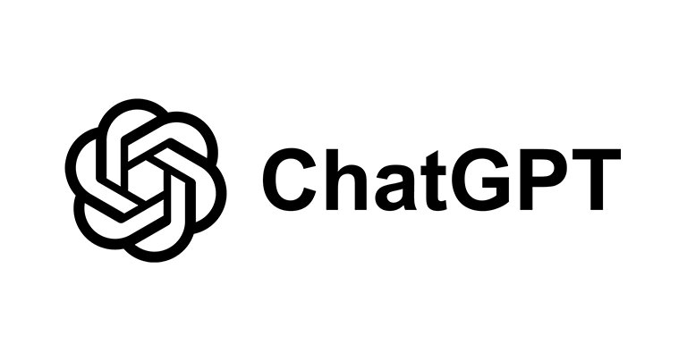

你对 ChatGPT 说”苹果”。

它”理解”的是什么？

不是一个水果的画面，不是咬一口时嘴里的酸甜味，不是秋天果园里的那种香气——

**是一串数字。大约 768 个数字。**

上一篇我们聊了 AI 怎么”看”——一张照片在 AI 眼里就是一堆 0 到 255 的数字，它通过层层检测器从中找到边缘、形状、五官，最终”认出”你的脸。

今天聊的问题更让人困惑：**文字呢？AI 怎么”读”文字？**

图片好歹有颜色、有亮度，你可以直觉地理解”用数字表示颜色深浅”。但文字？”我”这个字怎么变成数字？”爱”这个字又怎么变成数字？

而且，变成数字之后，AI 怎么知道”猫”和”狗”比”猫”和”汽车”更像？

这篇文章，我想和你一起搞清楚这件事。

# AI 看不懂文字
先从一个简单的事实说起：**电脑不认识字。**

这话听起来有点奇怪——你在电脑上打字，它不是能显示出来吗？

能显示，但那只是”画出来”。电脑知道”这个编号的字符应该显示成什么形状”，但它完全不理解这个字**是什么意思**。

就像你看一个你完全不认识的阿拉伯文字母——你能把它抄下来，但你不知道它说的是什么。

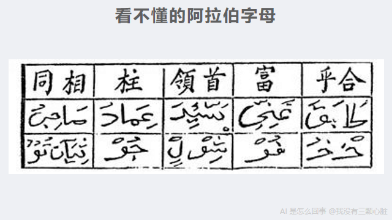

上一篇我们建立了一个核心框架：**要让 AI 处理任何东西，第一步都是把它变成数字。**

图片变成了数字矩阵（每个像素是一个 0 到 255 的数字）。

文字也一样——要变成数字。

但”把文字变成数字”远没有”把图片变成数字”那么直观。图片的数字化有天然的对应关系：一个像素 = 一个亮度值。文字呢？

给每个字编个号？比如”我”= 1，”爱”= 2，”你”= 3？

能编，但没用。因为 1、2、3 这些数字之间有大小关系——难道”你”比”我”大？”爱”在”我”和”你”中间？这毫无意义。

我们需要一种更聪明的方法，把文字变成数字，而且这些数字要能反映文字的**含义**。

但在讲这个”更聪明的方法”之前，我们先要解决一个前置问题：AI 读文字的时候，是一个字一个字读的吗？

# 第一步：把文字切成碎片——Token
你可能听说过一个词：**Token**。

如果你用过 ChatGPT，可能见过这样的提示：”您的对话已超过上下文长度限制”。这里的”长度”就是用 Token 来衡量的。

那 Token 到底是什么？

**Token 是 AI 处理文字的最小单位。** 你可以把它理解为 AI 读文字时的”一口”——它不是一个字一个字地读，也不是一个句子一个句子地读，而是一 Token 一 Token 地读。

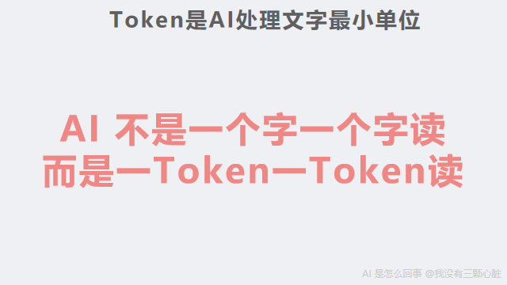

一个 Token 可以是一个字，也可以是一个词，甚至可以是半个词。

让我用具体例子来说明。

英文的情况：
```
"Hello world" → ["Hello", " world"]  （2 个 Token）

"unhappiness" → ["un", "happiness"]  （2 个 Token）

"ChatGPT is amazing" → ["Chat", "GPT", " is", " amazing"]  （4 个 Token）
```

中文的情况：
```
"我爱学习" → ["我", "爱", "学习"]  （3 个 Token）

"人工智能" → ["人工", "智能"]  （2 个 Token）
```

你可能注意到了——英文单词 “unhappiness” 被拆成了 “un” 和 “happiness” 两个部分，而不是保持完整的一个词。为什么？

这涉及到 AI 分词的方法。ChatGPT 使用的分词方法叫 **BPE**（Byte Pair Encoding，字节对编码）。这个名字很拗口，但原理不复杂：

想象你有一本厚厚的英文书。你从所有单个字母开始，然后统计哪两个字母最经常连在一起出现——假设是 “t” 和 “h”。于是你把它们合并成一个新的符号 “th”。然后继续找下一个最频繁的组合，比如 “th” 和 “e” 合并成 “the”。如此反复，常见的组合不断合并成更长的”碎片”。

最终的结果是：**常见的词会保持完整（比如 “the””is””Hello”），而不常见的词会被拆成几个常见的碎片**——就像 “unhappiness” 被拆成 “un”（一个常见的前缀）和 “happiness”（一个常见的词）。

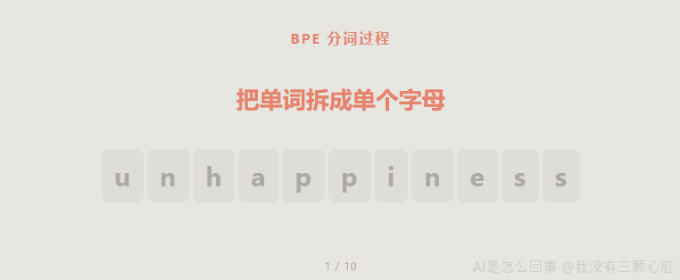

这种设计很聪明。它让 AI 不需要记住世界上所有的词——只需要记住几万个常用的”碎片”，就能拼出任何文字。比如 GPT-4 的词汇表大约有 [10 万个 Token](https://github.com/openai/tiktoken)，用这 10 万个碎片可以表达任何语言的任何文字。

你可能还想知道一个实用的数字：**英文大约每 4 个字母算 1 个 Token**，而中文大约每 1-2 个汉字算 1 个 Token（因为汉字在训练数据中出现的频率比英文字母低，所以合并的机会更少，切得更碎）。

这意味着什么？GPT-4 的上下文窗口——也就是它一次能”看到”的文字总量——是 [128,000 个 Token](https://platform.openai.com/docs/models)。换算成中文，大约是 6 万到 10 万个汉字，差不多是**一本中篇小说的长度**。也就是说，你可以把一整本书喂给它，让它一次性”读完”。

好了，现在 AI 已经把一段文字切成了一个个 Token。

**但这只是第一步。每个 Token 目前只是一个编号——比如 “Hello” 是编号 9906，”世界” 是编号 8853。**

这些编号本身没有意义。编号 9906 和编号 9907 之间没有任何语义关系。

下一个问题是：**怎么给每个 Token 赋予”意义”？**

# 第二步：给每个词一串数字——词向量
这就到了今天最关键的概念：**词向量**（Word Vector，也叫 Word Embedding，”词嵌入”）。

“向量”这个词听起来像是高深的数学。别怕，它其实就是**一串有序的数字**。

比如：
```
[0.2, -0.5, 0.8]
```

这就是一个向量。它有 3 个数字，所以叫”3 维向量”。

**词向量，就是用一串数字来代表一个词的含义。**

举个简化的例子。假设我们用 4 个数字来描述一个词，每个数字代表一个”特征维度”：

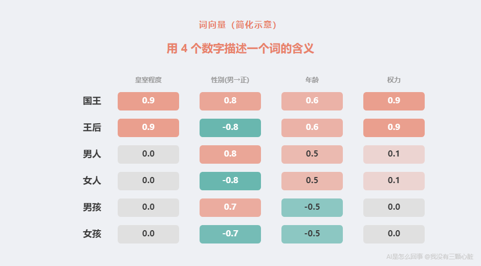

看到什么规律了吗？

- “国王”和”王后”几乎完全一样，唯一的区别是第二个数字（性别）一个是 0.8，一个是 -0.8

- “男人”和”女人”也一样——唯一的区别还是性别那个维度

- “男孩”和”男人”的主要区别在第三个数字（年龄）

**这些数字编码了词的含义。**

当然，我必须马上说明：**上面的例子是我为了让你理解而简化的。** 真实的词向量没有这么直观。

真实的词向量有两个重大区别：

**第一，维度多得多。** 在 2013 年 Google 的 Tomas Mikolov（托马斯·米科洛夫）等人发表的 [Word2Vec](https://arxiv.org/abs/1301.3781) 模型中（Word2Vec 的意思就是”词到向量”），一个词通常用 100 到 300 个数字来表示。而现在 ChatGPT 使用的模型，一个 Token 的向量维度可以达到 768 个甚至更多。为什么需要这么多？因为人类语言的含义极其丰富——4 个数字根本不够用，你需要几百个维度才能捕捉一个词的各种细微含义。

**第二，每个维度没有明确的”标签”。** 我刚才给每个数字贴了标签——“皇室程度””性别””年龄””权力”——但真实的词向量里，每个数字代表什么，没人知道。它们是 AI 从海量文本中自己”学”出来的，就像上一篇里说的：边缘检测器的数字不是人类设计的，是电脑从几百万张图片中自己学出来的。词向量也一样——那几百个数字不是人类安排的，是 AI 从几十亿个句子中自己发现的。

你可能会问：如果每个维度代表什么都不知道，那这些数字有什么用？

答案是：**虽然每个维度的含义不透明，但数字之间的”关系”是有意义的。**

这就引出了词向量最让人惊讶的性质。

# “国王” - “男人” + “女人” = ？
2013 年，Tomas Mikolov 和他在 Google 的同事们在 [一篇论文](https://arxiv.org/abs/1301.3781) 中展示了一个惊人的发现：

**如果你拿”国王”的向量，减去”男人”的向量，再加上”女人”的向量，得到的结果最接近的词是——“王后”。**
```
向量("国王") - 向量("男人") + 向量("女人") ≈ 向量("王后")
```

让我用前面那个简化的例子算给你看：
```
国王 = [0.9,  0.8, 0.6, 0.9]
男人 = [0.0,  0.8, 0.5, 0.1]
女人 = [0.0, -0.8, 0.5, 0.1]

国王 - 男人 + 女人
= [0.9,  0.8, 0.6, 0.9]
- [0.0,  0.8, 0.5, 0.1]
+ [0.0, -0.8, 0.5, 0.1]
```

一个数字一个数字地算：
```
第1个数字: 0.9 - 0.0 + 0.0 = 0.9
第2个数字: 0.8 - 0.8 + (-0.8) = -0.8
第3个数字: 0.6 - 0.5 + 0.5 = 0.6
第4个数字: 0.9 - 0.1 + 0.1 = 0.9

结果 = [0.9, -0.8, 0.6, 0.9]
```

回头看看我们之前定义的”王后”：
```
王后 = [0.9, -0.8, 0.6, 0.9]
```

**完全一样。**

你可能觉得这是因为我精心设计了那些数字——的确如此，我的例子是为了直观而构造的。

**但真正惊人的是：用真实数据训练出来的、每个维度都没有人为标签的 300 维词向量，也能做到这件事。**

Mikolov 团队用大约 [1000 亿个英文单词的 Google 新闻数据集](https://code.google.com/archive/p/word2vec/) 训练了一个 Word2Vec 模型，每个词用 300 个数字表示。他们发现这种”向量算术”在很多类比关系上都成立：
```
巴黎 - 法国 + 意大利 ≈ 罗马        （首都关系）
更大 - 大 + 小 ≈ 更小             （比较级关系）
走路 - 走 + 游 ≈ 游泳             （动作关系）
```

**这说明什么？**

说明那 300 个”莫名其妙”的数字，居然自动编码了人类语言中的逻辑关系。

- “国王”和”王后”之间的差异，和”男人”和”女人”之间的差异，被编码成了**同一个方向**——性别方向

- “巴黎”和”法国”之间的差异，和”罗马”和”意大利”之间的差异，被编码成了同一个方向——“首都”方向

AI 没有被教过”什么是性别””什么是首都”。它只是读了几十亿个句子，发现”国王”和”王后”出现在类似的上下文里，但”国王”更常和”他”出现在一起，”王后”更常和”她”出现在一起——从而自动学会了”性别”这个维度。

> 这是我学 AI 过程中第一个”wow moment”：一堆数字居然能捕捉人类语言的逻辑关系——不是因为有人教它”国王是男性的君主”，而是因为它从文字的共现模式中，自己发现了”性别”这个概念。

不过，我需要诚实地补充一点：这个经典例子有一个**微妙的细节**。在实际计算中，”国王 - 男人 + 女人”的结果**最接近的向量其实是”国王”本身**（因为你没有减去太多东西）。研究者在展示这个例子时，会把输入的三个词排除在候选结果之外——排除它们之后，[最接近的结果才是”王后”](https://blog.esciencecenter.nl/king-man-woman-king-9a7fd2935a85)。所以更准确的说法是：除了输入词本身之外，结果最接近的是”王后”。这并不影响核心发现——向量确实编码了语义关系——但科学需要精确。

# 这些数字是怎么”学”出来的？
你可能在想：这么神奇的向量，是怎么训练出来的？

核心思路其实和上一篇”让电脑自己学”的逻辑完全一样，只不过换了一个任务：**不是让电脑看图猜标签，而是让电脑读文字猜上下文。**

Word2Vec 的训练方法很巧妙。让我用一个具体例子来解释。

假设 AI 读到这样一句话：
```
"今天天气真好，我们去公园散步"
```

Word2Vec 会拿出其中一个词，比如”公园”，然后问 AI 一个问题：

**“公园”这个词的附近，最可能出现什么词？**

正确答案是：”去””散步””天气”——这些都是”公园”附近出现的词。

AI 一开始随机猜，然后和正确答案对比，猜错了就调整——调整什么？调整”公园”这个词对应的那串数字（也就是它的词向量）。

重复几十亿次。

**神奇的事情就发生了：**

因为”公园”和”花园”经常出现在相似的上下文中（都可以”去”，都能”散步”，都和”风景””绿色”有关），所以它们的向量会被调整得很接近。

而”公园”和”键盘”几不会出现在相似的上下文中，所以它们的向量会离得很远。

**这就是词向量的核心训练逻辑：经常出现在相似上下文中的词，向量就接近；不在相似上下文中出现的词，向量就远离。**

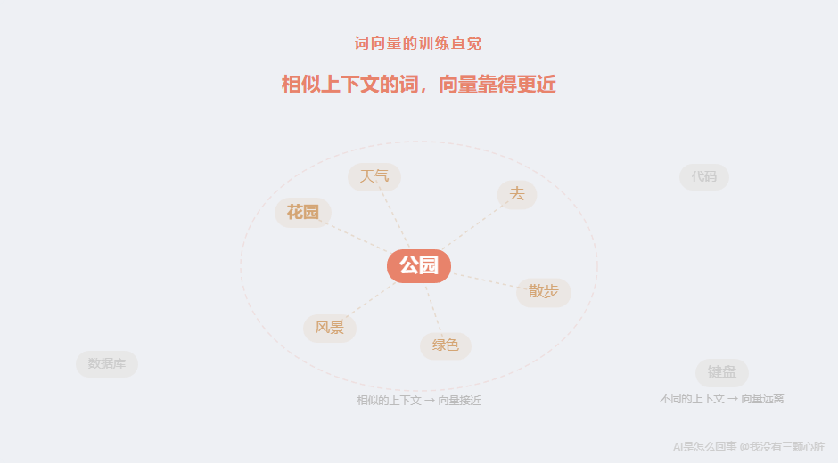

这个思路有一个更早的渊源。英国语言学家 J.R. Firth 在 1957 年说过一句著名的话：

> **“You shall know a word by the company it keeps.”**
> （你可以通过一个词的”同伴”来了解这个词。）

Word2Vec 做的，就是把这个语言学直觉变成了数学。

Mikolov 团队在 2013 年发表了两篇关键论文：第一篇 [《Efficient Estimation of Word Representations in Vector Space》](https://arxiv.org/abs/1301.3781) 提出了 Word2Vec 的基本架构；第二篇 [《Distributed Representations of Words and Phrases and their Compositionality》](https://proceedings.neurips.cc/paper/2013/file/9aa42b31882ec039965f3c4923ce901b-Paper.pdf) 进一步改进了训练方法，并展示了词向量的各种奇妙性质。一年后，斯坦福大学的 Jeffrey Pennington 等人发表了另一个著名的词向量模型 [GloVe](https://nlp.stanford.edu/projects/glove/)（Global Vectors for Word Representation，”全局词向量表示”），用不同的数学方法达到了类似的效果。

这些工作奠定了 AI 处理语言的基础——**把”含义”变成了”可以计算的数字”。**

# 怎么判断两个词有多像？——余弦相似度
现在每个词都变成了一串数字。那 AI 怎么判断两个词的意思有多接近？

最直觉的方法是比大小——两串数字差得多不多？

但这有一个问题。假设”猫”的向量是 [1, 2, 3]，”狗”的向量是 [2, 4, 6]。它们的数字大小差很多（差了一倍），但方向完全一样——都指向同一个方向。而”含义相近”在向量空间中，更多地体现为**方向相同**，而不是大小相近。

所以 AI 不比大小，比**方向**。

测量两个向量方向接近程度的方法叫**余弦相似度**（Cosine Similarity）。它衡量的是两个向量之间的夹角——夹角越小，方向越接近，余弦值越大。

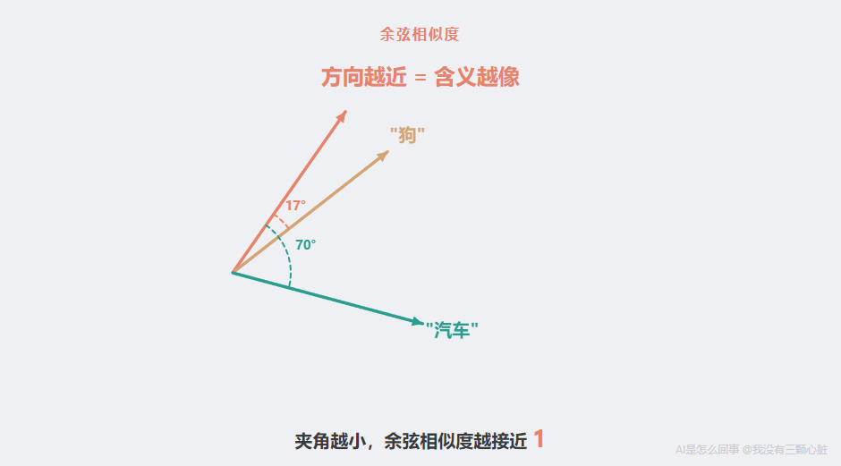

余弦相似度的计算公式并不复杂。让我用一个简单的例子演示。

假设我们有两个 3 维的词向量：
```
猫 = [1, 2, 3]
狗 = [2, 3, 4]
```

余弦相似度的计算分三步：

**第一步：对应位置相乘，然后全部加起来（这叫”点积”）**
```
1×2 + 2×3 + 3×4 = 2 + 6 + 12 = 20
```

你有没有觉得这个操作很眼熟？没错——上一篇里 Sobel 算子检测边缘用的就是这个操作：”对应位置的数字相乘，然后全部加起来”。同一种数学运算，在图像里用来检测边缘，在语言里用来衡量相似度。

**第二步：计算每个向量的”长度”**

向量的长度是每个数字的平方加起来再开根号：
```
猫的长度 = √(1² + 2² + 3²) = √(1+4+9) = √14 ≈ 3.74
狗的长度 = √(2² + 3² + 4²) = √(4+9+16) = √29 ≈ 5.39
```

**第三步：点积除以两个长度的乘积**
```
余弦相似度 = 20 / (3.74 × 5.39) = 20 / 20.16 ≈ 0.99
```

结果是 0.99，非常接近 1。**这意味着”猫”和”狗”的向量方向几乎完全一致——它们的语义非常接近。**

余弦相似度的值在 -1 到 1 之间：

- **1** 表示方向完全相同（语义完全相关）

- **0** 表示方向垂直（语义无关）

- **-1** 表示方向完全相反（语义对立）

在实际的 Word2Vec 模型中（用 Google 新闻数据训练的 300 维向量），一些典型的余弦相似度大约是：
```
"king" 和 "queen"   ≈ 0.65   （强相关：都是君主）
"cat"  和 "dog"     ≈ 0.76   （强相关：都是宠物）
"good" 和 "bad"     ≈ 0.72   （中等相关：都是评价词，虽然含义相反）
"cat"  和 "computer" ≈ 0.13  （弱相关：几乎无关）
```

你可能注意到一个有趣的现象：”good”和”bad”的相似度居然不低。这是因为余弦相似度衡量的是**语义空间中的方向**，而”good”和”bad”虽然含义相反，但它们经常出现在相似的语境中（”这部电影很 good/bad”），所以在向量空间中的方向其实比较接近。这也提醒我们：词向量捕捉的是**使用模式的相似性**，不完全等同于”意思一样”。

# 这让 ChatGPT 成为可能
词向量看起来是一个很”学术”的发明。但它解决了一个困扰计算机科学几十年的实际问题。

让我讲一个你一定有过的体验。

2010 年前后，你在搜索引擎里搜”苹果手机”。搜索结果里混着什么？**水果。**

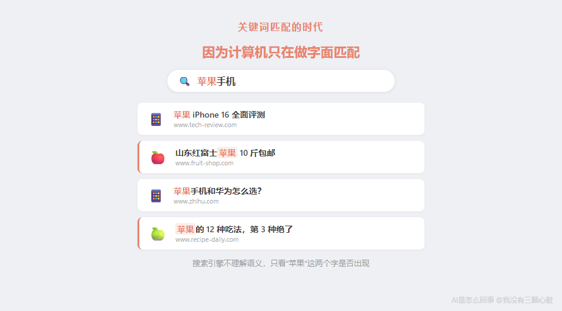

为什么？因为当时的搜索引擎用的是**关键词匹配**——它只是在找”哪些网页里包含’苹果’这个字”。网页里写的是苹果公司还是苹果水果？搜索引擎不知道，也不关心。

这就是”没有词向量”的世界。文字在计算机眼里就是一串符号，”苹果” = “苹果”，没有任何语义区分。

**词向量改变了这一切。**

有了词向量，”苹果”不再只是两个汉字——它是一串数字。而且根据上下文的不同，这串数字可以不同：

- 当”苹果”出现在”我吃了一个红红的苹果”中时，它的向量更接近”橘子””水果””甜”

- 当”苹果”出现在”我买了一部苹果手机”中时，它的向量更接近”iPhone””三星””科技”

（需要说明的是，最初的 Word2Vec 模型每个词只有一个固定的向量，无法区分同一个词的不同含义。真正实现”根据上下文生成不同向量”的，是后来的模型——特别是 2017 年的 Transformer 和 2018 年的 BERT。这些我们后面的文章会专门讲。但词向量打下的基础是不可替代的。）

这个变化带来了”以前”和”现在”的巨大差距：

**以前：关键词匹配**

- 计算机只知道”苹果”这个符号

- 搜”苹果手机”，所有包含”苹果”的网页都出来

- 搜”怎么给小狗洗澡”，如果某篇文章标题是”如何帮幼犬清洁”——找不到，因为没有一个关键词对得上

**现在：语义搜索**

- 计算机知道”苹果手机”和”iPhone”的向量很近

- 计算机知道”小狗”和”幼犬”的向量很近，”洗澡”和”清洁”的向量很近

- 它不再匹配字面文字，而是计算**向量之间的距离**——也就是语义之间的距离

**这就是从”字面匹配”到”语义理解”的跨越。**

ChatGPT 能够”理解”你说的话（至少表面上看起来是这样），正是因为它把你说的每一个 Token 都变成了一串数字——一串编码了丰富语义信息的数字。在这个”数字世界”里，”高兴”和”开心”靠得很近，”快乐”和”悲伤”的关系对称地映射着”白天”和”夜晚”的关系，”巴黎”和”法国”之间的距离等于”东京”和”日本”之间的距离。

**AI 眼中没有文字。只有高维空间里的点。**

它理解语义的方式，就是计算点和点之间的距离。

# 从 4 维到 768 维：你能想象吗？
前面为了让你直观理解，我用了 4 维的例子。但真实的词向量是 300 维、768 维，甚至更高。

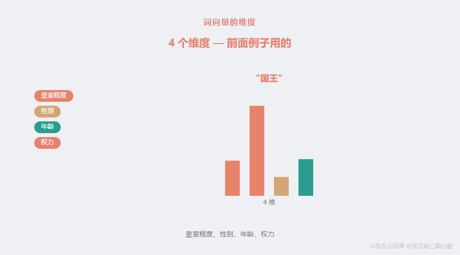

768 维是什么概念？

我们能想象的空间最多到 3 维——长、宽、高。4 维已经超出日常直觉了。768 维？

坦白说，**没有人能真正”想象” 768 维空间。**

但你可以这样理解：每增加一个维度，就多了一个”描述特征的角度”。

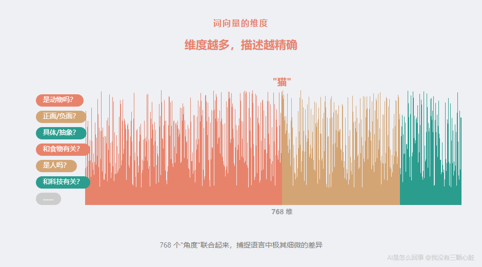

3 维空间里，你只能用 3 个数字描述一个物体的位置。但如果你要描述一个词的”含义”——它是具体的还是抽象的？是正面的还是负面的？是人还是物？是动词还是名词？和食物有关还是和科技有关？是正式用语还是口语？——这些维度很快就超过 3 个了。

768 维意味着 AI 有 768 个不同的”角度”来描述一个词。这些角度大部分我们无法命名，但它们联合起来，能捕捉语言中极其细微的差异。

一个直觉类比：如果你要向一个从没见过地球的外星人描述”猫”，你可以说”它有四条腿”（1 个维度）、”它是动物”（2 个维度）、”它很小”（3 个维度）……你用的维度越多，描述越精确。768 个维度，就是用 768 个”特征”来精确定位这个词在语义空间中的位置。

# 从词向量到 AI 的”语言能力”
让我把今天讲的东西串起来：
```
一段文字
  ↓
[切分 Token]  "我爱学习" → ["我", "爱", "学习"]
  ↓
[查词向量]    "我" → [0.12, -0.34, 0.56, ..., 0.78]  (768个数字)
              "爱" → [0.45, 0.23, -0.67, ..., 0.11]  (768个数字)
              "学习" → [-0.33, 0.89, 0.12, ..., -0.45]  (768个数字)
  ↓
[后续处理]    AI 在这些数字上做运算，"理解"语义
```

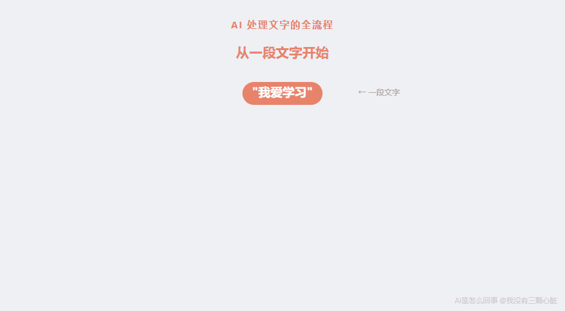

这个流程是所有现代 AI 语言模型——ChatGPT、Claude、Gemini——的起点。

**没有词向量，AI 就没法处理语言。**

就像上一篇说的”没有数字矩阵，AI 就没法处理图像”一样。无论 AI 做什么，第一步永远是**把输入变成数字**。图像的”数字化”是像素矩阵，语言的”数字化”就是词向量。

# 一句话回顾
**AI 眼中的文字不是文字，是高维空间里的点。**

每个词被表示为一串几百个数字，这些数字编码了词的含义。含义相近的词，在高维空间里靠得更近；含义不同的词，离得更远。AI 通过计算点之间的距离来”理解”语义——不是真的理解，而是在做精确的数学运算。

“国王 - 男人 + 女人 = 王后”这个等式告诉我们：AI 从几十亿个句子中，自己发现了人类语言的结构。没有人教它什么是”性别”，什么是”首都”，什么是”比较级”——它只是读了足够多的文字，数字就自然排列出了这些关系。

# 一个新的问题
现在 AI 能”看”了（图片 = 数字矩阵），也能”读”了（文字 = 词向量）。

这两个能力在 2012 年之前就已经存在了——词向量的早期研究可以追溯到 2003 年，边缘检测更是 1968 年就有了。

**但直到 2012 年，AI 才突然”变厉害”了。**

那一年，一个叫 AlexNet 的程序参加了一个图像识别比赛。结果出来的时候，所有人的下巴都掉了下来——它的成绩远远超过了所有对手，以至于评委们一度以为他们作弊了。

发生了什么？下一篇，我们来聊这个让整个 AI 领域天翻地覆的时刻。

# 参考资料

- [Efficient Estimation of Word Representations in Vector Space - Mikolov, Chen, Corrado, Dean (2013)](https://arxiv.org/abs/1301.3781) — Word2Vec 的原始论文，提出用神经网络学习词向量，展示了”国王-男人+女人=王后”等向量算术

- [Distributed Representations of Words and Phrases and their Compositionality - Mikolov et al. (2013)](https://proceedings.neurips.cc/paper/2013/file/9aa42b31882ec039965f3c4923ce901b-Paper.pdf) — Word2Vec 的后续论文，改进了训练方法并展示了词向量的各种语义性质

- [GloVe: Global Vectors for Word Representation - Pennington, Socher, Manning (2014)](https://nlp.stanford.edu/projects/glove/) — 斯坦福大学提出的另一种词向量模型，用全局共现统计学习词向量

- [word2vec-google-news-300 - Google](https://code.google.com/archive/p/word2vec/) — Google 发布的用约 1000 亿词的新闻数据训练的预训练词向量，包含 300 万个词的 300 维向量

- [tiktoken - OpenAI](https://github.com/openai/tiktoken) — OpenAI 开源的 Token 分词工具，GPT 系列模型使用的 BPE 分词器

- [OpenAI 模型文档](https://platform.openai.com/docs/models) — GPT-4 模型规格包括 128K Token 上下文窗口

- [King - Man + Woman = King? - Netherlands eScience Center](https://blog.esciencecenter.nl/king-man-woman-king-9a7fd2935a85) — 对”国王-男人+女人=王后”这个经典例子的深入分析，指出需要排除输入词的细节

- [What are tokens and how to count them? - OpenAI](https://help.openai.com/en/articles/4936856-what-are-tokens-and-how-to-count-them) — OpenAI 官方的 Token 计数说明，英文约 4 字符/Token

# 订阅
如果觉得有意思，欢迎关注我，后续文章也会持续更新。同步更新在[个人博客](https://www.wmyskxz.cn/)和[微信公众号](https://weixin.sogou.com/weixin?type=1&s_from=input&query=wmyskxz&ie=utf8&_sug_=n&_sug_type_=&w=01019900&sut=1861&sst0=1612590375262&lkt=8,1612590373961,1612590375161)

微信搜索”我没有三颗心脏”或者扫描二维码，即可订阅。


---

*笔记整理日期：2026-05-18*
