# AI是怎么回事：AI是怎么突然变厉害的——2012所有人以为他们作弊了

> 课程来源：https://wmyskxz.cn/wiki/whats_ai/3/

---

> 这是 **「AI是怎么回事」** 系列的第 `3` 篇。我一直很好奇 AI 到底是怎么工作的，于是花了很长时间去拆这个东西——手机为什么换了发型还能认出你，ChatGPT 回答你的那三秒钟里究竟在算什么，AI 为什么能通过律师考试却会一本正经地撒谎。这个系列就是我的探索笔记，发现了很多有意思的东西，想分享给你。觉得不错的话，欢迎分享+关注。

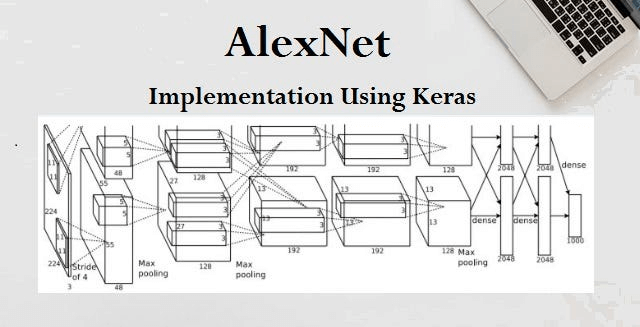

如果 AI 的历史是一部电影，2012 年 10 月就是高潮。

一个叫 AlexNet 的程序，让所有人的下巴掉了下来。

但在讲这个故事之前，我们得先说一场比赛。

# 一场给 AI 出的”高考”
上一篇我们讲了 AI 怎么”读懂”文字——把词变成一串数字，在高维空间里计算距离。第一篇讲了 AI 怎么”看”——图片就是数字矩阵，用检测器一层一层提取特征。

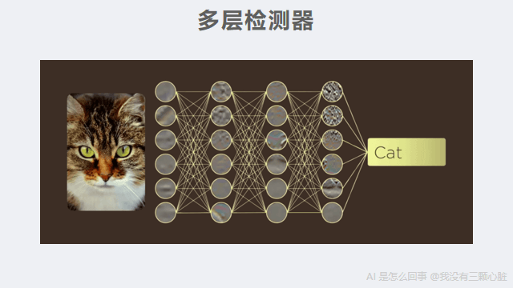

但如果你跟着读到这里，你可能会有一个很自然的问题：

**如果原理这么”简单”——不就是数字运算吗——为什么 AI 不是一直都很厉害？为什么到 2012 年才突然爆发？**

要回答这个问题，我们需要先了解一场比赛。

2010 年，一群做计算机视觉研究的科学家组织了一场大规模的 AI 比赛，叫做 **ILSVRC**——名字很长，你不需要记住它，只需要知道大家通常用它背后的数据集名字来称呼它：**ImageNet 挑战赛**。

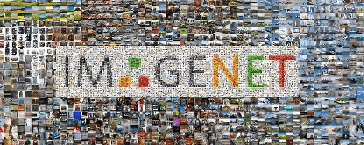

ImageNet 是什么？是一个巨大的图片数据集。它由斯坦福大学的[李飞飞](https://en.wikipedia.org/wiki/Fei-Fei_Li)教授团队从 2007 年开始建设，最终包含超过 [1400 万张标注好的图片](https://en.wikipedia.org/wiki/ImageNet)，涵盖两万多个类别。”标注好”的意思是：每张图都有人告诉你”这是猫”、”这是狗”、”这是一把椅子”——这些”正确答案”是 AI 学习的前提。

这个数据集有多大？我第一次看到这个数字的时候，做了个换算：如果你每秒看一张图片，不吃不睡不停地看，要看 **162 天**才能看完。

ImageNet 挑战赛用的是这个数据集的一个子集：大约 **120 万张训练图片**，**1000 个类别**。比赛规则很简单——

**给 AI 看一张图，让它猜这是什么。每张图可以猜 5 次，5 次都没猜对才算错。看谁错得最少。**

这个”猜 5 次”的规则是有原因的：有些图片确实很难分辨。比如一张照片里有一只狗，品种可能是”拉布拉多”、”金毛”、”大丹犬”……如果 AI 把”金毛”猜成了”拉布拉多”，但 5 次里猜到了”金毛”，就算对。这个指标叫做 **top-5 错误率**——5 次机会都猜错的比例。

简单来说，这就是一场给 AI 出的”高考”。

# 一场”正常”的进步
2010 年，第一届比赛。

冠军来自 NEC 实验室和伊利诺伊大学的联合团队，他们使用的是当时的主流方法——**人工设计特征 + 统计模型分类**。

这是什么意思？回忆一下第一篇的内容。我们讲过，AI”看”图片靠的是检测器——一组数字组成的小模板，在图片上滑动，提取边缘、形状、纹理等特征。AlexNet 的做法是让电脑自己从数据里学出这些检测器。但在 2012 年之前，**这些检测器是人类手动设计的**——比如第一篇里的 Sobel 算子，就是人类根据”比较左右亮度差”这个思路，亲手选定了那 9 个数字。

传统方法的流程是这样的：人类先设计一堆固定的检测器（”找这种方向的边缘””统计这种纹理出现了几次””计算这块区域的颜色分布”），用这些检测器从图片中提取出一组数字，然后把这组数字交给一个统计模型（比如 SVM，支持向量机）去做最终的分类判断——“这组数字更像猫还是更像狗”。

这个方法能工作，但有一个根本的瓶颈：**检测器是固定的。** 人类能想到的特征就那么多，能手动设计的检测器也就那么多。不管你后面的统计模型多厉害，输入它的那些特征就这些——如果特征本身不够好，分类结果就上不去。

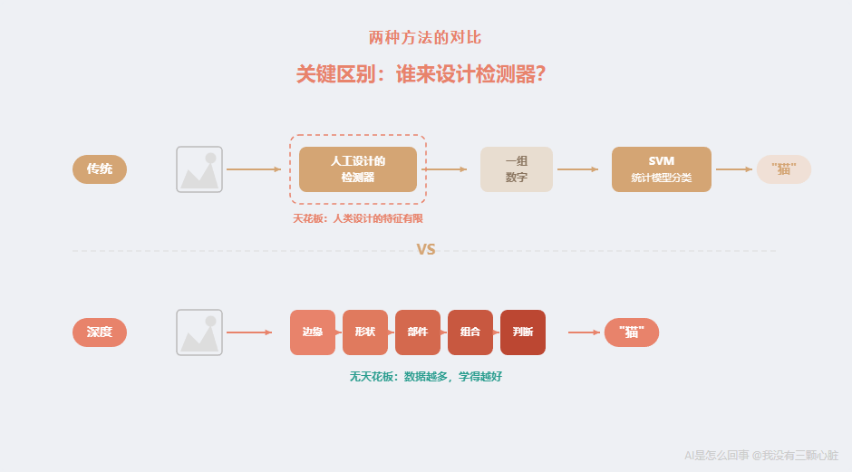

成绩：top-5 错误率 [**28.2%**](https://image-net.org/challenges/LSVRC/2012/results.html)。

翻译一下：给 AI 看 100 张图片，5 次机会都猜不对的有 28 张。

如果把这换算成考试分数——满分 100 分的话——大概相当于**考了 72 分**。能及格，但说不上好。

2011 年，第二届。

冠军是来自法国的 XRCE 团队（施乐欧洲研究中心），用的是一种叫”压缩 Fisher 向量”的方法——本质上还是人工设计特征，然后用统计方法分类。

成绩：top-5 错误率 [**25.8%**](https://en.wikipedia.org/wiki/ImageNet)。

从 28.2% 到 25.8%，进步了 **2.4 个百分点**。

换算成考试分数：从 72 分进步到了 74 分。

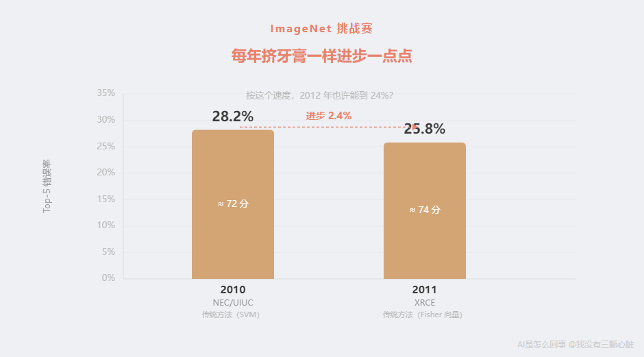

这是一种很”正常”的进步——每年各个团队改进一下特征提取方法，调整一下分类器参数，小心翼翼地把错误率往下磨一点点。

所有人都默认：这就是 AI 进步的速度。2012 年也许能到 24%，2013 年也许能到 22%，像挤牙膏一样。

# 2012 年 10 月：炸弹来了
2012 年 10 月，ImageNet 挑战赛的结果在意大利佛罗伦萨的一个学术会议上公布。

冠军团队叫 **SuperVision**，来自加拿大多伦多大学，只有三个人：Geoffrey Hinton 教授——一位研究神经网络几十年的先驱，和他的两个研究生 Alex Krizhevsky 与 Ilya Sutskever。他们提交的模型，用 Alex 的名字命名为 **AlexNet**（Alex 的网络）。

他们的成绩：

**top-5 错误率 [15.3%](https://papers.nips.cc/paper/4824-imagenet-classification-with-deep-convolutional-neural-networks)。**

第二名的成绩是多少？

[**26.2%**](https://papers.nips.cc/paper/4824-imagenet-classification-with-deep-convolutional-neural-networks)。

AlexNet 领先第二名 **10.9 个百分点**。

在一个连年进步 2-3 个百分点都值得庆祝的比赛里，有人一下子领先了 10.9 个百分点。

**整个计算机视觉学术圈震惊了。**

# 让这个数字”可感知”
10.9 个百分点。

你可能觉得”好像挺多的”，但也没什么概念。让我帮你建立一个参照系。

**考试类比：**

想象一场全国性的标准化考试。

- 2010 年：全国最高分 72 分

- 2011 年：全国最高分 74 分（进步 2 分，大家觉得很正常）

- 2012 年：全国最高分 **85 分**

所有人都还在 72 到 74 分之间互相竞争，突然有人考了 85 分。

而且不是偶然——这个人的方法和其他所有人**完全不同**。别人还在用老办法死磕，他用了一套全新的解题策略。

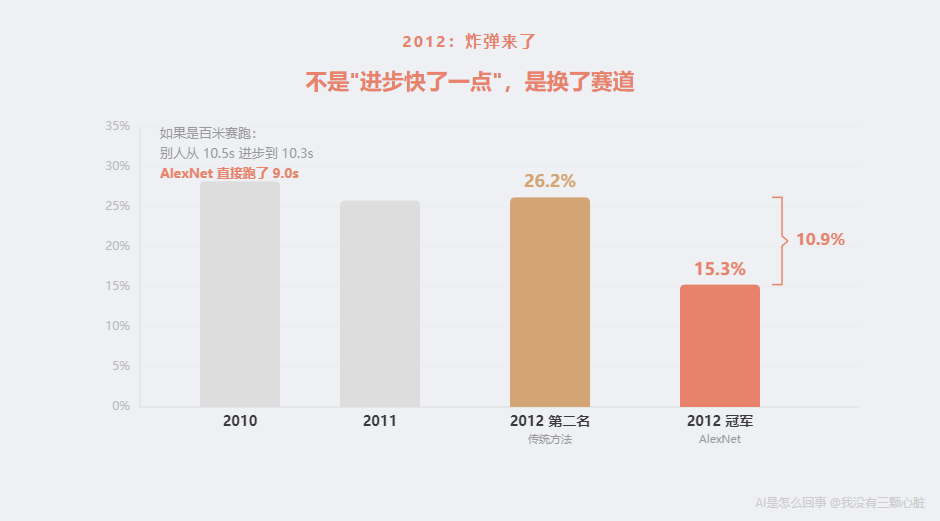

**赛跑类比：**

如果把这场比赛比作百米短跑——

- 2010 年的冠军成绩：10.5 秒

- 2011 年的冠军成绩：10.3 秒（进步 0.2 秒，正常训练的结果）

- 2012 年：突然有人跑出了 **9.0 秒**

不是训练更刻苦了，是这个人换了一种跑法——比如从正常跑步变成了骑摩托车。

你一定会想：**他是不是作弊了？**

**实际上，很多研究者的第一反应真的就是不敢相信。**

ImageNet 数据集的创建者李飞飞教授后来回忆自己当时的反应时说，在那之前，

> [“大多数人把神经网络视为被封在玻璃橱柜里、用天鹅绒绳索保护起来的老古董”](https://www.understandingai.org/p/why-the-deep-learning-boom-caught)。

当她看到 AlexNet 在她的数据集上取得的成绩时，她意识到这个时刻太重要了，不能错过——她改变了原本打算在家的计划，飞到了佛罗伦萨的会议现场。

**这不是”进步快了一点”。这是换了一条赛道。**

# 再看几个数字
让我再帮你从几个不同的角度感受这个差距。

**角度一：按正常速度要追多久？**

2010 年到 2011 年，进步了 2.4 个百分点（从 28.2%到 25.8%）。

如果按照这个速度，从 25.8%进步到 15.3%需要多少年？

（25.8 - 15.3）÷ 2.4 ≈ **4.4 年**

也就是说，如果继续用老方法，要到 **2015 或 2016 年**才可能达到 AlexNet 在 2012 年就做到的成绩。

但事实比这更糟。

**角度二：老方法已经到了天花板。**

看看 2012 年第二名到第五名的成绩：

- 第二名：26.2%

- 其余名次大多在 26%到 27%之间挤着

大家用的都是类似的传统方法——人工设计特征，然后用统计模型分类。第二名到第五名之间差距不到 2 个百分点，所有人都挤在同一个区间里。

这说明什么？**传统方法已经接近极限了。** 不管你怎么调整、怎么优化，用老方法大概也就能做到 25%左右。

而 AlexNet 直接跳到了 15.3%。

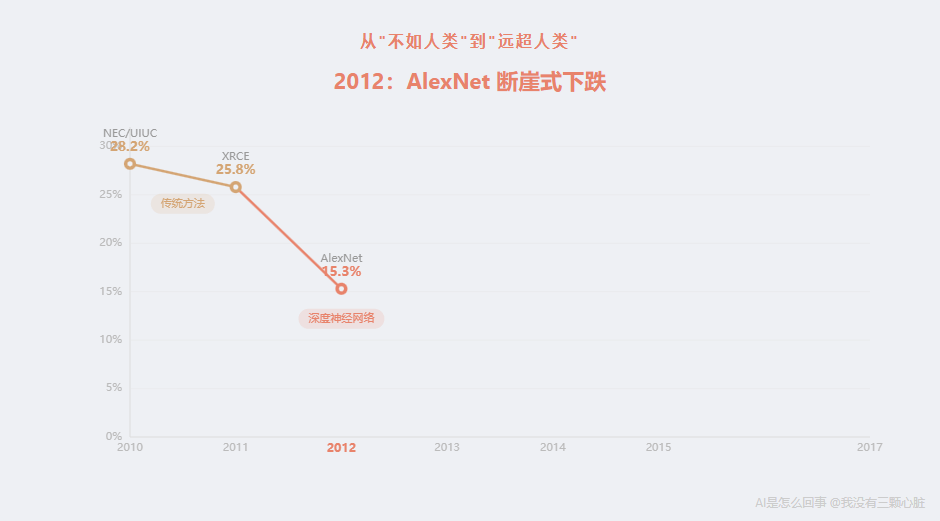

**角度三：后续发展证明这不是侥幸。**

AlexNet 之后，几乎所有参赛团队都转向了同一种方法——深度神经网络。

后面的进步速度更是惊人：

| 年份 | 冠军模型 | top-5 错误率 | 使用方法 |
| --- | --- | --- | --- |
| 2010 | NEC/UIUC | 28.2% | 传统方法（SVM） |
| 2011 | XRCE | 25.8% | 传统方法（Fisher 向量） |
| 2012 | AlexNet | 15.3% | 深度神经网络 |
| 2013 | Clarifai | 11.7% | 深度神经网络 |
| 2014 | GoogLeNet | 6.7% | 深度神经网络 |
| 2015 | ResNet | 3.57% | 深度神经网络（152 层） |
| 2017 | SENet | 2.25% | 深度神经网络 |

注意到了吗？

2014 年，GoogLeNet 把错误率做到了 6.7%——已经接近人类水平。

人类水平是多少？2014 年，后来成为 Tesla AI 总监的 Andrej Karpathy 亲自做了一个实验：他自己坐下来，仔仔细细地对 ImageNet 的图片做分类。他专注地做了这个测试之后，达到了 [5.1%的 top-5 错误率](http://karpathy.github.io/2014/09/02/what-i-learned-from-competing-against-a-convnet-on-imagenet/)——这个数字后来成为了 ImageNet 上”人类水平”的标杆。

2015 年，微软的 ResNet（残差网络，一种 152 层深的神经网络）做到了 [3.57%](https://image-net.org/challenges/LSVRC/2015/results)。

**AI 超过了人类。**

到 2017 年，SENet（一种叫”压缩-激发网络”的新架构）把错误率降到了 [2.25%](https://image-net.org/challenges/LSVRC/2017/results)，之后比赛组织者宣布：[这个基准已经被解决了](https://image-net.org/challenges/beyond_ilsvrc.php)，不再有挑战性，比赛结束。

从 28.2%到 2.25%，从”勉强及格”到”远超人类”，只用了 **7 年**。

而引爆这一切的，就是 2012 年的 AlexNet。

# 那它到底做了什么不同的事？
好，AlexNet 很厉害，这我们知道了。

但它到底做了什么？为什么能领先第二名这么多？

答案是：**三件事同时凑齐了。**

如果你读过第一篇，你已经知道了这个框架——数据、算力、算法。这一篇我们来深入看看这三个要素在 2012 年到底是怎么”凑齐”的。

# 要素一：数据——1400 万张图片背后的苦力活
深度神经网络有一个特点：它需要**海量的数据**来学习。

为什么？想想第一篇讲过的学习过程——电脑用随机的检测器扫描图片，猜对了保持，猜错了调整。如果只有 100 张图片，那些检测器会”死记硬背”这 100 张图的细节（这种情况叫”过拟合”，我后面会专门讲），而不是学到真正有用的规律。就像一个学生，如果只做了 3 道练习题就去考试，他可能只是记住了那 3 道题的答案，换个数字就不会了。

你需要给它看**足够多、足够多样**的图片，它才能学到真正通用的规律。

2009 年之前，这是一个大问题——没有人有这么多标注好的图片。

李飞飞教授改变了这一切。

她的灵感来自一个认知科学的研究：人类大约能识别 [3 万种不同的物体类别](https://www.historyofdatascience.com/imagenet-a-pioneering-vision-for-computers/)。她想建一个同等规模的图片数据库，让 AI 也能”见多识广”。

2007 年，她在普林斯顿大学开始这个项目。同事们觉得她疯了——当时主流的想法是”改进算法”，没人觉得费那么大劲收集数据有什么用。

但她做了。

为了在合理的时间内完成标注，她使用了亚马逊的众包平台（Amazon Mechanical Turk，一种把任务拆成小块分给大量网上工人完成的平台）。从 2008 年 7 月开始，到 2010 年 4 月完成。在这不到两年的时间里，来自[167 个国家的近 49000 名标注工人](https://qz.com/1034972/the-data-that-changed-the-direction-of-ai-research-and-possibly-the-world)，从 1.6 亿张候选图片中筛选和标注。平均每个工人每分钟判断 50 张图片——“这张图里有猫吗？””这是哪种猫？”

最终，ImageNet 收录了超过 **1400 万张标注好的图片**，覆盖两万多个类别。

这在当时是前所未有的规模。在 ImageNet 之前，常用的图片数据集通常只有几千到几万张图。1400 万张，是量级上的跃升。

**没有 ImageNet，就没有 AlexNet 的突破。** 那些深层的检测器需要看到足够多的例子，才能从随机数字变成有意义的特征提取器。只有几千张图，网络根本学不出来。

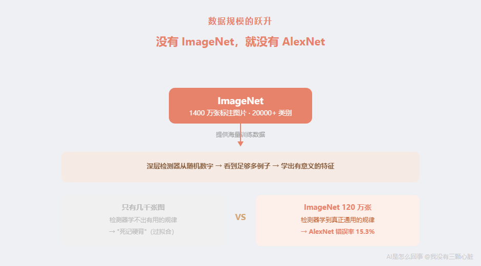

# 要素二：算力——两块游戏显卡改变了一切
有了数据还不够。

第一篇讲过，AlexNet 有 **6000 万个参数**——6000 万个需要调整的数字。训练这个网络意味着：对 120 万张训练图片，每一张都要做 6000 万次乘法和加法，然后根据结果调整参数，这个过程要反复很多遍（AlexNet 训练了 [90 个轮次](https://en.wikipedia.org/wiki/AlexNet)——也就是把 120 万张图片完整地看了 90 遍）。

简单算一下这个计算量：

> 120 万张图 × 6000 万次运算/张 × 90 轮 = 一个天文数字

如果用当时普通电脑的 **CPU**（中央处理器，电脑的”大脑”）来算——CPU 擅长处理复杂的、需要一步一步按顺序做的任务，但每次只能做一两件事——这可能要算**好几月甚至好几年**。

Alex Krizhevsky 用了一个聪明的办法：**用游戏显卡来算。**

游戏显卡的核心叫 **GPU**（Graphics Processing Unit，图形处理器）。GPU 原本是用来渲染游戏画面的。游戏画面需要同时计算屏幕上几百万个像素的颜色——每个像素的计算都很简单（就是乘法和加法），但需要同时算很多个。所以 GPU 的设计理念是：**大量小核心并行干活。**

打个比方：

- **CPU** 像一个顶级大厨。手艺精湛，什么菜都能做，但一次只能炒一道菜。

- **GPU** 像 1000 个帮厨。每个人技术一般，只会切菜和搅拌这种简单操作——但 1000 个人同时干活，切菜的总速度远远超过一个大厨。

训练神经网络恰好就是这种活——**大量简单的乘法和加法，可以同时做**。这正是 GPU 的主场。

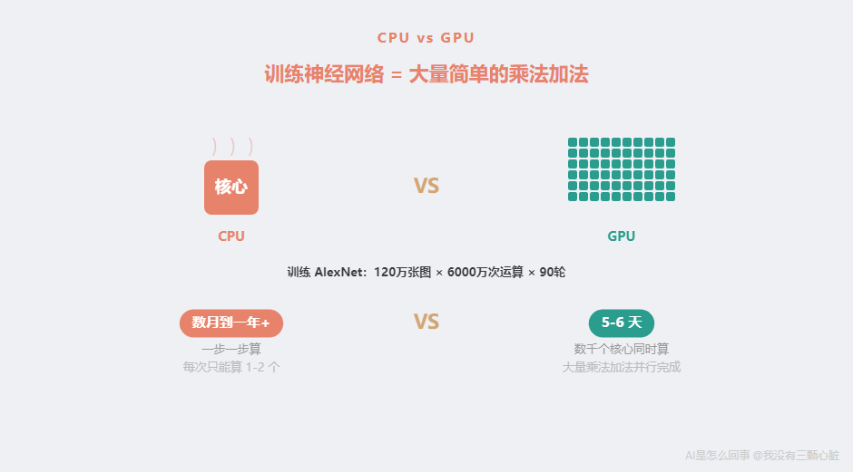

2009 年，斯坦福大学的吴恩达（Andrew Ng）团队发表了一篇论文，证明在特定的 AI 训练任务上，[GPU 比 CPU 快约 70 倍](https://robotics.stanford.edu/~ang/papers/icml09-LargeScaleUnsupervisedDeepLearningGPU.pdf)。

**70 倍。** 原来要算 70 天的事情，现在 1 天就能算完。

Alex Krizhevsky 正是利用了这一点。他用的是两块 NVIDIA 的 GTX 580 显卡——这是一款当时定价 [499 美元](https://videocardz.com/nvidia/geforce-500/geforce-gtx-580)的游戏显卡，每块只有 [3GB 显存和 512 个计算核心](https://en.wikipedia.org/wiki/AlexNet)。

为什么要用两块？因为一块显卡的 3GB 内存装不下整个网络。所以 Krizhevsky 把网络劈成两半，一半放在一块显卡上，一半放在另一块上，让两块显卡协同工作。

训练时间：大约 **5 到 6 天**。

换个角度感受一下：如果用 CPU，同样的训练可能需要几个月到一年多。GPU 把这个时间压缩到了不到一周。两块不到 500 美元的游戏显卡，就是 AlexNet 背后全部的计算硬件。

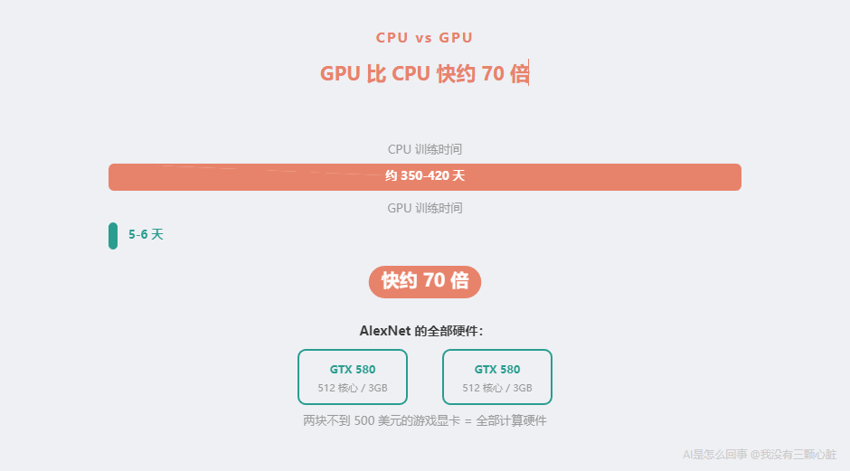

作为对比，看看今天的规模：据报道，2023 年的 GPT-4 使用了约 25000 块 NVIDIA A100 GPU（每块芯片性能是 GTX 580 的几十倍），训练花了几个月。从”两块游戏显卡训练一周”到”两万五千块专业 GPU 训练几个月”——AI 对算力的渴求增长了何止百万倍。

但一切的起点，就是那两块 GTX 580。

# 要素三：算法——几个关键的技术改进
数据和算力到位了，但还需要算法上的突破。

AlexNet 使用的核心方法，在第一篇已经介绍过了——**深度卷积神经网络**。就是多层检测器叠在一起：第一层找边缘，第二层找形状，第三层找部件，一层一层往上，最后判断”这是什么”。


但在 2012 年之前，深度神经网络有一个严重的问题：**层数一多，就训练不动了。**

为什么？因为一个叫”梯度消失”的问题。

还记得第一篇讲过的”反向传播”吗？——从输出的错误往回推，告诉每一层”你该调多少”。问题是，这个”该调多少”的信号每经过一层就会变小一点。如果网络有很多层，信号传到最前面几层的时候，已经小到几乎为零——前面的层收不到有用的反馈，就没办法学习。

这就像一排人传话：第一个人大声说了一句话，但每传一个人声音变小一点。传到第 20 个人的时候，声音已经小到完全听不见了。

AlexNet 用了几个关键的技术改进来解决这个问题：

**1. ReLU 激活函数**

“激活函数”是神经网络里一个关键的小零件——每个神经元做完加法和乘法之后，要用激活函数处理一下结果再传给下一层。你可以把它想象成一个”开关”：决定这个神经元要不要”激活”（就是要不要把信号传下去）。

在 AlexNet 之前，常用的激活函数（叫 Sigmoid 和 Tanh）有一个问题：它们会把很大或很小的数字都”压扁”到一个很小的范围内，这就导致梯度（那个”该调多少”的信号）在传递过程中迅速变小——这正是”梯度消失”的根源之一。

AlexNet 使用了一种更简单的激活函数，叫**ReLU**（Rectified Linear Unit，整流线性单元——名字听起来吓人，但它做的事非常简单）：
```
如果输入 > 0，就直接输出这个数
如果输入 ≤ 0，就输出 0
```

就这么简单。但这个小改动效果惊人——使用 ReLU 的网络训练速度比使用传统激活函数[快了大约 6 倍](https://viso.ai/deep-learning/alexnet/)，而且大大缓解了梯度消失问题。

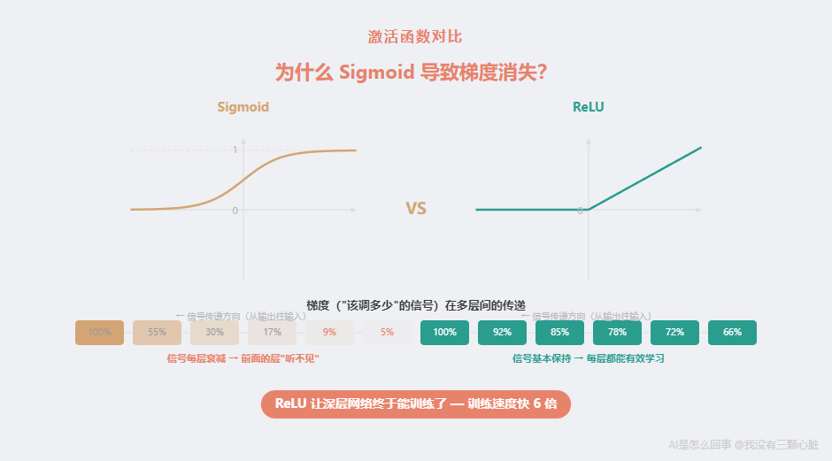

**2. Dropout（随机丢弃）**

第二个问题是”过拟合”——网络可能不是在学规律，而是在死记硬背训练数据。

AlexNet 用了一个叫 **Dropout** 的技巧，是 [Hinton 教授在同一年（2012 年）提出的](https://en.wikipedia.org/wiki/AlexNet)。原理很简单：在训练过程中，每一步都随机”关掉”一部分神经元（比如 50%）。被关掉的神经元不参与计算。

这意味着，每一次训练，网络的结构都不太一样——有些神经元在工作，有些在”休息”。

为什么这能防止死记硬背？因为网络不能依赖某几个特定的神经元来记住答案——那些神经元随时可能被关掉。它必须学到更”通用”的特征，这些特征不依赖于某几个特定的计算路径。

就像考试前，老师每次模拟考都随机不让你用一部分公式——你就不得不真正理解原理，而不是死记公式。

**3. 网络结构本身**

AlexNet 有 8 层——5 层卷积层（就是第一篇讲的”检测器在图片上滑动”）加 3 层全连接层（”汇总投票”做最终判断），共 6000 万个参数。

在当时，这是一个很”大”的网络。1998 年 Yann LeCun 的 LeNet-5（一个开创性的卷积神经网络）只有 [6 万个参数](https://www.understandingai.org/p/why-the-deep-learning-boom-caught)——AlexNet 的参数量是它的 **1000 倍**。

更大的网络能学到更复杂的特征——但也需要更多数据和更强算力。这就是为什么三个要素缺一不可。

# 三要素的”化学反应”
让我把三个要素串起来，你就能看到为什么 2012 年是”突然”变厉害的。

**1990 年代：** 算法有了（神经网络和反向传播早就存在），但数据太少（只有几千张图）、算力太弱（CPU 算不动深层网络）。结果：网络只能做很小的任务，比如识别手写数字。

**2000 年代初：** 算力在进步，但没有 GPU 加速。数据开始增多，但还不够。算法遇到了梯度消失等瓶颈。结果：大多数研究者放弃了神经网络，转向其他方法。神经网络成了李飞飞说的”玻璃橱柜里的老古董”。

**2009-2012 年：**

- **数据**：ImageNet 提供了 120 万张标注图片（比之前的数据集大了几个数量级）

- **算力**：GPU 被发现可以大幅加速神经网络训练（快了约 70 倍）

- **算法**：ReLU 解决了梯度消失，Dropout 解决了过拟合，使更深的网络成为可能

三个要素**同时到位**。

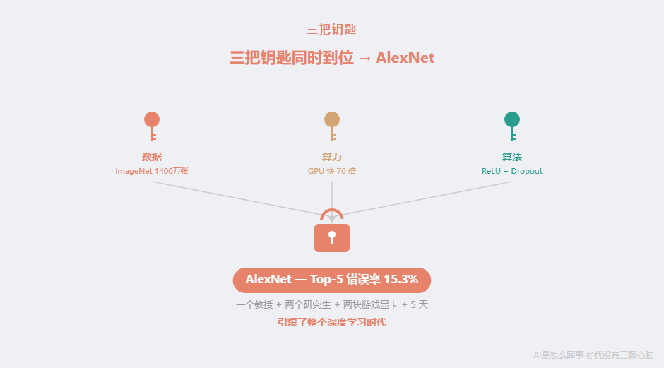

结果：AlexNet。

这就像一把锁需要三把钥匙才能打开。在 2012 年之前，总是缺一两把。2012 年，三把钥匙终于凑齐了。

# 我的个人感受
28.2% → 25.8% → **15.3%**

这不是”更好”。这是”换赛道”。

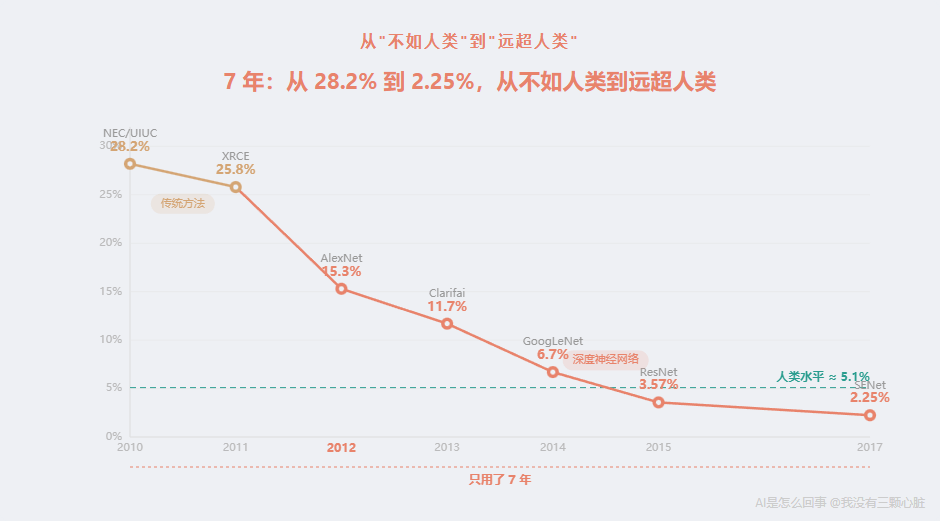

让我真正感到震撼的是后续的发展。AlexNet 打开了一扇门之后，所有人都涌了进去——2013 年 11.7%，2014 年 6.7%，2015 年 3.57%，直到 2017 年 2.25%。

7 年时间，从”比人差得多”到”远超人类”。

而这一切的起点，是一个教授和两个研究生，用两块游戏显卡，在 5 天里训练出来的一个程序。

有时候我会想一个假设：如果李飞飞没有建 ImageNet 呢？如果 GPU 没有被用来训练神经网络呢？如果 Hinton 团队没有参加 2012 年的比赛呢？

AI 的爆发也许会推迟好几年。或者，也许最终还是会发生——因为三个要素各自的发展趋势已经不可逆转。但 2012 年是那个”完美风暴”的时刻，所有条件恰好同时成熟了。

# 一句话回顾
2012 年不是”进步快了一点”，是打开了新世界的大门。

三个要素齐了——**数据**（ImageNet，1400 万张标注图片，49000 名工人花了两年建成）、**算力**（GPU，比 CPU 快 70 倍，两块游戏显卡就够）、**算法**（ReLU、Dropout 等改进，让深层网络终于能训练了）——AI 从此走上了快车道。

从 28%到 2%，从不如人类到超越人类，只用了 7 年。

而引爆这一切的 AlexNet，用的核心方法有一个名字——**神经网络**。

# 下一篇预告
“神经网络”——这可能是 AI 领域听起来最吓人的一个词。

机器有了”神经”？在”思考”？

别慌。下一篇我会带你拆开这个词，你会发现——它其实就是一堆乘法和加法。真的，就这么简单。

# 参考资料

- [ImageNet - Wikipedia](https://en.wikipedia.org/wiki/ImageNet) — ImageNet 数据集包含超过 1400 万张标注图片，涵盖两万多个类别

- [ImageNet Classification with Deep Convolutional Neural Networks - Krizhevsky, Sutskever, Hinton (2012)](https://papers.nips.cc/paper/4824-imagenet-classification-with-deep-convolutional-neural-networks) — AlexNet 论文，8 层网络，6000 万参数，top-5 错误率 15.3%，第二名 26.2%

- [The data that transformed AI research — and possibly the world - Quartz](https://qz.com/1034972/the-data-that-changed-the-direction-of-ai-research-and-possibly-the-world) — ImageNet 的建设过程：49000 名标注工人来自 167 个国家，从 1.6 亿张候选图片中筛选标注

- [Large-scale Deep Unsupervised Learning using Graphics Processors - Raina, Madhavan, Ng (2009)](https://robotics.stanford.edu/~ang/papers/icml09-LargeScaleUnsupervisedDeepLearningGPU.pdf) — GPU 训练神经网络比 CPU 快约 70 倍

- [NVIDIA GeForce GTX 580 - VideoCardz](https://videocardz.com/nvidia/geforce-500/geforce-gtx-580) — GTX 580 显卡，512 个 CUDA 核心，3GB 显存，建议零售价 499 美元

- [AlexNet - Wikipedia](https://en.wikipedia.org/wiki/AlexNet) — AlexNet 架构细节：两块 GTX 580 GPU，训练 90 个轮次，耗时 5-6 天

- [ILSVRC 2012 Results](https://image-net.org/challenges/LSVRC/2012/results.html) — 2012 年 ImageNet 挑战赛完整结果

- [ILSVRC 2015 Results](https://image-net.org/challenges/LSVRC/2015/results) — 2015 年 ResNet 以 3.57%错误率夺冠

- [ILSVRC 2017 Results](https://image-net.org/challenges/LSVRC/2017/results) — 2017 年 SENet 以 2.25%错误率夺冠，为最后一届比赛

- [What I learned from competing against a ConvNet on ImageNet - Andrej Karpathy (2014)](http://karpathy.github.io/2014/09/02/what-i-learned-from-competing-against-a-convnet-on-imagenet/) — Karpathy 亲自测试，人类 top-5 错误率约 5.1%

- [Why the deep learning boom caught almost everyone by surprise - Understanding AI](https://www.understandingai.org/p/why-the-deep-learning-boom-caught) — 李飞飞回忆 2012 年前神经网络被视为”玻璃橱柜里的老古董”；LeNet-5 只有 6 万参数，AlexNet 是其 1000 倍

- [ImageNet: A Pioneering Vision for Computers - History of Data Science](https://www.historyofdatascience.com/imagenet-a-pioneering-vision-for-computers/) — 李飞飞的灵感来自认知科学：人类能识别约 3 万种物体类别

- [Beyond ILSVRC Workshop](https://image-net.org/challenges/beyond_ilsvrc.php) — 2017 年比赛组织者宣布 ImageNet 分类基准已被解决，结束比赛

- [AlexNet: Revolutionizing Deep Learning in Image Classification - viso.ai](https://viso.ai/deep-learning/alexnet/) — ReLU 使 AlexNet 训练速度比传统激活函数快约 6 倍

# 订阅
如果觉得有意思，欢迎关注我，后续文章也会持续更新。同步更新在[个人博客](https://www.wmyskxz.cn/)和[微信公众号](https://weixin.sogou.com/weixin?type=1&s_from=input&query=wmyskxz&ie=utf8&_sug_=n&_sug_type_=&w=01019900&sut=1861&sst0=1612590375262&lkt=8,1612590373961,1612590375161)

微信搜索”我没有三颗心脏”或者扫描二维码，即可订阅。


---

*笔记整理日期：2026-05-18*
