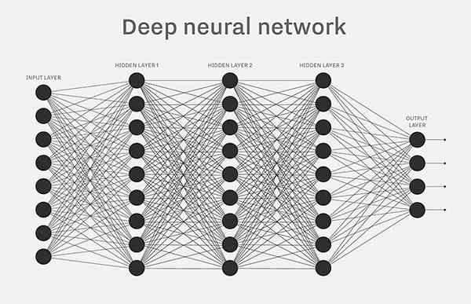
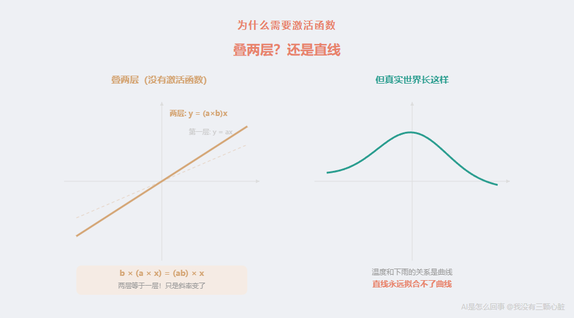
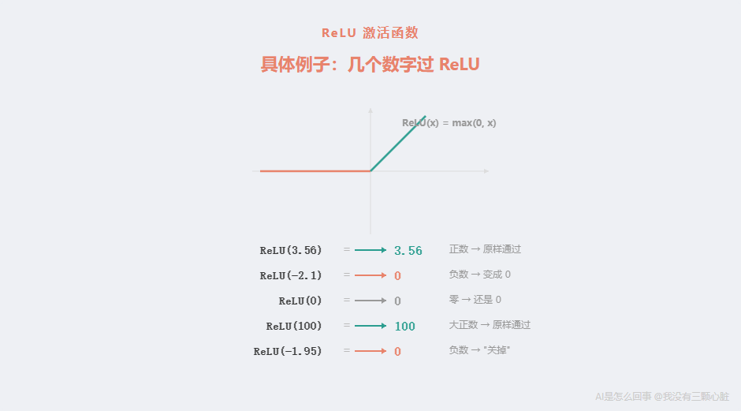
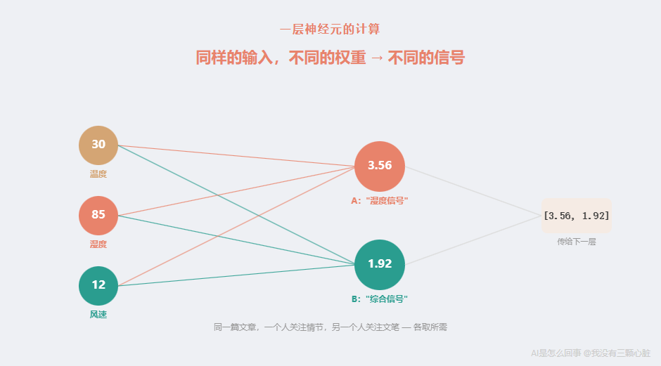
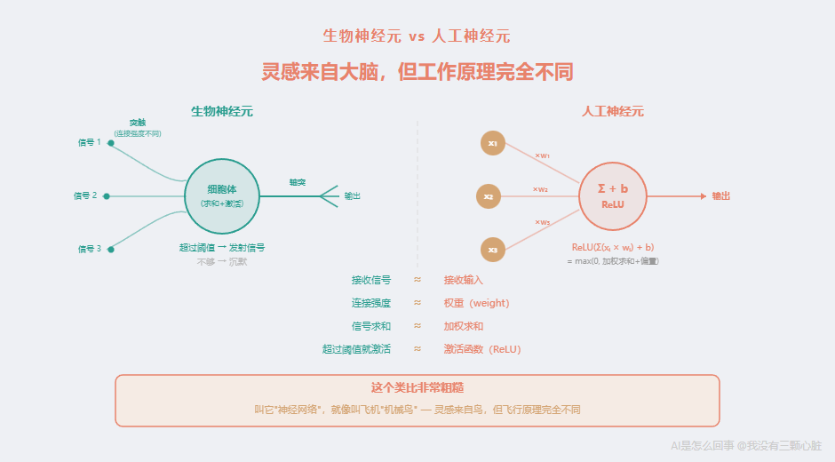
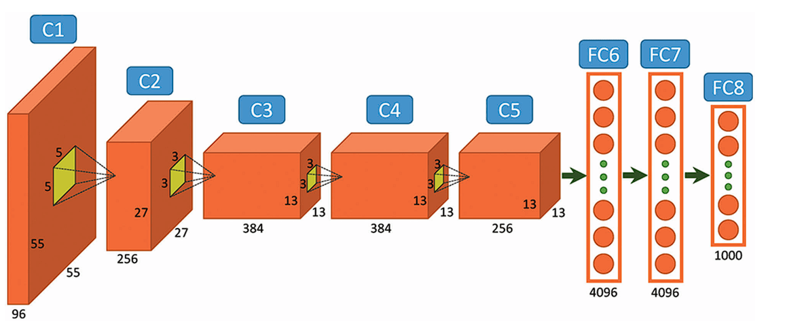
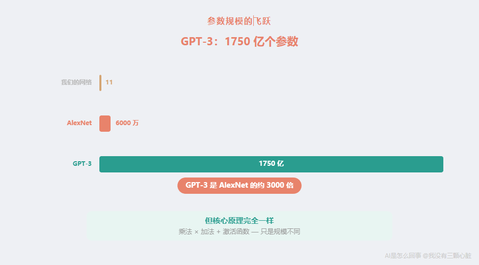

# AI是怎么回事：神经网络到底是什么——6000万个旋钮的真相

> 课程来源：https://wmyskxz.cn/wiki/whats_ai/4/

---

> 这是 **「AI是怎么回事」** 系列的第 `4` 篇。我一直很好奇 AI 到底是怎么工作的，于是花了很长时间去拆这个东西——手机为什么换了发型还能认出你，ChatGPT 回答你的那三秒钟里究竟在算什么，AI 为什么能通过律师考试却会一本正经地撒谎。这个系列就是我的探索笔记，发现了很多有意思的东西，想分享给你。觉得不错的话，欢迎分享+关注。



“神经网络”可能是 AI 领域最吓人的一个词。

听起来像科幻片——机器有了神经？在思考？

别慌。看完这篇你会发现，它就是一堆乘法和加法。真的，就这么简单。

上一篇我们聊了 2012 年 AlexNet 的震撼突破——错误率从 26% 一步跳到 15%，领先第二名超过 10 个百分点。我们提到 AlexNet 有”6000 万个参数”和”神经网络”结构。

但这两个词到底是什么意思？

6000 万个参数——是 6000 万个什么？

神经网络——是什么样的”网络”？

这一篇，我要把这个概念彻底拆开。拆到你能拿计算器跟着算。

# 从一个最简单的问题开始
假设你是一个气象站的工作人员。

你的任务很简单：根据今天的**温度**、**湿度**和**风速**，判断明天会不会下雨。

你有多年的经验。你知道：

- 温度高的时候，不太容易下雨

- 湿度大的时候，更容易下雨

- 风速大的时候，稍微更容易下雨

但这些”经验”很模糊。温度”高”是多高？湿度”大”到什么程度才算”容易下雨”？风速的影响有多大？

你心里其实有一套更精确的判断方式。你可能没意识到，但你做的事情本质上是这样的：

> 把温度、湿度、风速各自乘上一个”重要程度”，加在一起，看总分高不高。

温度对下雨的影响小，你给它一个小的权重。湿度影响大，你给它一个大的权重。风速介于两者之间。

**这就是一个”神经元”做的事情。**

# 一个”神经元”就是一道算术题
让我用具体的数字来演示。

假设今天的气象数据是：

- 温度：30（摄氏度）

- 湿度：85（百分比）

- 风速：12（公里/小时）

一个神经元会对这些数据做四步运算。

**第一步：乘以权重**

每个输入都有一个对应的”权重”（weight）——就是”这个因素有多重要”。

假设经过学习，这个神经元的权重是：

- 温度的权重：-0.02（负数——温度越高，越不容易下雨）

- 湿度的权重：0.08（正数，而且比较大——湿度越高，越容易下雨）

- 风速的权重：0.03（正数，比湿度小——风速有影响，但没那么大）

把每个输入乘以对应的权重：
```
温度的贡献 = 30 × (-0.02) = -0.6
湿度的贡献 = 85 × 0.08   =  6.8
风速的贡献 = 12 × 0.03   =  0.36
```

**第二步：全部加起来**
```
总和 = -0.6+6.8+0.36 = 6.56
```

**第三步：加上偏置**

这里还有一个数字叫**偏置**（bias）。你可以把它理解为”基准线”——在所有输入都为零的时候，这个神经元的默认输出是多少。

为什么需要偏置？想象一下：如果某个地区本身就多雨（比如热带雨林），即使今天温度、湿度、风速都是”平均水平”，下雨的概率也应该比沙漠地区高。偏置就是用来调整这个”底线”的。

假设偏置是 -3.0：
```
加上偏置 = 6.56+ (-3.0) = 3.56
```

到这里为止，就是一道普通的乘法加法题。

**第四步：通过激活函数**

最后一步，3.56 这个数字要通过一个叫”激活函数”的东西。

这是什么？为什么需要它？

别急，这个问题很重要，我要专门用一整节来讲。

# 为什么需要激活函数？
先说结论：**如果没有激活函数，不管你叠多少层神经元，整个网络做的事情本质上都只是一次乘法加法——和一个神经元没有区别。**

这句话可能听起来不太直观。让我解释一下。

假设你有两层神经元，每层只做”乘以权重再相加”的操作。

第一层：输入 x，乘以权重 a，得到 a × x

第二层：拿到 a × x，乘以权重 b，得到 b × (a × x) = (a × b) × x

看到了吗？两层下来，结果还是”输入乘以一个数字”。(a × b) 本身就是一个新的常数。你用两层做的事情，一层就能做到——只要把权重设成 a × b 就行了。

三层？同样的道理。十层？一百层？还是一样。

**纯粹的乘法和加法，不管叠多少层，都只能表达”线性关系”——也就是”输入变大，输出等比例变大（或变小）”这种简单的、直线型的关系。**

但现实世界不是这样的。



温度和下雨的关系不是一条直线。不是”温度每高 1 度，下雨概率就少 2%”这么简单。可能温度在 15-25 度时下雨概率最高，太冷或太热反而不容易下雨。这是一条曲线，不是一条直线。

**激活函数的作用，就是在每一层的计算之后，给结果”掰弯”——把直线变成曲线。**

有了这个”弯曲”，多层叠加才能表达复杂的、弯弯曲曲的关系。没有它，你叠再多层也没用。


所以激活函数虽然名字听起来学术，但它做的事情很直觉：**让神经网络能够处理”非直线”的现实问题。**

# 最常用的激活函数：ReLU
激活函数有很多种。AlexNet 使用的那一种，也是目前最常用的一种，叫 **ReLU**。

ReLU 的全称是 Rectified Linear Unit，翻译过来是”修正线性单元”。名字很吓人，但它做的事情极其简单：

> **如果输入大于 0，就原样输出；如果输入小于等于 0，就输出 0。**

就这样。没了。

用数学写出来是：
```
ReLU(x) = max(0,x)
```

`max(0,x)` 的意思是：0 和 x 比大小，谁大取谁。

几个例子：

- ReLU(3.56) = max(0,3.56) = **3.56**（3.56 大于 0，原样保留）

- ReLU(-2.1) = max(0, -2.1) = **0**（-2.1 小于 0，变成 0）

- ReLU(0) = max(0,0) = **0**

- ReLU(100) = max(0,100) = **100**

你可能会觉得：这也太简单了吧？把负数变成 0，正数不变——这能有什么用？

用处大了。

**ReLU 做的”掰弯”是这样的：在 0 的位置，它把函数”折”了一下。** 左半边（负数区域）被拍平成 0，右半边（正数区域）保持不变。这个”折”的动作，就是从直线到曲线的关键。



你可能还会问：有没有其他的激活函数？有的。在 ReLU 之前，常用的是一个叫 **Sigmoid**（S 形函数）的激活函数，它把任何数字都压缩到 0 到 1 之间，画出来像一个 S 形的曲线。但 Sigmoid 有一个问题：当输入的数字很大或很小的时候，函数的变化非常缓慢（曲线变得几乎平坦），这会让训练过程中的调整信号变得非常微弱，导致深层网络难以学习——这个问题叫”[梯度消失](https://en.wikipedia.org/wiki/Vanishing_gradient_problem)“。AlexNet 在 2012 年改用 ReLU，一个重要原因就是 ReLU 不存在这个问题——[正数区域的变化率始终是 1，调整信号不会衰减](https://proceedings.neurips.cc/paper/2012/file/c399862d3b9d6b76c8436e924a68c45b-Paper.pdf)。这是 AlexNet 能训练 8 层深度网络的关键技术之一。

现在，回到我们的气象神经元。

# 完整的一个神经元
让我把刚才的四步完整写出来：

**输入：**

- 温度 = 30- 湿度 = 85- 风速 = 12

**权重和偏置（这些数字是”学”出来的）：**

- 权重：-0.02,0.08,0.03- 偏置：-3.0

**计算过程：**
```
第一步：乘以权重
  30 × (-0.02) = -0.685 × 0.08    =  6.812 × 0.03    =  0.36

第二步：全部加起来
  -0.6+6.8+0.36 = 6.56

第三步：加上偏置
  6.56+ (-3.0) = 3.56

第四步：通过激活函数（ReLU）
  ReLU(3.56) = max(0,3.56) = 3.56
```

**输出：3.56**

就这样。一个神经元，做完了。

三次乘法，三次加法（加上偏置），一次取最大值。

**拿出你的计算器，跟着算一遍。你刚才亲手完成了一个”人工神经元”的全部计算。**

这个 3.56 的输出意味着什么？如果这是一个用来判断”下不下雨”的模型，3.56 是一个比较高的正数——可以理解为”比较可能下雨”的信号。如果输出是 0（比如湿度很低的情况），则表示”不太可能下雨”。

但一个神经元只能给出一个很粗糙的判断。真实的天气预报远比这复杂——光靠一个乘法加法的公式，怎么可能捕捉天气的复杂变化？

这就是为什么我们需要**很多个**神经元。

# 一层神经元：一个班级同时做题
一个神经元只能从输入中提取一种信号。

比如前面那个神经元，它学到的是”湿度高 → 输出大”这个规律。但天气还有很多其他规律：

- “温度和湿度同时高 → 容易有雷阵雨”

- “风速突然变大 → 可能有冷锋过境”

- “温度骤降 + 湿度上升 → 可能有降雨”

每一种规律，都需要一个神经元来捕捉。

**解决方法很简单：用多个神经元。**

想象一间教室，同一组数据（温度 30、湿度 85、风速 12）写在黑板上，30 个学生同时看着黑板做题——但每个学生的计算方式不一样（权重和偏置不同），所以每个人会得出不同的答案。

这 30 个学生就是 30 个神经元，它们组成”一层”。

让我用 2 个神经元来演示。

**神经元 A**（可能学到的是”湿度主导”的规律）：

- 权重：-0.02,0.08,0.03- 偏置：-3.0

**神经元 B**（可能学到的是”温度和风速的综合效应”）：

- 权重：0.05,0.02,0.06- 偏置：-2.0

同样的输入（温度 30, 湿度 85, 风速 12），两个神经元的计算：
```
神经元 A：
  30×(-0.02) +85×0.08+12×0.03+ (-3.0)
  = -0.6+6.8+0.36+ (-3.0)
  = 3.56
  ReLU(3.56) = 3.56

神经元 B：
  30×0.05+85×0.02+12×0.06+ (-2.0)
  = 1.5+1.7+0.72+ (-2.0)
  = 1.92
  ReLU(1.92) = 1.92
```

**这一层的输出是两个数字：[3.56,1.92]。**



注意一件很重要的事：**两个神经元的输入完全相同，但因为权重和偏置不同，它们提取了不同的信号。** 这就好比同一篇文章，一个人关注情节，另一个人关注文笔——看的是同一个东西，但各自注意到了不同的方面。

在实际的神经网络中，一层通常有几十、几百、甚至几千个神经元。AlexNet 的第一个全连接层有 [4096 个神经元](https://en.wikipedia.org/wiki/AlexNet)——相当于 4096 个学生同时做题，每个人从输入中提取一种不同的信号。

# 多层叠加：流水线
到目前为止，我们有 3 个输入、1 层（2 个神经元）、输出 2 个数字。

但真正的力量来自**叠加多层**。

上一层的输出，变成下一层的输入。

就像工厂的流水线：

- 第一站：原材料进来，加工成半成品

- 第二站：半成品进来，进一步加工

- 第三站：再加工

- 最后一站：成品出来

每一站（每一层）都在上一站的基础上做进一步的处理。

让我在前面那个例子上再加一层：一个神经元，接收上一层的 2 个输出（3.56 和 1.92），给出最终判断。

**输出层神经元 C：**

- 权重：0.4,0.6- 偏置：-2.5
```
第二层（输出层）：
  输入：[3.56,1.92]（来自上一层）

  3.56 × 0.4+1.92 × 0.6+ (-2.5)
  = 1.424+1.152+ (-2.5)
  = 0.076

  ReLU(0.076) = 0.076
```

**最输出：0.076**

这个数字很小，接近 0——可以解读为”可能性不高”。如果这个模型是用来预测下雨概率的，0.076 表示”不太会下雨”。

等一下——前面神经元 A 给出了 3.56（”湿度很高，可能下雨”），但最终结果却是 0.076（”不太会下雨”）？

这就是多层网络有趣的地方。**输出层的神经元 C 学到了一个更精细的判断：虽然湿度信号（3.56）很强，但温度和风速的综合信号（1.92）不够高——它”综合考虑”了多个因素后，给出了一个不同的判断。**

这就像专家组讨论：每个专家发表意见，最后由一个负责人综合所有意见做出决策。负责人可能会推翻某个专家的强烈建议，因为他看到了其他专家提供的相反证据。

**层数越多，网络能做出的判断就越精细。** 第一层提取简单信号，第二层组合这些信号，第三层再组合，层层递进——就像第一篇里讲的”像素 → 边缘 → 形状 → 部件 → 整体”。

# 一个完整的小型网络：你来算
现在让我把前面的所有计算整理成一个完整的网络。这是一个 2 层网络：3 个输入，第一层 2 个神经元，第二层 1 个神经元。

我把所有数字都列出来，你也可以拿计算器跟着验算。

**网络结构：**
```
输入层（3 个输入）
  ↓
第一层（2 个神经元：A 和 B）
  ↓
第二层/输出层（1 个神经元：C）
  ↓
输出（1 个数字）
```

**所有的权重和偏置：**

| 参数 | 数值 |
| --- | --- |
| A 的权重 | -0.02,0.08,0.03 |
| A 的偏置 | -3.0 |
| B 的权重 | 0.05,0.02,0.06 |
| B 的偏置 | -2.0 |
| C 的权重 | 0.4,0.6 |
| C 的偏置 | -2.5 |

数一数：权重有 3+3+2 = 8 个，偏置有 3 个，总共 **11 个参数**。

这就是这个小网络的全部。11 个数字，决定了它的一切行为。

**输入：** 温度 = 30，湿度 = 85，风速 = 12

**逐步计算：**
```
═══════════════════════════════════════
第一层
═══════════════════════════════════════

神经元 A：
  加权求和 = 30×(-0.02) +85×0.08+12×0.03
           = -0.6+6.8+0.36
           = 6.56
  加偏置   = 6.56+ (-3.0) = 3.56
  激活     = ReLU(3.56) = 3.56  ✓

神经元 B：
  加权求和 = 30×0.05+85×0.02+12×0.06
           = 1.5+1.7+0.72
           = 3.92
  加偏置   = 3.92+ (-2.0) = 1.92
  激活     = ReLU(1.92) = 1.92  ✓

第一层输出 → [3.56,1.92]

═══════════════════════════════════════
第二层（输出层）
═══════════════════════════════════════

神经元 C：
  加权求和 = 3.56×0.4+1.92×0.6
           = 1.424+1.152
           = 2.576
  加偏置   = 2.576+ (-2.5) = 0.076
  激活     = ReLU(0.076) = 0.076  ✓

═══════════════════════════════════════
最终输出 = 0.076
═══════════════════════════════════════
```

**你刚才看到的，就是一个神经网络的完整工作过程。**

从头到尾，只有乘法、加法、和一次”负数变 0”的操作。没有任何神秘的东西。


你可以试着换一组输入来验证：

**换一组数据：** 温度 = 15，湿度 = 95，风速 = 20
```
神经元 A：
  15×(-0.02) +95×0.08+20×0.03+ (-3.0)
  = -0.3+7.6+0.6+ (-3.0)
  = 4.9
  ReLU(4.9) = 4.9

神经元 B：
  15×0.05+95×0.02+20×0.06+ (-2.0)
  = 0.75+1.9+1.2+ (-2.0)
  = 1.85
  ReLU(1.85) = 1.85

神经元 C：
  4.9×0.4+1.85×0.6+ (-2.5)
  = 1.96+1.11+ (-2.5)
  = 0.57
  ReLU(0.57) = 0.57
```

输出从 0.076 变成了 0.57——高了很多。低温、高湿、大风的组合，模型判断更可能下雨。直觉上说得通。

你再试一组：温度 = 35，湿度 = 20，风速 = 5（高温、低湿、小风——典型的晴天）。
```
神经元 A：
  35×(-0.02) +20×0.08+5×0.03+ (-3.0)
  = -0.7+1.6+0.15+ (-3.0)
  = -1.95
  ReLU(-1.95) = 0        ← 注意！负数被 ReLU 变成了 0

神经元 B：
  35×0.05+20×0.02+5×0.06+ (-2.0)
  = 1.75+0.4+0.3+ (-2.0)
  = 0.45
  ReLU(0.45) = 0.45

神经元 C：
  0×0.4+0.45×0.6+ (-2.5)
  = 0+0.27+ (-2.5)
  = -2.23
  ReLU(-2.23) = 0         ← 又被 ReLU 变成了 0
```

输出是 0——完全不可能下雨。

注意这个例子里 ReLU 发挥的作用：神经元 A 的计算结果是 -1.95，被 ReLU “关掉”了（输出 0），等于说”湿度信号不够强，这个神经元就不发言了”。最终结果也被 ReLU 拍成了 0。**ReLU 就像一个门：信号够强就通过，不够强就关掉。** 这种”要么激活、要么沉默”的特性，正是它能让网络表达复杂关系的原因。

# 这些数字从哪里来？
你可能已经注意到了：整个网络的行为完全取决于那 11 个参数的值。

权重 -0.02 如果变成 +0.02，意思就从”温度越高越不容易下雨”变成了”温度越高越容易下雨”——判断完全反过来。

偏置 -3.0 如果变成 -1.0，那神经元会更容易被激活，更倾向于输出正数。

**这些数字是怎么确定的？**

答案是：不是人选的，是从数据里”学”出来的。

具体怎么学？简单来说：

- 一开始，所有权重和偏置都是**随机数**（比如 0.01, -0.03,0.05 这样的小随机数）

- 用这些随机参数算一遍，得出一个结果

- 把结果和正确答案对比，算出”错了多少”

- 根据”错了多少”，微调每个参数——让结果离正确答案更近一点

- 重复几百万次

这个过程叫”训练”，用到的方法叫”反向传播”。下一篇我会完整拆解这个过程。

现在你只需要知道一件事：**那些看起来精心设计的数字（-0.02,0.08,0.03…），不是人选的，而是电脑通过反复试错，自己”调”出来的。**

# 为什么叫”神经”网络？
说到这里，你可能一直在疑惑：这就是一堆乘法和加法，为什么叫”神经网络”？跟神经有什么关系？

这个名字来自对生物神经元的类比。


1943 年，神经科学家 Warren McCulloch 和数学家 Walter Pitts 发表了一篇论文《[A Logical Calculus of the Ideas Immanent in Nervous Activity](https://en.wikipedia.org/wiki/Artificial_neuron)》，第一次尝试用数学描述生物神经元的工作方式。

他们观察到，一个生物神经元大致做这么几件事：

- **接收信号**：从其他神经元通过”突触”接收电信号

- **加权求和**：不同的连接有不同的强度（有些连接强，有些弱）

- **决定是否激活**：如果收到的信号总量超过一个阈值，就”发射”一个信号给下一个神经元；如果不够，就保持沉默

这和我们前面算的那个过程确实有点像：

- 接收输入 → 生物神经元接收信号

- 乘以权重 → 连接强度不同

- 加起来看总量 → 信号求和

- 通过激活函数决定输出 → 超过阈值就激活

**但我必须说清楚一件事：这个类比非常粗糙，几乎可以说是误导性的。**



人脑有大约 [860 亿个神经元](https://pubmed.ncbi.nlm.nih.gov/19226510/)，每个神经元平均与 7000 个其他神经元相连。生物神经元的工作方式远比”乘法加法”复杂得多——它们涉及化学信号传递、时序编码、可塑性变化、甚至还有我们尚未完全理解的机制。

人工神经元只借用了最表面的那层类比：接收、加权、激活。仅此而已。

说实话，”神经网络”这个名字在今天看来有点”过度营销”了。一个更准确的名字可能是”多层参数化函数”或者”可训练的分层计算器”——但你可以想象，这样的名字不可能火起来。

研究者 Michael Jordan（不是篮球明星，是机器学习领域的大牛）曾经说过，如果这个领域重新命名，[他宁愿叫它”统计计算”而不是”人工智能”](https://spectrum.ieee.org/stop-calling-everything-ai-machinelearning-pioneer-says)——因为”人工智能”这个词让人们产生了太多不切实际的幻想。

**所以请记住：神经网络不是”人工大脑”。它是一种受大脑启发、但和大脑的实际工作方式几乎完全不同的数学计算结构。**

叫它”神经网络”，就像叫飞机”机械鸟”——灵感确实来自鸟，但飞行原理完全不同。

# AlexNet：6000 万个旋钮
现在回到上一篇提到的 AlexNet。

我们前面那个小例子有 3 个输入、2 个隐藏神经元、1 个输出，总共 11 个参数。

AlexNet 有多大？

根据 [2012 年的原始论文](https://papers.nips.cc/paper/4824-imagenet-classification-with-deep-convolutional-neural-networks)，AlexNet 的结构是：



| 层 | 类型 | 说明 |
| --- | --- | --- |
| 第 1 层 | 卷积层 | 96 个检测器，每个 11×11 |
| 第 2 层 | 卷积层 | 256 个检测器，每个 5×5 |
| 第 3 层 | 卷积层 | 384 个检测器，每个 3×3 |
| 第 4 层 | 卷积层 | 384 个检测器，每个 3×3 |
| 第 5 层 | 卷积层 | 256 个检测器，每个 3×3 |
| 第 6 层 | 全连接层 | 4096 个神经元 |
| 第 7 层 | 全连接层 | 4096 个神经元 |
| 第 8 层 | 全连接层（输出层） | 1000 个神经元（对应 1000 个分类） |

前 5 层是**卷积层**——就是第一篇讲的那种”检测器在图片上滑动”的操作。第 1 层有 96 个不同的检测器，每个检测器是 11×11 = 121 个数字。这些数字不是 Sobel 算子那样人类设计的，而是从数据中学出来的。有的学成了边缘检测器，有的学成了颜色检测器，有的学成了纹理检测器。

后 3 层是**全连接层**——就是我们前面演示的那种”每个神经元接收上一层所有输出”的结构。第 6 层有 4096 个神经元，每个都接收第 5 层的全部输出。

最后一层有 1000 个神经元——对应 ImageNet 数据集的 1000 个分类（如”猫”、”狗”、”汽车”、”钢琴”等）。哪个神经元的输出最大，就代表网络认为图片属于哪个类别。

**整个网络总共有大约 6000 万个参数。**

6000 万是什么概念？

让我帮你建立一个直觉：

- 如果你每秒钟手动调一个参数（从计算器上抄一个数字），不吃不喝不睡，需要大约 **694 天**——差不多两年

- 如果把这些参数按顺序排列打印在纸上，每个数字占 1 厘米，总长度大约 **600 公里**——从北京到上海的直线距离

- 我们前面那个 11 参数的小网络，相对于 AlexNet 的 6000 万参数，就像一粒沙子相对于一片沙滩

**而今天的大型语言模型，参数量更是惊人。** GPT-3 有 [1750 亿个参数](https://arxiv.org/abs/2005.14165)——是 AlexNet 的将近 3000 倍。但核心原理和我们前面算的那 11 个参数的小网络完全一样：**乘法、加法、激活函数。**



# 学到这里，我的一个感受
学到这里，我有一个强烈的感受。

之前看到”人工智能”四个字，我脑海里浮现的是某种神秘的、接近意识的东西。看到”神经网络”，我会不自觉地联想到大脑、思维、甚至灵魂。

但当我亲手算完一个神经元的计算过程——30 × (-0.02) = -0.6,85 × 0.08 = 6.8, 加起来, 和 0 比大小——所有的神秘感都消失了。

**所谓”人工智能”，本质就是一大堆精心安排的乘法和加法。没有魔法，没有意识，只有数字。**

但这恰恰是最令人惊叹的部分——如此简单的操作，通过大规模的叠加和精巧的调整，竟然能做出”认出人脸””理解语言”这样复杂的事情。

但惊叹归惊叹，清醒也很重要：**它不是在”思考”。它是在算数。**

# 一句话回顾
神经网络不是”大脑模仿”，是一堆精心设计的数字运算——乘法、加法，仅此而已。

一个神经元 = 输入 × 权重 + 偏置 → 激活函数 → 输出。

一层 = 很多神经元并行处理。

多层 = 上一层的输出是下一层的输入。

所有的”智能”都藏在那些参数里——而那些参数，是从数据中”学”出来的。

# 下一篇预告
神经网络的结构我们知道了。

但有一个关键问题我们还没回答：

那 6000 万个参数，一开始都是随机数。它们是怎么被一步步调到”刚好能认出猫”的？

**这个”调”的过程，就是所谓的”训练”。**

想象你面前有 6000 万个旋钮。每个旋钮可以从 -10 转到 +10。你的任务是调整这些旋钮，让一台机器能认出猫和狗的区别。没有说明书。唯一的反馈是：每次调完，机器告诉你”猜对了”或”猜错了”。

这听起来几乎不可能，但有人找到了方法。

下一篇，我们来拆解”训练”。

# 参考资料

- [ImageNet Classification with Deep Convolutional Neural Networks - Krizhevsky, Sutskever, Hinton (2012)](https://papers.nips.cc/paper/4824-imagenet-classification-with-deep-convolutional-neural-networks) — AlexNet 论文原文，8 层网络，约 6000 万参数，top-5 错误率 15.3%

- [AlexNet - Wikipedia](https://en.wikipedia.org/wiki/AlexNet) — AlexNet 架构细节，包含卷积层和全连接层参数

- [A Logical Calculus of the Ideas Immanent in Nervous Activity - McCulloch & Pitts (1943)](https://en.wikipedia.org/wiki/Artificial_neuron) — 第一个人工神经元的数学模型，”神经网络”名称的起源

- [Vanishing gradient problem - Wikipedia](https://en.wikipedia.org/wiki/Vanishing_gradient_problem) — 梯度消失问题的解释，以及为什么 ReLU 有助于缓解该问题

- [Equal numbers of neuronal and nonneuronal cells make the human brain - Azevedo et al. (2009)](https://pubmed.ncbi.nlm.nih.gov/19226510/) — 人脑约有 860 亿个神经元

- [Language Models are Few-Shot Learners - Brown et al. (2020)](https://arxiv.org/abs/2005.14165) — GPT-3 论文，1750 亿参数

- [Stop Calling Everything AI - IEEE Spectrum](https://spectrum.ieee.org/stop-calling-everything-ai-machinelearning-pioneer-says) — Michael Jordan 关于”人工智能”一词被过度使用的观点

- [Deep Learning (Adaptive Computation and Machine Learning) - Goodfellow, Bengio, Courville (2016)](https://www.deeplearningbook.org/) — 深度学习经典教材，第 6 章详细讲解了前馈神经网络、激活函数和网络结构

# 订阅
如果觉得有意思，欢迎关注我，后续文章也会持续更新。同步更新在[个人博客](https://www.wmyskxz.cn/)和[微信公众号](https://weixin.sogou.com/weixin?type=1&s_from=input&query=wmyskxz&ie=utf8&_sug_=n&_sug_type_=&w=01019900&sut=1861&sst0=1612590375262&lkt=8,1612590373961,1612590375161)

微信搜索”我没有三颗心脏”或者扫描二维码，即可订阅。


---

*笔记整理日期：2026-05-18*
