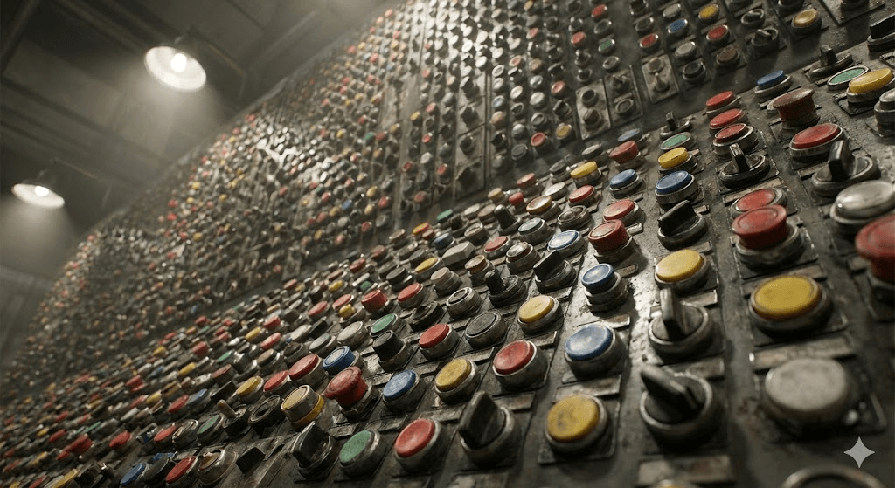
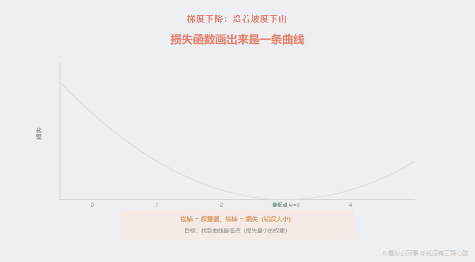
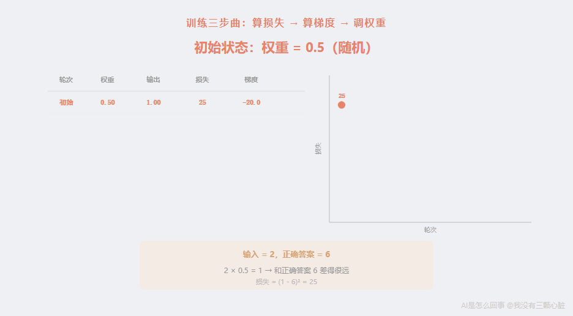
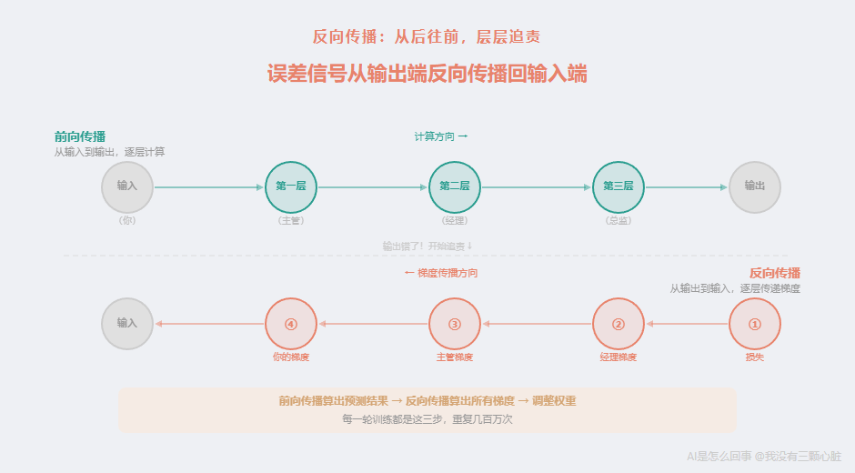
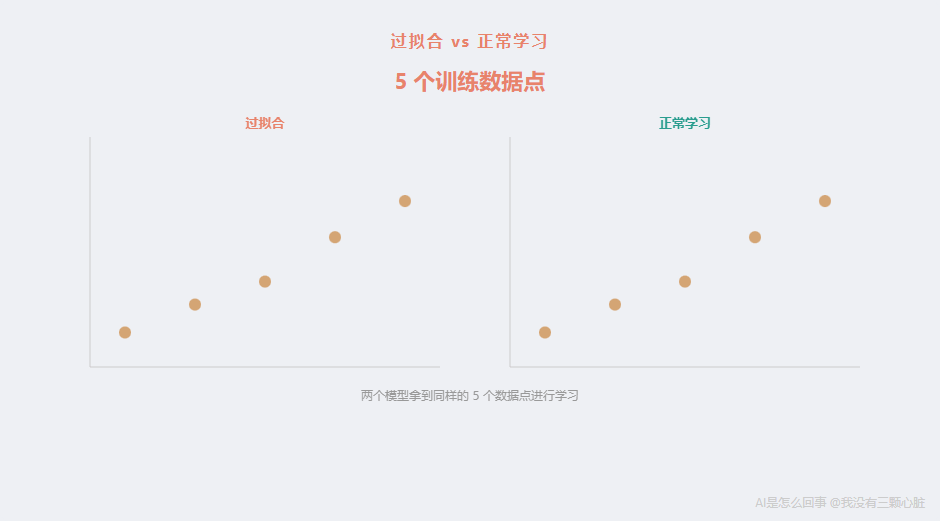
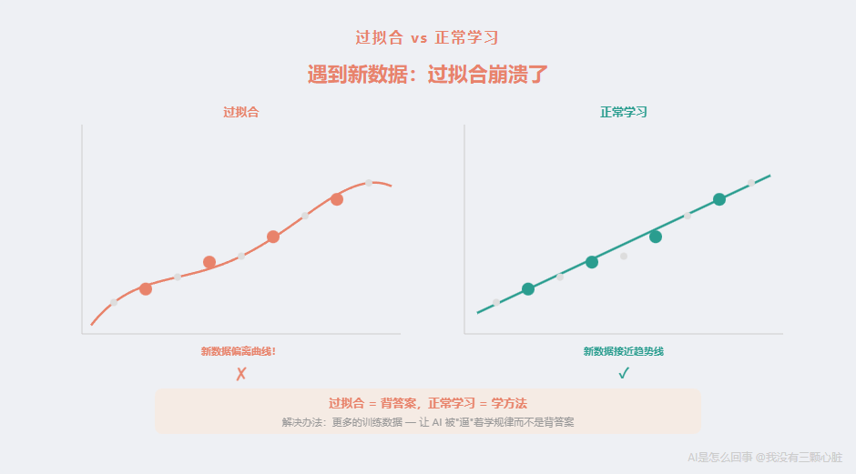
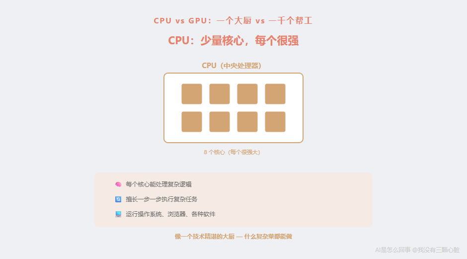
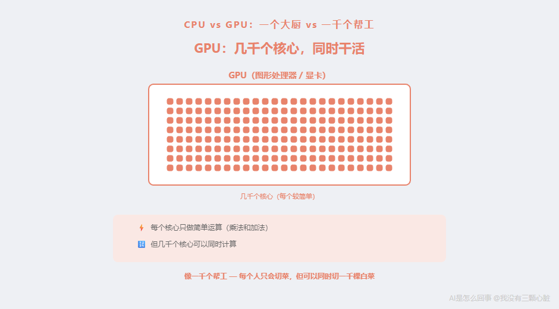
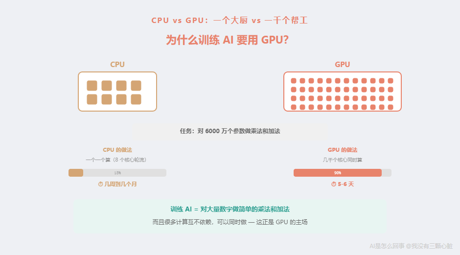

# AI是怎么回事：AI是怎么学会的——从做错一道题说起

> 课程来源：https://wmyskxz.cn/wiki/whats_ai/5/

---

> 这是 **「AI是怎么回事」** 系列的第 `5` 篇。我一直很好奇 AI 到底是怎么工作的，于是花了很长时间去拆这个东西——手机为什么换了发型还能认出你，ChatGPT 回答你的那三秒钟里究竟在算什么，AI 为什么能通过律师考试却会一本正经地撒谎。这个系列就是我的探索笔记，发现了很多有意思的东西，想分享给你。觉得不错的话，欢迎分享+关注。



想象你面前有 6000 万个旋钮。

每个旋钮可以从 -10 转到 +10。你的任务是：调整这些旋钮，让一台机器能认出猫和狗的区别。

没有说明书。唯一的反馈是：每次调完，机器告诉你”这次猜对了”或”这次猜错了”。

你会怎么做？

随便拧一个旋钮，看看结果变好了还是变坏了？这倒是个思路——但 6000 万个旋钮，每个都这样试一遍，你大概需要几辈子。

可 AI 真的做到了。而且不是用几辈子，是用几天。

**它是怎么做到的？**

这就是这篇文章要回答的问题。

# 前情回顾
在上一篇文章里，我们搞清楚了”神经网络”到底是什么——一堆乘法和加法，仅此而已。

具体来说：每一个”神经元”做的事情就是把输入数字乘以对应的权重，全部加起来，再加上一个偏置，最后通过一个叫”激活函数”的东西（就是一个简单的数学变换，决定要不要把这个结果传递下去），得到一个输出。

2012 年震惊世界的 AlexNet 有 6000 万个这样的可调整数字——我们叫它们**参数**（也就是那些”旋钮”）。

但我们留下了一个核心问题没回答：**这 6000 万个数字，是怎么被调到”正确”的位置的？**

一开始，这些数字全是随机的。随机的数字，意味着随机的输出——给它看一张猫的照片，它可能说”这是飞机”。

从”一塌糊涂”到”认得出猫和狗”，中间发生了什么？

答案分三个部分：

- **怎么调**——一套叫”反向传播”的数学方法

- **拿什么调**——海量的数据

- **用什么算**——GPU（图形处理器）

这三件事本质上是一件事的三个面。把它们分开讲反而会割裂理解——就像”怎么做饭”这个问题，你需要同时知道”怎么炒”（方法）、”炒什么”（食材）、”用什么炒”（锅），少了任何一个都没法开始。

让我们从”怎么调”开始。

# Part1：怎么”调旋钮”

## 先做一道简单的题
在讲复杂的东西之前，让我用一个极简的例子来演示整个过程。

假设我们有一个世界上最简单的”神经网络”——简单到只有一个神经元，一个输入，一个输出。

这个神经元做的事情是：
```
输出 = 输入 × 权重
```

就这一行。没有偏置，没有激活函数，甚至不是一个真正有用的网络——但它足够帮我们理解”训练”到底在做什么。

现在，假设我们想让这个神经元学会一个简单的规律：**输入是 2 的时候，输出应该是 6。**

也就是说，我们希望权重 = 3（因为 2 × 3 = 6）。但电脑不知道答案是 3。

一开始，权重是随机的。假设随机到了 **0.5**。

让我们看看会发生什么：
```
输入 = 2
权重 = 0.5（随机初始值）
输出 = 2 × 0.5 = 1
正确答案 = 6
```

输出是 1，但应该是 6。**错了。**

## 第一步：量化”错了多少”——损失函数
“错了”是一个笼统的说法。电脑需要一个精确的数字来衡量”错了多少”。

这个衡量错误大小的东西，叫**损失函数**（Loss Function）。

“损失”这个词你可以理解为”损失了多少分”——就像考试，满分和你的得分之间的差距。损失越大，说明答案越离谱；损失越小，说明越接近正确答案；损失等于 0，说明完全正确。

最简单的损失函数就是：**把”预测值”和”正确答案”的差距算出来，再平方。**

为什么要平方？两个原因：第一，不管你是猜高了还是猜低了，平方之后都是正数，方便比较；第二，猜得越离谱，平方之后的数字增长得越快，惩罚越大。

让我们算一下：
```
预测值 = 1
正确答案 = 6
差距 = 1-6 = -5
损失 = (-5)² = 25
```

损失是 25。这个数字本身不重要，重要的是：**它给了电脑一个明确的”分数”——你现在有多差。**

训练的目标，就是想办法让这个损失**尽可能小**。最好是 0。

## 第二步：知道该往哪个方向调——梯度
现在电脑知道自己错了，损失是 25。

下一个问题：**权重应该往大了调还是往小了调？**

这里有一个精巧的数学工具叫**梯度**（Gradient）。

先别被这个词吓到——让我用一个非常直观的类比来解释。

**想象你蒙着眼睛站在一座山上，你的目标是走到最低点。**

你看不见地形。唯一能做的，是用脚感受一下当前位置的坡度——左脚低还是右脚低？

如果左脚低，说明左边是下坡——你就往左迈一步。
如果右脚低，说明右边是下坡——你就往右迈一步。

每一步都往最陡的下坡方向走。一步一步，你就能慢慢走到谷底。



**在训练神经网络的时候，”山”就是损失函数画出来的曲线，”你所在的位置”就是当前的权重值，”走到最低点”就是找到让损失最小的权重。**

而梯度，就是在当前位置”坡有多陡、往哪边是下坡”这个信息。

好，让我们回到具体的数字，把梯度算出来。

我们的损失函数是：
```
损失 = (预测值 - 正确答案)²
     = (输入 × 权重 - 正确答案)²
     = (2 × 权重 -6)²
```

梯度就是：”如果权重稍微变大一点点，损失会变大还是变小？变化的速度是多少？”

如果你学过微积分，这就是对权重求导数。如果没学过也完全没关系——我直接把结果算给你看，你只需要理解它的含义。

梯度的计算结果是：
```
梯度 = 2 × (预测值 - 正确答案) × 输入
     = 2 × (1-6) × 2
     = 2 × (-5) × 2
     = -20
```

梯度是 **-20**。

这个 -20 告诉我们两件事：

- **符号是负的**——说明”当前位置往右是下坡”，也就是说权重应该**增大**（往右走），损失才会减小

- **绝对值是 20**——说明坡很陡，离最低点还很远，需要调整的幅度比较大

## 第三步：调整权重——梯度下降
知道了方向和坡度，接下来就是实际调整。

调整的规则非常简单：
```
新权重 = 旧权重 - 学习率 × 梯度
```

这里出现了一个新概念：**学习率**（Learning Rate）。

学习率就是”每一步迈多大”。它是一个很小的数，通常是 0.001 或 0.01 这个量级。

为什么不能一步迈太大？回到蒙着眼睛下山的类比——如果你每一步迈 10 米，很可能一脚迈过了最低点，跑到对面的山坡上去了。步子小一点，虽然慢，但更稳当。

我们取学习率 = 0.1（为了让例子好算，比实际大一些），来算一下：
```
新权重 = 0.5-0.1 × (-20)
       = 0.5+2
       = 2.5
```

权重从 0.5 变成了 **2.5**。

来验证一下，用新权重算一次：
```
输出 = 2 × 2.5 = 5
正确答案 = 6
损失 = (5-6)² = 1
```

损失从 25 降到了 **1**。好了很多！

但还不够好。再来一轮。
```
梯度 = 2 × (5-6) × 2 = 2 × (-1) × 2 = -4

新权重 = 2.5-0.1 × (-4)
       = 2.5+0.4
       = 2.9
```

验证：
```
输出 = 2 × 2.9 = 5.8
损失 = (5.8-6)² = 0.04
```

损失从 1 降到了 **0.04**。已经很接近正确答案了。

再来一轮：
```
梯度 = 2 × (5.8-6) × 2 = 2 × (-0.2) × 2 = -0.8

新权重 = 2.9-0.1 × (-0.8)
       = 2.9+0.08
       = 2.98
```

验证：
```
输出 = 2 × 2.98 = 5.96
损失 = (5.96-6)² = 0.0016
```

三轮调整之后，权重从 **0.5 → 2.5 → 2.9 → 2.98**，越来越接近正确答案 **3**。损失从 **25 → 1 → 0.04 → 0.0016**，越来越接近 **0**。



**这就是训练的全部过程。** 每一轮都做三件事：

- **算一下错了多少**（损失函数）

- **算一下该往哪调**（梯度）

- **调一点点**（梯度下降）

然后重复、重复、再重复。

这个”算梯度→调权重→再算梯度→再调权重”的方法，叫做**梯度下降**（Gradient Descent）。”梯度”是坡度，”下降”是往低处走——合起来就是”沿着最陡的方向下山”。

## 从一个权重到 6000 万个权重
你可能会说：”这才一个权重，AlexNet 有 6000 万个啊！”

没错。但原理完全一样——每一个权重都用同样的方法：算梯度，调一点。

区别在于：当有 6000 万个权重时，这座”山”不再是一条简单的曲线了——它变成了一个 6000 万维的空间里的超级复杂地形。人类无法想象 6000 万维空间长什么样，但数学可以。梯度在任意维度上的计算方法都是一样的：每个权重都有自己的”坡度方向”，每个权重都按照自己的坡度调一点。

这就引出了一个关键的问题：**在一个真正的神经网络里，有很多层。最后一层的错误，怎么传递给前面的层？**

## 反向传播：从后往前，层层追责
让我再解释一下这个问题为什么重要。

在第四篇我们讲过，神经网络是一层叠一层的结构：
```
输入 → 第一层 → 第二层 → 第三层 → ... → 输出
```

当最终输出是错的，我们能直接算出”最后一层的权重该怎么调”——因为最后一层直接产生了输出，输出和正确答案之间的差距就是损失。

但第一层呢？第一层的输出不直接变成最终答案——它传给第二层，第二层传给第三层，层层传递之后才变成最终输出。第一层的权重要是错了，那个错误会被后面每一层放大或缩小，等到最终输出的时候，已经面目全非了。

**怎么知道第一层的某个权重对最终的错误有多大”贡献”？**

答案就是**反向传播**（Backpropagation，全称 Back-propagation of errors，”误差的反向传播”）。

这个方法的核心思想是 [1986 年由 David Rumelhart、Geoffrey Hinton 和 Ronald Williams 发表在《Nature》上的一篇论文](https://www.nature.com/articles/323533a0)中系统阐述的。Hinton 就是后来被称为”深度学习之父”的那位——AlexNet 正是他的学生做出来的。

反向传播的原理用一句话就能说清：**从输出层开始，逐层往回算，利用”链式法则”把每一层的梯度传递回前一层。**

“链式法则”是微积分里的一个基本规则。不懂微积分也没关系，它的意思很直觉：

> 如果 A 影响了 B，B 影响了 C，那么 A 对 C 的影响 = A 对 B 的影响 × B 对 C 的影响。

打个比方。你在公司里是一个基层员工（第一层）。你做的方案交给你的主管（第二层），主管交给经理（第三层），经理交给总监（最后一层），总监做了最终决策。

最终决策出了问题。怎么追责？

反向传播的做法是：

- **先看总监**（最后一层）：最终决策错了，总监的判断偏差有多大？→ 算出总监的梯度

- **再看经理**（倒数第二层）：总监的偏差中，有多少是经理传上来的信息导致的？→ 用链式法则，经理的梯度 = 总监的梯度 × 经理对总监的影响

- **再看主管**（倒数第三层）：经理的偏差中，有多少是主管的信息导致的？→ 主管的梯度 = 经理的梯度 × 主管对经理的影响

- **最后看你**（第一层）：主管的偏差中，有多少是你的方案导致的？→ 你的梯度 = 主管的梯度 × 你对主管的影响

**从最后一层开始，一层一层往回算，每一层都知道自己”该调多少”。** 这就是”反向传播”——误差信号从输出端反向传播回输入端。



而”前向”的过程——从输入经过每一层计算到输出——叫做**前向传播**（Forward Propagation）。训练的每一轮，都是先做一次前向传播算出预测结果，再做一次反向传播算出所有梯度，然后调整权重。

## 为什么叫”批改作业”
到这里，让我把整个训练过程串一遍。用”批改作业”的类比，可能更容易记住：

- **做题**（前向传播）：给 AI 看一张猫的照片，它经过层层计算，输出”我觉得这是狗”

- **对答案**（计算损失）：正确答案是”猫”，它说”狗”——损失很大

- **找出哪里错了**（反向传播）：从最后一层往回追溯，算出每一个权重对这个错误的贡献

- **改错**（梯度下降）：按照每个权重的梯度，微调每一个参数

- **做下一道题**：换一张照片，重复上面的过程

**几百万张照片，每张都这样”做题→批改→改错”一遍。** 经过足够多轮，那 6000 万个原本随机的数字就会逐渐稳定在一个”很少出错”的状态。

这就是所谓的”训练”。

没有魔法。没有顿悟。没有”灵光一闪”。只有一遍又一遍地算梯度、调权重。

# Part2：为什么需要海量数据

## 只做 3 道题就上考场？
在上面的例子里，我用了一张猫的照片来演示训练过程。

但你可能直觉上就会觉得：一张照片不够吧？

你的直觉是对的。远远不够。

想象一个学生要参加数学考试。如果老师只给了他 3 道练习题，他能考好吗？

可能正好这 3 道题涵盖了考试的知识点，那他运气好。但更大的概率是，考试题稍微换一个形式，他就不会了——因为他见过的题太少，没法总结出通用的规律。

AI 也一样。

如果只给 AI 看 10 张猫的照片，它可能”学到”的是：

- “猫都是橘色的”（因为 10 张里有 7 张是橘猫）

- “猫的背景都是沙发”（因为 10 张都在室内拍的）

- “图片右上角有一个亮点就是猫”（因为碰巧那几张照片的光源在右上角）

这些”规律”对那 10 张照片来说都是对的。但拿到真实世界，一张蓝色俄罗斯蓝猫、站在草地上、光源在左边的照片——AI 就傻了。

**这个问题在 AI 领域有一个专门的名字，叫”过拟合”（Overfitting）。**

## 过拟合：背答案的学生
“过拟合”这个词拆开来看：**”过度”地去”拟合”（贴合）训练数据。**

什么意思？让我用一个更直观的例子。

假设你是一个数学老师，出了 5 道练习题给两个学生。

**学生 A** 的做法是：把 5 道题的答案全部背下来。第一题选 B，第二题选 C，第三题选 A……

**学生 B** 的做法是：从 5 道题中总结出解题方法。”遇到这种类型的题，先这样做，再那样做……”

考试来了，5 道新题。

学生 A 傻眼了——这些题他一道都没见过，背的答案全用不上。

学生 B 虽然也没见过这些新题，但他掌握了**方法**，所以大部分都能做对。

**过拟合就是学生 A 的状态——AI 记住了训练数据的”答案”，而不是学会了”方法”。**

让我用数字来描述这个图中的直觉：

假设有 5 个数据点：(1,2), (2,4), (3,5), (4,8), (5,10)。



**过拟合的模型**会找到一条复杂的曲线，弯弯扭扭地精确穿过这 5 个点——在这 5 个点上的损失是 0，”满分”。但如果你问它 x = 1.5 时 y 是多少，它可能给出一个离谱的数字，比如 -3。

**正常学习的模型**会找到一条大致的趋势线 y ≈ 2x——它在那 5 个点上不一定完全精确（比如 x = 3 时它预测 6，实际是 5），但在新数据上表现好得多。



**过拟合的本质问题是：训练数据太少，参数太多。**

回想一下我们在学校学方程组——两个未知数需要至少两个方程才能求解。如果只有一个方程，你可以有无穷多个”解”，但大多数都不是我们想要的那个。

AI 也一样。6000 万个参数就像 6000 万个未知数。如果只有 100 张训练图片，就像只有 100 个方程——方程比未知数少太多，存在无数种”解”，其中大部分都是”背答案”式的过拟合。

**只有当训练数据足够多，远远超过参数数量时，AI 才会被”逼”着去学习真正的规律，而不是死记硬背。**

这就是为什么 AlexNet 需要 [ImageNet 数据集里的 120 万张标注图片](https://papers.nips.cc/paper/4824-imagenet-classification-with-deep-convolutional-neural-networks)来训练 6000 万个参数。120 万张还是少了，但好歹比 100 张强太多了。

## 更多参数 = 需要更多数据
这里有一个让我印象深刻的规律：

**模型的参数越多，需要的训练数据就越多。**

这很好理解。一个 100 个参数的模型可能几百个样本就够了；一个 6000 万参数的模型需要几百万个样本；而今天的 GPT-4，据推测有超过 [1 万亿个参数](https://www.semianalysis.com/p/gpt-4-architecture-infrastructure)，它的训练数据量是互联网上的大量文本——万亿级别的词语。

这就解释了为什么”大数据”和”AI”总是一起出现——不是因为大数据是一种时髦的概念，而是因为**参数多的模型就是需要多数据，否则一定会过拟合**。

## 一个聪明的小技巧：数据增强
训练数据从哪来？收集和标注数据是一件极其耗费人力和财力的事情。ImageNet 数据集动用了 [来自 167 个国家的近 5 万名标注工人](https://qz.com/1034972/the-data-that-changed-the-direction-of-ai-research-and-possibly-the-world)。

有没有什么办法”凭空”增加数据量？

还真有，叫做**数据增强**（Data Augmentation）——把一张照片变成很多张”不同的”照片。

怎么变？

- 把猫的照片**左右翻转**——镜像里的猫还是猫

- **旋转 15 度**——歪着的猫还是猫

- **裁剪一部分**——只露出半只猫，还是猫

- **调亮一点或暗一点**——不同光线下的猫还是猫

- **加一点随机噪点**——模糊一点的猫还是猫


一张照片可以变出 5-10 张”新”照片。1 万张照片就变成了 5-10 万张。

这个方法看起来像是”取巧”，但它确实有效——因为它逼 AI 去学习”猫的本质特征”（比如尖耳朵、胡须、特定的面部比例），而不是去记忆”这张照片的像素排列”。不管猫在照片里是正着还是歪着、亮一点还是暗一点，AI 都需要把它们都识别为”猫”，这就意味着那些因角度和光线而变化的像素不应该被当作关键特征。

AlexNet 的论文中就提到了使用数据增强的方法——[包括随机裁剪 224×224 的区域和水平翻转，将训练集扩大了 2048 倍](https://papers.nips.cc/paper/4824-imagenet-classification-with-deep-convolutional-neural-networks)。

## 过拟合给我的启发
研究到这里的时候，”过拟合”这个概念让我理解了一件我以前一直想不通的事。

以前看新闻说”AI 需要大数据””AI 需要几百万张图”，我觉得这不过是技术圈的炒作——一台电脑需要看几百万张猫的照片才能认出猫？人类小孩看几只就认识了啊。

但理解了过拟合之后，我才明白：

**AI 不是”看不懂”，是”太容易背答案”。**

人类小孩见过 3 只猫就能认猫，是因为人脑有几十亿年进化积累的”先验知识”——视觉系统本身就擅长抓取形状、运动、纹理这些高层次特征。人类不需要从像素开始学。

AI 没有这些先验知识。它从完全随机的数字开始，面对的是原始的像素值。在这种情况下，6000 万个参数面对 100 张图片，就像一个要参加高考的学生只给了 100 道练习题——不是他不聪明，是样本太少，无法总结出通用的规律。

**一个学生如果只见过 5 道题，他学会的不是”数学”，而是”这 5 道题的答案”。AI 也一样。**

# Part3：为什么需要 GPU

## 一道算术题
好，我们现在知道了训练的过程：给 AI 看一张图，它算一遍（前向传播），对答案，找错误（反向传播），调权重。然后换下一张图，重复。

这个过程需要多少计算量？

让我们粗略估算一下 AlexNet 的训练：

- **参数量**：6000 万个

- **训练图片**：120 万张

- **每张图片的处理**：前向传播需要至少 6000 万次乘法和加法（每个参数都要参与计算），反向传播大约也是同样的量。所以每张图大约需要 **1.2 亿次运算**

- **总计**：1.2 亿 × 120 万 = **约 1440 万亿次运算**

1440 万亿。写成数字是 1,440,000,000,000,000。**一千四百四十万亿次。**

而且这还只是过一遍。实际训练中，同样的数据会反复学习很多遍（每完整过一遍全部数据叫做一个”epoch”——可以理解为”学期”，AlexNet 训练了约 [90 个 epoch](https://papers.nips.cc/paper/4824-imagenet-classification-with-deep-convolutional-neural-networks)，也就是同样的 120 万张图看了 90 遍。

为什么要看这么多遍？因为每次学习率很小，一遍只能调整一点点。就像你做一本练习册，做一遍可能只掌握了 60%，做第二遍能到 80%，做第三遍到 90%……每次都能学到新的东西，直到再做也不会有明显提升为止。

所以实际计算量是 1440 万亿 × 90 ≈ **130000 万亿次运算**。

**十三万万亿次。**

一台普通电脑的 CPU（中央处理器——电脑的”大脑”，你打开任何软件、浏览网页时都在用它）每秒大约能做 [100 亿到 1000 亿次运算](https://en.wikipedia.org/wiki/FLOPS)（取决于具体型号和优化程度）。

就算按 1000 亿次/秒算：

130000 万亿 ÷ 1000 亿 = 130 万秒 ≈ **15 天**

这看起来好像还行？但要注意两件事：第一，这是非常理想化的估算，实际上 CPU 很难达到满载性能，真实时间可能是这个的 3-10 倍；第二，AlexNet 只是 2012 年的模型。今天的大模型参数量是它的几万倍。

所以，**用 CPU 训练神经网络，会慢到无法接受。**

## CPU vs GPU：一个大厨 vs 一千个帮工
这个时候 GPU 登场了。

**GPU**（Graphics Processing Unit，图形处理器）——你可能更熟悉它的另一个称呼：**显卡**。

GPU 最初是为了渲染游戏画面而设计的。游戏画面要实时生成，屏幕上每一帧有几百万个像素，每个像素都需要计算颜色——这些计算很简单（基本就是乘法和加法），但需要**同时**计算几百万个。

CPU 就像一个高级大厨——技术精湛，什么复杂菜都能做，但同时只能做几道菜（现代 CPU 通常有 8-16 个核心，每个核心可以处理一个任务）。



GPU 就像一千个普通帮工——每个人的技能比不上大厨，但他们可以**同时**切一千棵白菜。



具体来说：

|  | CPU | GPU |
| --- | --- | --- |
| 核心数量 | 8-16 个 | 几千到上万个 |
| 每个核心的能力 | 很强，能处理复杂逻辑 | 较弱，只能做简单运算 |
| 擅长 | 复杂任务（运行操作系统、处理各种软件逻辑） | 大量简单计算同时做（矩阵乘法、像素渲染） |

而训练神经网络恰好是什么？**对几百万个数字做大量简单的乘法和加法——而且很多计算之间互不依赖，可以同时做。**

这正是 GPU 的主场。

2009 年，斯坦福大学的吴恩达（Andrew Ng）团队发表论文证明，在特定任务上，[GPU 训练神经网络比 CPU 快约 70 倍](https://robotics.stanford.edu/~ang/papers/icml09-LargeScaleUnsupervisedDeepLearningGPU.pdf)。



## 从游戏显卡到 AI 引擎
AlexNet 的训练用了两块 [NVIDIA GTX580](https://videocardz.com/nvidia/geforce-500/geforce-gtx-580)——这是一块 2010 年发布的游戏显卡，当时的建议零售价是 499 美元。

一块 GTX580 有 512 个核心（叫做 CUDA 核心——CUDA 是 NVIDIA 为 GPU 上的通用计算开发的编程平台，可以让 GPU 不只是画画面，还能做科学计算）。两块就是 1024 个核心可以同时干活。

用这两块显卡，AlexNet 的训练时间是 [5-6 天](https://papers.nips.cc/paper/4824-imagenet-classification-with-deep-convolutional-neural-networks)。

如果用当时的 CPU 来训练，同样的任务估计需要**几周到几个月**。GPU 把训练时间从”等不起”变成了”可以接受”。

但 AlexNet 只有 6000 万个参数。

今天的大模型呢？

## 从两块显卡到 25000 块
让我用几个具体的数字来帮你感受”训练 AI”这件事的算力需求是怎么膨胀的：

**2012 年：AlexNet**

- 参数：6000 万

- 硬件：2 块 GTX580（共 1024 个 CUDA 核心）

- 训练时间：[5-6 天](https://papers.nips.cc/paper/4824-imagenet-classification-with-deep-convolutional-neural-networks)

- 训练成本：几百美元的电费

**2018 年：GPT-1**（OpenAI 的第一代语言模型——它是 ChatGPT 的祖先，名字里的 “GPT” 代表 “Generative Pre-trained Transformer”，意思是”用 Transformer 架构预训练的生成模型”）

- 参数：[1.17 亿](https://cdn.openai.com/research-covers/language-unsupervised/language_understanding_paper.pdf)

- 硬件：8 块 GPU

- 训练时间：约一个月

**2020 年：GPT-3**（GPT 系列的第三代，ChatGPT 的直接前身）

- 参数：[1750 亿](https://arxiv.org/abs/2005.14165)——是 AlexNet 的近 3000 倍

- 硬件：约 [1 万块 V100 GPU](https://lambdalabs.com/blog/demystifying-gpt-3)

- 训练成本：估计 [460 万美元](https://lambdalabs.com/blog/demystifying-gpt-3)

**2023 年：GPT-4**（目前 ChatGPT 背后的模型）

- 参数：据报道约 [1.8 万亿](https://www.semianalysis.com/p/gpt-4-architecture-infrastructure)（是 AlexNet 的 3 万倍）

- 硬件：约 [25000 块 A100 GPU](https://www.semianalysis.com/p/gpt-4-architecture-infrastructure)

- 训练时间：约 [90-100 天](https://www.semianalysis.com/p/gpt-4-architecture-infrastructure)

- 训练成本：估计超过 [1 亿美元](https://www.wired.com/story/openai-ceo-sam-altman-the-age-of-giant-ai-models-is-already-over/)

从 2 块游戏显卡到 25000 块专业 AI 芯片，从几百美元到上亿美元，从 5 天到几个月——**参数量每增大一个量级，训练所需的算力和成本也跟着飞涨。**

一块 NVIDIA A100 GPU 的售价约为 [1 万美元](https://www.nvidia.com/en-us/data-center/a100/)。25000 块就是 **2.5 亿美元**的硬件成本——还没算电费、散热、机房租金和工程师薪资。

这就是为什么训练大型 AI 模型已经变成了只有少数公司才玩得起的游戏——Google、Microsoft、Meta、OpenAI、Anthropic……它们的”护城河”不仅仅是算法和人才，还有**算力**。

## 为什么是 NVIDIA？
你可能注意到了，上面提到的 GPU 全部来自同一家公司：**NVIDIA**（英伟达）。

这不是巧合。NVIDIA 在 2006 年就发布了 CUDA 平台（让 GPU 可以做通用计算），这比深度学习的爆发早了 6 年。等到 2012 年 AlexNet 证明了 GPU 对训练神经网络的巨大价值之后，NVIDIA 已经在 GPU 通用计算领域积累了 6 年的先发优势——编程工具、软件生态、开发者社区全都有了。

其他芯片公司（AMD、Intel、Google 的 TPU）也在追赶，但 NVIDIA 的生态优势至今仍然是最强的。这就是为什么 NVIDIA 的市值从 2019 年的约 1000 亿美元飙升到了 2024 年最高超过 [3 万亿美元](https://companiesmarketcap.com/nvidia/marketcap/)——几乎全靠 AI 训练的需求推动。

# 把三件事合在一起
现在让我们把三个部分串起来。

**AI 训练，就是这三件事：**

**1. 大量数据当”教材”**
120 万张标注好的图片（或者万亿个词语），每一条数据都是一道”练习题”。数据越多，AI 越不容易”背答案”（过拟合），越能学到真正的规律。

**2. 反向传播当”老师”**
每做完一道”题”，反向传播会从输出端逐层往回算，告诉每一个参数”你该调大还是调小，调多少”。这个过程没有任何”智能”——就是数学公式的机械运算。

**3. GPU 当”算盘”**
6000 万个参数 × 120 万张图 × 90 轮 = 天文数字的计算量。没有 GPU 的并行计算能力，这些计算根本不可能在合理的时间内完成。

**没有任何一个环节有”智能”。**

数据不会思考。梯度下降不会思考。GPU 更不会思考。

整个训练过程，不过是一台计算机在做一件极其简单但重复次数惊人的事情：**看一张图 → 算一遍 → 对答案 → 调数字 → 看下一张图。**

做了几十亿次之后，那些数字恰好到达了一个”看上去很聪明”的位置。

这是统计学的胜利，不是智慧的诞生。

# 一句话回顾
**AI 训练就是三件事——大量数据当教材，反向传播当老师，GPU 当算盘。没有任何一个环节有”智能”。**

# 下一篇预告
到这里，我们已经知道了 AI 怎么”看”图片（像素变成数字矩阵，层层提取特征），怎么”读”文字（词变成向量，计算语义距离），怎么”学”（反向传播调参数，用海量数据防止过拟合，用 GPU 加速计算）。

但 2012 年 AlexNet 的突破只是故事的前半段。

五年后的 2017 年，Google 的一个团队发表了一篇论文，标题很简洁：*Attention Is All You Need*（你只需要注意力）。

这篇论文至今被引用超过 [15 万次](https://scholar.google.com/scholar?cites=8799450434915914529)。ChatGPT、GPT-4、Claude、Gemini——你能叫出名字的 AI，几乎全部建立在这篇论文的基础上。

它到底讲了什么？下一篇见。

# 参考资料

- [Learning representations by back-propagating errors - Rumelhart, Hinton, Williams (1986)](https://www.nature.com/articles/323533a0) — 反向传播算法的奠基论文，发表于 Nature

- [ImageNet Classification with Deep Convolutional Neural Networks - Krizhevsky, Sutskever, Hinton (2012)](https://papers.nips.cc/paper/4824-imagenet-classification-with-deep-convolutional-neural-networks) — AlexNet 论文：6000 万参数，120 万张训练图片，90 个 epoch，使用数据增强，两块 GTX580 训练 5-6 天

- [The data that transformed AI research — and possibly the world - Quartz](https://qz.com/1034972/the-data-that-changed-the-direction-of-ai-research-and-possibly-the-world) — ImageNet 数据集的建设过程，49000 名标注工人来自 167 个国家

- [Large-scale Deep Unsupervised Learning using Graphics Processors - Raina, Madhavan, Ng (2009)](https://robotics.stanford.edu/~ang/papers/icml09-LargeScaleUnsupervisedDeepLearningGPU.pdf) — 吴恩达团队证明 GPU 训练比 CPU 快约 70 倍

- [NVIDIA GeForce GTX580- VideoCardz](https://videocardz.com/nvidia/geforce-500/geforce-gtx-580) — GTX580 于 2010 年发布，建议零售价 $499，512 个 CUDA 核心

- [Language Models are Unsupervised Multitask Learners - Radford et al. (2019, OpenAI)](https://cdn.openai.com/research-covers/language-unsupervised/language_understanding_paper.pdf) — GPT-1 论文，1.17 亿参数

- [Language Models are Few-Shot Learners - Brown et al. (2020)](https://arxiv.org/abs/2005.14165) — GPT-3 论文，1750 亿参数

- [GPT-4 Architecture, Infrastructure, Training Dataset, Costs, Vision, MoE - SemiAnalysis](https://www.semianalysis.com/p/gpt-4-architecture-infrastructure) — GPT-4 的架构和训练细节分析，约 1.8 万亿参数，25000 块 A100

- [Demystifying GPT-3- Lambda Labs](https://lambdalabs.com/blog/demystifying-gpt-3) — GPT-3 训练成本估算：约 460 万美元

- [Sam Altman Says the Age of Giant AI Models Is Already Over - Wired](https://www.wired.com/story/openai-ceo-sam-altman-the-age-of-giant-ai-models-is-already-over/) — GPT-4 训练成本超过 1 亿美元

- [Attention Is All You Need - Vaswani et al. (2017)](https://scholar.google.com/scholar?cites=8799450434915914529) — Transformer 论文，被引用超过 15 万次

- [NVIDIA Market Cap - CompaniesMarketCap](https://companiesmarketcap.com/nvidia/marketcap/) — NVIDIA 市值变化数据

# 订阅
如果觉得有意思，欢迎关注我，后续文章也会持续更新。同步更新在[个人博客](https://www.wmyskxz.cn/)和[微信公众号](https://weixin.sogou.com/weixin?type=1&s_from=input&query=wmyskxz&ie=utf8&_sug_=n&_sug_type_=&w=01019900&sut=1861&sst0=1612590375262&lkt=8,1612590373961,1612590375161)

微信搜索”我没有三颗心脏”或者扫描二维码，即可订阅。


---

*笔记整理日期：2026-05-18*
