# AI是怎么回事：ChatGPT为什么能对话——一篇引用17万次的论文

> 课程来源：https://wmyskxz.cn/wiki/whats_ai/6/

---

> 这是 **「AI是怎么回事」** 系列的第 `6` 篇。我一直很好奇 AI 到底是怎么工作的，于是花了很长时间去拆这个东西——手机为什么换了发型还能认出你，ChatGPT 回答你的那三秒钟里究竟在算什么，AI 为什么能通过律师考试却会一本正经地撒谎。这个系列就是我的探索笔记，发现了很多有意思的东西，想分享给你。觉得不错的话，欢迎分享+关注。

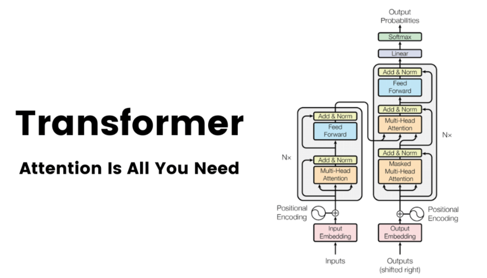

2017 年，Google 的一个团队发表了一篇论文。

标题很朴素：*Attention Is All You Need*（你只需要注意力）。

八个作者，[名字的排列顺序是随机的](https://en.wikipedia.org/wiki/Attention_Is_All_You_Need)——因为他们认为每个人的贡献同样重要。论文发表在机器学习领域最顶级的会议 NeurIPS 上。

当时没有太多人注意到。

但后来发生的事情，让所有人始料未及。

这篇论文的被引用次数，截至 2025 年，[超过了 17 万次](https://www.semanticscholar.org/paper/Attention-is-All-you-Need-Vaswani-Shazeer/204e3073870fae3d05bcbc2f6a8e263d9b72e776)——排进了 21 世纪被引用最多的论文前十名。ChatGPT、GPT-4、Claude、Gemini、Midjourney——今天你能叫得上名字的 AI，几乎全部建立在这篇论文的基础上。

**它到底讲了什么？**

# 在这篇论文之前，AI 是怎么读文字的？
要理解这篇论文为什么重要，我们得先看看在它出现之前，AI 处理语言的方式有什么问题。

前面几篇文章里，我们知道了：文字在 AI 眼里就是一串数字（第 2 篇讲的 Token 和词向量），AI 的”学习”就是调整神经网络里几百万、几千万个参数（第 4 篇和第 5 篇）。

但有一个关键的问题我们还没聊过：**AI 是按什么顺序读这些词的？**

在 2017 年之前，AI 处理语言最主要的方法叫 **RNN**——全名是 Recurrent Neural Network，翻译过来叫”循环神经网络”。”循环”这个名字来自它的工作方式：它把处理上一个词的结果”循环”传给下一个词，一个接一个地读。

这个名字很形象。**RNN 读文字的方式，就像你用手指着书、一个字一个字往下读。**

让我用一个具体的例子来展示它的工作过程。

假设 AI 要理解这句话：”小明喜欢吃苹果”。

RNN 会这样处理：
```
第 1 步：读"小明" → 记住"小明"
第 2 步：读"喜欢" → 记住"小明 + 喜欢"
第 3 步：读"吃"   → 记住"小明 + 喜欢 + 吃"
第 4 步：读"苹果" → 记住"小明 + 喜欢 + 吃 + 苹果"
```

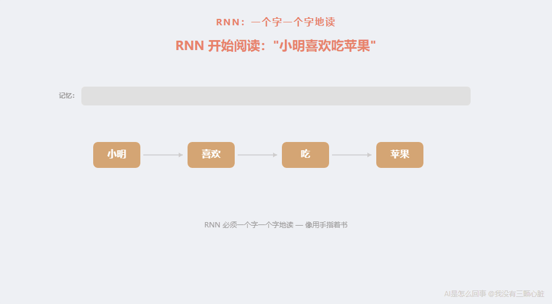

看起来挺合理的，对吧？

但这里有一个致命的问题。

# RNN 的致命弱点：读到后面，忘了前面
想象一下，如果句子变长了：

> “小明，就是那个住在北京朝阳区、去年刚从清华大学计算机系毕业的、特别喜欢打篮球的高个子男生，他最喜欢吃的水果是苹果。”

RNN 还是一个字一个字地读。读到”苹果”的时候，它需要知道这个”苹果”跟”小明”有关——但中间隔了一大堆信息。

问题是：**RNN 的”记忆”是有限的。**

它把每一步的信息压缩成一组固定长度的数字（比如 256 个数字），然后传给下一步。每到下一步，新的信息会覆盖一部分旧的信息。读了几十个词之后，最前面的信息就被冲淡了——就像你往一杯墨水里不断加清水，最后颜色越来越淡。

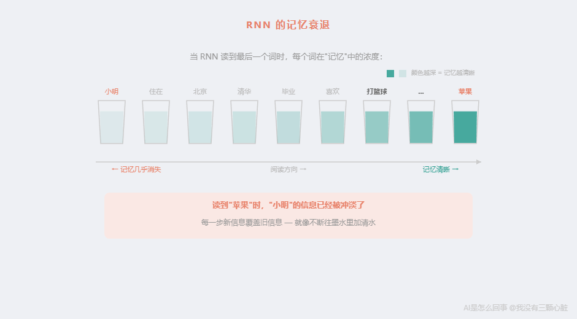

这个问题在 AI 领域有一个专门的名字，叫**长期依赖问题**（long-term dependency problem）。1991 年，德国科学家 Sepp Hochreiter 在他的论文中首次系统地描述了这个问题，并指出了背后的数学原因：[梯度在反向传播时会指数级地衰减](https://www.researchgate.net/publication/220355039_The_Vanishing_Gradient_Problem_During_Learning_Recurrent_Neural_Nets_and_Problem_Solutions)——也就是说，离得越远的词，对当前词的影响越来越接近于零。

用我们第 5 篇学过的反向传播来理解：训练时，AI 需要从后往前传递”调整信号”。但 RNN 的信号每传一步就会衰减一点，传了几十步之后，信号就几乎消失了。这意味着 AI 根本学不到”远处的词”和”当前词”之间的关系。

**这就是为什么 2017 年之前的机器翻译和聊天机器人总是”前言不搭后语”。** 不是 AI”笨”，是它的”眼睛”只能看到最近几十个词——前面说了什么，它真的记不住了。

你可能会说：那就想办法增强记忆力呗？

确实有人这么做了。1997 年，还是那位 Hochreiter，和他的导师 Jurgen Schmidhuber 一起发明了一种改进版的 RNN，叫 [LSTM（Long Short-Term Memory，长短期记忆网络）](https://en.wikipedia.org/wiki/Long_short-term_memory)。LSTM 在 RNN 的基础上加了一个”记忆门”的机制——就像给那杯墨水加了一个阀门，让 AI 可以选择性地记住重要信息、忘掉不重要的信息。

LSTM 确实比原始 RNN 好了很多，它在 2010 年代的机器翻译、语音识别等任务中被广泛使用。但它依然有一个根本限制：**还是一个词一个词地读。**

不管记忆力多好，如果你只能一个字一个字地读，读一篇一万字的文章，总需要一万步。你无法”跳着读”、无法”先看结尾再回头看开头”。

更要命的是——因为必须一步一步地算，**RNN 没办法并行计算**。第 2 步必须等第 1 步算完才能开始，第 3 步必须等第 2 步算完……这意味着训练速度极慢。处理一个 1000 词的句子，需要 1000 个计算步骤，一步一步串行执行。

就像一条工厂的流水线，只有一个工位——不管你买多少台机器，同一时刻只能有一个人在干活。

**2017 年的那篇论文，用一个全新的想法，把这两个问题一起解决了。**

# 一个全新的想法：不要一个字一个字地读了
2017 年的那篇论文提出了一种全新的架构，叫做 **Transformer**。

这个名字的来历很有趣：据论文作者之一 [Jakob Uszkoreit 回忆](https://en.wikipedia.org/wiki/Attention_Is_All_You_Need)，他只是觉得”Transformer”这个词听起来很酷。团队的早期设计文档标题是”Transformers: Iterative Self-Attention and Processing for Various Tasks”，文档里甚至画了几个《变形金刚》的角色。

Transformer 的核心想法可以用一句话概括：

**不要一个字一个字地读了。让 AI 同时看到所有的字，然后自己决定哪些字和哪些字相关。**

这就像阅读方式的一次革命。

RNN 读文字像什么？像用手指一个字一个字地指着读——指到哪算哪，前面读过的只能靠记忆。

Transformer 读文字像什么？像你把整篇文章铺开在桌上，一眼看到全部文字，然后目光自动在相关的词之间跳来跳去。

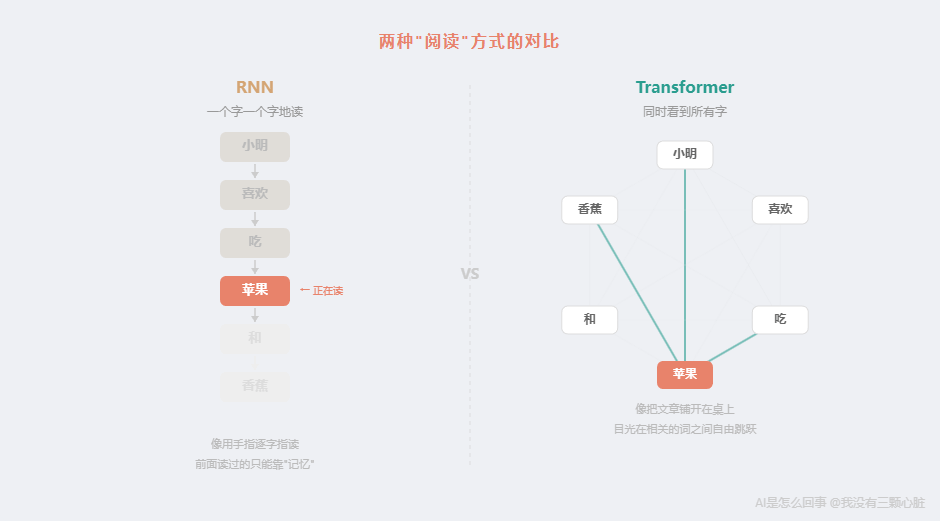

这个”目光自动在相关的词之间跳来跳去”的能力，就是这篇论文的核心发明——**注意力机制**（Attention Mechanism）。

论文的标题 “Attention Is All You Need”（你只需要注意力）正是在说这件事：只要有了注意力机制，不需要 RNN 的那种”一步一步循环读”的结构了。

让我来详细解释注意力机制是怎么工作的。

# 注意力机制：AI 学会了”抓重点”
先从一个你每天都在做的事情说起。

你读一本小说，读到这么一句话：

> “小明把球传给了小红，**她**接住了球，非常开心。”

读到”她”的时候，你是怎么知道”她”指的是小红、不是别人？

你的大脑做了一件事：**自动回看前文，找到了”小红”这个词，确认了”她”就是”小红”。**

你不需要从头重新读一遍。你的目光会自动跳回去——在”她”和”小红”之间建立了一个联系。

这就是”注意力”——**你在处理当前这个词的时候，自动关注到了句子中与它最相关的那些词。**

Transformer 的注意力机制，做的就是同样的事情。

让我用一个更具体的例子来展示。

# 两个”苹果”的故事
看这两个句子：

> 句子 A：”我饿了，吃了一个红色的**苹果**。”
> 句子 B：”我买了一部新的**苹果**手机。”

两个句子里都有”苹果”这个词。但你一眼就能看出来——第一个苹果是水果，第二个苹果是品牌。

你是怎么区分的？靠上下文。

- 看到”吃”、”红色”、”饿了”，你知道这是水果

- 看到”买”、”手机”、”新的”，你知道这是品牌

**注意力机制让 AI 做到了同样的事。**

当 AI 处理句子 A 中的”苹果”时，注意力机制会计算”苹果”和句子中每个其他词的”相关程度”。计算的结果大概是这样的：
```
句子 A："我 饿了 吃了 一个 红色的 苹果"

"苹果"对每个词的注意力：
  我     → 0.02  （不太相关）
  饿了   → 0.08  （有点相关——暗示食物）
  吃了   → 0.35  （非常相关——"吃"说明是食物）
  一个   → 0.05  （不太相关）
  红色的 → 0.45  （非常相关——水果的颜色）
  苹果   → 0.05  （自己和自己）
```

注意这些数字加起来等于 1.00——它们代表的是”注意力的分配比例”。AI 把最多的注意力（0.45 和 0.35）分给了”红色的”和”吃了”——这两个词最能帮助它理解这个”苹果”是水果。

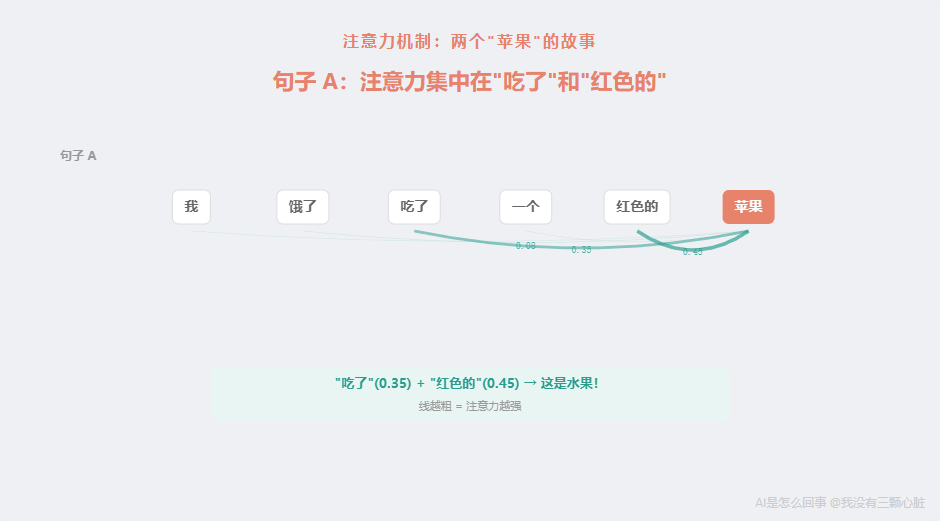

现在看句子 B：
```
句子 B："我 买了 一部 新的 苹果 手机"

"苹果"对每个词的注意力：
  我     → 0.02  （不太相关）
  买了   → 0.20  （相关——买的是产品）
  一部   → 0.08  （有点相关——"一部"暗示电子产品）
  新的   → 0.10  （有点相关）
  苹果   → 0.05  （自己和自己）
  手机   → 0.55  （非常相关——"手机"直接说明了苹果是品牌）
```

这次，AI 把最多的注意力（0.55）分给了”手机”——这个词直接告诉了 AI，这个”苹果”是品牌，不是水果。

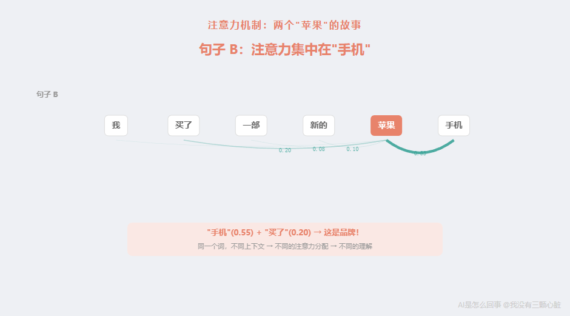

**同一个词”苹果”，因为上下文不同，AI 分配的注意力完全不同，最终理解的含义也完全不同。**

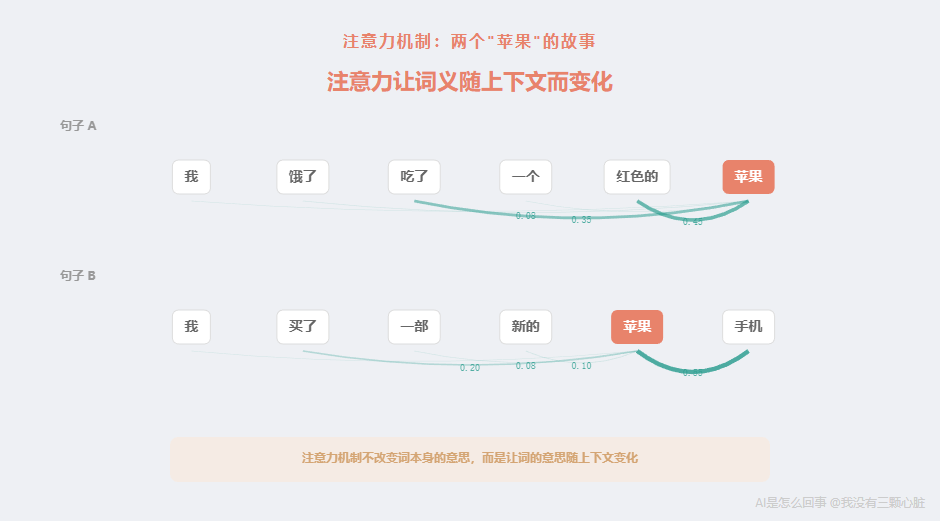

这就是注意力机制的力量。在第 2 篇里我们学过，一个词会被转化成一串数字（词向量）。在 RNN 的时代，”苹果”这个词不管出现在哪里，对应的词向量都是一样的——AI 没法区分水果苹果和品牌苹果。

但有了注意力机制，AI 在处理每个词的时候，会根据上下文重新计算这个词的表示。句子 A 中的”苹果”，经过注意力机制之后，它的数字表示会包含”吃”和”红色”的信息——变成一个带有”水果味”的苹果。句子 B 中的”苹果”，经过注意力机制之后，它的数字表示会包含”手机”和”买”的信息——变成一个带有”科技味”的苹果。

**注意力机制不是改变了词本身的意思，而是让词的意思随上下文而变化。**

# 注意力是怎么算出来的？
你可能好奇：AI 怎么算出 0.35、0.55 这些注意力数字的？

这里我尽量解释得直观，不跳步骤。

想象一个图书馆的场景。

你走进图书馆，手里有一个**问题**（”我想找关于水果的书”）。书架上每本书都有一个**标签**（”这本书讲烹饪”、”这本书讲手机”、”这本书讲农业”）。你会把自己的问题和每本书的标签做比较——越匹配的书，你越想拿来看。最后，你从匹配度最高的那几本书里提取出你要的**信息**。

Transformer 的注意力机制就是这个过程。论文的作者把它形式化成了三个东西：

- **Query（查询）**：”我想找什么？”——当前这个词在”提问”

- **Key（键）**：”我是什么？”——句子中每个词的”标签”

- **Value（值）**：”我有什么信息？”——句子中每个词实际携带的内容

这三个名字来自数据库的术语（数据库就是用”键”来查找”值”的）。我第一次看到 Query/Key/Value 的时候完全蒙了——“这跟语言有什么关系？”后来才明白，这其实就是一个检索过程：用一个问题去检索一堆信息，找出最相关的部分。

具体的计算过程是这样的：

**第 1 步：为每个词生成 Q、K、V 三个向量**

我们在第 2 篇学过，每个词会变成一个向量（比如一串 512 个数字）。现在，每个词的向量要被分别乘以三个不同的权重矩阵（就是第 4 篇讲的那种”乘法+加法”的运算），得到三个新的向量：Query、Key、Value。

这三个权重矩阵一开始也是随机数——就像我们在第 1 篇和第 5 篇里看到的检测器和神经网络的参数一样，它们会在训练程中被反向传播慢慢调整到最佳状态。

**第 2 步：计算注意力分数**

拿”苹果”的 Query，和句子中每个词的 Key 做”点积”运算。

什么是点积？就是两组数字对应位置相乘、然后全部加起来——和第 1 篇里 Sobel 算子的计算方式完全一样。
```
注意力分数 = 苹果的 Query · 每个词的 Key

苹果 Q · "吃了"K = 112  （高分——很相关）
苹果 Q · "红色的"K = 98  （高分——很相关）
苹果 Q · "一个"K = 23    （低分——不太相关）
苹果 Q · "我"K = 15      （低分——不太相关）
```

点积的值越大，说明这两个向量”方向”越一致——也就是说这两个词越相关。点积的值越小，说明越不相关。

**第 3 步：转化为概率**

把上面的分数通过一个叫 **softmax** 的函数，转化成 0 到 1 之间的概率值（所有值加起来等于 1）。Softmax 的作用就是”分配比例”——让大的分数变成大的比例，小的分数变成小的比例。

这一步的结果，就是我们前面看到的那些注意力数字：0.35、0.45 等等。

**第 4 步：加权求和**

用这些注意力比例，对每个词的 Value 向量做加权平均。
```
"苹果"的新表示 = 0.02×"我"的 V +0.08×"饿了"的 V +0.35×"吃了"的 V
                +0.05×"一个"的 V +0.45×"红色的"的 V +0.05×"苹果"的 V
```

因为”吃了”和”红色的”的权重最大，所以最终”苹果”的新表示里，主要包含了”吃了”和”红色的”的信息。

**这就是注意力机制的全部计算过程。**

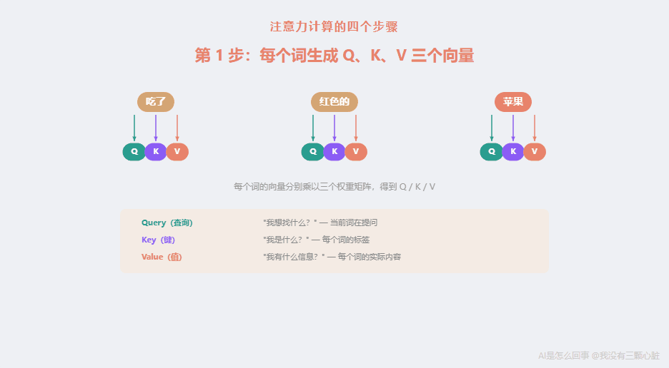

把四步串起来：每个词都会”提一个问题”（Query），去和所有词的”标签”（Key）做比较，找到最相关的词，然后把那些最相关的词的”信息”（Value）融合到自己身上。

整个过程只有乘法和加法——和第 4 篇讲的神经网络一模一样。

# 自注意力：每个词都在看所有词
上面描述的过程有一个重要的特点：**每个词的 Query、Key、Value，都来自同一个句子。**

“苹果”在提问，”吃了”和”手机”在回答——它们都是同一个句子里的词。AI 在让句子”自己看自己”。

这就是为什么这个机制被叫做**自注意力**（Self-Attention）——“自”的意思就是”自己跟自己做注意力计算”。

这跟 RNN 有什么根本的不同？

**RNN 是串行的：** 处理到第 5 个词的时候，它只能看到第 1-4 个词传过来的”压缩记忆”。

**自注意力是并行的：** 处理第 5 个词的时候，它直接看到了句子里所有的词——第 1 个、第 2 个、第 3 个……一直到最后一个。不需要等前面的词先算完。

这就像两种完全不同的阅读方式：

- RNN：蒙着眼睛，别人一个字一个字地念给你听。你只能靠记忆把前面的内容串起来。

- Transformer：睁着眼睛，整篇文章摊开在面前。你可以自由地在任意两个词之间跳来跳去。

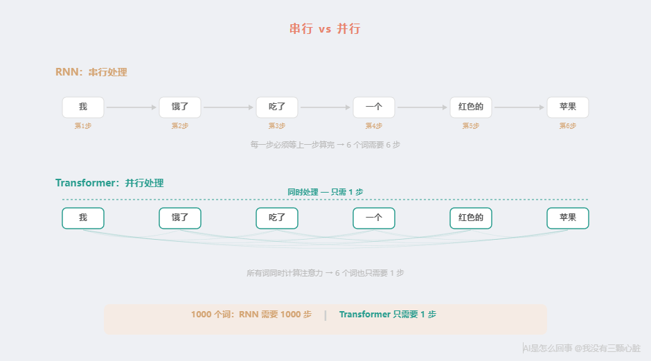

# 还有一个”多头”的设计
研究到这里，我产生了一个疑问：一个词可能和其他词有好几种不同的关系。比如”她”这个词，可能需要同时知道：

- “她”指的是**谁**？（语义关系——指向”小红”）

- “她”在句子里的**角色**是什么？（语法关系——主语）

- “她”的**情感**是什么？（语境关系——和”开心”相关）

一组 Query/Key/Value 只能捕捉一种关系。怎么办？

Transformer 论文的作者想了一个巧妙的办法：**同时用好几组不同的 Query/Key/Value，让每一组关注不同的关系。**

这就叫**多头注意力**（Multi-Head Attention）。”多头”的意思就是有好几个”注意力头”，每个头用自己独立的一组 Q/K/V 矩阵去做注意力计算。

原始的 Transformer 论文用了 [8 个头](https://arxiv.org/abs/1706.03762)。就像让 8 个人同时阅读同一个句子，每个人关注不同的方面——有人关注”谁是谁”，有人关注”谁做了什么”，有人关注”感情色彩”。最后把 8 个人的理解综合起来。

这样，AI 对每个词的理解就不再是单一的，而是多维度的。

# 为什么这是一场革命？
现在让我来解释为什么 Transformer 不只是”又一个新模型”，而是一场真正的革命。

**革命一：训练速度的飞跃**

还记得 RNN 的问题吗？必须一个词一个词地算，第 2 步等第 1 步，第 3 步等第 2 步——像一条只有一个工位的流水线。

Transformer 完全不同。因为每个词在做自注意力计算的时候，是同时看所有词——不需要等别的词先算完。**所有词的注意力可以并行计算。**

这意味着什么？

打个比方：RNN 处理一个 1000 词的句子，需要 1000 个计算步骤（串行）。Transformer 处理同一个句子，在理论上只需要 1 个计算步骤——因为所有词同时在算。

实际效果有多夸张？Transformer 论文中报告了一组数据：他们在 [8 块 NVIDIA P100 GPU 上训练了 3.5 天](https://arxiv.org/abs/1706.03762)，就在英语翻译到法语的任务上达到了当时最好的成绩（WMT 2014 英法翻译 BLEU 分数 41.8 分），而之前最好的模型需要用更多的计算资源训练更长的时间。论文的原话是：”仅花了当时最好模型训练成本的四分之一。”

**GPU（我们在第 5 篇聊过的”并行计算神器”）和 Transformer 简直是天作之合。** GPU 擅长同时做大量简单计算，而 Transformer 的自注意力机制恰好就是大量的并行计算。

**革命二：终于能”看到”远处的词了**

RNN 的长期依赖问题——“读到后面忘了前面”——被彻底解决了。

在 Transformer 里，第 1 个词和第 1000 个词之间的”距离”是一样的——它们直接通过注意力机制相连，不需要经过中间 999 个词的接力传递。信号不会衰减。

这就是为什么今天的 AI 能处理超长的文本。GPT-4 的上下文窗口（context window，就是 AI 一次能”看到”的文字量）是 [128,000 个 Token](https://openai.com/index/gpt-4/)，大约相当于一本 10 万字的中篇小说。Claude 的上下文窗口甚至更长。

这在 RNN 时代是不可想象的。当时的模型能”记住”几十到几百个词就不错了。

**革命三：一个意想不到的发现——规模定律**

这可能是 Transformer 带来的最深远的影响。

2020 年，OpenAI 的 [Jared Kaplan 等人发表了一篇论文](https://arxiv.org/abs/2001.08361)，发现了一个惊人的规律：基于 Transformer 架构的语言模型，其性能和三个因素之间存在简洁的数学关系——

- **模型参数量**（模型有多大）

- **训练数据量**（喂了多少数据）

- **计算量**（花了多少算力）

**三个因素中的任何一个增大，模型的性能就会以可预测的方式提升。**

而且这个关系是幂律（power law）——一条平滑的曲线，没有看到天花板。

这意味着什么？意味着你只需要做一件事：**把模型做大，把数据加多，把算力堆上去——效果就会变好。**

这在 RNN 时代是不成立的。RNN 的模型再大，也会被长期依赖问题卡住——性能到一定程度就上不去了。但 Transformer 打破了这个天花板。

这个发现后来被称为**规模定律**（Scaling Laws），它直接指导了后来 GPT-3、GPT-4 等大模型的开发策略：不需要发明全新的算法，只需要在 Transformer 的基础上不断放大。

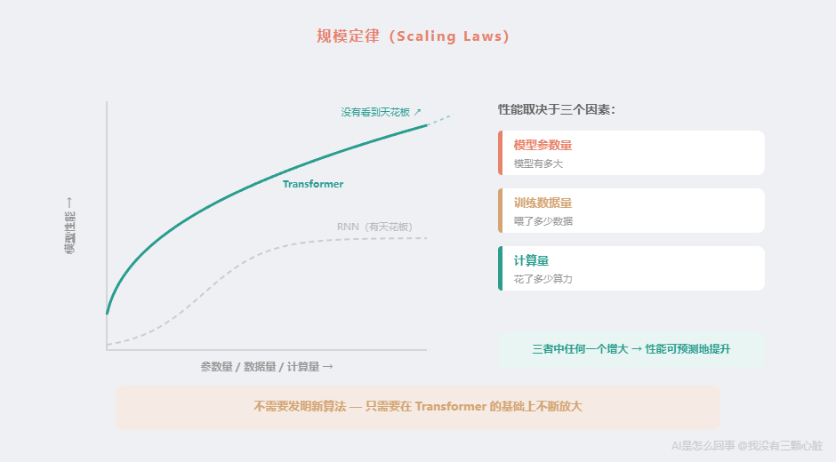

# 从 Transformer 到 ChatGPT：一条不断放大的路
有了 Transformer 架构和规模定律，后面发生的事情就像一列加速前进的火车。

让我们按时间线来看这条路。

**2017 年 6 月：Transformer 论文发表**

[8 位作者](https://en.wikipedia.org/wiki/Attention_Is_All_You_Need)——Ashish Vaswani、Noam Shazeer、Niki Parmar、Jakob Uszkoreit、Llion Jones、Aidan Gomez、Lukasz Kaiser、Illia Polosukhin——发表了”Attention Is All You Need”。论文的原始目的是做机器翻译（把英语翻译成其他语言）。他们当时可能不知道，这个架构会在 5 年后催生出 ChatGPT。

**2018 年 6 月：GPT-1 —— 1.17 亿参数**

OpenAI 基于 Transformer 架构做了一个语言模型，叫 GPT——全名 [Generative Pre-trained Transformer](https://en.wikipedia.org/wiki/GPT-1)，翻译过来是”生成式预训练 Transformer”。

名字拆开来看：

- **Generative（生成式）**：它的任务是”生成”文字——给一段开头，续写下去

- **Pre-trained（预训练）**：先用海量文本训练出一个”通用”模型，然后再针对具体任务微调

- **Transformer**：就是我们前面讲的那个架构

GPT-1 有 [1.17 亿个参数](https://en.wikipedia.org/wiki/GPT-1)，12 层 Transformer。用了约 5GB 的书籍文本进行训练。

1.17 亿参数是什么概念？跟第 3 篇里的 AlexNet（6000 万参数）比，大了差不多一倍。但跟后面的模型比，它还只是个婴儿。

GPT-1 能做什么？能读懂一些文本、做简单的分类和问答。但它的回答还很粗糙，远远到不了”对话”的水平。

**2019 年 2 月：GPT-2 —— 15 亿参数**

GPT-2 有 [15 亿个参数](https://en.wikipedia.org/wiki/GPT-2)——是 GPT-1 的 12.8 倍。

它能写出令人惊讶地流畅的文章。给它一段开头，它能续写出连贯的、有上下文逻辑的长篇文字。

GPT-2 引发了一个轰动事件：**OpenAI 一度拒绝公开完整模型。**

他们在 [2019 年 2 月的声明中说](https://slate.com/technology/2019/02/openai-gpt2-text-generating-algorithm-ai-dangerous.html)，GPT-2”太危险了，不能发布”——担心它会被用来制造假新闻、假评论、网络诈骗。这在 AI 界引发了激烈争论——有人批评 OpenAI”搞噱头”，有人认为这是”负责任的做法”。

最终，经过几个月的观察，OpenAI 在 [2019 年 11 月公开了完整的 15 亿参数模型](https://www.theregister.com/2019/11/06/openai_gpt2_released/)，并表示”没有看到被严重滥用的证据”。

**2020 年 6 月：GPT-3 —— 1750 亿参数**

GPT-3 有 [1750 亿个参数](https://en.wikipedia.org/wiki/GPT-3)——是 GPT-2 的 116 倍，是 GPT-1 的 1500 倍。

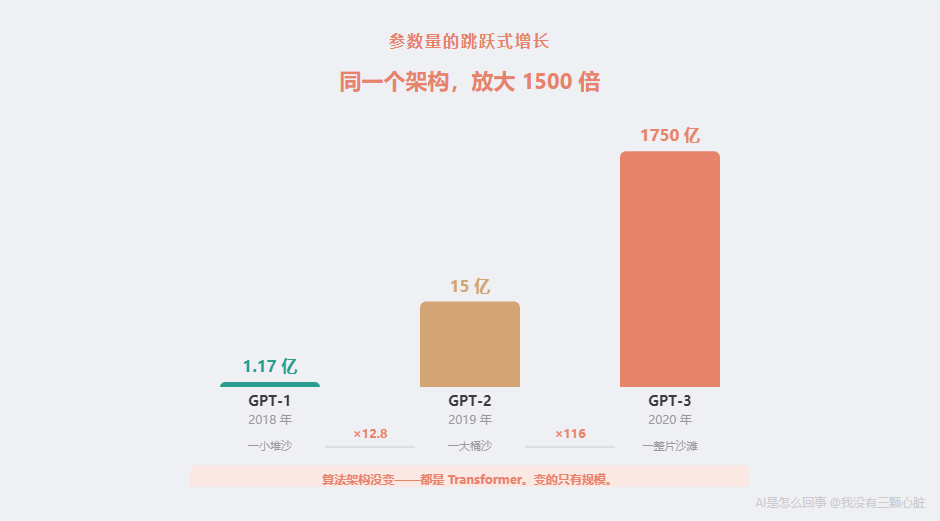

让这些数字变得有实感：如果每个参数是一粒沙子，GPT-1 是一小堆沙（1.17 亿粒），GPT-2 是一大桶沙（15 亿粒），GPT-3 是一整片沙滩（1750 亿粒）。

GPT-3 让整个 AI 界震惊了。不是因为它做了什么新的事情——它用的还是同样的 Transformer 架构——而是因为**规模放大后，涌现出了没人预料到的能力**。

什么叫”涌现”？就是小模型完全做不到的事情，大模型突然就能做了。比如：

- 给 GPT-3 看几个”英语→法语”的翻译例子，它就能翻译新的句子——没有人专门训练它翻译

- 给它一段代码的开头，它能续写出逻辑正确的代码——没有人专门训练它写代码

- 给它一个常识推理问题，它能给出合理的回答——没有人专门训练它推理

这些能力不是被”教”出来的，是从海量文本中”长”出来的。模型大到一定程度，量变引发了质变。

**2022 年 11 月 30 日：ChatGPT 发布**

然后就到了改变一切的那一天。

[2022 年 11 月 30 日，OpenAI 发布了 ChatGPT。](https://www.ofzenandcomputing.com/chatgpt-release-date/)5 天之内，用户突破 100 万。两个月之内，月活跃用户达到 1 亿——成为[历史上增长最快的消费级应用](https://www.ofzenandcomputing.com/chatgpt-release-date/)。

ChatGPT 和 GPT-3 有什么区别？

底层架构是一样的——还是 Transformer。但 ChatGPT 多做了一件关键的事：**RLHF——基于人类反馈的强化学习**（Reinforcement Learning from Human Feedback）。

RLHF 是什么？用一个类比来解释。

GPT-3 就像一个读过整个互联网的天才——他知道海量的知识，但说话没有章法。你问他一个问题，他可能给你一段维基百科式的文章，也可能给你一段 Reddit 上的粗话，也可能给你一段胡编乱造的”新闻”——因为他在训练数据里见过所有这些风格。

RLHF 做的事情就是给这个天才**上了一门”说话课”。**

具体怎么做的？OpenAI 在 [2022 年 3 月发表了一篇论文](https://arxiv.org/abs/2203.02155)（叫 InstructGPT 论文）详细描述了这个过程：

- **请人类示范**：让人类标注员写出”好的回答”的样板——比，面对”什么是黑洞？”这个问题，标注员写出一个准确、友好、条理清晰的回答

- **训练一个“评分模型”**：给 AI 的多个回答让人类标注员排序（哪个回答更好），用这些排序数据训练一个”评分模型”（reward model），让它学会像人类一样判断”哪个回答更好”

- **用评分模型训练 AI**：让 AI 尝试回答问题，评分模型打分，AI 根据分数调整自己的行为——得分高的回答风格，以后多用；得分低的，以后少用

这个过程重复很多轮之后，AI 就学会了”好好说话”——回答变得更有条理、更友好、更有用、更安全。

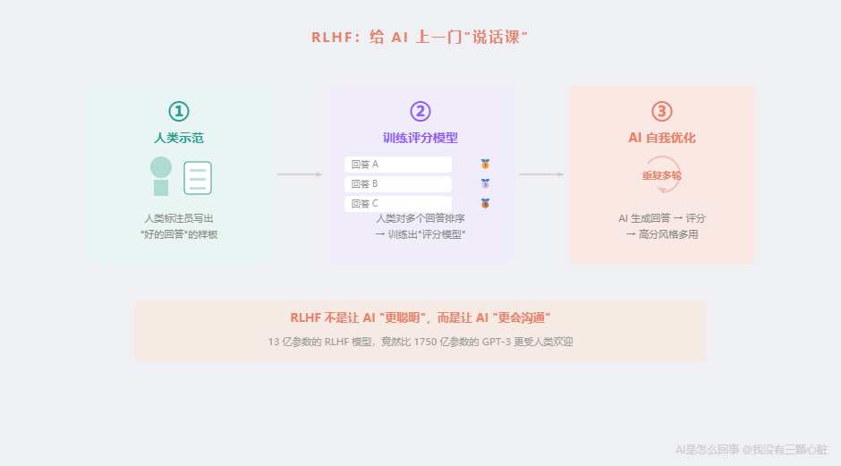

一个让人印象深刻的发现是：OpenAI 发现，经过 RLHF 训练的 [13 亿参数的小模型](https://arxiv.org/abs/2203.02155)，在人类评估中竟然比没有经过 RLHF 训练的 1750 亿参数的 GPT-3 还要受欢迎。这说明 RLHF 不是在让 AI”更聪明”，而是在让 AI”更会沟通”——就像一个学生考试能力没变，但学会了把答案写得更清楚、更有条理。

**ChatGPT 的成功秘诀不是一个单一的突破，而是一连串因素的累积：** Transformer 架构（2017）+ 规模放大（2018-2020）+ RLHF 对齐（2022）。

# 让数字说话：从 1 亿到 1750 亿
让我把这条路上的关键数字整理成一张表：

| 时间 | 模型 | 参数量 | 关键进展 |
| --- | --- | --- | --- |
| 2017 年 6 月 | Transformer 论文 | — | 提出了注意力机制和 Transformer 架构 |
| 2018 年 6 月 | GPT-1 | 1.17 亿 | 第一个基于 Transformer 的大规模语言模型 |
| 2019 年 2 月 | GPT-2 | 15 亿 | 能写出流畅文章，OpenAI 一度不敢公开 |
| 2020 年 6 月 | GPT-3 | 1750 亿 | 涌现出翻译、编程等未经专门训练的能力 |
| 2022 年 3 月 | InstructGPT | 多种规模 | 引入 RLHF，让 AI 学会”好好说话” |
| 2022 年 11 月 | ChatGPT | 未公开 | 5 天 100 万用户，2 个月 1 亿用户 |

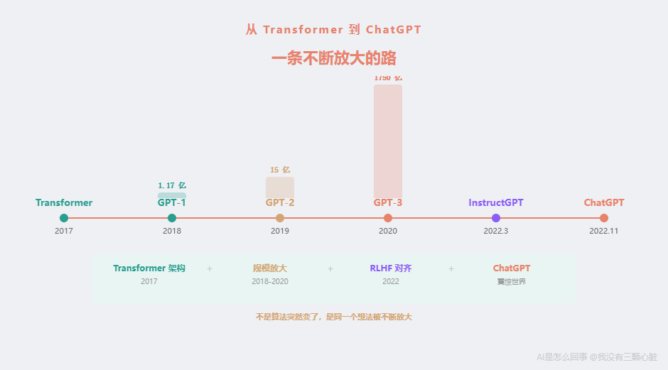

看这张表，一个规律非常清晰：

**从 GPT-1 到 GPT-3，算法架构没有本质变化——都是 Transformer。变化的只有规模：参数从 1 亿到 15 亿到 1750 亿，训练数据从几个 GB 到几百个 GB 到几百 TB。**

这正是规模定律预测的：同一个架构，放大 1500 倍，效果从”勉强能读”变成了”震惊世界”。

不是算法突然变了，是同一个想法——注意力机制——被不断放大，量变引发了质变。

# 个人锚点
研究到这里，我想分享一个我学习过程中的感受。

最初看到 Transformer 论文的标题”Attention Is All You Need”时，我以为这只是一个夸张的论文名——学术界经常这样取标题来吸引眼球。

但当我真正理解了注意力机制之后，我觉得这个标题是 AI 领域最名副其实的命名。它真的只用了一个核心想法——让每个词同时看到所有其他词，自己决定该关注谁——就解决了 RNN 几十年没解决的问题。

更让我感慨的是后来发生的事。这 8 位作者发表论文的时候，目标只是做好机器翻译。他们不知道 5 年后，这个架构会催生出 ChatGPT、会改变整个科技行业、会让”AI”从一个技术术语变成全球话题。

有时候，改变世界的，不是一个多么复杂的发明——而是一个恰好在对的时间出现的、足够简洁优雅的想法。

还有一件让我印象很深的事：这篇论文的 8 位作者后来全部离开了 Google，分别创办或加入了不同的 AI 公司。他们亲手写下了一篇论文，催生了一个时代，然后各自走向了不同的方向。技术的发展不是一条直线，而是一个人的种子撒出去，在无数地方开花。

# 一句话回顾
Transformer 给了 AI 一种全新的”阅读”方式——不再一个字一个字地读，而是同时看全文、自动抓重点。注意力机制是它唯一的核心想法。ChatGPT 就是这个想法放大 1500 倍、再加上”说话课”（RLHF）的产物。

# 下一篇预告
到这里，你已经理解了 ChatGPT 的全部核心原理：

- 文字变成数字（第 2 篇的 Token 和词向量）

- 数字经过层层计算（第 4 篇的神经网络）

- 计算通过训练来调优（第 5 篇的反向传播）

- Transformer 让 AI 能同时看全文（这一篇）

但有一个问题你可能一直在想：

**如果 AI 这么厉害，为什么它还会犯那些低级错误？**

2023 年，一个执业 30 年的纽约律师，向法庭提交了 6 个法律判例——全部是 ChatGPT 编造的。他问 ChatGPT”这些判例是真的吗？”，ChatGPT 回答：”是的。”

一个能通过律师考试的 AI，为什么会编造不存在的判例？它知道自己在”撒谎”吗？

下一篇，我们来回答这个问题。

# 参考资料

- [Attention Is All You Need - Vaswani, Shazeer, Parmar, Uszkoreit, Jones, Gomez, Kaiser, Polosukhin (2017)](https://arxiv.org/abs/1706.03762) — Transformer 论文原文，发表于 NeurIPS 2017，8 位作者均来自 Google

- [Attention Is All You Need - Wikipedia](https://en.wikipedia.org/wiki/Attention_Is_All_You_Need) — 论文背景、作者信息、命名由来、引用次数等

- [The Vanishing Gradient Problem During Learning Recurrent Neural Nets and Problem Solutions - Hochreiter (1991)](https://www.researchgate.net/publication/220355039_The_Vanishing_Gradient_Problem_During_Learning_Recurrent_Neural_Nets_and_Problem_Solutions) — 首次系统描述 RNN 的梯度消失问题

- [Long Short-Term Memory - Wikipedia](https://en.wikipedia.org/wiki/Long_short-term_memory) — LSTM 由 Hochreiter 和 Schmidhuber 于 1997 年提出，解决 RNN 的长期依赖问题

- [Scaling Laws for Neural Language Models - Kaplan et al. (2020)](https://arxiv.org/abs/2001.08361) — OpenAI 发现的规模定律，揭示了模型性能和参数量、数据量、计算量之间的幂律关系

- [GPT-1- Wikipedia](https://en.wikipedia.org/wiki/GPT-1) — GPT-1 的架构细节，1.17 亿参数，12 层 Transformer

- [GPT-2- Wikipedia](https://en.wikipedia.org/wiki/GPT-2) — GPT-2 的架构细节，15 亿参数，OpenAI 一度拒绝公开

- [OpenAI says its text-generating algorithm GPT-2 is too dangerous to release - Slate (2019)](https://slate.com/technology/2019/02/openai-gpt2-text-generating-algorithm-ai-dangerous.html) — GPT-2”太危险不能发布”事件的报道

- [GPT-2 full model released - The Register (2019)](https://www.theregister.com/2019/11/06/openai_gpt2_released/) — GPT-2 完整模型最终公开发布的报道

- [GPT-3- Wikipedia](https://en.wikipedia.org/wiki/GPT-3) — GPT-3 的架构细节，1750 亿参数

- [Training language models to follow instructions with human feedback - Ouyang et al. (2022)](https://arxiv.org/abs/2203.02155) — InstructGPT 论文，描述了 RLHF 训练方法，13 亿参数 RLHF 模型优于 1750 亿参数 GPT-3

- [ChatGPT Release Date and Timeline](https://www.ofzenandcomputing.com/chatgpt-release-date/) — ChatGPT 发布时间线，5 天 100 万用户，2 个月 1 亿月活

- [Attention Is All You Need - Semantic Scholar](https://www.semanticscholar.org/paper/Attention-is-All-you-Need-Vaswani-Shazeer/204e3073870fae3d05bcbc2f6a8e263d9b72e776) — 论文引用次数统计

# 订阅
如果觉得有意思，欢迎关注我，后续文章也会持续更新。同步更新在[个人博客](https://www.wmyskxz.cn/)和[微信公众号](https://weixin.sogou.com/weixin?type=1&s_from=input&query=wmyskxz&ie=utf8&_sug_=n&_sug_type_=&w=01019900&sut=1861&sst0=1612590375262&lkt=8,1612590373961,1612590375161)

微信搜索”我没有三颗心脏”或者扫描二维码，即可订阅。


---

*笔记整理日期：2026-05-18*
