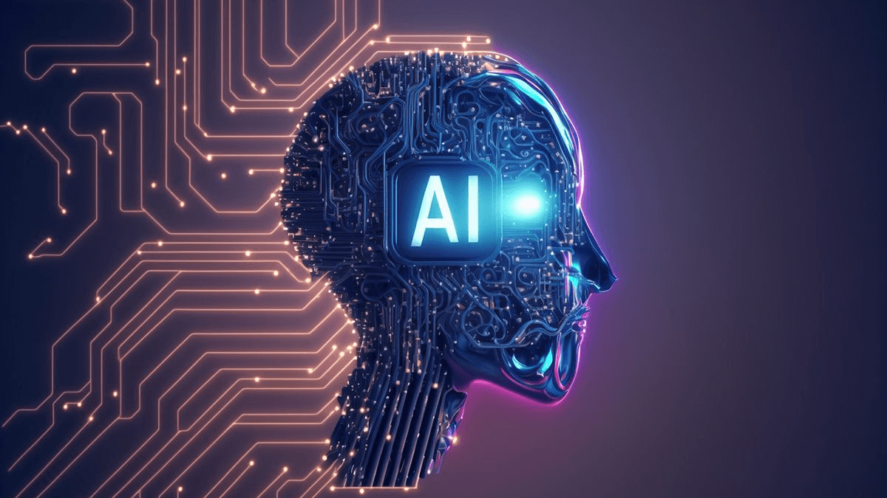
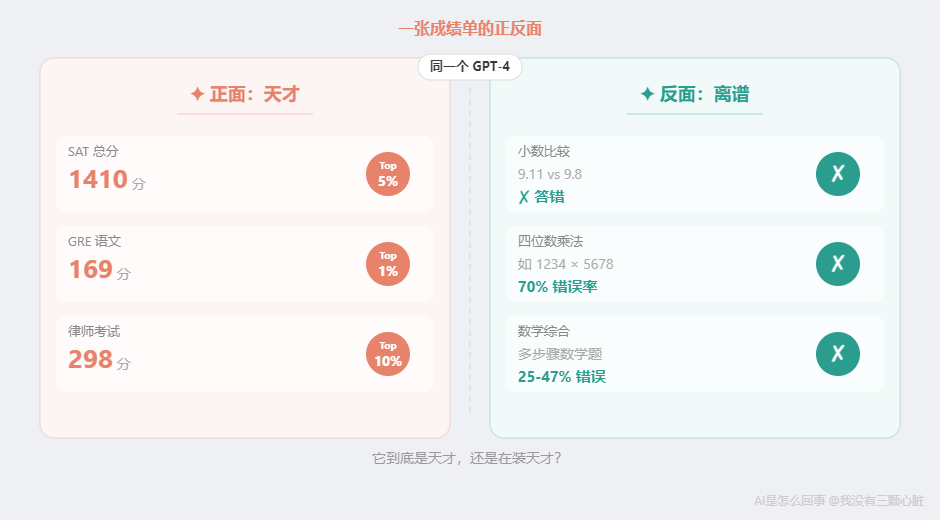
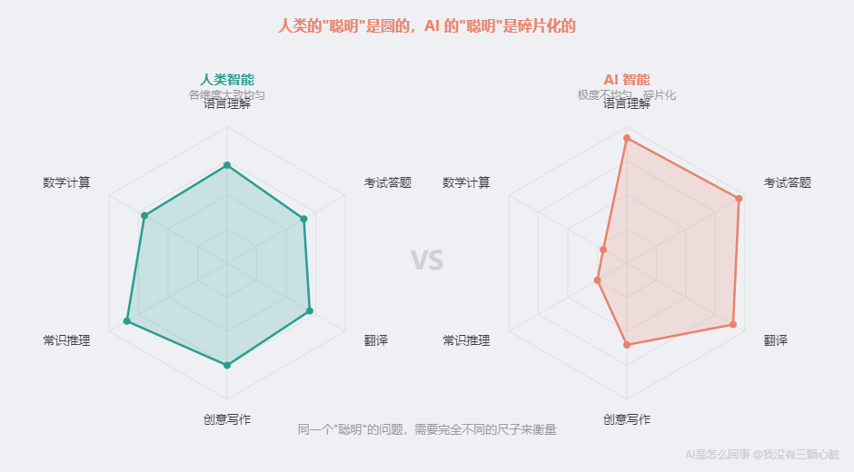
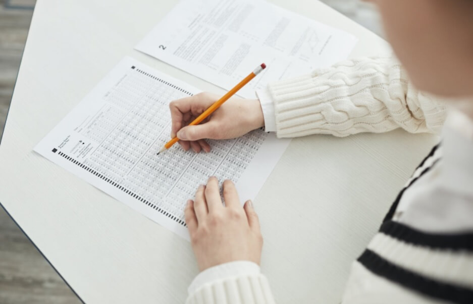
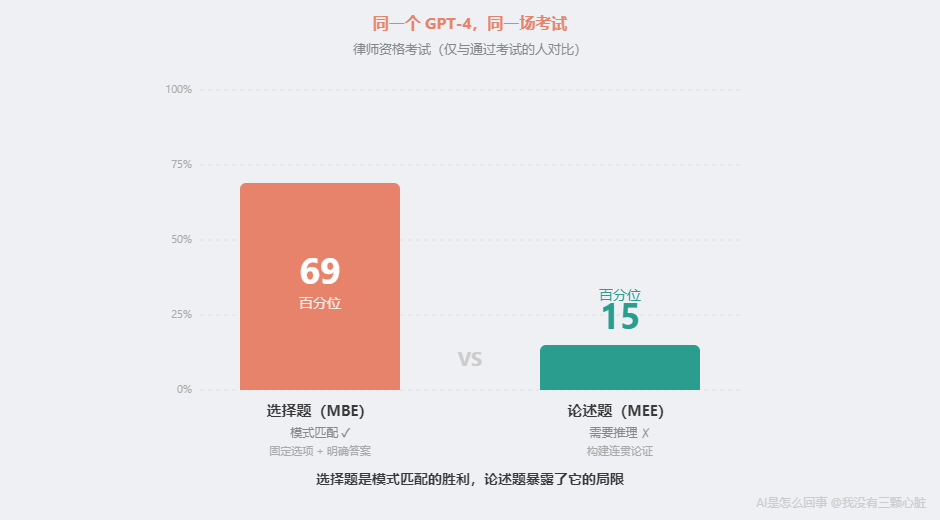
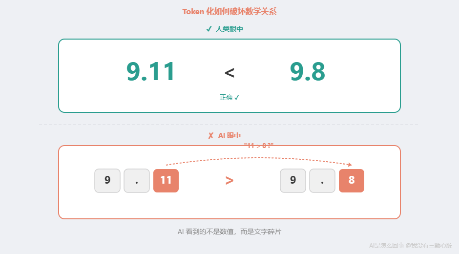
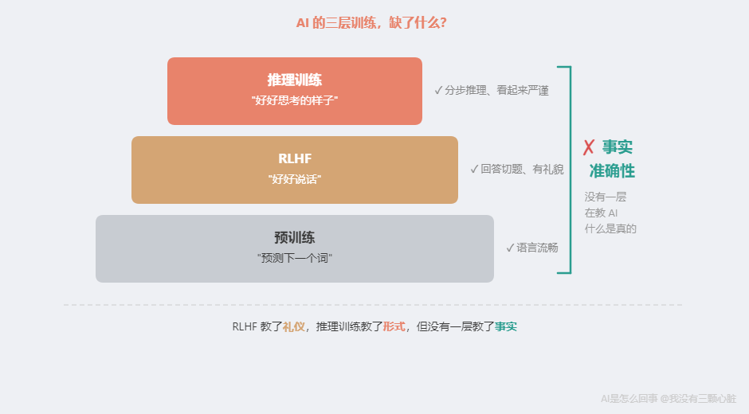
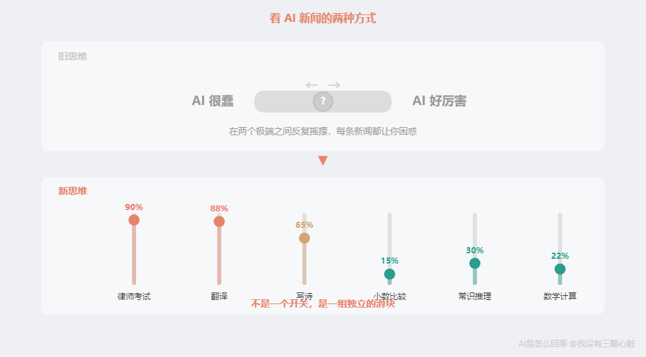

# AI是怎么回事：AI 到底有多聪明？——一份让 AI 研究者也困惑的成绩单

> 课程来源：https://wmyskxz.cn/wiki/whats_ai/9/

---

> 这是 **「AI是怎么回事」** 系列的第 9 篇。我一直很好奇 AI 到底是怎么工作的，于是花了很长时间去拆这个东西——手机为什么换了发型还能认出你，ChatGPT 回答你的那三秒钟里究竟在算什么，AI 为什么能通过律师考试却会一本正经地撒谎。这个系列就是我的探索笔记，发现了很多有意思的东西，想分享给你。觉得不错的话，欢迎分享+关注。
> 第一次看到这个系列？从[第1篇](https://wmyskxz.cn/wiki/whats_ai/1/)开始最顺畅，直接读这篇也没问题。

上一章我们拆开了 AI 的黑箱，得到了一个核心结论：**AI 是超级模式匹配器。** 但这个结论到底有多大的解释力？先做一个测试。

看完下面这组数据，请你给 GPT-4 一个评价——“聪明”还是”不聪明”：

| 考试 | GPT-4 的成绩 | 大致水平 |
| --- | --- | --- |
| 统一律师资格考试（UBE） | 298/400 | 约前 10%（OpenAI 声称） |
| SAT 阅读写作 | 710/800 | 约 93 百分位 |
| SAT 数学 | 700/800 | 约 89 百分位 |
| GRE 语文 | 169/170 | 约 99 百分位 |
| AP 生物、心理学、统计等 | 5/5 满分 | 顶尖 |

数据来源：[OpenAI GPT-4 技术报告（2023）](https://openai.com/index/gpt-4-research/)

给一些参照系。SAT 满分 1600 分，美国高中生平均约 1050 分，GPT-4 考了 1410——全国前 5%。GRE 语文 169 分，超过了 99% 的考生——而这些考生本身已经是大学毕业生。

如果这是一个人类考生，你会说：天才。

现在翻面。

**同一个 GPT-4：**

- 被问”[9.11 和 9.8 哪个大](https://community.openai.com/t/why-does-chatgpt-say-that-9-11-is-bigger-than-9-8/869489)“——回答”9.11 更大”

- 四位数乘法[错误率超过 70%](https://techcrunch.com/2024/10/02/why-is-chatgpt-so-bad-at-math/)——你拿张草稿纸就能算对

- 数学综合研究显示[错误率在 25% 到 47% 之间](https://hechingerreport.org/proof-points-combat-ai-hallucinations-math/)

一个 SAT 1410 分的”天才”，连 9.11 和 9.8 的大小都搞错？

好，这是 2023 年的成绩单。你可能会想：三年过去了，新模型总该解决这些问题了吧？

再看一份。

**2025-2026 年，最新 AI 模型的成绩单：**

| 模型与考试 | 成绩 | 大致水平 |
| --- | --- | --- |
| GPT-5.2 — AIME 2025（数学竞赛） | 100% 满分 | 历史首个满分，超越所有人类选手 |
| Gemini 3 Pro — GPQA Diamond（研究生级科学） | 91.9% | 超越人类专家水平（~89.8%） |
| Claude Opus 4.6 — SWE-bench（真实编程任务） | 80.8% | 能修复 80% 的真实软件 Bug |

数据来源：[OpenAI](https://openai.com/index/introducing-gpt-5-2/)、[Artificial Analysis](https://artificialanalysis.ai/evaluations/mmlu-pro)、[Vellum](https://www.vellum.ai/blog/claude-opus-4-6-benchmarks)

数学竞赛满分，研究生级科学题超越专家，真实编程任务八成搞定。三年进步之大，令人咂舌。

现在翻面。

**同一批 2025-2026 年的模型：**

- GPT-5.2 在 [ARC-AGI-2 抽象推理测试](https://arcprize.org/blog/arc-prize-2025-results-analysis)上只有 52.9%——**「人类平均 60%」**，而且 100% 的题人类都能做对

- OpenAI 自己的推理模型 o3 在事实问答上[幻觉率 33%](https://techcrunch.com/2025/04/18/openais-new-reasoning-ai-models-hallucinate-more/)，更小的 o4-mini 高达 **「48%」**——每两个回答就有一个在编造

- Apple 研究发现，把数学题的数字换一下、人名换一下，AI 的[表现就大幅波动](https://machinelearning.apple.com/research/gsm-symbolic)；问题复杂度一高，所有推理模型[直接崩溃至 0%](https://machinelearning.apple.com/research/illusion-of-thinking)

三年后，矛盾不但没消失，反而**升级了**——连研究 AI 的人自己也在为同一个问题争论不休：这些模型到底是真的在”推理”，还是学会了更高级的”模式匹配”？

如果你觉得这个问题比三年前更难回答，恭喜——**你看到了 2026 年 AI 领域最核心的困惑。**

# 你用错了尺子
这个问题之所以难回答，不是因为你对 AI 了解不够，而是因为**「聪明还是不聪明」这个问题本身就是错的**。

为什么你会觉得这组数据矛盾？

因为你在不自觉地做一个假设：**「聪明」是一个统一的整体。**

对人类来说，这个假设基本成立。一个能通过律师考试的人，不会连 9.11 和 9.8 都比不清楚。一个 GRE 语文 99 百分位的人，小学数学不会错。人类的各种认知能力之间有很强的关联性——语言能力强的人，逻辑能力通常也不差。心理学上叫这个”[g 因子](https://en.wikipedia.org/wiki/G_factor_(psychometrics))“——一种贯穿所有认知任务的一般智力因素。

但 AI 不是这样。

**AI 的”聪明”是碎片化的。** 它在不同任务上的能力可以相差几个数量级——律师考试前 10%，同时连小数比大小都会搞错。这两件事在 AI 身上同时成立，没有任何矛盾。

为什么？因为 AI 的每一项能力，都是从**那个特定领域的训练数据**中学来的。律师考试的能力来自海量法律文本中的问答模式。小数比较的”能力”来自——这个我们下面说。

**用「聪明不聪明」来评价 AI，就像用「高不高」来描述一条河。** 一条河有的地方深不见底，有的地方你能蹚过去。说它”深”或”浅”都不对——你得说”在哪个位置有多深”。

AI 也一样。你不能问”AI 聪明吗”。你得问”**AI 在这个具体任务上有多强**“。

2026 年的数据让这个特征更加鲜明——像一个数学竞赛满分、但换个数字就做错的学生。不是偶尔失误，而是**结构性地**：某些维度强到超越人类专家，某些维度弱到让人匪夷所思。

# 用第一章的工具拆解这张成绩单
第一章我们知道了 AI 是模式匹配器。但”模式匹配器”这三个字还不够用——它没有告诉我们为什么同一个模式匹配器在不同任务上差距如此巨大。这一篇要解决的就是这个问题。

“碎片化”这三个字说起来容易，但为什么会碎片化？

这就需要用到第一章学过的知识了。让我拿成绩单上的三个数据做手术，你会看到每一个数字背后的原因都不同——而且全部可以用第一章的原理解释。

## 手术一：为什么能通过律师考试？

答案是：**考试题的模式，在训练数据中大量存在。**

GPT-4 的训练数据包括了互联网上海量的法律文本——教科书、判例摘要、考试辅导材料、法律论坛。这些文本中反复出现这样的模式：

> **问：** 如果一方在胁迫下签署了合同，该合同的法律效力是什么？
> A. 无效  B. 可撤销  C. 有效  D. 待定
> **答：B. 可撤销**

当 GPT-4 在考试中看到类似问题时，它做的和训练时一模一样：**根据题目中的文字模式，预测最可能的答案。**

这不是”懂法律”，是”见过太多法律题了”。

打个比方：让一个人做 10 万道律师模拟题，每道都告诉他正确答案，但从来不讲为什么。10 万道之后，他大概率也能通过考试——不是因为”理解”了法律，而是见过了足够多的模式。

但有个数据很能说明问题。MIT 博士生 Eric Martinez 在 2024 年发表的[重新评估研究](https://link.springer.com/article/10.1007/s10506-024-09396-9)中发现：**GPT-4 在选择题上大约排在全体考生的第 69 百分位，但如果只看论述题、只和通过考试的考生比，它只排在约第 15 百分位**——85% 的通过考试的人比它写得好。

为什么选择题强、论述题弱？因为选择题是典型的模式匹配——有固定选项、有明确答案、训练数据中有大量类似问答对。论述题需要构建连贯的法律论证——理解概念之间的因果关系，不能只识别模式。

**选择题是模式匹配的胜利。论述题暴露了模式匹配的局限。**

到了 2025 年，这个发现有了一个更精确的验证。Apple 在 ICLR 2025 上发表了一项名为 [GSM-Symbolic](https://machinelearning.apple.com/research/gsm-symbolic) 的研究，结果令人震惊：

- **仅仅改变数学题中的数字**（比如把”5 个苹果”改成”7 个苹果”），所有模型的表现都下降了

- **添加一个看似相关但完全无关的条件**，性能暴降高达 **65%**

- 甚至**仅仅改变题目中的人名**，就能改变 AI 的答案

Apple 的结论措辞非常强硬：

> “我们**未发现**语言模型进行形式推理的任何证据。”

不过，这个结论也招致了争议。研究者 Alex Lawsen [指出](https://9to5mac.com/2025/06/13/new-paper-pushes-back-on-apples-llm-reasoning-collapse-study/)，部分发现可能源于实验设计的限制（比如输出长度被截断）。后续论文 [“Rethinking the Illusion of Thinking”](https://arxiv.org/html/2507.01231v1) 得出了更细致的结论：并非全部可以归结为实验缺陷，AI 推理确实存在认知局限——但局限的程度还在争论中。

换句话说——**连研究者自己也没有达成共识。** 这是 2026 年 AI 领域最大的未解之谜之一。

## 手术二：为什么算不对 9.11 > 9.8？
这个错误看起来离谱，但用第一章的知识可以精确解释。这里面有两层原因。

**第一层：它根本不是在”计算”。**

当你让 ChatGPT 比较 9.11 和 9.8 的大小时，它没有一个”数学模块”在工作。它做的仍然是那一件事：**预测下一个最可能的词。**

它看到”9.11 和 9.8 哪个大”这段文字，然后在训练数据中寻找类似模式。简单算术（”2+3=5”）在训练数据中出现了无数次，模式已经被记住。但”比较两个小数”这种任务，在训练数据中的覆盖远不如考试题那么充分。

**第二层：Token 化把数字的数学关系破坏了。**

还记得第 2 篇讲的 Token 化吗？AI 处理文字的第一步是把文字切成小块。

Token 化可能会让数字的数学关系被破坏——数字被拆成单独的字符或片段后，AI 看到的不再是一个完整的数值，而是几个独立的文本碎片。比如”9.11”和”9.8”被拆开后，AI 可能更关注碎片之间的文字模式（”11 大于 8”），而非小数本身的数学含义——于是它预测”9.11 更大”。

**数字之间的数学关系（大小、相邻、倍数）在 Token 化过程中被破坏了。** 在 AI 眼中，9.11 和 9.8 不是两个可以比较的数值——它们是几个没有数学含义的文字碎片。

到了 2026 年，这类基础算术错误已经大幅减少，但**没有完全消失**。根据 2026 年 2 月 [ORCA 基准测试](https://www.theregister.com/2026/02/26/ai_models_get_better_at/)，即使最好的模型在 500 道实用数学题上也只能拿到 **C 级成绩**。在所有错误中，**计算错误占了 39.8%**——不是不会推理，而是算不对。

但有一个关键发现：**当 AI 可以调用外部计算器（比如 Python）时，准确率从约 70% 直接跳至接近 100%。** 这说明问题不在”理解题意”，而在”执行计算”——AI 能读懂问题、列出步骤，但在具体算数的时候会出错。就像一个数学老师能完美地讲解解题思路，但自己心算乘法时会出差错。

**问题不在”推理”，而在”执行”。**

现在回头看：律师考试能过，因为法律问答模式在训练数据中覆盖充分。小数比较出错，因为数学关系在 Token 化中被破坏了。数学计算不准，因为 Token 预测不是计算器。

**每一个能力都来自完全不同的”源头”，彼此之间毫无关联。这就是”碎片化”的含义。**

## 手术三：为什么它说话像一个靠谱的人？
还有一个谜团没解开。

如果 ChatGPT 只是在”猜下一个词”，为什么它大多数时候回答问题看起来那么靠谱——有条理、切题、像一个真正懂行的人在说话？

答案是：ChatGPT 不只是一个语言模型。它还经过了一种特殊训练——**RLHF**（Reinforcement Learning from Human Feedback，用人类反馈进行强化学习）。

在 ChatGPT 之前，OpenAI 发布了 GPT-3（2020 年）。GPT-3 有 1750 亿参数，预测下一个词的能力已经很强。但直接用起来体验很糟糕——你问”请用简单的语言解释黑洞”，它可能写两千字的天文学论文。你说”今天心情不好”，它给你一篇抑郁症流行病学综述。**它不是不听你的话——它根本不知道什么叫”听话”。**

RLHF 解决了这个问题。它的核心逻辑用一句话就能说清楚：

> **让人类告诉 AI”哪个回答更好”，然后训练 AI 越来越多地生成”人类觉得好”的那种回答。**

结果呢？OpenAI 做了一个直接对比。原始 GPT-3 有 1750 亿参数，经过 RLHF 训练的 InstructGPT 最小版本只有 13 亿参数——小了 **100 多倍**。但[标注员在 85% 的情况下更偏好 InstructGPT](https://arxiv.org/abs/2203.02155)。

**一个小了 100 多倍的模型，因为”学了礼仪”，比”没学礼仪”的大模型更受欢迎。**

RLHF 没有让 AI 变得更”聪明”。它的底层仍然是”预测下一个词”。RLHF 做的是让 AI 在预测时，更倾向于预测出”人类觉得有用、安全、切题”的那个词。而且，OpenAI 在论文中坦承：经过 RLHF 训练后，模型在某些基准测试上出现了所谓的[“对齐税”（alignment tax）](https://openai.com/index/instruction-following/)——为了让回答更符合人类偏好，部分客观指标反而有所下降。

> 深入阅读：RLHF 的三步细节
> RLHF 具体怎么做？三步。
> **第一步：监督微调（SFT）。** OpenAI 雇了约 40 名标注员，给 AI 写”理想的回答”作为示范。比如问”解释黑洞”，标注员写出简洁、准确、通俗的回答。共收集了约 13,000 条这样的数据，用来微调 GPT-3。
> **第二步：训练奖励模型（RM）。** 让 AI 对同一个问题生成多个回答，标注员从好到坏排序。比如同一个问题的 4 个回答，标注员排出 D > A > B > C，一次排序就拆出 6 组”谁比谁好”的对比。用约 33,000 条排序数据，训练了一个”打分模型”——它的唯一功能是给 AI 的回答打分，预测”人类会觉得这个回答有多好”。
> **第三步：强化学习（PPO）。** AI 回答问题 → 打分模型打分 → 分高则鼓励、分低则抑制 → 重复几万轮。就像训练一条狗——做对了给零食，做错了不给。几百次之后，行为模式就被重塑了。
> 详见论文：[Ouyang et al., 2022](https://arxiv.org/abs/2203.02155)

那 2025-2026 年的”推理模型”呢？

2024 年末，OpenAI 推出了 o1 模型，开创了一种新范式：让模型在回答之前先”思考”——生成一段内部推理链，一步步分析问题再给出答案。后续的 o3、o4-mini 在数学竞赛和编程任务上表现惊人。

但这里出现了一个 **诡异的悖论**。

这些专门为”深度推理”设计的模型，在**事实准确性**上反而更差：

- o3 在事实问答基准（PersonQA）上幻觉率 **「33%」**——是前代 o1（16%）的两倍多

- o4-mini 更是达到 **48%**

- [OpenAI 自己也承认不太理解这是为什么](https://techcrunch.com/2025/04/18/openais-new-reasoning-ai-models-hallucinate-more/)

原因分析：为了”好好推理”而优化的模型，倾向于用看似合理的推测来填补知识空白——推理链越长，编造看起来越”有道理”。

**RLHF 教会了 AI “好好说话”。推理训练教会了 AI “好好思考的样子”。但两者都没有教会 AI 什么是”事实”。**

# 三把手术刀指向同一个结论
现在让我们把三次手术的结果放在一起看。

| 表现 | 背后的原因 | 来自第一章的哪个知识 |
| --- | --- | --- |
| 律师考试前 10% | 法律问答模式在训练数据中大量存在 | 第 5 篇：训练就是用数据调参数 |
| 9.11 > 9.8 算错 | Token 化破坏了数字的数学关系 | 第 2 篇：文字要先变成 Token |
| 说话像靠谱的人 | RLHF 让它学会了”好好说话” | 第 5 篇：训练可以改变输出倾向 |

三个表现，三个原因，**彼此之间完全独立**。

律师考试的能力不会帮助它比较小数。RLHF 的”礼仪训练”不会让它学会数学。每一项能力都是独立习得的，取决于那个特定维度上的训练数据和任务结构。

**这就是为什么”AI 有多聪明”是一个错误的问题。** 它暗示存在一个统一的”聪明度”可以衡量。但 AI 不是这样——它是一个极其不均匀的能力拼图，每一块拼图的大小取决于完全不同的因素。

正确的问题是：**「AI 在这个具体任务上有多强？为什么？」**

# 一把新尺子——连尺子本身也在被质疑
如果你接受了这个认知转换，你会发现看 AI 新闻的方式会发生质变。

以前：

- “AI 通过了律师考试！”→ 好厉害！/好可怕！

- “AI 算不对 9.11 和 9.8 的大小。”→ 原来 AI 很蠢嘛。

- （在两个极端之间反复摇摆）

现在：

- “AI 通过了律师考试！”→ 律师考试是什么样的任务？选择题为主，标准化问答模式，训练数据中覆盖充分。所以模式匹配表现好，正常。

- “AI 算不对小数比大小。”→ 数值比较不是模式匹配任务，Token 化还破坏了数字关系。所以做不好，也正常。

- （每条新闻都有了清晰的定位，不再摇摆）

**你不需要对每条 AI 新闻感到惊喜或恐慌。你只需要问一个问题：这个任务的性质是什么？**

但 2025-2026 年又抛出了一个新问题：**连我们测量 AI 的尺子本身，也在被质疑。**

传统基准测试正在被”打穿”。MMLU（57 个学科的多任务语言理解测试）前沿模型已普遍超过 88%，几乎无法区分谁更强。更难的 MMLU-Pro 在 2025 年 11 月就被 [Gemini 3 Pro 以 90.1% 饱和](https://artificialanalysis.ai/evaluations/mmlu-pro)。研究者不得不反复造更难的考试来测 AI——GPQA Diamond、HLE（Humanity’s Last Exam）、ARC-AGI-2……一个接一个。

而新的”最难考试”也暴露了新问题。以发表在 Nature 上的 [HLE](https://agi.safe.ai/)（Humanity’s Last Exam）为例——2500 道跨 100 多个学科的超难题，目前最好的模型也只答对 44.7%。但研究者发现，**模型的校准误差高达 34% 到 89%<strong>——也就是说，AI 表示”我有 80% 把握”的时候，实际正确率可能只有 40%。它不是不知道自己不知道，而是**系统性地高估自己</strong>。

这意味着什么？

**不仅 AI 的能力是碎片化的，连我们衡量这些能力的工具也在不断失效。**

后面几篇我们会把这把尺子磨得更锋利——从 AI 绘画到 AlphaGo 到自动驾驶，我们会在更多领域测试这把刀，最终锻造成一套可以随身携带的判断工具。

# 个人锚点
说实话，”AI 聪明吗”这个问题，我自己纠结了很久。

有一次我让 ChatGPT 帮我把一篇英文技术文章翻译成中文。它翻得非常好——术语准确，句式流畅，比我自己啃原文快了十倍。然后我顺手让它算一道四位数乘法：1247 × 3829。

它算错了。我拿计算器验一下就知道。

同一个对话窗口。上一秒还在完美处理复杂的英文长句，下一秒连乘法都算不对。

后来我意识到，问题不在 AI，在我。**我一直在用一把”人类智能”的尺子去量一个完全不同的东西。** 翻译是模式匹配——训练数据中有海量双语对照，AI 的主场。但算乘法不是模式匹配——正文里分析过，AI 不是在”计算”，而是在”猜下一个最可能的数字”。

两个任务，两种性质，两种表现。**不是 AI 时聪明时愚蠢，是不同任务落在了它的能力拼图上不同的位置。**

2026 年，这种困惑有了升级版。看到 GPT-5.2 数学竞赛满分的新闻，我的第一反应是”AI 终于真的会推理了？”。然后看到 Apple 的 GSM-Symbolic 论文——换个数字就做错——又开始怀疑。再看到 ARC-AGI-2 上人类依然领先——更困惑了。

但现在我不再纠结了。因为我知道：**这不是一个需要选边站的问题。** AI 在某些维度上超越了人类专家，在另一些维度上不如小学生。这两件事同时成立，不需要调和。

理解这一点之后，我再也没有在”AI 好厉害”和”AI 好蠢”之间摇摆过。

# 一句话回顾

> **“AI 有多聪明”是一个错误的问题。AI 的能力是碎片化的——每一项能力独立地取决于那个任务的训练数据和任务结构。正确的问题是：”AI 在这个具体任务上有多强？为什么？”**

# 下一篇预告
我们有了一把新尺子：不问”AI 聪明吗”，而是问”这个任务的性质是什么”。

但这把刀还没有在真正让人困惑的领域里接受过考验。

AI 能通过考试，这可以用”模式匹配”解释。AI 会算错小数，这也可以用”Token 化”解释。但有一件事，到目前为止我一直没办法用”模式匹配”解释——

**AI 绘画。**

你对 AI 说”一只穿着宇航服的猫站在月球上”，它能画出一张从未存在过的图片。这不是在”匹配”已有的东西——这是在”创造”新的东西。

一个只会匹配模式的机器，怎么可能”创作”？

下一篇，我们来把这个最难的案例拆开看。

# 参考资料

- OpenAI. (2023). *GPT-4 Technical Report*. [https://openai.com/index/gpt-4-research/](https://openai.com/index/gpt-4-research/)

- OpenAI. (2025). *Introducing GPT-5.2*. [https://openai.com/index/introducing-gpt-5-2/](https://openai.com/index/introducing-gpt-5-2/)

- OpenAI Community. (2024). Why does ChatGPT say that 9.11 is bigger than 9.8? [https://community.openai.com/t/why-does-chatgpt-say-that-9-11-is-bigger-than-9-8/869489](https://community.openai.com/t/why-does-chatgpt-say-that-9-11-is-bigger-than-9-8/869489)

- Maxwell, M. (2024). Why is ChatGPT so bad at math? *TechCrunch*. [https://techcrunch.com/2024/10/02/why-is-chatgpt-so-bad-at-math/](https://techcrunch.com/2024/10/02/why-is-chatgpt-so-bad-at-math/)

- Barshay, J. (2024). Researchers combat AI hallucinations in math. *The Hechinger Report*. [https://hechingerreport.org/proof-points-combat-ai-hallucinations-math/](https://hechingerreport.org/proof-points-combat-ai-hallucinations-math/)

- Martinez, E. (2024). Re-evaluating GPT-4’s bar exam performance. *Artificial Intelligence and Law*. [https://link.springer.com/article/10.1007/s10506-024-09396-9](https://link.springer.com/article/10.1007/s10506-024-09396-9)

- Ouyang, L., et al. (2022). Training language models to follow instructions with human feedback. *NeurIPS 2022*. [https://arxiv.org/abs/2203.02155](https://arxiv.org/abs/2203.02155)

- OpenAI. (2022). Aligning language models to follow instructions. [https://openai.com/index/instruction-following/](https://openai.com/index/instruction-following/)

- Apple Machine Learning Research. (2025). GSM-Symbolic: Understanding the Limitations of Mathematical Reasoning in Large Language Models. *ICLR 2025*. [https://machinelearning.apple.com/research/gsm-symbolic](https://machinelearning.apple.com/research/gsm-symbolic)

- Apple Machine Learning Research. (2025). The Illusion of Thinking. *NeurIPS 2025*. [https://machinelearning.apple.com/research/illusion-of-thinking](https://machinelearning.apple.com/research/illusion-of-thinking)

- Stein, S. (2025). OpenAI’s new reasoning AI models hallucinate more. *TechCrunch*. [https://techcrunch.com/2025/04/18/openais-new-reasoning-ai-models-hallucinate-more/](https://techcrunch.com/2025/04/18/openais-new-reasoning-ai-models-hallucinate-more/)

- The Register. (2026). AI models still suck at math — ORCA benchmark. [https://www.theregister.com/2026/02/26/ai_models_get_better_at/](https://www.theregister.com/2026/02/26/ai_models_get_better_at/)

- ARC Prize. (2025). ARC Prize 2025 Results Analysis. [https://arcprize.org/blog/arc-prize-2025-results-analysis](https://arcprize.org/blog/arc-prize-2025-results-analysis)

- Artificial Analysis. (2025). MMLU-Pro Leaderboard. [https://artificialanalysis.ai/evaluations/mmlu-pro](https://artificialanalysis.ai/evaluations/mmlu-pro)

- Vellum. (2026). Claude Opus 4.6 Benchmarks. [https://www.vellum.ai/blog/claude-opus-4-6-benchmarks](https://www.vellum.ai/blog/claude-opus-4-6-benchmarks)

- AGI Safe. (2025). Humanity’s Last Exam. [https://agi.safe.ai/](https://agi.safe.ai/)

- 9to5Mac. (2025). New paper pushes back on Apple’s LLM reasoning collapse study. [https://9to5mac.com/2025/06/13/new-paper-pushes-back-on-apples-llm-reasoning-collapse-study/](https://9to5mac.com/2025/06/13/new-paper-pushes-back-on-apples-llm-reasoning-collapse-study/)

- arXiv. (2025). Rethinking the Illusion of Thinking. [https://arxiv.org/html/2507.01231v1](https://arxiv.org/html/2507.01231v1)

- Wikipedia. G factor (psychometrics). [https://en.wikipedia.org/wiki/G_factor_(psychometrics)](https://en.wikipedia.org/wiki/G_factor_(psychometrics))

# 订阅
如果觉得有意思，欢迎关注我，后续文章也会持续更新。同步更新在[个人博客](https://www.wmyskxz.cn/)和[微信公众号](https://weixin.sogou.com/weixin?type=1&s_from=input&query=wmyskxz&ie=utf8&_sug_=n&_sug_type_=&w=01019900&sut=1861&sst0=1612590375262&lkt=8,1612590373961,1612590375161)

微信搜索”我没有三颗心脏”或者扫描二维码，即可订阅。

---

*笔记整理日期：2026-05-18*
