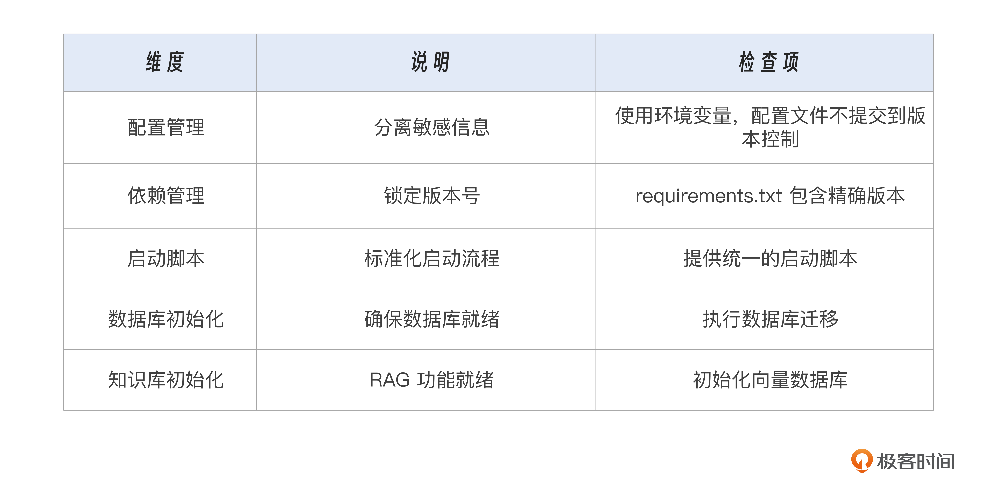
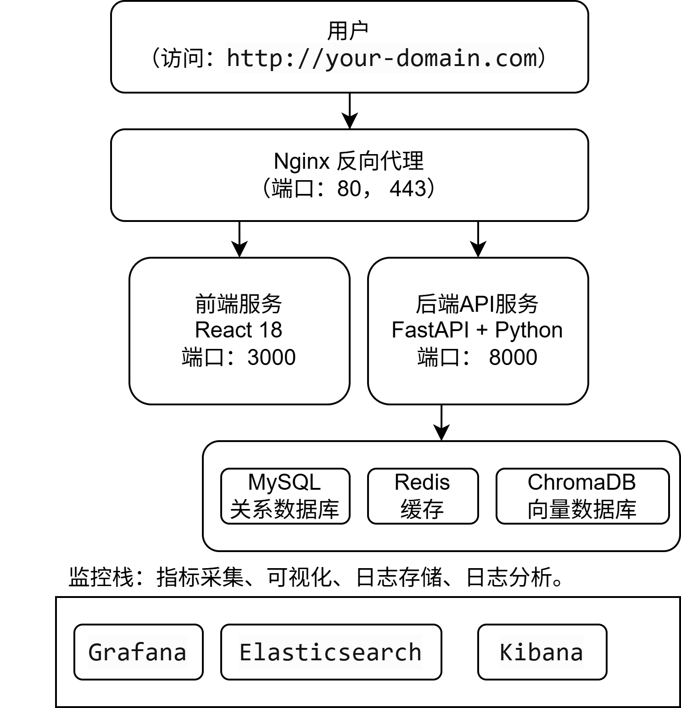
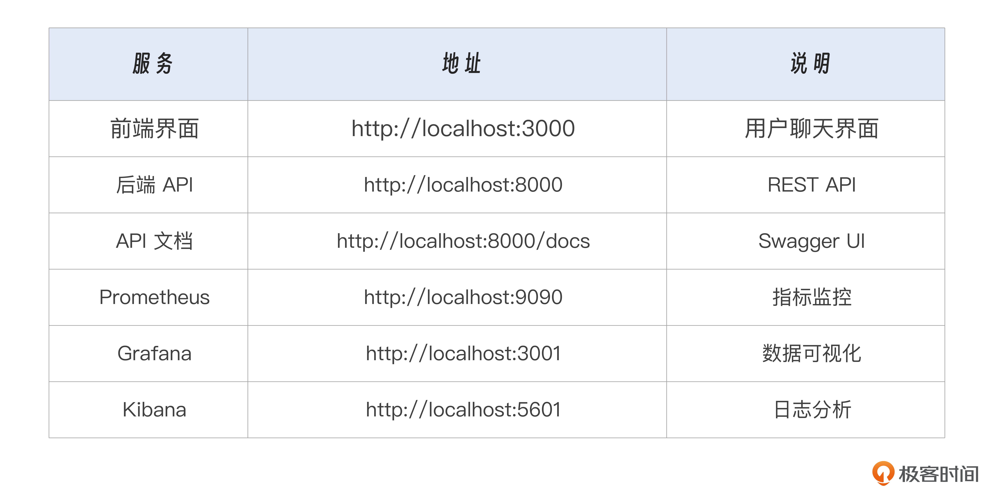
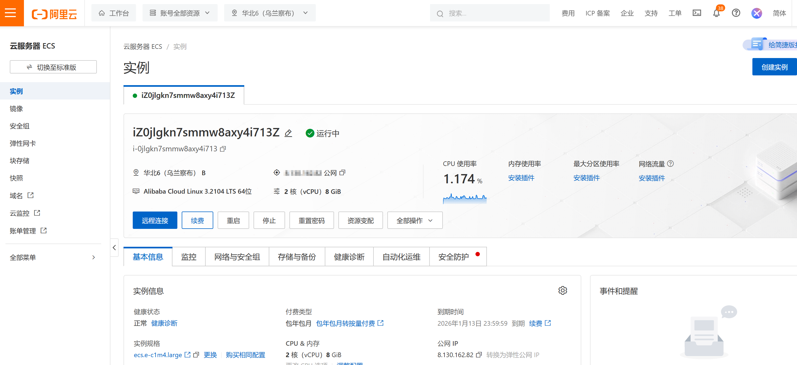
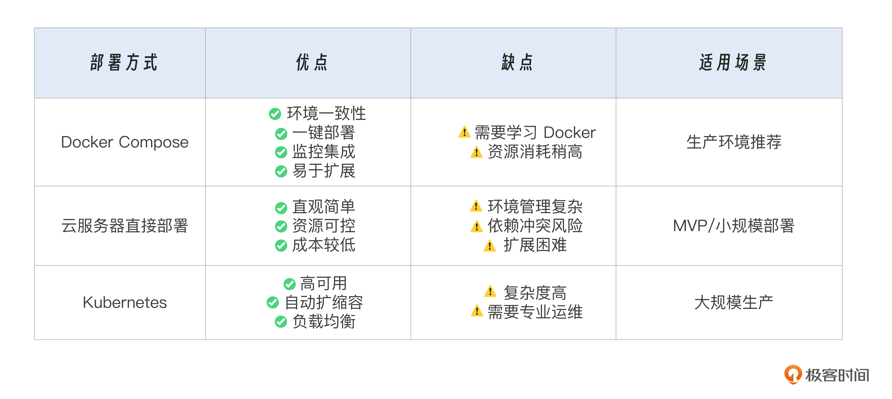
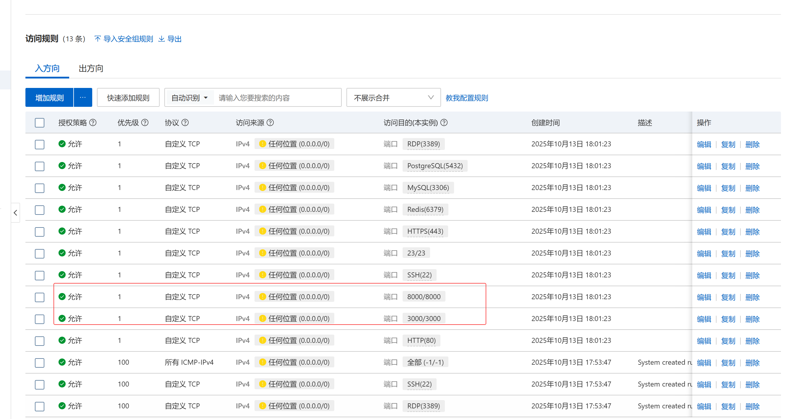

# 24｜多平台部署指南：从本地运行到云服务器、Docker容器上线

你好，我是袁从德。

当我们在命令行中第一次看到 AI 温柔地回复“我在这里陪着你”，那一刻，激动与成就感油然而生。但请记住，一个只能在开发者笔记本上运行的 AI 应用，就像一颗埋在地下的种子——潜力无限，却尚未破土。

真正的产品价值，始于用户指尖的点击，成于千万次真实的交互。而连接“开发完成”与“用户可用”的桥梁，正是部署（Deployment）。

通过前面的学习，我们已系统构建了一个完整的情感聊天机器人“心语”。它能理解情绪、拥有记忆、具备人格、支持多模态交互，并通过 RAG 和 Agent 实现知识调用与自主行动。然而，若不能稳定、安全、高效地部署到真实环境中，这一切智能都将停留在实验室阶段。

今天我们就来完成大模型应用开发旅程中的关键一跃——从本地开发环境走向生产级部署。我们将系统讲解如何将“心语”机器人部署到多种主流平台，涵盖：

- 如何将本地项目打包并部署到云服务器；
- 如何使用 Docker 容器化技术实现环境隔离与快速迁移；
- 如何配置 Nginx 反向代理与 HTTPS 加密通信；
- 如何实现前后端分离架构的协同部署；
- 如何选择合适的云服务商与部署策略。

这不仅是一次技术操作的指导，更是一场工程思维的升级。你将学会如何以**系统架构师**的视角思考部署问题：性能、安全、可维护性、扩展性缺一不可。

让我们带着已完成的“心语”项目，正式迈向真实世界。

# 一、部署前的准备：从开发环境到生产环境的思维转变

在动手部署之前，我们必须先完成一次认知上的切换：从**开发思维**转向**运维思维**。部署前需要做的准备你可以参考后面的表 24-1。



## 1.1 清理敏感信息：配置文件分离

在开发过程中，我们可能直接在代码中写入 API 密钥、数据库密码等敏感信息。但在生产环境中，这是极大的安全隐患。

**最佳实践：使用环境变量配置**

项目已内置支持使用 `config.env` 文件管理配置：

```
# 复制配置模板
cp config.env.example config.env
# 编辑配置文件
nano config.env
```

**关键配置项**：

```
# LLM API配置 - 使用阿里云通义千问(Qwen)
LLM_API_KEY=your_qwen_api_key_here
LLM_BASE_URL=https://dashscope.aliyuncs.com/compatible-mode/v1
# 默认模型
DEFAULT_MODEL=qwen-plus
# MySQL数据库配置
MYSQL_HOST=localhost
MYSQL_PORT=3306
MYSQL_USER=emotional_chat
MYSQL_PASSWORD=your_secure_password
# 向量数据库配置
CHROMA_PERSIST_DIRECTORY=./chroma_db
# 服务器配置
HOST=0.0.0.0
PORT=8000
DEBUG=false  # 生产环境必须为false
```

**安全提示：**

- 在 `.gitignore` 中添加 `config.env`；
- 不要将包含密钥的配置文件提交到版本控制系统；
- 为开发和生产环境使用不同的密钥。

## 1.2 优化依赖管理：锁定版本，确保一致性

项目已提供精确的依赖列表。

```
# 查看当前依赖
cat requirements.txt
# 生产环境安装
pip install --no-cache-dir -r requirements.txt
```

**依赖特点**：

- 已锁定版本号，确保一致性；
- 包含所有必需的多模态功能依赖；
- 包含阿里云 SDK 集成。

## 1.3 启动脚本标准化

项目已提供统一的启动脚本：

```
# 推荐的启动方式
python3 run_backend.py
# 该脚本会自动：
# - 检查依赖完整性
# - 初始化RAG知识库（如果不存在）
# - 配置日志系统
# - 启动FastAPI服务
```

**生产环境使用 Gunicorn**：

```
# 安装 Gunicorn
pip install gunicorn
# 启动服务
gunicorn -w 4 -k uvicorn.workers.UvicornWorker backend.app:app \
    --bind 0.0.0.0:8000 \
    --timeout 120 \
    --access-logfile /var/log/xinyu/access.log \
    --error-logfile /var/log/xinyu/error.log
```

> 提示：Gunicorn 是 Python 的高性能 WSGI HTTP Server，配合 Uvicorn Worker 可完美支持 FastAPI 的异步特性。

## 1.4 数据库初始化

在生产环境部署前，必须先初始化数据库。

```
# 使用 Makefile（推荐）
make db-init
make db-upgrade
# 或直接使用 Alembic
alembic upgrade head
```

## 1.5 RAG 知识库初始化

之后需要初始化专业心理健康知识库。

```
# 使用 Makefile（推荐）
make rag-init
# 或直接运行
python init_rag_knowledge.py
```

# 二、方式一：Docker 容器化部署（现代化云原生的标准范式）

随着微服务与 Kubernetes 的普及，Docker 已成为大模型应用部署的事实标准。它解决了“在我机器上能跑，但你的设备上却不行”这一经典难题。

## 2.1 为什么选择 Docker？

选择 Docker，是因为它具备后面这些优势。

- **环境一致性**：开发、测试、生产环境完全一致；
- **快速部署**：一键启动整个应用栈；
- **资源隔离**：避免依赖冲突；
- **易于扩展**：可无缝接入 K8s 集群；
- **监控集成**：项目已内置 Prometheus、Grafana 等监控栈。

## 2.2 项目 Docker 架构

项目提供了完整的 `docker-compose.yml` 配置，包含以下服务，如图 24-1 所示。



## 2.3 使用 Docker Compose 部署

**步骤 1：准备环境变量**

```
# 复制环境变量模板
cp config.env.example config.env
# 编辑配置文件
nano config.env
```

**步骤 2：启动所有服务**

```
# 构建并启动服务（在后台运行）
docker-compose up -d
# 查看服务状态
docker-compose ps
# 查看日志
docker-compose logs -f backend
```

**步骤 3：初始化数据库和知识库**

```
# 进入后端容器
docker-compose exec backend bash
# 初始化数据库
make db-upgrade
# 初始化RAG知识库
make rag-init
# 退出容器
exit
```

**步骤 4：验证部署**

```
# 健康检查
curl http://localhost:8000/health
# 查看系统信息
curl http://localhost:8000/system/info
# 测试聊天接口
curl -X POST http://localhost:8000/chat \
  -H "Content-Type: application/json" \
  -d '{"message": "你好", "user_id": "test_user"}'
```

**步骤 5：访问服务（表 24-2）**



## 2.4 自定义 Docker 配置

修改服务配置，编辑 `docker-compose.yml`：

```
services:
  backend:
    # 修改端口映射
    ports:
      - "8000:8000"
    # 修改资源限制
    deploy:
      resources:
        limits:
          cpus: '4'
          memory: 8G
        reservations:
          cpus: '2'
          memory: 4G
    # 添加环境变量
    environment:
      - WORKERS=4  # Gunicorn工作进程数
      - TIMEOUT=120  # 请求超时时间
```

**重新构建和启动**：

```
# 停止服务
docker-compose down
# 重新构建
docker-compose build
# 启动服务
docker-compose up -d
```

## 2.5 数据持久化

项目已配置数据卷挂载，确保数据不丢失。

```
volumes:
  mysql_data:           # MySQL数据
  redis_data:           # Redis数据
  chroma_db:            # 向量数据库
  logs:                 # 日志文件
  uploads:              # 上传文件
  prometheus_data:      # 监控数据
  grafana_data:         # 可视化数据
```

备份数据的命令如下。

```
# 备份MySQL数据
docker-compose exec mysql mysqldump -u root -p emotional_chat > backup.sql
# 恢复数据
docker-compose exec -T mysql mysql -u root -p emotional_chat < backup.sql
```

## 2.6 推送镜像到仓库（可选）

下一个是可选项，将自定义镜像推送到 Docker Hub 或其他镜像仓库。

```
# 构建镜像
docker-compose build backend
# 打标签
docker tag emotional_chat_backend your-username/xinyu-chatbot:v3.0.0
# 推送镜像
docker push your-username/xinyu-chatbot:v3.0.0
# 在其他服务器拉取运行
docker pull your-username/xinyu-chatbot:v3.0.0
docker run -d -p 8000:8000 your-username/xinyu-chatbot:v3.0.0
```

此后可在任意服务器拉取镜像运行，极大简化部署流程。

# 三、方式二：直接部署到云服务器（以阿里云 ECS 为例）

除了容器化部署，还有直接部署到云服务器的方案。这是最直观的部署方式，适合初学者快速上线 MVP 产品。

## 3.1 购买与初始化云服务器

**步骤 1：购买 ECS 实例**

登录阿里云控制台，购买一台 **ECS 实例**（推荐配置：2 核 8G，图 24-2）。



**步骤 2：配置安全组**

获取公网 IP 地址，设置安全组规则（图 24-3）：

开放端口：`80`（HTTP）、`443`（HTTPS）、`22`（SSH）建议限制 SSH 访问来源 IP，提升安全性。3000 端口和 8000 端口分别为前后端的端口

> **注意**：在生产环境中，3000 端口（前端）和 8000 端口（后端）应通过 Nginx 反向代理访问，不建议直接在安全组中暴露这些端口，以提高安全性。图 24-3 安全组设置

**步骤 3：远程连接**

```
# 使用SSH连接
ssh root@your-server-ip
# 更新系统
sudo apt update && sudo apt upgrade -y
# 安装必要工具
sudo apt install python3-pip python3-venv nginx git -y
# 创建项目目录
mkdir /var/www/xinyu && cd /var/www/xinyu
```

## 3.2 安装基础环境

之后我们安装一下基础环境。

```
# 更新系统
sudo apt update && sudo apt upgrade -y
# 安装Python和pip
sudo apt install python3.9 python3-pip python3-venv -y
# 安装Git
sudo apt install git -y
# 安装MySQL
sudo apt install mysql-server mysql-client -y
# 安装Nginx
sudo apt install nginx -y
# 安装Docker和Docker Compose（可选）
sudo apt install docker.io docker-compose -y
```

## 3.3 配置 MySQL 数据库

然后我们来配置 MySQL 数据库。

```
# 启动MySQL服务
sudo systemctl start mysql
sudo systemctl enable mysql
# 配置MySQL
sudo mysql_secure_installation
# 创建数据库和用户
mysql -u root -p << EOF
CREATE DATABASE emotional_chat CHARACTER SET utf8mb4 COLLATE utf8mb4_unicode_ci;
CREATE USER 'emotional_chat'@'localhost' IDENTIFIED BY 'your_secure_password';
GRANT ALL PRIVILEGES ON emotional_chat.* TO 'emotional_chat'@'localhost';
FLUSH PRIVILEGES;
EOF
```

## 3.4 上传代码并配置

**方法一：Git 克隆（推荐）**

```
# 创建项目目录
mkdir -p /var/www/xinyu
cd /var/www/xinyu
# 克隆代码
git clone https://github.com/yourname/emotional_chat.git .
# 或从已有仓库拉取
git pull origin main
```

**方法二：本地打包上传**

```
# 在本地执行
cd /home/workSpace/emotional_chat
tar -czf xinyu.tar.gz --exclude='.git' --exclude='__pycache__' --exclude='node_modules' .
# 上传到服务器
scp xinyu.tar.gz root@your-server-ip:/var/www/
# 在服务器上解压
cd /var/www
tar -xzvf xinyu.tar.gz
mv emotional_chat xinyu
cd xinyu
```

## 3.5 配置虚拟环境

```
cd /var/www/xinyu
# 创建虚拟环境
python3 -m venv venv
# 激活虚拟环境
source venv/bin/activate
# 安装依赖
pip install -r requirements.txt
# 配置环境变量
cp config.env.example config.env
nano config.env  # 编辑配置文件
```

## 3.6 初始化数据库和知识库

```
# 确保虚拟环境已激活
source venv/bin/activate
# 初始化数据库
make db-upgrade
# 初始化RAG知识库
make rag-init
```

## 3.7 配置 Gunicorn 和 Systemd

**创建 Gunicorn 启动脚本**：

```
# 创建启动脚本
nano /var/www/xinyu/start.sh
```

内容：

```
#!/bin/bash
cd /var/www/xinyu
source venv/bin/activate
export PROJECT_ROOT=/var/www/xinyu
# 使用Gunicorn启动服务
exec gunicorn -w 4 -k uvicorn.workers.UvicornWorker backend.app:app \
    --bind 0.0.0.0:8000 \
    --timeout 120 \
    --access-logfile /var/www/xinyu/log/access.log \
    --error-logfile /var/www/xinyu/log/error.log \
    --log-level info
```

**创建 Systemd 服务**：

```
sudo nano /etc/systemd/system/xinyu.service
```

内容：

```
[Unit]
Description=XinYu Chatbot Service
After=network.target mysql.service
[Service]
Type=notify
User=root
Group=www-data
WorkingDirectory=/var/www/xinyu
ExecStart=/var/www/xinyu/start.sh
Restart=always
RestartSec=10
EnvironmentFile=/var/www/xinyu/config.env
# 资源限制
MemoryMax=8G
CPUQuota=400%
[Install]
WantedBy=multi-user.target
```

**启用并启动服务**：

```
# 赋予执行权限
chmod +x /var/www/xinyu/start.sh
# 创建日志目录
mkdir -p /var/www/xinyu/log
# 重新加载systemd
sudo systemctl daemon-reload
# 启用服务（开机自启）
sudo systemctl enable xinyu
# 启动服务
sudo systemctl start xinyu
# 查看状态
sudo systemctl status xinyu
# 查看日志
sudo journalctl -u xinyu -f
```

## 3.8 配置 Nginx 反向代理

创建 Nginx 配置文件：

```
sudo nano /etc/nginx/sites-available/xinyu
```

内容如下：

```
server {
    listen 80;
    server_name your-domain.com;
    # 上传文件大小限制
    client_max_body_size 100M;
    # 后端API代理
    # 注意：location /api/ 会去掉 /api 前缀后转发到后端
    # 例如：/api/chat -> http://127.0.0.1:8000/chat
    location /api/ {
        proxy_pass http://127.0.0.1:8000/;
        proxy_set_header Host $host;
        proxy_set_header X-Real-IP $remote_addr;
        proxy_set_header X-Forwarded-For $proxy_add_x_forwarded_for;
        proxy_set_header X-Forwarded-Proto $scheme;
        # 超时设置
        proxy_connect_timeout 60s;
        proxy_send_timeout 60s;
        proxy_read_timeout 60s;
        # WebSocket支持（如果未来需要）
        proxy_http_version 1.1;
        proxy_set_header Upgrade $http_upgrade;
        proxy_set_header Connection "upgrade";
    }
    # 静态文件
    location /uploads/ {
        alias /var/www/xinyu/uploads/;
        expires 30d;
    }
    # 健康检查
    location /health {
        proxy_pass http://127.0.0.1:8000/health;
        access_log off;
    }
    # API文档
    location /docs {
        proxy_pass http://127.0.0.1:8000/docs;
    }
}
```

启用站点：

```
# 创建符号链接
sudo ln -s /etc/nginx/sites-available/xinyu /etc/nginx/sites-enabled/
# 测试配置
sudo nginx -t
# 重新加载Nginx
sudo systemctl reload nginx
```

访问 [http://your-domain.com/docs]() 即可看到 API 文档。

# **四、HTTPS 安全加固：让用户安心交谈**

情感聊天涉及大量隐私对话，所以必须启用 HTTPS 加密传输。

## 4.1 使用 Let’s Encrypt 免费证书

**安装 Certbot**：

```
# Ubuntu/Debian
sudo apt update
sudo apt install certbot python3-certbot-nginx -y
# CentOS/RHEL
sudo yum install certbot python3-certbot-nginx -y
```

**申请证书**：

```
# 自动配置Nginx
sudo certbot --nginx -d your-domain.com
# 或手动配置
sudo certbot certonly --nginx -d your-domain.com
```

**自动续期**：

Certbot 会自动配置 cron 任务，无需手动操作。可测试续期：

```
sudo certbot renew --dry-run
```

## 4.2 配置 HTTPS Nginx

Certbot 会自动修改 Nginx 配置，但也可手动配置：

```
server {
    listen 80;
    server_name your-domain.com;
    # 强制跳转HTTPS
    return 301 https://<!--§§MATH_0§§-->request_uri;
}
server {
    listen 443 ssl http2;
    server_name your-domain.com;
    # SSL证书配置
    ssl_certificate /etc/letsencrypt/live/your-domain.com/fullchain.pem;
    ssl_certificate_key /etc/letsencrypt/live/your-domain.com/privkey.pem;
    # SSL优化配置
    ssl_protocols TLSv1.2 TLSv1.3;
    ssl_ciphers HIGH:!aNULL:!MD5;
    ssl_prefer_server_ciphers on;
    ssl_session_cache shared:SSL:10m;
    ssl_session_timeout 10m;
    # HSTS
    add_header Strict-Transport-Security "max-age=31536000; includeSubDomains" always;
    # 后端API代理
    # 注意：location /api/ 会去掉 /api 前缀后转发到后端
    # 例如：/api/chat -> http://127.0.0.1:8000/chat
    location /api/ {
        proxy_pass http://127.0.0.1:8000/;
        proxy_set_header Host $host;
        proxy_set_header X-Real-IP $remote_addr;
        proxy_set_header X-Forwarded-For $proxy_add_x_forwarded_for;
        proxy_set_header X-Forwarded-Proto $scheme;
    }
    # 其他配置...
}
```

## 4.3 防火墙配置

配置 UFW 防火墙：

```
# 安装UFW
sudo apt install ufw -y
# 允许SSH
sudo ufw allow 22/tcp
# 允许HTTP和HTTPS
sudo ufw allow 80/tcp
sudo ufw allow 443/tcp
# 启用防火墙
sudo ufw enable
# 查看状态
sudo ufw status
```

## 五、部署策略对比与选型建议

部署方式对比如表 24-3 所示。



推荐路径：

初期 MVP 产品阶段，采用云服务器 + Gunicorn 的方案；

小规模发展的成长期，可以选择 Docker Compose 的方案；

进入大规模应用的成熟期，可以选择 Kubernetes + CI/CD 的方案。

```
初期 (MVP) → 云服务器 + Gunicorn
          ↓
成长期 (小规模) → Docker Compose
          ↓
成熟期 (大规模) → Kubernetes + CI/CD
```

# 六、常见问题排查与解决方案

多平台的部署可能会遇到一些问题，这里我梳理了最常见的六个问题，提供了对应排查方法与解决方案供你参考。

### 问题 1：前端无法连接后端 API

**症状**：前端请求返回 404 或 CORS 错误

**排查**：

```
# 检查后端是否运行
curl http://localhost:8000/health
# 检查Nginx配置
sudo nginx -t
sudo nginx -T | grep proxy_pass
# 检查防火墙
sudo ufw status
```

**解决方案**：

确保后端服务正常运行检查 Nginx 代理配置正确配置正确的 CORS 域名（生产环境不要用`*`）

### 问题 2：向量数据库初始化失败

**症状**：RAG 功能不可用，日志显示 ChromaDB 错误

**排查**：

```
# 检查ChromaDB目录权限
ls -la chroma_db/
# 检查存储空间
df -h
# 查看日志
tail -f log/application.log
```

**解决方案**：

```
# 重新初始化
make rag-init
# 或手动创建目录
mkdir -p chroma_db
chmod 755 chroma_db
```

### 问题 3：Gunicorn 超时或崩溃

**症状**：API 请求超时或 500 错误

**排查**：

```
# 查看Gunicorn日志
tail -f log/error.log
# 查看系统资源
top
free -h
```

**解决方案**：

增加超时时间：

```
# 修改启动脚本
gunicorn -w 4 -k uvicorn.workers.UvicornWorker backend.app:app \
    --bind 0.0.0.0:8000 \
    --timeout 120  # 增加到120秒
```

增加工作进程数：

```
# 根据CPU核心数调整
gunicorn -w 8 -k uvicorn.workers.UvicornWorker ...
```

添加健康检查：

```
# 监控服务健康
curl http://localhost:8000/health
```

### 问题 4：MySQL 连接失败

**症状**：数据库连接超时

**排查**：

```
# 测试MySQL连接
mysql -u emotional_chat -p -h localhost
# 检查MySQL服务
sudo systemctl status mysql
# 查看MySQL日志
sudo tail -f /var/log/mysql/error.log
```

**解决方案**：

确保 MySQL 服务运行：sudo systemctl start mysql检查防火墙规则验证用户权限：

```
SHOW GRANTS FOR 'emotional_chat'@'localhost';
```

### 问题 5：Docker 容器无法启动

**症状**：docker-compose up 失败

**排查**：

```
# 查看详细日志
docker-compose logs backend
# 检查镜像
docker images
# 检查网络
docker network ls
```

**解决方案**：

```
# 清理并重建
docker-compose down -v
docker-compose build --no-cache
docker-compose up -d
```

### 问题 6：API 响应缓慢

**症状**：对话响应时间过长

**排查**：

```
# 查看监控指标
curl http://localhost:9090/api/v1/query?query=up
# 查看慢查询日志
mysql -u root -p -e "SHOW PROCESSLIST;"
```

**解决方案**：

启用缓存（Redis）优化向量检索（减少`top_k`）使用连接池添加 CDN 加速静态资源

# 七、监控和维护

## 7.1 系统监控

项目已集成 Prometheus 和 Grafana 监控栈。

**Prometheus 指标**：

```
# 查看所有指标
curl http://localhost:9090/api/v1/label/__name__/values
# 查询指标
curl 'http://localhost:9090/api/v1/query?query=up'
```

**Grafana 仪表板**：访问 [http://localhost:3001]() 登录 Grafana（默认账号：admin/admin），查看预配置的仪表板。**注意**：如果 Grafana 使用默认 3000 端口，需要修改 docker-compose.yml 中的端口映射为 3001:3000，以避免与前端服务端口冲突。

## 7.2 日志管理

**查看应用日志**：

```
# 实时查看
tail -f log/application.log
# 查看错误日志
tail -f log/error.log
# 搜索特定日志
grep "ERROR" log/application.log
```

**日志轮转**：

项目已配置自动日志轮转（10MB/5 个备份），无需手动管理。

**Docker 日志**：

```
# 查看容器日志
docker-compose logs -f backend
# 查看最近100行
docker-compose logs --tail=100 backend
# 导出日志
docker-compose logs backend > backend.log
```

## 7.3 数据库维护

**备份数据库**：

```
# 手动备份
mysqldump -u emotional_chat -p emotional_chat > backup_$(date +%Y%m%d).sql
# 压缩备份
mysqldump -u emotional_chat -p emotional_chat | gzip > backup_$(date +%Y%m%d).sql.gz
# 设置自动备份（crontab）
0 2 * * * mysqldump -u emotional_chat -p[password] emotional_chat > /backup/emotional_chat_$(date +\%Y\%m\%d).sql
```

**恢复数据库**：

```
# 恢复
mysql -u emotional_chat -p emotional_chat < backup_20250116.sql
```

**数据库清理**：

```
# 清理旧日志
mysql -u emotional_chat -p << EOF
DELETE FROM emotional_chat.system_logs WHERE created_at < DATE_SUB(NOW(), INTERVAL 90 DAY);
EOF
# 优化表
mysql -u emotional_chat -p -e "OPTIMIZE TABLE emotional_chat.chat_messages;"
```

## 7.4 性能优化

**数据库索引**：

```
-- 查看慢查询
SHOW VARIABLES LIKE 'slow_query%';
-- 添加索引
CREATE INDEX idx_session_created ON chat_messages(session_id, created_at);
CREATE INDEX idx_user_emotion ON chat_messages(user_id, emotion);
```

**缓存策略**：

```
# Redis缓存（项目已配置）
docker-compose exec redis redis-cli ping
# 查看缓存统计
docker-compose exec redis redis-cli INFO stats
```

## 7.5 安全审计

**定期更新依赖**：

```
# 检查过时的包
pip list --outdated
# 更新依赖
pip install --upgrade -r requirements.txt
# Docker镜像更新
docker-compose pull
docker-compose up -d
```

**安全扫描**：

```
# 使用Docker安全扫描
docker scan emotional_chat_backend
# 使用npm audit（前端）
cd frontend
npm audit
npm audit fix
```

## 7.6 应急预案

**服务降级**：

```
# 关闭非关键功能
# 编辑config.env，禁用RAG或Agent
RAG_ENABLED=false
AGENT_ENABLED=false
# 重启服务
sudo systemctl restart xinyu
```

**回滚版本**：

```
# Git回滚
git log --oneline
git checkout <previous-commit-hash>
# 重新部署
docker-compose down
docker-compose up -d
```

**紧急重启**：

```
# 快速重启
sudo systemctl restart xinyu
# Docker重启
docker-compose restart backend
```

# 八、结语：部署不是终点，而是新旅程的起点

当我们成功将“心语“机器人部署到云端，看着第一个真实用户发来消息：“谢谢你听我说这些……我觉得好多了”，那一刻，所有的技术细节都化作了温暖的回响。

本指南我们完成了从本地开发到多平台部署的全过程，掌握了两种核心部署方式。

**Docker 容器化，**迈向现代化工程：

- 通过容器化技术实现环境一致性，解决了“在我机器上能跑”的经典问题。
- 一键部署、快速迁移，支持多环境（开发、测试、生产）的无缝切换。
- 资源隔离、依赖管理自动化，让运维工作更加高效可靠。

**云服务器部署，**打下坚实基础：

- 直接部署到云服务器，掌握从系统配置到服务管理的全流程。
- 通过 Nginx 反向代理、Systemd 服务管理，构建稳定可靠的生产环境。
- 理解底层原理，为后续的容器化部署和云原生架构打下坚实基础。

但这并非终点，而是新旅程的起点。一个真正成熟的大模型应用，还需面对以下问题。

- 如何监控系统健康？（项目已集成 Prometheus/Grafana）
- 如何应对流量高峰？（负载均衡与自动扩缩容）
- 如何持续迭代而不中断服务？（蓝绿部署 / 灰度发布）

**更重要的是，部署之后的价值闭环**：

> 技术的终极意义，不在于它多先进，而在于它能否真正帮助一个人，哪怕只是片刻的安慰。

你今天部署的，不仅仅是一个 AI 聊天机器人，更是一个可能改变他人生活的数字生命体。它的每一次回应，都承载着你的设计哲学与人文关怀。

在未来的迭代中，我们将继续深化应用监控与运维体系的构建，学习如何通过日志分析、性能追踪与故障恢复机制，让“心语”在风雨中依然稳健前行。

# 思考题

在完成“心语”情感聊天机器人的部署后，假设你的应用突然收到大量用户反馈：对话响应延迟显著增加，部分请求甚至超时失败。此时你作为系统负责人，需快速定位并解决问题。

请结合本章所学内容，系统性地回答以下问题：

你会从哪几个维度进行排查？（提示：可从网络、服务、资源、依赖等层面展开）如果最终定位到问题是“向量数据库 ChromaDB 在高并发下检索性能急剧下降”，你会采取哪些短期应急措施和长期优化策略？为什么在生产环境中使用 Docker 或云服务器时，仅靠重启服务不能从根本上解决问题？你认为一个具备“自愈能力”的部署架构应包含哪些关键组件？

> 要求：回答需体现运维思维与工程化视角，结合这一讲提到的技术栈（如 Nginx、Gunicorn、Docker、Prometheus、Redis 等），提出可落地的解决方案，而非泛泛而谈。希望通过今天的学习，让你对情感机器人的开发全程有个大致认识。如果有任何疑问，期待你在留言区和我交流。




---
来源：极客时间
链接：https://time.geekbang.org/column/article/937680
日期：2026-05-18
