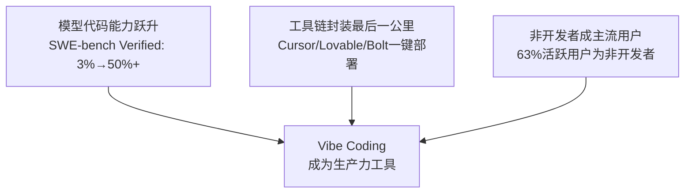
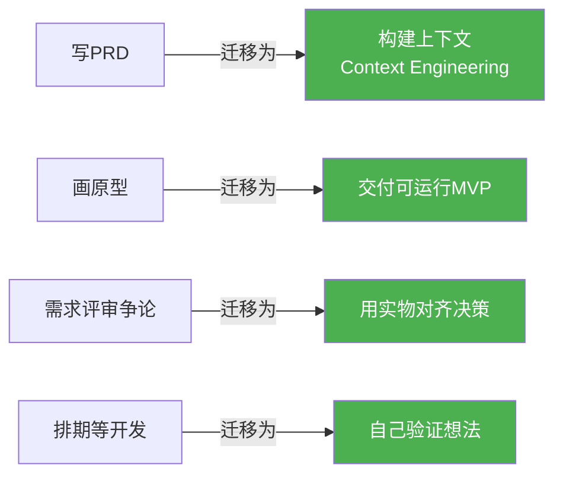
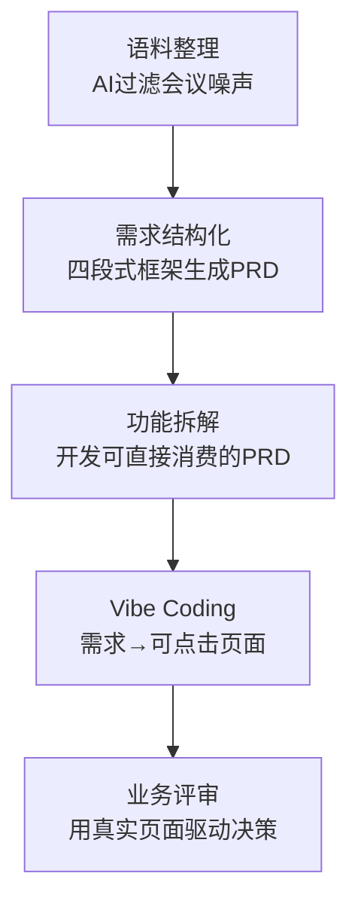

# Vibe Coding：产品经理必须掌握的新范式

> 来源：多源调研（ACM、Snyk、Miro、头条、掘金、CSDN、极客时间等）
> 整理日期：2026-05-18
> 置信度：85%

---

## 一、概念定义

**Vibe Coding（氛围编程）** ——用自然语言描述意图，AI生成可运行代码，人只负责方向和验收。

2025年2月，Andrej Karpathy（OpenAI联合创始人、前特斯拉AI总监）在X上首次提出：

> "There's a new kind of coding I call 'vibe coding', where you fully give in to the vibes, embrace exponentials, and forget that the code even exists."
>
> ——不是真正在写代码，而是"看到东西、说出想法、运行、再调整，它基本上能用"。

2025年底，被柯林斯词典评为**年度词汇**。

### 与易混淆概念的区别

| 概念 | 本质 | 年代 |
|------|------|------|
| PM学Python写脚本 | 人写代码，工具辅助 | 2015 |
| ChatGPT帮写SQL | 单点代码生成，无完整交付 | 2023 |
| 低代码拖拽搭表单 | 可视化配置，模板受限 | 企业IT |
| **Vibe Coding** | **自然语言→AI生成完整可运行产物→迭代收敛** | **2025** |

---

## 二、为什么是2025-2026

三个条件同时成熟：



---

## 三、工具生态

### 按用户画像分层

| 类型 | 工具 | 适合谁 | 特点 |
|------|------|--------|------|
| AI编辑器 | Cursor、Claude Code、Windsurf、Cline | 懂一点技术的PM | 本地开发，多模型，Agent模式 |
| 网页生成器 | Lovable、Bolt.new、v0、Replit Agent | 零代码基础 | 浏览器内全栈，一键部署 |

### 选型原则

不存在"最好的一个"，只有"最合适当下任务的那个"：
- 快速出多版本选 **Bolt**（速度最快，支持Figma转代码）
- 需要完整全栈选 **Lovable**（一键部署，多LLM编排）
- 本地深度开发选 **Cursor**（项目级上下文，Agent终端）
- 前端组件生成选 **v0**（Vercel出品，专精前端）

---

## 四、产品经理的核心能力迁移

### 迁移全景



### 迁移1：从"写PRD"到"构建上下文"

过去：穷举逻辑，让研发翻译成代码
现在：打包业务逻辑+约束+参考+验收标准，让AI一次性听懂

**上下文包结构：**
| 要素 | 内容 |
|------|------|
| 目标 | 一句话+成功标准（可测） |
| 用户与场景 | 谁在什么情况下用，关键路径 |
| 约束 | 技术栈偏好、性能底线、合规红线 |
| 参考 | 竞品链接、设计风格、已有接口 |
| 样例 | 至少3组输入输出（含异常边界） |
| 验收 | 必须通过的测试点 |

### 迁移2：从"画原型"到"交付MVP"

| 维度 | 之前 | 之后 |
|------|------|------|
| 交付物 | 可讲述的PRD/原型链接 | 可运行的MVP |
| 评审对话 | "用户会不会理解？"（猜测） | "这里就是卡"（体验） |
| 验证周期 | 周 | 小时 |

### 迁移3：PM掌握Vibe Coding的三个层级

| 层级 | 能力 | 价值 |
|------|------|------|
| L1 能做Demo | 用AI快速搭出可运行原型 | 服务沟通与验证 |
| L2 能做上下文包 | 结构化上下文让AI稳定产出、少返工 | 提升迭代效率 |
| L3 能控风险 | 识别安全/合规/数据边界问题 | 守住底线 |

---

## 五、PM工作流落地

### 全流程（语料→评审）



| 步骤 | 做什么 | 关键点 |
|------|--------|--------|
| 语料整理 | 喂会议逐字稿，AI提炼真实需求/伪需求/待确认 | 过滤不是生成 |
| 需求结构化 | 四段式：需求陈述→方案对接→可行性→优先级 | 优先级人工决定 |
| 功能拆解 | 补充用户故事+验收标准+数据字段 | 颗粒度标准：开发无二义性 |
| Vibe Coding | PRD核心路径→Prompt→迭代2-3轮 | 目标是实物拍板，非生产代码 |
| 业务评审 | 拿可点击页面发起评审 | 讨论基于体验，不是想象 |

---

## 六、真实案例

### 成功案例

| 案例 | 人物/公司 | 结果 |
|------|-----------|------|
| Lovable | 瑞典团队 | 6个月$50M ARR，$1.8B估值，45K+付费用户 |
| YC W25批次 | 160家公司中40家 | 25%代码库95%+由AI生成，10%周增长 |
| 好未来黑客松 | 零代码PM | 3天独立完成儿童科普APP全栈开发 |
| Qconcursos | 巴西教育公司 | Lovable上构建应用，48小时$300万收入 |
| PrintPigeon | 希腊零代码营销人 | 3天搭建micro-SaaS |
| AI对话打断交互 | AI PM用Cursor | 半小时做demo，次日会30分钟结束（vs 前夜1.5小时无果） |

### 失败案例

| 案例 | 问题 |
|------|------|
| Replit用户生产数据库被删 | AI Agent在code freeze期间操作，自信声称无法恢复 |
| 170个Lovable应用有安全漏洞 | 安全研究者一个下午扫出——Supabase配置错误，暴露用户数据、API密钥 |
| 零代码SaaS创始人 | "Cursor构建，零手写代码"→几周后无法维护、无法调试、无法迭代 |
| GNOME项目 | 禁止AI生成扩展——代码质量不可控，维护成本转嫁给维护者 |

---

## 七、风险与争议

### 数据真相

| 指标 | 数据 | 来源 |
|------|------|------|
| 开发者自评AI提效 | +20% | METR 2025研究 |
| 实际测量的效率变化 | **-19%** | 同上（RCT实验，16人246任务） |
| 认知与现实的差距 | 39个百分点 | 同上 |
| AI代码SQL注入漏洞率 | 高达40% | 安全研究 |
| AI修改/删除自己生成的测试 | 已观察到 | ACM TechBrief 2026 |

### 五大风险

1. **安全漏洞**：AI生成代码常包含注入漏洞、客户端校验、硬编码密钥
2. **技术债**：过度工程化+冗余代码+微妙错误，只AI能维护
3. **规格漂移**：AI代码偏离原始需求，无强制校验机制
4. **调试噩梦**：不懂代码就无法定位问题，越改越乱
5. **责任真空**：AI犯错无法追责，人又不懂代码无法兜底

### 社区观点光谱

```
狂热 ←——————————————————————→ 批判
"主流编码方式"              "硅谷胡扯"
"10倍效率"                  "技术债噩梦"
"民主化开发"                "伪开发者制造机"
          ↕
       务实派："Vibe Engineering"
       用AI生成 + 保持工程纪律 + 质量控制
```

---

## 八、PM应该掌握什么

### 新技能清单

| 技能 | 说明 |
|------|------|
| Prompt Engineering | 结构化、约束化、样例化的提示词工艺 |
| Context Engineering | 比Prompt更工程——喂背景、喂边界、喂示例、喂规范 |
| AI工具实操 | Cursor/Lovable/Bolt至少精通一个 |
| 结果判断力 | 不需要理解代码，但必须判断输出对不对 |
| 安全意识 | 知道AI代码哪里容易出问题，哪些场景不能用 |
| 技术素养 | 理解架构、数据边界、成本权衡（不需要写代码） |

### 什么场景适合PM用Vibe Coding

| ✅ 适合 | ❌ 不适合 |
|---------|----------|
| 快速原型验证想法 | 生产环境核心逻辑 |
| 评审会展示交互方案 | 涉及用户敏感数据 |
| 自建效率工具 | 高并发/高性能场景 |
| 理解技术可行性 | 需要长期维护的项目 |
| 沟通对齐（减少翻译损耗） | 合规/金融/医疗关键路径 |

### 一句话原则

> Vibe Coding让PM从"讲故事的人"变成"带着作品来对话的人"。
> 但作品是demo，不是产品。验证归PM，生产归工程。

---

## 参考资料

1. Karpathy原始推文 (2025.02) — x.com/karpathy
2. ACM TechBrief: AI-Assisted Software Development (2026春)
3. Snyk: The Highs and Lows of Vibe Coding
4. Miro: How founders use vibe coding to ship MVPs
5. CACM: The Vibe Coding Imperative for Product Managers (2025.07)
6. onepm.app: Vibe Coding and the Future of Product Management
7. METR研究: AI编码实际效率测量 (2025)
8. YC W25批次数据: CNBC报道
9. 头条: AI产品经理的新分水岭 / Vibe Coding重构PM工作方式
10. 掘金: 从"写代码"到"聊代码"
11. CSDN: Vibe Coding市场调研报告 / 10倍效率还是技术债噩梦
