# Claude Code 企业级全链路开发 - 研发全流程完整指南

> **文档版本**: v2.1
> **生成日期**: 2026-05-12
> **课程来源**: 极客时间 - Claude Code 企业级全链路开发实战

---

## 一、核心研发全流程总览

### 1.1 流程总图

```mermaid
%%{init: {'theme': 'base', 'themeVariables': {'fontSize': '16px'}}}%%
flowchart TB
    subgraph PRE["🔵 准备阶段（人类主导）"]
        direction LR
        P1["①需求分析<br/><small>咨询模式</small>"]
        P2["②边界定义<br/><small>人类主导</small>"]
        P3["③数据建模<br/><small>人类主导</small>"]
        P4["④规范编写<br/><small>人类主导<br/>⭐SDD核心</small>"]
    end

    subgraph DESIGN["🟠 设计阶段（咨询+人类主导）"]
        direction LR
        D1["⑤架构设计<br/><small>咨询模式</small>"]
        D2["⑥任务拆解<br/><small>人类主导</small>"]
    end

    subgraph EXECUTE["🟢 执行阶段（执行模式）"]
        direction LR
        E1["⑦编码执行<br/><small>执行模式</small>"]
        E2["⑧基础设施<br/><small>咨询模式</small>"]
        E3["⑨联调测试<br/><small>执行模式</small>"]
    end

    subgraph DEPLOY["🟣 交付阶段（执行模式）"]
        direction LR
        F1["⑩部署交付<br/><small>执行模式</small>"]
    end

    PRE --> DESIGN --> EXECUTE --> DEPLOY

    style PRE fill:#E3F2FD,stroke:#1565C0,stroke-width:3px,color:#000000
    style DESIGN fill:#FFF3E0,stroke:#E65100,stroke-width:3px,color:#000000
    style EXECUTE fill:#E8F5E9,stroke:#2E7D32,stroke-width:3px,color:#000000
    style DEPLOY fill:#F3E5F5,stroke:#7B1FA2,stroke-width:3px,color:#000000
    style P1 fill:#BBDEFB,stroke:#1565C0,stroke-width:2px,color:#000000
    style P2 fill:#BBDEFB,stroke:#1565C0,stroke-width:2px,color:#000000
    style P3 fill:#BBDEFB,stroke:#1565C0,stroke-width:2px,color:#000000
    style P4 fill:#FFECB3,stroke:#F57F17,stroke-width:3px,color:#000000
    style D1 fill:#FFE0B2,stroke:#E65100,stroke-width:2px,color:#000000
    style D2 fill:#FFE0B2,stroke:#E65100,stroke-width:2px,color:#000000
    style E1 fill:#C8E6C9,stroke:#2E7D32,stroke-width:2px,color:#000000
    style E2 fill:#C8E6C9,stroke:#2E7D32,stroke-width:2px,color:#000000
    style E3 fill:#C8E6C9,stroke:#2E7D32,stroke-width:2px,color:#000000
    style F1 fill:#E1BEE7,stroke:#7B1FA2,stroke-width:2px,color:#000000
```



### 1.2 阶段概览表

| 序号 | 研发阶段 | 核心产出物 | Agent协作模式 |
|------|----------|-----------|---------------|
| 1 | 需求分析 | 功能全景清单 | 咨询模式 |
| 2 | 边界定义 | 产品边界文档 | 人类主导 |
| 3 | 数据建模 | ER图、数据模型 | 人类主导 |
| 4 | 规范编写 | CLAUDE.md | 人类主导 |
| 5 | 架构设计 | 架构方案 | 咨询模式（方案对比） |
| 6 | 任务拆解 | WBS任务清单 | 人类主导 |
| 7 | 编码执行 | 功能代码 | 执行模式 |
| 8 | 基础设施 | 公共组件 | 咨询模式 |
| 9 | 联调测试 | 可运行系统 | 执行模式 |
| 10 | 部署交付 | Docker镜像 | 执行模式 |

### 1.3 Agent协作模式速查

| 模式 | 使用场景 | 人类动作 | Agent动作 |
|------|---------|----------|-----------|
| **咨询模式** | 需求不清楚、方案不确定 | 提问→判断取舍 | 提供方案→对比分析 |
| **执行模式** | 任务已明确 | 拆解任务→验收结果 | 执行任务→输出结果 |
| **人类主导** | 架构决策、边界定义 | 想清楚→拍板 | 辅助执行 |

---

## 二、十大研发阶段详解

---

### 阶段1：需求分析

| 属性 | 内容 |
|------|------|
| **阶段说明** | 先调研标杆产品，再用五步法定边界 |
| **Agent协作模式** | 咨询模式 |
| **核心产出物** | 功能全景清单、产品边界文档、CLAUDE.md项目概述 |
| **关键原则** | AI给的信息不能直接信，要验证 |
| **来源** | batch-03（课程03讲） |

#### 第一步：调研标杆（让Agent梳理功能全景）

**目的**: 在动手之前，先理解这个领域的全貌。你连全貌都没有，怎么知道哪些功能是核心、哪些是边缘？

**原文引用**:
> "做任何项目之前，第一步不是想'我要做什么'，而是看'业界最好的在做什么'。不是要抄，而是要理解这个领域的全貌。"
> —— 课程03讲

**Agent协作方式**:

```
向Agent提问：
"帮我梳理 Dify（https://dify.ai）这个产品的核心功能模块，
按类别分组，每个模块用一两句话说明它做什么。"
```

**AI输出示例**:

```
一、模型管理
   - 多模型接入（OpenAI、Claude、Gemini等）
   - API Key管理
   - 模型配置与切换

二、Agent管理
   - Agent创建与配置
   - System Prompt设计
   - 工具绑定

三、工作流编排
   - 可视化拖拽
   - 条件分支
   - 并行执行

四、知识库/RAG
   - 文档上传
   - 向量存储
   - 语义检索

五、工具集成
   - 内置工具
   - 自定义工具
   - MCP协议支持
```

**注意事项**:

```
⚠️ AI给的信息不能直接信，你需要验证
- 拿着AI的清单和官方文档/GitHub README核对
- 修正过时的描述
- 补充AI遗漏的内容（如MCP协议支持）
```

**原文引用**:
> "AI 给的信息不能直接信，你要验证。比如，我就拿着这个清单和 Dify 的官方文档、GitHub README 对了一遍，修正了几个过时的描述，补上了它遗漏的 MCP 协议支持。"
> —— 课程03讲

---

#### 第二步：功能取舍（三问裁剪法）

**目的**: 确定"做哪些、不做哪些、做到什么程度"，这是最关键的一步，决定了后续所有决策的方向。

**原文引用**:
> "功能全景有了，接下来是最关键的一步：做哪些、不做哪些。"
> —— 课程03讲

**三问裁剪法**:

| 问题 | 目的 | 案例 |
|------|------|------|
| **第一问：没有它产品还成立吗？** | 区分核心和边缘 | 模型管理/Agent配置/对话引擎砍掉任何一个产品不成立 |
| **第二问：做到什么程度够用？** | 确定边界 | 知识库只做TXT+固定分块，不做PDF解析 |
| **第三问：能不能一句话说清楚？** | 验证产品定位 | "可本地部署的AI Agent平台" |

**Agent协作方式**:

```
向Agent提问：
"我要基于 Dify 做一个简化版AI Agent平台Hify。
约束：一个人开发，面向20-50人使用，本地部署。
请从刚才的功能列表中，判断哪些必须做、哪些可以砍掉，给出每个的理由。"
```

**AI分析+人类决策**:

| 功能 | AI建议 | 人类决策 |
|------|--------|----------|
| 模型管理 | 必须做 | ✅ 做 |
| Agent配置 | 必须做 | ✅ 做 |
| 知识库/RAG | 降级做 | ✅ 做（一期只支持TXT） |
| 可视化工作流 | 砍掉 | ✅ 砍掉（只做JSON配置） |
| 多租户/权限 | 砍掉 | ✅ 砍掉（团队内部不需要） |
| MCP工具 | 保留 | ✅ 做 |

**人类决策案例**:

```
Claude建议保留RAG：
"接入私有文档，这是团队用Hify而不是直接用ChatGPT的主要理由"

Claude建议FastAPI：
"Python生态碾压其他，LangChain/LlamaIndex向量化库都是Python原生"

人类否决：
"一个人维护Java+Python两套技术栈，复杂度翻倍"
```

---

#### 第三步：技术选型

**目的**: 基于约束条件，选择最匹配的技术栈。技术选型不是选最好的技术，是选最匹配当前约束的技术。

**原文引用**:
> "技术选型不是选最好的技术，是选最匹配当前约束的技术。"
> —— 课程03讲

**Agent协作方式**:

```
向Agent提问：
"帮我对比以下技术方案：
1)Spring Boot+Vue 2)Go+React 3)FastAPI+Vue
重点考虑：开发效率、生态成熟度、AI SDK支持、运维复杂度"
```

**人类追问**:

```
"一个人做企业级后端，Spring Boot和FastAPI在工程化能力上差距多大？
考虑：异常处理体系、事务管理、ORM生态"
```

**人类最终决策**:

| 维度 | AI建议 | 人类决策 | 理由 |
|------|--------|----------|------|
| 技术栈 | FastAPI（AI生态好） | Spring Boot | 工程化成熟、一套技术栈 |
| 前端 | Vue/React都可以 | Vue | 管理后台场景成熟 |
| 架构 | 建议Java+Python混合 | 否决 | 一个人维护两套太复杂 |

---

#### 第四步：运维预期

**目的**: 在动手之前先想清楚怎么跑。功能做完了往服务器上一扔，等出问题了才发现很多事没有提前想。

**原文引用**:
> "很多人做项目只想功能，不想运维。功能做完了往服务器上一扔，等出问题了才发现很多事没有提前想。"
> —— 课程03讲

**Agent协作方式**:

```
向Agent提问：
"Hify是AI Agent平台，Docker Compose本地部署，20-50人同时在线，
主要压力在对话接口（流式SSE）。
请估算QPS、建议缓存策略、列出需要提前考虑的运维事项"
```

**AI分析要点**:

| 问题 | AI结论 | 人类决策 |
|------|--------|----------|
| QPS | 峰值3-5QPS，瓶颈在LLM长连接不在并发 | 认可，Spring Boot单实例够用 |
| 缓存 | 模型配置/Agent配置变更低频，用Redis | 采纳 |
| 长连接 | 50并发SSE每个持续10-30秒 | 需要独立线程池隔离 |
| Nginx | proxy_buffering必须关掉 | 重要，提前想清楚 |

---

#### 第五步：写进CLAUDE.md

**目的**: 把前面想清楚的所有东西落成文字，让Claude Code永远在轨道上。

**原文引用**:
> "前面想清楚的所有东西，产品定义、功能范围、技术选型、运维预期，都要落成文字，写进 CLAUDE.md。"
> —— 课程03讲

**Agent协作方式**:

```
向Agent提问：
"根据我们的讨论，把Hify的项目概述写进CLAUDE.md的"项目概述"部分。
包括：产品定位、做什么、不做什么、技术栈、部署与运维预期。"
```

**CLAUDE.md项目概述示例**:

```markdown
# Hify项目概述

## 产品定位
一个可本地部署的AI Agent开发平台，支持多模型管理、Agent配置、
知识库RAG、简版工作流和MCP工具接入，面向团队内部小规模使用。

## 做什么
- 多模型提供商管理（OpenAI、Claude、Gemini、Ollama）
- Agent创建与配置（选模型、绑工具、设系统提示词）
- 对话引擎（流式响应、多轮对话）
- 知识库+RAG（一期只支持TXT文档，固定长度分块）
- 简版工作流（JSON配置，线性+条件分支）
- MCP工具接入
- 管理控制台

## 不做什么
- 可视化工作流拖拽编排
- 多租户/权限体系
- 计费系统
- 插件市场
- 标注与微调

## 技术栈
- 后端：Spring Boot 3.x + MyBatis-Plus + MySQL + Redis
- 前端：Vue 3 + TypeScript + Element Plus
- 容器：Docker + Docker Compose

## 运维预期
- 部署：Docker Compose一键启动，JVM -Xmx512m
- 用户：20-50人同时在线
- QPS：峰值3-5QPS，瓶颈在LLM长连接
- 缓存：Redis（配置信息），对话不缓存
- 监控：起步Actuator+日志
```

---

### 阶段2：边界定义

| 属性 | 内容 |
|------|------|
| **阶段说明** | 明确"做什么"和"不做什么"，这是后续所有决策的基础 |
| **Agent协作模式** | 人类主导 |
| **核心产出物** | 产品边界文档（一页纸） |
| **关键原则** | 边界越明确，Claude Code越不会跑偏 |
| **来源** | batch-03（课程03讲） |

**目的**: 边界定义错误会导致后续所有决策偏离目标。如果不定边界，Claude Code会替你定边界。

**原文引用**:
> "用 Claude Code 更危险，你说'帮我做个 Agent 管理'，它可能顺手把权限体系、版本控制、审计日志全给你加上，因为 Dify 有这些。你没定边界，它就替你定了。"
> —— 课程03讲

**Agent协作方式**:

```
自己写（一页纸）：
1. 做什么：具体列出要做功能
2. 不做什么：明确排除的功能
3. 做到什么程度：功能复杂度边界
```

**反面案例（课程第一天踩的坑）**:

```
❌ 直接让Agent设计架构，没有定义边界
→ Agent给出过度方案：服务注册中心、分布式配置、链路追踪
→ 结果：做了一个"百万用户生产系统"，而不是"几十人内部平台"
```

**正面案例（课程第二天改变）**:

```
一页纸内容示例：
- 目标：团队内部AI Agent平台（几十人用）
- 周期：1周单人交付
- 架构：模块化单体，不是微服务
- 不做：用户体系、权限体系、计费系统
```

---

### 阶段3：数据建模

| 属性 | 内容 |
|------|------|
| **阶段说明** | 设计核心数据模型，为后续开发提供蓝图 |
| **Agent协作模式** | 人类主导 |
| **核心产出物** | 5-6张核心表的ER图 |
| **关键原则** | 数据库规范是Claude Code容易跑偏的地方 |
| **来源** | batch-03（课程05讲） |

**目的**: 数据库规范是Claude Code容易跑偏的地方，提前定义好可以避免后续大量返工。

**原文引用**:
> "在动手之前先想好数据库规范——这个不是 Claude Code 的强项，它会按自己的想法来，容易跑偏。"
> —— 课程05讲

**数据库规范要点**:

```sql
-- 通用字段规范
- 主键 BIGINT AUTO_INCREMENT，禁止UUID
- 时间字段 created_at/updated_at DATETIME(3)
- 逻辑删除 deleted TINYINT(1)
- 禁止NULL，空值用空字符串或0
- 枚举用 VARCHAR(32)，不用 MySQL ENUM

-- 索引规则
- 命名 idx_{表名}_{字段名}
- 逻辑删除字段必须加进组合索引
- 组合索引等值列在前，范围列在后

-- 分页规范
- 默认游标分页 WHERE id < lastId ORDER BY id DESC LIMIT N
- OFFSET分页限制最大10000条
```

---

### 阶段4：规范编写（SDD核心）

| 属性 | 内容 |
|------|------|
| **阶段说明** | 先定规范，再让AI按规范执行，而不是直接让它写代码 |
| **Agent协作模式** | 人类主导编写，AI执行时遵循 |
| **核心产出物** | CLAUDE.md项目规范文件 |
| **关键原则** | 规范是节省时间的捷径，不是额外负担 |
| **来源** | batch-02（课程02讲） |

**目的**: 用规范驱动开发，让Claude Code永远在轨道上，而不是每次都在猜你的意思。

**原文引用**:
> "先定规范，再让 AI 按规范执行，而不是直接让它写代码。"
> —— 课程02讲

#### SDD四步闭环

**目的**: 建立"定规范→执行→验证→迭代"的闭环，让规范越来越锋利。


---

#### 步骤1：定规范

**目的**: 把项目的上下文、约束、偏好全部告诉Claude Code，让它不需要"猜"。

**原文引用**:
> "写好 Prompt 是一次性的技巧，SDD 是贯穿整个项目生命周期的方法论。"
> —— 课程02讲

**规范类型**:

| 规范类型 | 内容 | 示例 |
|----------|------|------|
| **命名规范** | 实体不加前缀后缀、字段小驼峰 | `Provider`、`apiKey`、`/api/v1/providers` |
| **返回格式** | 统一返回Result<T>、空数组不返回null | `{ code, message, data }` |
| **错误码体系** | 四位数字按模块分段 | 1000-1999通用、2000-2999 Provider |
| **设计原则** | 不引入不必要的设计模式 | "不引入工厂、策略模式，除非明确要求" |

**CLAUDE.md完整模板**:

```markdown
# 项目概述
[项目名称]是一个[产品定位]，面向[用户群体]。

## 做什么
-

## 不做什么
-

## 技术栈
- 后端：
- 前端：
- 数据库：

## 架构模式
-

## 接口规范
- 路径规范：/api/v1/{资源复数名}
- 返回格式：Result<T> { code, message, data }
- 错误码：1000-1999通用

## 设计原则
- 不引入不必要的设计模式
- 不破坏已有接口契约
```

---

#### 步骤2：AI按规范执行

**目的**: 在有上下文和规范的情况下执行，保证输出的一致性。

**原文引用**:
> "同一个 AI，有规范体系和没有规范体系，输出的一致性完全不同。"
> —— 课程02讲

**Agent协作方式**:

```
下达任务时明确引用规范：
"按照 CLAUDE.md 中的规范，实现 Agent 的 CRUD 接口"
```

---

#### 步骤3：人验证输出

**目的**: 用三步检查法验收，确保Claude Code的输出符合预期。

**原文引用**:
> "规范把 review 从主观判断变成了客观核查。这个转变对效率的提升是巨大的。"
> —— 课程02讲

**三步检查法**:

| 步骤 | 检查什么 | 优先级 |
|------|----------|--------|
| 第一步 | 查意图（是否按要求做） | 最高 |
| 第二步 | 查质量（风格、规范一致性） | 中 |
| 第三步 | 查边界（错误处理、风险） | 中 |

---

#### 步骤4：迭代规范

**目的**: 每次AI跑偏，补一条规范，让同样的问题不再出现。

**原文引用**:
> "每次 AI 跑偏了，不要只改代码，还要想想规范是不是该补一条。跑偏一次补一条，同样的问题不会再出现第二次。"
> —— 课程02讲

**迭代原则**: 每次AI跑偏，补一条规范，而不是只改代码

**迭代案例**:

| 发现时间 | 问题 | 补充规范 |
|----------|------|----------|
| 第一周 | 空列表返回null导致前端白屏 | "列表字段空时返回空数组 []，不返回 null" |
| 第二周 | 修改接口破坏已有契约 | "修改已有代码前，先理解相关模块的设计意图" |
| 第三周 | 业务逻辑写在Controller | "Controller只做参数校验，不写业务逻辑" |
| 前端开发时 | 引入未审核的依赖 | "不引入技术栈以外的依赖，需要时先问我" |

---

#### 规范质量三标准

**目的**: 判断规范是否足够清晰，让Claude Code不需要"猜"。

**原文引用**:
> "Claude Code 看到这条规范后，是否还需要'猜'你的意思？如果还需要猜，就不够具体。"
> —— 课程02讲

| 标准 | 说明 | 判断方法 |
|------|------|----------|
| 具体不模糊 | Claude看到后不需要"猜" | "实体类不加前缀" vs "代码要简洁" |
| 有优先级不贪多 | 反复跑偏的地方写细 | context窗口有限，重要的放前面 |
| 带原因不只规则 | 涉及权衡的规范要解释 | "不破坏已有接口契约"→因为并发场景会出问题 |

---

### 阶段5：架构设计

| 属性 | 内容 |
|------|------|
| **阶段说明** | 确定技术选型和架构方案 |
| **Agent协作模式** | 咨询模式（Agent方案对比→人类拍板） |
| **核心产出物** | 架构决策文档 |
| **关键原则** | 每次追问都是用项目约束修正AI的通用建议 |
| **来源** | batch-03（课程04讲） |

**目的**: 确定应用架构、代码组织、外部调用处理，让后续开发有章可循。

**原文引用**:
> "架构约束决定系统走向，人类必须最终拍板。"
> —— 课程04讲

---

#### 5.1 应用架构：模块化单体

**目的**: 在团队规模和交付周期的约束下，选择最合适的架构。不是选"最好的"，而是选"最合适的"。

**原文引用**:
> "一个人开发，模块化单体是最佳选择。微服务方便扩展，但一个人维护太重。"
> —— 课程04讲

**模块划分方案对比**:

| 方案 | 内容 | Claude推荐 | 人类决策 |
|------|------|-----------|----------|
| 方案A | 按package分层，所有功能混在一起 | - | ❌ 后续拆分困难 |
| 方案B | Maven多模块，按功能拆 | 建议一人开发选方案B | ✅ **选方案B** |
| 方案C | 微服务，每个功能独立部署 | 推荐（方便扩展） | ❌ 一人维护太重 |

**最终模块划分**:

```
hify/
├── hify-app/           # 启动模块
├── hify-provider/      # 模型提供商管理
├── hify-agent/         # Agent 管理与配置
├── hify-chat/         # 对话引擎
├── hify-mcp/          # MCP 工具管理与调用
├── hify-workflow/     # 工作流编排与执行
├── hify-knowledge/    # 知识库与 RAG
├── hify-common/       # 公共模块
└── hify-web/          # Vue 前端
```

---

#### 5.2 代码组织规范

**目的**: 定义每层的职责边界，让Claude Code知道什么该写、什么不该写。

**原文引用**:
> "分层职责边界不定义清楚，Claude Code会按自己的想法来，容易越界。"
> —— 课程04讲

**分层职责边界**:

| 层级 | 职责 | 约束 |
|------|------|------|
| **Controller** | 参数校验 + 调用Service | 不写业务逻辑、不做数据查询 |
| **Service** | 业务逻辑 + 事务管理 | 只能调接口，不能直接new实现类 |
| **Mapper** | 数据库操作 | 不写业务逻辑 |
| **Entity** | 和数据库一一对应 | 不直接返回前端 |
| **DTO** | 接口请求/响应对象 | 做字段转换，控制暴露哪些字段 |

**跨模块调用规则**:

```
模块之间只能通过 Service 接口调用，不能直接引用另一个模块的 Mapper、Entity 或内部类。
原因：如果直接引用，拆分微服务时要把所有引用改成远程调用。
     如果只通过接口调用，拆分时只需把本地调用改成HTTP/RPC，接口签名不变。
```

---

#### 5.3 外部调用设计

**目的**: 提前想清楚LLM调用的四大问题，避免上线后踩坑。

**原文引用**:
> "LLM调用有四大问题：慢、不稳定、超时控制、重试策略。这些不提前想清楚，上线后会出大问题。"
> —— 课程04讲

**LLM调用四大问题及解决方案**:

| 问题 | 特点 | 解决方案 | Claude建议 | 人类决策 |
|------|------|----------|-----------|----------|
| **慢** | 3-30秒/次 | 独立线程池隔离 | 同意 | ✅ 同意 |
| **不稳定** | 超时/限流/报错 | Resilience4j熔断 | 每个提供商独立熔断器 | ✅ 同意 |
| **超时控制** | 流式响应1-2分钟 | SSE 120s，同步60s | 60s | ❌ 追问后调整为120s |
| **重试策略** | 不同失败不同处理 | 按异常类型区分 | 同意 | ✅ 同意+细节 |

---

### 阶段6：任务拆解

| 属性 | 内容 |
|------|------|
| **阶段说明** | 把大需求拆成Agent能准确执行的小任务 |
| **Agent协作模式** | 人类主导 |
| **核心产出物** | WBS任务清单 |
| **关键原则** | 拆得好：Agent一次做对；拆得差：反复返工 |
| **来源** | batch-04、batch-06（课程07讲、13讲） |

**目的**: 让Claude Code每次只做一件事，降低复杂度，提高准确率。

**原文引用**:
> "先地基，后框架，最后验收。这个顺序不只适用于工程初始化，后面做任何模块都是这个思路。"
> —— 课程07讲

---

#### 判断标准

**目的**: 知道什么时候该拆、按什么顺序拆、怎么验收。

| 问题 | 答案 |
|------|------|
| 什么时候拆？ | 生成量超出review范围 OR 步骤间有依赖 |
| 按什么顺序？ | 按依赖关系，先地基后框架 |
| 怎么验收？ | 每步完成后立即验证 |

---

#### 拆解示例（Provider模块8个任务）

**目的**: 展示一个模块的完整拆解粒度，作为后续模块的参考。

**原文引用**:
> "每个任务只涉及一层，产出物可独立验证，从底层往上层搭。"
> —— 课程13讲

| 任务 | 内容 | 层级 | 验收 |
|------|------|------|------|
| 1 | Entity+Mapper | 数据层 | `mvn compile`成功 |
| 2 | DTO请求/响应对象 | 接口层 | 类型定义正确 |
| 3 | Service CRUD+缓存 | 业务层 | `curl POST/GET`成功 |
| 4 | 连通性测试 | 业务层 | 测试API Key有效 |
| 5 | Agent管理（Agent模块） | 业务层 | 关联查询正确 |
| 6 | 健康检查定时任务 | 任务层 | 定时更新health表 |
| 7 | Controller | 接口层 | curl全部返回200 |
| 8 | 前端API+页面对接 | 前端 | 浏览器验证 |

---

### 阶段7：编码执行

| 属性 | 内容 |
|------|------|
| **阶段说明** | 实际编写代码 |
| **Agent协作模式** | 执行模式 |
| **核心产出物** | 业务代码、接口、前端页面 |
| **关键原则** | 必须使用三步检查法验收每一行代码 |
| **来源** | batch-04、batch-06（课程07讲、13讲） |

**目的**: 把想清楚的方案变成可运行的代码，每一步都要验收。

**原文引用**:
> "上来就让Claude Code写代码是最常见的错误。你连这个模块要考虑哪些东西都没想清楚，它写出来的代码一定有遗漏。"
> —— 课程13讲

---

#### 标准交付流程（五步）

**目的**: 建立从"想清楚"到"交付"的完整闭环。

| 步骤 | 内容 | Agent协作 | 验收标准 |
|------|------|----------|----------|
| **①** | 咨询模式想清楚 | 人类提问→Claude分析→人类拍板 | 设计决策文档 |
| **②** | 按层拆解任务 | 人类主导拆解 | 任务清单 |
| **③** | 逐步执行验证 | 执行模式，curl验证 | 每个curl返回200 |
| **④** | 前端对接 | mock换真实API | 浏览器验证 |
| **⑤** | 完整验收 | 端到端测试 | 全流程通过 |

---

#### 精确指令公式

**目的**: 用公式化的方式写出高质量指令，减少Claude Code"猜"的空间。

```
[规范引用] + [技术选型] + [功能范围] + [边界条件] + [排除项]
```

**模糊指令 vs 精确指令**:

| 质量 | 示例 | Agent输出 |
|------|------|-----------|
| ❌ 模糊指令 | "帮我实现模型提供商管理" | 功能可能不完整、风格不统一 |
| ✅ 精确指令 | "按照CLAUDE.md规范，使用MyBatis-Plus，实现CRUD，错误码区分网络超时(2001)、认证失败(2002)、模型不存在(2003)" | 结构完整、风格统一、有错误处理 |

---

#### 三步检查法

**目的**: 建立客观的验收标准，把review从"主观判断"变成"对着清单打勾"。

**原文引用**:
> "规范把 review 从主观判断变成了客观核查。这个转变对效率的提升是巨大的。"
> —— 课程02讲

| 步骤 | 检查什么 | 优先级 | 具体内容 |
|------|----------|--------|----------|
| **第一步** | 查意图 | 最高 | 它做的是不是你让它做的？有没有擅自添加功能？ |
| **第二步** | 查质量 | 中 | 风格、规范、一致性（命名、返回格式等） |
| **第三步** | 查边界 | 中 | 错误处理、异常、潜在风险（如并发问题） |

---

### 阶段8：基础设施

| 属性 | 内容 |
|------|------|
| **阶段说明** | 开发前的公共组件准备 |
| **Agent协作模式** | 咨询模式（让Agent帮你发现遗漏） |
| **核心产出物** | 公共组件代码库 |
| **关键原则** | 用咨询模式让Agent帮你查漏补缺 |
| **来源** | batch-04（课程08讲） |

**目的**: 在写业务代码之前，把基础设施准备好，让业务代码能跑起来。

**原文引用**:
> "Claude Code见过的项目比你多，用它做遗漏检查。帮我发现了schema.sql和@MapperScan这两个我自己会漏掉的。"
> —— 课程08讲

---

#### 基础组件三档

**目的**: 分清优先级，先做必须的，可以后补的放到后面。

| 档位 | 内容 | 完成时机 |
|------|------|----------|
| **第一档** | schema.sql、@MapperScan、线程池配置 | 必须先做 |
| **第二档** | BaseEntity、PageHelper、入参校验 | 第一个列表接口前 |
| **第三档** | HTTP客户端、熔断、重试、结构化日志 | 不影响功能，可后补 |

---

#### Agent协作方式

**目的**: 用咨询模式让Claude Code帮你发现遗漏。

```
向Agent提问：
"Hify项目工程骨架已经搭好。现在要开始做业务功能了。
在写业务代码之前，还需要准备哪些基础组件？
从数据库层、接口层、外部调用、缓存、可观测性几个角度帮我梳理。"
```

---

### 阶段9：联调测试

| 属性 | 内容 |
|------|------|
| **阶段说明** | 模块间交互问题定位与修复 |
| **Agent协作模式** | 执行模式 |
| **核心产出物** | 可运行系统 |
| **关键原则** | curl通了不算完，浏览器走完整链路才是真正的交付闭环 |
| **来源** | batch-07（课程19讲） |

**目的**: 验证前后端联调是否正确，确保端到端可运行。

**原文引用**:
> "curl通了不算完。浏览器走完整链路，才是真正的交付闭环，每一层都可能有自己的坑。"
> —— 课程19讲

---

#### 完整交付闭环

**目的**: 建立"后端验证→前端对接→浏览器验收→经验沉淀"的完整闭环。


---

#### 验收清单

**目的**: 建立标准化的验收清单，确保每个模块都完整验收。

```
✅ 后端curl接口全部返回200
✅ 浏览器操作能触发后端请求（Network状态码200）
✅ 前端状态正确更新（loading→数据→空状态）
✅ 定时任务正确执行（查数据库last_check_at）
✅ 多供应商接入验证（OpenAI/DeepSeek/Ollama）
```

---

### 阶段10：部署交付

| 属性 | 内容 |
|------|------|
| **阶段说明** | 从本地开发到可交付状态 |
| **Agent协作模式** | 执行模式 |
| **核心产出物** | 部署包、Docker镜像 |
| **关键原则** | Agent可处理配置工作，人类负责验收确认 |
| **来源** | batch-09（课程28讲） |

**目的**: 把本地开发的应用变成可交付的部署包。

**原文引用**:
> "Docker Compose 一键启动是最低标准，让用户不需要懂技术也能用起来。"
> —— 课程28讲

---

#### Docker部署方案

**目的**: 用容器化简化部署，让应用在任何环境都能一致运行。

| 组件 | 技术方案 | 说明 |
|------|----------|------|
| **后端** | Spring Boot JAR | 多阶段构建优化体积 |
| **前端** | Nginx + 静态资源 | 前后端分离部署 |
| **数据库** | MySQL官方镜像 | 数据卷持久化 |
| **向量库** | pgvector/Qdrant | AI相关数据存储 |
| **编排** | Docker Compose | 一键启动 |

---

#### Dockerfile模板

**目的**: 用标准化模板生成Docker镜像，减少人工配置的出错概率。

```dockerfile
# 多阶段构建
FROM maven:3.9-eclipse-temurin-17 AS builder
WORKDIR /app
COPY pom.xml .
RUN mvn dependency:go-offline
COPY src ./src
RUN mvn package -DskipTests

FROM eclipse-temurin:17-jre-alpine
WORKDIR /app
COPY --from=builder /app/target/*.jar app.jar
ENV JAVA_OPTS="-Xmx512m"
EXPOSE 8080
ENTRYPOINT ["sh", "-c", "java $JAVA_OPTS -jar app.jar"]
```

---

## 三、核心方法论体系

### 3.1 角色转变

| 属性 | 内容 |
|------|------|
| **目的** | 明确AI时代开发者角色的转变 |
| **来源** | batch-01（课程01讲） |

**核心认知**:

```
传统模式: 开发者 → 写代码（执行者）
     ↓
AI时代:  架构师 → 做决策（决策者）
```

**原文引用**:
> "你是架构师，Claude Code 是你的工程团队。"
> —— 课程01讲

---

**三层分工模型**:

| 层级 | 内容 | AI替代程度 |
|------|------|-------------|
| **必须人做** | 产品边界、架构决策、技术取舍、跨模块一致性 | 0% |
| **Agent做、人验收** | 业务代码、接口开发、前端页面、测试用例 | 90% |
| **Agent全权处理** | 格式化、样板代码、简单重构、启动脚本 | 100% |

---

### 3.2 SDD规范驱动

| 属性 | 内容 |
|------|------|
| **目的** | 用规范驱动开发，让AI永远在轨道上 |
| **来源** | batch-02（课程02讲） |

**本质**:

> "先定规范，再让AI按规范执行，而不是直接让它写代码。"

**SDD vs 普通Prompt**:

```
普通Prompt：一次性的技巧
SDD：贯穿整个项目生命周期的方法论
```

---

### 3.3 Skill驱动开发

| 属性 | 内容 |
|------|------|
| **目的** | 把经验模板化，让Claude Code自动按流程走 |
| **来源** | batch-06（课程14讲） |

**Skill本质**:

> "Skill就是写MarkDown文档。按格式定规范，在MarkDown里写好规范，让Claude Code去识别执行。"

**模块交付Skill模板**:

```markdown
# Skill: 模块交付标准流程

## Step 1 - Entity
[产出物、规范、验证命令]

## Step 2 - Mapper
[产出物、规范、验证命令]

## Step 3 - DTO
[产出物、规范、注意事项]

## Step 4 - Service
[产出物、业务逻辑、缓存注解、验证]

## Step 5 - Controller
[产出物、验证curl、注意事项]

## 常见坑速查
[坑1：原因：修复]
```

---

### 3.4 三问裁剪法

| 属性 | 内容 |
|------|------|
| **目的** | 快速确定功能范围，避免范围膨胀 |
| **来源** | batch-03（课程03讲） |

| 问题 | 目的 | 示例 |
|------|------|------|
| **第一问：没有它产品还成立吗？** | 区分核心和边缘 | "RAG砍掉，产品能用但价值大打折扣" |
| **第二问：做到什么程度够用？** | 确定边界 | "知识库只做TXT，不做PDF" |
| **第三问：能不能一句话说清楚？** | 验证定位 | "Hify：可本地部署的AI Agent平台" |

---

### 3.5 三步检查法

| 属性 | 内容 |
|------|------|
| **目的** | 建立客观的验收标准，提高review效率 |
| **来源** | batch-01（课程01讲） |

| 步骤 | 检查内容 | 优先级 |
|------|----------|--------|
| **第一步** | 查意图（是否按要求做） | 最高 |
| **第二步** | 查质量（风格、规范一致性） | 中 |
| **第三步** | 查边界（错误处理、风险） | 中 |

---

## 四、适用边界与局限

### 4.1 Claude Code强项

| 属性 | 内容 |
|------|------|
| **目的** | 了解Claude Code擅长什么，把精力放在刀刃上 |
| **来源** | batch-10（课程32讲） |

| 场景 | 说明 | 效果 |
|------|------|------|
| 模板代码 | CRUD、配置、启动脚本 | 效率提升10倍 |
| 规范执行 | 遵循CLAUDE.md风格 | 一致性好 |
| 调研分析 | 陌生领域快速了解 | 1-2小时建立70%认知 |
| 重复性任务 | 类似模块开发 | 复用Skill |
| 调试辅助 | 错误分析、方案对比 | 快速定位 |

---

### 4.2 Claude Code局限

| 场景 | 说明 | 应对 |
|------|------|------|
| 架构决策 | 需要业务理解和权衡 | 人类必须拍板 |
| 复杂调试 | 涉及多系统交互 | 给出足够上下文 |
| 创新设计 | 全新领域的架构设计 | 先咨询后执行 |
| 需求模糊 | 没说清楚要什么 | 先想清楚再动手 |

---

## 五、内容索引

### 按主题索引

| 主题 | 相关批次 |
|------|----------|
| 产品定义五步法 | batch-03 |
| 三问裁剪法 | batch-03 |
| SDD规范驱动 | batch-02 |
| 任务拆解 | batch-04,06 |
| 标准交付流程 | batch-06 |
| 三步检查法 | batch-01 |
| 测试与部署 | batch-09 |

### 按批次索引

| 批次 | 章节范围 | 核心内容 |
|------|----------|----------|
| batch-01 | 开篇词、01 | 角色转变、三层分工、三步检查法 |
| batch-02 | 02 | SDD规范驱动、CLAUDE.md编写 |
| batch-03 | 03-06 | 三问裁剪法、架构设计、模块划分 |
| batch-04 | 07-10 | 任务拆解、后端工程初始化 |
| batch-05 | 11-12 | 前端UI、组件封装 |
| batch-06 | 13-15 | 标准交付流程、Skill驱动 |
| batch-07 | 19-20 | 完整交付闭环、RAG知识库 |
| batch-08 | 21-26 | 工作流编排、MCP工具接入 |
| batch-09 | 27-30 | 测试体系、容器化部署 |
| batch-10 | 31-32 | 老项目改造、适用边界 |

---

## 六、核心价值观

> **AI是放大器，不是发动机**
> 你有方向它放大十倍，你没方向它放大的是零

> **想清楚再动手**
> 想清楚花的1小时，避免后面返工的5小时

> **规范是节省时间的捷径**
> 每次AI跑偏，补一条规范，同样的问题不会再出现

---

*本文件由Claude Code辅助整理，整合自课程10个批次总结*
