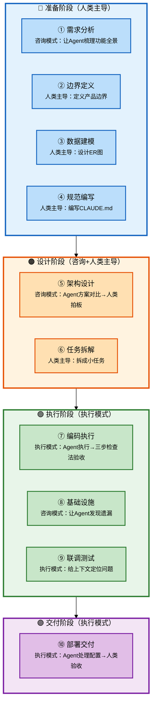

# Claude Code 企业级全链路开发 - 研发全流程与Agent协作指南

## 批次信息

- **批次编号**: batch-01
- **处理日期**: 2026-05-08
- **涉及文档**: 
  - 开篇词｜一个人用 Claude Code 造一个简版 Dify，需要多久？
  - 01｜你是架构师，Claude Code 是你的工程团队
- **所属章节**: 开篇词 + 第一章-认知篇

---

## 一、核心研发全流程（10个阶段）

基于课程内容，提炼出AI时代企业级研发的完整流程：

| 序号 | 研发阶段 | 核心产出物 | Agent协作模式 |
|------|----------|-----------|---------------|
| 1 | 需求分析 | 功能全景梳理 | 咨询模式 |
| 2 | 边界定义 | 产品边界文档 | 人类主导 |
| 3 | 数据建模 | ER图、数据模型 | 人类主导 |
| 4 | 规范编写 | CLAUDE.md | 人类主导 |
| 5 | 架构设计 | 架构方案 | 咨询模式（方案对比） |
| 6 | 任务拆解 | 任务清单 | 人类主导 |
| 7 | 编码执行 | 功能代码 | 执行模式 |
| 8 | 基础设施 | 公共组件 | 咨询模式 |
| 9 | 联调测试 | 可运行系统 | 执行模式 |
| 10 | 部署交付 | 交付物 | 执行模式 |

---

## 二、每个环节的Agent协作方式详解

### 2.1 流程图整体说明



**流程阶段分类**：

| 阶段分类 | 包含阶段 | 主导模式 | 说明 |
|----------|----------|----------|------|
| **准备阶段** | 需求分析、边界定义、数据建模、规范编写 | 人类主导 | 为后续开发打基础 |
| **设计阶段** | 架构设计、任务拆解 | 咨询+人类主导 | 确定方案和执行计划 |
| **执行阶段** | 编码执行、基础设施、联调测试 | 执行模式 | 实际产出代码 |
| **交付阶段** | 部署交付 | 执行模式 | 产出可交付物 |

---

### 2.2 阶段分类与详细说明

#### 【准备阶段】阶段1-4

---

##### 阶段1：需求分析

| 属性 | 内容 |
|------|------|
| **阶段说明** | 在动手之前，先用咨询模式让Agent帮你梳理需求全景 |
| **Agent协作模式** | 咨询模式（你还没想清楚，先让Agent帮你梳理"应该考虑什么"） |
| **核心产出物** | 功能全景清单（列表形式） |
| **关键原则** | 这个阶段人类还没想清楚，让Agent帮你想，你来判断取舍 |

**Agent协作方式**:

```
向Agent提问：
"帮我梳理一个AI Agent开发平台（如Dify）的核心功能模块，
从用户视角列出主要功能点，不需要实现细节"
```

---

##### 阶段2：边界定义

| 属性 | 内容 |
|------|------|
| **阶段说明** | 明确"做什么"和"不做什么"，这是后续所有决策的基础 |
| **Agent协作模式** | 人类主导（必须自己想清楚） |
| **核心产出物** | 产品边界文档（一页纸） |
| **关键原则** | 边界定义错误会导致后续所有决策偏离目标 |

**Agent协作方式**:

```
自己写（一页纸）：
1. 做什么：具体列出要做功能
2. 不做什么：明确排除的功能
3. 做到什么程度：功能复杂度边界
```

**反面案例（课程第一天踩的坑）**:
- 直接让Agent设计架构，没有定义边界
- Agent给出过度方案：服务注册中心、分布式配置、链路追踪
- 结果：做了一个"百万用户生产系统"，而不是"几十人内部平台"

**正面案例（课程第二天改变）**:
```
一页纸内容示例：
- 目标：团队内部AI Agent平台（几十人用）
- 周期：1周单人交付
- 架构：模块化单体，不是微服务
- 不做：用户体系、权限体系、计费系统
```

---

##### 阶段3：数据建模

| 属性 | 内容 |
|------|------|
| **阶段说明** | 设计核心数据模型，为后续开发提供蓝图 |
| **Agent协作模式** | 人类主导 |
| **核心产出物** | 5-6张核心表的ER图 |
| **关键原则** | 数据模型是系统骨架，决定后续开发效率 |

**Agent协作方式**:

```
自己设计或让Agent辅助生成：
1. 列出核心实体（如：模型提供商、Agent、对话、知识库）
2. 画出表关系ER图
3. 定义每个表的核心字段
```

---

##### 阶段4：规范编写（CLAUDE.md）

| 属性 | 内容 |
|------|------|
| **阶段说明** | 告诉Agent这个项目的全部上下文和规范，让它永远在轨道上 |
| **Agent协作模式** | 人类主导编写，Agent执行时遵循 |
| **核心产出物** | CLAUDE.md项目规范文件 |
| **关键原则** | 规范越清晰，Agent输出质量越高 |

**CLAUDE.md核心内容**:

| 板块 | 内容 | 示例 |
|------|------|------|
| **项目概述** | 做什么、不做什么 | 简版Dify，团队内部使用 |
| **技术栈** | 后端/前端/数据库 | Spring Boot + Vue + MySQL |
| **架构模式** | 单体/微服务/模块化单体 | 模块化单体 |
| **接口规范** | REST风格、路径规范 | /api/v1/providers |
| **错误码规范** | 错误码定义 | 2001网络超时、2002认证失败 |
| **命名规范** | 包名、类名、方法名 | validateXxxBeforeDelete |
| **目录结构** | 代码组织方式 | standard-spring-boot |

**质量公式**: 输入60分→输出40分（需要"猜"），输入80分→输出85分（上下文清晰，不用猜）

---

#### 【设计阶段】阶段5-6

---

##### 阶段5：架构设计

| 属性 | 内容 |
|------|------|
| **阶段说明** | 确定技术选型和架构方案 |
| **Agent协作模式** | 咨询模式（Agent提供方案对比，人类拍板） |
| **核心产出物** | 架构决策文档、技术选型清单 |
| **关键原则** | 架构约束决定系统走向，人类必须最终拍板 |

**Agent协作方式**:

```
Step 1: 向Agent提问（咨询模式）
"针对我的Hify项目（模块化单体，Spring Boot+Vue），
请给出3种数据库连接池方案对比：性能、易用性、适用场景"

Step 2: Agent输出方案对比
表格形式列出各方案优缺点

Step 3: 人类拍板决策
根据项目约束选择方案

Step 4: 让Agent按选定方案执行
"采用HikariCP，按照CLAUDE.md规范实现数据库连接配置"
```

**架构约束要点**:

| 约束项 | 错误做法 | 正确做法 |
|--------|----------|----------|
| 团队规模 | 做成服务拆分 | 模块化单体 |
| 用户规模 | 考虑百万并发 | 满足几十人即可 |
| 交付周期 | 做完整用户体系 | 简化/跳过 |
| 演进预期 | 做过度设计 | 够用就好 |

---

##### 阶段6：任务拆解

| 属性 | 内容 |
|------|------|
| **阶段说明** | 把大需求拆成Agent能准确执行的小任务 |
| **Agent协作模式** | 人类主导（必须自己想清楚怎么拆） |
| **核心产出物** | 任务清单（WBS） |
| **关键原则** | 拆得好：Agent一次做对；拆得差：反复返工 |

**Agent协作方式**:

```
大需求：实现模型提供商管理功能

拆解成小任务：
1. 数据模型：创建Provider实体类
2. Mapper层：创建ProviderMapper
3. Service层：创建ProviderService（含CRUD）
4. Controller层：创建ProviderController
5. 错误处理：定义错误码
6. 前端页面：Provider管理页面
```

**关键原则**: 每个小任务应该是"说完Agent就知道怎么做"的程度

---

#### 【执行阶段】阶段7-9

---

##### 阶段7：编码执行

| 属性 | 内容 |
|------|------|
| **阶段说明** | 实际编写代码，是工作量最大的阶段 |
| **Agent协作模式** | 执行模式（你拆清楚了让它做，你验收） |
| **核心产出物** | 业务代码、接口、前端页面 |
| **关键原则** | 必须使用三步检查法验收每一行代码 |

**Agent协作方式**:

**任务描述对比**:

| 质量 | 示例 | Agent输出 |
|------|------|-----------|
| ❌ 模糊指令 | "帮我实现模型提供商管理" | 功能可能不完整、风格不统一 |
| ✅ 精确指令 | "按照CLAUDE.md规范，使用MyBatis-Plus，实现CRUD，错误码区分网络超时(2001)、认证失败(2002)、模型不存在(2003)" | 结构完整、风格统一、有错误处理 |

**精确指令公式**:
```
[规范引用] + [技术选型] + [功能范围] + [边界条件] + [排除项]
```

---

##### 阶段8：基础设施

| 属性 | 内容 |
|------|------|
| **阶段说明** | 开发前的公共组件准备（如HTTP工具类、日志、异常处理） |
| **Agent协作模式** | 咨询模式（让Agent帮你发现遗漏） |
| **核心产出物** | 公共组件代码库 |
| **关键原则** | 用咨询模式让Agent帮你查漏补缺 |

**Agent协作方式**:

```
向Agent提问：
"基于我的项目（Hify，Spring Boot+Vue模块化单体），
在开始业务开发之前，需要准备哪些基础组件？
请列出组件名称、用途、实现要点"
```

**Agent会帮你发现**:
- 全局异常处理
- HTTP工具类
- 日志配置
- 统一响应格式
- 数据库连接池

---

##### 阶段9：联调测试

| 属性 | 内容 |
|------|------|
| **阶段说明** | 模块间交互问题定位与修复 |
| **Agent协作模式** | 执行模式（给Agent足够上下文让它定位问题） |
| **核心产出物** | 可运行系统 |
| **关键原则** | 问题出在模块交互而非模块内部时，需要给Agent足够的上下文 |

**Agent协作方式**:

```
问题描述模板：
"在Hify项目中，删除模型提供商接口（ProviderController.delete）
调用时报500错误。
已验证：
- ProviderService.delete能正常执行
- 数据库数据已删除
- 其他模块正常
请帮我定位问题可能在哪里"
```

---

#### 【交付阶段】阶段10

---

##### 阶段10：部署交付

| 属性 | 内容 |
|------|------|
| **阶段说明** | 从本地开发到可交付状态 |
| **Agent协作模式** | 执行模式 |
| **核心产出物** | 部署包、Docker镜像 |
| **关键原则** | Agent可处理配置工作，人类负责验收确认 |

**Agent协作方式**:

**Agent可处理**:
- Docker配置
- 启动脚本
- 环境变量配置
- Makefile编写

**人类负责验收**:
- 确认配置正确
- 验证部署成功
- 检查功能完整性

---

## 三、三步检查法（编码执行阶段必用）

| 步骤 | 检查什么 | 优先级 | 具体内容 |
|------|----------|--------|----------|
| **第一步** | 查意图 | 最高 | 它做的是不是你让它做的？有没有擅自添加功能？ |
| **第二步** | 查质量 | 中 | 风格、规范、一致性（命名、返回格式等） |
| **第三步** | 查边界 | 中 | 错误处理、异常、潜在风险（如并发问题） |

**检查顺序不能反**: 意图错了后面白查

**典型问题发现**:

| 问题类型 | 发现环节 | 解决方式 |
|----------|----------|----------|
| 软删除机制（未要求） | 第一步 | 确认是否需要或删除 |
| 方法命名不一致 | 第二步 | 统一命名规范 |
| 并发场景未处理 | 第三步 | 补充并发控制 |
| ID不存在抛500 | 第三步 | 改为抛404 |

---

## 四、两种协作模式速查

| 协作模式 | 使用场景 | 人类动作 | Agent动作 |
|----------|----------|----------|-----------|
| **执行模式** | 想清楚了让它执行 | 拆解任务→验收结果 | 执行任务→输出结果 |
| **咨询模式** | 还没想清楚 | 提问→判断取舍 | 提供方案→对比分析 |

**切换时机**:
- 需求不清楚 → 咨询模式
- 方案不确认 → 咨询模式
- 任务已明确 → 执行模式

---

## 五、三层分工模型

**明确哪些必须人做、哪些Agent做**

| 层级 | 内容 | 自动化程度 |
|------|------|------------|
| **必须人做** | 产品边界、架构决策、技术取舍、跨模块一致性 | 0% |
| **Agent做、人验收** | 业务代码、接口开发、前端页面、测试用例 | 90% |
| **Agent全权处理** | 格式化、样板代码、简单重构、启动脚本 | 100% |

**验收标准**: 任何一行代码你都要能说清楚它在干什么。说不清楚，就不能用。

---

## 六、课程后续章节预告

| 章节 | 主题 | 将补充的流程细节 |
|------|------|-----------------|
| 第二章 | 产品定义与架构设计 | 详细的三问裁剪法、架构设计流程 |
| 第三章 | 实操演示 | 完整流程的现场演示 |
| 第四章 | 工程搭建 | 开发环境搭建、基础组件开发 |
| 第五章 | 核心功能基础 | 具体功能开发流程 |
| 第六章 | 核心功能高级 | RAG、工作流、MCP |
| 第七章 | 测试与部署 | 质量保证体系、运维方案 |
| 第八章 | 高阶与复盘 | 老项目改造、经验总结 |

---

## 七、内容校验清单

- [x] 10个研发阶段完整梳理 ✓
- [x] 流程图整体说明 ✓
- [x] 阶段分类（准备/设计/执行/交付）✓
- [x] 每个阶段的详细说明（属性+协作方式）✓
- [x] 三步检查法详解 ✓
- [x] 两种协作模式速查 ✓
- [x] 三层分工模型 ✓

---

*本文件由Claude Code辅助整理，如有问题请对照原始文档核实。*
