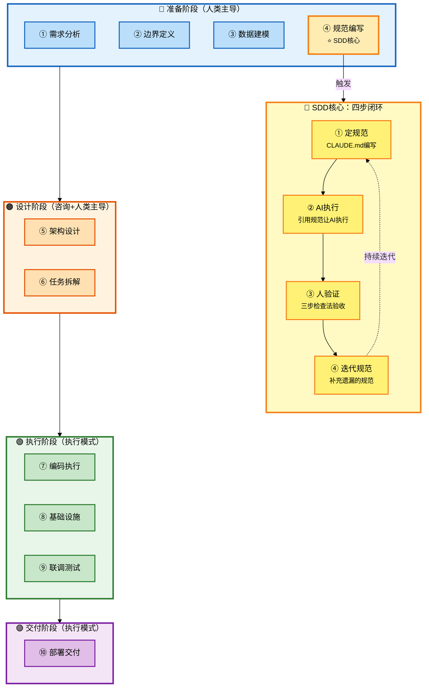
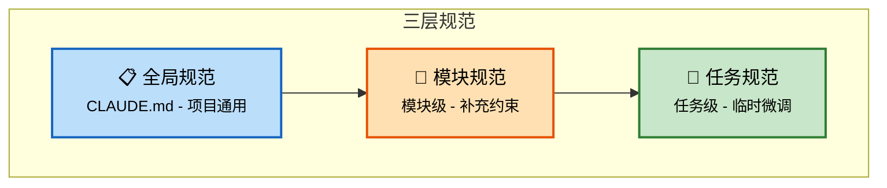

# Claude Code 企业级全链路开发 - SDD规范驱动开发

## 批次信息

- **批次编号**: batch-02
- **处理日期**: 2026-05-08
- **涉及文档**: 02｜规范驱动开发（SDD）：让 AI 永远在轨道上
- **所属章节**: 第一章-认知篇
- **前置批次**: batch-01（角色转变、三层分工）

---

## 一、核心研发全流程（10个阶段）

基于课程内容，提炼出AI时代企业级研发的完整流程：

| 序号 | 研发阶段 | 核心产出物 | Agent协作模式 |
|------|----------|-----------|---------------|
| 1 | 需求分析 | 功能全景梳理 | 咨询模式 |
| 2 | 边界定义 | 产品边界文档 | 人类主导 |
| 3 | 数据建模 | ER图、数据模型 | 人类主导 |
| **4** | **规范编写** | **CLAUDE.md** | **人类主导** |
| 5 | 架构设计 | 架构方案 | 咨询模式（方案对比） |
| 6 | 任务拆解 | 任务清单 | 人类主导 |
| 7 | 编码执行 | 功能代码 | 执行模式 |
| 8 | 基础设施 | 公共组件 | 咨询模式 |
| 9 | 联调测试 | 可运行系统 | 执行模式 |
| 10 | 部署交付 | 交付物 | 执行模式 |

> 📌 **本批次重点**: 阶段4 - 规范编写（SDD核心方法论）

---

## 二、每个环节的Agent协作方式详解

### 2.1 流程图整体说明



---

### 2.2 阶段分类与详细说明

#### 【准备阶段】阶段1-4

---

##### 阶段1：需求分析

| 属性 | 内容 |
|------|------|
| **阶段说明** | 在动手之前，先用咨询模式让Agent帮你梳理需求全景 |
| **Agent协作模式** | 咨询模式 |
| **核心产出物** | 功能全景清单 |
| **关键原则** | 人类还没想清楚，让Agent帮你想，你来判断取舍 |

**Agent协作方式**:
```
向Agent提问：
"帮我梳理一个AI Agent开发平台（如Dify）的核心功能模块，
从用户视角列出主要功能点，不需要实现细节"
```

---

##### 阶段2：边界定义

| 属性 | 内容 |
|------|------|
| **阶段说明** | 明确"做什么"和"不做什么" |
| **Agent协作模式** | 人类主导 |
| **核心产出物** | 产品边界文档（一页纸） |
| **关键原则** | 边界定义决定后续所有决策方向 |

---

##### 阶段3：数据建模

| 属性 | 内容 |
|------|------|
| **阶段说明** | 设计核心数据模型 |
| **Agent协作模式** | 人类主导 |
| **核心产出物** | 5-6张核心表的ER图 |
| **关键原则** | 数据模型是系统骨架 |

---

##### ⭐ 阶段4：规范编写（SDD核心）

| 属性 | 内容 |
|------|------|
| **阶段说明** | 先定规范，再让AI按规范执行，而不是直接让它写代码 |
| **Agent协作模式** | 人类主导编写，AI执行时遵循 |
| **核心产出物** | CLAUDE.md项目规范文件 |
| **关键原则** | 规范是节省时间的捷径，不是额外负担 |

**Agent协作方式**:

**SDD核心概念**（原文引用）:
> "先定规范，再让 AI 按规范执行，而不是直接让它写代码。"

**SDD vs 普通Prompt的本质区别**（原文引用）:
> "写好 Prompt 是一次性的技巧，SDD 是贯穿整个项目生命周期的方法论。"

**问题背景**（原文案例）:
```
// 有规范时
String instruction = "实现 Provider 的 CRUD，实体不加后缀，返回 Result<T>，
错误码从1000段，直接 new";
// → Provider.java / Result<T> / ERROR_1001 / new Provider()

// 无规范时
String instruction = "实现 Agent 的 CRUD";
// → AgentConfig.java / ResponseEntity / ERROR_1001（撞号）/ Agent.builder()
```

**Agent指令模板**:
```
"按照 CLAUDE.md 中的规范，实现 XXX 的 CRUD 接口"
```

---

##### SDD四步闭环详解

###### 步骤1：定规范

| 规范类型 | 内容 | 示例 |
|----------|------|------|
| **命名规范** | 实体不加前缀后缀、字段小驼峰 | `Provider`、`apiKey`、`/api/v1/providers` |
| **返回格式** | 统一返回Result<T>、空数组不返回null | `{ code, message, data }` |
| **错误码体系** | 四位数字按模块分段 | 1000-1999通用、2000-2999 Provider |
| **设计原则** | 不引入不必要的设计模式 | "不引入工厂、策略模式，除非明确要求" |

**原文规范示例**:
```markdown
# 命名规范
实体类大驼峰，不加前缀后缀。例如 Provider、Agent、ChatMessage。
字段小驼峰。例如 apiKey、baseUrl、modelName。
接口路径：/api/v1/{资源复数名}。

# 接口规范
所有接口统一返回 Result<T>：{ code, message, data }
列表字段空时返回空数组 []，不返回 null。
分页参数：page（从 1 开始）、pageSize（默认 20）。

# 错误码
四位数字，按模块分段：
1000-1999 通用 | 2000-2999 Provider | 3000-3999 Agent
4000-4999 Chat | 5000-5999 MCP

# 设计原则
不引入不必要的设计模式，除非明确要求。
不做过度抽象，一层能解决的不要拆成两层。
不引入技术栈以外的依赖，需要时先确认。
```

---

###### 步骤2：AI按规范执行

| 属性 | 内容 |
|------|------|
| **协作模式** | 执行模式 |
| **关键动作** | 明确引用CLAUDE.md规范 |
| **效果** | 输出一致性大幅提升 |

**Agent协作方式**:
```
下达任务时明确引用规范：
"按照 CLAUDE.md 中的规范，实现 Agent 的 CRUD 接口"
```

**有规范vs无规范对比**（原文引用）:
> "同一个 AI，有规范体系和没有规范体系，输出的一致性完全不同。"

---

###### 步骤3：人验证输出

| 属性 | 内容 |
|------|------|
| **协作模式** | 执行模式（验收环节） |
| **使用方法** | 三步检查法（意图→质量→边界） |
| **效果** | review从主观判断变成客观核查 |

**三步检查法在SDD中的应用**（原文引用）:
> "有了规范之后，review 的效率会大幅提升。因为你不再是漫无目的地看代码，而是'对着清单打勾'——命名是不是按规范来的？返回格式统一不统一？有没有引入我明确说了'不要用'的设计模式？"

---

###### 步骤4：迭代规范

| 属性 | 内容 |
|------|------|
| **协作模式** | 人类主导 |
| **关键原则** | 每次AI跑偏，补一条规范，而不是只改代码 |
| **效果** | 规范越磨越锋利，AI越用越顺手 |

**迭代案例**（原文案例）:

| 发现时间 | 问题 | 补充规范 |
|----------|------|----------|
| 第一周 | 空列表返回null导致前端白屏 | "列表字段空时返回空数组 []，不返回 null" |
| 第二周 | 修改接口破坏已有契约 | "修改已有代码前，先理解相关模块的设计意图" |
| 第三周 | 业务逻辑写在Controller | "Controller只做参数校验，不写业务逻辑" |
| 前端开发时 | 引入未审核的依赖 | "不引入技术栈以外的依赖，需要时先问我" |

**迭代原则**（原文引用）:
> "每次 AI 跑偏了，不要只改代码，还要想想规范是不是该补一条。跑偏一次补一条，同样的问题不会再出现第二次。"

---

#### 【设计阶段】阶段5-6

---

##### 阶段5：架构设计

| 属性 | 内容 |
|------|------|
| **阶段说明** | 确定技术选型和架构方案 |
| **Agent协作模式** | 咨询模式（Agent方案对比→人类拍板） |
| **核心产出物** | 架构决策文档、技术选型清单 |
| **关键原则** | 架构约束决定系统走向，人类必须最终拍板 |

---

##### 阶段6：任务拆解

| 属性 | 内容 |
|------|------|
| **阶段说明** | 把大需求拆成Agent能准确执行的小任务 |
| **Agent协作模式** | 人类主导 |
| **核心产出物** | 任务清单（WBS） |
| **关键原则** | 拆得好：Agent一次做对；拆得差：反复返工 |

---

#### 【执行阶段】阶段7-9

---

##### 阶段7：编码执行

| 属性 | 内容 |
|------|------|
| **阶段说明** | 实际编写代码 |
| **Agent协作模式** | 执行模式 |
| **核心产出物** | 业务代码、接口、前端页面 |
| **关键原则** | 必须使用三步检查法验收每一行代码 |

---

##### 阶段8：基础设施

| 属性 | 内容 |
|------|------|
| **阶段说明** | 开发前的公共组件准备 |
| **Agent协作模式** | 咨询模式 |
| **核心产出物** | 公共组件代码库 |
| **关键原则** | 用咨询模式让Agent帮你查漏补缺 |

---

##### 阶段9：联调测试

| 属性 | 内容 |
|------|------|
| **阶段说明** | 模块间交互问题定位与修复 |
| **Agent协作模式** | 执行模式 |
| **核心产出物** | 可运行系统 |
| **关键原则** | 需要给Agent足够的上下文 |

---

#### 【交付阶段】阶段10

---

##### 阶段10：部署交付

| 属性 | 内容 |
|------|------|
| **阶段说明** | 从本地开发到可交付状态 |
| **Agent协作模式** | 执行模式 |
| **核心产出物** | 部署包、Docker镜像 |
| **关键原则** | Agent可处理配置工作，人类负责验收 |

---

## 三、SDD规范质量标准

### 3.1 标准一：具体，不模糊

| 质量 | 示例 | 效果 |
|------|------|------|
| ❌ 模糊规范 | "代码要简洁" | Claude会按自己的理解"猜" |
| ✅ 具体规范 | "不引入不必要的设计模式（工厂、策略、观察者等），除非明确要求" | 无歧义，AI知道不能用 |
| ❌ 模糊规范 | "接口要规范" | Claude需要猜测 |
| ✅ 具体规范 | "所有接口统一返回 Result<T>，格式为 { code, message, data }" | AI不需要猜 |

**判断标准**（原文引用）:
> "Claude Code 看到这条规范后，是否还需要'猜'你的意思？如果还需要猜，就不够具体。"

---

### 3.2 标准二：有优先级，不贪多

| 原则 | 说明 |
|------|------|
| **AI反复跑偏的地方写细** | 如"Controller不写业务逻辑"必须写 |
| **不跑偏的地方不写** | 如"文件编码用UTF-8"不需要写 |

**上下文窗口限制**（原文引用）:
> "规范不是越多越好。太多了 Claude Code 也处理不过来，因为上下文窗口是有限的，塞了太多规范反而会稀释重要的那几条。"

---

### 3.3 标准三：带原因，不只是规则

| 类型 | 示例 | 说明 |
|------|------|------|
| **不需要原因的规则** | "实体类不加前缀" | 照做就行 |
| **需要原因的规则** | "不破坏已有接口契约" | 需要理解工程权衡 |

**带原因的效果**（原文案例）:
```
// 无原因
"不要全量删除再全量插入"
// → Claude第一版还是用了全量删除

// 带原因
"不要全量删除再全量插入，因为会导致并发场景下Agent瞬间失去所有工具关联"
"如果此时有对话正在读取工具列表，会拿到空列表"
// → Claude第二版用差异比对
```

**原文结论**（原文引用）:
> "对于涉及工程权衡的规范，不能只告诉 Claude Code '不要这样做'，还要告诉它为什么。"

---

## 四、规范分层体系

### 4.1 三层架构



### 4.2 各层定义

| 层级 | 位置 | 内容 | 特点 |
|------|------|------|------|
| **全局规范** | CLAUDE.md | 命名规则、接口格式、错误码、设计原则 | 项目通用，初期定好，很少改动 |
| **模块规范** | 模块目录或开发前指令 | 模块接口契约、数据流定义 | 模块级补充 |
| **任务规范** | 每次任务指令 | 临时性约束 | 不落成文档 |

### 4.3 优先级规则

| 规则 | 说明 |
|------|------|
| 任务规范 > 模块规范 > 全局规范 | 上层可以覆盖下层 |
| 任务规范不能违反全局规范 | "所有接口统一返回 Result<T>" 必须遵守 |

---

## 五、三步检查法（SDD中的应用）

| 步骤 | 检查内容 | 在SDD中的重点 |
|------|----------|--------------|
| **第一步：查意图** | 它做的是不是你让它做的？ | 是否有擅自添加的功能 |
| **第二步：查质量** | 风格、规范、一致性 | **对着清单打勾**：命名、格式、错误码 |
| **第三步：查边界** | 错误处理、异常、风险 | 是否引入不必要的依赖或设计模式 |

**原文引用**:
> "规范把 review 从主观判断变成了客观核查。这个转变对效率的提升是巨大的。"

---

## 六、与batch-01的关联

| 关联点 | batch-01内容 | batch-02补充 |
|--------|--------------|--------------|
| **CLAUDE.md** | 提到需要编写CLAUDE.md | SDD方法论完整支撑 |
| **三步检查法** | 提出三步检查法 | 在SDD中作为验证手段 |
| **角色转变** | 架构师做决策 | 决策的结果就是规范 |
| **三层分工** | 人类主导规范编写 | SDD四步闭环支撑执行 |

---

## 七、内容校验清单

- [x] SDD四步闭环完整梳理 ✓
- [x] 四类核心规范（命名/返回格式/错误码/设计原则）✓
- [x] 规范质量三标准 ✓
- [x] 规范分层体系 ✓
- [x] 与batch-01的关联 ✓
- [x] Mermaid流程图（深色边框+浅色填充+黑色文字）✓

---

*本文件由Claude Code辅助整理，内容来自原文02｜规范驱动开发（SDD）：让 AI 永远在轨道上*
