# Claude Code 企业级全链路开发 - 产品定义与架构设计

## 批次信息

- **批次编号**: batch-03
- **处理日期**: 2026-05-08
- **涉及文档**: 
  - 03｜产品定义：动第一行代码之前你该想清楚什么
  - 04｜架构设计（上）：应用架构与代码组织
  - 05｜架构设计（下）：部署架构、性能预判与数据设计
  - 06｜Claude Code 实战必备：CLAUDE.md、Skills 与工程规范
- **所属章节**: 第二章-产品定义与架构设计
- **前置批次**: batch-01（三层分工）、batch-02（SDD规范驱动）

---

## 一、核心研发全流程（10个阶段）

基于课程内容，提炼出AI时代企业级研发的完整流程：

| 序号 | 研发阶段 | 核心产出物 | Agent协作模式 |
|------|----------|-----------|---------------|
| **1** | **需求分析** | **功能全景梳理** | **咨询模式** |
| **2** | **边界定义** | **产品边界文档** | **人类主导** |
| **3** | 数据建模 | ER图、数据模型 | 人类主导 |
| **4** | 规范编写 | CLAUDE.md | 人类主导 |
| **5** | **架构设计** | **架构方案** | **咨询模式（方案对比）** |
| 6 | 任务拆解 | 任务清单 | 人类主导 |
| 7 | 编码执行 | 功能代码 | 执行模式 |
| 8 | 基础设施 | 公共组件 | 咨询模式 |
| 9 | 联调测试 | 可运行系统 | 执行模式 |
| 10 | 部署交付 | 交付物 | 执行模式 |

> 📌 **本批次重点**: 阶段1（需求分析）、阶段2（边界定义）、阶段5（架构设计）

---

## 二、每个环节的Agent协作方式详解

### 2.1 流程图整体说明

```mermaid
%%{init: {'theme': 'base', 'themeVariables': {'fontSize': '16px'}}}%%
flowchart TB
    %% 产品定义五步法 %%
    subgraph PRODUCT["📋 产品定义五步法（阶段1-2）"]
        direction TB
        PD1["① 调研标杆<br/><small>Claude帮梳理Dify功能全景</small>"]
        PD2["② 功能取舍<br/><small>三问裁剪法，Claude初筛→人类拍板</small>"]
        PD3["③ 技术选型<br/><small>Claude做方案对比，人类基于约束选择</small>"]
        PD4["④ 运维预期<br/><small>Claude帮查漏补缺</small>"]
        PD5["⑤ 落成文字<br/><small>写进CLAUDE.md</small>"]
        PD1 --> PD2 --> PD3 --> PD4 --> PD5
    end

    %% 架构设计流程 %%
    subgraph ARCH["🏗️ 架构设计流程（阶段5）"]
        direction TB
        A1["① 应用架构<br/><small>模块化单体 vs 微服务对比</small>"]
        A2["② 代码组织<br/><small>Spring分层规范 + 跨模块调用规则</small>"]
        A3["③ 外部调用<br/><small>线程池隔离 + 熔断 + 超时 + 重试</small>"]
        A4["④ 部署架构<br/><small>Docker + K8s + 监控</small>"]
        A5["⑤ 数据设计<br/><small>数据库规范 + pgvector</small>"]
        A1 --> A2 --> A3 --> A4 --> A5
    end

    subgraph PRE["🔵 准备阶段"]
        direction LR
        P1["① 需求分析<br/><small>⭐ 本批次重点</small>"]
        P2["② 边界定义<br/><small>⭐ 本批次重点</small>"]
        P3["③ 数据建模"]
        P4["④ 规范编写"]
    end

    subgraph DESIGN["🟠 设计阶段"]
        direction LR
        D1["⑤ 架构设计<br/><small>⭐ 本批次重点</small>"]
        D2["⑥ 任务拆解"]
    end

    subgraph EXECUTE["🟢 执行阶段"]
        direction LR
        E1["⑦ 编码执行"]
        E2["⑧ 基础设施"]
        E3["⑨ 联调测试"]
    end

    subgraph DEPLOY["🟣 交付阶段"]
        direction LR
        F1["⑩ 部署交付"]
    end

    %% 连接关系 %%
    PRE --> DESIGN --> EXECUTE --> DEPLOY
    PRODUCT -.->|"本批次聚焦"| PRE
    ARCH -.->|"本批次聚焦"| DESIGN

    %% 样式定义 %%
    style PRODUCT fill:#FFF9C4,stroke:#F57F17,stroke-width:3px,color:#000000
    style PD1 fill:#FFF176,stroke:#F57F17,stroke-width:2px,color:#000000
    style PD2 fill:#FFF176,stroke:#F57F17,stroke-width:2px,color:#000000
    style PD3 fill:#FFF176,stroke:#F57F17,stroke-width:2px,color:#000000
    style PD4 fill:#FFF176,stroke:#F57F17,stroke-width:2px,color:#000000
    style PD5 fill:#FFF176,stroke:#F57F17,stroke-width:2px,color:#000000

    style ARCH fill:#E8F5E9,stroke:#2E7D32,stroke-width:3px,color:#000000
    style A1 fill:#C8E6C9,stroke:#2E7D32,stroke-width:2px,color:#000000
    style A2 fill:#C8E6C9,stroke:#2E7D32,stroke-width:2px,color:#000000
    style A3 fill:#C8E6C9,stroke:#2E7D32,stroke-width:2px,color:#000000
    style A4 fill:#C8E6C9,stroke:#2E7D32,stroke-width:2px,color:#000000
    style A5 fill:#C8E6C9,stroke:#2E7D32,stroke-width:2px,color:#000000

    style PRE fill:#E3F2FD,stroke:#1565C0,stroke-width:3px,color:#000000
    style DESIGN fill:#FFF3E0,stroke:#E65100,stroke-width:3px,color:#000000
    style EXECUTE fill:#E8F5E9,stroke:#2E7D32,stroke-width:3px,color:#000000
    style DEPLOY fill:#F3E5F5,stroke:#7B1FA2,stroke-width:3px,color:#000000

    style P1 fill:#FFECB3,stroke:#F57F17,stroke-width:3px,color:#000000
    style P2 fill:#FFECB3,stroke:#F57F17,stroke-width:3px,color:#000000
    style P3 fill:#BBDEFB,stroke:#1565C0,stroke-width:2px,color:#000000
    style P4 fill:#BBDEFB,stroke:#1565C0,stroke-width:2px,color:#000000
    style D1 fill:#FFE0B2,stroke:#E65100,stroke-width:3px,color:#000000
    style D2 fill:#FFE0B2,stroke:#E65100,stroke-width:2px,color:#000000
    style E1 fill:#C8E6C9,stroke:#2E7D32,stroke-width:2px,color:#000000
    style E2 fill:#C8E6C9,stroke:#2E7D32,stroke-width:2px,color:#000000
    style E3 fill:#C8E6C9,stroke:#2E7D32,stroke-width:2px,color:#000000
    style F1 fill:#E1BEE7,stroke:#7B1FA2,stroke-width:2px,color:#000000
```



---

### 2.2 阶段分类与详细说明

#### 【准备阶段】阶段1-4

---

##### ⭐ 阶段1：需求分析（三问裁剪法）

| 属性 | 内容 |
|------|------|
| **阶段说明** | 调研标杆产品，用三问裁剪法确定功能范围 |
| **Agent协作模式** | 咨询模式 |
| **核心产出物** | 功能全景清单、产品边界文档 |
| **关键原则** | 用"三问裁剪法"做功能取舍 |

**Agent协作方式**:

**第一步：调研标杆**（原文案例）
```
向Agent提问：
"帮我梳理一个AI Agent开发平台（如Dify）的核心功能模块，
从用户视角列出主要功能点，不需要实现细节"
```

**第二步：三问裁剪法**（原文核心方法）

| 问题 | 目的 | 示例 |
|------|------|------|
| **第一问：做了有什么价值？** | 评估功能ROI | "RAG知识库能做什么？价值有多大？" |
| **第二问：不做的代价是什么？** | 评估放弃成本 | "没有RAG，用户能接受吗？" |
| **第三问：做到什么程度？** | 确定功能边界 | "做txt还是做PDF？做全文检索还是语义检索？" |

**三问裁剪法示例**（原文案例）:
```
RAG知识库 → 第一问：价值高，能让AI"读"自己的文档
         → 第二问：不做的代价低，可以用上传文档功能替代
         → 第三问：只做TXT、固定分块，简化实现
         → 结论：做，但做简化版
```

**Agent指令模板**:
```
向Agent提问：
"对于Hify项目（AI Agent开发平台），请对以下功能逐一做三问裁剪：
1. RAG知识库 2. 工作流编排 3. MCP工具接入
对每个功能评估：价值、放弃代价、做到什么程度"
```

---

##### ⭐ 阶段2：边界定义（产品定义）

| 属性 | 内容 |
|------|------|
| **阶段说明** | 明确"做什么"和"不做什么"，落成文字 |
| **Agent协作模式** | 人类主导 |
| **核心产出物** | CLAUDE.md项目概述部分 |
| **关键原则** | 边界越明确，Claude Code越不会跑偏 |

**Agent协作方式**:

**产品定义五步法**（原文）:
```
第一步：调研标杆（Claude帮梳理Dify功能全景）
第二步：功能取舍（三问裁剪法，Claude初筛→人类拍板）
第三步：技术选型（Claude做方案对比，人类基于约束选择）
第四步：运维预期（Claude帮查漏补缺）
第五步：落成文字（写进CLAUDE.md）
```

**Hify产品边界示例**（原文）:
```markdown
## 项目概述
Hify 是一个简版的 AI Agent 开发平台（参考 Dify），可本地部署，
面向团队内部小规模使用（20-50 人同时在线）。

### 做什么
- 多模型提供商管理（OpenAI、Claude、Gemini、Ollama）
- Agent 创建与配置（选模型、绑工具、设系统提示词）
- 对话引擎（流式响应、多轮对话、上下文管理）
- 知识库 + RAG（一期只支持 TXT 文档，固定长度分块）
- 简版工作流（JSON 配置，线性 + 条件分支，不做可视化拖拽）
- MCP 工具接入（Agent 可通过 MCP 协议调用外部工具）
- 管理控制台（模型管理、Agent 配置、对话界面）

### 不做什么
- 不做可视化工作流拖拽编排
- 不做多租户 / 权限体系
- 不做插件市场、计费系统
- 不做文本生成应用、WebApp 发布、嵌入组件
- 不做标注与微调
```

---

##### 阶段3：数据建模

| 属性 | 内容 |
|------|------|
| **阶段说明** | 设计核心数据模型和数据库规范 |
| **Agent协作模式** | 人类主导（参考05讲内容） |
| **核心产出物** | 数据模型、数据库规范 |
| **关键原则** | 数据库规范是Claude Code容易跑偏的地方 |

**数据库规范要点**（05讲原文）:
```markdown
### 通用字段
- 主键 id BIGINT 自增，禁止 UUID
- 时间字段 created_at / updated_at，DATETIME(3)
- 逻辑删除 deleted TINYINT(1)
- 禁止 NULL，空值用空字符串或 0
- 枚举用 VARCHAR(32)，不用 MySQL ENUM

### 索引规则
- 命名 idx_{表名}_{字段名}
- 逻辑删除字段必须加进组合索引
- 组合索引等值列在前，范围列在后

### 分页规则
- 默认用游标分页（WHERE id < lastId ORDER BY id DESC LIMIT N）
- OFFSET 分页限制最大 10000 条
```

---

##### 阶段4：规范编写（CLAUDE.md）

| 属性 | 内容 |
|------|------|
| **阶段说明** | 将所有决策落成CLAUDE.md |
| **Agent协作模式** | 人类主导 |
| **核心产出物** | 完整的CLAUDE.md文件 |
| **关键原则** | 规范是长出来的，不是设计出来的 |

**CLAUDE.md五层结构**（原文引用）:
```
第一层：项目上下文（做什么、不做什么）
第二层：架构规范（模块划分、依赖关系）
第三层：代码组织规范（分层结构、职责边界）
第四层：部署与数据库规范（部署架构、索引规则）
第五层：接口规范与行为指令
```

**Agent指令模板**:
```
向Agent提问：
"根据我们的讨论，帮我把Hify的项目概述写进CLAUDE.md的'项目概述'部分。
包括产品定位、做什么、不做什么、技术栈、部署与运维预期"
```

---

#### 【设计阶段】阶段5-6

---

##### ⭐ 阶段5：架构设计

| 属性 | 内容 |
|------|------|
| **阶段说明** | 确定应用架构、代码组织、外部调用处理 |
| **Agent协作模式** | 咨询模式（Agent方案对比→人类拍板） |
| **核心产出物** | 架构决策文档 |
| **关键原则** | 每次追问都是用项目约束修正AI的通用建议 |

**5.1 应用架构：模块化单体**（04讲原文）

**模块划分方案对比**（原文案例）:

| 方案 | 内容 | Claude推荐 | 人类决策 |
|------|------|-----------|----------|
| 方案A | 按package分层，所有功能混在一起 | - | ❌ 后续拆分困难 |
| 方案B | Maven多模块，按功能拆 | 建议一人开发选方案B | ✅ **选方案B** |
| 方案C | 微服务，每个功能独立部署 | 推荐（方便扩展） | ❌ 一人维护太重 |

**最终模块划分**（原文）:
```
hify/
├── hify-app/           # 启动模块
├── hify-provider/      # 模型提供商管理
├── hify-agent/         # Agent 管理与配置
├── hify-chat/          # 对话引擎
├── hify-mcp/           # MCP 工具管理与调用
├── hify-workflow/      # 工作流编排与执行
├── hify-knowledge/     # 知识库与 RAG
├── hify-common/        # 公共模块
└── hify-web/          # Vue 前端
```

**关键原则**（原文引用）:
> "依赖是单向的，不能循环。共用逻辑下沉 hify-common。"

---

**5.2 代码组织规范**（04讲原文）

**分层职责边界**:

| 层级 | 职责 | 约束 |
|------|------|------|
| **Controller** | 参数校验 + 调用Service | 不写业务逻辑、不做数据查询 |
| **Service** | 业务逻辑 + 事务管理 | 只能调接口，不能直接new实现类 |
| **Mapper** | 数据库操作 | 不写业务逻辑 |
| **Entity** | 和数据库一一对应 | 不直接返回前端 |
| **DTO** | 接口请求/响应对象 | 做字段转换，控制暴露哪些字段 |

**跨模块调用规则**（原文关键原则）:
```
模块之间只能通过 Service 接口调用，不能直接引用另一个模块的 Mapper、Entity 或内部类。
原因：如果直接引用，拆分微服务时要把所有引用改成远程调用。
     如果只通过接口调用，拆分时只需把本地调用改成HTTP/RPC，接口签名不变。
```

**Agent指令模板**:
```
向Agent提问：
"Hify是模块化单体，用Spring Boot + MyBatis-Plus。
帮我定义代码组织规范，覆盖：每个模块内部的分层结构、
每一层的职责边界、跨模块调用的规则。
要求具体到AI能直接执行，不要模糊的描述"
```

---

**5.3 外部调用设计**（04讲原文）

**LLM调用四大问题及解决方案**:

| 问题 | 特点 | 解决方案 | Claude建议 | 人类决策 |
|------|------|----------|-----------|----------|
| **慢** | 3-30秒/次 | 独立线程池隔离 | 同意 | ✅ 同意 |
| **不稳定** | 超时/限流/报错 | Resilience4j熔断 | 每个提供商独立熔断器 | ✅ 同意 |
| **超时控制** | 流式响应1-2分钟 | SSE 120s，同步60s | 60s | ❌ 追问后调整为120s |
| **重试策略** | 不同失败不同处理 | 按异常类型区分 | 同意 | ✅ 同意+细节 |

**Agent追问案例**（原文）:
```
我追问："流式响应用SSE，Spring MVC怎么处理？需不需要引入WebFlux？"

Claude建议：WebFlux做异步非阻塞
人类决策：❌ 不同意，不引入额外技术栈
最终方案：SseEmitter + 独立线程池 + 120秒超时
```

---

**5.4 部署架构**（05讲原文）

**部署方案对比**:

| 阶段 | 部署方式 | 用户规模 | 触发条件 |
|------|----------|----------|----------|
| **一期** | 单机Docker Compose | 20-50人 | - |
| **二期** | 多副本 + 主从分离 | 500人 | 条件不到不动 |
| **三期** | MQ异步 + Qdrant | 2000人 | 条件不到不动 |
| **四期** | 微服务拆分 + Redis集群 | 几千人 | 条件不到不动 |

**运维预期要点**（原文）:
```
- 部署方式：Docker Compose 一键启动
- JVM内存设上限（-Xmx512m），防止容器OOM
- 用户量：20-50人同时在线
- QPS：峰值3-5QPS，瓶颈在LLM长连接不在并发
- 监控：起步Spring Boot Actuator + 日志，后期Prometheus + Grafana
```

---

**5.5 数据设计**（05讲原文）

**缓存策略**:

| 数据类型 | 缓存方案 | TTL |
|----------|----------|-----|
| Provider/Agent配置 | Redis Cache-Aside | 30min |
| 对话上下文 | Redis | 2h |
| 对话消息、知识库文档 | 不缓存，走数据库 | - |
| LLM响应 | 不缓存 | - |

**扩展路径**（原文）:
```
一期单副本 → 多副本+主从分离（500人）
→ MQ异步+Qdrant（2000人）→ 微服务拆分+Redis集群（几千人）
触发条件驱动，条件不到不动。
```

---

#### 阶段6：任务拆解

| 属性 | 内容 |
|------|------|
| **阶段说明** | 把大需求拆成Agent能准确执行的小任务 |
| **Agent协作模式** | 人类主导 |
| **核心产出物** | 任务清单（WBS） |
| **关键原则** | 拆得好：Agent一次做对；拆得差：反复返工 |

---

#### 【执行阶段】阶段7-9

---

##### 阶段7：编码执行

| 属性 | 内容 |
|------|------|
| **阶段说明** | 实际编写代码 |
| **Agent协作模式** | 执行模式 |
| **核心产出物** | 业务代码、接口、前端页面 |
| **关键原则** | 必须使用三步检查法验收每一行代码 |

---

##### 阶段8：基础设施

| 属性 | 内容 |
|------|------|
| **阶段说明** | 开发前的公共组件准备 |
| **Agent协作模式** | 咨询模式 |
| **核心产出物** | 公共组件代码库 |
| **关键原则** | 用咨询模式让Agent帮你查漏补缺 |

---

##### 阶段9：联调测试

| 属性 | 内容 |
|------|------|
| **阶段说明** | 模块间交互问题定位与修复 |
| **Agent协作模式** | 执行模式 |
| **核心产出物** | 可运行系统 |
| **关键原则** | 需要给Agent足够的上下文 |

---

#### 【交付阶段】阶段10

---

##### 阶段10：部署交付

| 属性 | 内容 |
|------|------|
| **阶段说明** | 从本地开发到可交付状态 |
| **Agent协作模式** | 执行模式 |
| **核心产出物** | 部署包、Docker镜像 |
| **关键原则** | Agent可处理配置工作，人类负责验收 |

---

## 三、Skills：可复用的规范片段

### 3.1 Skills vs CLAUDE.md

| 工具 | 范围 | 适用场景 |
|------|------|----------|
| **CLAUDE.md** | 项目级全局规范 | 项目上下文、架构决策、代码组织 |
| **Skills** | 任务级可复用片段 | 重复性任务的标准流程 |

### 3.2 什么时候创建Skill

**判断标准**（原文）:
> "当你发现自己给 Claude Code 的指令有重复模式时"

### 3.3 Skill示例：接口契约设计

```markdown
# 接口契约设计 Skill

## 触发条件
当需要为一个新模块设计接口契约时使用。

## 步骤
1. 列出这个模块的核心业务操作（创建、查询、更新、删除、特殊操作）
2. 每个操作定义：HTTP方法 + 路径 + 入参 + 出参
3. 路径遵循 /api/v1/{资源复数名} 格式
4. 所有接口返回 Result<T>
5. 列表接口支持分页（page, pageSize）
6. 删除接口标注是否需要关联检查
7. 非CRUD操作用动词路径（如 /test-connection）
```

---

## 四、业界规范喂入技巧

### 4.1 技巧本质

**原文引用**:
> "你不需要是每个领域的专家，但你可以让 Claude Code 帮你把专家的经验转化成你项目的规范。"

### 4.2 具体做法

**Java编码规范**:
```
向Agent提问：
"我在做一个Spring Boot项目，请基于阿里巴巴Java开发手册，
帮我提炼出最关键的20条编码规范，写成CLAUDE.md可以直接用的格式。
重点覆盖命名、异常处理、日志、并发这几个方面。不要照搬原文，要精简到AI能直接执行。"
```

**数据库规范**:
```
向Agent提问：
"基于业界MySQL设计规范（阿里巴巴MySQL规范、互联网公司常见的MySQL最佳实践），
帮我补充Hify项目的数据库规范。当前已有的规范是：[贴上已有规范]。
帮我看看还有哪些重要的规范遗漏了。"
```

---

## 五、三步检查法（在架构设计中的应用）

| 步骤 | 检查内容 | 在架构设计中的重点 |
|------|----------|------------------|
| **第一步：查意图** | 它做的是不是你让它做的？ | 是否符合选定的架构方案 |
| **第二步：查质量** | 风格、规范、一致性 | 是否遵循分层规范、跨模块调用规则 |
| **第三步：查边界** | 错误处理、异常、风险 | 是否引入不必要的依赖或设计模式 |

---

## 六、与前置批次的关联

| 批次 | 核心内容 | 与batch-03的关联 |
|------|----------|------------------|
| **batch-01** | 角色转变、三层分工 | 架构师做决策，Agent执行 |
| **batch-02** | SDD规范驱动 | CLAUDE.md是规范的核心载体 |
| **batch-03** | 产品定义、架构设计 | 将决策写入CLAUDE.md，支撑后续开发 |

---

## 七、内容校验清单

- [x] 产品定义五步法完整梳理 ✓
- [x] 三问裁剪法详解 ✓
- [x] 架构设计四模块（应用架构/代码组织/外部调用/部署）✓
- [x] Skills机制说明 ✓
- [x] 业界规范喂入技巧 ✓
- [x] 与batch-01、batch-02的关联 ✓
- [x] Mermaid流程图（深色边框+浅色填充+黑色文字）✓

---

*本文件由Claude Code辅助整理，内容来自原文03-06讲*
