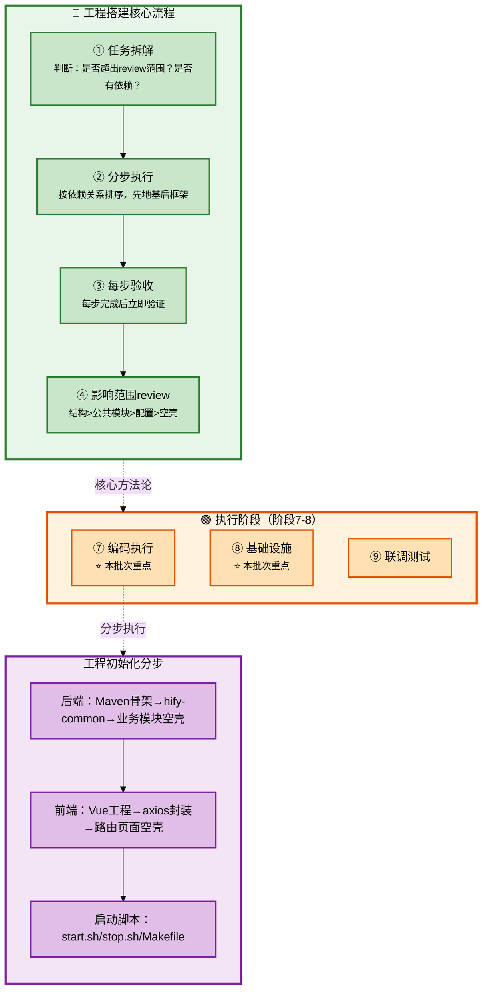

# Claude Code 企业级全链路开发 - 工程搭建与基础组件

## 批次信息

- **批次编号**: batch-04
- **处理日期**: 2026-05-08
- **涉及文档**: 
  - 07｜实操课：顶层设计全流程演示
  - 08｜工程初始化（上）：后端骨架与公共基础设施
  - 09｜工程初始化（下）：前端工程与一键启动
  - 10｜基础组件（上）：后端业务基础设施
- **所属章节**: 第三章-实操 + 第四章-工程搭建
- **前置批次**: batch-01（角色转变）、batch-02（SDD）、batch-03（产品定义与架构设计）

---

## 一、核心研发全流程（10个阶段）

基于课程内容，提炼出AI时代企业级研发的完整流程：

| 序号 | 研发阶段 | 核心产出物 | Agent协作模式 |
|------|----------|-----------|---------------|
| 1 | 需求分析 | 功能全景梳理 | 咨询模式 |
| 2 | 边界定义 | 产品边界文档 | 人类主导 |
| 3 | 数据建模 | ER图、数据模型 | 人类主导 |
| 4 | 规范编写 | CLAUDE.md | 人类主导 |
| 5 | 架构设计 | 架构方案 | 咨询模式（方案对比） |
| **6** | **任务拆解** | **任务清单** | **人类主导** |
| **7** | **编码执行** | **功能代码** | **执行模式** |
| **8** | **基础设施** | **公共组件** | **咨询模式** |
| 9 | 联调测试 | 可运行系统 | 执行模式 |
| 10 | 部署交付 | 交付物 | 执行模式 |

> 📌 **本批次重点**: 阶段6（任务拆解）、阶段7（编码执行）、阶段8（基础设施）

---

## 二、每个环节的Agent协作方式详解

### 2.1 流程图整体说明



---

### 2.2 阶段分类与详细说明

#### 【执行阶段】阶段7-9

---

##### ⭐ 阶段7：编码执行 - 工程初始化

| 属性 | 内容 |
|------|------|
| **阶段说明** | 搭建工程骨架，包括后端Maven多模块、前端Vue工程、启动脚本 |
| **Agent协作模式** | 执行模式 |
| **核心产出物** | 可运行的工程骨架 |
| **关键原则** | 按依赖关系分步执行，每步验收 |

**7.1 任务拆解标准**（原文核心方法论）

**什么时候拆？两个判断标准**（原文引用）:
```
标准一：生成的代码量是否超出你一次能review的范围？
       → 十几行不用拆，几十个文件必须拆
标准二：步骤之间是否有依赖关系？
       → 第二步依赖第一步结果，必须先完成第一步再进入第二步
```

**拆解顺序原则**（原文引用）:
> "先地基，后框架，最后验收。这个顺序不只适用于工程初始化，后面做任何模块都是这个思路。"

---

**7.2 后端工程初始化（四步）**

**第一步：Maven多模块骨架**

| 检查项 | 内容 |
|--------|------|
| 模块声明 | 父pom的<modules>和实际目录完全对应 |
| 依赖关系 | hify-chat依赖hify-agent和hify-provider |
| 版本管理 | 版本号只在父pom声明，子模块不重复 |

**Agent指令模板**:
```
"按照CLAUDE.md中的项目结构和技术栈，创建Hify的Maven多模块工程骨架。
父pom声明所有子模块，统一管理Spring Boot、MyBatis-Plus、Redis等版本号。
子模块之间的依赖关系按CLAUDE.md中定义的架构来。
只创建pom和目录结构，不需要写Java代码。"
```

---

**第二步：hify-common公共基础设施（五小步）**

| 小任务 | 内容 | 指令重点 |
|--------|------|----------|
| 1. Result和PageResult | 统一响应类 | "提供ok()和fail()静态方法" |
| 2. ErrorCode和BizException | 错误码枚举+业务异常 | "BizException持有ErrorCode" |
| 3. GlobalExceptionHandler | 全局异常处理器 | "必须使用Result.fail()和ErrorCode枚举" |
| 4. MyBatis-Plus配置 | 分页插件、自动填充 | "分页插件、自动填充(创建时间/更新时间)" |
| 5. Redis配置 | RedisTemplate序列化 | "key用String，value用JSON" |

**Agent指令模板**:
```
"在hify-common中创建统一响应类。按照CLAUDE.md接口规范：
Result<T>包含code、message、data三个字段，提供ok()和fail()静态方法。
PageResult<T>继承Result，额外包含total、page、size。"
```

**SDD闭环案例**（原文）:
```
问题：Claude在兜底的Exception处理里硬编码了code:500
人类决策：补规范"异常处理必须使用ErrorCode枚举，禁止硬编码错误码"
效果：下次再写类似代码，问题不会重复出现
```

---

**第三步：业务模块空壳**

| 内容 | 指令重点 |
|------|----------|
| Package结构 | "每个模块包含controller/service/mapper/entity/dto/config" |
| 启动类 | "HifyApplication，端口8080" |
| 配置文件 | "数据库连接、Redis连接、MyBatis-Plus配置" |

**Agent指令模板**:
```
"为hify-provider、hify-agent、hify-chat等业务模块创建标准的package结构。
每个模块只创建package和一个空的占位类，不需要写业务代码。"
```

---

**第四步：验收流程**

| 验收步骤 | 命令 | 期望结果 |
|----------|------|----------|
| Maven编译 | `mvn clean install -DskipTests` | 无编译错误 |
| 项目启动 | `mvn spring-boot:run -pl hify-app` | "Started HifyApplication" |
| 健康检查 | `GET /api/v1/health` | `{"code":200,"data":"Hify is running"}` |

---

**7.3 前端工程初始化（三步）**

**第一步：项目骨架**

| 检查项 | 内容 |
|--------|------|
| 技术栈 | Vue 3 + TypeScript + Vite + Element Plus |
| 目录结构 | 与CLAUDE.md定义一致 |
| Vite代理 | `/api`转发到`localhost:8080` |

**Agent指令模板**:
```
"初始化Hify前端项目hify-web。Vue 3 + TypeScript + Vite + Element Plus。
目录结构按CLAUDE.md中定义的前端结构来。
Vite开发服务器配置代理：/api请求转发到localhost:8080。"
```

---

**第二步：axios统一请求层**

| 内容 | 说明 |
|------|------|
| 响应拦截器 | code非200时用ElMessage.error提示message |
| 自动解包 | 返回data字段，业务代码不需要手动`.data` |
| 导出方法 | get、post、put、del四个方法 |

**前后端规范对接**（原文引用）:
> "后端的Result<T>格式、接口路径规则、错误码定义，前端全部照着来。一份规范，两端对齐。"

---

**第三步：路由和页面空壳**

| 内容 | 说明 |
|------|------|
| 路由 | 模型管理、Agent管理、对话 |
| 页面 | 只显示页面名称的占位组件 |
| 布局 | 左侧菜单+右侧router-view |

---

**7.4 启动脚本**

| 脚本 | 功能 |
|------|------|
| start.sh | 检查MySQL/Redis、构建后端、轮询健康检查、启动前端 |
| stop.sh | 优雅停止（SIGTERM→等待→SIGKILL） |
| Makefile | make start/stop/restart/build/clean/package |

---

##### ⭐ 阶段8：基础设施 - 基础组件三档

| 档位 | 内容 | 完成时机 |
|------|------|----------|
| **第一档** | 必须先做，否则业务跑不起来 | 现在 |
| **第二档** | 业务开发的基础能力 | 第一个列表接口前 |
| **第三档** | 健壮性，可以后补 | 不影响功能开发 |

**第一档：让业务代码能跑起来**

| 组件 | 说明 |
|------|------|
| schema.sql | 数据库初始化DDL脚本 |
| @MapperScan | "com.hify.**.mapper"扫描所有子模块 |
| 线程池配置 | llmExecutor（LLM调用）、asyncExecutor（异步任务） |

**线程池配置参数**（原文）:
```java
// llmExecutor
核心10，最大50，队列100，线程名前缀llm-
// asyncExecutor  
核心5，最大20，队列200，线程名前缀async-
```

---

**第二档：业务开发的基础能力**

| 组件 | 说明 | Agent协作 |
|------|------|-----------|
| BaseEntity | id、created_at、updated_at、deleted公共字段 | 执行模式 |
| PageHelper | 前端参数转MyBatis-Plus Page对象 | 执行模式 |
| 入参校验 | @Valid + JSR 303注解 | 执行模式 |
| 时间序列化 | LocalDateTime用ISO 8601格式 | 执行模式 |
| Spring Cache | @EnableCaching + RedisCacheManager | 执行模式 |

**CRUD标准流程验证**（原文）:
```
验证点1：空name → 入参校验+全局异常处理器
验证点2：创建成功 → BaseEntity自动填充
验证点3：分页列表 → PageHelper+分页插件
验证点4：时间格式 → Jackson配置
验证点5：逻辑删除 → MyBatis-Plus配置
```

---

**第三档：健壮性补齐**

| 组件 | 说明 |
|------|------|
| HTTP客户端封装 | RestTemplate（普通请求60s超时）+ OkHttp（SSE 120s超时） |
| Resilience4j熔断 | 每个Provider独立熔断器，failureRateThreshold 50% |
| 重试策略 | 网络超时重试2次、限流退避重试、认证失败不重试 |
| 结构化日志 | logback-spring.xml、traceId串联、慢请求WARN |

---

##### 阶段9：联调测试

| 属性 | 内容 |
|------|------|
| **阶段说明** | 前后端联通验证 |
| **Agent协作模式** | 执行模式 |
| **关键验证** | 前端axios → Vite代理 → 后端接口 → 数据库 |

**验收清单**（原文）:
```
✅ 左侧看到三个菜单：模型管理、Agent管理、对话
✅ 点"模型管理"，右侧显示绿色的"后端已连接：Hify is running"
✅ 点其他菜单，显示对应的占位文字
```

---

#### 【交付阶段】阶段10

---

##### 阶段10：部署交付

| 属性 | 内容 |
|------|------|
| **阶段说明** | Docker容器化、一键启动 |
| **Agent协作模式** | 执行模式 |
| **核心产出物** | Docker配置、启动脚本 |

---

## 三、核心方法论

### 3.1 任务拆解方法论

**判断标准**（原文）:

| 问题 | 答案 |
|------|------|
| 什么时候拆？ | 生成量超出review范围 OR 步骤间有依赖 |
| 按什么顺序？ | 按依赖关系，先地基后框架 |
| 怎么验收？ | 每步完成后立即验证 |

**原文引用**:
> "先地基，后框架，最后验收。这个顺序不只适用于工程初始化，后面做任何模块都是这个思路。"

---

### 3.2 影响范围review方法论

**review优先级**（原文）:

| 优先级 | 内容 | 原因 |
|--------|------|------|
| **第一** | 结构性问题 | 结构错了全盘皆输 |
| **第二** | 公共模块核心代码 | 所有业务模块依赖 |
| **第三** | 配置文件 | 影响范围相对小 |
| **最后** | 业务模块空壳 | 几乎不会出错 |

**原文引用**:
> "影响范围越大的问题越先查。结构错了全盘皆输，公共模块错了所有业务模块跟着错。"

---

### 3.3 咨询模式应用

**场景**：列基础组件清单时用咨询模式发现遗漏

**Agent协作模板**:
```
"Hify项目工程骨架已经搭好。现在要开始做业务功能了。
在写业务代码之前，还需要准备哪些基础组件？
从数据库层、接口层、外部调用、缓存、可观测性几个角度帮我梳理。"
```

**原文价值**:
> "Claude Code见过的项目比你多，用它做遗漏检查。帮我发现了schema.sql和@MapperScan这两个我自己会漏掉的。"

---

## 四、与前置批次的关联

| 批次 | 核心内容 | 与batch-04的关联 |
|------|----------|------------------|
| **batch-01** | 角色转变、三层分工 | 执行阶段遵循三层分工（模板代码AI全权处理） |
| **batch-02** | SDD规范驱动 | CLAUDE.md作为工程初始化的依据 |
| **batch-03** | 架构设计 | Maven模块划分、代码组织规范遵循batch-03决策 |

---

## 五、内容校验清单

- [x] 任务拆解方法论完整梳理 ✓
- [x] 影响范围review方法论 ✓
- [x] 后端工程初始化四步 ✓
- [x] 前端工程初始化三步 ✓
- [x] 基础组件三档优先级 ✓
- [x] 咨询模式应用场景 ✓
- [x] 与前置批次的关联 ✓
- [x] Mermaid流程图（深色边框+浅色填充+黑色文字）✓

---

*本文件由Claude Code辅助整理，内容来自原文07-10讲*
