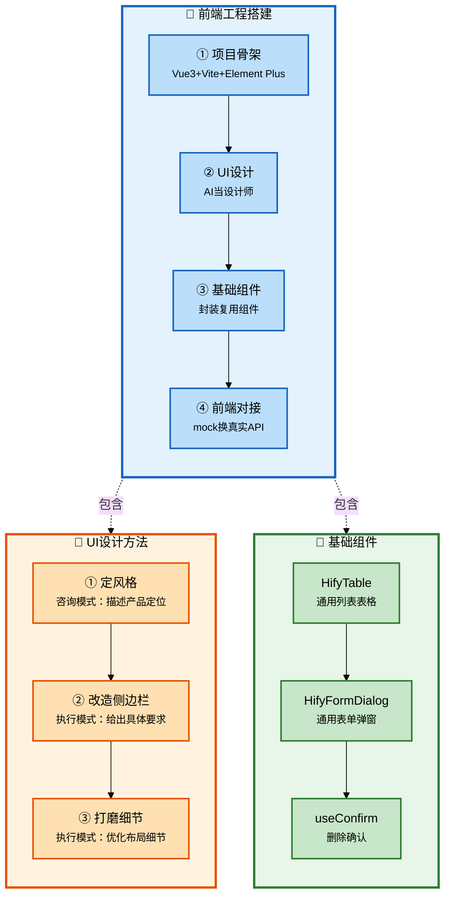

# Claude Code 企业级全链路开发 - 工程搭建（下）与前端UI设计

## 批次信息

- **批次编号**: batch-05
- **处理日期**: 2026-05-08
- **涉及文档**: 
  - 11｜基础组件（下)：前端 UI 设计与前端基础组件
  - 12｜实操课：工程搭建全流程演示
- **所属章节**: 第四章-工程搭建
- **前置批次**: batch-04（工程搭建上：后端基础组件）

---

## 一、核心研发全流程（10个阶段）

| 序号 | 研发阶段 | 核心产出物 | Agent协作模式 |
|------|----------|-----------|---------------|
| 1-5 | 准备+设计 | 产品定义、CLAUDE.md | 人类主导+咨询模式 |
| **6** | **任务拆解** | **任务清单** | **人类主导** |
| **7-8** | **编码执行+基础设施** | **功能代码+基础组件** | **执行模式** |
| 9 | 联调测试 | 可运行系统 | 执行模式 |
| 10 | 部署交付 | 交付物 | 执行模式 |

> 📌 **本批次重点**: 阶段7-8的前端工程部分

---

## 二、每个环节的Agent协作方式详解

### 2.1 流程图整体说明



---

### 2.2 阶段分类与详细说明

#### 【前端工程】项目骨架搭建

##### 阶段7-8：前端工程初始化

| 属性 | 内容 |
|------|------|
| **阶段说明** | 搭建Vue3前端工程，配置Vite和Element Plus |
| **Agent协作模式** | 执行模式 |
| **核心产出物** | 可运行的前端工程骨架 |
| **关键原则** | 技术栈按CLAUDE.md定义，保持与后端接口对齐 |

**Agent协作方式**:

**任务1：Vue项目初始化**

| 检查项 | 内容 |
|--------|------|
| 技术栈 | Vue 3 + TypeScript + Vite + Element Plus |
| 目录结构 | 与CLAUDE.md定义一致 |
| Vite代理 | `/api`转发到`localhost:8080` |

**Agent指令模板**:
```
"初始化Hify前端项目hify-web。Vue 3 + TypeScript + Vite + Element Plus。
目录结构按CLAUDE.md中定义的前端结构来。
Vite开发服务器配置代理：/api请求转发到localhost:8080。"
```

---

#### 【UI设计】让AI当设计师

##### 2.2.1 让AI当设计师

| 属性 | 内容 |
|------|------|
| **阶段说明** | 用咨询模式让AI帮你设计UI风格和组件 |
| **Agent协作模式** | 咨询模式（描述产品定位，让AI给出设计方案） |
| **核心产出物** | 设计系统规范 |
| **关键原则** | 不是"帮我设计一个好看的界面"，而是告诉AI产品是什么、用户是谁、风格偏好 |

**Agent协作方式**:

**关键前提**（原文引用）:
> "不是说'帮我设计一个好看的界面'，而是要告诉它产品是什么、用户是谁、你想要什么风格。"

**指令结构**（原文）:
```
[产品是什么] → [用户是谁] → [你想要什么风格] → [具体色调偏好] → [参考]
层层递进，Claude Code不需要猜
```

**示例指令**（原文）:
```
Hify是一个AI Agent开发平台，面向技术团队内部使用，用户是开发者。
界面以管理后台为主——大量表格、表单、配置页，加一个对话交互页面。
风格：浅底 + 科技感点缀。侧边栏深色底，按钮和关键元素用亮色。
主色蓝紫系（科技感强），辅色青色。
参考Linear、Supabase的视觉风格——干净但不无聊。
帮我设计一套完整的设计系统：主色/辅色/背景色阶/文字色阶/圆角/阴影/过渡动效。
```

---

##### 2.2.2 UI改造三步法

| 步骤 | 内容 | Agent协作 |
|------|------|----------|
| **第一步** | 定风格方向 | 咨询模式：描述产品定位和风格参考 |
| **第二步** | 改造侧边栏 | 执行模式：给出具体改造要求 |
| **第三步** | 页面整体布局 | 执行模式：优化布局细节 |

**侧边栏改造要点**（原文）:
```
背景：深色（接近纯黑，用--color-bg-dark）
Logo区域：品牌名用主色渐变文字
菜单项：hover时背景微亮，选中态左边3px主色竖线
菜单图标：Element Plus图标
底部：折叠/展开按钮，版本号
```

---

##### 2.2.3 UI打磨方法论

| 属性 | 内容 |
|------|------|
| **阶段说明** | 用通用句式描述问题，让AI修复 |
| **Agent协作模式** | 执行模式 |
| **关键原则** | 你不需要会写CSS，但需要能说清楚"哪里不对"和"应该怎样" |

**核心认知**（原文引用）:
> "你不需要会写CSS，但你需要能说清楚'哪里不对'和'应该怎样'。"

**通用句式**:
```
[位置/组件] + [哪里不对] + [应该怎样]
```

**打磨示例**（原文）:

| 问题 | 描述 | 修改 |
|------|------|------|
| 间距太大 | "表格和顶部标题区间距太大" | "改成16px" |
| 颜色不当 | "禁用状态用红色" | "禁用是正常状态，用灰色" |
| 弹窗太宽 | "新增提供商弹窗宽度太宽" | "600px改成520px" |
| 按钮样式 | "操作列按钮用默认primary样式" | "编辑蓝色text，删除红色text" |

---

#### 【基础组件】前端封装

##### 2.2.4 五大前端组件封装

| 属性 | 内容 |
|------|------|
| **阶段说明** | 封装可复用的前端组件，减少重复代码 |
| **Agent协作模式** | 执行模式 |
| **核心产出物** | 5个通用组件 |
| **关键原则** | 后端工程师不需要在前端细节上花太多时间，描述清楚接口和行为即可 |

**封装原则**（原文引用）:
> "后端工程师不需要在前端组件的实现细节上花太多时间。描述清楚每个组件的接口和行为，让Claude Code一次性生成。"

**五大前端组件**

| 组件 | 功能 | 解决什么问题 |
|------|------|-------------|
| **HifyTable.vue** | 通用列表表格 | 分页、loading状态自动管理，暴露refresh()方法 |
| **HifyFormDialog.vue** | 通用表单弹窗 | 新增/编辑模式，open(data?)区分 |
| **useConfirm.ts** | 删除确认composable | 一行代码完成"确认→调接口→提示" |
| **useRequest.ts** | 请求状态管理 | 返回{data, loading, error, execute} |
| **notify.ts** | 统一通知封装 | notifySuccess/notifyError/notifyWarning |

---

##### 2.2.5 一条指令生成模板

**Agent协作方式**:

**Agent指令模板**:
```markdown
在hify-web中创建以下前端公共组件（src/components/）。
所有组件使用Vue 3 Composition API + TypeScript + Element Plus：

1. HifyTable.vue：通用列表页表格组件
   Props：columns配置（label/prop/width/slot）、api方法（返回PageResult）
   内部自动管理loading状态、分页参数
   暴露refresh()方法

2. HifyFormDialog.vue：通用表单弹窗
   Props：title、width、表单rules
   v-model控制显示，open(data?)区分新增/编辑
   提交触发submit事件

3. useConfirm.ts：删除确认composable
   接收确认文案和API方法
   一行代码完成"确认删除→调接口→成功提示"

4. useRequest.ts：请求状态管理composable
   返回{data, loading, error, execute}

5. notify.ts：统一通知封装
   导出notifySuccess/notifyError/notifyWarning

每个组件TypeScript类型定义，泛型支持不同数据类型。
```

---

#### 【实操】工程搭建完整流程

##### 2.2.6 工程搭建完整流程

| 分类 | 内容 | 验收 |
|------|------|------|
| **后端工程** | Maven骨架+hify-common+业务空壳+基础组件 | `mvn compile`成功 |
| **前端工程** | Vue骨架+axios封装+UI设计+基础组件 | `npm run dev`成功 |

**后端工程（batch-04）**

| 阶段 | 内容 | 验收 |
|------|------|------|
| Maven骨架 | 父pom+子模块pom | `mvn compile`成功 |
| hify-common | Result/异常/配置 | 无编译错误 |
| 业务空壳 | Package结构 | Spring Boot启动 |
| 基础组件 | 线程池/HTTP/熔断 | 各组件测试通过 |

**前端工程（batch-05）**

| 阶段 | 内容 | 验收 |
|------|------|------|
| Vue骨架 | Vite+Element Plus | `npm run dev`成功 |
| axios封装 | 统一请求层 | 调用健康检查成功 |
| UI设计 | 设计系统+侧边栏 | 科技感界面 |
| 基础组件 | HifyTable等5个组件 | CRUD演示通过 |

---

##### 2.2.7 任务拆解粒度

| 属性 | 内容 |
|------|------|
| **判断标准** | 以"一次能验证"为单位 |
| **验证节点** | 每个子任务完成后立即验证 |

**判断标准**（原文）:
> "以'一次能验证'为单位。"

**验证节点示例**:

| 子任务 | 验证命令 |
|--------|----------|
| Maven骨架 | `mvn compile` |
| hify-common | 无编译错误 |
| 业务空壳 | Spring Boot能启动 |
| 健康检查接口 | `curl localhost:8080/api/v1/health`返回200 |

---

##### 2.2.8 报错处理方法

| 属性 | 内容 |
|------|------|
| **高效方式** | 给完整日志+上下文 |
| **差的方式** | 只说"报错了，帮我修复" |

**高效方式**（原文）:
```
差的方式：
"报错了，帮我修复"

好的方式：
"mvn clean install报错了，完整错误如下：
[ERROR]...（完整错误日志）
项目结构是Maven多模块，相关pom如下：
...（相关pom内容）
帮我分析根本原因并修复。"
```

---

##### 2.2.9 SDD闭环日常

| 属性 | 内容 |
|------|------|
| **核心原则** | 发现问题后，补规范而不是只改代码 |
| **效果** | 同样的问题不会重复出现 |

**实际案例**（原文）:
```
问题：Claude在GlobalExceptionHandler兜底catch里硬编码code:500
人类决策：补规范"异常处理必须使用ErrorCode枚举，禁止硬编码"
效果：下次再写类似代码，问题不会重复出现
```

---

## 三、与前置批次的关联

| 批次 | 核心内容 | 与batch-05的关联 |
|------|----------|------------------|
| **batch-01** | 角色转变、三层分工 | 前端组件属于"AI全权处理"层 |
| **batch-02** | SDD规范驱动 | 前端规范写入CLAUDE.md |
| **batch-03** | 架构设计 | 前端技术栈按架构决策执行 |
| **batch-04** | 后端基础组件 | 后端先完成，前端对接mock数据 |

---

## 四、内容校验清单

- [x] Mermaid流程图（深色边框+浅色填充+黑色文字）✓
- [x] 流程图整体说明 ✓
- [x] 阶段分类与详细说明 ✓
- [x] 前端UI设计方法论 ✓
- [x] AI当设计师的指令结构 ✓
- [x] UI打磨通用句式 ✓
- [x] 五大前端组件封装 ✓
- [x] 一条指令生成模板 ✓
- [x] 实操课核心方法论 ✓
- [x] 工程搭建完整流程 ✓
- [x] 与前置批次的关联 ✓

---

*本文件由Claude Code辅助整理，内容来自原文11-12讲*
