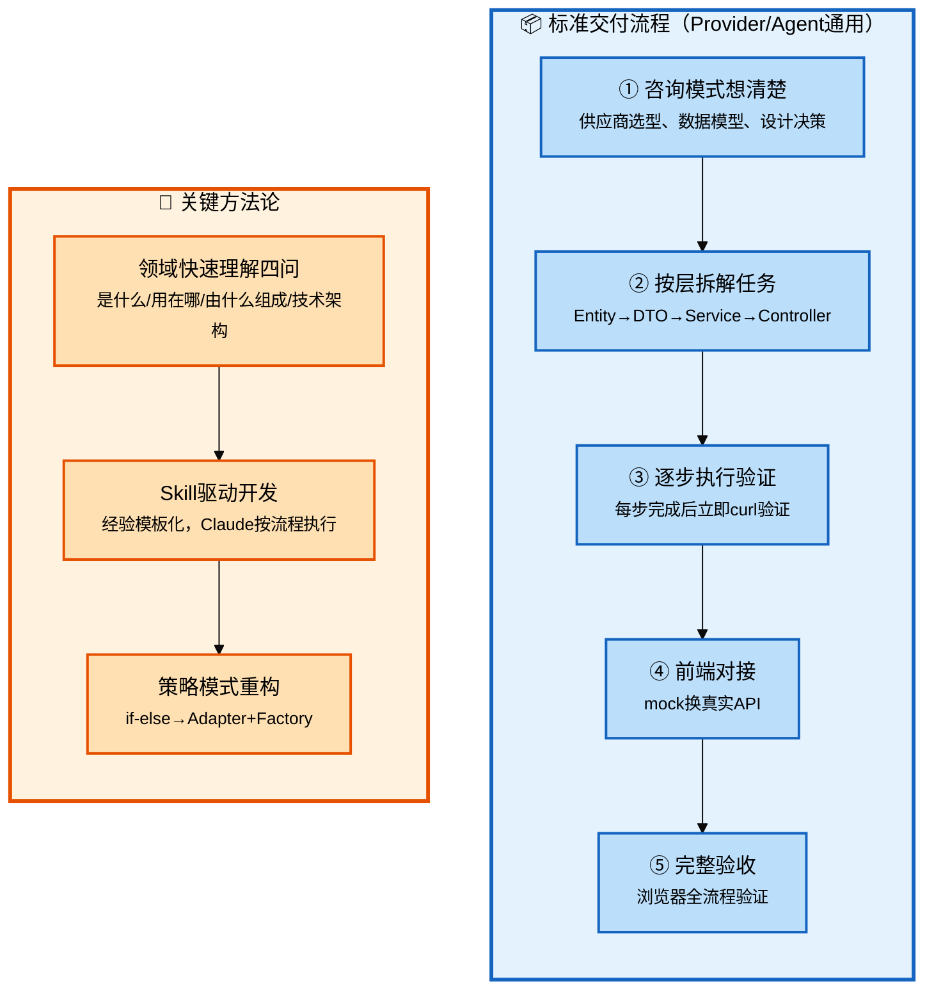
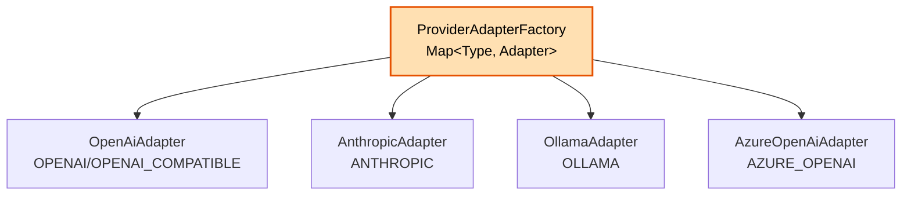

# Claude Code 企业级全链路开发 - 核心功能基础（模型提供商+Agent+Skill）

## 批次信息

- **批次编号**: batch-06
- **处理日期**: 2026-05-08
- **涉及文档**: 
  - 13｜模型提供商管理：第一个完整功能的交付闭环
  - 14｜把经验变成 Skill：让 Claude Code 自动按流程走
  - 15｜Agent 创建与配置：复杂业务逻辑的拆解策略
- **所属章节**: 第五章-核心功能基础
- **前置批次**: batch-05（工程搭建下）

---

## 一、核心研发全流程（10个阶段）

| 序号 | 研发阶段 | 核心产出物 | Agent协作模式 |
|------|----------|-----------|---------------|
| 1-5 | 准备+设计 | 产品定义、CLAUDE.md | 人类主导+咨询模式 |
| **6** | **任务拆解** | **任务清单** | **人类主导** |
| **7** | **编码执行** | **功能代码** | **执行模式** |
| 8 | 基础设施 | 公共组件 | 咨询模式 |
| 9 | 联调测试 | 可运行系统 | 执行模式 |
| 10 | 部署交付 | 交付物 | 执行模式 |

> 📌 **本批次重点**: 阶段6-7（任务拆解与编码执行）的具体方法论

---

## 二、每个环节的Agent协作方式详解

### 2.1 流程图整体说明



---

### 2.2 阶段分类与详细说明

#### 【执行阶段】核心方法论

---

##### 领域快速理解四问

| 问题 | 目的 | 应用场景 |
|------|------|----------|
| **是什么？** | 建立基本认知 | 接手陌生业务模块 |
| **用在哪里？** | 理解用户价值 | 产品定位决策 |
| **由什么组成？** | 拆解核心要素 | 数据模型设计 |
| **技术架构怎样？** | 理解实现难度 | 技术选型 |

**原文引用**:
> "一两个小时建立70%的认知，支撑产品定义和架构决策。"

**应用示例**（原文Provider分析）:
```
提问："Hify要支持LLM模型提供商管理。主流供应商有哪些？API共性和差异？一期必须支持哪些？"
Claude输出：按接口兼容性/认证方式/消息格式三维度分类
→ 直接影响架构决策：OpenAI兼容类型是通用适配的关键
```

---

##### 标准交付流程（五步）

| 步骤 | 内容 | Agent协作 | 验收标准 |
|------|------|----------|----------|
| **①** | 咨询模式想清楚 | 人类提问→Claude分析→人类拍板 | 设计决策文档 |
| **②** | 按层拆解任务 | 人类主导拆解 | 任务清单 |
| **③** | 逐步执行验证 | 执行模式，curl验证 | 每个curl返回200 |
| **④** | 前端对接 | mock换真实API | 浏览器验证 |
| **⑤** | 完整验收 | 端到端测试 | 全流程通过 |

**关键洞察**（原文引用）:
> "上来就让Claude Code写代码是最常见的错误。你连这个模块要考虑哪些东西都没想清楚，它写出来的代码一定有遗漏。"

---

#### 任务拆解方法论

##### Provider模块拆解示例（8个任务）

| 任务 | 内容 | 层级 | 验收 |
|------|------|------|------|
| 1 | Entity+Mapper | 数据层 | `mvn compile`成功 |
| 2 | DTO请求/响应对象 | 接口层 | 类型定义正确 |
| 3 | Service CRUD+缓存 | 业务层 | `curl POST/GET`成功 |
| 4 | 连通性测试 | 业务层 | 测试API Key有效 |
| 5 | Agent管理（Agent模块） | 业务层 | 关联查询正确 |
| 6 | 健康检查定时任务 | 任务层 | 定时更新health表 |
| 7 | Controller | 接口层 | curl全部返回200 |
| 8 | 前端API+页面对接 | 前端 | 浏览器验证 |

**拆解原则**（原文引用）:
> "每个任务只涉及一层，产出物可独立验证，从底层往上层搭。"

---

##### Agent模块拆解要点

**跨模块调用规范**:
```
Agent创建时校验modelConfigId存在且enabled
→ 调ProviderService接口，不直接查mapper
→ 跨模块走Service接口是CLAUDE.md已有规范
```

**语义拆分原则**:
```
PUT /api/v1/agents/{id}           # 更新基本信息（不含toolIds）
PUT /api/v1/agents/{id}/tools     # 全量替换工具列表
→ 语义清晰，不存在歧义
```

---

#### Skill驱动开发

##### Skill本质

**原文定义**:
> "Skill就是写MarkDown文档。按格式定规范，在MarkDown里写好规范，让Claude Code去识别执行。"

##### 模块交付Skill模板

```markdown
# Skill: 模块交付标准流程

## Step 1 - Entity
[产出物、规范、验证命令]

## Step 2 - Mapper
[产出物、规范、验证命令]

## Step 3 - DTO
[产出物、规范、注意事项]

## Step 4 - Service
[产出物、业务逻辑、缓存注解、验证]

## Step 5 - Controller
[产出物、验证curl、注意事项]

## Step 6 - 前端API文件
[产出物、类型定义]

## Step 7 - 前端页面对接
[产出物、验证流程]

## 常见坑速查
[坑1：原因：修复]
```

##### Provider Adapter Skill模板

```markdown
# Skill: 新增Provider Adapter

## Step 1 - 分析目标供应商API
[认证方式/列模型接口/必填字段/baseUrl默认值/特殊请求头]

## Step 2 - 实现Adapter
[implements ProviderAdapter接口]

## Step 3 - 注册到Factory
[新Adapter加@Component，Factory自动扫描]

## Step 4 - 更新枚举（如需要）
[后端+前端同步]

## Step 5 - 验证
[curl验证/浏览器验证]
```

##### Skill使用场景

| 场景 | 触发词 | 效果 |
|------|--------|------|
| 新业务模块 | "按模块交付Skill做XXX" | 自动按流程走 |
| 新供应商 | "接入新供应商" | 自动按Adapter流程走 |
| 常规CRUD | "用HifyTable实现XXX" | 复用模板 |

---

#### 策略模式重构

##### 问题背景

```java
// if-else写法（13讲原始版）
if ("OPENAI".equals(type)) {
    // test OpenAI API
} else if ("ANTHROPIC".equals(type)) {
    // test Anthropic API
}
// ... 更多else if
```

##### 解决方案



**接口定义**:
```java
public interface ProviderAdapter {
    List<String> supportedTypes();
    ConnectionTestResult test(Provider provider, OkHttpClient client);
    List<String> listModels(Provider provider, OkHttpClient client);
    RequestBody buildChatRequest(Provider provider, List<ChatMessage> messages);
    String parseDelta(String line);
}
```

**关键优势**:
- 新增供应商只需加一个Adapter类
- Factory自动扫描注册，无需改已有代码
- 测试时只关注单个Adapter

---

## 三、Agent模块数据模型

### 3.1 三张核心表

```sql
-- Agent主表
CREATE TABLE agent (
    id BIGINT AUTO_INCREMENT PRIMARY KEY,
    name VARCHAR(100) NOT NULL UNIQUE,
    system_prompt TEXT,           -- 角色指令
    model_config_id BIGINT,      -- 绑定模型
    temperature DECIMAL(3,2),    -- 创意度 0.00~1.00
    max_tokens INT,               -- 最大输出
    max_context_turns INT,       -- 保留上下文轮数
    enabled TINYINT DEFAULT 1
);

-- Agent工具关联表（多对多）
CREATE TABLE agent_tool (
    agent_id BIGINT,
    tool_id BIGINT,              -- MCP Server ID
    UNIQUE KEY uk_agent_tool (agent_id, tool_id)
);

-- 对话会话表（已有）
CREATE TABLE chat_session (
    id BIGINT,
    agent_id BIGINT              -- 外键关联
);
```

### 3.2 智能客服配置示例

| 配置项 | 值 | 理由 |
|--------|-----|------|
| 模型 | GPT-4o | 理解准确，够用 |
| System Prompt | 客服角色指令 | 定义灵魂 |
| temperature | 0.3 | 回答稳定可靠 |
| max_tokens | 1024 | 够用不浪费 |
| max_context_turns | 8 | 3-5轮解决大多数问题 |

---

## 四、与前置批次的关联

| 批次 | 核心内容 | 与batch-06的关联 |
|------|----------|------------------|
| **batch-01** | 三层分工 | Agent是复杂业务模块，人类主导拆解 |
| **batch-02** | SDD规范驱动 | Skill是规范的模板化实现 |
| **batch-03** | 架构设计 | 策略模式是batch-03提到的外部调用设计延伸 |
| **batch-04** | 工程初始化 | Provider/Agent复用batch-04的基础组件 |
| **batch-05** | 前端组件 | HifyTable/HifyFormDialog让前端对接只需换API |

---

## 五、内容校验清单

- [x] 领域快速理解四问 ✓
- [x] 标准交付流程五步 ✓
- [x] Provider任务拆解示例 ✓
- [x] Agent任务拆解要点 ✓
- [x] Skill本质与模板 ✓
- [x] 策略模式重构方案 ✓
- [x] Agent数据模型 ✓
- [x] 与前置批次的关联 ✓

---

*本文件由Claude Code辅助整理，内容来自原文13-15讲*
