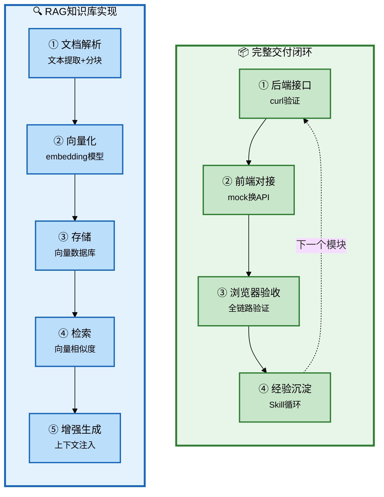

# Claude Code 企业级全链路开发 - 核心功能基础（下）+ RAG知识库

## 批次信息

- **批次编号**: batch-07
- **处理日期**: 2026-05-08
- **涉及文档**: 
  - 19｜实操课：核心功能基础篇全流程演示
  - 20｜RAG 知识库（上）：向量检索原理与实现方案
- **所属章节**: 第五章-核心功能基础 + 第六章-核心功能高级
- **前置批次**: batch-06（核心功能基础上）

---

## 一、核心研发全流程（10个阶段）

| 序号 | 研发阶段 | 核心产出物 | Agent协作模式 |
|------|----------|-----------|---------------|
| 1-5 | 准备+设计 | 产品定义、CLAUDE.md | 人类主导+咨询模式 |
| 6 | 任务拆解 | 任务清单 | 人类主导 |
| 7 | 编码执行 | 功能代码 | 执行模式 |
| 8 | 基础设施 | 公共组件 | 咨询模式 |
| **9** | **联调测试** | **可运行系统** | **执行模式** |
| 10 | 部署交付 | 交付物 | 执行模式 |

> 📌 **本批次重点**: 阶段9（联调测试）+ RAG知识库开发流程

---

## 二、每个环节的Agent协作方式详解

### 2.1 流程图整体说明



---

### 2.2 阶段分类与详细说明

#### 【交付阶段】完整交付闭环

---

##### 完整交付三步验收

| 步骤 | 内容 | Agent协作 | 验收标准 |
|------|------|----------|----------|
| **①** | 后端接口curl验证 | 执行模式 | 每个curl返回200 |
| **②** | 前端对接 | mock换真实API | API调用成功 |
| **③** | 浏览器全链路验收 | 端到端测试 | 完整功能验证 |

**关键洞察**（原文引用）:
> "curl通了不算完。浏览器走完整链路，才是真正的交付闭环，每一层都可能有自己的坑。"

**完整验收清单**:

```
✅ 后端curl接口全部返回200
✅ 浏览器操作能触发后端请求（Network状态码200）
✅ 前端状态正确更新（loading→数据→空状态）
✅ 定时任务正确执行（查数据库last_check_at）
✅ 多供应商接入验证（OpenAI/DeepSeek/Ollama）
```

---

##### 经验沉淀闭环

| 环节 | 内容 | 说明 |
|------|------|------|
| **做** | 实际开发模块 | 执行交付 |
| **沉淀** | 写成Skill | 经验编码化 |
| **调用** | 下次引用Skill | 自动按流程 |
| **迭代** | 补充遗漏坑点 | 持续完善 |

**原文引用**:
> "Skill写了要真的用。开始新模块前先看一眼.claude/skills/，习惯养成之前可以在CLAUDE.md顶部加一行提示。"

---

#### RAG知识库实现

##### RAG核心概念

**定义**（原文）:
> RAG = Retrieval-Augmented Generation（检索增强生成）
> 让AI回答问题时，能"查阅"自己的知识库，引用真实文档内容回答。

**价值**（原文）:
> "有了RAG，智能客服不只是靠模型的通用知识回答，而是能查真实数据。"

---

##### RAG五步流程

| 步骤 | 内容 | 技术方案 |
|------|------|----------|
| **①** | 文档解析 | 文本提取（PDF/TXT/Markdown） |
| **②** | 文本分块 | 固定长度分块、重叠策略 |
| **③** | 向量化 | Embedding模型（如text-embedding-ada-002） |
| **④** | 存储 | 向量数据库（如pgvector/Qdrant） |
| **⑤** | 检索+生成 | 相似度检索 → 注入上下文 → LLM生成 |

---

##### RAG数据模型设计

**核心表结构**（原文）:

```sql
-- 知识库主表
CREATE TABLE knowledge_base (
    id BIGINT,
    name VARCHAR(100),          -- 知识库名称
    description TEXT,           -- 描述
    embedding_model VARCHAR(50), -- 使用的embedding模型
    enabled TINYINT DEFAULT 1
);

-- 文档表
CREATE TABLE document (
    id BIGINT,
    knowledge_base_id BIGINT,   -- 关联知识库
    file_name VARCHAR(255),     -- 文件名
    file_size BIGINT,           -- 文件大小
    status VARCHAR(20),         -- PENDING/PROCESSING/COMPLETED/FAILED
    chunk_count INT,            -- 分块数量
    created_at DATETIME
);

-- 分块表（核心）
CREATE TABLE document_chunk (
    id BIGINT,
    document_id BIGINT,
    content TEXT,               -- 分块文本内容
    chunk_index INT,            -- 分块序号
    token_count INT,            -- token数量
    embedding_id VARCHAR(100),   -- 向量ID（外部向量库引用）
    created_at DATETIME
);

-- Agent与知识库关联
CREATE TABLE agent_knowledge (
    agent_id BIGINT,
    knowledge_base_id BIGINT,
    UNIQUE KEY (agent_id, knowledge_base_id)
);
```

---

##### RAG实现要点

| 要点 | 内容 |
|------|------|
| **分块策略** | 固定长度（500-1000字符）+ 重叠（50-100字符） |
| **向量存储** | pgvector（PostgreSQL扩展）或Qdrant |
| **检索方式** | 余弦相似度 Top-K 检索 |
| **上下文注入** | 把检索结果拼接到System Prompt |

---

## 三、与前置批次的关联

| 批次 | 核心内容 | 与batch-07的关联 |
|------|----------|------------------|
| **batch-01** | 角色转变 | 架构师决策RAG方案 |
| **batch-02** | SDD规范 | RAG实现遵循规范 |
| **batch-03** | 架构设计 | 向量数据库选型决策 |
| **batch-04** | 工程初始化 | 复用基础组件 |
| **batch-05** | 前端UI | RAG前端界面设计 |
| **batch-06** | Agent配置 | Agent绑定知识库 |

---

## 四、内容校验清单

- [x] 完整交付闭环三步 ✓
- [x] curl验证+浏览器验收 ✓
- [x] 经验沉淀Skill循环 ✓
- [x] RAG核心概念 ✓
- [x] RAG五步流程 ✓
- [x] RAG数据模型 ✓
- [x] 与前置批次的关联 ✓

---

*本文件由Claude Code辅助整理，内容来自原文19-20讲*
