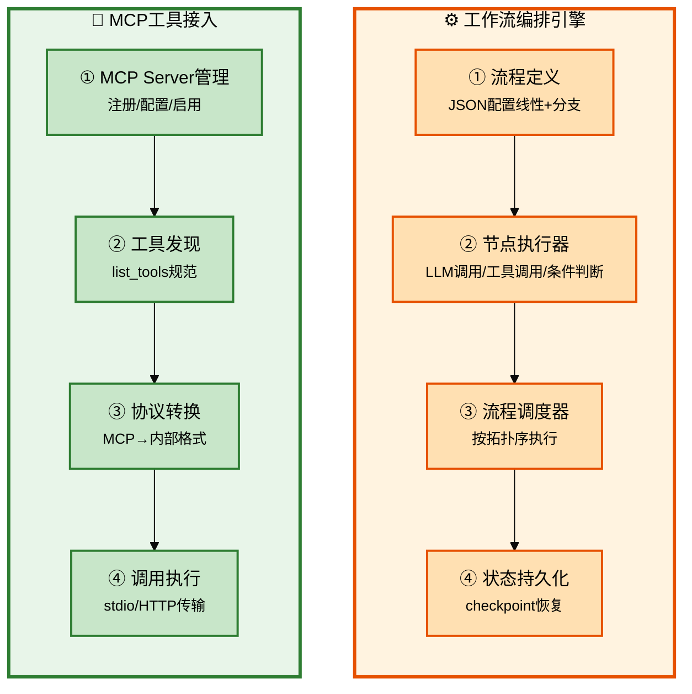
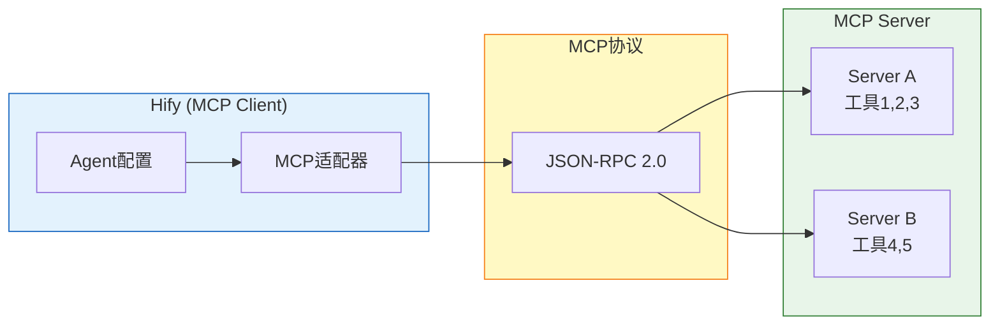

# Claude Code 企业级全链路开发 - 核心功能高级（工作流+MCP）

## 批次信息

- **批次编号**: batch-08
- **处理日期**: 2026-05-08
- **涉及文档**: 
  - 21-23｜RAG知识库(下)、工作流编排(上下)
  - 24-26｜MCP工具接入(上下)、实操课
- **所属章节**: 第六章-核心功能高级
- **前置批次**: batch-07（核心功能基础下）

---

## 一、核心研发全流程（10个阶段）

| 序号 | 研发阶段 | 核心产出物 | Agent协作模式 |
|------|----------|-----------|---------------|
| 1-5 | 准备+设计 | 产品定义、CLAUDE.md | 人类主导+咨询模式 |
| 6 | 任务拆解 | 任务清单 | 人类主导 |
| 7 | 编码执行 | 功能代码 | 执行模式 |
| 8 | 基础设施 | 公共组件 | 咨询模式 |
| 9 | 联调测试 | 可运行系统 | 执行模式 |
| 10 | 部署交付 | 交付物 | 执行模式 |

> 📌 **本批次重点**: 核心功能高级能力（工作流编排、MCP工具接入）

---

## 二、每个环节的Agent协作方式详解

### 2.1 流程图整体说明



---

### 2.2 阶段分类与详细说明

#### 【工作流编排】工作流核心概念

**定义**（原文）:
> 工作流 = 按预设逻辑编排的AI执行路径，支持条件分支、循环、并行

**与Agent的区别**（原文）:
```
Agent: 单次LLM调用+工具执行，有一定自主决策
Workflow: 预设执行路径，线性或条件分支，更可控
```

---

#### 工作流数据模型

```sql
-- 工作流定义表
CREATE TABLE workflow (
    id BIGINT,
    name VARCHAR(100),           -- 工作流名称
    description TEXT,            -- 描述
    definition JSON,             -- 流程定义JSON
    -- definition结构示例：
    -- { "nodes": [{"id":"1","type":"llm","config":{...}}, ...], 
    --   "edges": [{"from":"1","to":"2","condition":"..."}] }
    enabled TINYINT DEFAULT 1,
    created_at DATETIME
);

-- 工作流执行记录表
CREATE TABLE workflow_execution (
    id BIGINT,
    workflow_id BIGINT,
    status VARCHAR(20),          -- RUNNING/COMPLETED/FAILED
    input_data JSON,            -- 输入参数
    output_data JSON,           -- 输出结果
    started_at DATETIME,
    finished_at DATETIME
);
```

---

#### 工作流节点类型

| 节点类型 | 说明 | 示例 |
|----------|------|------|
| **LLM节点** | 调用LLM生成内容 | "生成产品介绍" |
| **工具节点** | 调用MCP工具 | "查订单状态" |
| **条件节点** | 根据条件分支 | "if token > 1000 then A else B" |
| **结束节点** | 流程终点 | 输出最终结果 |

---

#### 【MCP工具接入】MCP核心概念

**定义**（原文）:
> MCP = Model Context Protocol，让AI应用能调用外部工具的标准协议

**价值**:
```
Agent + MCP = 能执行真实操作的AI
不只回答问题，还能：查订单、改状态、发消息
```

---

#### 【MCP工具接入】MCP架构



---

#### 【MCP工具接入】MCP实现要点

| 环节 | 内容 | 技术方案 |
|------|------|----------|
| **Server管理** | 注册、配置、启用/禁用 | 数据库存储连接信息 |
| **工具发现** | list_tools获取可用工具 | MCP协议规范 |
| **协议转换** | MCP格式→内部格式 | JSON-RPC转换 |
| **调用传输** | stdio或HTTP | 按Server类型选择 |

---

## 三、与前置批次的关联

| 批次 | 核心内容 | 与batch-08的关联 |
|------|----------|------------------|
| **batch-01** | 角色转变 | 架构师决策工作流/MCP方案 |
| **batch-02** | SDD规范 | 新模块遵循模块交付Skill |
| **batch-03** | 架构设计 | 工作流作为Agent的能力扩展 |
| **batch-04** | 工程初始化 | 复用基础组件 |
| **batch-05** | 前端UI | 工作流/MCP管理界面 |
| **batch-06** | Agent配置 | Agent绑定MCP工具 |
| **batch-07** | RAG知识库 | 工作流可调用RAG |

---

## 四、内容校验清单

- [x] 工作流编排核心概念 ✓
- [x] 工作流数据模型 ✓
- [x] 工作流节点类型 ✓
- [x] MCP核心概念 ✓
- [x] MCP架构 ✓
- [x] MCP实现要点 ✓
- [x] 与前置批次的关联 ✓

---

*本文件由Claude Code辅助整理，内容来自原文21-26讲*
