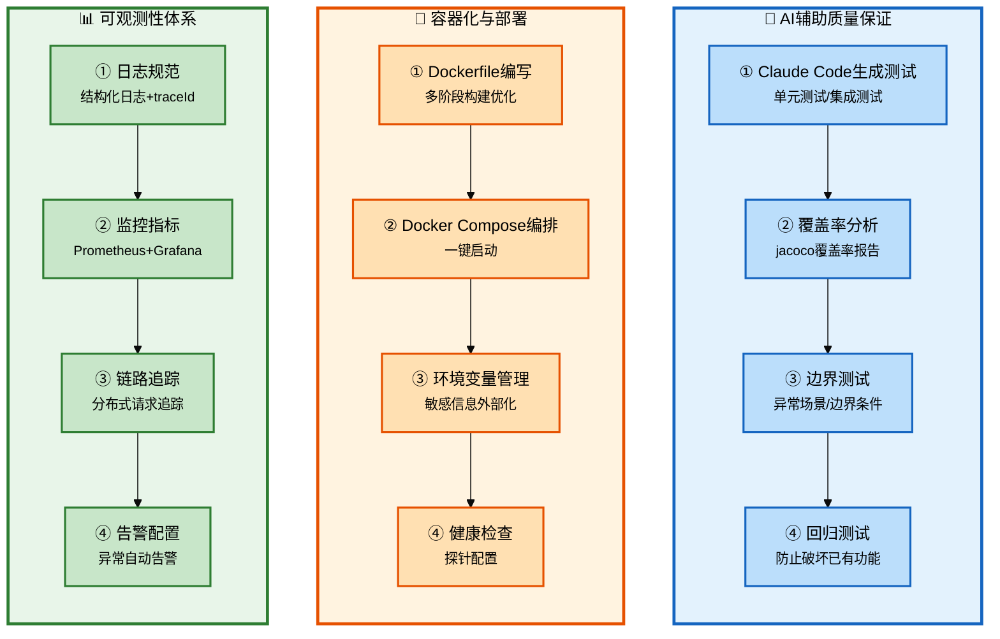

# Claude Code 企业级全链路开发 - 测试与部署

## 批次信息

- **批次编号**: batch-09
- **处理日期**: 2026-05-08
- **涉及文档**: 
  - 27｜AI写代码保证质量
  - 28｜容器化与部署
  - 29｜可观测性与排错
  - 30｜实操课：测试与部署全流程演示
- **所属章节**: 第七章-测试与部署
- **前置批次**: batch-08（核心功能高级）

---

## 一、核心研发全流程（10个阶段）

| 序号 | 研发阶段 | 核心产出物 | Agent协作模式 |
|------|----------|-----------|---------------|
| 1-5 | 准备+设计 | 产品定义、CLAUDE.md | 人类主导+咨询模式 |
| 6 | 任务拆解 | 任务清单 | 人类主导 |
| 7 | 编码执行 | 功能代码 | 执行模式 |
| 8 | 基础设施 | 公共组件 | 咨询模式 |
| 9 | 联调测试 | 可运行系统 | 执行模式 |
| **10** | **部署交付** | **交付物** | **执行模式** |

> 📌 **本批次重点**: 阶段9-10（联调测试+部署交付）的完整方法论

---

## 二、每个环节的Agent协作方式详解

### 2.1 流程图整体说明



---

### 2.2 阶段分类与详细说明

#### 【测试】AI辅助质量保证

##### 测试生成策略

| 测试类型 | 生成方式 | Agent协作 |
|----------|----------|----------|
| **单元测试** | Claude Code生成 | 执行模式 |
| **集成测试** | 端到端场景 | 执行模式 |
| **边界测试** | 异常场景覆盖 | 咨询模式 |
| **回归测试** | 防止破坏已有功能 | 执行模式 |

**原文核心观点**:
> "Claude Code可以帮你生成测试用例，但不能替你做最终判断——什么程度的测试覆盖率是够的，什么场景必须覆盖。"

---

#### 测试生成Agent指令

```
生成单元测试：
"为ProviderService生成单元测试，覆盖：
1. 创建Provider成功场景
2. name重复校验
3. 逻辑删除后查询不到
4. 缓存失效重新查询"

生成集成测试：
"写一个端到端集成测试：
1. 创建Provider
2. 调用test-connection
3. 验证health状态更新
4. 清理测试数据"
```

---

#### 【部署】容器化与部署

##### Docker部署方案

| 组件 | 技术方案 | 说明 |
|------|----------|------|
| **后端** | Spring Boot JAR | 多阶段构建优化体积 |
| **前端** | Nginx + 静态资源 | 前后端分离部署 |
| **数据库** | MySQL官方镜像 | 数据卷持久化 |
| **向量库** | pgvector/Qdrant | AI相关数据存储 |
| **编排** | Docker Compose | 一键启动 |

---

#### Dockerfile模板

```dockerfile
# 多阶段构建
FROM maven:3.9-eclipse-temurin-17 AS builder
WORKDIR /app
COPY pom.xml .
RUN mvn dependency:go-offline
COPY src ./src
RUN mvn package -DskipTests

FROM eclipse-temurin:17-jre-alpine
WORKDIR /app
COPY --from=builder /app/target/*.jar app.jar
ENV JAVA_OPTS="-Xmx512m"
EXPOSE 8080
ENTRYPOINT ["sh", "-c", "java $JAVA_OPTS -jar app.jar"]
```

---

##### Docker Compose配置

```yaml
version: '3.8'
services:
  hify-backend:
    build: ./hify-app
    ports:
      - "8080:8080"
    environment:
      - SPRING_PROFILES_ACTIVE=prod
      - MYSQL_HOST=mysql
    depends_on:
      - mysql
      - redis

  hify-frontend:
    image: nginx:alpine
    ports:
      - "80:80"
    volumes:
      - ./dist:/usr/share/nginx/html

  mysql:
    image: mysql:8.0
    environment:
      - MYSQL_ROOT_PASSWORD=xxx
      - MYSQL_DATABASE=hify

  redis:
    image: redis:7-alpine
```

---

#### 【运维】可观测性体系

##### 日志规范

| 规范 | 内容 | 示例 |
|------|------|------|
| **格式** | JSON结构化日志 | `{"time":"...","level":"INFO","traceId":"..."}` |
| **traceId** | 请求链路追踪 | 贯穿整个请求生命周期 |
| **敏感信息** | 脱敏处理 | API Key、密码等 |
| **日志级别** | INFO/WARN/ERROR | 合理选择，避免噪音 |

**原文核心观点**:
> "日志是排查问题的第一手资料。日志打得好，问题无处藏；日志打得烂，排错两行泪。"

---

#### 监控指标

| 指标类型 | 采集方式 | 展示 |
|----------|----------|------|
| **JVM指标** | Micrometer | Grafana dashboard |
| **业务指标** | 自定义Metrics | 业务健康度 |
| **LLM调用** | 自定义Metrics | 延迟、错误率 |
| **数据库** | MySQL Exporter | 慢查询监控 |

---

##### 排错方法论

| 步骤 | 内容 | 工具 |
|------|------|------|
| **1. 日志追踪** | traceId关联全链路日志 | ELK/Loki |
| **2. 指标分析** | 异常时段的指标波动 | Prometheus+Grafana |
| **3. 链路追踪** | 请求在各组件的耗时 | Jaeger/Zipkin |
| **4. 线程dump** | 死锁、阻塞定位 | jstack |
| **5. 内存分析** | OOM原因定位 | jmap+jhat |

---

## 三、与前置批次的关联

| 批次 | 核心内容 | 与batch-09的关联 |
|------|----------|------------------|
| **batch-01** | 角色转变 | 架构师决策测试/部署方案 |
| **batch-02** | SDD规范 | 测试规范写入CLAUDE.md |
| **batch-03** | 架构设计 | 决定监控和可观测性方案 |
| **batch-04** | 工程初始化 | 预留监控埋点 |
| **batch-05** | 前端UI | 前端错误监控 |
| **batch-06-08** | 核心功能 | 各模块测试验收 |

---

## 四、内容校验清单

- [x] AI辅助测试生成策略 ✓
- [x] 测试生成Agent指令 ✓
- [x] Docker容器化方案 ✓
- [x] Dockerfile模板 ✓
- [x] Docker Compose配置 ✓
- [x] 日志规范 ✓
- [x] 监控指标体系 ✓
- [x] 排错方法论 ✓

---

*本文件由Claude Code辅助整理，内容来自原文27-30讲*
