# Claude Code 企业级全链路开发 - 高阶与复盘

## 批次信息

- **批次编号**: batch-10
- **处理日期**: 2026-05-08
- **涉及文档**: 
  - 31｜进阶：老项目改造
  - 32｜局限与起点
  - 结束语
- **所属章节**: 第八章-高阶与复盘
- **前置批次**: batch-09（测试与部署）

---

## 一、核心研发全流程（10个阶段）

| 序号 | 研发阶段 | 核心产出物 | Agent协作模式 |
|------|----------|-----------|---------------|
| 1-5 | 准备+设计 | 产品定义、CLAUDE.md | 人类主导+咨询模式 |
| 6 | 任务拆解 | 任务清单 | 人类主导 |
| 7 | 编码执行 | 功能代码 | 执行模式 |
| 8 | 基础设施 | 公共组件 | 咨询模式 |
| 9 | 联调测试 | 可运行系统 | 执行模式 |
| 10 | 部署交付 | 交付物 | 执行模式 |

> 📌 **本批次重点**: 老项目改造方法论 + 局限与最佳实践

---

## 二、每个环节的Agent协作方式详解

### 2.1 流程图整体说明

```mermaid
%%{init: {'theme': 'base', 'themeVariables': {'fontSize': '16px'}}}%%
flowchart TB
    %% 老项目改造 %%
    subgraph LEGACY["🏚️ 老项目改造"]
        direction TB
        L1["① 现状评估<br/><small>技术债+架构分析</small>"]
        L2["② 改造规划<br/><small>分层+渐进式</small>"]
        L3["③ CLAUDE.md编写<br/><small>项目上下文</small>"]
        L4["④ 改造执行<br/><small>模块化重构</small>"]
        L5["⑤ 质量保障<br/><small>测试覆盖</small>"]
        L1 --> L2 --> L3 --> L4 --> L5
    end

    %% 经验总结 %%
    subgraph SUMMARY["📚 经验总结"]
        direction TB
        S1["① 核心方法论<br/><small>角色转变+SDD+Skill</small>"]
        S2["② 适用边界<br/><small>强项+局限</small>"]
        S3["③ 持续迭代<br/><small>经验积累+优化</small>"]
        S1 --> S2 --> S3
    end

    %% 样式定义 %%
    style LEGACY fill:#FFF3E0,stroke:#E65100,stroke-width:3px,color:#000000
    style L1 fill:#FFE0B2,stroke:#E65100,stroke-width:2px,color:#000000
    style L2 fill:#FFE0B2,stroke:#E65100,stroke-width:2px,color:#000000
    style L3 fill:#FFE0B2,stroke:#E65100,stroke-width:2px,color:#000000
    style L4 fill:#FFE0B2,stroke:#E65100,stroke-width:2px,color:#000000
    style L5 fill:#FFE0B2,stroke:#E65100,stroke-width:2px,color:#000000

    style SUMMARY fill:#E8F5E9,stroke:#2E7D32,stroke-width:3px,color:#000000
    style S1 fill:#C8E6C9,stroke:#2E7D32,stroke-width:2px,color:#000000
    style S2 fill:#C8E6C9,stroke:#2E7D32,stroke-width:2px,color:#000000
    style S3 fill:#C8E6C9,stroke:#2E7D32,stroke-width:2px,color:#000000
```



---

### 2.2 阶段分类与详细说明

#### 【改造】老项目改造方法论

##### 老项目改造四步法

| 步骤 | 内容 | 说明 |
|------|------|------|
| **①** | 现状评估 | 识别技术债、架构问题、改造优先级 |
| **②** | 改造规划 | 分层改造、渐进式推进 |
| **③** | CLAUDE.md编写 | 写清楚项目上下文和改造目标 |
| **④** | 改造执行 | 模块化重构，保持功能稳定 |

---

##### 老项目改造Agent指令

```
现状评估：
"分析当前项目（Hify）的技术债：
1. 哪些模块耦合严重需要拆分？
2. 哪些代码规范不符合CLAUDE.md？
3. 哪些基础设施缺失？
给出改造优先级建议。"

改造规划：
"基于现状评估，制定改造计划：
1. 优先级排序
2. 每次改造的范围边界
3. 改造后的验收标准
4. 如何保证不破坏现有功能"
```

---

### 2.3 Claude Code适用边界

#### 强项

| 场景 | 说明 | 效果 |
|------|------|------|
| **模板代码** | CRUD、配置、启动脚本 | 效率提升10倍 |
| **规范执行** | 遵循CLAUDE.md风格 | 一致性好 |
| **调研分析** | 陌生领域快速了解 | 1-2小时建立70%认知 |
| **重复性任务** | 类似模块开发 | 复用Skill |
| **调试辅助** | 错误分析、方案对比 | 快速定位 |

#### 局限

| 场景 | 说明 | 应对 |
|------|------|------|
| **架构决策** | 需要业务理解和权衡 | 人类必须拍板 |
| **复杂调试** | 涉及多系统交互 | 给出足够上下文 |
| **创新设计** | 全新领域的架构设计 | 先咨询后执行 |
| **需求模糊** | 没说清楚要什么 | 先想清楚再动手 |

---

#### 【迭代】持续迭代优化

##### 经验积累路径

| 阶段 | 积累内容 | 形式 |
|------|----------|------|
| **早期** | 项目规范 | CLAUDE.md |
| **中期** | 模块开发流程 | 模块交付Skill |
| **后期** | 特定场景最佳实践 | Adapter Skill |

##### 迭代原则

```
每次发现：
→ AI跑偏 → 补一条规范/注意事项
→ 流程重复 → 沉淀成Skill
→ 新领域 → 积累领域理解四问

效果：规范越来越锋利，Skill越来越丰富，效率越来越高
```

---

## 三、研发全流程完整回顾

### 10阶段研发流程与Agent协作

| 阶段 | 名称 | Agent协作模式 | 核心产出物 |
|------|------|--------------|------------|
| **1** | 需求分析 | 咨询模式 | 功能全景清单 |
| **2** | 边界定义 | 人类主导 | 产品边界文档 |
| **3** | 数据建模 | 人类主导 | ER图 |
| **4** | 规范编写 | 人类主导 | CLAUDE.md |
| **5** | 架构设计 | 咨询模式 | 架构决策文档 |
| **6** | 任务拆解 | 人类主导 | WBS任务清单 |
| **7** | 编码执行 | 执行模式 | 功能代码 |
| **8** | 基础设施 | 咨询模式 | 公共组件 |
| **9** | 联调测试 | 执行模式 | 可运行系统 |
| **10** | 部署交付 | 执行模式 | Docker镜像 |

---

### 核心方法论体系

| 方法论 | 阶段 | 核心价值 |
|--------|------|----------|
| **角色转变** | 全流程 | 开发者→架构师，做决策而非写代码 |
| **SDD规范驱动** | 准备+设计 | 规范是节省时间的捷径 |
| **三问裁剪法** | 需求分析 | 快速确定功能边界 |
| **Skill驱动** | 执行阶段 | 经验模板化，复用积累 |
| **三步检查法** | 编码执行 | 意图→质量→边界 |

---

## 四、与前置批次的关联

| 批次 | 核心内容 | 与batch-10的关联 |
|------|----------|------------------|
| **batch-01** | 角色转变 | 开发者→架构师的思维转变 |
| **batch-02** | SDD规范驱动 | 规范是经验的沉淀 |
| **batch-03** | 产品定义 | 需求边界是改造的前提 |
| **batch-04-08** | 核心功能开发 | 新项目→老项目→持续迭代 |
| **batch-09** | 测试与部署 | 交付保障 |

---

## 五、内容校验清单

- [x] 老项目改造四步法 ✓
- [x] 老项目改造Agent指令 ✓
- [x] Claude Code适用边界 ✓
- [x] 强项与局限分析 ✓
- [x] 持续迭代优化 ✓
- [x] 研发全流程完整回顾 ✓
- [x] 核心方法论体系 ✓

---

## 六、课程核心要点总结

### 核心理念

```
AI是放大器，不是发动机
你有方向它放大十倍，你没方向它放大的是零

用Claude Code做项目，瓶颈不在AI，在人的思考质量
你想得越清楚，它做得越准确
```

### 最终目标

```
培养"架构师+AI"的工作模式：
1. 你负责想清楚、做决策
2. AI负责写代码、执行
3. 经验通过规范和Skill持续积累
4. 每做一个项目，你和AI都变得更强
```

---

*本文件由Claude Code辅助整理，内容来自原文31-32讲+结束语*
