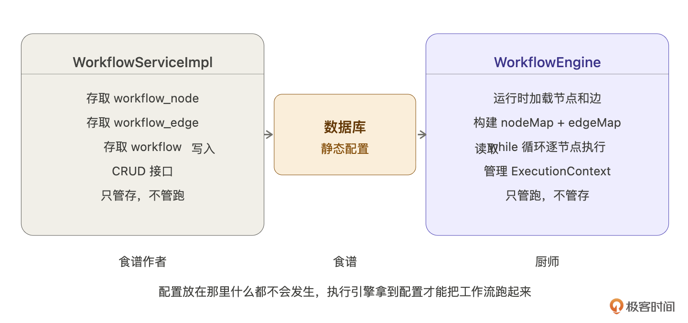
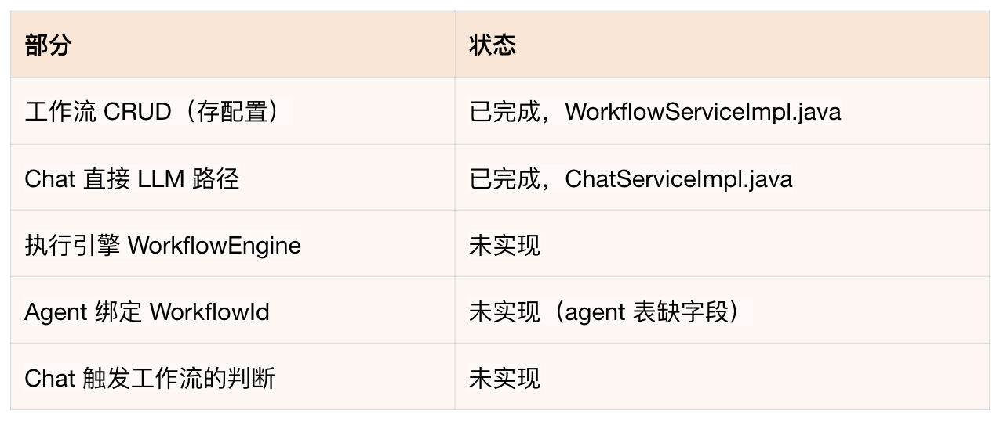
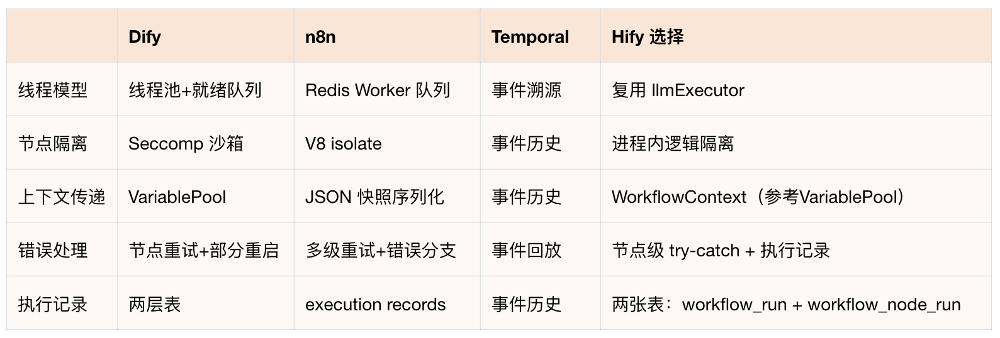
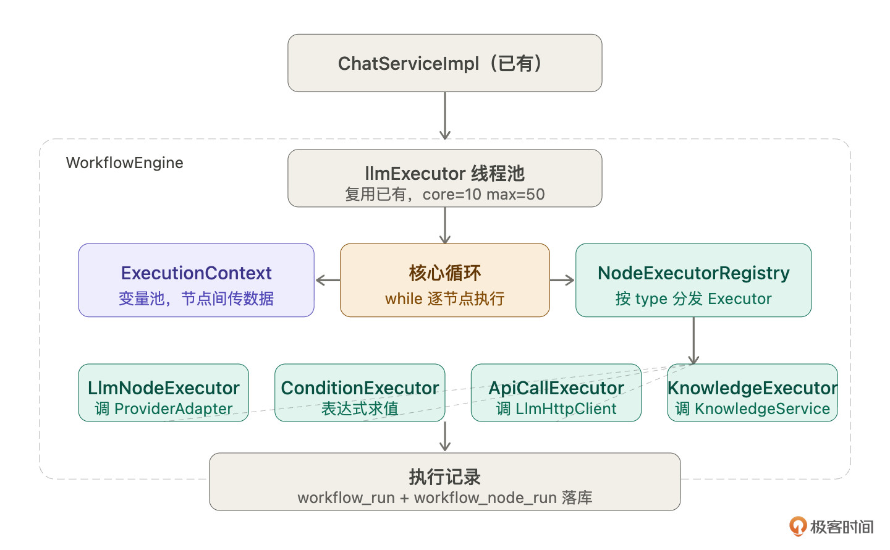
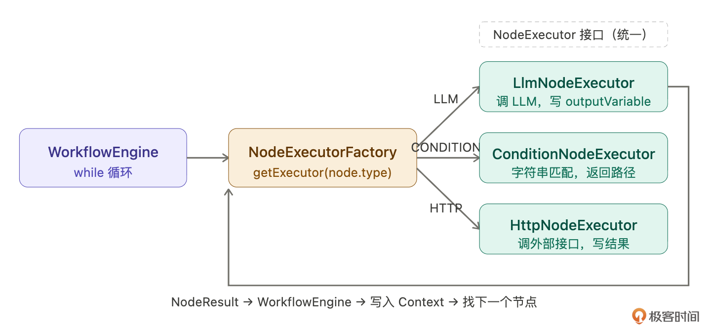
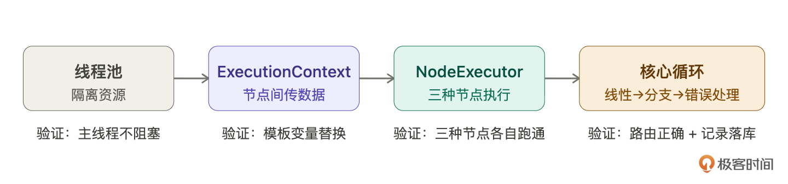
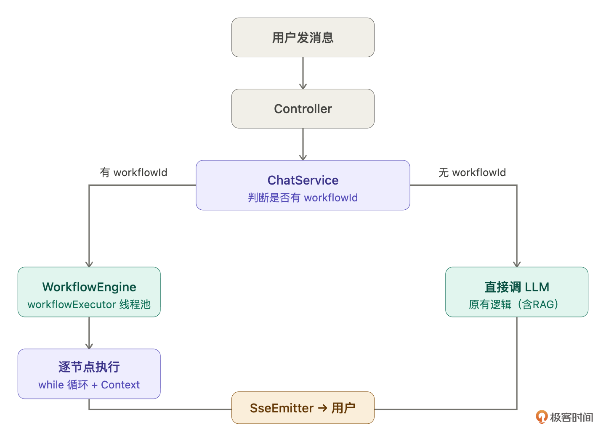
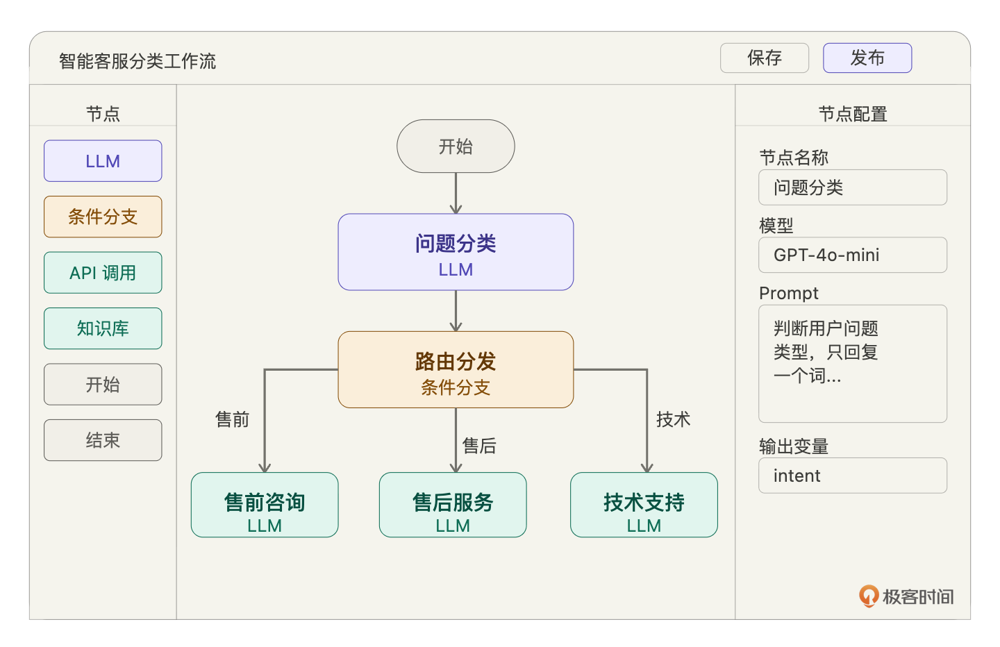

# 23｜工作流编排（下）：实现执行引擎，让工作流跑起来

你好，我是 Robert。

22 讲我们把工作流的元数据存进去了，三张表能完整保存节点和连线。但它只是一份静态配置，存进去读出来，就是不会动，这一讲让它动起来。怎么让它动起来呢？就是我们这节课要讲的执行引擎。

## 执行引擎是什么

老规矩，不懂先问。

> 工作流执行引擎是什么概念？它和 22 讲存的工作流配置是什么关系？怎么被触发？从用户发消息到工作流执行完毕返回结果，完整链路是什么样的？不要讲理论，结合 Hify 智能客服的场景解释。

Claude Code 没有凭空解释，它先把现有代码读了一遍：`ChatServiceImpl.java`、`WorkflowServiceImpl.java`，然后基于真实代码说清楚关系。



它的回答是：WorkflowServiceImpl 是我们上节课实现的工作流的元数据的存储。它是管配置的，执行引擎是另一个东西。`WorkflowServiceImpl`  只有 CRUD，也就是工作流配置的 CRUD。然后执行引擎是下一步要建的。

它用了个比喻，来说明元数据和引擎的关系。**食谱放在那里什么都不会发生，厨师拿到食谱才能把菜做出来。而工作流配置就是食谱，我们这一节要实现的执行引擎就是厨师**。来看下图：


执行引擎是**从数据库加载 22 讲存的那份配置，构建 **`**nodeMap + edgeMap**`**，然后从起始节点开始一个节点一个节点地执行，最终结果通过 SseEmitter 推给用户**。用户侧感知不到区别，收到的还是一样的 SSE 事件流。

Claude Code 还顺手列出了现在项目库中代码的实现状态：



## 业界怎么做

知道是什么了，但怎么实现？先别急着写代码，让 Claude Code 做一轮技术调研。

> 工作流执行引擎在业界有哪些主流的实现方案？重点看 Dify、Coze、n8n 这类 AI 应用平台是怎么设计的。我想了解：线程模型怎么选、节点执行怎么隔离、上下文数据怎么在节点间传递、错误处理和执行记录怎么做。最后给我一个建议：Hify 这种体量的项目应该选哪种方案，为什么。

这一步是在教你一个方法：**遇到不熟悉的系统设计，先让 Claude Code 做技术调研，再基于调研结果做决策**。不要凭感觉拍方案，也不要自己去翻文档，Claude Code 能在几秒内给你一份有质量的行业对比。

Claude Code 调研了 Dify、n8n、Coze、Temporal 四个平台的执行引擎的实现，整理如下：

**线程模型：**

- Dify：线程池  +  就绪队列，节点依赖满足后才入队
- n8n：多 Worker 进程  + Redis 消息队列，Worker 之间通过 Redis 协调
- Coze：Go goroutine，天生轻量并发
- Temporal：事件溯源状态机，崩了从检查点恢复

**上下文传递**：Dify 的 VariablePool 模式最值得参考，节点之间不直接传对象，通过命名变量引用。每个节点把输出写进变量池，下一个节点从池里按引用读。变量池只增不覆盖，历史输出不会被改掉。

**执行记录**：Dify 持久化两层，`workflow_run`（整次执行）和  `workflow_node_execution`（每个节点的执行记录），每次执行的每个节点都有完整记录，可以回放、调试、统计耗时。

Claude Code 的建议：**Hify 选轻量同步引擎，参考 Dify 的 VariablePool 模式，不引入消息队列**。

理由很清楚：

n8n 的 Redis Queue 是为了多 Worker 水平扩展设计的，Hify 面向小规模团队，`CLAUDE.md`  里 Redis 只做缓存，引入消息队列是过度工程化。Temporal 解决的是“工作流中途崩溃后从断点恢复”的问题，适合运行时间以小时 / 天计的工作流，Hify 的工作流是一次对话响应的一部分，最长几十秒，崩了直接报错重试。Dify 的代码沙箱（seccomp）是为了隔离用户自定义代码节点，Hify 的节点类型是 LLM / CONDITION / API_CALL / KNOWLEDGE，没有任意代码执行，不需要沙箱。

总结下四个方案的对比：



到这里我们对执行引擎的理解应该很完整了，这就是让 Claude Code 做业界调研的好处，它够快，信息够多。

## 执行引擎在代码里长什么样

调研完了，让 Claude Code 把设计具体化。

> 基于上面的调研结论，帮我把 Hify 执行引擎的代码结构梳理清楚。四个部分：线程池、ExecutionContext、NodeExecutor 体系、核心循环。每个部分是什么，相互之间怎么协作，用代码示例说明。先把现有的代码都读清楚，不基于假设设计。

Claude Code 先把现有代码读完，`ThreadPoolConfig.java`、`NodeConfigDef.java`、`NodeConfigParser.java`、`WorkflowNode.java`、`LlmHttpClient.java`  等，然后基于真实代码给出设计。



**线程池：复用 llmExecutor，不新建**。还记得不，我们在最开始的时候设计的线程池在这里复用了。

Claude Code 读了  `ThreadPoolConfig.java`——`llmExecutor`  是 core=10, max=50 的线程池，`CallerRunsPolicy`  保证不丢任务。工作流执行本质是 IO 密集型（调 LLM、调外部 API），和现有  `streamChat`  同属一类。不需要新建线程池，ChatServiceImpl 提交任务时就已经在 llmExecutor 线程里了，WorkflowEngine 感知不到线程池，只做同步执行。

**ExecutionContext：贯穿整个工作流的变量池。**对标 Dify 的 VariablePool。一次执行创建一个，从 START 节点活到 END 节点。key 格式是  `nodeKey.varName`，比如  `classify.intent`。节点只能写自己 nodeKey 下的变量，读可以读任意历史节点的输出。写入只增不改。

```
public class ExecutionContext {
    private final Map<String, Object> variables = new LinkedHashMap<>();
    public ExecutionContext(Long workflowRunId, String userMessage) {
        variables.put("start.userMessage", userMessage);  // 预写入，后续节点用 {{start.userMessage}} 引用
    }
    public void set(String nodeKey, String varName, Object value) {
        variables.put(nodeKey + "." + varName, value);
    }
    // 把 "根据以下内容判断意图：{{start.userMessage}}" 替换为实际值
    public String resolve(String template) {
        String result = template;
        for (Map.Entry<String, Object> entry : variables.entrySet()) {
            result = result.replace("{{" + entry.getKey() + "}}",
                entry.getValue() != null ? entry.getValue().toString() : "");
        }
        return result;
    }
}
```

Context 随节点执行逐步累积变量：


NodeExecutor 体系：统一接口，每种节点一个实现。和 14 讲 Provider 适配层是同一个模式。四种 Executor，Spring 自动注册到 Registry，按 type 分发。

```
public interface NodeExecutor {
    void execute(WorkflowNode node, NodeConfigDef config, ExecutionContext ctx);
    String nodeType();
}
```

`LlmNodeExecutor`：解析 config 里的 promptTemplate，用  `ctx.resolve()`  替换模板变量，复用已有的 ProviderAdapter 调 LLM，把返回内容写入 ctx。`ConditionNodeExecutor`：解析 expression，`ctx.resolve()`  替换变量后做字符串匹配，把 true/false 写入 ctx。`ApiCallNodeExecutor`：解析 url，替换变量后用  `LlmHttpClient`  调外部接口，把响应写入 ctx。`KnowledgeNodeExecutor`：调  `KnowledgeService.searchChunks()`，把检索结果拼成字符串写入 ctx，后续 LLM 节点用  `{{kb.docs}}`  引用。



新增节点类型只需要：在  `NodeConfigDef`  加一个 record，加一个  `@Component`  实现类，不改其他任何代码。

**核心循环：WorkflowEngine。**把前三件事串起来，加上执行记录。骨架就是一个 while 循环：

```
public String execute(Long workflowId, String userMessage) {
    // 1. 从 DB 加载配置，构建内存结构
    Map<String, WorkflowNode> nodeMap = loadNodeMap(workflowId);
    Map<String, List<WorkflowEdge>> edgeMap = loadEdgeMap(workflowId);
    // 2. 创建执行记录 + Context
    WorkflowRun run = createRun(workflowId, userMessage);
    ExecutionContext ctx = new ExecutionContext(run.getId(), userMessage);
    // 3. 从 START 节点开始逐节点执行
    String currentKey = findStartKey(nodeMap);
    while (currentKey != null) {
        WorkflowNode node = nodeMap.get(currentKey);
        if ("END".equals(node.getType())) break;
        WorkflowNodeRun nodeRun = createNodeRun(run.getId(), node);
        try {
            NodeConfigDef config = configParser.parse(node.getType(), node.getConfig());
            executorRegistry.get(node.getType()).execute(node, config, ctx);
            finishNodeRun(nodeRun, "SUCCESS", ctx.snapshot(), null, elapsed);
        } catch (Exception e) {
            finishNodeRun(nodeRun, "FAILED", ctx.snapshot(), e.getMessage(), elapsed);
            throw e;  // 向外抛，外层更新 run 状态
        }
        currentKey = pickNext(edgeMap, currentKey, node.getType(), ctx);
    }
    // 4. 取最终输出
    String output = resolveEndOutput(nodeMap, ctx, currentKey);
    finishRun(run, "SUCCESS", output, null);
    return output;
}
```

这就是执行引擎的全部本质。复杂的是每个 Executor 怎么实现、Context 怎么传、错误怎么处理，但骨架就是这几行。

## 后端实现

架构清楚了，开始实现。四块按顺序来，每块单独验证再往下走。



这部分因为太技术了，代码和提示词是最好的讲解，我就不展开讲了，有问题留言区讨论。你看的关键是，能够去理解提示词的内容，**为什么这么写，这么写要达到什么目的**。

### 线程池  + Agent 绑定

```
给 agent 表加 workflow_id 字段：
ALTER TABLE agent ADD COLUMN workflow_id BIGINT DEFAULT NULL;
更新 Agent.java entity，加 workflowId 字段。
更新 AgentService 的更新接口，支持绑定/解绑工作流。
不要新建线程池。工作流执行复用已有的 llmExecutor，
在 ChatServiceImpl 里提交任务时就已经在线程池里了。
```

### ExecutionContext

```
实现 ExecutionContext 类，放在 hify-workflow 模块的 engine 包下。
要求：
- 内部用 LinkedHashMap<String, Object> 存变量，保持写入顺序
- 构造时传入 workflowRunId 和 userMessage
  userMessage 预写入为 "start.userMessage"，所有节点默认能读到
- set(nodeKey, varName, value)：写入变量，key 格式 = nodeKey + "." + varName
- get(nodeKey, varName)：读取变量
- resolve(template)：替换模板变量
  遍历所有变量，把 "{{nodeKey.varName}}" 替换为对应值
  变量不存在时保留原始占位符，不报错
- snapshot()：返回所有变量的只读视图，用于执行记录落库
```

验证：写单元测试，`set("classify", "intent", "售后")`，然后  `resolve("你好，{{classify.intent}}客服为您服务")`，输出应该是“你好，售后客服为您服务”。

### NodeExecutor 体系

```
实现 NodeExecutor 接口和四种节点执行器，放在 hify-workflow 的 engine/executor 包下。
接口：
  void execute(WorkflowNode node, NodeConfigDef config, ExecutionContext ctx)
  String nodeType()
四种实现：
LlmNodeExecutor（nodeType = "LLM"）：
  - 解析 LlmNodeConfig（modelConfigId、prompt、outputVariable）
  - ctx.resolve(prompt) 替换模板变量
  - 复用 ModelConfigMapper、ProviderMapper、ProviderAdapterFactory 加载模型配置
  - 同步调 LLM（非流式），把返回内容写入 ctx.set(nodeKey, outputVariable, content)
ConditionNodeExecutor（nodeType = "CONDITION"）：
  - 解析 ConditionNodeConfig（expression、outputVariable）
  - ctx.resolve(expression) 替换变量后做字符串匹配
  - 支持 ==、!=、字面量 true/false
  - 结果写入 ctx.set(nodeKey, outputVariable, boolResult)
ApiCallNodeExecutor（nodeType = "API_CALL"）：
  - 解析 ApiCallConfig（url、method、headers、outputVariable）
  - ctx.resolve() 替换 url 和 headers 里的模板变量
  - 复用 LlmHttpClient 发起 HTTP 请求
  - 响应体写入 ctx
KnowledgeNodeExecutor（nodeType = "KNOWLEDGE"）：
  - 解析 KnowledgeConfig（knowledgeBaseId、query、topK、outputVariable）
  - ctx.resolve(query) 替换查询模板
  - 调 KnowledgeService.searchChunks()
  - 结果拼成字符串写入 ctx
NodeExecutorRegistry：
  - Spring 自动注入所有 NodeExecutor 实现类
  - get(type) 按 nodeType() 分发，未知类型抛 BizException
所有 Executor 执行失败 catch 住异常，让外层 WorkflowEngine 统一处理状态
```

### 核心循环  +  执行记录

先建执行记录表：

```
-- 整次执行记录
CREATE TABLE workflow_run (
    id           BIGINT    AUTO_INCREMENT PRIMARY KEY,
    workflow_id  BIGINT    NOT NULL,
    status       VARCHAR(20) NOT NULL,   -- RUNNING / SUCCESS / FAILED
    input        TEXT,
    output       TEXT,
    error        VARCHAR(500),
    elapsed_ms   INT,
    created_at   DATETIME NOT NULL,
    finished_at  DATETIME
);
-- 每个节点的执行记录
CREATE TABLE workflow_node_run (
    id              BIGINT    AUTO_INCREMENT PRIMARY KEY,
    workflow_run_id BIGINT    NOT NULL,
    node_key        VARCHAR(64) NOT NULL,
    node_type       VARCHAR(30) NOT NULL,
    status          VARCHAR(20) NOT NULL,  -- RUNNING / SUCCESS / FAILED
    outputs         JSON,                  -- ctx.snapshot()
    error           VARCHAR(500),
    elapsed_ms      INT,
    created_at      DATETIME NOT NULL,
    finished_at     DATETIME,
    KEY idx_node_run_run_id (workflow_run_id)
);
```

然后实现 WorkflowEngine：

```
实现 WorkflowEngine 类，放在 hify-workflow 的 engine 包下。
分三步实现，每步验证通过再往下：
第一步：线性执行（只支持无条件边）
  - execute(workflowId, userMessage) 方法
  - 从数据库加载节点和边，构建 nodeMap + edgeMap
  - 创建 WorkflowRun 记录，status=RUNNING
  - 从 START 节点开始 while 循环
  - 每个节点执行前创建 WorkflowNodeRun 记录
  - 调 NodeExecutorRegistry.get(type).execute()
  - 节点执行完更新 WorkflowNodeRun status=SUCCESS，写 outputs=ctx.snapshot()
  - findNext：找 conditionExpr 为 null 的出边
  - END 节点：结束循环，取 outputVariable 对应的 ctx 值作为最终输出
  - 更新 WorkflowRun status=SUCCESS
第二步：加条件分支
  - 修改 findNext 方法：
    CONDITION 节点：从 ctx 取布尔结果，匹配 conditionExpr = "true"/"false" 的边
    其他节点：先找无条件边，没有就取第一条
  - 改完先跑线性工作流验证没坏，再跑条件分支工作流
第三步：错误处理
  - 节点执行失败：更新 WorkflowNodeRun status=FAILED 写 error
    更新 WorkflowRun status=FAILED，终止循环，抛 BizException
  - 执行记录落库失败：只打 log，不影响主流程
  - 保护：nodeMap.get(currentKey) 返回 null 时抛异常（目标节点不存在）
  - 保护：找不到 START 节点时抛异常
  - 保护：执行步数超过 50 步时终止（防止配置错误导致死循环）
约束：
  - 依赖 WorkflowNodeMapper、WorkflowEdgeMapper、NodeConfigParser、
    NodeExecutorRegistry、WorkflowRunMapper、WorkflowNodeRunMapper
  - 不引入新的异步机制，WorkflowEngine 是同步执行的
```

### 接入对话引擎

这是对话引擎的第四次增量开发（16 讲基础链路、17 讲上下文、21 讲 RAG、23 讲工作流）。

```
修改 ChatServiceImpl 的 doStreamChat() 方法，支持工作流触发。
在加载完 Agent 之后（现有代码第 144 行附近）插入判断：
- agent.getWorkflowId() != null → 调 workflowEngine.execute(workflowId, userContent)
  拿到返回的 String 结果，存入 MySQL 作为 assistant 消息，发 SSE done 事件，return
- workflowId 为 null → 走原有逻辑（RAG 检索 + 直接调 LLM），一行不改
约束：
  - 不修改流式调用、SseEmitter 转发、Redis 上下文管理的逻辑
  - 不改 Controller 层
  - 工作流执行失败时，catch BizException，通过 SseEmitter 推错误提示给用户，
    不能让 SseEmitter 处于未完成状态
```

增量开发三步走：

先跑不绑工作流的 Agent，确认原有逻辑没坏再跑绑了工作流的 Agent，确认工作流正确触发查 workflow_node_run 表，确认每个节点的输入输出都落库了



## 前端

### 完整形态是什么

先说说工作流前端真正应该是什么样子。



完整的工作流前端是**可视化拖拽编排**：**节点从左侧面板拖进画布，节点之间连线，点击节点在右侧面板配置 Prompt 和参数。Dify、Coze、n8n 都是这个形态**。

我们不做这个。原因很直接：**可视化拖拽编排是独立的前端工程量，和执行引擎的设计没有关系。**本讲的重点是执行引擎跑不跑得通，不是前端够不够好看。感兴趣的话，用 React Flow 或 Vue Flow 库让 Claude Code 帮你实现，思路和这两讲是一样的。

我们做最简版：列表页  +  创建页，JSON 直接手写提交。

### 最简版实现

```
Hify 前端，工作流管理页面。Vue 3 + Element Plus。
页面一：工作流列表页
路径：/workflows
- 表格展示：名称、状态（DRAFT/PUBLISHED）、创建时间
- 操作列：删除（二次确认）
- 右上角"新建工作流"按钮，跳转创建页
页面二：工作流创建页
路径：/workflows/create
- 表单字段：
  名称（必填）
  描述（可选）
  工作流配置（必填，el-input type=textarea，rows=20）
- 预填 22 讲的智能客服分类工作流 JSON 作为示例
- JSON 编辑器下方放"格式化"按钮，点击美化缩进
- 提交前做 JSON 合法性校验，非法 JSON 给错误提示
- 提交成功后跳回列表页
调用后端接口：
GET    /api/v1/workflows          列表
POST   /api/v1/workflows          创建
DELETE /api/v1/workflows/{id}     删除
约束：遵循 CLAUDE.md 的前端代码规
```

## 验收

后端验收：

```
# 给智能客服 Agent 绑定工作流
curl -X PUT http://localhost:8080/api/v1/agents/1 \
  -H "Content-Type: application/json" \
  -d '{"workflowId": 1}'
# 售后问题
curl -N -X POST http://localhost:8080/api/v1/chat/sessions/2/messages \
  -H "Content-Type: application/json" \
  -H "Accept: text/event-stream" \
  -d '{"content": "我买的耳机坏了，怎么申请保修"}'
# 走售后路径，流式回答保修政策
# 售前问题
curl -N -X POST http://localhost:8080/api/v1/chat/sessions/3/messages \
  -H "Content-Type: application/json" \
  -H "Accept: text/event-stream" \
  -d '{"content": "你们最新的蓝牙耳机有什么功能"}'
# 走售前路径，回答产品功能
# 技术支持
curl -N -X POST http://localhost:8080/api/v1/chat/sessions/4/messages \
  -H "Content-Type: application/json" \
  -H "Accept: text/event-stream" \
  -d '{"content": "耳机连不上手机蓝牙怎么办"}'
# 走技术支持路径，回答故障排查
# 查执行记录，确认每个节点都落库了
curl http://localhost:8080/api/v1/workflows/1/runs/latest
# 应该看到：classify(success, ~1200ms) → router(success, ~2ms) → aftersale(success, ~3400ms)
# 验证不绑工作流的 Agent 不受影响
curl -N -X POST http://localhost:8080/api/v1/chat/sessions/5/messages \
  -H "Content-Type: application/json" \
  -H "Accept: text/event-stream" \
  -d '{"content": "你好"}'
# 直接调 LLM，日志里没有任何 workflow 相关输出
```

重点 review 异常分支：Claude Code 在正常路径上基本没问题，但这几个边界大概率会漏，要手动检查：

条件分支所有条件都不匹配，走 defaultTarget 还是直接结束？`targetNodeKey`  指向不存在的节点，会不会空指针？工作流里有环（A→B→A），50 步限制有没有生效？LLM 节点调用失败，`workflow_node_run`  是 FAILED，`workflow_run`  也是 FAILED，SseEmitter 推了错误提示？

这四个问题逐一问 Claude Code，看处理逻辑是否正确。发现问题立刻修复再往下走。

前端验收：

打开工作流列表页，能看到 22 讲创建的工作流点击新建，看到预填的示例 JSON修改其中一个节点的 Prompt，点格式化，确认 JSON 美化正常提交，确认创建成功，跳回列表页输入非法 JSON，确认前端拦截，不提交

## 总结

这两讲做了一件完整的事：从零设计并实现了一个工作流引擎。22 讲搞懂概念，把元数据存起来。23 讲让它跑起来。

**这两节课的内容，主要都在提示词里面，没有太多文字展开讲，你需要重点去理解提示词**。另外三个方法论你得记住。

**不懂先做技术调研**。遇到不熟悉的系统设计，先让 Claude Code 把业界方案梳理一遍，再基于调研结果做决策。Dify 的 VariablePool 模式、Temporal 的事件溯源、n8n 的 Worker 队列，不是所有方案都适合你的场景，调研的价值在于知道有哪些选项、各自的代价是什么，然后做出有理由的选择。**复杂系统分步实现**。WorkflowEngine 没有一次性全写出来，先线性执行（验证 Context 数据传递）→  加条件分支（验证路由）→  加错误处理（生产级保护）→  接入已有系统。每一步验证通过再往下走。盲目追求一次写完，出了问题不知道哪步错的。**有状态流转的代码，review 重点在异常分支。**正常路径 Claude Code 基本能写对，但“目标节点不存在”“条件都不匹配”“有环”这类边界，Claude Code 大概率遗漏。你的 review 精力不要花在正常路径上，花在“如果这一步的输入不是预期的会怎样”。

## 思考题

当前工作流中间 LLM 节点是同步执行的。如果分类节点模型响应很慢（5 秒 +），用户要等很久才看到任何反馈。怎么给用户一个“正在分析问题类型…”的中间状态提示？让 Claude Code 帮你设计方案。如果要加“重放”功能——管理员看到某次执行分类错了，手动改成“售后”后从条件分支节点重新跑，需要怎么改执行引擎？`workflow_node_run`  要存哪些额外信息才能支持重放？当前一个工作流里所有 LLM 节点共用同一套 ModelConfig。如果想让分类节点用既便宜又快的模型（GPT-4o-mini），最终回答节点用好的模型（GPT-4o），当前设计支持吗？需要怎么改？试着配一个这样的工作流测试。

期待你的分享！如果今天的课程让你有所收获，也欢迎转发给有需要的朋友，邀请他来一起学习，我们下节课再见！

---
来源：极客时间
链接：https://time.geekbang.org/column/article/972505
日期：2026-05-07
