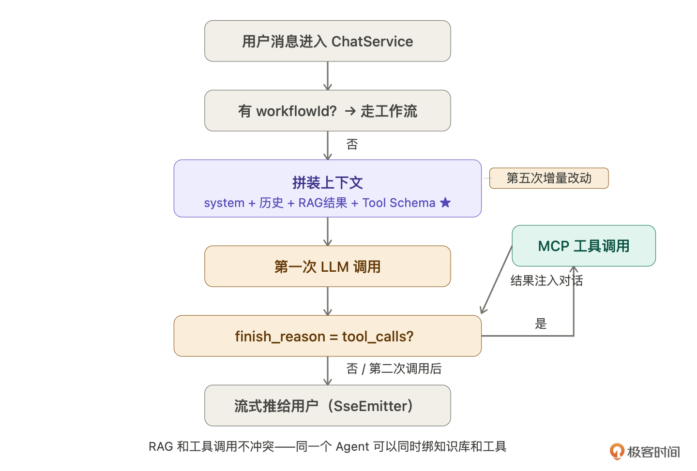

# 24｜MCP 工具接入（上）：搞懂协议，把 Client 跑通

你好，我是 Robert。

智能客服现在能聊天、能引用知识库、能走工作流分类。但它只能“说”，不能“做”。

用户问“我的订单 12345 到哪了”，客服只能回答“请联系人工客服查询”，因为它没有能力去查订单系统。用户问“帮我提交一个换货申请”，客服只能说“好的，请您拨打客服热线”，因为它没有能力操作工单系统。

能说不能做，**是智能客服从“能用”到“好用”的最后一道墙**。

这两讲拆掉这道墙。通过 MCP 协议，让 Agent 能调用外部工具，查订单、查库存、提交工单。这一讲搞懂协议，把 Client 跑通。下一讲开发真实的 MCP Server。

## 为什么不直接调 API

你可能会想：让 Agent 直接调订单系统的 REST API 不就行了？

可以，但只有一个系统的时候。智能客服要对接的系统不止一个，订单系统、库存系统、工单系统、物流系统，每个系统的 API 格式都不一样：

```
订单系统：POST /orders/query，JSON，Bearer Token
物流系统：GET  /tracking?waybillNo=SF123，XML，签名验证
工单系统：GraphQL，OAuth2
库存系统：gRPC，proto 文件
```

让 Hify 直接对接每个系统，就要为每个系统写一套适配代码，处理不同的参数格式、认证方式、返回结构。接一个系统写一套，接十个系统写十套，每次系统升级都要改 Hify 的代码。

更麻烦的是，LLM 怎么知道有哪些工具可用？你得手动写进 Prompt，“你可以查订单，API 是这个，参数是那个”。每接一个新系统，就要改 Prompt。

这个问题不是 Hify 独有的，所有 AI 应用都面临。Anthropic 在 2024 年底提出了 MCP 协议来解决这个问题。

## MCP 是什么

我们继续问 Claude Code：

> MCP 协议是什么？它解决什么问题？和直接调 REST API 有什么区别？用智能客服的场景帮我解释，重点说清楚为什么需要标准化协议。

Claude Code 解释得很直白：**MCP 是工具的标准化描述和调用协议**。工具提供方按 MCP 标准暴露自己的能力，调用方通过统一方式发现和调用这些工具，不需要关心每个系统的 API 细节。

三个核心概念：

- **MCP Server**：工具提供方。一个 Server 可以提供多个工具。比如订单服务 MCP Server 提供  `query_order`  和  `cancel_order`  两个工具。Server 自己声明自己能干什么、需要什么参数。
- **MCP Client**：工具调用方，就是 Hify。负责发现 Server 有哪些工具（`tools/list`）、调用具体工具（`tools/call`）、处理返回结果。
- **Tool Schema**：每个工具的标准描述，包括名称、说明、参数类型等。LLM 通过 schema 知道有哪些工具可用，决定什么时候调哪个。

```
{
  "name": "query_order",
  "description": "根据用户ID和订单号查询订单状态，当用户询问订单、物流、快递相关问题时使用",
  "inputSchema": {
    "type": "object",
    "properties": {
      "userId":  {"type": "string", "description": "用户ID"},
      "orderId": {"type": "string", "description": "订单号，不知道时传空字符串"}
    },
    "required": ["userId"]
  }
}
```

和直接调 API 的核心区别：直接调 API，你要去适配对方；用 MCP，对方按标准描述自己，你用统一方式调用。Hify 不需要知道订单系统用什么格式，只需要知道有一个  `query_order`  工具，需要什么参数。

Claude Code 用一句话总结了 MCP 的价值：**MCP 之前，M 个 AI 平台  × N 个工具  = M×N 套适配代码**。MCP 之后，工具开发者只写一个 Server，任何支持 MCP 的平台都能接  = M+N。这和 USB 解决的问题一样。


## 业界真实案例

MCP 不是新概念，业界已经有很多真实在用的 MCP Server。我们一起看一个和智能客服直接相关的例子：Stripe。

Stripe 官方发布了 Stripe MCP Server，提供了一系列工具：

```
stripe_retrieve_payment_intent    根据支付ID查询支付详情
stripe_create_refund              发起退款
stripe_list_customers             查询客户列表
stripe_retrieve_invoice           查询账单详情
stripe_cancel_subscription        取消订阅
```

这意味着什么？**任何接入了 Stripe MCP Server 的 AI 应用，都能让 Agent 直接查支付记录、发起退款，不需要写一行对接 Stripe API 的代码，不需要处理 Stripe 的认证和参数格式，只需要在配置里加一个 Server 地址。**

用户问“我上周的那笔支付是多少钱”，Agent 调  `stripe_retrieve_payment_intent`，拿到数据，直接回答。Stripe 升级了接口，改 MCP Server 就行，Hify 不用动。

Claude Code 说了一个重点：**给 Agent 接一个新的 MCP Server，不需要改 Agent 代码，Agent 自动发现新工具。这是标准化协议最核心的价值**。也就是工具和平台解耦。

对智能客服来说这个价值最大。客服要对接的系统最多，订单、库存、工单、物流，每个都可以有 MCP Server，接入只需要配置 Server 地址。

## Function Calling 是什么

知道了 MCP 是什么，下一个问题：LLM 怎么知道要调哪个工具？

```
Function Calling 是什么？
LLM 怎么知道有哪些工具可用？
怎么决定什么时候调工具、调哪个、传什么参数？
一次用户对话如果需要调工具，完整的交互流程是什么样的？
```

Claude Code 的解释很清楚：**LLM 本质上只能输入文本、输出文本**。Function Calling 是一种约定，LLM 的输出文本里，有时候不是给用户看的回答，而是一个结构化的“我要调这个函数、传这些参数”的指令。LLM 自己不执行任何函数，它只是“说”它想调什么。

LLM 怎么知道有哪些工具：工具定义随每次请求一起发过去。不是持久记忆，是每次都告知。

```
{
  "messages": [{"role": "user", "content": "我昨天下的订单还没到"}],
  "tools": [
    {
      "type": "function",
      "function": {
        "name": "query_order",
        "description": "查询订单状态，当用户询问订单、物流、快递相关问题时使用",
        "parameters": { ... }
      }
    }
  ]
}
```

LLM 怎么决定调哪个工具：靠  `description`  字段。LLM 读到“我昨天下的订单还没到”，判断这是订单问题，`query_order`  的 description 说“用户询问订单相关问题时使用”，场景匹配，调它。description 写得好不好，直接决定 LLM 选工具的准确率。这是 MCP 工具开发里最重要的地方。

完整时序一次用户对话涉及两次 LLM 调用。

**第一次 LLM 调用**，LLM 判断需要调工具，返回的不是回答，而是工具调用指令：

```
{
  "finish_reason": "tool_calls",
  "message": {
    "tool_calls": [{
      "id": "call_abc123",
      "function": {
        "name": "query_order",
        "arguments": "{\"userId\": \"u001\", \"orderId\": \"12345\"}"
      }
    }]
  }
}
```

Hify 拿到指令，通过 MCP Client 调订单服务，拿到真实数据，把结果追加进对话历史：

```
{"role": "tool", "tool_call_id": "call_abc123",
 "content": "{\"status\":\"运输中\",\"trackingNo\":\"SF1234567\",\"estimatedDate\":\"明天\"}"}
```

**第二次 LLM 调用**，LLM 基于工具结果生成最终回答，`finish_reason`  变成  `stop`，这次是真正给用户的回答。


如果用户问的是不需要查数据的问题（你们的退货政策是什么），LLM 第一次调用直接返回  `finish_reason=stop`，没有工具调用，没有第二次 LLM 调用。LLM 自己判断要不要调工具，不是硬编码逻辑。

Claude Code 还说了一个重要的边界：循环次数由 LLM 决定，不是固定的。理论上 LLM 可以连续调多个工具（先查订单再查物流），Agent 框架一般设置最大轮次（比如 10 次）防止死循环。

## MCP Client 选型

> Java 生态有哪些 MCP Client 的 SDK？帮我调研主流选项，从成熟度、文档质量、和 Spring 生态兼容性几个维度对比。最后给出建议，Hify 应该选哪个。

Claude Code 先把 hify-mcp 模块和主 pom.xml 都读了，基于现有代码给建议。Java 17、Spring Boot 3.2.3，hify-mcp 目前只有骨架还没实现。

调研结果有三个实质选项：


Claude Code 的建议：**用官方 Java SDK，不用 Spring AI MCP**。

理由很清楚：Spring AI MCP 的设计，假设是你用 Spring AI 的整套抽象层——ChatClient、ChatModel、工具回调体系全部 Spring AI 化。Hify 已经有自己的一套：`ProviderAdapter`  适配各 LLM、`LlmHttpClient`  做 HTTP 通信、`ChatServiceImpl`  管对话流程。

引入 Spring AI MCP 意味着：引入整个  `spring-ai-bom`、工具调用结果要适配  `ToolCallback`  接口和现有  `ProviderAdapter`  产生摩擦、Spring AI 1.1 → 2.0 API 变化剧烈升级成本高。两套抽象互相摩擦，不值得。

官方 Java SDK 只做一件事：实现 MCP 协议的序列化 / 反序列化和请求响应。不绑定任何 AI 框架，剩下的连接管理、异常处理、工具结果转换全按 Hify 现有风格写。

```
<!-- hify-mcp/pom.xml -->
<dependency>
    <groupId>io.modelcontextprotocol.sdk</groupId>
    <artifactId>mcp</artifactId>
    <version>1.1.1</version>
</dependency>
```

Claude Code 还提到一个已知问题：SDK 的  `HttpClientSseClientTransport`  有 HttpClient 资源泄漏的 issue，每次 build 一个新的 HttpClient 实例，没有正确关闭。规避方式是按调用创建、用完关闭，不长期持有 client 对象。

```
// 每次调工具：建连 → 调用 → 关闭，用 try-with-resources
try (McpSyncClient client = buildClient(server.getEndpoint())) {
    client.initialize();
    return client.callTool(new CallToolRequest(toolName, arguments));
}
```

这个判断方式可以学习：让 Claude Code 调研的时候，不只要“推荐什么”，也要问“有没有已知问题”。知道坑在哪，比知道怎么用更重要。

## 动手实现

架构和选型都清楚了，开始实现。两块合并在一节。

### MCP Server 管理

MCP Server 管理和 12 讲 Provider 管理是同样的模式——CRUD +  连通性测试  +  启用禁用。04 讲已经建了  `mcp_server`  表，直接实现接口。

```
在 hify-mcp 模块中实现 MCP Server 管理。参照 12 讲 Provider 管理的模式。
接口列表：
POST   /api/v1/mcp-servers              创建 MCP Server（name、endpoint、enabled）
GET    /api/v1/mcp-servers              分页查询列表
GET    /api/v1/mcp-servers/{id}         查询详情（含工具列表）
PUT    /api/v1/mcp-servers/{id}         更新
DELETE /api/v1/mcp-servers/{id}         逻辑删除
POST   /api/v1/mcp-servers/{id}/test    测试连通性
连通性测试逻辑：
  用 io.modelcontextprotocol.sdk:mcp:1.1.1 的 McpSyncClient
  调 tools/list 接口，成功则把返回的工具列表存入 mcp_tool 表
  （name、description、inputSchema JSON 字段）
  失败返回错误信息
删除时检查：是否有 Agent 绑定了该 Server 的工具，有则拒绝删除
实现 McpClientService：
  callTool(mcpServerId, toolName, arguments) → String
    按调用创建 McpSyncClient，用完关闭（try-with-resources）
    工具调用失败 catch 住，抛 BizException(MCP_TOOL_CALL_FAILED)
    结果取 TextContent，多条用换行拼接
  listTools(mcpServerId) → List<String>
    同样 try-with-resources，失败抛 BizException(MCP_SERVER_NOT_FOUND)
代码放在 hify-mcp 模块，遵循 CLAUDE.md 规范
```

和 12 讲 Provider 管理唯一的区别：连通性测试调  `tools/list`  而不是  `/v1/models`。CRUD 逻辑、关联校验、启用禁用完全一样。

### Agent 绑定工具

```
新建 agent_tool 关联表，支持多工具绑定：
CREATE TABLE agent_tool (
    id        BIGINT   AUTO_INCREMENT PRIMARY KEY,
    agent_id  BIGINT   NOT NULL,
    tool_id   BIGINT   NOT NULL,
    created_at DATETIME NOT NULL,
    UNIQUE KEY uk_agent_tool (agent_id, tool_id)
);
实现接口：
PUT /api/v1/agents/{id}/tools    绑定工具列表（传 toolId 数组，全量替换）
约束：
- 绑定时校验 toolId 是否存在且对应 MCP Server 处于启用状态
- 一个 Agent 最多绑定 10 个工具（防止 tools 参数过长影响 LLM 效果）
```

### 接入对话引擎

这是对话引擎的第五次增量开发。

```
修改 ChatService 的对话逻辑，加入 MCP 工具调用支持。
改动范围：只改 buildMessages 和 LLM 调用这两处。
具体逻辑：
1. 加载 Agent 绑定的工具列表
   从 agent_tool 关联 mcp_tool 表，拿到所有工具的 name、description、inputSchema
2. 工具列表不为空时，把 tool schema 加入第一次 LLM 调用的 tools 参数
3. 第一次 LLM 调用后判断返回：
   finish_reason = "tool_calls"：解析 tool_calls，执行第 4 步
   finish_reason = "stop"：直接走原有流式推送逻辑
4. 解析 tool_calls，拿工具名和 arguments JSON
   从 mcp_tool 表找到对应的 mcpServerId
   调 McpClientService.callTool(mcpServerId, toolName, arguments)
5. 把工具结果作为 role=tool 的消息追加进对话历史
   对应上 tool_call_id（LLM 第一次返回的那个 id）
6. 发起第二次 LLM 调用（流式），结果推给用户
约束：
- 工具列表为空时，和原有逻辑完全一致，一行不改
- RAG 和工具调用不冲突：system prompt 里既可以有 RAG 检索结果，
  也可以有工具 schema，一个 Agent 可以同时绑知识库和工具
- workflowId 不为空时已经 return，不进入这段逻辑
- 工具调用失败：把错误信息作为 tool 消息返回给 LLM，
  让 LLM 告知用户，不要直接抛异常中断对话
- 不改 Controller 层，不改 SseEmitter 管理逻辑
```



增量开发三步走：

- 先跑不绑工具的 Agent，确认原有逻辑没坏（RAG、工作流都测）
- 再跑绑了工具的 Agent，问需要调工具的问题，确认 Function Calling 触发
- 问不需要调工具的问题，确认 LLM 正确判断不调，没有发起多余的工具调用

## 验收

用一个模拟的 MCP Server 跑通。目的是验证 Hify 的 MCP Client 和对话引擎逻辑正确，不验证真实业务。真实 Server 下一讲做。

```
# 添加模拟 MCP Server
curl -X POST http://localhost:8080/api/v1/mcp-servers \
  -H "Content-Type: application/json" \
  -d '{"name": "订单服务（模拟）", "endpoint": "http://localhost:9001/mcp"}'
# 测试连通性，自动拉取工具列表
curl -X POST http://localhost:8080/api/v1/mcp-servers/1/test
# 返回：连通成功，发现工具 query_order(userId, orderId)
# 给智能客服绑定工具
curl -X PUT http://localhost:8080/api/v1/agents/1/tools \
  -H "Content-Type: application/json" \
  -d '{"toolIds": [1]}'
# 场景一：需要调工具的问题
curl -N -X POST http://localhost:8080/api/v1/chat/sessions/2/messages \
  -H "Content-Type: application/json" \
  -H "Accept: text/event-stream" \
  -d '{"content": "我的订单12345到哪了"}'
# 后端日志：
# [MCP] finish_reason=tool_calls，调用 query_order(userId=u001, orderId=12345)
# [MCP] 工具返回：运输中，SF1234567，预计明天到
# [MCP] 第二次 LLM 调用，finish_reason=stop
# 用户收到："您的订单12345已发货，顺丰快递在途中，预计明天送达。"
# 场景二：不需要调工具的问题
curl -N -X POST http://localhost:8080/api/v1/chat/sessions/3/messages \
  -H "Content-Type: application/json" \
  -H "Accept: text/event-stream" \
  -d '{"content": "你们的退换货政策是什么"}'
# 后端日志：finish_reason=stop，没有工具调用
# 走 RAG 引用知识库回答
# 场景三：不绑工具的 Agent 不受影响
curl -N -X POST http://localhost:8080/api/v1/chat/sessions/4/messages \
  -H "Content-Type: application/json" \
  -H "Accept: text/event-stream" \
  -d '{"content": "你好"}'
# 日志里没有任何 MCP 相关输出
```

下面是我们实现的在 MCP 工具的管理：


## 总结

这一讲搞懂了 MCP，把 Client 跑通了。

从需求出发：Agent 要能做事，就需要调外部系统。直接调 API 维护成本高，MCP 用标准化协议解决，工具提供方描述自己，调用方统一调用，M×N 变成 M+N。

Function Calling 是核心机制：第一次 LLM 调用判断要不要调工具、调哪个，Hify 执行工具调用，第二次 LLM 调用基于结果生成回答。`description`  写得好不好，直接决定 LLM 选工具的准确率。

选型上，Spring AI MCP 太重，Hify 已有自己的 LLM 调用体系，引进去只会产生两套抽象互相摩擦。官方 Java SDK 刚好够用，只做协议层，连接管理和错误处理按 Hify 现有风格写。

对话引擎这是第五次增量开发。从 16 讲到现在——基础链路、上下文、RAG、工作流、MCP 工具——每次都是同样的三步走，每次都没破坏已有功能。**增量开发是一种习惯，不是方法论。**

下一讲做真实的 MCP Server，不是模拟返回，而是真正查数据库，从业务场景推导到代码实现。

## 思考题

当前的工具调用是同步的，用户要等工具执行完才能看到回复。如果工具很慢（查一个复杂报表要 10 秒），用户体验会很差。怎么给用户一个“正在查询订单信息…”的中间状态提示？让 Claude Code 帮你设计方案。如果 LLM 在一次回复中需要调用多个工具（比如先查订单状态再查物流信息），当前的实现支持吗？Claude Code 在解释 Function Calling 时提到了 parallel tool calls，看一下 OpenAI 文档，理解多工具调用的消息结构，让 Claude Code 帮你实现。工具调用有安全风险，如果 LLM 被提示词注入攻击，可能会调用不该调的工具（比如用户伪造消息让客服帮别人查订单）。怎么在 Hify 层面做工具调用的权限控制？

期待你的分享！如果今天的课程让你有所收获，也欢迎转发给有需要的朋友，邀请他来一起学习，我们下节课再见！

---
来源：极客时间
链接：https://time.geekbang.org/column/article/972992
日期：2026-05-07
