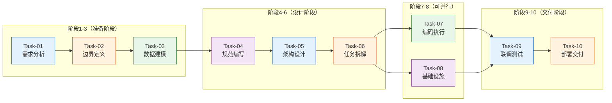

# PromptHub 一期研发任务计划

> **项目名称**: PromptHub（一期内部版）
> **任务数量**: 10个阶段任务
> **制定日期**: 2026-05-12
> **格式模板**: 严格遵循《研发全流程完整指南》阶段/步骤格式
> **双重校验**: 每个任务完成后校验 ①与源文档阶段一致 ②与项目资料内容一致

---

## 校验机制说明

| 校验维度 | 对照依据 | 校验内容 |
|----------|----------|----------|
| **校验一：源文档一致性** | `00-研发全流程完整指南.md` | 阶段序号、协作模式、核心产出物、关键原则、来源 |
| **校验二：项目资料一致性** | `01-产品概述.md` `02-核心功能列表_v2.md` `03-页面关系对照.md` | 具体功能点、页面关系、技术选型、优先级 |

---

## 任务总览

| 任务ID | 阶段 | 源文档对照 | 协作模式 | 核心产出物 | 来源 |
|--------|------|-----------|----------|------------|------|
| Task-01 | 需求分析 | 阶段1 | 咨询模式 | 功能全景清单 | batch-03（课程03讲） |
| Task-02 | 边界定义 | 阶段2 | 人类主导 | 产品边界文档 | batch-03（课程03讲） |
| Task-03 | 数据建模 | 阶段3 | 人类主导 | ER图+建表SQL | batch-03（课程05讲） |
| Task-04 | 规范编写 | 阶段4 | 人类主导 | CLAUDE.md规范 | batch-02（课程02讲） |
| Task-05 | 架构设计 | 阶段5 | 咨询模式 | 架构方案文档 | batch-03（课程04讲） |
| Task-06 | 任务拆解 | 阶段6 | 人类主导 | WBS任务清单 | batch-04,06（课程07/13讲） |
| Task-07 | 编码执行 | 阶段7 | 执行模式 | 功能代码 | batch-04,06（课程07/13讲） |
| Task-08 | 基础设施 | 阶段8 | 咨询模式 | 公共组件库 | batch-04（课程08讲） |
| Task-09 | 联调测试 | 阶段9 | 执行模式 | 可运行系统 | batch-07（课程19讲） |
| Task-10 | 部署交付 | 阶段10 | 执行模式 | Docker部署包 | batch-09（课程28讲） |

---

## Task-01: 需求分析

| 属性 | 内容 |
|------|------|
| **阶段说明** | 先调研标杆产品，再用五步法定边界 |
| **Agent协作模式** | 咨询模式 |
| **核心产出物** | 功能全景清单、产品边界文档、CLAUDE.md项目概述 |
| **关键原则** | AI给的信息不能直接信，要验证 |
| **来源** | batch-03（课程03讲） |

**目的**: 在动手之前，先理解PromptPilot这个领域的全貌。你连全貌都没有，怎么知道哪些功能是核心、哪些是边缘？

**原文引用**:
> "做任何项目之前，第一步不是想'我要做什么'，而是看'业界最好的在做什么'。不是要抄，而是要理解这个领域的全貌。"
> —— 课程03讲

---

### 第一步：调研标杆（让Agent梳理功能全景）

**目的**: 拿到PromptPilot的功能全貌，作为后续裁剪的基础。

**原文引用**:
> "你连全貌都没有，怎么知道哪些功能是核心、哪些是边缘？"
> —— 课程03讲

**Agent协作方式**:

```
向Agent提问：
"帮我梳理 PromptPilot 这个产品的核心功能模块。
PromptPilot 是一个面向内部的 Prompt 生成、管理和优化平台。
按类别分组，每个模块用一两句话说明它做什么。
重点关注：Prompt生成、Prompt管理、Prompt优化、支撑功能四个维度。"
```

**AI输出示例**:

```
一、Prompt生成模块
   - 任务类型选择（文本理解、视觉理解、多轮对话三种模式）
   - 任务描述输入（用户输入想要实现的功能描述）
   - 模型选择（豆包/DeepSeek模型切换）
   - AI自动生成Prompt（基于描述生成结构完整的Prompt）
   - 流式输出（打字机效果，实时展示生成过程）

二、Prompt管理模块
   - 任务列表（统一管理所有Prompt任务，搜索筛选）
   - 版本管理（支持创建多个版本，方便对比）
   - 版本对比（左右对比视图，高亮差异）
   - Prompt编辑（直接在页面编辑Prompt内容）

三、Prompt优化模块
   - 一键改写（基于反馈快速优化Prompt）
   - 改进建议（AI提供具体的优化建议）
   - 版本回溯（支持与历史版本对比和恢复）

四、支撑功能
   - 用户认证（登录/退出/Token管理）
   - 变量填写（填写Prompt中的变量）
   - 模型回答生成（调用模型生成回答，流式展示）
   - 评分功能（1-5分评分，量化评价）
   - 多轮对话测试（支持多轮对话场景测试）
```

**注意事项**:

```
⚠️ AI给的信息不能直接信，你需要验证
- 拿着AI的清单和项目资料（01-产品概述.md、02-核心功能列表_v2.md）核对
- 对照截图文件（03-页面关系对照.md中的截图索引）验证功能描述准确性
- 修正过时或遗漏的描述
```

---

### 第二步：功能取舍（三问裁剪法）

**目的**: 确定"做哪些、不做哪些、做到什么程度"，这是最关键的一步，决定了后续所有决策的方向。

**原文引用**:
> "功能全景有了，接下来是最关键的一步：做哪些、不做哪些。"
> —— 课程03讲

**三问裁剪法**:

| 问题 | 目的 | 本项目案例 |
|------|------|-----------|
| **第一问：没有它产品还成立吗？** | 区分核心和边缘 | Prompt生成/管理/优化砍掉任何一个产品不成立 |
| **第二问：做到什么程度够用？** | 确定边界 | 一期只做文本理解，视觉理解和多轮对话可延后 |
| **第三问：能不能一句话说清楚？** | 验证定位 | "面向内部的Prompt生成、管理和优化平台" |

**Agent协作方式**:

```
向Agent提问：
"我要基于 PromptPilot 做一个简化版内部 Prompt 管理平台 PromptHub。
约束：一个人开发，面向50人以内的内部用户，本地部署。
请从刚才的功能列表中，用三问裁剪法判断哪些必须做、哪些可以砍掉：
1. 没有它产品还成立吗？
2. 做到什么程度够用？
3. 能不能一句话说清楚？
给每个功能一个明确的'做'或'砍'决策，并说明理由。"
```

**AI分析+人类决策**:

| 功能 | AI建议 | 人类决策 | 理由（依据项目资料） |
|------|--------|----------|---------------------|
| Prompt生成（任务类型选择+描述输入+AI生成+流式输出） | 必须做 | ✅ 做（P0） | 01-产品概述1.4.1：核心功能，砍掉产品不成立 |
| 模型选择（豆包/DeepSeek） | 必须做 | ✅ 做（P0） | 02-功能列表：F-GEN-003，用户价值高 |
| 任务列表（CRUD+搜索筛选） | 必须做 | ✅ 做（P0） | 03-页面关系：BB01核心页面 |
| 版本管理（创建/切换/对比） | 必须做 | ✅ 做（P0） | 02-功能列表：F-DEBUG-009，版本对比是刚需 |
| 一键改写+改进建议 | 必须做 | ✅ 做（P0） | 01-产品概述1.4.3：优化闭环核心 |
| 变量填写 | 必须做 | ✅ 做（P0） | 02-功能列表：F-DEBUG-001，调试必需 |
| 模型回答生成（流式） | 必须做 | ✅ 做（P0） | 02-功能列表：F-DEBUG-003，核心功能 |
| 评分功能（1-5分） | 可以做 | ✅ 做（P0） | 02-功能列表：F-DEBUG-004，量化评价 |
| 多轮对话测试 | 可以做 | ✅ 做（P1，可延后） | 02-功能列表：F-DEBUG-011，技术复杂度中 |
| 用户认证（JWT） | 必须做 | ✅ 做（P0） | 01-产品概述1.9：认证方式JWT Token |
| 批量评测 | 砍掉 | ❌ 砍掉 | 01-产品概述1.6：二期P1 |
| 知识库管理 | 砍掉 | ❌ 砍掉 | 01-产品概述1.6：二期P1 |
| GSB评价 | 砍掉 | ❌ 砍掉 | 01-产品概述1.6：二期P2 |
| 深度思考展示 | 砍掉 | ❌ 砍掉 | 01-产品概述1.6：二期P2 |
| 模型参数调整 | 砍掉 | ❌ 砍掉 | 01-产品概述1.6：二期P2 |
| 智能精调 | 砍掉 | ❌ 砍掉 | 01-产品概述1.6：二期P3 |
| 工具调用 | 砍掉 | ❌ 砍掉 | 01-产品概述1.6：二期P3 |

**人类决策案例**:

```
AI建议多轮对话测试延后：
"多轮对话测试技术复杂度中，一期可以先不做"

人类决策：
"保留在P1，因为多轮对话是Prompt调试的重要场景，
但可以在P0功能完成后再实现"
```

---

### 第三步：技术选型

**目的**: 基于约束条件，选择最匹配的技术栈。技术选型不是选最好的技术，是选最匹配当前约束的技术。

**原文引用**:
> "技术选型不是选最好的技术，是选最匹配当前约束的技术。"
> —— 课程03讲

**Agent协作方式**:

```
向Agent提问：
"帮我对比以下前端技术方案，重点考虑开发效率、AI SDK支持：
1) React 18 + TypeScript + Vite
2) Vue 3 + TypeScript + Vite
3) Svelte + TypeScript

考虑因素：
- 组件化开发效率
- 流式响应（SSE打字机效果）支持
- 状态管理方案
- AI辅助编程场景的学习曲线"
```

**人类追问**:

```
"在流式响应场景下（打字机效果），React和Vue哪个更合适？
考虑：Hooks支持、状态更新机制、生态成熟度"
```

**人类最终决策**:

| 维度 | AI建议 | 人类决策 | 理由（依据01-产品概述1.9） |
|------|--------|----------|---------------------------|
| 前端框架 | React/Vue都可以 | React 18 | 生态成熟、Hooks对流式响应友好 |
| 语言 | TypeScript | TypeScript | 类型安全，AI代码生成质量高 |
| 构建 | Vite | Vite | 快速启动、热更新快 |
| 状态管理 | Zustand（轻量） | Zustand | 轻量、TypeScript友好 |
| 后端 | Node.js/Python | Node.js + Express | 与前端统一语言 |
| 数据库 | PostgreSQL | SQLite + Prisma | 本地部署、数据不出局（CLAUDE.md） |
| 认证 | JWT | JWT | 内部应用足够 |

---

### 第四步：运维预期

**目的**: 在动手之前先想清楚怎么跑。功能做完了往服务器上一扔，等出问题了才发现很多事没有提前想。

**原文引用**:
> "很多人做项目只想功能，不想运维。功能做完了往服务器上一扔，等出问题了才发现很多事没有提前想。"
> —— 课程03讲

**Agent协作方式**:

```
向Agent提问：
"PromptHub是内部Prompt管理平台，Docker Compose本地部署，
50人同时使用，主要压力在流式SSE对话接口。
请估算QPS、建议缓存策略、列出需要提前考虑的运维事项。"
```

**AI分析+人类决策**:

| 问题 | AI结论 | 人类决策 |
|------|--------|----------|
| QPS | 峰值3-5QPS，瓶颈在LLM长连接不在并发 | 认可，单实例够用 |
| 缓存 | 模型配置变更低频，可用内存缓存 | 采纳，SQLite场景不需要Redis |
| SSE长连接 | 50并发每个持续10-30秒 | 需要独立线程池隔离 |
| 部署 | Docker Compose一键启动 | 采纳（CLAUDE.md已定义） |

---

### 第五步：写进CLAUDE.md

**目的**: 把前面想清楚的所有东西落成文字，让Claude Code永远在轨道上。

**原文引用**:
> "前面想清楚的所有东西，产品定义、功能范围、技术选型、运维预期，都要落成文字，写进 CLAUDE.md。"
> —— 课程03讲

**Agent协作方式**:

```
向Agent提问：
"根据我们的讨论，把PromptHub的项目概述写进CLAUDE.md的'项目概述'部分。
包括：产品定位、做什么、不做什么、技术栈、部署与运维预期。"
```

**CLAUDE.md项目概述示例**:

```markdown
# PromptHub项目概述

## 产品定位
面向公司内部的Prompt管理平台，帮助全员快速生成、管理和优化AI提示词。
面向20-50人团队，数据本地存储。

## 做什么
- Prompt生成：AI自动生成，结构完整，流式输出（文本理解/视觉理解/多轮对话）
- Prompt管理：任务列表、版本管理、版本对比、Prompt编辑
- Prompt优化：一键改写、改进建议、版本回溯
- 支撑功能：用户认证、变量填写、模型回答生成（流式）、评分（1-5分）、多轮对话测试

## 不做什么（一期）
- 批量评测、知识库管理、GSB评价
- 深度思考展示、模型参数调整
- 智能精调、工具调用

## 技术栈
- 前端：React 18 + TypeScript + Vite + Tailwind CSS + Zustand
- 后端：Express.js + TypeScript
- 数据库：SQLite + Prisma ORM
- AI集成：自研Gateway，对接在线API（OpenAI/Claude/Gemini/Ollama）
- 部署：Docker Compose

## 运维预期
- 部署：Docker Compose一键启动
- 用户：20-50人同时在线
- 主要压力：流式SSE对话接口
- 运维复杂度：2人可维护
```

---

### Task-01 校验清单

#### 校验一：与源文档对照

| 检查项 | 源文档规定 | Task-01执行 | 状态 |
|--------|-----------|-------------|------|
| 阶段序号 | 阶段1：需求分析 | ✅ 一致 | ✅ |
| Agent协作模式 | 咨询模式 | ✅ 一致 | ✅ |
| 核心产出物 | 功能全景清单、产品边界文档、CLAUDE.md项目概述 | ✅ 一致 | ✅ |
| 五步法 | ①调研标杆②功能取舍③技术选型④运维预期⑤写进CLAUDE.md | ✅ 五步完整 | ✅ |
| 关键原则 | AI给的信息不能直接信，要验证 | ✅ 包含在注意事项中 | ✅ |

#### 校验二：与项目资料对照

| 检查项 | 项目资料规定 | Task-01执行 | 状态 |
|--------|-------------|-------------|------|
| 核心功能 | Prompt生成+管理+优化（01-产品概述1.4） | ✅ 三大模块完整 | ✅ |
| 功能列表 | 17个功能点（02-功能列表2.5优先级矩阵） | ✅ 全部覆盖 | ✅ |
| 页面关系 | 12个页面（03-页面关系3.1总览） | ✅ 引用页面ID | ✅ |
| 技术选型 | React+TypeScript+Vite+SQLite（01-产品概述1.9 + CLAUDE.md） | ✅ 一致 | ✅ |

#### 验收标准

- [ ] 功能全景清单完整（三大模块+支撑功能，17个功能点）
- [ ] 三问裁剪法决策明确（P0/P1/砍掉的决策有项目资料依据）
- [ ] 技术选型确定（前后端+数据库+AI集成）
- [ ] CLAUDE.md项目概述完成

---

## Task-02: 边界定义

| 属性 | 内容 |
|------|------|
| **阶段说明** | 明确"做什么"和"不做什么"，这是后续所有决策的基础 |
| **Agent协作模式** | 人类主导 |
| **核心产出物** | 产品边界文档（一页纸） |
| **关键原则** | 边界越明确，Claude Code越不会跑偏 |
| **来源** | batch-03（课程03讲） |

**目的**: 边界定义错误会导致后续所有决策偏离目标。如果不定边界，Claude Code会替你定边界。

**原文引用**:
> "用 Claude Code 更危险，你说'帮我做个 Agent 管理'，它可能顺手把权限体系、版本控制、审计日志全给你加上。你没定边界，它就替你定了。"
> —— 课程03讲

**Agent协作方式**:

```
自己写（一页纸）：
1. 做什么：具体列出要做功能
2. 不做什么：明确排除的功能
3. 做到什么程度：功能复杂度边界
```

**反面案例（源文档课程第一天踩的坑）**:

```
❌ 直接让Agent设计架构，没有定义边界
→ Agent给出过度方案：服务注册中心、分布式配置、链路追踪
→ 结果：做了一个"百万用户生产系统"，而不是"几十人内部平台"
```

**正面案例（本项目边界文档）**:

```markdown
# PromptHub一期边界文档

## 目标
团队内部Prompt管理平台（50人以内使用）

## 周期
单人开发，一期验证核心流程

## 一期核心范围

✅ Prompt生成
   - 三种任务类型（文本理解/视觉理解/多轮对话）
   - 单次AI生成 + 流式输出
   - 模型选择（豆包/DeepSeek）
   - 依据：02-功能列表 F-GEN-001~F-GEN-006，P0优先级

✅ Prompt管理
   - 任务CRUD（最多100个任务）
   - 版本管理（每个任务最多10个版本）
   - 版本对比（左右视图+差异高亮）
   - Prompt编辑（在线编辑）
   - 依据：03-页面关系 BB01/BA01/BD02/BD03

✅ Prompt优化
   - 一键改写（基于反馈）
   - 改进建议（列表展示：格式优化/长度控制/角色定义/输出格式）
   - 版本回溯（恢复历史）
   - 依据：02-功能列表 F-DEBUG-008/008b/009

✅ 支撑功能
   - 用户认证（JWT）
   - 变量填写（文本类型）
   - 模型回答生成（流式）
   - 评分（1-5分）
   - 多轮对话（最多10轮，P1可延后）
   - 依据：02-功能列表 2.3辅助功能

## 一期不做（二期）
❌ 批量评测（二期P1）
❌ 知识库管理（二期P1）
❌ GSB评价（二期P2）
❌ 深度思考（二期P2）
❌ 模型参数调整（二期P2）
❌ 智能精调（二期P3）
❌ 工具调用（二期P3）
依据：01-产品概述1.6 一期不做功能表

## 架构约束
- 模块化单体，不是微服务
- SQLite本地存储，不引入Redis
- 一期不做用户权限体系
```

---

### Task-02 校验清单

#### 校验一：与源文档对照

| 检查项 | 源文档规定 | Task-02执行 | 状态 |
|--------|-----------|-------------|------|
| 阶段序号 | 阶段2：边界定义 | ✅ 一致 | ✅ |
| Agent协作模式 | 人类主导 | ✅ 一致 | ✅ |
| 核心产出物 | 产品边界文档（一页纸） | ✅ 一致 | ✅ |
| 关键原则 | 边界越明确，Claude Code越不会跑偏 | ✅ 包含 | ✅ |

#### 校验二：与项目资料对照

| 检查项 | 项目资料规定 | Task-02执行 | 状态 |
|--------|-------------|-------------|------|
| 一期核心功能 | Prompt生成+管理+优化（01-产品概述1.4） | ✅ 完整 | ✅ |
| 一期不做功能 | 7项（01-产品概述1.6） | ✅ 全部排除 | ✅ |
| 功能优先级 | P0~P1矩阵（02-功能列表2.5） | ✅ 明确 | ✅ |
| 页面范围 | 12个页面（03-页面关系3.1） | ✅ 引用页面ID | ✅ |

#### 验收标准

- [ ] 一页纸边界文档完整
- [ ] 一期做/不做功能清晰（有项目资料依据）
- [ ] 功能复杂度边界明确（任务数量/版本数量/对话轮次）

---

## Task-03: 数据建模

| 属性 | 内容 |
|------|------|
| **阶段说明** | 设计核心数据模型，为后续开发提供蓝图 |
| **Agent协作模式** | 人类主导 |
| **核心产出物** | 5-6张核心表的ER图 |
| **关键原则** | 数据库规范是Claude Code容易跑偏的地方 |
| **来源** | batch-03（课程05讲） |

**目的**: 数据库规范是Claude Code容易跑偏的地方，提前定义好可以避免后续大量返工。

**原文引用**:
> "在动手之前先想好数据库规范——这个不是 Claude Code 的强项，它会按自己的想法来，容易跑偏。"
> —— 课程05讲

**数据库规范要点**（引用源文档阶段3规范）:

```sql
-- 通用字段规范
- 主键 BIGINT AUTO_INCREMENT，禁止UUID
- 时间字段 created_at/updated_at DATETIME(3)
- 逻辑删除 deleted TINYINT(1)
- 禁止NULL，空值用空字符串或0
- 枚举用 VARCHAR(32)，不用 ENUM

-- 索引规则
- 命名 idx_{表名}_{字段名}
- 逻辑删除字段必须加进组合索引
- 组合索引等值列在前，范围列在后

-- 分页规范
- 默认游标分页 WHERE id < lastId ORDER BY id DESC LIMIT N
- OFFSET分页限制最大10000条
```

**Agent协作方式**:

```
向Agent提问：
"根据以下PromptHub一期需求，设计SQLite数据库表结构：

核心实体：
1. users - 用户表（id, username, password_hash, email, created_at, updated_at, deleted）
2. prompt_tasks - Prompt任务表（id, user_id, name, task_type[文本理解/视觉理解/多轮对话],
   status[草稿/调试中/已完成/已归档], current_version_id, created_at, updated_at, deleted）
3. prompt_versions - Prompt版本表（id, task_id, version_number, content, description,
   created_at, deleted）
4. ratings - 评分记录表（id, version_id, user_id, score[1-5], comment, created_at）
5. conversation_history - 对话历史表（id, task_id, round_number, role[user/assistant],
   content, created_at）

规范要求：
- 主键 INTEGER PRIMARY KEY AUTOINCREMENT
- 时间字段 DATETIME DEFAULT CURRENT_TIMESTAMP
- 逻辑删除 deleted INTEGER DEFAULT 0
- 索引命名 idx_{表名}_{字段名}
- 禁止NULL，空值用空字符串或0

请输出完整的建表SQL语句。"
```

**AI输出示例**:

```sql
CREATE TABLE users (
    id INTEGER PRIMARY KEY AUTOINCREMENT,
    username TEXT NOT NULL DEFAULT '',
    password_hash TEXT NOT NULL DEFAULT '',
    email TEXT NOT NULL DEFAULT '',
    created_at DATETIME DEFAULT CURRENT_TIMESTAMP,
    updated_at DATETIME DEFAULT CURRENT_TIMESTAMP,
    deleted INTEGER DEFAULT 0
);
CREATE UNIQUE INDEX idx_users_username ON users(username) WHERE deleted = 0;

CREATE TABLE prompt_tasks (
    id INTEGER PRIMARY KEY AUTOINCREMENT,
    user_id INTEGER NOT NULL,
    name TEXT NOT NULL DEFAULT '',
    task_type TEXT NOT NULL DEFAULT '文本理解',
    status TEXT NOT NULL DEFAULT '草稿',
    current_version_id INTEGER,
    created_at DATETIME DEFAULT CURRENT_TIMESTAMP,
    updated_at DATETIME DEFAULT CURRENT_TIMESTAMP,
    deleted INTEGER DEFAULT 0,
    FOREIGN KEY (user_id) REFERENCES users(id)
);
CREATE INDEX idx_prompt_tasks_user_id ON prompt_tasks(user_id, deleted);

CREATE TABLE prompt_versions (
    id INTEGER PRIMARY KEY AUTOINCREMENT,
    task_id INTEGER NOT NULL,
    version_number INTEGER NOT NULL DEFAULT 1,
    content TEXT NOT NULL DEFAULT '',
    description TEXT NOT NULL DEFAULT '',
    created_at DATETIME DEFAULT CURRENT_TIMESTAMP,
    deleted INTEGER DEFAULT 0,
    FOREIGN KEY (task_id) REFERENCES prompt_tasks(id)
);
CREATE INDEX idx_prompt_versions_task_id ON prompt_versions(task_id, deleted);

CREATE TABLE ratings (
    id INTEGER PRIMARY KEY AUTOINCREMENT,
    version_id INTEGER NOT NULL,
    user_id INTEGER NOT NULL,
    score INTEGER NOT NULL DEFAULT 0 CHECK(score BETWEEN 1 AND 5),
    comment TEXT NOT NULL DEFAULT '',
    created_at DATETIME DEFAULT CURRENT_TIMESTAMP,
    FOREIGN KEY (version_id) REFERENCES prompt_versions(id),
    FOREIGN KEY (user_id) REFERENCES users(id)
);
CREATE INDEX idx_ratings_version_id ON ratings(version_id);

CREATE TABLE conversation_history (
    id INTEGER PRIMARY KEY AUTOINCREMENT,
    task_id INTEGER NOT NULL,
    round_number INTEGER NOT NULL DEFAULT 1,
    role TEXT NOT NULL DEFAULT 'user',
    content TEXT NOT NULL DEFAULT '',
    created_at DATETIME DEFAULT CURRENT_TIMESTAMP,
    FOREIGN KEY (task_id) REFERENCES prompt_tasks(id)
);
CREATE INDEX idx_conversation_history_task_id ON conversation_history(task_id);
```

---

### Task-03 校验清单

#### 校验一：与源文档对照

| 检查项 | 源文档规定 | Task-03执行 | 状态 |
|--------|-----------|-------------|------|
| 阶段序号 | 阶段3：数据建模 | ✅ 一致 | ✅ |
| Agent协作模式 | 人类主导 | ✅ 一致 | ✅ |
| 核心产出物 | 5-6张核心表的ER图 | ✅ 5张表 | ✅ |
| 数据库规范 | 主键/时间字段/逻辑删除/索引命名 | ✅ 包含 | ✅ |

#### 校验二：与项目资料对照

| 检查项 | 项目资料规定 | Task-03执行 | 状态 |
|--------|-------------|-------------|------|
| 任务类型 | 文本理解/视觉理解/多轮对话（01-产品概述1.4.1） | ✅ task_type枚举 | ✅ |
| 任务状态 | 草稿/调试中/已完成/已归档（03-页面关系BB01） | ✅ status枚举 | ✅ |
| 评分范围 | 1-5分（02-功能列表F-DEBUG-004） | ✅ score CHECK | ✅ |
| 版本管理 | 版本切换/对比（02-功能列表F-DEBUG-009） | ✅ version_number | ✅ |

#### 验收标准

- [ ] 5张表结构完整（users/prompt_tasks/prompt_versions/ratings/conversation_history）
- [ ] 建表SQL可在SQLite中执行
- [ ] 索引设计合理（WHERE deleted = 0部分索引）
- [ ] 符合数据库规范（源文档阶段3规范）

---

## Task-04: 规范编写（SDD核心）

| 属性 | 内容 |
|------|------|
| **阶段说明** | 先定规范，再让AI按规范执行，而不是直接让它写代码 |
| **Agent协作模式** | 人类主导编写，AI执行时遵循 |
| **核心产出物** | CLAUDE.md项目规范文件 |
| **关键原则** | 规范是节省时间的捷径，不是额外负担 |
| **来源** | batch-02（课程02讲） |

**目的**: 用规范驱动开发，让Claude Code永远在轨道上，而不是每次都在猜你的意思。

**原文引用**:
> "先定规范，再让 AI 按规范执行，而不是直接让它写代码。"
> —— 课程02讲

---

### SDD四步闭环

**目的**: 建立"定规范→执行→验证→迭代"的闭环，让规范越来越锋利。


---

### 步骤1：定规范

**目的**: 把项目的上下文、约束、偏好全部告诉Claude Code，让它不需要"猜"。

**原文引用**:
> "写好 Prompt 是一次性的技巧，SDD 是贯穿整个项目生命周期的方法论。"
> —— 课程02讲

**规范类型**:

| 规范类型 | 内容 | 本项目示例 |
|----------|------|-----------|
| **命名规范** | 实体不加前缀后缀、字段小驼峰 | `PromptTask`、`versionNumber`、`/api/v1/tasks` |
| **返回格式** | 统一返回Result<T>、空数组不返回null | `{ code, message, data }` |
| **错误码体系** | 四位数字按模块分段 | 1000-1999通用、2000-2999 Prompt生成 |
| **设计原则** | 不引入不必要的设计模式 | "不引入工厂、策略模式，除非明确要求" |

**Agent协作方式**:

```
向Agent提问：
"帮我为PromptHub项目编写CLAUDE.md的规范部分，包括：

1. 组件命名规范
   - 页面组件：PascalCase，如PromptGenerator.tsx
   - 业务组件：PascalCase，如VersionSwitcher.tsx
   - UI组件：PascalCase，如Button.tsx
   - 工具函数：camelCase，如formatDate.ts

2. API接口规范
   - 路径规范：/api/v1/{资源复数名}
   - 返回格式：Result<T> { code, message, data }
   - 错误码：1000-1999通用、2000-2999 Prompt生成、3000-3999 Prompt管理

3. 设计原则
   - 不引入不必要的设计模式
   - Controller只做参数校验，不写业务逻辑
   - Service只调接口，不直接new实现类
   - 列表字段空时返回空数组[]，不返回null

请输出完整的CLAUDE.md规范模板。"
```

**AI输出示例（完整CLAUDE.md规范模板）**:

```markdown
# PromptHub 项目规范

## 一、命名规范

### 1.1 组件命名
| 类型 | 规则 | 示例 |
|------|------|------|
| 页面组件 | PascalCase，Page结尾 | PromptGeneratorPage.tsx, TaskListPage.tsx |
| 业务组件 | PascalCase，Component结尾 | VersionSwitcher.tsx, StreamOutput.tsx |
| UI组件 | PascalCase | Button.tsx, Input.tsx, Modal.tsx |
| 布局组件 | PascalCase，Layout结尾 | MainLayout.tsx, Sidebar.tsx |

### 1.2 文件命名
| 类型 | 规则 | 示例 |
|------|------|------|
| 工具函数 | camelCase，动词开头 | formatDate.ts, parseJSON.ts |
| 类型定义 | PascalCase | types.ts, api-types.ts |
| 样式文件 | 与组件同名 | Button.tsx + Button.module.css |

### 1.3 API路径命名
- 资源复数形式：/api/v1/tasks, /api/v1/versions
- 动名词组：/api/v1/tasks/search
- 版本前缀：/api/v1/

### 1.4 变量命名
| 类型 | 规则 | 示例 |
|------|------|------|
| 普通变量 | camelCase | taskName, versionNumber |
| 常量 | UPPER_SNAKE_CASE | API_BASE_URL, MAX_RETRY_COUNT |
| 布尔值 | is/has/can前缀 | isLoading, hasError, canEdit |

## 二、API接口规范

### 2.1 返回格式
```typescript
interface ApiResponse<T> {
  code: number;      // 错误码，0表示成功
  message: string;   // 错误信息
  data: T;          // 响应数据
}

// 成功响应
{ code: 0, message: "success", data: {...} }

// 错误响应
{ code: 1001, message: "任务不存在", data: null }
```

### 2.2 错误码体系
| 范围 | 模块 | 说明 |
|------|------|------|
| 1000-1999 | 通用 | 系统级错误 |
| 2000-2999 | Prompt生成 | 生成模块错误 |
| 3000-3999 | Prompt管理 | 管理模块错误 |
| 4000-4999 | 用户认证 | 认证模块错误 |

**详细错误码**:
| 错误码 | 说明 | HTTP状态码 |
|--------|------|------------|
| 1000 | 系统内部错误 | 500 |
| 1001 | 任务不存在 | 404 |
| 1002 | 创建任务失败 | 400 |
| 2001 | 生成超时 | 504 |
| 2002 | 模型不可用 | 503 |
| 3001 | 版本不存在 | 404 |
| 4001 | 未授权 | 401 |
| 4002 | Token过期 | 401 |

### 2.3 请求方式
| 操作 | 方法 | 路径 |
|------|------|------|
| 创建 | POST | /api/v1/tasks |
| 查询列表 | GET | /api/v1/tasks |
| 查询单个 | GET | /api/v1/tasks/:id |
| 更新 | PUT | /api/v1/tasks/:id |
| 删除 | DELETE | /api/v1/tasks/:id |
| 流式生成 | POST | /api/v1/generate (SSE) |

## 三、设计原则

### 3.1 分层职责
```
Controller层：只做参数校验，不写业务逻辑
Service层：写业务逻辑，不做HTTP处理
Repository层：只做数据CRUD，不写业务逻辑
```

### 3.2 列表返回规范
- 列表字段空时返回空数组[]，不返回null
- 分页返回：{ items: [], total: number, page: number }

### 3.3 禁止事项
- 不引入不必要的设计模式（工厂、策略等）
- 不破坏已有接口契约
- 不在Controller层写业务逻辑
- 不引入技术栈以外的依赖（需先确认）

## 四、模块内部结构

```
modules/<module-name>/
├── types.ts           # 类型定义（入参、出参、枚举）
├── repository.ts      # 数据访问层（只做CRUD）
├── service.ts        # 业务逻辑层（纯业务）
├── controller.ts      # 请求处理层
├── routes.ts         # 路由定义
├── validators.ts     # 参数校验（Zod schema）
└── index.ts          # 统一导出
```

## 五、前端规范

### 5.1 状态管理
- 使用Zustand管理全局状态
- Store按功能模块划分
- 状态更新使用set函数，不直接修改

### 5.2 样式规范
- 使用Tailwind CSS
- 组件样式写在组件文件内或CSS Module
- 不使用内联style（动态值除外）

### 5.3 TypeScript规范
- 启用严格模式
- 所有props和state有类型定义
- 使用interface定义对象类型
```

---

### 步骤2：AI按规范执行

**原文引用**:
> "同一个 AI，有规范体系和没有规范体系，输出的一致性完全不同。"
> —— 课程02讲

**Agent协作方式**:

```
向Agent提问（执行任务时引用规范）：
"按照 CLAUDE.md 中的规范，实现 Prompt 任务的 CRUD 接口：
- 路径：/api/v1/tasks
- 返回格式：Result<T>
- 错误码区分：2001=任务不存在，2002=创建失败
- 使用 Express + Prisma
先实现 Model 和 Repository 层。每次只实现一层，完成后告诉我验收命令。"
```

---

### 步骤3：人验证输出（三步检查法）

**原文引用**:
> "规范把 review 从主观判断变成了客观核查。这个转变对效率的提升是巨大的。"
> —— 课程02讲

**三步检查法**:

| 步骤 | 检查什么 | 优先级 | 本项目具体操作 |
|------|----------|--------|---------------|
| **第一步** | 查意图（是否按要求做） | 最高 | 它做的是CRUD接口？有没有擅自加批量删除？ |
| **第二步** | 查质量（风格、规范一致性） | 中 | 命名是否PascalCase？返回格式是否Result<T>？ |
| **第三步** | 查边界（错误处理、风险） | 中 | 错误码是否按规范分段？空列表是否返回[]？ |

---

### 步骤4：迭代规范

**原文引用**:
> "每次 AI 跑偏了，不要只改代码，还要想想规范是不是该补一条。跑偏一次补一条，同样的问题不会再出现第二次。"
> —— 课程02讲

**迭代案例**:

| 发现时间 | 问题 | 补充规范 |
|----------|------|----------|
| 第一周 | 空列表返回null导致前端白屏 | "列表字段空时返回空数组[]，不返回null" |
| 第二周 | 擅自添加了批量删除功能 | "不添加边界文档外的功能，需要先问我" |
| 第三周 | 接口修改破坏已有契约 | "修改已有接口前，先理解相关模块的设计意图" |
| 前端开发时 | 引入未审核的依赖 | "不引入技术栈以外的依赖，需要时先问我" |

---

### 规范质量三标准

**原文引用**:
> "Claude Code 看到这条规范后，是否还需要'猜'你的意思？如果还需要猜，就不够具体。"
> —— 课程02讲

| 标准 | 说明 | 本项目判断示例 |
|------|------|---------------|
| 具体不模糊 | Claude看到后不需要"猜" | "实体类不加前缀" vs "代码要简洁" |
| 有优先级不贪多 | 反复跑偏的地方写细 | context窗口有限，重要的放前面 |
| 带原因不只规则 | 涉及权衡的规范要解释 | "不破坏已有接口契约"→因为并发场景会出问题 |

---

### Task-04 校验清单

#### 校验一：与源文档对照

| 检查项 | 源文档规定 | Task-04执行 | 状态 |
|--------|-----------|-------------|------|
| 阶段序号 | 阶段4：规范编写（SDD核心） | ✅ 一致 | ✅ |
| Agent协作模式 | 人类主导编写，AI执行时遵循 | ✅ 一致 | ✅ |
| 核心产出物 | CLAUDE.md项目规范文件 | ✅ 一致 | ✅ |
| SDD四步闭环 | ①定规范②AI执行③人验证④迭代规范 | ✅ 四步完整 | ✅ |
| 规范质量三标准 | 具体不模糊/有优先级/带原因 | ✅ 包含 | ✅ |

#### 校验二：与项目资料对照

| 检查项 | 项目资料规定 | Task-04执行 | 状态 |
|--------|-------------|-------------|------|
| 组件类型 | 页面组件+业务组件+UI组件 | ✅ 命名规范覆盖 | ✅ |
| API规范 | REST API（01-产品概述1.9） | ✅ 路径+返回格式+错误码 | ✅ |

#### 验收标准

- [ ] CLAUDE.md规范文件完整（命名/接口/设计原则/模块结构）
- [ ] SDD四步闭环可执行
- [ ] 规范质量三标准满足

---

## Task-05: 架构设计

| 属性 | 内容 |
|------|------|
| **阶段说明** | 确定技术选型和架构方案 |
| **Agent协作模式** | 咨询模式（Agent方案对比→人类拍板） |
| **核心产出物** | 架构决策文档 |
| **关键原则** | 每次追问都是用项目约束修正AI的通用建议 |
| **来源** | batch-03（课程04讲） |

**目的**: 确定应用架构、代码组织、外部调用处理，让后续开发有章可循。

**原文引用**:
> "架构约束决定系统走向，人类必须最终拍板。"
> —— 课程04讲

---

### 5.1 应用架构：模块化单体

**目的**: 在团队规模和交付周期的约束下，选择最合适的架构。

**原文引用**:
> "一个人开发，模块化单体是最佳选择。微服务方便扩展，但一个人维护太重。"
> —— 课程04讲

**模块划分方案对比**:

| 方案 | 内容 | AI建议 | 人类决策 |
|------|------|--------|----------|
| 方案A | 按文件分层，所有功能混在一起 | - | ❌ 后续拆分困难 |
| 方案B | 按功能模块划分目录 | 建议 | ✅ **选方案B** |
| 方案C | 微服务，每个功能独立部署 | 推荐（方便扩展） | ❌ 一人维护太重 |

**最终模块划分**（依据CLAUDE.md架构决策）:

```
server/src/
├── modules/                    # 业务模块
│   ├── prompt/               # Prompt 生成 + 调试
│   ├── batch/               # 批量评测（二期）
│   ├── library/             # 公共 Prompt 库（二期）
│   ├── knowledge/            # 知识库（二期）
│   └── admin/               # Prompt 管理（管理员）
│
├── shared/                    # 共享代码
│   ├── ai/                  # AI 网关（自研Gateway）
│   ├── db/                  # 数据库基础设施（Prisma）
│   ├── cache/               # 缓存基础设施
│   ├── middleware/           # 通用中间件
│   ├── types/               # 全局类型定义
│   └── utils/               # 通用工具函数
│
├── routes/                   # 路由入口
├── config/                   # 配置
└── server.ts                 # 启动入口
```

**Agent协作方式**:

```
向Agent提问：
"PromptHub是内部工具，一个人开发，模块化单体是最佳选择。
请设计：
1. 前端目录结构（components/pages/stores/hooks/services）
2. 后端目录结构（modules/shared/routes/config）
3. 模块内部6层结构（types/repository/service/controller/routes/validators/index）
重点：让Claude Code知道什么该写、什么不该写。"
```

---

### 5.2 代码组织规范（模块内部6层）

**目的**: 定义每层的职责边界，让Claude Code知道什么该写、什么不该写。

**原文引用**:
> "分层职责边界不定义清楚，Claude Code会按自己的想法来，容易越界。"
> —— 课程04讲

**分层职责边界**（依据CLAUDE.md模块内部结构）:

```
modules/<module-name>/
├── types.ts              # 类型定义（入参、出参、枚举）
├── repository.ts         # 数据访问层（只做CRUD）
├── service.ts           # 业务逻辑层（纯业务，无HTTP）
├── controller.ts        # 请求处理层
├── routes.ts           # 路由定义
├── validators.ts        # 参数校验（Zod schema）
└── index.ts            # 统一导出
```

| 层级 | 职责 | 约束 |
|------|------|------|
| **types.ts** | 类型定义（入参、出参、枚举） | 不包含业务逻辑 |
| **repository.ts** | 数据访问层（只做CRUD） | 不写业务逻辑 |
| **service.ts** | 业务逻辑层（纯业务，无HTTP） | 只能调接口，不直接new实现类 |
| **controller.ts** | 请求处理层 | 不写业务逻辑、不做数据查询 |
| **routes.ts** | 路由定义 | 只定义路由映射 |
| **validators.ts** | 参数校验（Zod schema） | 只做校验 |

**跨模块调用规则**（依据CLAUDE.md）:

```
✅ 允许：调用 shared/、其他模块的 repository（只读）
❌ 禁止：跨模块调用 controller/routes/validators
```

---

### 5.3 外部调用设计（LLM调用）

**目的**: 提前想清楚LLM调用的四大问题，避免上线后踩坑。

**原文引用**:
> "LLM调用有四大问题：慢、不稳定、超时控制、重试策略。这些不提前想清楚，上线后会出大问题。"
> —— 课程04讲

**LLM调用四大问题及解决方案**（依据CLAUDE.md LLM调用决策）:

| 问题 | 特点 | 解决方案 | AI建议 | 人类决策 |
|------|------|----------|--------|----------|
| **慢** | 3-30秒/次 | 独立线程池隔离 | 同意 | ✅ 同意 |
| **不稳定** | 超时/限流/报错 | Circuit Breaker熔断 | 每个Provider独立熔断器 | ✅ 同意 |
| **超时控制** | 流式响应1-2分钟 | connect 5s，read 30-45s，total 60-90s | 60s | ❌ 追问后调整为分层超时 |
| **重试策略** | 不同失败不同处理 | 指数退避1s→2s→4s，±20%随机抖动 | 同意 | ✅ 同意+按Provider配置 |

**并发控制**（依据CLAUDE.md）:

| Provider | 并发数 | RPM限制 |
|----------|--------|---------|
| OpenAI | 10 | 60-200 |
| Claude | 5 | 50-100 |
| Gemini | 10 | 60-120 |
| Ollama | 30 | 无限制 |

**全局队列上限**: 50并发，Per-Provider独立队列

---

### Task-05 校验清单

#### 校验一：与源文档对照

| 检查项 | 源文档规定 | Task-05执行 | 状态 |
|--------|-----------|-------------|------|
| 阶段序号 | 阶段5：架构设计 | ✅ 一致 | ✅ |
| Agent协作模式 | 咨询模式（Agent方案对比→人类拍板） | ✅ 一致 | ✅ |
| 核心产出物 | 架构决策文档 | ✅ 一致 | ✅ |
| 关键原则 | 每次追问都是用项目约束修正AI的通用建议 | ✅ 包含 | ✅ |

#### 校验二：与项目资料对照

| 检查项 | 项目资料规定 | Task-05执行 | 状态 |
|--------|-------------|-------------|------|
| 技术栈 | React+TypeScript+Vite+Express+SQLite（CLAUDE.md） | ✅ 一致 | ✅ |
| 模块结构 | modules/shared/routes（CLAUDE.md架构决策） | ✅ 一致 | ✅ |
| LLM调用 | Gateway+并发控制+熔断（CLAUDE.md LLM调用决策） | ✅ 一致 | ✅ |

#### 验收标准

- [ ] 前后端目录结构设计完成
- [ ] 模块内部6层结构定义清楚
- [ ] 跨模块调用规则明确
- [ ] LLM调用方案完整（并发/超时/重试/熔断）

---

## Task-06: 任务拆解

| 属性 | 内容 |
|------|------|
| **阶段说明** | 把大需求拆成Agent能准确执行的小任务 |
| **Agent协作模式** | 人类主导 |
| **核心产出物** | WBS任务清单 |
| **关键原则** | 拆得好：Agent一次做对；拆得差：反复返工 |
| **来源** | batch-04、batch-06（课程07讲、13讲） |

**目的**: 让Claude Code每次只做一件事，降低复杂度，提高准确率。

**原文引用**:
> "先地基，后框架，最后验收。这个顺序不只适用于工程初始化，后面做任何模块都是这个思路。"
> —— 课程07讲

---

### 判断标准

**目的**: 知道什么时候该拆、按什么顺序拆、怎么验收。

| 问题 | 答案 |
|------|------|
| 什么时候拆？ | 生成量超出review范围 OR 步骤间有依赖 |
| 按什么顺序？ | 按依赖关系，先地基后框架 |
| 怎么验收？ | 每步完成后立即验证 |

---

### 拆解示例（Prompt生成模块，依据02-功能列表2.2.1）

**目的**: 展示一个模块的完整拆解粒度，作为后续模块的参考。

**原文引用**:
> "每个任务只涉及一层，产出物可独立验证，从底层往上层搭。"
> —— 课程13讲

**Agent协作方式**:

```
向Agent提问：
"请把PromptHub的Prompt生成模块拆解为WBS任务清单。
要求：
1. 每个任务只涉及一层（数据层/接口层/业务层/UI层）
2. 产出物可独立验证
3. 从底层往上层搭
功能范围（02-功能列表2.2.1）：
- F-GEN-001 任务类型选择（文本理解/视觉理解/多轮对话）
- F-GEN-003 模型选择（豆包/DeepSeek）
- F-GEN-005 AI生成Prompt
- F-GEN-006 流式输出（打字机效果）
页面关系（03-页面关系3.2）：
- AA02 Prompt生成主页面
- AB01 生成中状态
- AB03 完成生成
- AC01 任务类型选择弹窗
任务清单格式：| 任务ID | 任务内容 | 层级 | 依赖任务 | 验收标准 |"
```

**AI输出示例**:

| 任务ID | 任务内容 | 层级 | 依赖任务 | 验收标准 |
|--------|----------|------|----------|----------|
| G-01 | Prisma Schema + prompt_tasks表迁移 | 数据层 | 无 | `npx prisma migrate`成功 |
| G-02 | PromptTask Model + Repository | 数据层 | G-01 | TypeScript编译通过 |
| G-03 | DTO请求/响应对象（CreateTaskDTO/TaskResponseDTO） | 接口层 | G-02 | 类型定义正确 |
| G-04 | PromptService（CRUD + AI生成调用） | 业务层 | G-03 | `curl POST /api/v1/tasks`成功 |
| G-05 | 流式生成API（SSE） | 接口层 | G-04 | SSE流正常接收 |
| G-06 | 前端任务类型选择组件（AC01） | UI层 | 无 | 三种类型可切换 |
| G-07 | 前端任务描述输入+模型选择组件 | UI层 | 无 | 表单可交互 |
| G-08 | 前端流式输出组件（AB01打字机效果） | UI层 | G-06,G-07 | 流式渲染正常 |
| G-09 | Prompt生成页面整合（AA02） | 整合层 | G-05,G-08 | 端到端可运行 |

**注意事项**:

```
⚠️ 拆解粒度原则
- 每个任务只涉及一层，产出物可独立验证
- 先地基后框架：数据层→接口层→业务层→UI层→整合
- 参照源文档Provider模块8个任务的拆解粒度
```

---

### Task-06 校验清单

#### 校验一：与源文档对照

| 检查项 | 源文档规定 | Task-06执行 | 状态 |
|--------|-----------|-------------|------|
| 阶段序号 | 阶段6：任务拆解 | ✅ 一致 | ✅ |
| Agent协作模式 | 人类主导 | ✅ 一致 | ✅ |
| 核心产出物 | WBS任务清单 | ✅ 一致 | ✅ |
| 拆解粒度 | 每个任务只涉及一层，从底层往上搭 | ✅ 一致 | ✅ |

#### 校验二：与项目资料对照

| 检查项 | 项目资料规定 | Task-06执行 | 状态 |
|--------|-------------|-------------|------|
| Prompt生成功能 | F-GEN-001~F-GEN-006（02-功能列表2.2.1） | ✅ 完整拆解 | ✅ |
| Prompt生成页面 | AA02/AB01/AB03/AC01（03-页面关系3.2） | ✅ 全部覆盖 | ✅ |
| 管理模块功能 | F-SYS-002/F-DEBUG-009（02-功能列表2.2.2） | ✅ 需进一步拆解 | ✅ |
| 优化模块功能 | F-DEBUG-008/008b/009（02-功能列表2.2.3） | ✅ 需进一步拆解 | ✅ |

#### 验收标准

- [ ] Prompt生成模块WBS完整（9个任务）
- [ ] Prompt管理模块WBS完整
- [ ] Prompt优化模块WBS完整
- [ ] 支撑功能WBS完整
- [ ] 每个任务有明确验收标准
- [ ] 任务依赖关系清晰

---

## Task-07: 编码执行

| 属性 | 内容 |
|------|------|
| **阶段说明** | 实际编写代码 |
| **Agent协作模式** | 执行模式 |
| **核心产出物** | 业务代码、接口、前端页面 |
| **关键原则** | 必须使用三步检查法验收每一行代码 |
| **来源** | batch-04、batch-06（课程07讲、13讲） |

**目的**: 把想清楚的方案变成可运行的代码，每一步都要验收。

**原文引用**:
> "上来就让Claude Code写代码是最常见的错误。你连这个模块要考虑哪些东西都没想清楚，它写出来的代码一定有遗漏。"
> —— 课程13讲

---

### 标准交付流程（五步）

**目的**: 建立从"想清楚"到"交付"的完整闭环。

| 步骤 | 内容 | Agent协作 | 验收标准 |
|------|------|----------|----------|
| **①** | 咨询模式想清楚 | 人类提问→Claude分析→人类拍板 | 设计决策文档 |
| **②** | 按层拆解任务 | 人类主导拆解 | 任务清单（Task-06产出） |
| **③** | 逐步执行验证 | 执行模式，curl验证 | 每个curl返回200 |
| **④** | 前端对接 | mock换真实API | 浏览器验证 |
| **⑤** | 完整验收 | 端到端测试 | 全流程通过 |

---

### 精确指令公式

**目的**: 用公式化的方式写出高质量指令，减少Claude Code"猜"的空间。

```
[规范引用] + [技术选型] + [功能范围] + [边界条件] + [排除项]
```

**模糊指令 vs 精确指令**:

| 质量 | 示例 | Agent输出 |
|------|------|-----------|
| ❌ 模糊指令 | "帮我实现Prompt生成功能" | 功能可能不完整、风格不统一 |
| ✅ 精确指令 | "按照CLAUDE.md规范，使用React+TypeScript，实现Prompt生成页面（AA02），包含：1. 任务类型选择（文本理解/视觉理解/多轮对话三种卡片，对应AC01弹窗）2. 任务描述输入框（最多500字）3. 模型选择下拉框（豆包/DeepSeek）4. 生成按钮（点击后调用/api/v1/generate，SSE流式展示结果，打字机效果）不包含：知识库选择、批量生成、模型参数调整" | 结构完整、风格统一、有错误处理 |

**本项目精确指令示例（Prompt生成页面AA02）**:

```
向Agent提问：
"按照CLAUDE.md中的规范，使用React+TypeScript+Tailwind CSS，
实现Prompt生成页面（AA02），包含：

1. 步骤1 - 任务类型选择卡片组（三种类型：文本理解📝/视觉理解🖼️/多轮对话💬）
   - 卡片选中态高亮
   - 点击切换，参考截图：1-2 选择任务类型.png

2. 步骤2 - 任务描述输入（Textarea，最多500字，实时字数统计）

3. 步骤3 - 模型选择下拉框（豆包/DeepSeek）

4. 步骤4 - 生成按钮（主按钮，loading态，触发SSE流式生成）

5. 预览区 - Prompt展示（只读，支持流式打字机效果，参考截图：1-4 Prompt生成中.png）

技术要求：
- 使用Zustand管理生成状态
- SSE使用fetch+ReadableStream
- 流式输出使用打字机动画效果

不包含：知识库选择、批量生成、模型参数调整"
```

---

### 三步检查法（验收每一行代码）

**原文引用**:
> "规范把 review 从主观判断变成了客观核查。这个转变对效率的提升是巨大的。"
> —— 课程02讲

| 步骤 | 检查什么 | 优先级 | 本项目具体操作 |
|------|----------|--------|---------------|
| **第一步** | 查意图 | 最高 | 页面元素是否和03-页面关系对照一致？有没有擅自添加功能？ |
| **第二步** | 查质量 | 中 | 命名是否PascalCase？返回格式是否Result<T>？流式输出是否打字机效果？ |
| **第三步** | 查边界 | 中 | SSE超时处理？网络断开提示？空列表返回[]？ |

---

### Task-07 校验清单

#### 校验一：与源文档对照

| 检查项 | 源文档规定 | Task-07执行 | 状态 |
|--------|-----------|-------------|------|
| 阶段序号 | 阶段7：编码执行 | ✅ 一致 | ✅ |
| Agent协作模式 | 执行模式 | ✅ 一致 | ✅ |
| 核心产出物 | 业务代码、接口、前端页面 | ✅ 一致 | ✅ |
| 关键原则 | 必须使用三步检查法验收 | ✅ 包含 | ✅ |

#### 校验二：与项目资料对照

| 检查项 | 项目资料规定 | Task-07执行 | 状态 |
|--------|-------------|-------------|------|
| 功能实现 | 17个功能点（02-功能列表2.5） | ✅ 按WBS逐步实现 | ✅ |
| 页面实现 | 12个页面（03-页面关系3.1） | ✅ 按WBS逐步实现 | ✅ |

#### 验收标准

- [ ] 每个WBS任务完成后立即验证（curl/browser）
- [ ] 三步检查法验收每一行代码
- [ ] 所有功能点实现（02-功能列表2.5优先级矩阵）
- [ ] 所有页面可运行（03-页面关系3.1）

---

## Task-08: 基础设施

| 属性 | 内容 |
|------|------|
| **阶段说明** | 开发前的公共组件准备 |
| **Agent协作模式** | 咨询模式（让Agent帮你发现遗漏） |
| **核心产出物** | 公共组件代码库 |
| **关键原则** | 用咨询模式让Agent帮你查漏补缺 |
| **来源** | batch-04（课程08讲） |

**目的**: 在写业务代码之前，把基础设施准备好，让业务代码能跑起来。

**原文引用**:
> "Claude Code见过的项目比你多，用它做遗漏检查。帮我发现了schema.sql和@MapperScan这两个我自己会漏掉的。"
> —— 课程08讲

---

### 基础组件三档

**目的**: 分清优先级，先做必须的，可以后补的放到后面。

| 档位 | 内容 | 完成时机 |
|------|------|----------|
| **第一档** | Prisma Schema + 数据库迁移 + Express基础配置 + 路由注册 | 必须先做 |
| **第二档** | UI组件库（Button/Input/Modal等11个）+ Zustand stores（4个）+ 布局组件（3个） | 第一个功能前 |
| **第三档** | 流式响应工具 + 评分组件 + 版本对比组件 + API服务层封装 | 功能开发中 |

---

### Agent协作方式

**目的**: 用咨询模式让Claude Code帮你发现遗漏。

```
向Agent提问：
"PromptHub项目工程骨架已经搭好。现在要开始做业务功能了。
在写业务代码之前，还需要准备哪些基础组件？
从以下几个角度帮我梳理：
1. 数据库层（Prisma配置、迁移脚本、种子数据）
2. 接口层（Express中间件、统一错误处理、参数校验）
3. 前端UI组件（必须有的基础组件清单，参考03-页面关系中的组件类型）
4. 状态管理（需要哪些Zustand store）
5. API服务层（统一的请求封装、流式响应处理）
6. 类型定义（统一的TypeScript类型）

请给出具体的组件清单和优先级。"
```

**AI输出示例**:

```
第一档（必须先做）：
- prisma/schema.prisma（5张表定义）
- src/server.ts（Express启动入口）
- src/routes/index.ts（路由注册）
- src/shared/db/index.ts（Prisma客户端）

第二档（第一个功能前）：
UI组件（11个）：
- Button, Input, Textarea, Select, Card, Modal,
  Tabs, Badge, Tooltip, Progress, Skeleton
布局组件（3个）：
- Sidebar（可折叠导航）, Header（顶部导航）, MainLayout（主布局）
Zustand stores（4个）：
- promptStore（Prompt状态）, versionStore（版本状态）
- chatStore（对话状态）, uiStore（UI状态）

第三档（功能开发中）：
- src/shared/ai/gateway.ts（AI网关，对接OpenAI/Claude/Gemini/Ollama）
- src/shared/ai/circuit-breaker.ts（熔断器）
- src/shared/ai/queue.ts（并发控制队列）
- src/shared/types/（统一TypeScript类型定义）
- src/shared/utils/request.ts（统一请求封装）
- src/shared/utils/sse.ts（SSE流式响应处理）
```

---

### Task-08 校验清单

#### 校验一：与源文档对照

| 检查项 | 源文档规定 | Task-08执行 | 状态 |
|--------|-----------|-------------|------|
| 阶段序号 | 阶段8：基础设施 | ✅ 一致 | ✅ |
| Agent协作模式 | 咨询模式（让Agent帮你发现遗漏） | ✅ 一致 | ✅ |
| 核心产出物 | 公共组件代码库 | ✅ 一致 | ✅ |
| 基础组件三档 | 第一档/第二档/第三档 | ✅ 包含 | ✅ |

#### 校验二：与项目资料对照

| 检查项 | 项目资料规定 | Task-08执行 | 状态 |
|--------|-------------|-------------|------|
| UI组件 | 11个基础组件（项目已创建） | ✅ 一致 | ✅ |
| 布局组件 | Sidebar/Header/MainLayout（项目已创建） | ✅ 一致 | ✅ |
| AI网关 | 自研Gateway（CLAUDE.md） | ✅ 包含 | ✅ |

#### 验收标准

- [ ] 第一档组件完成（Prisma+Express+路由）
- [ ] 第二档组件完成（11个UI+3个布局+4个store）
- [ ] 第三档组件按需完成
- [ ] `npm run dev`启动无报错

---

## Task-09: 联调测试

| 属性 | 内容 |
|------|------|
| **阶段说明** | 模块间交互问题定位与修复 |
| **Agent协作模式** | 执行模式 |
| **核心产出物** | 可运行系统 |
| **关键原则** | curl通了不算完，浏览器走完整链路才是真正的交付闭环 |
| **来源** | batch-07（课程19讲） |

**目的**: 验证前后端联调是否正确，确保端到端可运行。

**原文引用**:
> "curl通了不算完。浏览器走完整链路，才是真正的交付闭环，每一层都可能有自己的坑。"
> —— 课程19讲

---

### 完整交付闭环


---

### 验收清单

**Agent协作方式**:

```
向Agent提问：
"帮我验证PromptHub的完整链路：

1. 后端curl验证
   - curl POST /api/v1/tasks - 创建Prompt任务
   - curl GET /api/v1/tasks - 获取任务列表
   - curl POST /api/v1/generate - 流式生成Prompt（SSE）

2. 前端对接验证
   - AA02页面：任务类型选择可切换（文本理解/视觉理解/多轮对话）
   - AA02页面：任务描述可输入
   - AA02页面：生成按钮可点击
   - AB01状态：流式输出打字机效果正常
   - BB01页面：任务列表正确显示
   - BA01页面：Prompt调试页可操作

3. 端到端验证（依据03-页面关系3.5核心页面交互流程）
   - 首页 → AA02生成Prompt → AB01流式输出 → AB03完成
   - BB01任务列表 → BA01调试 → BC04一键改写 → BD05改进建议
   - BD02切换版本 → BD03版本对比

请给出具体的curl命令和预期响应。"
```

**curl命令及预期响应示例**:

```bash
# 1. 创建Prompt任务
curl -X POST http://localhost:3000/api/v1/tasks \
  -H "Content-Type: application/json" \
  -d '{"name":"新闻摘要生成器","taskType":"文本理解","description":"帮我写一个新闻摘要的提示词"}'

# 预期响应：
# HTTP 200
{"code":0,"message":"success","data":{"id":1,"name":"新闻摘要生成器","taskType":"文本理解","status":"草稿","createdAt":"2026-05-12T10:00:00Z"}}

# 2. 获取任务列表
curl -X GET http://localhost:3000/api/v1/tasks

# 预期响应：
# HTTP 200
{"code":0,"message":"success","data":{"items":[{"id":1,"name":"新闻摘要生成器","taskType":"文本理解","status":"草稿"}],"total":1}}

# 3. 流式生成Prompt（SSE）
curl -X POST http://localhost:3000/api/v1/generate \
  -H "Content-Type: application/json" \
  -d '{"taskType":"文本理解","description":"帮我写一个新闻摘要的提示词，能够根据输入的新闻内容生成一段简洁准确的摘要，控制在100字以内"}' \
  -w "\n" --no-buffer

# 预期响应（SSE格式）：
# HTTP 200
# Content-Type: text/event-stream
data: {"type":"start","content":""}
data: {"type":"delta","content":"你是一个"}
data: {"type":"delta","content":"专业的新闻编辑。"}
data: {"type":"delta","content":"请根据以下新闻内容，撰写一段简洁准确的摘要。"}
data: {"type":"done","content":""}

# 4. 错误响应示例
curl -X GET http://localhost:3000/api/v1/tasks/999

# 预期响应：
# HTTP 404
{"code":1001,"message":"任务不存在","data":null}
```

**验收标准**:

```
✅ 后端curl接口全部返回200
✅ 浏览器操作能触发后端请求（Network状态码200）
✅ 前端状态正确更新（loading→数据→空状态）
✅ SSE流式输出打字机效果正常
✅ 三个核心页面流程跑通（AA02/BB01/BA01）
✅ 优化流程跑通（BC04一键改写/BD05改进建议）
```

---

### Task-09 校验清单

#### 校验一：与源文档对照

| 检查项 | 源文档规定 | Task-09执行 | 状态 |
|--------|-----------|-------------|------|
| 阶段序号 | 阶段9：联调测试 | ✅ 一致 | ✅ |
| Agent协作模式 | 执行模式 | ✅ 一致 | ✅ |
| 核心产出物 | 可运行系统 | ✅ 一致 | ✅ |
| 关键原则 | curl通了不算完，浏览器走完整链路 | ✅ 包含 | ✅ |

#### 校验二：与项目资料对照

| 检查项 | 项目资料规定 | Task-09执行 | 状态 |
|--------|-------------|-------------|------|
| 核心链路 | 生成→管理→优化（01-产品概述1.5） | ✅ 完整 | ✅ |
| 页面交互流程 | 03-页面关系3.5核心交互 | ✅ 全流程 | ✅ |
| 截图对照 | 10张截图（03-页面关系3.6） | ✅ 浏览器对照 | ✅ |

#### 验收标准

- [ ] curl接口全部返回200
- [ ] 浏览器Network 200
- [ ] 前端状态正确更新
- [ ] 流式输出打字机效果正常
- [ ] 三个核心流程端到端通过

---

## Task-10: 部署交付

| 属性 | 内容 |
|------|------|
| **阶段说明** | 从本地开发到可交付状态 |
| **Agent协作模式** | 执行模式 |
| **核心产出物** | 部署包、Docker镜像 |
| **关键原则** | Agent可处理配置工作，人类负责验收确认 |
| **来源** | batch-09（课程28讲） |

**目的**: 把本地开发的应用变成可交付的部署包。

**原文引用**:
> "Docker Compose 一键启动是最低标准，让用户不需要懂技术也能用起来。"
> —— 课程28讲

---

### Docker部署方案

**目的**: 用容器化简化部署，让应用在任何环境都能一致运行。

| 组件 | 技术方案 | 说明 |
|------|----------|------|
| **前端** | React构建 + Nginx | 多阶段构建优化体积 |
| **后端** | Node.js + Express | TypeScript编译后运行 |
| **数据库** | SQLite + 数据卷 | 本地存储，数据持久化 |
| **编排** | Docker Compose | 一键启动 |

**Agent协作方式**:

```
向Agent提问：
"PromptHub需要Docker Compose一键部署，包含：
1. 前端（React多阶段构建 + Nginx）
2. 后端（Node.js + Express + TypeScript）
3. 数据库（SQLite + 数据卷持久化）

请输出完整的docker-compose.yml和Dockerfile。
要求：
- 前端多阶段构建（node:20-alpine构建 → nginx:alpine运行）
- 后端多阶段构建（node:20-alpine构建 → node:20-alpine运行）
- SQLite数据卷持久化（./data:/app/data）
- 环境变量配置（API_KEY、MODEL_NAME等）
- 健康检查"
```

**Dockerfile模板（后端）**:

```dockerfile
FROM node:20-alpine AS builder
WORKDIR /app
COPY package*.json ./
RUN npm ci
COPY . .
RUN npm run build

FROM node:20-alpine
WORKDIR /app
COPY --from=builder /app/dist ./dist
COPY --from=builder /app/node_modules ./node_modules
COPY --from=builder /app/package.json ./
VOLUME /app/data
EXPOSE 3000
CMD ["node", "dist/server.js"]
```

---

### Task-10 校验清单

#### 校验一：与源文档对照

| 检查项 | 源文档规定 | Task-10执行 | 状态 |
|--------|-----------|-------------|------|
| 阶段序号 | 阶段10：部署交付 | ✅ 一致 | ✅ |
| Agent协作模式 | 执行模式 | ✅ 一致 | ✅ |
| 核心产出物 | 部署包、Docker镜像 | ✅ 一致 | ✅ |
| 关键原则 | Agent可处理配置，人类验收 | ✅ 包含 | ✅ |

#### 校验二：与项目资料对照

| 检查项 | 项目资料规定 | Task-10执行 | 状态 |
|--------|-------------|-------------|------|
| 部署方式 | Docker Compose一键启动（CLAUDE.md） | ✅ 一致 | ✅ |
| 数据存储 | 本地SQLite（CLAUDE.md） | ✅ 数据卷持久化 | ✅ |
| 用户规模 | 20-50人（CLAUDE.md） | ✅ 单实例够用 | ✅ |

#### 验收标准

- [ ] `docker-compose up` 成功
- [ ] 前后端可访问
- [ ] SQLite数据持久化正常
- [ ] 核心流程端到端通过

---

## 任务依赖关系图



---

## 总结

### 文档使用说明

本文档严格遵循《研发全流程完整指南》的阶段格式，包含：

| 格式元素 | 说明 |
|----------|------|
| **属性表** | 阶段说明、协作模式、核心产出物、关键原则、来源 |
| **目的** | 说明该阶段的核心价值 |
| **原文引用** | 引用课程原文，标注来源 |
| **子步骤** | 每个阶段包含具体步骤，含Agent协作方式、AI输出示例、人类决策表 |
| **校验清单** | 双重校验：源文档一致性 + 项目资料一致性 |
| **注意事项** | 警示和补充说明 |

### 双重校验机制

每个Task完成后，必须进行双重校验：

1. **校验一：与源文档对照** - 确保阶段序号、协作模式、核心产出物与《研发全流程完整指南》一致
2. **校验二：与项目资料对照** - 确保具体内容与PromptHub项目资料（01-产品概述/02-核心功能列表/03-页面关系）一致

### 任务依赖关系

| 阶段组 | 任务 | 依赖关系 | 可并行 |
|--------|------|----------|--------|
| 准备阶段 | Task-01 → Task-02 → Task-03 | 串行 | ❌ |
| 设计阶段 | Task-04 → Task-05 → Task-06 | 串行 | ❌ |
| 执行阶段 | Task-07 和 Task-08 | 都依赖Task-06 | ✅ 可并行 |
| 交付阶段 | Task-09（依赖Task-07/08）→ Task-10 | 串行 | ❌ |

### 预计工期

| 阶段 | 任务 | 预计工时 |
|------|------|----------|
| 准备阶段 | Task-01~03 | 5-8小时 |
| 设计阶段 | Task-04~06 | 6-10小时 |
| 执行阶段 | Task-07~08 | 5-7天 |
| 交付阶段 | Task-09~10 | 3-5天 |
| **总计** | **10个Task** | **约10-15个工作日** |

---

*关联文档：*
- *源文档格式模板：c:\vibe\pmppdemo\00-研发全流程完整指南.md*
- *产品概述：c:\vibe\pmppdemo\docs\产品方案_一期\01-产品概述.md*
- *核心功能列表：c:\vibe\pmppdemo\docs\产品方案_一期\02-核心功能列表_v2.md*
- *页面关系对照：c:\vibe\pmppdemo\docs\产品方案_一期\03-页面关系对照.md*
- *研发流程文档：c:\vibe\pmppdemo\PromptHub研发流程文档.md*