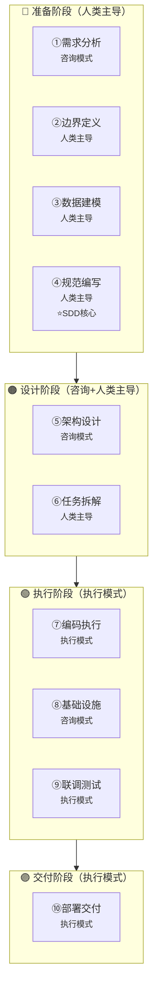
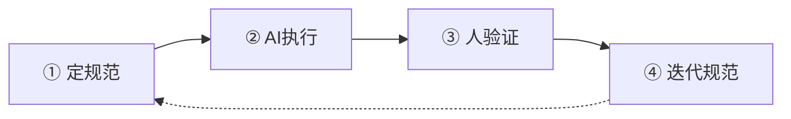
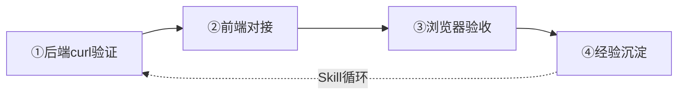

# PromptHub（一期）研发流程文档

> **文档版本**: v1.0  
> **项目名称**: PromptHub（一期内部版）  
> **研发方法论**: Claude Code 企业级全链路开发  
> **制定日期**: 2026-05-12

---

## 一、核心研发全流程总览

### 1.1 流程总图



### 1.2 Agent协作模式速查

| 模式 | 使用场景 | 人类动作 | Agent动作 |
|------|---------|----------|-----------|
| **咨询模式** | 需求不清楚、方案不确定 | 提问→判断取舍 | 提供方案→对比分析 |
| **执行模式** | 任务已明确 | 拆解任务→验收结果 | 执行任务→输出结果 |
| **人类主导** | 架构决策、边界定义 | 想清楚→拍板 | 辅助执行 |

---

## 二、十大研发阶段详解

---

### 阶段1：需求分析

| 属性 | 内容 |
|------|------|
| **阶段说明** | 先调研标杆产品，再用五步法定边界 |
| **Agent协作模式** | 咨询模式 |
| **核心产出物** | 功能全景清单、产品边界文档、CLAUDE.md项目概述 |
| **关键原则** | AI给的信息不能直接信，要验证 |

#### 第一步：调研标杆（让Agent梳理功能全景）

**目的**: 在动手之前，先理解这个领域的全貌。你连全貌都没有，怎么知道哪些功能是核心、哪些是边缘？

**向Agent提问**:
```
帮我梳理 PromptPilot（基于你对我描述的产品定位：
一个面向内部的Prompt生成、管理和优化平台）的核心功能模块，
按类别分组，每个模块用一两句话说明它做什么。
重点关注：
1. Prompt生成模块（任务类型选择、模型选择、流式输出）
2. Prompt管理模块（任务列表、版本管理）
3. Prompt优化模块（一键改写、改进建议）
4. 支撑功能（变量填写、评分、多轮对话）"
```

**AI输出示例**:

```
一、Prompt生成模块
   - 任务类型选择（文本理解、视觉理解、多轮对话三种模式）
   - 任务描述输入（用户输入功能需求）
   - 模型选择（支持多个AI模型切换）
   - AI生成Prompt（结构完整、格式规范）
   - 流式输出（打字机效果，实时展示）

二、Prompt管理模块
   - 任务列表（统一管理所有Prompt）
   - 版本管理（创建、切换、对比）
   - Prompt编辑（在线编辑、实时保存）

三、Prompt优化模块
   - 一键改写（基于反馈快速优化）
   - 改进建议（AI提供具体优化建议）
   - 版本回溯（支持恢复历史版本）

四、支撑功能
   - 变量填写（动态表单生成）
   - 模型回答生成（流式响应）
   - 评分功能（1-5分量化评价）
   - 多轮对话测试（连续交互）
```

**人类验证**:
```
拿着AI的清单和官方文档/截图核对，验证：
1. 功能描述是否准确
2. 是否有遗漏的功能（如批量评测、知识库）
3. 功能之间的依赖关系是否正确
```

---

#### 第二步：功能取舍（三问裁剪法）

**向Agent提问**:
```
我要做一个内部使用的Prompt管理平台（类PromptPilot简化版）。
约束：一个人开发，面向50人以内的内部用户。
请从刚才的功能列表中，用三问裁剪法判断哪些必须做、哪些可以砍掉：
1. 没有它产品还成立吗？
2. 做到什么程度够用？
3. 能不能一句话说清楚？
给每个功能一个明确的"做"或"砍"决策，并说明理由。
```

**AI分析示例**:

| 功能 | AI建议 | 人类决策 | 最终结论 |
|------|--------|----------|----------|
| Prompt生成 | 必须做 | ✅ 做 | P0，核心价值 |
| 版本管理 | 必须做 | ✅ 做 | P0，刚需功能 |
| 一键改写 | 必须做 | ✅ 做 | P0，优化闭环 |
| 变量填写 | 必须做 | ✅ 做 | P0，调试必需 |
| 模型回答生成 | 必须做 | ✅ 做 | P0，核心功能 |
| 评分功能 | 可以做 | ✅ 做 | P0，用户价值高 |
| 多轮对话 | 可以做 | ✅ 做 | P1，可延后 |
| 批量评测 | 砍掉 | ❌ 砍掉 | 二期再做 |
| 知识库 | 砍掉 | ❌ 砍掉 | 二期再做 |
| GSB评价 | 砍掉 | ❌ 砍掉 | 二期再做 |

---

#### 第三步：技术选型

**向Agent提问**:
```
帮我对比以下前端技术方案，重点考虑开发效率、AI SDK支持：
1) React + TypeScript + Vite
2) Vue 3 + TypeScript + Vite
3) Svelte + TypeScript

考虑因素：
- 组件化开发效率
- AI模型接入复杂度
- 状态管理方案（需要支持流式响应）
- 学习曲线（AI辅助编程场景）
```

**人类追问**:
```
"在流式响应场景下（打字机效果），React和Vue哪个更合适？
考虑：Hooks支持、状态更新机制、生态成熟度"
```

---

#### 第四步：运维预期

**向Agent提问**:
```
PromptHub是内部Prompt管理平台，50人同时使用，
主要功能是流式Prompt生成和回答。
请估算：
1. 峰值QPS和并发数
2. SSE长连接数量
3. 需要提前考虑的运维事项
4. Docker Compose部署建议
```

---

#### 第五步：写进CLAUDE.md

**向Agent提问**:
```
根据我们的讨论，把PromptHub的项目概述写进CLAUDE.md的"项目概述"部分。
包括：产品定位、做什么、不做什么、技术栈、部署与运维预期。
```

**输出示例**:

```markdown
# PromptHub项目概述

## 产品定位
一个面向公司内部的Prompt管理平台，支持Prompt生成、管理和优化，
帮助全员快速创建高质量的AI提示词。

## 做什么
- Prompt生成：AI自动生成，结构完整，流式输出
- Prompt管理：任务列表、版本管理、版本对比
- Prompt优化：一键改写、改进建议、版本回溯
- 支撑功能：变量填写、模型回答、评分、多轮对话

## 不做什么（一期）
- 批量评测、知识库管理、GSB评价
- 深度思考展示、模型参数调整
- 智能精调、工具调用

## 技术栈
- 前端：React 18 + TypeScript + Vite + Tailwind CSS + Zustand
- 后端：Node.js + Express + PostgreSQL
- 模型接入：Volcano Engine API

## 运维预期
- 用户：50人以内内部使用
- 主要压力：流式SSE响应
- 部署：Docker Compose一键启动
```

---

### 阶段2：边界定义

| 属性 | 内容 |
|------|------|
| **阶段说明** | 明确"做什么"和"不做什么" |
| **Agent协作模式** | 人类主导 |
| **核心产出物** | 产品边界文档（一页纸） |
| **关键原则** | 边界越明确，Claude Code越不会跑偏 |

**人类自己写（一页纸）**:

```markdown
# PromptHub一期边界文档

## 目标
团队内部Prompt管理平台（50人以内使用）

## 一期核心范围
✅ Prompt生成
   - 三种任务类型（文本/视觉/多轮对话）
   - 单次AI生成 + 流式输出
   - 模型选择（豆包/DeepSeek）

✅ Prompt管理
   - 任务CRUD（最多100个任务）
   - 版本管理（每个任务最多10个版本）
   - 版本对比（左右视图+差异高亮）
   - Prompt编辑（在线编辑）

✅ Prompt优化
   - 一键改写（基于反馈）
   - 改进建议（列表展示）
   - 版本回溯（恢复历史）

✅ 支撑功能
   - 用户认证（JWT）
   - 变量填写（文本类型）
   - 模型回答生成（流式）
   - 评分（1-5分）
   - 多轮对话（最多10轮）

## 一期不做（二期）
❌ 批量评测
❌ 知识库管理
❌ GSB评价
❌ 深度思考
❌ 模型参数调整
❌ 智能精调
❌ 工具调用
```

---

### 阶段3：数据建模

| 属性 | 内容 |
|------|------|
| **阶段说明** | 设计核心数据模型 |
| **Agent协作模式** | 人类主导 |
| **核心产出物** | 5-6张核心表的ER图 |
| **关键原则** | 数据库规范是Claude Code容易跑偏的地方 |

**向Agent提问**:
```
根据以下需求，设计PostgreSQL数据库表结构：

1. 用户表（id, username, password, email, created_at, updated_at, deleted）
2. Prompt任务表（id, user_id, name, task_type, status, current_version_id, timestamps, deleted）
3. Prompt版本表（id, task_id, version_number, content, description, created_at, deleted）
4. 评分记录表（id, version_id, user_id, score, comment, created_at）
5. 对话历史表（id, task_id, round_number, role, content, created_at）

规范要求：
- 主键 BIGINT AUTO_INCREMENT，禁止UUID
- 时间字段 DATETIME(3)
- 逻辑删除 deleted TINYINT(1)
- 索引命名 idx_{表名}_{字段名}
- 禁止NULL，空值用空字符串或0

请输出完整的建表SQL语句。
```

---

### 阶段4：规范编写（SDD核心）

| 属性 | 内容 |
|------|------|
| **阶段说明** | 先定规范，再让AI按规范执行 |
| **Agent协作模式** | 人类主导编写，AI执行时遵循 |
| **核心产出物** | CLAUDE.md项目规范文件 |
| **关键原则** | 规范是节省时间的捷径，不是额外负担 |

#### SDD四步闭环



---

#### 步骤1：定规范

**向Agent提问**:
```
帮我为PromptHub项目编写CLAUDE.md的规范部分，包括：

1. **组件命名规范**
   - 页面组件、业务组件、UI组件的命名规则
   - 示例：PromptGenerator.tsx vs VersionSwitcher.tsx

2. **API接口规范**
   - 路径规范：/api/v1/{资源复数名}
   - 返回格式：Result<T> { code, message, data }
   - 错误码：1000-1999通用

3. **设计原则**
   - 不引入不必要的设计模式
   - Controller只做参数校验，不写业务逻辑
   - Service只调接口，不直接new实现类

请输出一份完整的CLAUDE.md规范模板。
```

---

#### 步骤2：AI按规范执行

**向Agent提问**:
```
按照CLAUDE.md中的规范，实现Prompt任务的CRUD接口：

要求：
1. 路径：/api/v1/prompts
2. 返回格式：Result<T>
3. 错误码区分：1001=任务不存在，1002=创建失败
4. 使用Express框架
5. 先实现Entity和Mapper层

每次只实现一层，完成后告诉我验收命令。
```

---

#### 步骤3：人验证输出

**三步检查法**:

| 步骤 | 检查什么 | 具体操作 |
|------|----------|----------|
| 第一步 | 查意图 | 它做的是不是让你做的？有没有擅自添加功能？ |
| 第二步 | 查质量 | 风格、规范、一致性（命名、返回格式等） |
| 第三步 | 查边界 | 错误处理、异常、潜在风险 |

---

#### 步骤4：迭代规范

**每次发现问题时**:
```
这个AI跑偏了，补一条规范：
错误：[描述问题]
规范：[补充的规范内容]
原因：[为什么要加这条规范]
```

**迭代案例**:

| 发现时间 | 问题 | 补充规范 |
|----------|------|----------|
| 第一周 | 空数组返回null导致前端报错 | "列表字段空时返回空数组[]，不返回null" |
| 第二周 | 擅自添加了批量删除功能 | "不添加边界文档外的功能，需要先问我" |
| 第三周 | 接口破坏已有契约 | "修改已有接口前，先理解相关模块的设计意图" |

---

### 阶段5：架构设计

| 属性 | 内容 |
|------|------|
| **阶段说明** | 确定技术选型和架构方案 |
| **Agent协作模式** | 咨询模式（Agent方案对比→人类拍板） |
| **核心产出物** | 架构决策文档 |
| **关键原则** | 每次追问都是用项目约束修正AI的通用建议 |

#### 5.1 应用架构

**向Agent提问**:
```
PromptHub是内部工具，一个人开发，模块化单体是最佳选择。
请设计：
1. 前端目录结构（components/pages/stores/hooks/services）
2. 后端目录结构（routes/controllers/services/models）
3. 组件分层（Page/BusinessComponent/UIComponent的职责边界）

重点：让Claude Code知道什么该写、什么不该写。
```

---

#### 5.2 流式响应设计

**向Agent提问**:
```
PromptHub需要实现SSE流式响应（打字机效果），
请设计：
1. 前端如何接收流式响应（EventSource vs Fetch + ReadableStream）
2. 后端如何发送流式响应（res.write vs streaming Response）
3. 流式输出的状态管理（Zustand如何处理流式数据）

给出具体的代码示例。
```

---

#### 5.3 外部调用设计

**向Agent提问**:
```
LLM调用有四大问题：慢、不稳定、超时控制、重试策略。
PromptHub使用Volcano Engine API，请设计：
1. 线程池隔离方案（对话接口独立线程池）
2. 超时控制（同步60s，SSE 120s）
3. 重试策略（按异常类型区分处理）
4. 错误处理（网络超时/认证失败/模型不存在）

给出具体的实现方案。
```

---

### 阶段6：任务拆解

| 属性 | 内容 |
|------|------|
| **阶段说明** | 把大需求拆成Agent能准确执行的小任务 |
| **Agent协作模式** | 人类主导 |
| **核心产出物** | WBS任务清单 |
| **关键原则** | 拆得好：Agent一次做对；拆得差：反复返工 |

#### 判断标准

| 问题 | 答案 |
|------|------|
| 什么时候拆？ | 生成量超出review范围 OR 步骤间有依赖 |
| 按什么顺序？ | 按依赖关系，先地基后框架 |
| 怎么验收？ | 每步完成后立即验证 |

#### 拆解示例（Prompt生成模块）

**向Agent提问**:
```
请把Prompt生成模块拆解为WBS任务清单，
要求：
1. 每个任务只涉及一层（数据层/接口层/业务层/UI层）
2. 产出物可独立验证
3. 从底层往上层搭

任务清单格式：
| 任务ID | 任务内容 | 依赖任务 | 验收标准 |
|--------|----------|----------|----------|
```

**AI输出示例**:

| 任务ID | 任务内容 | 依赖任务 | 验收标准 |
|--------|----------|----------|----------|
| G-01 | 数据库表创建 | 无 | `psql`建表成功 |
| G-02 | Prompt任务Entity+Mapper | G-01 | `npm run compile`成功 |
| G-03 | DTO请求/响应对象 | G-02 | 类型定义正确 |
| G-04 | Service CRUD+缓存 | G-03 | `curl POST/GET`成功 |
| G-05 | 生成API（流式） | G-04 | SSE流正常接收 |
| G-06 | 前端任务类型选择组件 | 无 | 三种类型可切换 |
| G-07 | 前端Prompt编辑器组件 | 无 | 内容可编辑保存 |
| G-08 | 前端流式输出组件 | G-06,G-07 | 打字机效果正常 |
| G-09 | 前端生成页面整合 | G-08 | 端到端可运行 |

---

### 阶段7：编码执行

| 属性 | 内容 |
|------|------|
| **阶段说明** | 实际编写代码 |
| **Agent协作模式** | 执行模式 |
| **核心产出物** | 业务代码、接口、前端页面 |
| **关键原则** | 必须使用三步检查法验收每一行代码 |

#### 标准交付流程（五步）

| 步骤 | 内容 | Agent协作 | 验收标准 |
|------|------|----------|----------|
| **①** | 咨询模式想清楚 | 人类提问→Claude分析→人类拍板 | 设计决策文档 |
| **②** | 按层拆解任务 | 人类主导拆解 | 任务清单 |
| **③** | 逐步执行验证 | 执行模式，curl验证 | 每个curl返回200 |
| **④** | 前端对接 | mock换真实API | 浏览器验证 |
| **⑤** | 完整验收 | 端到端测试 | 全流程通过 |

---

#### 精确指令公式

```
[规范引用] + [技术选型] + [功能范围] + [边界条件] + [排除项]
```

**模糊指令 vs 精确指令**:

| 质量 | 示例 | Agent输出 |
|------|------|-----------|
| ❌ 模糊指令 | "帮我实现Prompt生成功能" | 功能可能不完整、风格不统一 |
| ✅ 精确指令 | "按照CLAUDE.md规范，使用React+TypeScript，实现Prompt生成页面，包含：1. 任务类型选择（文本/视觉/多轮对话三种卡片）2. 任务描述输入框（最多500字）3. 生成按钮（点击后调用/api/v1/generate，流式展示结果）不包含：知识库选择、批量生成" | 结构完整、风格统一、有错误处理 |

---

#### 三步检查法

| 步骤 | 检查什么 | 优先级 | 具体操作 |
|------|----------|--------|----------|
| **第一步** | 查意图 | 最高 | 它做的是不是你让它做的？有没有擅自添加功能？ |
| **第二步** | 查质量 | 中 | 风格、规范、一致性（命名、返回格式等） |
| **第三步** | 查边界 | 中 | 错误处理、异常、潜在风险（如并发问题） |

---

### 阶段8：基础设施

| 属性 | 内容 |
|------|------|
| **阶段说明** | 开发前的公共组件准备 |
| **Agent协作模式** | 咨询模式（让Agent帮你发现遗漏） |
| **核心产出物** | 公共组件代码库 |
| **关键原则** | 用咨询模式让Agent帮你查漏补缺 |

#### 基础组件三档

| 档位 | 内容 | 完成时机 |
|------|------|----------|
| **第一档** | Tailwind配置、基础CSS变量、布局框架 | 必须先做 |
| **第二档** | UI组件库（Button、Input、Modal等）、Zustand stores | 第一个功能前 |
| **第三档** | 流式响应工具、评分组件、版本对比组件 | 功能开发中 |

#### Agent协作方式

**向Agent提问**:
```
PromptHub项目工程骨架已经搭好。现在要开始做业务功能了。
在写业务代码之前，还需要准备哪些基础组件？
从以下几个角度帮我梳理：
1. 前端UI组件（必须有的基础组件清单）
2. 状态管理（需要哪些Zustand store）
3. API服务层（统一的请求封装）
4. 类型定义（统一的TypeScript类型）

请给出具体的组件清单和优先级。
```

---

### 阶段9：联调测试

| 属性 | 内容 |
|------|------|
| **阶段说明** | 模块间交互问题定位与修复 |
| **Agent协作模式** | 执行模式 |
| **核心产出物** | 可运行系统 |
| **关键原则** | curl通了不算完，浏览器走完整链路才是真正的交付闭环 |

#### 完整交付闭环



#### 验收清单

**向Agent提问**:
```
帮我验证Prompt生成模块的完整链路：

1. 后端验证
   - curl POST /api/v1/prompts - 创建任务
   - curl GET /api/v1/prompts - 获取列表
   - curl POST /api/v1/generate - 流式生成

2. 前端验证
   - 任务类型选择可切换
   - 任务描述可输入
   - 生成按钮可点击
   - 流式输出正常展示

3. 端到端验证
   - 完整流程跑通
   - 错误处理正常

请给出具体的curl命令和预期响应。
```

---

### 阶段10：部署交付

| 属性 | 内容 |
|------|------|
| **阶段说明** | 从本地开发到可交付状态 |
| **Agent协作模式** | 执行模式 |
| **核心产出物** | 部署包、Docker镜像 |
| **关键原则** | Agent可处理配置工作，人类负责验收确认 |

#### Docker部署方案

**向Agent提问**:
```
PromptHub需要Docker Compose一键部署，包含：
1. 前端（React构建 + Nginx）
2. 后端（Node.js）
3. 数据库（PostgreSQL）

请输出完整的docker-compose.yml和Dockerfile。
要求：
- 多阶段构建优化体积
- 数据卷持久化
- 环境变量配置
- 健康检查
```

---

## 三、PromptHub一期功能全景图

```
┌─────────────────────────────────────────────────────────────────────────┐
│                           PromptHub一期功能全景                              │
│                                                                           │
│   ┌─────────────────┐    ┌─────────────────┐    ┌─────────────────┐   │
│   │   Prompt 生成    │    │   Prompt 管理    │    │   Prompt 优化    │   │
│   │                 │    │                 │    │                 │   │
│   │  • 任务类型选择 │    │  • 任务列表     │    │  • 一键改写     │   │
│   │  • 任务描述输入 │    │  • 版本管理     │    │  • 改进建议     │   │
│   │  • 模型选择     │    │  • 版本对比     │    │  • 版本回溯     │   │
│   │  • AI 生成      │    │  • Prompt 编辑  │    │                 │   │
│   │  • 流式输出     │    │  • 搜索筛选     │    │                 │   │
│   └────────┬────────┘    └────────┬────────┘    └────────┬────────┘   │
│            │                       │                       │             │
│            └───────────────────────┼───────────────────────┘             │
│                                    ▼                                     │
│   ┌─────────────────────────────────────────────────────────────────┐   │
│   │                         支撑功能                                  │   │
│   │                                                                   │   │
│   │  用户认证  │  变量填写  │  模型回答生成  │  评分  │  多轮对话 │   │
│   └─────────────────────────────────────────────────────────────────┘   │
└─────────────────────────────────────────────────────────────────────────┘
```

---

## 四、页面与功能映射

| 页面ID | 页面名称 | 对应功能 | Agent协作提示词位置 |
|--------|----------|----------|-------------------|
| AA02 | Prompt生成页 | Prompt生成主流程 | 阶段7-精确指令示例 |
| AB01 | 生成中状态 | 流式输出展示 | 阶段5-流式响应设计 |
| BB01 | 调试任务列表 | 任务管理 | 阶段6-任务拆解示例 |
| BA01 | Prompt调试页 | 核心调试功能 | 阶段7-三步检查法 |
| BC04 | 一键改写弹窗 | Prompt优化 | 阶段7-精确指令示例 |
| BD03 | 版本对比面板 | 版本对比 | 阶段4-规范编写 |

---

## 五、核心技术决策

### 5.1 前端技术选型

| 决策项 | 选择 | 理由 |
|--------|------|------|
| 框架 | React 18 | 生态成熟、组件化完善 |
| 语言 | TypeScript | 类型安全，AI代码生成质量高 |
| 构建 | Vite | 快速启动、热更新快 |
| 样式 | Tailwind CSS | 开发效率高，一致性好 |
| 组件库 | Radix UI | 无障碍、可定制 |
| 状态 | Zustand | 轻量、TypeScript友好 |
| 路由 | React Router v6 | 官方推荐 |
| 动画 | Framer Motion | React原生、功能强大 |

### 5.2 后端技术选型

| 决策项 | 选择 | 理由 |
|--------|------|------|
| 运行时 | Node.js | 与前端统一语言 |
| 框架 | Express | 轻量、灵活 |
| 数据库 | PostgreSQL | JSON支持、可靠性高 |
| ORM | Prisma | TypeScript原生、自动迁移 |
| 认证 | JWT | 内部应用足够 |

### 5.3 模型接入

| 决策项 | 选择 | 理由 |
|--------|------|------|
| API提供商 | Volcano Engine | 豆包/DeepSeek模型 |
| 调用方式 | REST API + SSE | 流式响应支持 |
| 错误处理 | 重试+熔断 | 稳定性保障 |

---

## 六、风险与应对

| 风险 | 等级 | 应对措施 |
|------|------|----------|
| 流式响应延迟 | 中 | 前端显示loading状态，超时提示 |
| 模型API不稳定 | 高 | 熔断器隔离、错误提示 |
| 版本对比性能 | 低 | 虚拟化列表、懒加载 |
| 多轮对话上下文 | 中 | 限制轮次、提示用户 |

---

## 七、Agent协作提示词速查表

| 阶段 | 场景 | 向Agent提问 |
|------|------|-----------|
| 1-需求分析 | 调研标杆 | "帮我梳理PromptPilot的核心功能模块..." |
| 1-需求分析 | 功能取舍 | "用三问裁剪法判断哪些必须做..." |
| 1-需求分析 | 技术选型 | "对比React和Vue在流式响应场景..." |
| 2-边界定义 | 写边界文档 | [人类自己写，使用三问裁剪法结果] |
| 3-数据建模 | 设计表结构 | "设计PostgreSQL表结构，包含建表SQL..." |
| 4-规范编写 | 定规范 | "编写CLAUDE.md规范：组件命名/API/设计原则..." |
| 4-规范编写 | 执行任务 | "按照CLAUDE.md规范，实现..." |
| 4-规范编写 | 迭代规范 | "这个AI跑偏了，补一条规范..." |
| 5-架构设计 | 设计架构 | "设计前端/后端目录结构..." |
| 5-架构设计 | 流式设计 | "SSE流式响应如何实现..." |
| 5-架构设计 | 外部调用 | "LLM调用四大问题如何处理..." |
| 6-任务拆解 | 拆解任务 | "把Prompt生成模块拆解为WBS任务清单..." |
| 7-编码执行 | 精确指令 | "[规范]+[技术选型]+[功能范围]+[排除项]" |
| 7-编码执行 | 验收检查 | "三步检查法：查意图/查质量/查边界" |
| 8-基础设施 | 查漏补缺 | "还需要哪些基础组件..." |
| 9-联调测试 | 验证链路 | "验证Prompt生成完整链路..." |
| 10-部署交付 | Docker部署 | "输出docker-compose.yml和Dockerfile..." |

---

**文档制定完成**

本文档严格遵循《Claude Code企业级全链路开发》的方法论框架，为每个阶段提供了具体的Agent交互提示词示例，确保人类和AI能够高效协作。

---

*关联文档：*
- *产品概述：c:\vibe\pmppdemo\docs\产品方案_一期\01-产品概述.md*
- *核心功能列表：c:\vibe\pmppdemo\docs\产品方案_一期\02-核心功能列表_v2.md*
- *页面关系对照：c:\vibe\pmppdemo\docs\产品方案_一期\03-页面关系对照.md*
- *研发全流程指南：c:\vibe\pmppdemo\00-研发全流程完整指南.md*
