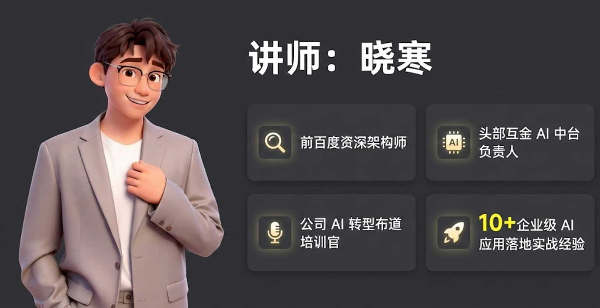
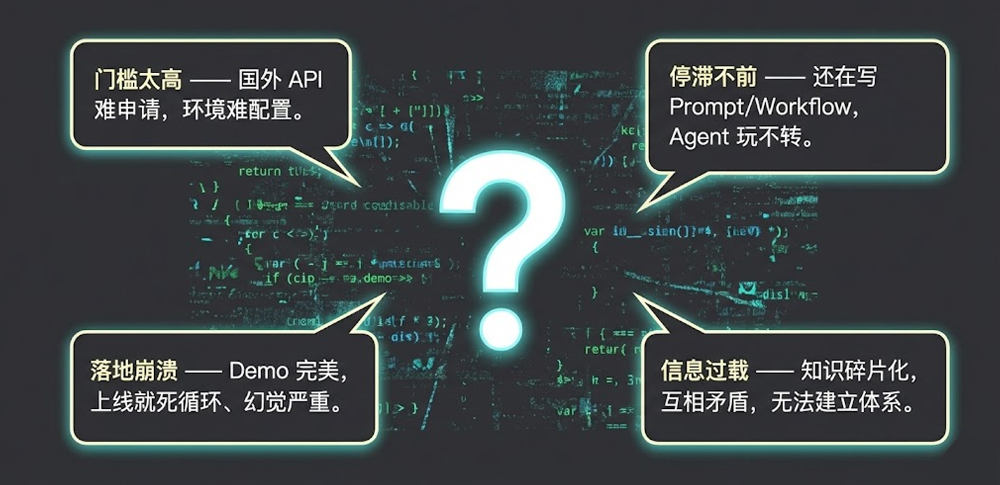
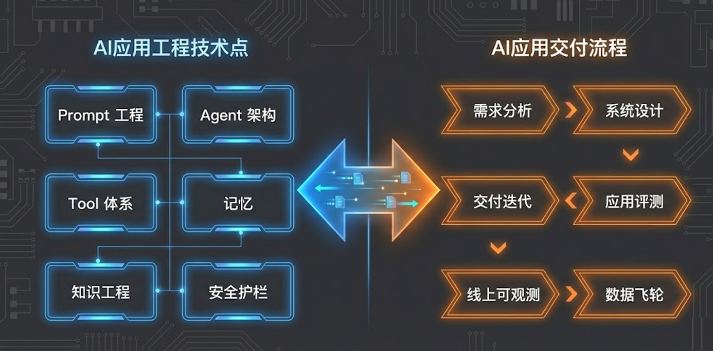
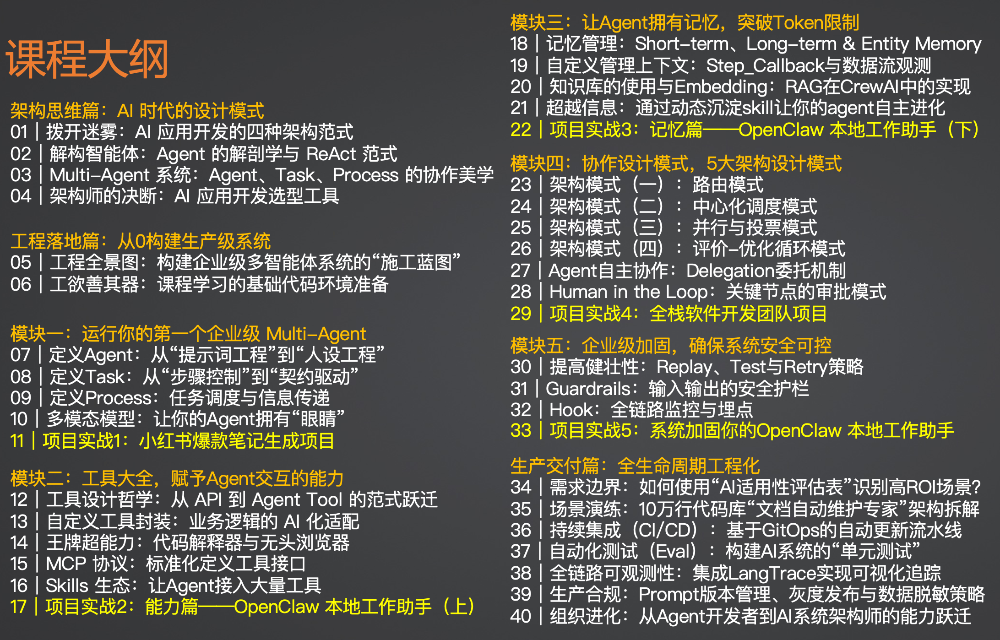
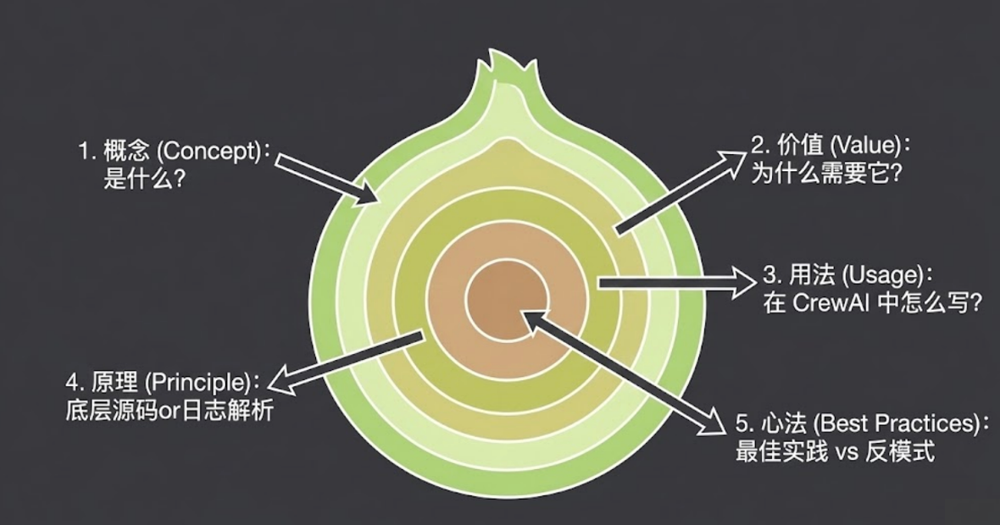
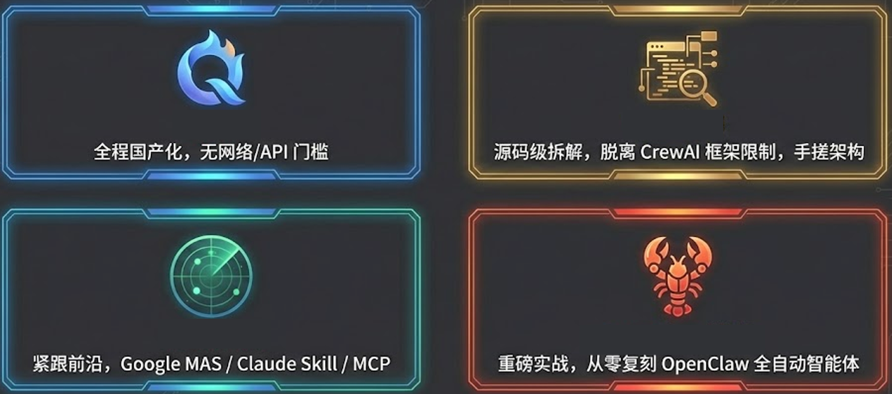

# 课程介绍｜告别“野路子”：转型企业级多智能体架构师

> 来源：极客时间《企业级多智能体设计实战》
> 当前播放：课程介绍｜告别“野路子”：转型企业级多智能体架构师
> 提取日期：2026-06-02
> 原文长度：3160 字

---

你好，我是晓寒。

第一次和大家见面，我还是先做个自我介绍。在互联网行业摸爬滚打十几年，我曾经在百度做过架构师，一直专注工程架构、稳定性和质量。现在，我在一家头部的互联网金融公司，负责企业内部的 AI 中台建设。

因为在职的缘故，我用“晓寒”这个笔名和大家见面。虽然名字是新的，但在 AI 这条路上，我算是第一批“吃螃蟹”的人，也是第一批被螃蟹“夹到手”的人。

从 2022 年 ChatGPT 横空出世开始，我经历了整个周期的起伏：最开始做几十个大模型的横向评测，见证了它惊人的进化；后来转战 AI 应用开发，从最简单的 **Prompt 工程**，到复杂的**工作流（Workflow）**，再到**智能体（Agent）**。这一路，我踩过无数的坑：

- Demo 跑得很顺，上线使用时被各种吐槽不好用；
- 好不容易效果达标，发现现有机器算力完全支撑不了，紧急换方案；
- 反复出现早上起来跑批任务全部 hang 死、产出为空……

不过最终，我们也成功孵化了很多业务和内部场景的 AI 应用上线。之后我还带了一段时间 AI 产品，因为我发现：**现在整个业界的发展，AI 产品才是真正的瓶颈**。市面上最火、最好的 AI 应用往往都是编程相关的，因为工程师自己就能当产品，迭代飞快；但传统产品转型 AI 产品的门槛极高，真正能主导复杂 AI 应用落地的产品经理非常少。这段经历，让我能切换到新的视角去看待 AI 应用的落地。

而我现在的工作，一方面是搭建 AI 应用落地的基础设施，把之前沉淀的能力抽象出来赋能更多方向；另一方面也是对公司内其它业务团队进行“布道”，推动整个公司的 AI 转型。也许是因为在企业内经常讲课，对于做好这门课，我还是比较有信心的。

正因为在这个过程中“交了太多学费”，我决定把这些从实战中提炼出来的“生存指南”，做成这门课分享给你。本课程专注于**应用工程方向**，主要面向做 AI 应用落地的工程师，以及希望更好理解 AI 落地过程的产品或算法同学。

---

## 屏幕前的你，是否也有这些困惑？

我知道，你可能正面临着跟我当初一样的痛点：

- 概念满天飞，上手却无门：听够了 AGI、智能涌现和五花八门的开源框架，但当你想迫切上手时，却无从下手，单单是配置国外的模型 API 就让你头疼。
- 遭遇进阶瓶颈，难以捅破窗户纸：看着国外的 ClaudeCode 惊为天人，看着最近火爆的 OpenClaw 羡慕不已。回头看自己的项目，依然是堆砌的 Prompt 和写死的 Workflow。想进阶到 Agent 甚至 Multi-Agent，总感觉差了点什么。
- Demo 变生产的“买家秀”落差：尝试把 AI 引入实际业务，却发现教程里是“买家秀”，你做出来的是“卖家秀”。模型幻觉严重、任务死循环、架构脆弱三天两头挂掉，根本不敢推上生产环境。
- 知识体系碎片化：打开公众号、GitHub，知识是碎片甚至冲突的。今天说这个框架火，明天说 RAG 已死，很难建立起一套自己的底层逻辑。

如果你有这些感觉，那么，这门课就是为你准备的。

---

## 这门课能为你带来什么？

这门《企业级多智能体设计实战》的目的只有一个：**带你告别“野路子”，成为 AI 开发的“正规军”。**

我不希望你学完之后只是会调几个 API，或者写几个 Prompt。我希望你在这里获得两样核心能力：

### 第一，思维模式的彻底升级

你会掌握一套体系化的 Multi-Agent 设计模式。你会明白什么时候该用单智能体，什么时候该用多智能体协作，以及如何用架构师的思维去治理它们。当你看到新技术出现时，能迅速评估它的价值并纳入自己的认知体系。

举个例子，就拿现在最火的 **Skill（技能）** 来说。这个概念被泛化得很严重，一开始只是 Claude 发布的一套协议，后来被各种擦边宣传搞得越来越乱。但学完这门课，你能迅速看透它的本质：

1. 工具使用能力的边界拓展：Skill 增强了 Agent 对工具的使用能力，扩展了工具库的数量。如果你本身没有让模型自主选择工具，或者场景只需要少量固定工具，那 Skill 对你帮助不大。
2. 渐进式披露的上下文管理范式：从技术角度看，这套管理上下文的方案非常值得学习。除了工具，记忆、知识等所有的“上下文大户”，都应该借鉴这种机制进行优化。
3. AI 时代“原子能力”的生态封装：现在 Skill 承担了 AI 应用原子能力的载体，本质是封装和共享。一开始封装工具调用，后来封装一系列 CoT、Prompt，甚至封装 Sub-Agent。把功能封装后作为独立组件去运营，恰恰就是未来的发展方向。

建立起这样的设计与分析框架，你才能在高速发展的技术洪流中保持一份从容。

### 第二，应用到企业级全链路的工程能力

我们会从 0 到 1 全面学习 AI 应用工程落地的每个环节。

- 工程视角：吃透 Prompt、Agent、工具、记忆、知识、协作模式、安全护栏。
- 交付视角：掌握需求分析、系统设计、交付迭代、应用评测、线上可观测性，以及生产数据回流的“迭代飞轮”。

我把落地 AI 应用的正规打法倾囊相授。掌握这门课，你将具备**在企业中主导生产级 AI 项目的能力**。不管你是想做独立开发者，还是想在公司内部晋升，这都是你必须跨越的门槛。

---

## 课程设计：三步走战略

为了达成这个目标，我把课程分成了三个循序渐进的篇章：

1. 设计篇（建立图纸）：如果你手里只有锤子，看什么都是钉子。我们要先建立 AI 时代的设计模式框架。
2. 工程篇（核心重头戏）：采用“五步认知法”拆解每一个知识点。我们不仅讲“它是什么”，更讲“有什么用”、“怎么用”、“底层原理”，以及最重要的——“最佳实践和反模式”。我们会从最简单的 MVP 开始，一步步攻克工具使用、知识库检索（RAG）、复杂协作和安全稳定性难题，告诉你哪些坑绝对不能踩。

3. **交付篇（持续价值）**：会写代码只是开始。我们会讲如何测试 AI 应用、如何建立数据飞轮，让你的应用越用越聪明。

---

## 课程的四大硬核特色

和市面上其他课程相比，这门课有四个非常鲜明的特点：

**💡 极低的实战门槛**

- 没有 GPT-4 的 API Key？没有科学上网环境？没关系。本课程全程使用国产模型（如 DeepSeek、通义千问等），配合国内可用工具。只要你会 Python，就能跟着做。

**🔍 深剖底层原理**

- 我们会以 CrewAI 框架作为实战载体，但绝不只教你当“API 调包侠”。大多数框架由于迭代太快，在生产环境中都有各种 Bug。因此，我会带你拆解源码、讲透原理。学完后，你完全有能力脱离 CrewAI，甚至手搓出适合自家业务的专属框架。

**🚀 紧跟前沿技术**

- AI 发展极快，输出倒逼输入。备课期间 Google 发布了最新的 MAS 设计模式，我立刻将其纳入协作篇；Claude 推出 Skill，我紧急调整了工具篇内容；甚至面对刚刚发布的 OpenClaw（小龙虾），我也决定把实践课升级，带你亲手搭建一个！

**🏢 实打实的企业级实战**

- 我们不做只会聊天的玩具机器人，只做真正能上线的强大武器。我们会带你做： 深度研报撰写 Agent：从海量信息中提炼高价值洞察。 小红书爆款生成器：打造真正懂流量密码的 AI。 手搓复刻全自动驾驶的 OpenClaw 系统：带你从零构建一个能自动感知、自动决策、自动执行任务的全自动系统！

朋友们，AI 时代，拿着锤子找钉子的人满地都是，但懂得画图纸、建高楼的架构师千金难求。

**仅仅会用工具，你可能会被工具取代；但如果能设计和驾驭工具，你将成为未来的创造者。** 期待在课程里见到你，让我们一起，把 AI 这个“不确定”的未来，变成你手中“确定”的生产力。
---

来源：极客时间《企业级多智能体设计实战》
提取日期：2026-06-02
