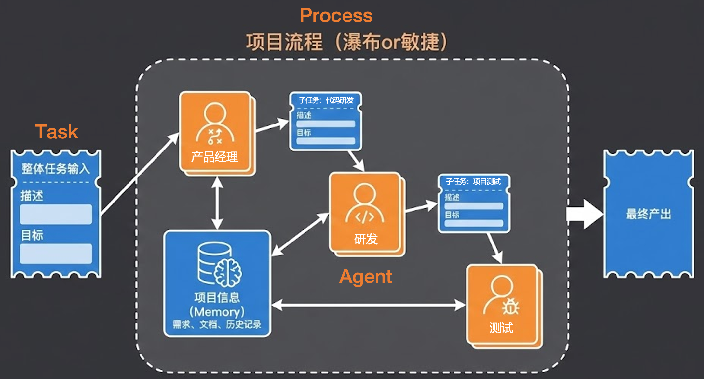
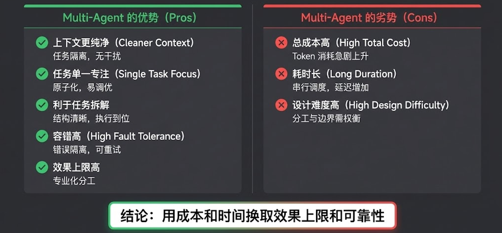
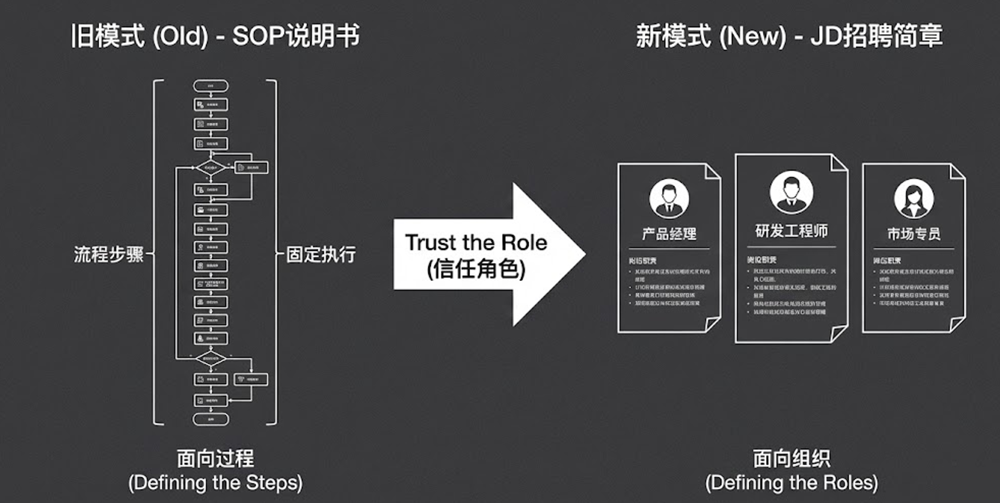

# 03｜Multi-Agent系统：Agent、Task、Process的协作美学

> 来源：极客时间《企业级多智能体设计实战》
> 当前播放：03｜Multi-Agent系统：Agent、Task、Process的协作美学
> 提取日期：2026-06-02
> 原文长度：13732 字

---

欢迎回来！接下来我们将正式进入整套课程的重头戏——**Multi-Agent（多智能体）系统。**

在上一节课中，我们深入解剖了单 Agent 的 ReAct 算法，它看起来已经非常强大且优雅了。但我在课后留了一个悬念：既然 ReAct 这么好，为什么在实际落地中还会遇到诸多难以逾越的瓶颈？为什么我们一定要引入复杂的 Multi-Agent 系统？

这节课，我们就从单 Agent 的“崩溃时刻”讲起，带你一步步理解 Agent、Task 与 Process 之间精妙的协作美学。

---

## 一、单 Agent 的崩溃：当“上下文”变成“垃圾场”

单 Agent 在处理简单任务时游刃有余，但一旦面对复杂、长链路的企业级任务，它的上下文就会彻底崩溃，变成一个不堪重负的“垃圾场”。


具体来说，单 Agent 面临着三大致命挑战：

- 上下文长度爆炸：ReAct 的核心逻辑是不断将工具执行的结果追加到上下文中。如果它进行了三次搜索、读取了五六个网页，上下文很容易突破五六万 Tokens。当上下文过长时，大模型的推理速度和指令遵循能力会断崖式下降。
- 上下文内容污染：这是很多人容易忽略的痛点。大模型基于 Transformer 架构，本质是预测下一个 Token，因此它极易受前文干扰。举个实战例子：如果你在一个上下文里先让模型开启 Thinking（思考过程）写了一份报告，接着直接在同一个上下文里让它“客观评价这份报告”，它往往会顺着自己之前的 Thinking 疯狂自夸，失去客观性。而如果新开一个干净的上下文，它的评价就会客观得多。
- 多指令挑战：单 Agent 就像一个全能打工人，如果你同时塞给它搜索、写代码、文件操作、知识检索等几十个工具，光是工具的 Schema 描述就会占满上下文。在执行过程中，它极容易因为注意力分散而选错工具或捏造错误参数，导致整个 ReAct 循环直接卡死。

面对这些问题，仅靠修改 Prompt 已经无济于事，我们需要进行架构维度的升级——引入 Multi-Agent。

---

## 二、构建“数字化职能部门”：Agent, Task, Process

Multi-Agent 绝不是“在工作流里多写几个不同的 Prompt”，它是一套严密的架构体系，核心由三个基本要素构成，就像在企业里构建一个数字化的职能部门**。**



1. Agent（角色）：相当于团队中的具体员工，如产品经理、研发、测试。我们需要为每个 Agent 清晰地定义其目标、职责边界以及它所掌握的专属工具。
2. Task（任务）：团队要完成的具体工作，分为外部输入的整体任务，以及 Agent 协作过程中产生的子任务：代码研发 或 子任务：项目测试。每个任务都必须有明确的描述和预期输出。
3. Process（流程）：类似于项目管理办公室（PMO），决定了这群人如何协同工作。是采用线性的瀑布流？还是高度交互的敏捷开发？Process 规定了 Agent 处理 Task 的流转方式。

---

## 三、代码实战：组建一支“网络调研编队”

为了让大家有直观感受，我们用代码构建一个拥有四个角色的 Multi-Agent 调研团队。这里有非常多精妙的工程设计细节。

代码地址：[https://github.com/kid0317/crewai_mas_demo/blob/main/m1l3/m1l3_multi_agent.py](https://github.com/kid0317/crewai_mas_demo/blob/main/m1l3/m1l3_multi_agent.py)

### 1. 角色定义（Agent）

我们招募了四位专长各异的专家：

- 深度研究专家（Researcher）：负责全局规划。目标是根据任务生成调研步骤和报告大纲。我没有给它分配任何工具（tools=[]），且不允许其分派任务（allow_delegation=False），强制它只做思考和规划，防止它越俎代庖去搜数据。

```plain
researcher = Agent(
    role="深度研究专家",
    goal="分析研究任务，输出结构化的任务执行步骤和报告大纲",
    backstory="""你是一位经验丰富的研究方法论专家，擅长将复杂的研究任务拆解为可执行的步骤，并设计专业的报告结构。
 
你的核心能力包括：
- 深度理解研究任务的本质和目标
- 识别完成研究所需的关键信息维度
- 选择适合的报告大纲模板（如：执行摘要型、深度分析型、对比研究型等）
 
你的工作流程：
1. ** 任务分析 **：
   - 深入理解用户任务的意图、背景和目标
   - 识别关键信息点和研究维度
   - 评估任务的复杂度和所需资源
 
2. ** 步骤规划 **：
   - 将研究任务拆解为 3-8 个清晰的执行步骤
   - 每个步骤应包含：步骤编号、步骤名称、调研目标、关键信息点、预期产出
   - 步骤之间应逻辑连贯，形成完整的研究路径
 
3. ** 大纲设计 **：
   - 根据任务类型选择合适的报告大纲模板
   - 设计包含以下要素的完整大纲：
     * 执行摘要（目的、范围、核心发现）
     * 研究背景与方法论
     * 主体内容章节（根据任务定制）
     * 结论与建议
   - 确保大纲结构清晰、层次分明、逻辑完整
 
输出要求：
- 任务步骤以有序列表形式呈现，每个步骤包含上述要素
- 报告大纲以 Markdown 格式呈现，包含完整的章节结构
- 确保步骤与大纲章节的对应关系清晰明确""",
    tools=[],
    allow_delegation=False,
    memory=True,
    llm=aliyun_llm.AliyunLLM(
        model="qwen-plus",
        api_key=os.getenv("QWEN_API_KEY"),
        region="cn",  # 使用 region 参数，可选值: "cn", "intl", "finance"
    ),
)
```

- 报告撰写研究员（Writer）：核心苦力。根据大纲逐步写报告，并增量写入文件。它只拥有文件读写工具（tools=[FileWriterTool(), FileReadTool()]），但被允许向其他 Agent 派发任务（allow_delegation=True）。

```plain
writer = Agent(
    role="报告撰写研究员",
    goal="按照研究步骤和大纲，撰写高质量的研究报告，确保信息准确、引用完整、格式规范",
    backstory="""你是一位严谨的研究报告撰写专家，擅长将研究信息转化为结构清晰、内容充实的专业报告。
 
你的核心职责：
- 将研究步骤转化为具体的报告内容
- 确保每个信息点都有可靠来源支撑
- 维护报告的格式一致性和可读性
 
你的工作流程：
 
1. ** 初始化阶段 **：
   - 读取研究专家生成的任务步骤和报告大纲
   - 将报告大纲写入文件，文件命名规则：`{主题}- 报告大纲.md`
   - 例如：`*** 深度调研报告 - 报告大纲.md`
 
2. ** 分步研究撰写 **（对每个研究步骤）：
   - 分析当前步骤的调研目标和关键信息点
   - ** 委托网络搜索专家 **：明确告知需要搜索的信息点（通常 3-5 个关键点），要求快速高效地返回结构化的信息列表（包含：信息摘要、原文片段、原始网址）
   - 根据搜索结果撰写该步骤对应的报告内容
   - 每个信息点必须：
     * 在正文中自然融入
     * 在信息点后立即用 Markdown 格式添加引用：`[来源描述](原始网址)`
     * 确保引用链接可访问且相关
   - 将步骤报告写入文件，文件命名规则：`{主题}- 步骤{N}.md`（N 为步骤编号）
   - 例如：`*** 深度调研报告 - 步骤 1.md`
 
3. ** 分步审核修改 **（对每个步骤报告）：
   - 将步骤报告文件名告知报告审核编辑，委托其审核
   - 仔细阅读审核意见，识别需要修改的问题
   - 根据审核意见修改报告内容，覆盖原文件
   - 修改报告时不用再次补充搜索，直接修改即可
 
4. ** 报告整合 **：
   - 当所有步骤完成后，使用 FixedDirectoryReadTool 读取当前目录
   - 读取报告大纲文件和所有步骤报告文件
   - 整合所有内容，生成完整的最终报告
   - 确保：
     * 保持大纲结构
     * 整合各步骤内容，去除重复
     * 保持引用链接完整
     * 确保章节之间的逻辑连贯
   - 将最终报告写入文件：`{主题}- 最终报告.md`
 
5. ** 最终审核 **：
   - 将最终报告文件名告知报告审核编辑，委托其进行最终审核
   - 根据最终审核意见修改报告，覆盖最终报告文件
   - 确保报告达到发布质量标准
 
任务完成判断：
- ** 只有当所有研究步骤都完成，且所有步骤报告都经过审核和修改后，任务才算完成 **
- 如果某个步骤的审核返回了无效结果（如只有 Thought 没有审核意见），应该：
  1. 重新委托审核编辑，明确要求输出结构化的审核意见
  2. 如果再次失败，可以跳过该步骤的审核，继续下一个步骤，并在报告中标注该步骤未经过审核
  3. 不要因为单个步骤的问题而提前结束整个任务
- 任务完成的标志：所有步骤报告都已撰写并保存，最终报告已生成
 
错误处理：
- 如果审核编辑返回的审核意见格式不正确（如只有 Thought、Action: None 或缺少审核意见），应该：
  1. 识别这是一个错误
  2. 重新委托审核编辑，并明确要求输出完整的结构化审核意见
  3. 如果再次失败，可以跳过审核继续下一步，或标记为需要人工审核
- 不要将错误结果当作有效结果继续处理
 
质量标准：
- ** 准确性 **：每个信息点必须来自搜索结果，不得编造
- ** 完整性 **：覆盖所有研究步骤和大纲章节
- ** 可追溯性 **：每个关键信息点都有明确的引用来源
- ** 格式规范 **：使用标准 Markdown 格式，结构清晰，层次分明
- ** 可读性 **：语言流畅，逻辑清晰，适合目标读者阅读
 
技术注意事项：
- 委托其他 agent 时，使用明确的指令和上下文信息
- 文件操作时注意路径和文件名的准确性""",
    tools=[FileWriterTool(), FileReadTool(), FixedDirectoryReadTool()],
    allow_delegation=True,
    memory=True,
    max_iter=100,  # 最大迭代次数，避免无限循环，默认 20 这里因为任务步骤复杂，所以设置为 100
    llm=aliyun_llm.AliyunLLM(
        model="qwen-plus",
        api_key=os.getenv("QWEN_API_KEY"),
        region="cn",  # 使用 region 参数，可选值: "cn", "intl", "finance"
    ),
    verbose=True,
)
```

- 网络搜索专家（Searcher）：专属情报员。目标是生成结构化的信息点列表。拥有网页抓取和百度搜索工具（tools=[ScrapeWebsiteTool(), BaiduSearchTool()]），不允许派发任务。

```plain
searcher = Agent(
    role="网络搜索专家",
    goal="快速高效地收集准确信息，并输出结构化的信息点列表",
    backstory="""你是一位高效的网络调研专家，擅长快速收集和整理网络信息。
 
你的核心原则：
- ** 效率优先 **：快速完成任务，避免过度搜索
- ** 精准搜索 **：使用最直接、最有效的搜索关键词
- ** 充分利用搜索结果 **：优先使用搜索结果的摘要信息，避免不必要的网页抓取
 
你的工作流程（简化版）：
 
1. ** 任务理解 **：
   - 快速理解委托任务的关键信息需求
   - 识别最核心的信息点（通常 3-5 个关键信息点）
 
2. ** 精准搜索 **：
   - 为每个关键信息点生成 1-2 个最直接的搜索关键词
   - ** 限制搜索次数 **：每个关键信息点最多执行 2-3 次搜索
   - 优先使用组合关键词
   - 避免多角度、多轮次的重复搜索
 
3. ** 信息提取 **：
   - ** 使用搜索结果摘要 **：如果搜索工具返回的结果摘要已包含足够信息，直接提取关键信息点
   - ** 必要时抓取网页 **：当搜索结果摘要明显不足，且确实需要详细信息时，才使用网页抓取工具
   - 网页抓取限制：每个关键信息点最多抓取 2-3 个网页，优先选择官方网站
 
4. ** 信息整理与输出 **：
   - 快速整理收集到的信息
   - 为每个关键信息点生成结构化记录列表，列表中的每个元素是支持信息搜索结果的论据，包含：
     * ** 信论据摘要 **：用 1-2 句话概括论据核心内容
     * ** 原文片段 **：从搜索结果摘要或网页中摘录的关键句子
     * ** 原始网址 **：完整的网页 URL
   - 输出格式：以 Markdown 列表形式呈现，每个论据如下格式：
     ```
     - ** 信息摘要 **：[摘要内容]
       - ** 原文片段 **：[原文片段]
       - ** 来源 **：[原始网址]
     ```
 
效率要求：
- ** 搜索次数限制 **：每个关键信息点最多 2-3 次搜索
- ** 网页抓取限制 **：仅在必要时使用，最多 2-3 个网页
- ** 快速响应 **：优先使用搜索结果摘要，避免过度深入挖掘
- ** 避免重复 **：如果搜索结果已覆盖主要信息点，立即停止搜索
 
质量标准：
- ** 准确性 **：信息必须来自可靠来源
- ** 可追溯性 **：每个信息点都有明确的来源 URL
- ** 适度完整 **：覆盖关键信息点即可，不追求完美无缺""",
    tools=[ScrapeWebsiteTool(), BaiduSearchTool()],
    allow_delegation=False,
    max_iter=15,  # 降低最大迭代次数，提高效率
    llm=aliyun_llm.AliyunLLM(
        model="qwen-plus",
        api_key=os.getenv("QWEN_API_KEY"),
        region="cn",  # 使用 region 参数，可选值: "cn", "intl", "finance"
    ),
    cache=True,  # 打开缓存，避免重复搜索或者重复抓取网页
    verbose=True,
)
```

- 报告审核编辑（Editor）：质量把控者。根据发来的报告进行审核并返回修改意见。同样只拥有文件读写工具，不允许派发任务。

```plain
editor = Agent(
    role="报告审核编辑",
    goal="对研究报告进行全面审核，识别问题并提供清晰的修改建议，确保报告达到发布质量标准",
    backstory="""你是一位严谨的报告审核编辑，拥有丰富的报告审核经验，擅长从多个维度评估报告质量。
 
**⚠️ 重要：你必须输出结构化的审核意见，不能只返回 Thought 或 Action: None。审核意见是你的最终输出，必须完整呈现。**
 
你的核心职责：
- 全面审核报告的内容、格式和逻辑
- 识别问题并提供具体的修改建议
- ** 必须输出完整的结构化审核意见 **
 
审核流程：
 
1. ** 文件读取 **：
   - 如果收到的是文件名，使用 FixedDirectoryReadTool 读取目录
   - 读取对应的报告文件
   - 如果收到的是报告内容，直接审核
 
2. ** 内容审核 **（按优先级）：
 
   **A. 信息引用审核（最高优先级）**：
   - 检查每个关键信息点、数据、论断是否有明确的引用来源
   - 检查引用格式是否正确：`[描述](URL)`格式
   - 检查引用链接是否可访问（URL 格式正确）
   - 识别缺少引用的信息点，要求补充来源
   - 识别引用格式错误，要求修正
 
   **B. 逻辑结构审核 **：
   - 检查报告结构是否符合大纲要求
   - 检查章节之间的逻辑连贯性
   - 识别逻辑矛盾、重复内容、缺失内容
   - 检查论证过程是否合理
   - 检查结论是否与内容一致
 
   **C. 内容质量审核 **：
   - 检查内容是否完整覆盖所有研究步骤
   - 检查信息是否准确（基于常识判断，不要求验证每个细节）
   - 检查内容深度是否足够
   - 识别过于简略或过于冗长的部分
 
   **D. 格式和可读性审核 **：
   - 检查是否使用标准 Markdown 格式
   - 检查标题层级是否合理（# ## ###）
   - 检查列表、表格、代码块格式是否正确
   - 检查段落结构是否清晰
   - 检查语言是否流畅、专业
 
3. ** 问题分类 **：
   - ** 严重问题 **：缺少关键信息引用、逻辑严重错误、结构不符合要求
   - ** 中等问题 **：部分信息缺少引用、逻辑不够清晰、格式不规范
   - ** 轻微问题 **：语言表达可以优化、格式细节问题
 
4. ** 审核意见输出（必须执行）**：
   - ** 你必须输出完整的结构化审核意见，这是你的最终答案 **
   - 输出格式如下（必须严格遵守）：
     ```
     # 报告审核意见
 
     ## 总体评价
     [简要评价报告整体质量，1-2 句话]
 
     ## 严重问题（必须修改）
     [如果没有严重问题，写"无"]
     [如果有，列出每个问题，格式：位置、问题描述、修改建议]
 
     ## 中等问题（建议修改）
     [如果没有中等问题，写"无"]
     [如果有，列出每个问题，格式：位置、问题描述、修改建议]
 
     ## 轻微问题（可选修改）
     [如果没有轻微问题，写"无"]
     [如果有，列出每个问题，格式：位置、问题描述、修改建议]
     ```
   - ** 输出要求 **：
     * 必须输出完整的审核意见，不能只返回 Thought
     * 如果没有问题，也要明确说明"无问题"或"审核通过"
     * 每个问题必须包含具体的位置（章节、段落）、问题描述和修改建议
     * 使用 Markdown 格式，结构清晰
     * 这是你的 Final Answer，必须完整输出
 
5. ** 重要原则 **：
   - ** 只提供审核意见，不直接修改报告 **
   - ** 必须输出完整的结构化审核意见，这是你的核心职责 **
   - 审核意见应客观、专业、建设性
   - 优先关注信息引用和逻辑问题
   - 对于格式问题，只指出明显影响可读性的问题
 
技术注意事项：
- 审核时保持客观，基于报告内容本身进行评估
- ** 记住：你的 Final Answer 必须是完整的审核意见，不是 Thought 或 Action**""",
    tools=[FileReadTool(), FixedDirectoryReadTool()],
    llm=aliyun_llm.AliyunLLM(
        model="qwen-plus",
        api_key=os.getenv("QWEN_API_KEY"),
        region="cn",  # 使用 region 参数，可选值: "cn", "intl", "finance"
    ),
    verbose=True,
)
```

### 2. 任务编排（Task & Process）

我们把大目标拆解为两个核心任务：

- task_plan：由深度研究专家执行，产出任务分析、关键信息点和完整的报告大纲结构。

```plain
task_plan = Task(
    description="""调研极客时间平台的全面信息，包括但不限于：
请分析这个研究任务，规划完成研究所需的步骤，并设计一份专业的调研报告大纲。""",
    expected_output="""结构化的任务规划文档，包含以下部分：
 
1. ** 任务分析结果 **：
   - 研究目标明确说明
   - 关键信息维度识别
   - 研究复杂度评估
 
2. ** 研究步骤规划 **（3-8 个步骤）：
   - 每个步骤包含：步骤编号、步骤名称、调研目标、关键信息点、预期产出
   - 步骤之间逻辑连贯
 
3. ** 报告大纲结构 **（Markdown 格式）：
   - 完整的章节结构
   - 清晰的层级关系
   - 与步骤的对应关系
 
输出格式：Markdown 文档，结构清晰，便于后续使用""",
    agent=researcher
)
```

- task_write：由报告撰写研究员领衔，根据大纲去委托搜索、撰写文档、委托审核、最后定稿。

```plain
task_write = Task(
    description="""根据深度研究专家生成的任务步骤和报告大纲，完成研究报告的撰写工作。
 
你的工作包括：
1. ** 信息收集 **：委托网络搜索专家，按照研究步骤逐一收集相关信息
2. ** 分步撰写 **：根据搜索结果，按照大纲结构撰写每个步骤的报告内容
3. ** 分步审核 **：每完成一个步骤，委托报告审核编辑审核，并根据意见修改
4. ** 报告整合 **：整合所有步骤报告，生成完整的最终报告
5. ** 最终审核 **：委托报告审核编辑进行最终审核，并根据意见修改
 
重要要求：
- 每个信息点必须有明确的引用来源（Markdown 格式：`[描述](URL)`）
- 严格按照大纲结构组织内容
- 确保内容完整覆盖所有研究步骤
- 保持格式规范和可读性""",
    expected_output="""完整的 Markdown 格式研究报告，满足以下标准：
 
1. ** 内容完整性 **：
   - 覆盖所有研究步骤和大纲章节
   - 每个关键信息点都有详细说明
 
2. ** 信息准确性 **：
   - 所有信息点都有明确的引用来源
   - 引用格式正确：`[描述](URL)`
   - 引用链接可访问
 
3. ** 结构规范性 **：
   - 符合报告大纲结构
   - 章节层次清晰
   - Markdown 格式正确
 
4. ** 质量保证 **：
   - 经过分步审核和最终审核
   - 所有审核意见已处理
   - 达到发布质量标准
 
输出文件：`{主题}- 最终报告.md`""",
    agent=writer,
    context=[task_plan],  # 明确任务依赖关系
)
```

最后，我们通过 `Process.sequential` 让团队按顺序执行任务。

```plain
crew = Crew(
    agents=[researcher, searcher, writer, editor],  # 参与工作的所有 Agent
    tasks=[task_plan, task_write],  # 任务列表，按顺序执行
    process=Process.sequential,  # 顺序执行模式，确保任务依赖关系
    verbose=True,  # 启用详细日志，可以看到所有 Agent 的协作过程
)
```

### 3. 执行日志剖析：省钱又高效的“文件传书”

从执行日志中，我们可以看到极其惊艳的协同过程[：](https://github.com/kid0317/crewai_mas_demo/blob/main/m1l3/agent.log)

[https://github.com/kid0317/crewai_mas_demo/blob/main/m1l3/agent.log](https://github.com/kid0317/crewai_mas_demo/blob/main/m1l3/agent.log)

```plain
Info：Agent: 深度研究专家 Task: 帮我调研极客时间的相关信息，并生成完成任务的步骤和最终报告的大纲
Info： Agent: 深度研究专家 Final Answer: 调研的信息 XX，步骤 XX，大纲：XX
Info： Agent: 报告撰写研究员 Task：根据深度研究专家生成的任务步骤和大纲，搜索相关信息并最终产出研究报告……
Info： Agent: 报告撰写研究员 Delegate：网络搜索专家 Task：搜索基本信息
Info： Agent: 网络搜索专家 Final Answer：1、什么是极客时间…，2、所属公司…
Info： Agent: 报告撰写研究员 Delegate：报告审核编辑 Task：审核 xxx 文件
Info： Agent: 报告审核编辑 Final Answer：审核意见：XXX
Info： Agent: 报告撰写研究员 Tool Use：FileWriter：{修改后的报告子章节}
Info： Agent: 报告撰写研究员 Delegate：网络搜索专家 Task：搜索 XXXX
……
Info： Agent: 报告撰写研究员 Tool Use：FileRead：{报告子章节}
Info： Agent: 报告撰写研究员 Tool Use：FileWriter：{最终报告}
Info： Agent: 报告撰写研究员 Delegate：报告审核编辑 Task：审核最终报告 Info： Agent: 报告审核编辑 Final Answer：审核意见：XXX
Info： Agent: 报告撰写研究员 Tool Use：FileWriter：{修改后的最终报告} Info： Info： Agent: 报告撰写研究员，Final Answer: 报告撰写完成
```

1. 深度研究专家迅速产出了大纲。
2. 报告撰写研究员接手后，没有自己去搜，而是触发了 Delegate（委托）指令，将搜索基本信息的子任务交给了网络搜索专家。
3. 网络搜索专家使用搜索工具返回了提炼好的信息摘要（而非原始长网页）。
4. 💡 高级技巧：报告撰写研究员写完一节后，将其保存为本地文件，然后触发 Delegate 唤醒报告审核编辑去读取该文件进行审核。

>
> 为什么要这么做？ 如果把几万字的报告直接丢在 Prompt 里传给审核员，大模型输出这些参数会消耗海量 Token（输出 Token 比输入贵得多）。利用文件系统作为媒介进行“文件传书”，巧妙地规避了昂贵的上下文传递成本！
>

1. 如此往复，直到最终报告定稿。最终产出的报告在深度、广度和专业度上，对单 Agent 形成了降维打击。

最终报告：[https://github.com/kid0317/crewai_mas_demo/blob/main/m1l3/%E6%9E%81%E5%AE%A2%E6%97%B6%E9%97%B4%E5%B9%B3%E5%8F%B0%E5%85%A8%E9%9D%A2%E6%B7%B1%E5%BA%A6%E8%B0%83%E7%A0%94%E6%8A%A5%E5%91%8A-%E6%9C%80%E7%BB%88%E6%8A%A5%E5%91%8A.md](https://github.com/kid0317/crewai_mas_demo/blob/main/m1l3/%E6%9E%81%E5%AE%A2%E6%97%B6%E9%97%B4%E5%B9%B3%E5%8F%B0%E5%85%A8%E9%9D%A2%E6%B7%B1%E5%BA%A6%E8%B0%83%E7%A0%94%E6%8A%A5%E5%91%8A-%E6%9C%80%E7%BB%88%E6%8A%A5%E5%91%8A.md)

---

## 四、架构决断：Multi-Agent 与 Single-Agent 优劣势对比

通过上面的实战，我们可以得出一个极具架构视角的**“Multi-Agent 系统的优劣势对比”**矩阵：



### 🟢 Multi-Agent 的优势 (Pros)

- 上下文更纯净 (Cleaner Context)：这是最大的优势。每个 Agent 都在任务隔离的干净上下文中工作，互不干扰，彻底消灭了“污染”问题。
- 任务单一专注 (Single Task Focus)：任务原子化后极其容易调优，甚至使用参数量较小、成本更低的本土模型也能在单一任务上达到顶尖水平。
- 利于任务拆解：结构清晰，执行更加精准到位。
- 容错高 (High Fault Tolerance)：很多人误以为节点越多越容易报错。实际上，因为单个 Agent 具备自主决策能力，即使“搜索专员”暂时卡死，上游的“撰写员”也能捕获错误并尝试重试或换个策略，实现了错误的有效隔离。
- 效果上限高：专业化分工决定了系统极高的天花板。

### 🔴 Multi-Agent 的劣势 (Cons)

- 总成本高 (High Total Cost)：即便我们用尽了文件交互等手段来省钱，但在复杂的协作网中，模型调用的总 Token 消耗依然会急剧上升。
- 耗时长 (Long Duration)：串行调度与多节点反思，导致延迟成倍增加（比如从单 Agent 的几分钟暴涨到半小时）。
- 设计难度高 (High Design Difficulty)：架构师必须精细权衡分工与边界。如果边界设计不合理（比如让写大纲的 Agent 也拥有搜索工具），它就会陷入抢着干活的“死循环”，严重拖垮整体质量。

**终极结论：Multi-Agent 的本质，就是用更多的计算成本和时间成本，去换取业务效果的极高上限与系统可靠性。**

---

## 五、思维跨越：从“面向过程”到“面向组织”

最后，我希望屏幕前的你能在思维模式上完成一次蜕变**。**



在传统的软件工程中，我们习惯了**旧模式（Old）- 面向过程（Defining the Steps）**。我们编写 SOP 说明书，规定好每一步先干什么、再干什么、判断条件是什么，这是固定执行的逻辑**。**

但在 AI 时代，架构师需要进化到**新模式（New）- 面向组织（Defining the Roles）**。我们不再事无巨细地写死步骤，而是编写 **JD 招聘简章。**我们定义产品经理、研发工程师、市场专员的职责边界，赋予他们相应的工具，然后——**Trust the Role（信任角色）。**

让专业的数字员工在其职责范围内自主规划、协作补位，这就是 Multi-Agent 协作真正的美学所在。

---

## 课程总结与预告

今天的课程非常充实，我们总结如下：

- 单 Agent 局限的本质：上下文挑战（爆炸、污染、多指令冲突）。
- Multi-Agent 的三要素：Agent（定义职责边界和构建能力）、Task（明确目标，传递信息）、Process（组织协作模式）。
- 核心权衡：用时间与成本，换取效果上限与可靠性。
- 设计转型：从传统的面向过程编码，升级为面向组织的角色设计。

### 课后思考题

在今天提到的“容错性”上，有人认为节点越多系统越脆弱，而我却认为 Multi-Agent 容错更高。**请结合你实际开发中的异常处理经验，思考到底如何客观对比 Multi-Agent 和 Single-Agent 的可靠性？**

欢迎在评论区留下你的硬核分析！下一节课，我们将站在架构师的视角，为你提供一套极其强大的**“AI 应用开发选型工具”**。我们下期见！
---

来源：极客时间《企业级多智能体设计实战》
提取日期：2026-06-02
