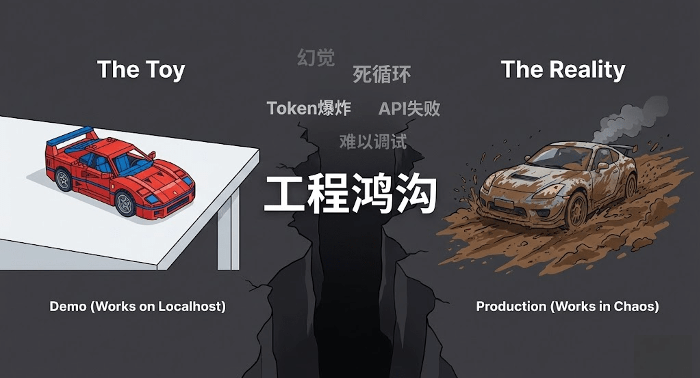
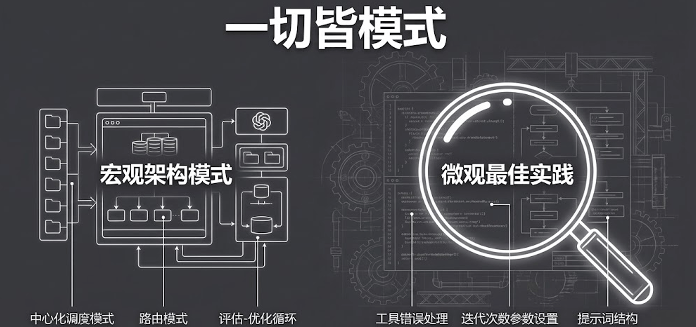
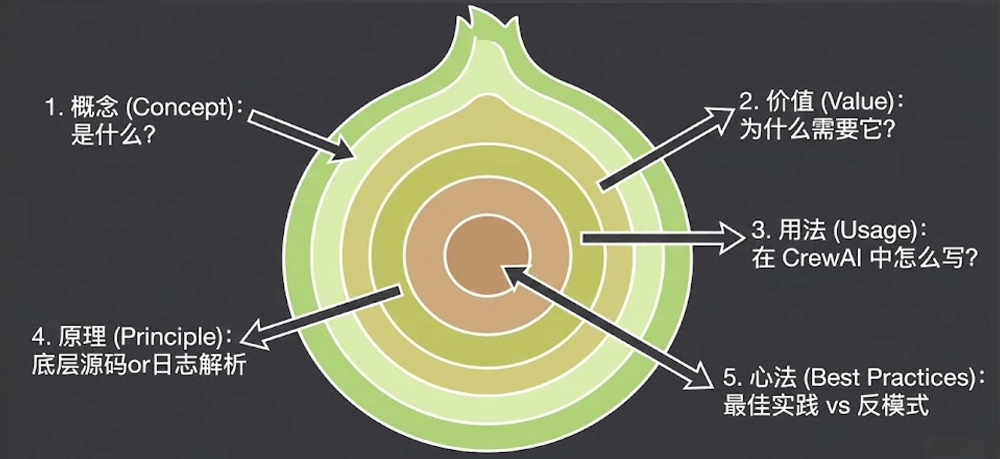
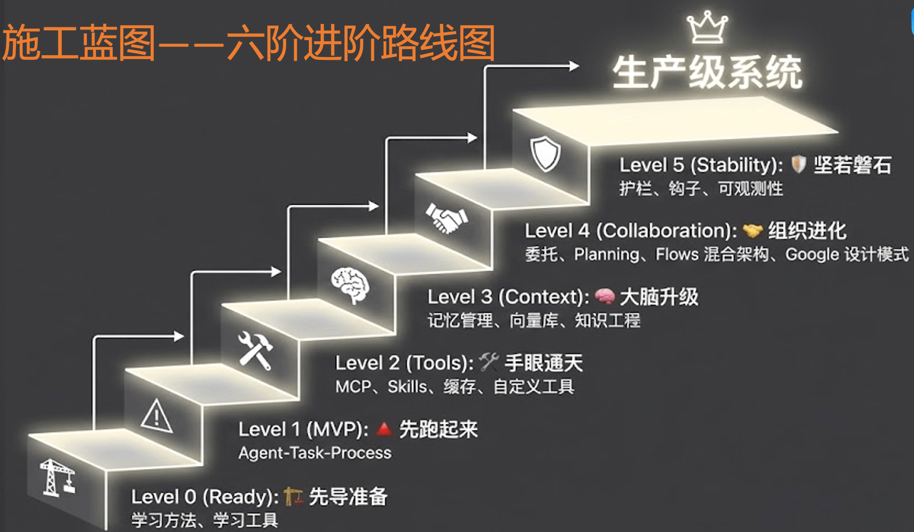
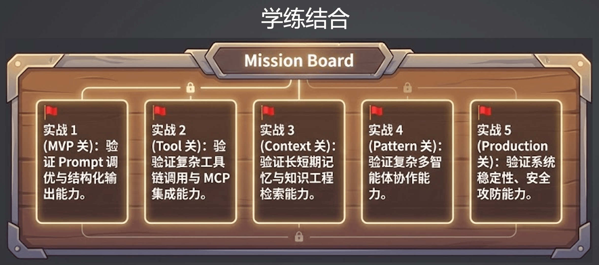

# 05｜工程全景图：构建企业级多智能体系统的“施工蓝图”

> 来源：极客时间《企业级多智能体设计实战》
> 当前播放：05｜工程全景图：构建企业级多智能体系统的“施工蓝图”
> 提取日期：2026-06-02
> 原文长度：4279 字

---

欢迎回来！在前面的四节课中，我们主要停留在“架构思维篇”，带领大家理清了四种核心范式以及选型决策模型。 那么从这第五节课开始，我们将正式跨入“工程篇”的大门，进入到极其硬核的实战落地环节。

在真正开始写代码之前，我们需要先完成一项极其重要的准备工作：**画好施工蓝图**。

## 一、 告别“野路子”：从玩具 Demo 到企业级生产

很多开发者在刚接触大模型应用时，通常会看几个网上的开源教程，用几行代码跑通一个 Demo。 在命令行里看到模型成功回复了一段话，就觉得非常有成就感。

但是，当你试图把这个 Demo 搬到真实的业务系统和企业生产环境中时，你会立刻遭遇无数“毒打”：

- 稳定性极差：大模型经常产生幻觉，或者格式输出错误导致代码崩溃。
- 上下文失控：多轮对话或工具调用后，上下文长度爆炸，模型开始胡言乱语。
- 不可观测与难以排查：一旦线上出错，由于整个系统是个黑盒，你根本不知道是哪一步的 Prompt 写坏了，还是哪个 Tool 返回了异常数据。

这些痛点的根源在于：**我们用做玩具的思维，去盖企业级的大楼。** 要想跨越这条鸿沟，我们就必须告别“野路子”，建立起“正规军”的工程化体系。

## 二、 穿透技术本质：“五步认知法”

在接下来的工程篇中，我们会接触到大量且高频迭代的 AI 概念（比如 Memory、Skill、RAG、Guardrails 等）。 其实这些的**一切都是设计模式**。从宏观的角度，会有 AI 应用的架构模式，而具体到每个技术点的设计，也会有很多微观的最佳实践。

为了避免大家迷失在技术的海洋里，我将采用一套名为“**五步认知法**”的教学框架，带领大家深度拆解每一个核心能力：

- 1. What（它是什么）：用最通俗的语言，讲清这个技术概念的本质定义。
- 2. Why（为什么需要它）：它究竟解决了什么具体的业务痛点？ 如果没有它，系统会怎样？
- 3. How（怎么用）：结合实际代码，演示如何在框架中调用和实现这个功能。
- 4. Under the Hood（底层原理）：撕开外衣，深入源码或底层协议，看看它在通信和数据流转上到底是怎么工作的。
- 5. Best Practices & Anti-Patterns（最佳实践与反模式）：结合一线实战经验，告诉你哪些坑绝对不能踩，哪些是能大幅提升稳定性的高级技巧。

只要掌握了这套方法论，未来无论涌现出什么新的 AI 框架或概念，你都能迅速将其解构并纳入自己的知识体系。

## 三、 企业级 Multi-Agent 系统的“施工蓝图”

那么，一个真正能上线的企业级多智能体系统，到底长什么样？ 我把它拆解为从下至上的六阶进阶路线图：

### Level 0 (Ready): 先导准备 —— 思想与工具的双重武装

**核心关键词：学习方法、学习工具**

千里之行，始于足下。我们的第一步是做好全面的先导准备：

- 思想准备：明确接下来的学习方向。大家在听课时，需要带着具体的问题和明确的目标去学习，做到有的放矢。
- 工具准备：工欲善其事，必先利其器。我们会在这一步搭建一套稳定、能立刻跑起代码来的本地环境。这套环境相对独立便捷，甚至不需要强依赖外网访问就能顺利运行。只有把环境这块基石打好，后续的实操才能畅通无阻。

### Level 1 (MVP): 先跑起来 —— 核心跑通，告别“玩具”

**核心关键词：Agent - Task - Process**

准备就绪后，我们将迎来真正的第一步：跑通 MVP（最小可行性产品）。

- 重塑认知：这不是一个简单的 POC 或跑个 Demo 而已。我会带大家重新深度学习多智能体的核心概念。
- 死磕细节：不再是走马观花，我们会深入细节，带着大家去看底层的运行日志。
- 真正落地：在这个阶段，我们暂时不引入特别复杂的工具和庞大的知识库，但构建出来的系统一定是一个实际可落地、可以直接扔到线上跑的系统。这是本模块要求大家达成的第一个重要里程碑。

### Level 2 (Tools): 手眼通天 —— 赋予智能体行动能力

**核心关键词：MCP、Skills、缓存、自定义工具**

当核心骨架跑通后，我们需要给 Agent 装上“手”和“眼”，让它们拥有与外部世界交互的能力。

- 工具的深度应用：详细讲解各类工具的调用，包括 CrewAI 等框架自带的工具、MCP（模型上下文协议）以及各种 Skills。
- 性能与扩展：学习如何使用缓存（Cache）机制提升效率，以及如何根据业务需求编写自定义工具。
- 最佳实践：在这一模块，我会倾囊相授编写工具时的工程化最佳实践，让你的代码既优雅又实用。

### Level 3 (Context): 大脑升级 —— 工程化提升模型智商

**核心关键词：记忆管理、向量库、知识工程**

我一直以来的理念是：**构建优秀的 Agent 系统不能过度依赖底层大模型的能力**。模型虽然在进化，但利用工程化的方法将复杂工作拆解，让系统输出更加确定、可靠，这才是我们作为开发者的核心价值所在。

- 上下文（Context）进阶：通过工程化手段为 Agent 的大脑进行升级。
- 记忆与知识：运用记忆管理机制来精准控制上下文，结合向量库和知识工程沉淀专业领域数据。
- 变得更聪明：这些技术手段将极大提升 Agent 处理复杂问题的能力，让模型能给出远超预期的优秀答案。

### Level 4 (Collaboration): 组织进化 —— 面向组织的协作架构

**核心关键词：委托、Planning、Flows 混合架构、Google 设计模式**

这是极其关键的“分水岭”阶段。在这里，我们的架构思维将**从“面向过程”升级为“面向组织”**的设计。

- 协作机制：深入学习 Agent 之间的委托（Delegation）机制、规划（Planning）能力以及更复杂的 Flows 混合架构。
- 前沿设计模式：为了给大家呈现最前沿的内容，我特意修改了原有大纲，将 Google 最新发布的 Multi-Agent 设计模式揉进了课程中。
- 终极目标：彻底弄透 Agent 之间到底有哪些高效的协作方式，并将其完美应用到复杂的业务流中。

### Level 5 (Stability): 坚若磐石 —— 迈向真正的生产级

**核心关键词：护栏、钩子、可观测性**

当你的复杂多智能体系统跑起来之后，挑战才刚刚开始。要让它真正在线上平稳运行，还需要解决最后一道防线：稳定性瓶颈。

- 安全与规范：建立“护栏（Guardrails）”防止模型输出违规或越界内容；设置“钩子（Hooks）”精准介入系统运行周期。
- 透明可控：全面建设系统的“可观测性”，让内部所有的调用、耗时和状态都一目了然。
- 大功告成：只有当这些维稳基建全部建设完毕，我们才算真正完成了一个坚若磐石的生产级应用的交付。

这六个阶段环环相扣，从底层的环境搭建，到代码落地，再到工具扩展、大脑升级、协作架构，最终实现生产级维稳。顺着这套蓝图，我们将一步步把 Multi-Agent 技术的巨大潜力，实实在在地转化为企业级的生产力。

## 四、实战演练 - 能力验证的“试金石”

光听不练假把式。这五个实战关卡与我们之前的“六阶进阶路线图”紧密对应。我们将采用“闯关”的形式，带大家把每一层级的理论知识转化为真正能在企业级生产环境中落地的能力。

### 实战 1 (MVP 关)

**核心目标：验证 Prompt 调优与结构化输出能力。**

- 实战解析：这是我们检验基本功的第一关。在这一阶段，我们刻意不使用太多复杂的外部工具。你需要纯粹依靠对 Prompt 的深度打磨，以及基础的 Multi-Agent（多智能体）结构设计，来完成一个能产生实际业务效果的闭环系统。先跑起来，把基础夯实。

### 实战 2 (Tool 关)

**核心目标：验证复杂工具链调用与 MCP 集成能力。**

- 实战解析：顺利通关 MVP 后，我们要给智能体装上“手眼”。这一关是纯粹的“工具硬仗”。你需要熟练掌握如何调用和编排复杂的工具链，不仅要能无缝接入开源生态中的现成工具，还要能够根据实际业务需求，自行设计并实现复杂的自定义工具。

### 实战 3 (Context 关)

**核心目标：验证长短期记忆与知识工程检索能力。**

- 实战解析：这一关的重点是给智能体进行“大脑升级”。面对复杂的业务，模型不能像个失忆症患者。我们将实操如何把长短期记忆机制、知识工程以及各类向量数据库（Vector DB）真正融合到系统中，让你的 Agent 能够基于丰富的上下文去攻克复杂难题。

### 实战 4 (Pattern 关)

**核心目标：验证复杂多智能体协作能力。**

- 实战解析：单兵作战能力再强也有极限，这一关考验的是“组织战斗力”。面对拆解后的复杂庞大任务，你将实操验证不同的多智能体协作模式（Patterns）。通过设计合理的协作流和委托机制，让多个智能体打出完美的配合，把任务执行效果推向极致。

### 实战 5 (Production 关)

**核心目标：验证系统稳定性、安全攻防能力。**

- 实战解析：这是我们的最终大考。真正的线上生产环境往往充满了各种不确定性和突发状况（如网络波动、接口限流、恶意输入等）。最后一关的实战，要求你能为系统加上各种护栏和监控，构建出一个坚若磐石的系统，确保它能在极其不稳定的环境下依然安全、稳定地运行。

这五大实战关卡是一套完整的练兵场，从单点突破到全局统筹，再到最后的维稳攻防。只要一步步打通这五关，你就能真正掌握构建复杂 AI 智能体应用的核心实战能力。

## 五、 课程总结与预告

今天，我们一起绘制了构建企业级 Multi-Agent 系统的全景施工蓝图。

- 明确了从 Demo 到生产级系统的鸿沟与痛点。
- 确定了采用“What-Why-How- 原理 - 最佳实践”的五步认知法来进行后续的技术学习。
- 全览了包括“原子能力”、“Agent 协作”和“工程化保障”在内的三大架构层级。

**在下一节课中，我们将正式开启代码实战！** 我会手把手带大家搭建 Python 开发环境、配置所需的大模型 API，并初探主流的 Agent 开发框架，为接下来的造楼工程打好坚实的地基。

## 课后思考题

对照今天这份“施工蓝图”，回顾一下你目前所在的项目，或者你最感兴趣的那个 AI 业务场景：**你觉得目前最缺失、也是最亟需补足的是蓝图中的哪一块能力？** 是底层的知识管理（RAG）？ 是高效的 Agent 协作？ 还是外围的安全与评测体系？

欢迎在评论区留言交流，我们下一讲见！
---

来源：极客时间《企业级多智能体设计实战》
提取日期：2026-06-02
