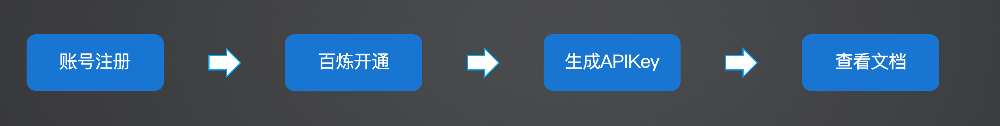
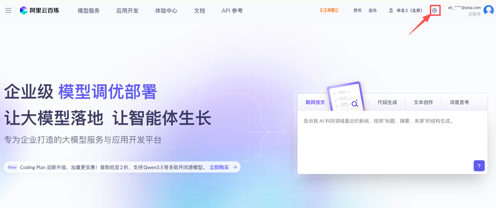
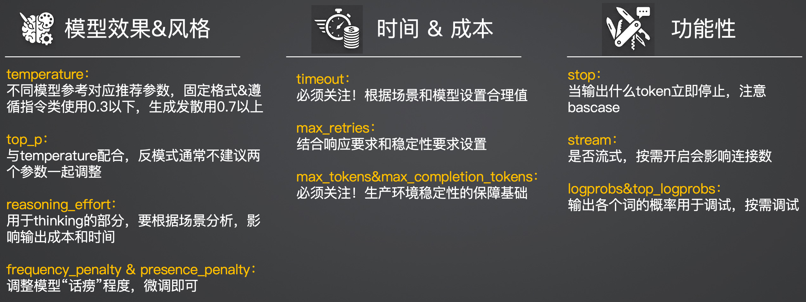

# 06｜工欲善其器：课程学习的基础代码环境准备

> 来源：极客时间《企业级多智能体设计实战》
> 当前播放：06｜工欲善其器：课程学习的基础代码环境准备
> 提取日期：2026-06-02
> 原文长度：5175 字

---

大家好，我是晓寒。

今天开始我们第六课的学习。上一课在工程篇先导课中，我们主要从思想与宏观蓝图层面做好了构建企业级系统的准备，而今天这节课将回归到最基础的代码与工具层面。 俗话说“工欲善其事，必先利其器”，在正式动手敲代码开发复杂的 Multi-Agent 系统前，我们需要先把必要的基础开发环境和 API 配置搭建妥当。

需要说明的是，这节课的内容相对基础，偏向于面向新手的环境扫盲与配置指引。 如果你的工程实践基础已经很扎实，且对于大模型 API 的各种底层参数调优烂熟于心，可以直接快速浏览或跳过本节内容。

---

## 一、 基础代码环境清单

在开始之前，请确保你的本地计算机或开发服务器已经具备了以下基础运行环境：

- Python 环境配置：本课程的示例代码依赖于 Python 环境，请大家自行学习并完成安装，强烈要求 Python 版本在 3.10 及以上。
- 核心框架更新：我们将大量使用 CrewAI 框架作为工程落地的载体。 由于当前 AI 应用框架处于高速发展期，CrewAI 的迭代速度极快，版本之间可能存在破坏性更新，因此建议大家在安装时尽量拉取并使用最新版本。

本节课的核心准备工作将围绕以下四个清单展开：

1. 阿里云模型 API 申请
2. 在 CrewAI 中进行 OpenAI 风格的模型使用
3. 在 CrewAI 中进行自定义模型 API 的使用
4. LLM 参数的最佳实践和反模式

---

## 二、 阿里云模型 API 申请流程

为了确保所有同学都能顺畅地跟随课程进行实践，免受网络环境不佳或跨国访问受限的困扰，我们的课程实操将优先使用国内更容易访问且表现优异的大模型 API，而非依赖 OpenAI 或 Google 等海外服务（关于 Google Search 等搜索工具的配置，我们会在后续的工具专项课中单独讲解）。

在此，我们推荐大家使用阿里云提供的模型服务，你可以在其平台上灵活调用通义千问（Qwen）或者是深度求索（DeepSeek）等主流大模型。 具体的申请与开通步骤如下：



1. 访问控制台：使用浏览器打开阿里云百炼平台的官方控制台，地址为：https://bailian.console.aliyun.com/。
2. 账号注册：如果没有阿里云账号，请先按照指引完成账号的注册与实名认证。
3. 百炼开通：在控制台中找到“百炼大模型服务平台”并确认开通服务。
4. 生成 API Key：进入密钥管理页面，生成一串属于你的专属 API Key，请妥善保管这串密钥，它是后续代码调用大模型大脑的唯一凭证。



5. **查看文档**：建议简单浏览平台提供的接入文档，熟悉基础的调用规范与计费规则。

---

## 三、 在 CrewAI 中高效接入大模型

拿到大模型 API 只是第一步，如何将其顺滑地接入到多智能体编排框架中才是关键。 针对不同的企业实际情况，我们需要掌握两种接入范式：

### 1. OpenAI 风格 API 接口的模型使用

目前市面上绝大多数的主流大模型（包括前文提到的阿里云系列模型），为了降低开发者的迁移成本，都提供了完全兼容 OpenAI 接口规范的调用形式。 在 CrewAI 框架中，接入这类标准化接口是非常开箱即用的。 你只需要配置好相应的 Base URL 和 API Key，即可将其作为底层 LLM 挂载到你的 Agent 上。

- 配置指引与示例代码：可参阅官方文档 https://docs.crewai.com/en/concepts/llms。

代码示例：

```plain
# ==============================================================================
# LLM 配置示例
# ==============================================================================
# 使用 CrewAI 的 LLM 类配置 OpenAI 兼容接口
# 适用于：DeepSeek、Kimi、OpenAI 等支持 OpenAI 格式的 API
 
llm = LLM(
    model="qwen-turbo",
    api_key=os.getenv("OPENAI_API_KEY"),
    base_url=os.getenv("OPENAI_API_BASE"),  # API 基础地址
)
 
# ==============================================================================
# LLM 直接调用示例
# ==============================================================================
# 演示如何直接调用 LLM，不通过 Agent
 
prompt = "What is the capital of France?"
response = llm.call([{"role": "user", "content": prompt}])
print(response)
 
 
# ==============================================================================
# Agent 使用 LLM 示例
# ==============================================================================
# 演示如何将配置好的 LLM 传递给 Agent
 
agent = Agent(
    role="Assistant",
    goal="Answer the question",
    backstory="You are a helpful assistant that can answer questions.",
    llm=llm,
    verbose=True,
)
 
task = Task(
    description="Answer the question",
    expected_output="The capital of France is Paris.",
    agent=agent,
)
 
result = agent.execute_task(task)
print(result)
 
```

### 2. 自定义 API 接口的模型使用

真实的工业生产往往伴随着严格的安全红线。 很多在企业内网开发同学，由于数据合规等原因，无法直接访问公网 API，必须接入公司私有化部署的大模型；或者某些内部模型的接口字段并非标准的 OpenAI 格式。

针对这一痛点，CrewAI 提供了底层的类继承方案。你可以通过继承 `BaseLLM` 抽象类，并重写其中的核心方法，来封装出一个适配公司内网的 `MyCustomLLM` 对象。

- 开发文档地址：https://docs.crewai.com/en/learn/custom-llm。

代码示例：[https://github.com/kid0317/crewai_mas_demo/blob/main/llm/aliyun_llm.py](https://github.com/kid0317/crewai_mas_demo/blob/main/llm/aliyun_llm.py)

(小 tips：下载对应的模型 api 文档，可以让 claude code 帮你写，别忘了写单测啊)

---

## 四、 核心重头戏：LLM 参数配置最佳实践与反模式

很多开发者在调用大模型时，往往只是填入一个 API Key 就直接启动运行，完全忽略了模型底层参数的调优。 在构建稳定、可靠的企业级 Agent 系统时，不合理的参数配置不仅会导致系统频发幻觉，还会引发严重的线上性能灾难。

我们将这些控制大模型命运的参数分为三大维度进行深度拆解：**模型效果 & 风格**、**时间 & 成本**、以及**功能性**约束。



### 维度一：模型效果 & 风格

这类参数直接决定了 Agent 输出文本的逻辑性、创意度以及格式的严谨程度。

- temperature(温度值)：这是控制模型输出随机性最核心的参数。
- 最佳实践：如果你的 Agent 正在执行需要严格遵循系统指令、输出固定格式 JSON、或者进行严谨数据抽取的任务，强烈建议将其设置为 0.3 以下，以扼杀模型的想象力，保证确定性；如果 Agent 是在充当“创意文案专家”进行头脑风暴或发散创作，建议设置为 0.7 以上以激发灵感。 请注意，不同基座模型的最佳设定区间可能有细微差异，实装前务必参考对应厂商的推荐参数。
- top_p：同样用于控制生成文本的多样性，通常与 temperature 配合在宏观上调节生成策略。
- 🚨 反模式警告：极其不建议在同一次调用中，同时大幅度修改 temperature 和 top_p 两个参数。 双重变量的叠加会导致模型行为难以控制与溯源分析。
- frequency_penalty & presence_penalty：这两个惩罚系数主要用于调节模型回复的“话痨”程度，抑制其在同一段文本中反复使用相同词汇或句式的倾向。
- 最佳实践：在大多数场景中保持默认或仅做极小幅度的微调即可。

### 维度二：时间 & 成本

这些参数直接关乎你企业系统的 SLA（服务级别协议）以及每个月的 API 账单流水。

- reasoning_effort：这是专门针对具备深度思考能力（如内置 Thinking 过程的推理模型）而设置的参数。 它决定了模型在给出最终答案前，花费多少算力去推演逻辑。 这个设置会直接、显著地影响单次输出的 Token 成本和响应时间，必须结合具体业务场景的难易程度进行慎重分析后设定。
- timeout(超时时间)：生产环境必须重点关注的生命线参数！
- 最佳实践：不要让请求无限期挂起。你需要根据具体的应用场景（如实时客服 vs 异步跑批数据分析）和底层模型的常规响应时间，设定一个合理的超时阈值，强制截断过长无响应的死连接。
- max_retries(最大重试次数)：处理网络抖动或 API 限流的保护机制。 设置时需在业务的快速响应要求（Fail-fast）与系统整体运行的稳定性要求之间寻找平衡点。
- max_tokens(最大输出长度)：这个参数代表你对模型单次回复长度的预期上限。
- 🚨 反模式警告 1：设置过短。如果你在开发一个长篇行业报告生成的 Agent，却将该值设置得太短，大模型的推理会被暴力切断，导致生成的报告永远只有“半截子”，严重损害业务功能。
- 🚨 反模式警告 2：设置过长或不设限。这在生产环境中是极其危险的行为。 特别是当调用一些参数规模较小的模型时，它们偶尔会陷入逻辑死循环，疯狂重复同一句话。 如果没有 max_tokens 的拦截，它会一直重复直到耗尽上下文极值。 这不仅会白白烧掉大量的 API 费用，还会将原本只需 5 秒即可返回的请求，硬生生拖延成 600 秒的“长尾请求”。 这种极端长尾现象一旦规模化爆发，会瞬间占满服务器的网络连接和队列资源，拖垮整个 AI 链路。
- 最佳实践：深入评估你的业务场景，预估回复文本的合理极限，“需要多长就配多长，差不多就行”，坚决杜绝无限长的暴力配置。

### 维度三：功能性约束

- stop(停止标识符)：这是一个关键的硬阻断参数。当模型在流式输出中生成到你配置的特定字符串序列（例如 \nObservation:）时，底层接口会立刻强制中止后续生成，并将当前内容返回给框架层。 这一机制我们在解析 ReAct 范式时曾详细探讨过，它是保障 Agent 思考流转不脱轨的核心工程手段。
- 🚨 反模式警告：如果你设置的 stop 词汇是一个在日常交流中极其高频出现的普通词汇，或者因为你的 Prompt 设计不严谨导致模型在错误的地方输出了该词汇，就会造成模型在根本不该停止的半截突然停下。 这种意外截断会导致你的代码框架无法解析出合规的 Action 或 JSON 参数，致使整个智能体任务宣告失败。

今天，我们一起做好了基础环境的准备，那么接下来，就会正式进入高强度的工程篇的课程学习。首先是跑通 MVP，我们会从最基础的 Agent 开始讲起，期待下次和大家见面。
---

来源：极客时间《企业级多智能体设计实战》
提取日期：2026-06-02
