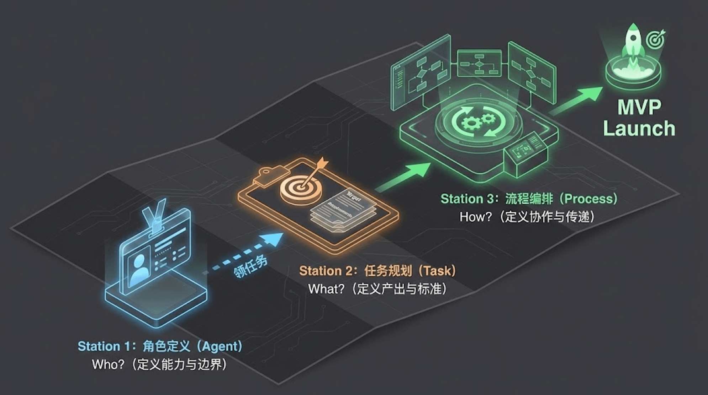
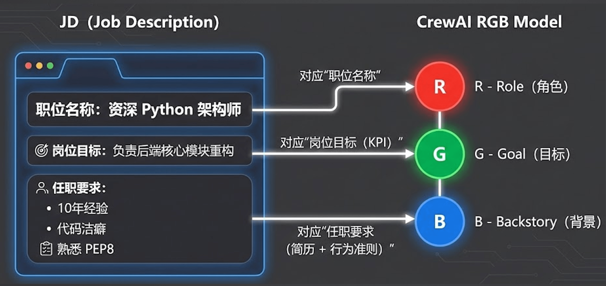
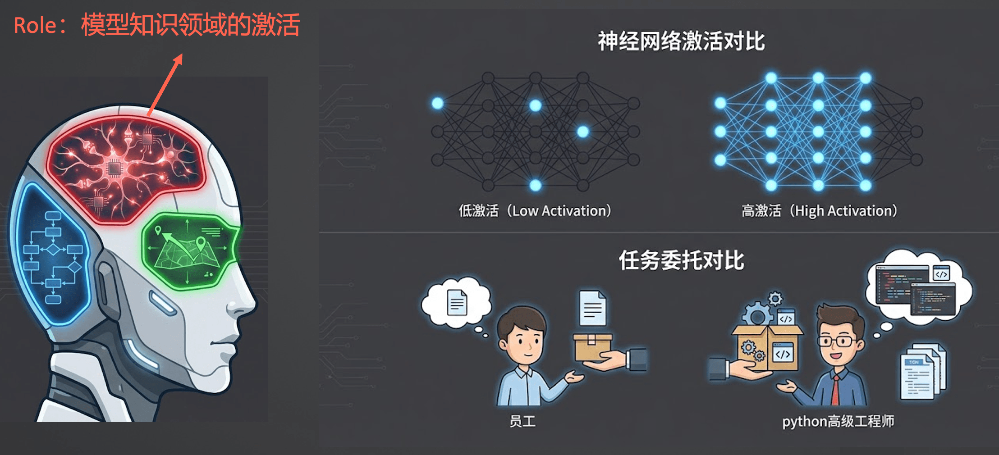
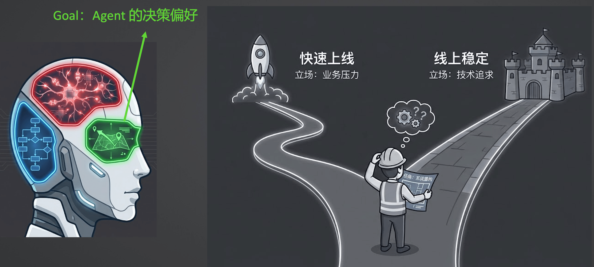
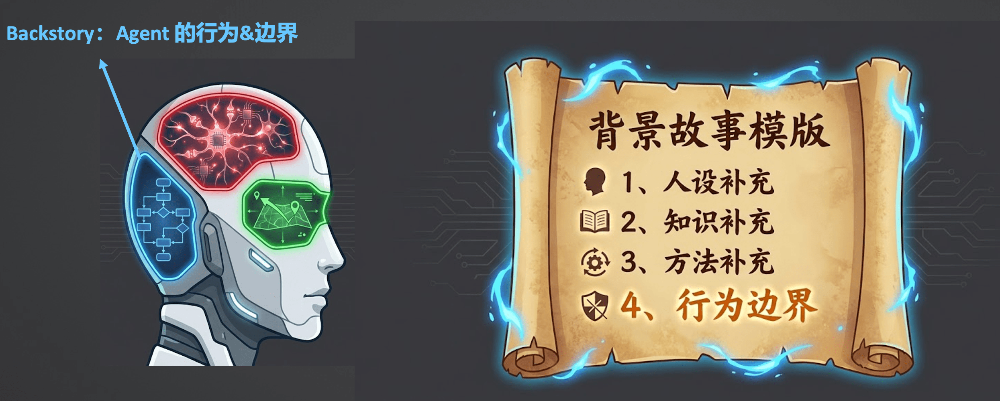

# 07｜定义Agent：从“提示词工程”到“人设工程”

> 来源：极客时间《企业级多智能体设计实战》
> 当前播放：07｜定义Agent：从“提示词工程”到“人设工程”
> 提取日期：2026-06-02
> 原文长度：4009 字

---

欢迎回来！从今天这节课开始，我们将正式进入工程篇的第一个核心模块：**运行你的第一个企业级 Multi-Agent**。在前面的课程中，我们完成了思想上和工具上的准备，现在是时候让这些理论落地了。

在构建 Multi-Agent 系统时，我们需要完成一次思维视角的转换：**从传统的“面向过程的程序员”转变为“面向组织的团队经理”**。设计一个多智能体应用，不再是死磕“第一步干嘛、第二步干嘛”，而是思考如何组建一个高效协作的团队。

从零启动你的 MVP（最小可行性产品）团队，核心就是三个关键步骤：**定人 -> 定事 -> 定流程**。



本节课，我们首先聚焦第一步：**定人（定义 Agent）**。我们将探讨如何从传统的“提示词工程”进阶到“人设工程”。

---

## 一、 招聘启事：属于 Agent 独有的色彩（RGB 模型）

定义一个 Agent，本质上就像是为你的数字员工撰写一份精准的“招聘启事”。在主流的多智能体框架中，构建一个标准化 Agent 的核心属性可以高度概括为 **RGB 模型**：Role（角色）、Goal（目标）和 Backstory（背景故事）。



### 1. Role（角色）：模型知识领域的激活



- 核心价值：大模型拥有海量的通用知识，而设定 Role 的本质是唤醒并锁定其在特定垂直领域的专业认知。
- 作用机制：当你赋予 Agent 一个极其明确的角色定位（例如“小红书爆款笔记内容策略专家”）时，模型在后续推理和生成内容时，会自发地调取与该角色匹配的专业词汇、分析框架和行业黑话。

### 2. Goal（目标）：Agent 的决策偏好



- 核心价值：Goal 决定了 Agent 在面临选择时的价值导向。
- 作用机制：它不同于具体的待办事项，而是一种宏观的偏好设定。它告诉 Agent：“在执行任何任务时，你应该以什么标准来衡量好坏？”这是指导 Agent 行动的罗盘。

### 3. Backstory（背景故事）：Agent 的行为与边界



- 核心价值：设定 Agent 的处事风格、工作流心法以及能力边界。
- 作用机制：在 Backstory 中，我们不写具体的执行步骤，而是告诉 Agent 面对不同情况时应该采取的思考模式和原则（即“心法”）。这能有效划定 Agent 的权责边界，防止它在协作时“越俎代庖”。

---

## 二、代码实战，定义一个标准的 Agent

我们直接来看代码吧：[https://github.com/kid0317/crewai_mas_demo/blob/main/m2l3/m2l3_agent.py](https://github.com/kid0317/crewai_mas_demo/blob/main/m2l3/m2l3_agent.py)

```plain
# ==============================================================================
# Agent 定义
# ==============================================================================
 
content_strategist = Agent(
    role='资深小红书增长策略专家',
    goal='基于 CES 互动评分算法，为产品制定一套能穿透"L1 冷启动池"并具有长尾搜索价值的内容策略。',
    backstory="""
    你曾是国内顶级 MCN 机构的内容总监，深谙小红书 2025 年的算法变迁。
    你不再相信简单的流量铺张，而是坚信"价值耕耘"和"KFS 闭环"。
    
    ** 核心理论储备 **：
    - CES 评分机制：关注 (8 分) > 评论 (4 分) > 收藏 (1 分) > 点赞 (1 分)，优先考虑"如何骗评论"和"如何骗收藏"
    - 反漏斗模型 (Anti-Funnel)：坚持"窄即是宽"，先锁定最精准的核心人群，再寻求破圈
    - 语义工程 SOP：爆款标题公式【痛点场景】+【解决方案 / 情绪钩子】+【群体标签】
    
    ** 思维心法 **：
    1. 反漏斗定位：找到产品最"痛"的细分场景（例如：不是"喝水"，而是"独处时的精神避难所"）
    2. 设计钩子：互动钩子（引发争议或共鸣的问题）+ 价值锚点（干货点诱导收藏）
    3. 关键词布局：指定 3 个核心长尾词，为搜索流量复活做准备
    4. 分步骤慢思考：使用 IntermediateTool 工具保存中间结果
    
    ** 行为边界 **：只负责输出策略大纲（Brief），绝对不要撰写最终的正文或示例文案。
    ** 语言要求 **：所有思考过程、工具调用和最终输出都必须使用中文。
    """,
    verbose=True,
    allow_delegation=False,
    tools=[IntermediateTool()],
    llm=AliyunLLM(
        model="qwen-plus",
        api_key=os.getenv("QWEN_API_KEY"),
        region="cn",
    ),
)
 
 
# ==============================================================================
# 执行任务
# ==============================================================================
 
messages = [
    {
        "role": "user",
        "content": "我今天健身了，感觉很累，但是很开心。帮我设计一篇笔记"
    }
]
 
# 使用 Agent.kickoff() 直接执行任务
result = content_strategist.kickoff(messages)
 
# 打印结果
print(result)
 
 
```

可以看到，结构化的定义 agent 的 RGB，能够很好的让 Agent 完成任务。

---

## 

## 三、 深入框架：一切的底层还是提示词 Prompt

虽然我们在工程代码层面抽象出了 Role、Goal 和 Backstory 这些优雅的属性，但穿透框架的表层，**底层的通信语言依然是提示词（Prompt）**。

```plain
You are {role}. {backstory}
Your personal goal is: {goal}
```

在实际编写代码时，例如我们定义一个“资深小红书增长策略专家”，我们会通过框架提供的类和属性进行配置。框架在运行时，会在底层将这些属性巧妙地拼接、组合成一段结构化的 System Prompt 发送给大模型。理解这一点，有助于我们在后续排查 Agent “不听话”或发生幻觉时，能够精准定位是哪个设定的提示词权重引发了冲突。

---

## 四、 避坑指南：最佳实践与反模式

在实际落地中，错误的人设工程会导致 Agent 协作混乱甚至死循环。以下是经过实战检验的反模式和最佳实践总结：

### 🚫 严防死守的“反模式”

- Role 太宽泛
- 问题所在：设定类似“你是一个乐于助人的 AI 助手”这样宽泛的角色，无法有效激活模型深度的专业领域知识。同时，在 Multi-Agent 协作中，其他 Agent 将无法准确判断该把什么专业任务委托给它，严重破坏协同效率。
- Goal 的目标与 Task 冲突
- 问题所在：记住，Goal 是罗盘，Task 才是终点。如果把具体的格式要求（如“生成 Markdown 格式的具体文案”）写在 Goal 里，而 Task 又是让它“生成一个大纲”，大模型极其讨厌这种冲突。这会导致 Agent 在任务还没开始深度思考时，就急于去拼凑格式，从而使产出内容的深度和专业度大幅度下降。Goal 中应该写的是“做什么事能得到奖励的决策偏好”。
- Backstory 写死流程
- 问题所在：如果在 Backstory 里写死了类似“第一步干嘛、第二步干嘛”的具体流程，这会与 Task 中的要求产生严重冲突。这会导致你的 Agent 变成一个强耦合的一次性脚本，完全丧失了对不同任务的通用性和适应能力。
- 核心原则：Backstory 只存心法，不存招式。心法是指“当我遇到某种情况时，我的思考模式是怎样的”，而非机械的步骤。

### 💡 提升效率的“最佳实践”

- 运用“元提示词”技巧
- 方法论：不要纯靠人工去绞尽脑汁地编写大段的人设描述。你可以让大模型来帮你生成和优化 Prompt Engineering（PE）。
- 落地思路：你可以提供一些基础的业务材料或简单的诉求，让模型帮你总结并输出一套符合 RGB 规范的高质量元提示词，以此作为你定义 Agent 的起点，这将大幅提高开发效率。

---

## 课程总结

本节课我们聚焦于组建 MVP 团队的第一步：**定人（定义 Agent）**。我们深入探讨了 Agent 独有的 RGB 色彩（Role 激活知识、Goal 设定偏好、Backstory 划定边界），并剖析了在编写人设时最容易踩的坑。

招募好了优秀的数字员工，下一步就是要给他们派发明确的工作了。在下一节课中，我们将继续深入“定事”，详细讲解如何设计高质量的 **Task（任务）**，让你的 Agent 团队火力全开。我们下期见！
---

来源：极客时间《企业级多智能体设计实战》
提取日期：2026-06-02
