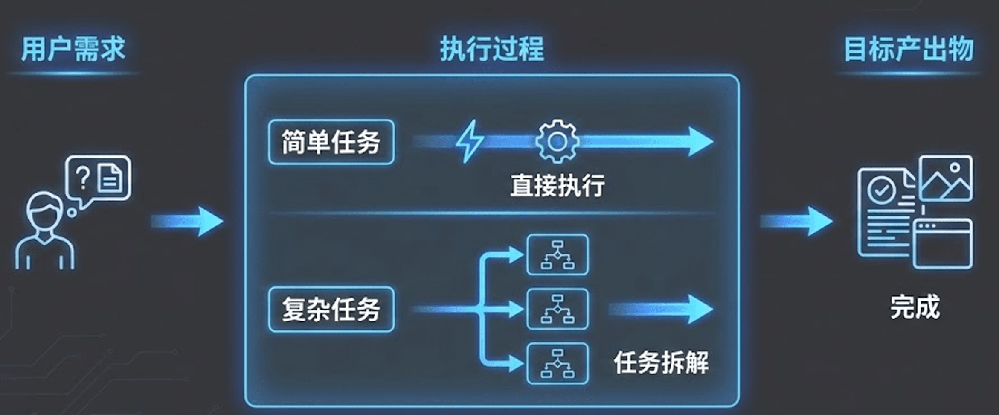
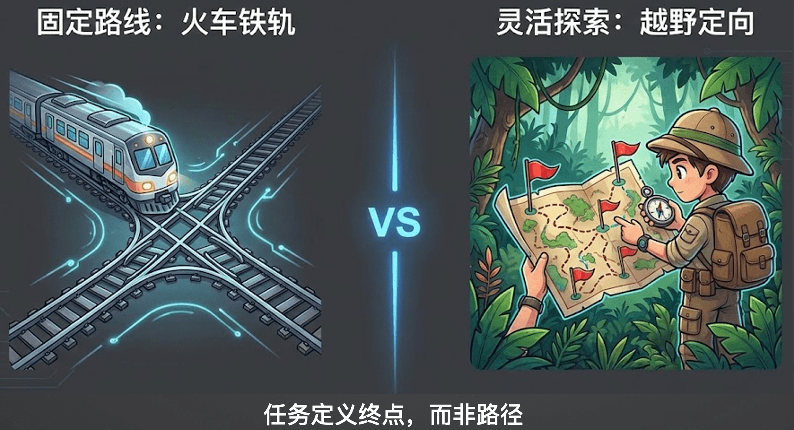
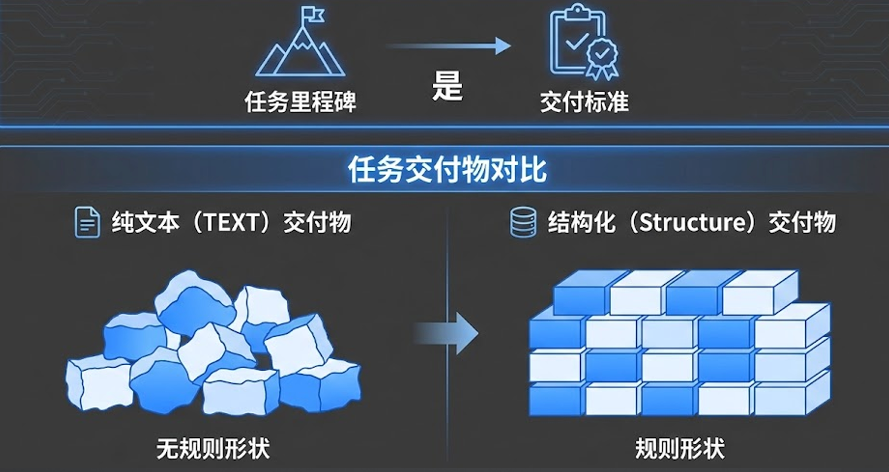

# 08｜定义Task——从“步骤控制”到“契约驱动”

> 来源：极客时间《企业级多智能体设计实战》
> 当前播放：08｜定义Task——从“步骤控制”到“契约驱动”
> 提取日期：2026-06-02
> 原文长度：6200 字

---

欢迎来到第八课！在上一节课中，我们详细讲解了如何定义 Agent（智能体），完成了“定人”的步骤。有了优秀的数字员工，接下来就需要给他们派发明确的工作了。这节课，我们将深入探讨多智能体协作的第二步：**定义 Task（任务）**。

## 一、 认知原点——一切 AI 应用皆为“Task”

我们需要建立一个基础认知：**一切的 AI 应用，本质上都是在执行任务**。



无论是传统的 Chatbot、智能客服，还是复杂的数据分析 Agent，其底层逻辑都包含以下三个核心环节：

1. 输入（Input）：用户的原始诉求或系统的定时触发事件。
2. 执行过程：Agent 思考、调用工具、交互协作的中间环节。
3. 输出（Output/ 交付物）：经过执行后，必须产出一个明确的结果。这个结果可能是一段对话回复、一份结构化的 Markdown 报告、一个 PPT 文件，或者是在业务系统中提交的一系列操作。

未来我们在做 AI 应用评测时，最核心的依据也就是对比这“输入”和“产出”是否匹配预期的标准。

## 二、 拆解心法——火车轨道 vs 里程碑

在定义任务时，开发者最容易陷入传统编程的惯性思维，这就引出了我们这节课的核心心法：**任务定义终点，而非路径**。



- 火车轨道（传统工作流）：像铺设铁轨一样，事无巨细地规定 Agent 第一步必须做什么、第二步必须怎么做。在面对充满不确定性的复杂场景时，一旦中途出现意外状况，“火车”就会彻底脱轨崩溃。
- 里程碑（最佳实践）：我们应该像设定里程碑一样去定义 Task。明确告诉 Agent 当前阶段需要交付什么成果，至于中间它怎么搜索、怎么调整策略，完全交由大模型自主决策。结构化的交付标准就是最好的里程碑。

## 三、 交付标准——结构是混乱世界中的确定性

既然任务是契约驱动的，我们就必须提供清晰的“验收标准”。



### 代码实战与底层逻辑剖析

在工程代码中，我们强烈推荐**使用 Pydantic 定义任务的目标输出结构**。

这不仅仅是为了让代码好看，它在底层发挥着极大的作用：

- 深入框架（提示词注入）：当你用 Pydantic 定义好数据结构和详细的 description（字段描述）后，框架在底层会将其转换为标准的 JSON Schema 格式，并硬编码注入到发送给大模型的 System Prompt 中。
- 结果提取与验证：模型在接收到这个明确的 Schema 后，会极大地倾向于按照你规定的 JSON 结构输出内容。框架随后会通过 JSON 提取器抓取结果，并用 Pydantic 反向校验数据格式是否合规，从而将不确定的自然语言文本转化为确定性的工程数据字典。

## 四、 代码实战：小红书的内容增长策略大纲任务

还是先看代码：[https://github.com/kid0317/crewai_mas_demo/blob/main/m2l4/m2l4_task.py](https://github.com/kid0317/crewai_mas_demo/blob/main/m2l4/m2l4_task.py)

我们先定义 Pydantic 对象，包括输入的：**意图分析报告**和输出的**爆款内容简报**

```plain
# ==============================================================================
# 数据模型定义（契约定义）
# ==============================================================================
# 使用 Pydantic BaseModel 定义数据结构，这是"契约驱动"的核心
# 这些模型定义了 Agent 输出的"契约"，确保输出格式符合预期
 
class ImageAnalysis(BaseModel):
    """单张图片的深度分析详情"""
    file_name: str = Field(..., description="图片文件名或 ID。")
    subject_description: str = Field(..., description="【主体内容】客观描述画面中的核心物体、人物或场景。")
    atmosphere_vibe: str = Field(..., description="【风格氛围】用形容词描述画面的情绪价值。")
    visual_details: List[str] = Field(..., description="【细节点列表】列出画面中容易被忽略但具象的元素。")
    image_quality_score: str = Field(..., description="【质量评价】1-10 分打分，基于构图、光线和清晰度给出打分的原因。")
    highlight_feature: str = Field(..., description="【突出特点】这张图最抓人眼球的一个视觉锚点（Visual Hook）。")
 
 
class VisualAnalysisReport(BaseModel):
    """视觉与意图分析报告 - 作为下游任务的输入上下文"""
    user_raw_intent: str = Field(..., description="用户的原始文字诉求摘要。")
    analyzed_images: List[ImageAnalysis] = Field(..., description="包含所有输入图片的详细分析列表。")
    overall_visual_summary: str = Field(..., description="综合所有图片得出的整体视觉基调总结。")
 
 
class ContentStrategyBrief(BaseModel):
    """爆款内容策划简报 - Strategist Agent 的交付物"""
    input_evaluation: str = Field(..., description="【素材评估】基于用户诉求和图片质量的综合评价，指出优势和劣势，并给出修图建议。")
    target_audience_persona: str = Field(..., description="【目标受众画像】采用反漏斗模型，定义最核心的细分人群（年龄段、职业标签、生活状态、心理诉求）。")
    core_pain_point: str = Field(..., description="【核心痛点 / 诉求】受众最想解决的问题或最渴望的情绪价值。")
    suggested_title: str = Field(..., description="【建议标题】遵循公式：'痛点场景 + 情绪 / 利益钩子 + 核心人群标签'，包含标点符号和 Emoji，20 字以内。")
    content_outline: List[str] = Field(..., description="【笔记大纲】笔记正文的结构安排（场景引入、沉浸式体验、干货植入、结尾强引导）。")
    engagement_strategy: str = Field(..., description="【点赞评论诱饵】设计具体的策略来引发评论互动。")
    retention_strategy: str = Field(..., description="【收藏诱饵】提供具体的实用价值让用户点击收藏。")
    seo_keywords: List[str] = Field(..., description="【关键词布局】基于 KFS 策略，列出 3 个必须埋入文案的长尾关键词。")
 
```

然后是任务的设置：

```plain
 
# ==============================================================================
# Task 定义：内容策划任务
# ==============================================================================
# 本 Task 展示了"契约驱动"的任务设计：
# 1. output_pydantic=ContentStrategyBrief：指定输出必须符合 ContentStrategyBrief 模型
# 2. context=[upstream_task]：指定任务依赖，可以访问上游任务的输出
# 3. description 中明确说明需要基于上游任务的输出进行分析
 
task_content_strategy = Task(
    description="""
    ** 任务要求 **：
    1. 仔细分析视觉报告中的用户意图、图片质量和整体风格
    2. 基于 CES 算法和反漏斗模型，制定精准的内容策略
    3. 策略要具体可执行，不能泛泛而谈
    4. 使用 IntermediateTool 工具保存中间思考过程
 
    视觉分析报告如下：
    {visual_report}
    
    ** 重要提示 **：
    - 必须基于上游任务的视觉分析报告进行分析
    - 上游任务输出包含：user_raw_intent、analyzed_images、overall_visual_summary
    - 策略要符合小红书平台的算法特点
    - 所有输出必须使用中文
    """,
    expected_output="一个完整的 ContentStrategyBrief 结构化输出，包含所有必填字段。",
    agent=content_strategist,
    output_pydantic=ContentStrategyBrief,
)
 
```

最终的执行如下：

```plain
# ==============================================================================
# 执行任务
# ==============================================================================
# Crew.kickoff() 会将 input 的变量替换到 prompt 中
# 这是"契约驱动"的体现：下游任务依赖上游任务的输出格式
 
crew = Crew(
    agents=[content_strategist],
    tasks=[task_content_strategy],
    process=Process.sequential,
    verbose=True,
)
result = crew.kickoff(inputs={"visual_report": visual_report.model_dump_json()})
 
```

## 五、底层实现分析 - 一切还是 prompt

根据日志可以看到：

```plain
{
    "role": "user",
    "content": "\nCurrent Task:{task.description}\n\nThis is the expected criteria for your final answer: {task.expected_output}\nyou MUST return the actual complete content as the final answer, not a summary.\nEnsure your final answer strictly adheres to the following OpenAPI schema: {ContentStrategyBrief.schema}\nDo not include the OpenAPI schema in the final output. Ensure the final output does not include any code block markers like ```json or ```python.\n\nBegin! This is VERY important to you, use the tools available and give your best Final Answer, your job depends on it!\n\nThought:"
}
 
```

所以其实底层框架是把 Pydantic 数据结构定义的 schema 拼成了 prompt 的一部分进行加载。

## 六、 最佳实践与反模式

在实际定义任务拆解时，千万要避开以下几个常见的坑：

### 🚫 反模式

1. 注意力涣散的超级任务：把多个关联性不大的子目标强行塞进同一个里程碑任务里（例如让它既负责搜索数据，又负责写核心代码，还要撰写前台文案）。这会导致 Agent 在执行时逻辑混乱、失去焦点，最终什么都做不好。
2. 不设明确的目标：如果你在 Task 里不给出清晰的验收标准，Agent 在执行 ReAct 循环时就会陷入迷茫，它可能永远不知道什么时候该输出 Final Answer，导致执行过程陷入死循环或效果完全不可控。
3. 流程步骤过度微操：强制规定过细的操作步骤。步骤越细，Agent 的泛化能力和通用性就越差。当它碰到事先未设想到的异常场景时，为了强行满足你设定的僵化步骤，它极容易产生严重的幻觉或生搬硬套。

### 💡 最佳实践

- 在 Pydantic 中同时明确结构和判断标准：不要仅仅在 Pydantic 中定义数据类型（如 str, int），一定要在字段描述里写清楚明确的质量标准。明确的交付要求能强行聚焦大模型的注意力，让模型在判断自身交付情况时更加精准，从而引导任务产出高质量的终态结果。

## 课程总结

本节课我们完成了 Multi-Agent 系统设计的第二步：**定事（Task）**。

- 我们认识到 AI 应用的实质就是完成任务，产出交付物。
- 面对复杂的业务场景，我们要摒弃僵化的“步骤控制（火车轨道）”，转而采用灵活的“契约驱动（里程碑）”来进行任务拆解。
- 结构化的交付标准（如使用 Pydantic）是我们掌控大模型输出确定性的最强武器。

下节课，我们将把“人（Agent）”和“事（Task）”结合起来，进入最后也是最复杂的一环：**定义 Process（组织任务的协作流程）**。我们下期见！
---

来源：极客时间《企业级多智能体设计实战》
提取日期：2026-06-02
