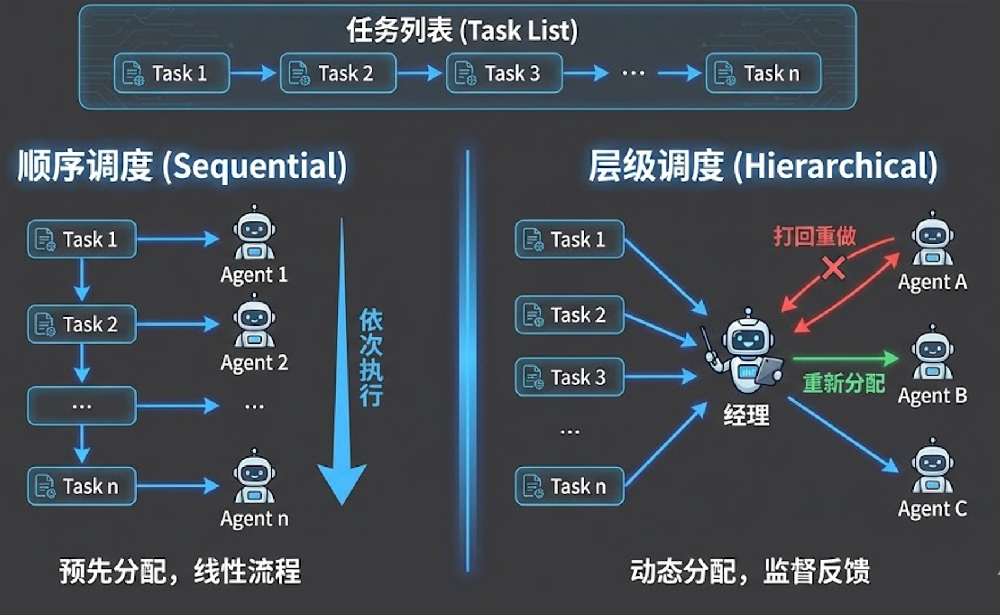
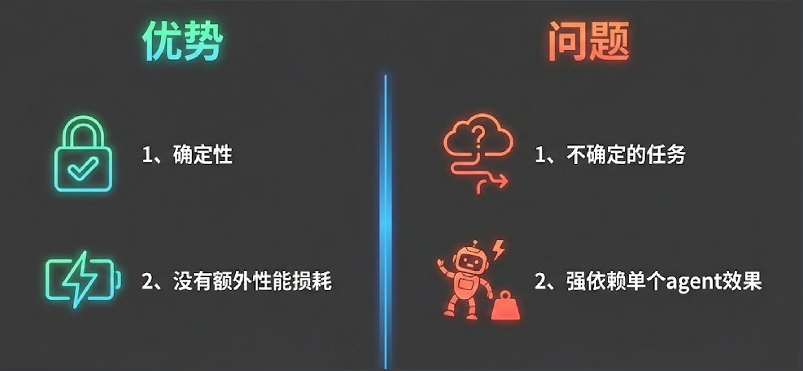
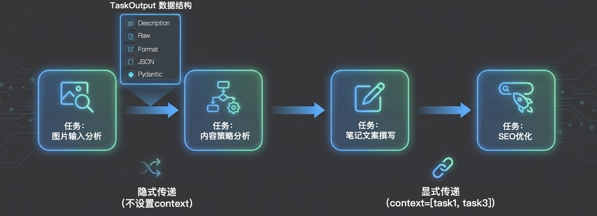
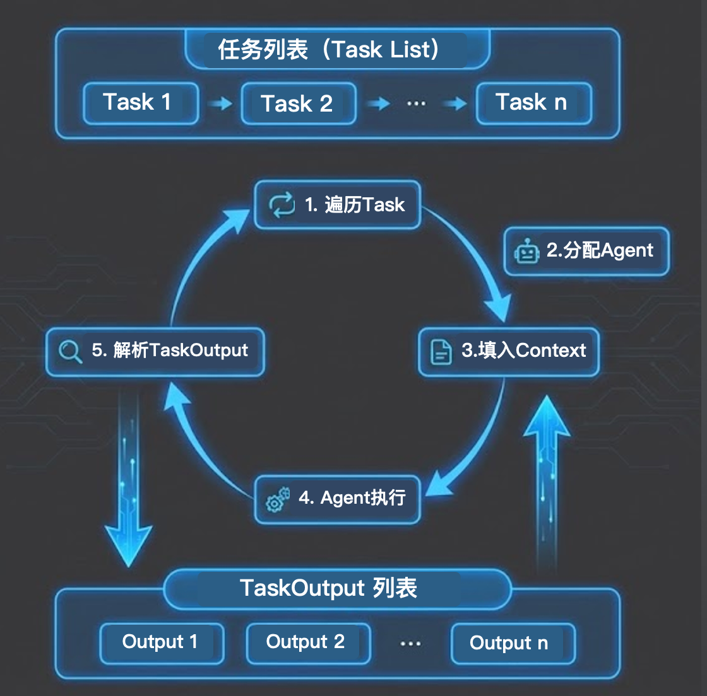

# 09｜定义 Process——任务调度与信息传递

> 来源：极客时间《企业级多智能体设计实战》
> 当前播放：09｜定义 Process——任务调度与信息传递
> 提取日期：2026-06-02
> 原文长度：5087 字

---

欢迎回来！在前面的两节课中，我们已经非常深入地探讨了多智能体系统中的两大核心基石：**Agent（智能体）** 和 **Task（任务）**。如果说 Agent 是我们招募的具备特定专业能力的“数字员工”，而 Task 是我们拆解出来的具体“里程碑目标”，那么今天，我们将补齐多智能体“三剑客”的最后一块拼图——**Process（流程）**。

只有通过科学、合理的流程编排，单打独斗的数字员工才能真正组合成一支高效运转、信息对齐的现代敏捷团队。本节课，我们将从底层认知出发，深度解剖 Process 的运行机制，并结合实战代码带你掌握企业级 AI 任务的流转心法。

---

## 一、 认知原点：Process 的本质到底是什么？

很多开发者在刚接触 AI 应用框架时，容易对 Process 产生误解，认为它只是一段连接代码。实际上，在多智能体架构（例如 CrewAI）的定义中，**Process（流程）的本质就是任务的调度方式（Task Scheduling）**。



我们在前面的课程中提到，面对一个复杂的业务诉求，架构师需要将其拆解为一个又一个的子任务（Task），并将它们按逻辑顺序放入一个任务列表（Task List）中。但是，这组任务启动后，应该以什么节奏执行？是由一个中心化的统筹者（Manager Agent）动态分发？还是按部就班地线性流转？这就完全由 Process 来决定。

理解了这一点，我们就把 AI 框架中那些看起来高深莫测的概念，还原成了传统软件工程中非常经典的“调度算法”问题。

---

## 二、 最简单实用的流程：顺序执行（Sequential）

在日常的企业级应用开发中，**顺序执行（Sequential Process）** 是最基础、最稳定，同时也是最实用的一种调度模式。

它的逻辑非常线性：在系统启动前，开发者已经为每一个 Task 分配好了专属的 Agent。当系统调用 `kickoff()` 启动后，引擎就会严格按照任务列表的定义顺序，从第一个任务开始，一个接一个地执行，直到所有任务全部处理完毕。当轮到某个特定任务时，框架就会唤醒与之绑定的 Agent 来进行具体的思考、工具调用与结果输出。



虽然听起来简单，但在长链路的流转中，前一个任务的输出往往是后一个任务的输入。这就引出了流程流转中至关重要的两个核心概念：**TaskOutput** 与 **Context**。

---

## 三、 数据传递的桥梁：TaskOutput 与 Context



### 1. TaskOutput（任务输出 / 交接棒）

每个任务（Task）执行完毕后，并不会直接把结果丢弃，而是会将其封装成一个标准化的数据对象——**TaskOutput**。你可以把它理解为工作流中的“交接棒”。

在框架底层，这个 TaskOutput 包含了极为丰富的数据形态，以适应下游不同的消费场景：

- Description：当前任务本身的描述信息（即这个结果是在回答什么问题）。
- Raw：大模型返回的最原始的字符串内容。
- Format / JSON / Pydantic：如果我们在任务中指定了结构化输出（如上一节课讲到的 output_pydantic），这里就会存放经过框架提取和反向校验后的强类型数据字典。

### 2. Context（上下文 / 信息依赖）

下游任务如何获取上游任务的成果？这就需要通过 Context 进行传递。在实际的工程开发中，信息的传递分为两种截然不同的方式：

- 隐式传递（不设置 context）：如果你在代码中不做任何特殊设置，框架默认会将排在当前任务前面的所有任务的 TaskOutput，一股脑地作为背景信息拼接起来，传递给当前任务的大模型。
- 显式传递（精准设置 context）：这是我们在企业级开发中强烈推崇的方式。例如，在一个包含“图片分析 -> 内容策略 -> 文案撰写 -> SEO 优化”的长链路中，最后的【SEO 优化】任务其实只需要依赖【内容策略】和【文案撰写】的结果，完全不需要看最开始的【图片分析】原始数据。此时，我们就需要显式地为任务指定依赖。

## 四、核心代码解析：Sequential 与 Context 的工程实现

结合我们的实战项目代码 `m2l5_crew.py`，我们来看看如何优雅地实现显式上下文传递与顺序调度：[https://github.com/kid0317/crewai_mas_demo/blob/main/m2l5/m2l5_crew.py](https://github.com/kid0317/crewai_mas_demo/blob/main/m2l5/m2l5_crew.py)

```python
from crewai import Crew, Process, Task
 
# ... (Agent 的定义省略) ...
 
# 1. 定义初始任务：内容策划（不依赖其他任务的 context）
task_content_strategy = Task(
    description="基于视觉报告，制定整体的小红书内容策略...",
    expected_output="结构化的内容策略简报",
    agent=content_strategist,
)
 
# 2. 定义下游任务：文案撰写（显式依赖上游的内容策划任务）
task_copywriting = Task(
    description="基于内容策略，撰写小红书笔记文案...",
    expected_output="包含标题和正文的文案",
    agent=content_writer,
    context=[task_content_strategy],  # 💡 核心点：显式声明信息依赖
)
 
# 3. 定义末端任务：SEO 优化（显式依赖前两个任务的结果）
task_seo_optimization = Task(
    description="对现有文案进行长尾关键词和 SEO 优化...",
    expected_output="优化后的最终笔记",
    agent=seo_optimizer,
    context=[task_content_strategy, task_copywriting], # 💡 核心点：多依赖声明
)
 
# 4. 组装 Crew，并指定调度流程为 Process.sequential
crew = Crew(
    agents=[content_strategist, content_writer, seo_optimizer],
    tasks=[task_content_strategy, task_copywriting, task_seo_optimization],
    process=Process.sequential, # 💡 核心点：声明为顺序执行流程
    verbose=True,
)
 
# 启动执行
result = crew.kickoff(inputs={"visual_report": "{...}"})
```

在这段代码中，通过明确的 `context` 参数，我们构建了一张清晰的数据依赖有向无环图（DAG），极大提升了数据传递的精准度。

---

## 四、 深入框架：`crew.kickoff` 的底层运行机制

很多同学觉得框架非常神奇，一键 `kickoff` 就能让一群 Agent 自己忙活起来。其实，如果我们撕开框架的外衣，深入源码去看，它的底层机制极其朴素——**它本质上就是一个由两个列表（Task List 和 TaskOutput List）双向互动的**`for`**循环**。



当你调用 `kickoff()` 后，底层的 5 个核心执行步骤如下：

1. 遍历 Task List：框架引擎开始逐一读取预先定义好的任务列表（Task 1, Task 2 … Task n）。
2. 分配 Agent：确认当前 Task 绑定的具体数字员工是谁。
3. 填入 Context（关键拼接）：框架会去检查当前 Task 的 context 属性。如果配置了依赖（如依赖 Task 1），引擎就会去 TaskOutput List 中提取 Task 1 对应的 Output，并将其巧妙地拼接成一段 Prompt，塞进当前 Agent 的 System/User Message 中。
4. Agent 执行：真正唤醒大模型，触发包含工具调用的 ReAct 循环，开展具体的思考与行动。
5. 解析 TaskOutput：Agent 执行结束并输出 Final Answer 后，框架将其解析为标准化的 TaskOutput 对象，并立刻存入 TaskOutput List 中，供后续的任务继续循环调用。

以此类推，不断循环推进，直到最后一个任务执行完毕，将最终结果封装返回。懂得了这个底层逻辑，哪怕脱离现成的第三方框架，你完全有能力用原生的 Python 代码手搓一套属于自己的多智能体调度引擎。

---

## 五、 避坑指南：最佳实践与反模式

在流程编排的过程中，由于大模型的特殊性（对长文本敏感、容易产生幻觉），稍有不慎就会导致整个系统执行效率低下甚至崩溃。以下是必须牢记的避坑指南：

### 🚫 破坏系统效能的“反模式”

1. 上下文超载（Context Overload）

- 现象：开发者图省事，全程不设置 context，任由框架隐式地将前面所有任务的输出全部塞进当前任务的背景里。
- 致命后果：在 Agent 的运行哲学中，“做减法”是最核心的原则。多余且无关的上下文不仅会白白浪费昂贵的 Token 计费成本，更会严重分散大模型的注意力（Attention）。当冗杂信息过多时，模型极容易“忘记”当前任务的核心目标，导致最终产出质量大幅下滑。模型必须保持极度的专注。

1. 步骤拆解的过粗或者过细

- 现象：没有把握好“里程碑”的粒度。
- 后果：如果任务拆得过粗，Agent 处理起来难度极大，容易陷入死循环；但如果拆得过细（例如把“搜索关键词”和“点击第一个网页”拆成两个单独的 Task 让人工干预微操），又会大幅增加系统的整体耗时，并且会产生海量的额外 TaskOutput 上下文交接，导致时间与 Token 成本双重飙升。你必须结合具体业务场景，寻找一个平衡的粗细粒度。

### 💡 稳健落地的“最佳实践”

1. 始终显式指定 Context

- 落地心法：强烈建议在代码中强制规范，总是手动使用 context=[task_a, task_b] 这样的参数来精准声明依赖关系。这不仅能有效控制上下文窗口的长度，更重要的是，它能倒逼你在系统设计阶段，彻底理清业务链路的数据流转逻辑，让整个软件架构设计更加清晰严谨。

1. 构建健壮的错误处理机制

- 落地心法：顺序执行（Sequential）流水线最大的弱点在于“单点故障”。如果流程中的某一步彻底失败报错（例如 API 宕机、模型超时），整个流水线该如何反应？在企业级生产环境中，你绝不能让程序干巴巴地抛出一个异常然后挂掉。你需要根据业务场景设计好容错逻辑：是选择“快速失败（Fail-Fast）”直接中断并告警，还是设定“基于规则的有边界重试机制”？这是高级架构师必须提前规划好的底线保障。

---

## 课程总结

本节课，我们彻底打通了构建多智能体团队的最后一环——**流程（Process）**。

- 我们理清了认知：Process 本质上就是解决任务该如何调度的策略。
- 我们剖析了最经典实用的顺序执行（Sequential）模式。
- 我们深入探讨了 TaskOutput 与 Context 之间隐式与显式的数据流转传递模式，并通过实战代码验证了显式依赖的重要性。
- 我们扒开了框架的黑盒，透视了 crew.kickoff 背后基于“任务列表”与“输出列表”双向循环往复的底层机制。
- 我们确立了在流程编排中必须通过“做减法（避免上下文超载）”来维持大模型最佳推理状态的最佳实践。

掌握了 Agent（定人）、Task（定事）和 Process（定流程）这“三剑客”，你已经具备了搭建基础 Multi-Agent 应用的完整理论与架构能力。

在接下来的课程中，我们将继续深入工程实战的下一个高潮环节——为你的数字团队装配能够感知具象世界的眼睛（多模态），以及能够改变现实世界的强大武器库（Tools/Skills）。我们下节课见！
---

来源：极客时间《企业级多智能体设计实战》
提取日期：2026-06-02
