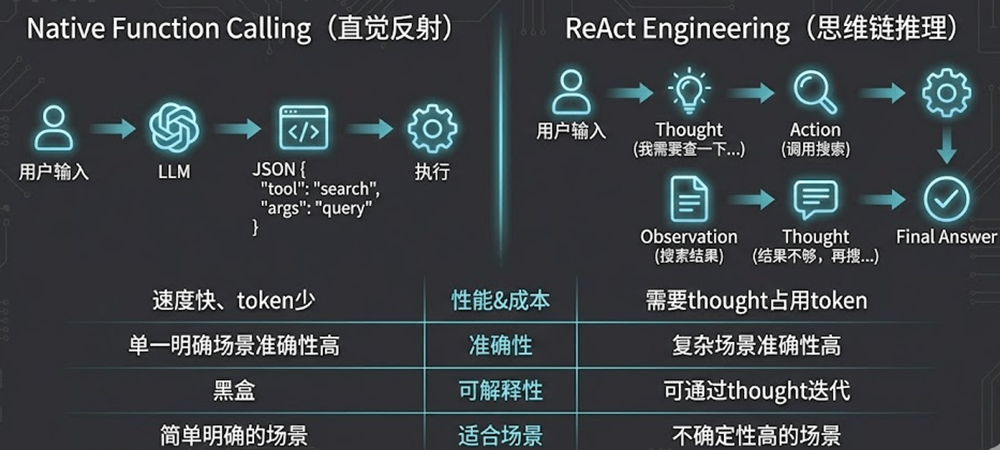
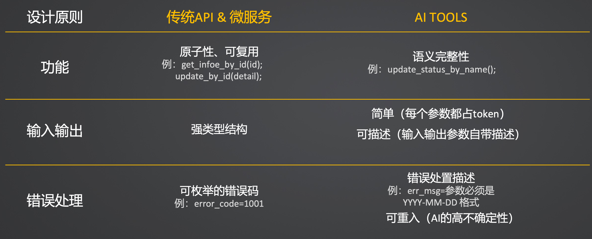
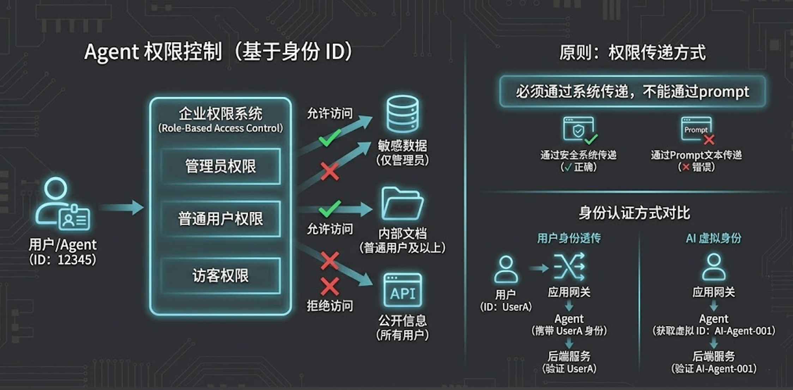

# 12｜工具设计哲学：从 API 到 Agent-Native 的范式跃迁

> 来源：极客时间《企业级多智能体设计实战》
> 当前播放：12｜工具设计哲学：从 API 到 Agent-Native 的范式跃迁
> 提取日期：2026-06-02
> 原文长度：5272 字

---

欢迎大家来到工程篇的第二大模块——**Agent 工具生态**！

在前面的课程中，我们完成了小红书爆款笔记生成项目的实战，主要是让 Agent 在“脑力”层面进行思考、规划和写作。但是，一个真正强大的 AI 应用，绝不能仅仅停留在“纸上谈兵”。如果说大模型是 Agent 的“大脑”，那么**工具（Tools）就是 Agent 探索世界、改变外部状态的“手和脚”**。


有了工具，Agent 就可以去查询数据库、读取本地文件、操作浏览器、甚至调用企业内部的微服务，真正帮你完成有价值的闭环任务。今天这节课，我们将从底层的设计哲学出发，探讨如何为大模型打造真正好用、不出错的专属工具。

---

## 一、 工具使用的底层逻辑：Native Function Calling vs ReAct

在让 Agent 使用工具之前，我们需要先理解它底层到底是怎么跑通的。目前业界主流的工具调用范式主要有两种：



1. Native Function Calling（原生函数调用）：这是目前大部分先进大模型（如 GPT-4, Qwen-Max 等）在底层 API 原生支持的能力。你在请求大模型时，不仅传入 Message List，还会传入一个 Tools List（包含工具的名称、描述和参数 JSON Schema）。大模型在理解语义后，会直接在其底层输出特殊的标记，告诉框架：“我要停下来，请帮我调用某个工具，参数是 XXX”。
2. ReAct 范式：我们在第 2 节课解剖 Agent 时详细讲过，基于 Thought -> Action -> Action Input -> Observation 的文本推演循环。

无论是哪种底层实现，对我们开发者而言，最核心的挑战并不在于框架层面的对接，而在于**你设计的这个工具，大模型到底能不能“看得懂”、“用得对”？** 这就引出了我们今天的核心命题——工具设计范式的跃迁。

---

## 二、 核心认知：面向 Agent 的工具设计范式

很多后端研发工程师在刚开始写 AI 工具时，会陷入一个巨大的思维误区：**把写传统微服务 API 的习惯，直接生搬硬套到 Agent Tool 的设计上。**

传统 API 是给“确定的程序化代码”调用的，而 Agent Tool 是给“充满不确定性、基于自然语言理解的大模型”调用的。这两者在设计哲学上有本质的区别。

请看上面这组对比，我们详细拆解一下面向 Agent 的工具应该怎么设计：



### 1. 从“原子性”到“语义完整性”

- 传统 API：追求高内聚低耦合，极度原子化。比如获取用户信息 get_info_by_id(id)，更新状态 update_status_by_id(id, status)。
- Agent Tool：大模型讨厌繁琐的多次往返组合。工具设计需要语义完整。比如直接设计一个 update_user_status_by_name(name, status)，在工具内部去完成“查 ID -> 校验 -> 更新”的闭环，而不是让大模型分三步去调三个不同的原子工具。

### 2. 从“强类型结构”到“可描述的简单结构”

- 传统 API：入参经常是复杂的强类型对象或深层嵌套的 JSON。
- Agent Tool：入参越简单、越扁平越好，最好都是基础类型（String, Int），因为每个参数都会消耗 Token 且增加模型理解失败的概率。更关键的是，每个参数都必须附带详尽的自然语言描述（Description），告诉模型这个字段填什么、不能填什么。

### 3. 从“状态码”到“建设性报错（Constructive Error）”

- 传统 API：报错时返回类似 error_code=1001 或 Null。程序代码捕获到 1001 后会走特定的 catch 逻辑。
- Agent Tool：如果你给大模型返回一个 1001 或者空的字符串，它会直接懵圈，然后开始胡言乱语（幻觉）或者陷入死循环。面向 Agent 的报错，必须是自然语言的“指导意见”。例如返回："操作失败：时间参数格式错误，你输入了 2026/01/01，请你修改为 YYYY-MM-DD 的格式后重新调用本工具。"大模型看到这句话，立刻就能自我纠错（Self-Correction）并重试。

---

## 三、 企业级实战：上下文隔离与安全工具调用

在企业级生产环境中，工具调用涉及到一个极其敏感的安全问题：**多租户数据隔离与身份认证**。



假设你写了一个 `FileWriterTool` 让 Agent 帮用户保存文件。你绝对不能在 Tool 的参数里暴露出 `user_id`，指望大模型在调用时乖乖地把当前用户的 `user_id` 传给你。大模型是极其容易被提示词注入（Prompt Injection）攻击的，它完全有可能被诱导去读写其他用户的数据！

**正确的企业级解法：隐式上下文挂载与 Hook 拦截。**

我们来看看项目中是如何通过优雅的代码设计解决这个问题的：

项目代码：[https://github.com/kid0317/crewai_mas_demo/blob/main/m2l8/m2l8_tools_call.py](https://github.com/kid0317/crewai_mas_demo/blob/main/m2l8/m2l8_tools_call.py)

### 1. 使用 `contextvars` 管理 API 请求级上下文

在 `m2l8_context.py` 中，我们利用 Python 的原生库创建了线程 / 协程安全的上下文变量，确保高并发下不同用户的请求彻底隔离。

```python
# m2l8_context.py 核心代码
from contextvars import ContextVar
from typing import Optional
 
# 用户 ID 上下文变量：标识当前请求的用户
user_id = ContextVar[Optional[str]]("user_id", default=None)
# 任务 ID 上下文变量：标识当前执行的任务
task_id = ContextVar[Optional[str]]("task_id", default=None)
```

### 2. 通过 Hook 机制透明接管工具执行路径

在 `m2l8_tools_call.py` 中，我们在大模型调用工具之前（`@before_tool_call`），拦截它的请求，从当前上下文中静默提取真实安全的 `user_id`，动态修改文件读写路径。大模型从头到尾都不知道底层做了路径隔离，既降低了它的认知负担，又保证了绝对的安全。

```python
# m2l8_tools_call.py 核心代码示例
import sys
import os
from pathlib import Path
from crewai.hooks import before_tool_call
from m2l8_context import user_id
 
WORKSPACE_BASE_PATH = Path("./workspace").resolve()
 
@before_tool_call
def secure_workspace_hook(tool_call, agent):
    """
    工具调用前的安全拦截 Hook：
    确保大模型只能操作当前 User 专属的工作空间目录，防止路径穿越攻击。
    """
    # 1. 从安全的上下文中获取当前真实的租户 / 用户 ID
    current_user = user_id.get()
    if not current_user:
        raise ValueError("安全拦截：上下文中未找到有效的 user_id")
 
    # 2. 构建该用户专属的沙箱路径
    user_workspace = (WORKSPACE_BASE_PATH / current_user).resolve()
 
    # 3. 拦截并覆写工具的入参（以写入文件工具为例）
    if tool_call.tool_name == "FileWriterTool":
        raw_path = tool_call.arguments.get("file_path", "")
        # 将大模型以为的相对路径，重定向到绝对安全的沙箱内
        safe_target_path = (user_workspace / raw_path).resolve()
 
        # 安全校验：防止大模型传入 "../../../etc/passwd" 这种路径穿越
        if not str(safe_target_path).startswith(str(user_workspace)):
             raise PermissionError("安全拦截：检测到非法越权路径访问！")
 
        tool_call.arguments["file_path"] = str(safe_target_path)
```

_这套机制是企业级 AI 中台建设中，保障多租户工具调用安全的标准方案！_

---

## 四、 避坑指南：最佳实践与反模式

写工具容易，写出能让 Agent 稳定跑通全链路的工具很难。最后，我们总结一下在工具设计中最容易踩坑的“反模式”，以及对应的“最佳实践”。

### 🚫 严重破坏稳定性的“反模式”

1. 全能工具（God Tool）

- 问题：写一个工具叫 DatabaseManager，然后让大模型通过传入一个 action_type 字符串（值为 insert, delete, query, update）来决定干什么。
- 后果：严重破坏单一职责原则。大模型极容易在使用时搞混不同 action 对应的必填参数，导致频频报错。

1. 多层转义的参数（Multi-level Escaping）

- 问题：工具的一个参数要求传入一段 JSON 格式的字符串，而这个 JSON 字符串内部某个字段的值，又是另一段 JSON 字符串。
- 后果：转义符 \" 会把大模型绕晕。大模型在生成多层嵌套转义的字符串时，出错率（格式残缺）呈指数级上升。

1. 深嵌套的入参（Deeply Nested Parameters）

- 问题：参数结构是 Map 里面套 List，List 里面再套 Map。
- 后果：增加了模型理解和生成的成本，应该极力将参数“拍平（Flatten）”。

1. 沉默的失败（Silent Failure）

- 问题：工具执行报错时，生硬地返回一个空字符串 "" 或是底层的 NullPointerException 堆栈。
- 后果：Agent 不知道发生了什么，可能会反复重试同样的错误操作，直到把 max_iterations 耗尽卡死。

1. 上下文炸弹（Context Bomb）

- 问题：读取一个文件或查询一次数据库时，不加限制地将几万行数据、数十兆的文件直接作为工具的 Observation 扔回给 Agent。
- 后果：瞬间撑爆大模型的 Context Window（上下文窗口），导致本次对话强制中断报错，或者模型被海量数据淹没，彻底遗忘当前的任务目标。

### 💡 稳健落地的“最佳实践”

1. 建设性报错（Constructive Error Handling）：捕获工具底层的所有异常，将其转化为对大模型友好的自然语言提示。告诉它“错在哪了”以及“接下来你应该尝试怎么做”。
2. 设计摘要或分页机制（Pagination & Summarization）：面对可能返回海量数据的工具（如读大文件、查数据库），强制在工具内部实现“分页返回”或者“关键信息摘要”。例如给工具增加一个 page_size 和 page_number 参数，并引导 Agent 如果发现内容未读完，需要翻页查询；或者在工具底层先用一个小模型将长文本压缩后，再返回给主流程的 Agent。

---

## 课程总结与预告

本节课，我们完成了从 API 思维向 Agent-Native 工具思维的跃迁。

- 理解了面向大模型的工具需要具备语义完整性和详尽的描述。
- 通过 contextvars 和 Hook 拦截机制，实现了企业级安全的多租户工具调用架构。
- 梳理了五大臭名昭著的“反模式”，以及如何通过“建设性报错”和“分页机制”为工具装上护栏。

只懂理论还不够，**下一节课（13｜自定义工具封装：构建 Tools 的五步标准 SOP）**，我将手把手带大家深入源码，从零开始封装一个真正符合上述所有最佳实践原则的自定义复杂工具。准备好迎接硬核代码洗礼吧，我们下期见！
---

来源：极客时间《企业级多智能体设计实战》
提取日期：2026-06-02
