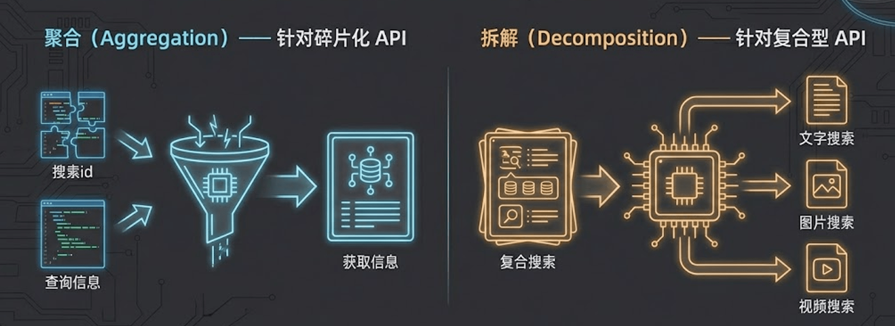
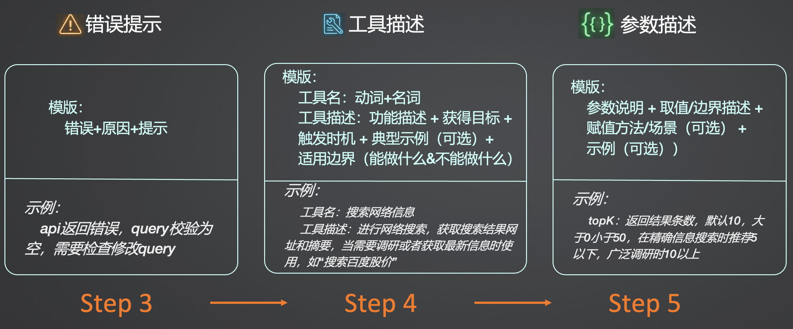
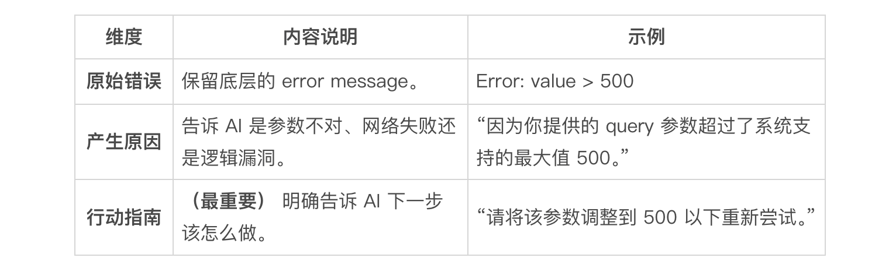

# 13｜自定义工具封装：构建 Tools 的五步标准 SOP

> 来源：极客时间《企业级多智能体设计实战》
> 当前播放：13｜自定义工具封装：构建 Tools 的五步标准 SOP
> 提取日期：2026-06-02
> 原文长度：8491 字

---

欢迎来到第 13 节课！在上一讲中，我们探讨了工具设计的底层哲学，理解了面向大模型（Agent-Native）的工具与传统微服务 API 在设计原则上的本质区别，并学习了如何通过 Hook 机制保障企业级多租户场景下的调用安全。

但在实际的企业开发中，你面临的真实状况往往是：公司已经沉淀了成百上千个历史遗留的、面向传统前端和业务系统设计的 API。**我们到底该如何将这些晦涩、复杂的现有系统接口，平滑地改造成大模型能够轻松驾驭的 Agent Tools 呢？**

这节课，我将为你交付一套极具实操价值的方法论——**从传统 API 到 Agent Tools 封装的“五步标准 SOP”**。只要严格遵循这五个步骤，无论多复杂的内部系统，你都能将其优雅地赋能给你的数字员工。我们将结合具体的“百度搜索 API”实战代码，带你一步步完成改造。


---

## 五步标准 SOP 全景图

### Step 1：语义完整性重构（聚合与拆解）



这是最考验架构师业务抽象能力的一步。传统的后端 API 往往是高度数据驱动和原子化的（CRUD），而大模型是目标驱动的。

- 问题所在：如果直接把底层的原子 API 暴露给大模型，模型需要自己规划调用顺序。例如，想要更新一个用户信息，它可能需要先调用 get_user_by_name 获取 ID，再调用 check_permission 校验权限，最后调用 update_user_info。这种多步往返会极大增加模型产生幻觉和报错的概率。
- SOP 动作：我们需要在工具层进行接口的聚合。为大模型提供一个具备完整业务语义的工具，比如叫 update_user_info_by_name。在这个工具的内部逻辑里，用 Python 代码去依次调用那三个底层 API。让大模型做它擅长的“意图理解”，让代码做代码擅长的“确定性流转”。

### Step 2：I/O 瘦身（降噪增信）

大模型的上下文窗口（Context Window）是非常昂贵且注意力有限的。传统 API 的输入输出通常包含了大量对大模型毫无意义的元数据。

如上方 PPT 示意图所示，一个原本复杂的搜索系统 API，其 Payload 可能长这样：

```json
// 传统 API 臃肿的输入
{
    "messages": [{"content": "北京有哪些旅游景区", "role": "user"}],
    "search_source": "baidu_search_v2",
    "resource_type_filter": [{"type": "web", "top_k": 20}],
    "search_filter": {
        "match": {"site": ["www.weather.com.cn"]},
        "query": {
            "filter": {"range": {"page_time": {"gte": "now-1w/d","lt": "now/d"}}}
        }
    }
}
```

- SOP 动作（输入瘦身）：坚决砍掉各种复杂的嵌套、系统级的鉴权字段和冗余结构，将层级“拍平”。大模型只需要看到最核心的业务参数：

```json
// Agent Tool 极简的输入
{
    "query": "北京有哪些旅游景区",
    "top_k": 20,
    "site": ["www.weather.com.cn"],
    "recency_filter": "year"
}
```

- SOP 动作（输出增信）：当传统 API 返回结果时，可能长这样：

```plain
{
    "references": [{
        "content": ”xxx",
        "date": "2025-04-27 18:02:00",
        "icon": null,
        "id": 1,
        "image": null,
        “title”: ”xxx",
        "type": "web",
        "url": "https://www.XXX.com.cn/XXX",
        "web_anchor": “xxxxx”
    }
    ……
],
    "request_id": ”XXX"
}
```

这样的返回不仅冗余，同时因为没有解释各个字段，很容易让模型无法理解这些结构化的字段的语义。把诸如 `icon: null`、`image: null`、内部系统打点 ID 等无关信息全部过滤掉，只返回对 Agent 推理有用的核心文本内容。同时明确告诉模型每个字段的寓意，可能的返回像这样：

```plain
共返回 XX 条数据
 
结果 1：[title](http://xxxxx/xx)
摘要：XXXXXX
 
---
```

接下来，我们一口气看一下最重要的，对工具的各种语义描述：在多智能体系统中，`Function Calling` 不稳定，往往不是模型不行，而是你的“工具说明书”写得太烂。AI 是在不确定中寻找确定性，我们的目标是：**通过工程化的模板，消除逻辑转换的模糊感。**



---

### Step 3：错误提示（Error Message）：给 AI 一个“复盘”的机会

当工具调用报错时，不要只返回一个原始错误代码。底层工具需要改造，返回给 AI 的错误信息建议遵循以下模板：



>
> 核心逻辑：AI 看到原因和指南后，在 ReAct 循环中就能立刻精准调整参数，而不是盲目重试。
>

---

### Step 4：工具描述（Tool Description）：动词 + 名词与触发时机

工具描述决定了 AI “用不用”这个工具。好的描述分为两个核心部分：

**1. 规范的工具名**

不要起花哨的名字。建议采用 **[动词] + [名词]** 的形式。

- 错误示例：Baidu_Search（AI 可能不理解百度是什么）。
- 正确示例：web_search（明确告诉它是用来搜索网络信息的）。
- 注：在很多框架（如 CrewAI）中，Prompt 贴近生成动作的地方只有工具名，所以名字本身就是最重要的暗示。

**2. 工具描述模板**

一个高品质的工具描述应包含以下四个要素：

- 功能描述：说明工具是干什么的。
- 产出物说明：调用后能获得什么（如：网址、摘要、数据列表）。
- 触发时机（逻辑转换策略）： 关键点：去掉 AI 的逻辑转换负担。 例子：不要只说“这是数据库插入工具”，要说“当你想保存 / 持久化一条用户信息时使用”。直接给场景，让 AI 看到场景就自动触发。
- 适用边界（能与不能）：防止工具混淆。 例子：处理 PDF 的工具要注明：“仅支持 PDF 格式，无法处理 Excel 或 Word。”这样能有效节省 Token，避免无效调用。

---

### Step 5：参数描述（Parameter Description）：给 AI 一本“说明书”

不要只给一个参数名（如 `top_k`），让 AI 去猜。参数描述也需要模板化：

**1. 基础说明**

明确参数的含义。例如 `top_k` 是“返回结果的条数”。

**2. 边界与默认值**

告诉 AI 取值范围（如 1-100）和默认值，防止 AI 填入非法值导致工具报错。

**3. 赋值方法与业务场景（进阶）**

这是区分初级与高级开发者的关键。告诉 AI **在什么场景下该传什么值**。

- 案例：搜索工具的top_k参数 广泛搜索场景：如果你需要获取大量背景信息，请将 top_k 设为 10 以上。 精确搜索场景：如果你只需要回答“某某是什么”这种定义问题，请将 top_k 设为 5 以内，以减少垃圾信息干扰。
- 案例：时间过滤器time_filter 最新资讯：设置为“天”或“周”。 概念 / 名词解释：不设置时间限制（因为概念几百年前就存在）。 前沿技术：设置为“月”。

### 

---

## 代码实战：改造百度 search 的 api 变为更好用的 AI 工具

代码位置：[https://github.com/kid0317/crewai_mas_demo/blob/main/tools/baidu_search.py](https://github.com/kid0317/crewai_mas_demo/blob/main/tools/baidu_search.py)

```plain
"""
课程：13｜自定义工具封装：构建 Tools 的五步标准 SOP 示例代码
百度搜索工具 - 基于百度千帆搜索 API 的 CrewAI 工具
 
演示如何按照五步标准 SOP 封装自定义工具：
1. 定义输入 Schema（BaiduSearchInput）
2. 实现工具类（继承 BaseTool）
3. 实现 _run 方法（核心逻辑）
4. 错误处理和日志记录
5. 格式化输出结果
 
本工具展示了：
- 工具封装：如何将 API 封装为 CrewAI 工具
- 参数验证：如何使用 Pydantic 验证输入参数
- 错误处理：如何处理各种异常情况
- 日志记录：如何记录工具调用过程
- 结果格式化：如何格式化工具输出，便于 Agent 理解
 
学习要点：
- BaseTool 基类：如何继承并实现自定义工具
- Pydantic Schema：如何定义和验证工具输入
- 错误处理：如何优雅地处理工具执行错误
- 工具描述：如何编写清晰的工具描述，帮助 Agent 理解工具用途
"""
 
class BaiduSearchInput(BaseModel):
    """百度搜索工具的输入参数模式"""
    query: str = Field(
        ..., 
        description="搜索查询内容，即用户要搜索的问题或关键词，不能为空，不能只包含空白字符，通常由一个或几个词组成"
    )
    top_k: Optional[int] = Field(
        20,
        description="返回的搜索结果数量，默认 20，在精确信息搜索时推荐 5 以下，广泛调研时 10 以上。"
    )
    recency_filter: Optional[Literal["week", "month", "semiyear", "year"]] = Field(
        None,
        description="根据网页发布时间进行筛选，可选值 week(最近 7 天)、month(最近 30 天)、semiyear(最近 180 天)、year(最近 365 天)，通常根据用户需求的时效性要求来选择，常识性的问题不使用，资讯类的可能比较短。"
    )
    sites: Optional[List[str]] = Field(
        None,
        description="指定搜索的站点列表，最多支持 20 个站点，默认 None，仅在设置的站点中进行内容搜索，示例 ['www.weather.com.cn', 'news.baidu.com']，通常根据需求指定权威站点，如词条类的通常是百度百科，股票类的通常是东方财富网，开源项目等通常是 GitHub 等。"
    )
 
class BaiduSearchTool(BaseTool):
    """
    百度搜索工具
    
    使用百度千帆搜索 API 进行网络搜索，支持网页、视频、图片、阿拉丁等多种资源类型的搜索。
    需要百度千帆 API Key 进行鉴权。
 
    注意，工具名必须是英文，不然 crewai 会过滤
    """
    name: str = "search_web"
    description: str = (
        "使用百度搜索引擎查找相关信息，可以按时间范围、指定站点等条件筛选搜索结果。"
        "获得包含标题、链接、内容摘要等详细信息的搜索结果。"
        "触发时机：当需要查找网络上的最新信息、特定网站内容、或按时间筛选搜索结果时使用，例如查找'Python 最新版本特性'、'最近一周的 AI 新闻'、'特定网站的技术文档'等场景。"
        "适用边界：主要搜索一些通用公开的信息，当有其他专业工具能更精确查找内部或专业知识时，不使用该工具。"
    )
    args_schema: Type[BaseModel] = BaiduSearchInput
 
    def _run(
        self,
        query: str,
        top_k: int = 20,
        recency_filter: Optional[str] = None,
        sites: Optional[List[str]] = None,
    ) -> str:
        """
        执行百度搜索
        
        """
 
        # 具体实现详见代码，主要是做参数映射
        
        # 解析响应后要做错误转换
        result = response.json()
            
        # 检查错误 - 兼容两种错误格式
        # 如果存在 code 字段且不为 0/None/ 空字符串，则认为是错误
        error_code = result.get("code")
        if error_code is not None and error_code != 0 and error_code != "":
            error_msg = result.get("message", "未知错误")
                
            # 根据错误码提供更友好的错误信息
            error_descriptions = {
                "400": "请求参数错误，请检查输入的参数是否正确，确认参数格式和取值范围是否符合 API 要求",
                "500": "服务器内部错误，可能是服务器临时故障，请稍后重试或尝试其它工具",
                "501": "服务调用超时，可能是服务器处理时间过长，请稍后重试或减少请求复杂度",
                "502": "服务响应超时，可能是服务器响应时间过长，请稍后重试或尝试其它工具",
                "216003": "API Key 认证失败，请检查 API Key 是否正确、是否已过期或是否有足够的权限",
            }
                
            error_hint = error_descriptions.get(str(error_code), "请检查请求参数是否正确，或稍后重试")
                
            error_result = (
                f"错误：API 返回错误。\n"
                f"原因：百度搜索 API 返回错误码{error_code}，错误信息：{error_msg}，请求 ID：{request_id}。\n"
                f"解决提示：{error_hint}\n"
            )
            return error_result
            
            # 格式化搜索结果
            references = result.get("references", [])
            if not references:
                no_result_msg = (
                    f"错误：未找到相关搜索结果。\n"
                    f"原因：使用关键词'{query}'进行搜索，但未找到匹配的结果，可能是关键词过于具体、过滤条件过于严格或资源类型限制。\n"
                    f"解决提示：1) 尝试使用不同的关键词或更通用的搜索词；2) 检查是否使用了过于严格的过滤条件 (如站点限制、时间范围等)，适当放宽条件。\n"
                )
                logger.warning(f"搜索完成，但未找到相关结果 (关键词: {query})")
                return no_result_msg
            
            # 记录搜索结果统计
            # 构建结果字符串
            results = []
            results.append(f"找到 {len(references)} 条搜索结果")
            results.append("")
            
            for ref in references:
                ref_id = ref.get("id", "?")
                title = ref.get("title", "无标题")
                url = ref.get("url", "")
                content = ref.get("content", "")
                
                result_text = f"结果{ref_id}: [ {title} ] ( {url} ) \n  内容摘要: {content} \n"
                
                results.append(result_text)
                results.append("")  # 空行分隔
            
            final_result = "\n".join(results)
            logger.info("搜索结果格式化完成")
            logger.info("=" * 80)
            return final_result
            
 
---
```

## 课程总结与预告

今天这节实战课，我们掌握了构建 AI 专属工具的“五步标准 SOP”：

1. 语义重构：组合原子接口，提供目标导向的闭环能力。
2. I/O 瘦身：剔除冗余字段，保护珍贵的 Token 上下文。
3. 参数 Prompt 化：用 Pydantic 描述充当使用说明书，手把手教模型使用工具。
4. 建设性异常处理：用自然语言包裹错误，激活模型的自我纠错能力。
5. 黑盒映射：在底层代码中完成从极简输入到复杂请求的暗中转换。

只要掌握了这套 SOP，你公司内部现存的所有业务系统（ERP、CRM、工单系统）的 API，都可以被你逐一改造成大模型的超级武器库。

到这里，关于 Agent 如何使用工具的基础篇章就告一段落了。接下来我们会来看看**业界的实战标准：MCP**。一个庞大的工具生态将通过这种标准化的方式，展现在我们面前。
---

来源：极客时间《企业级多智能体设计实战》
提取日期：2026-06-02
