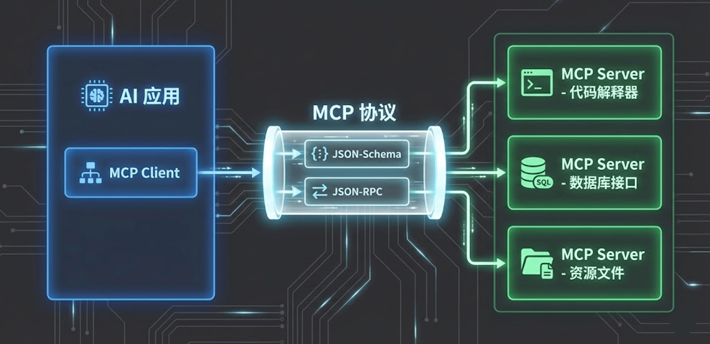
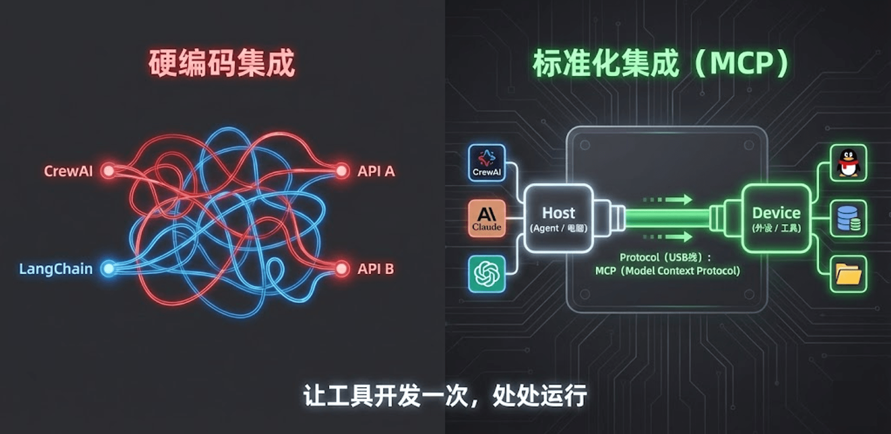
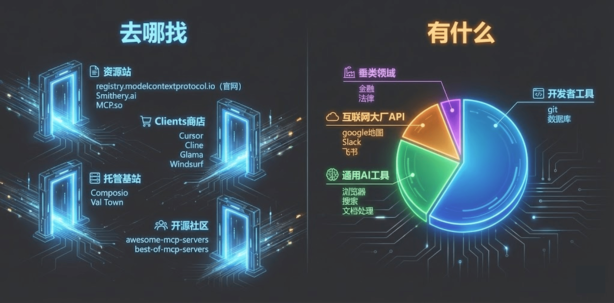
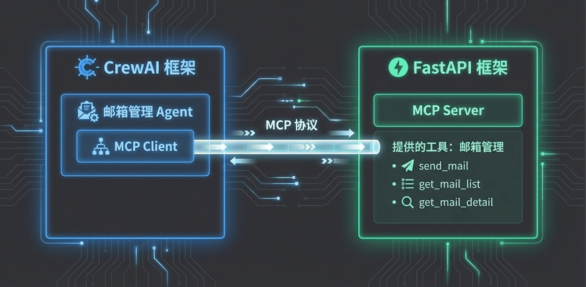
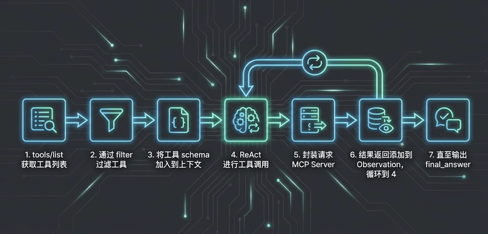

# 14｜MCP协议：标准化定义工具接口

> 来源：极客时间《企业级多智能体设计实战》
> 当前播放：14｜MCP协议：标准化定义工具接口
> 提取日期：2026-06-02
> 原文长度：5731 字

---

欢迎回来！这节课我们将进入一个绝对重磅的议题——**MCP（Model Context Protocol，模型上下文协议）**。

说实话，MCP 这个话题非常硬核，甚至足够单开一门课来专门讲解。在前面的课程中，我们学习了如何自己手写 Python 代码来封装各种本地工具。但在真实的工业界，如果我们每一次接入新系统都要从零手写一堆业务逻辑代码，这显然违背了软件工程的效率原则。

2024 年，Claude 的母公司 Anthropic 提出了一套革命性的协议——MCP。它的出现，正在彻底改变 AI Agent 与外部世界交互的方式。

---

## 一、 认知原点：什么是 MCP 协议？



首先要明确一个核心概念：**MCP 本质上是一个“协议”（Protocol），而不是一个具体的软件或开源项目**。你可以把它类比为互联网世界的 HTTP 协议。只要大家都遵循同一套标准来“说话”，不同的系统之间就能无缝沟通。

MCP 协议将整个 AI 工具调用的链路极其优雅地拆分成了两端：

1. MCP Client（客户端）：也就是我们的 Agent 或者 AI 应用。它负责理解用户的自然语言，进行推理决策。
2. MCP Server（服务端）：也就是提供底层工具和数据源的地方（例如你的企业邮箱系统、内部数据库、甚至是一套完整的 OA 系统）。

只要 Server 端按照 MCP 的标准格式对外暴露了自己的能力（包含有哪些工具、工具的描述是什么、参数 schema 是什么），Client 端就能自动发现、自动理解，并动态调用这些工具，完全不需要在 Agent 的代码里硬编码任何具体的业务逻辑！

---

## 二、 核心价值：生态复用与架构解耦

为什么现在的 AI 圈都在疯狂拥抱 MCP 生态？它为企业级落地带来了两大无可替代的价值：



- 生态复用（Write Once, Use Anywhere）：只要你将公司内部的一个系统（比如邮件系统）封装成了标准的 MCP Server，那么不仅是你今天写的 CrewAI Agent 可以调用它，明天你们公司用 LangChain 写的应用、甚至未来直接用桌面版的 Claude 客户端，都可以直接连上这个服务使用。真正做到了一次开发，全生态复用。
- 架构解耦：在大型企业中，开发 AI 大脑的算法团队，和维护底层业务系统（如 ERP、CRM）的后端研发团队往往不是同一拨人。通过 MCP，后端团队只需要专注把接口按标准提供出来，AI 团队直接接入即可，彻底划清了权责边界。

## 三、生态现状

那么在哪里能找到这些网络上别人提供的 MCP 呢？



### MCP 资源去哪找？（四大核心渠道）

寻找 MCP 资源时，我们可以通过以下四个维度进行探索：

**1. 资源站与官网**

- 官方收录：registry.modelcontextprotocol.io 是由 Anthropic 维护的官方站点，收录了大量典型的官方及个人发布的 MCP 资源。
- 第三方资源站：如 Smithery.ai 和 MCP.so 等，这些网站聚集了大量开发者入驻并分享资源。

**2. AI 应用商店 (Clients 商店)**

- 很多 AI 编辑器或客户端自带 MCP 商店。例如在 Cursor、Cline、Glama 或 Windsurf 中，你可以直接查看 Top 排行的 MCP 插件并一键安装。

**3. 托管基站**

- 对于开发者编写了代码但没有服务器的情况，他们会利用 Composio 或 Val Town 等平台进行托管。这些基站将代码转化为可用的 Web Server，并提供资源排行榜供用户选择。

**4. 开源社区**

- GitHub 资源列表：搜索 awesome-mcp-servers 或 best-of-mcp-servers 等项目。这些开源项目虽不直接存放代码，但收集了海量的项目地址和功能介绍，你可以根据需要选择并自行部署。

---

### 目前 MCP 工具的分布现状

虽然 MCP 生态发展迅速，但目前的工具分布呈现出明显的“开发者导向”特征：

- 开发者工具 (占绝大多数)：开发者最懂开发者。目前大部分 MCP 服务都集中在 git、数据库连接、流水线排查等后端开发场景。
- 通用 AI 工具：包括浏览器（Playwright）、网络搜索、文档处理等，旨在提升日常办公的自动化程度。
- 互联网大厂 API：许多巨头已开始入局，例如 Google Maps、Slack（即时通讯）、飞书（文档管理）等都已提供相应的 MCP 接入。
- 垂类领域应用 (相对较少)：目前金融、法律、股票行情等专业领域的 MCP 资源正在起步，未来会有更蓬勃的发展。

---

## 四、MCP 实战 —— 从自研 Server 到企业级 AI 应用开发

在前面的课程中，我们深入探讨了 MCP（Model Context Protocol）的协议逻辑与生态资源。本节课我们将进入**代码实战阶段**。

我们将通过两套代码库，带大家走通从“开发工具服务”到“AI 应用调用”的全链路：一套是基于 **FastAPI** 的 MCP Server 框架，用于把你的业务能力“工具化”；另一套是基于 **CrewAI** 的 MCP Client 实现，演示 Agent 如何标准化地集成这些能力。



---

### 

### 开发自研 MCP Server：基于 FastAPI 的企业级框架

如果你想把现有的业务系统（如邮件管理、数据库查询）开放给 AI 调用，最稳健的方式是开发自己的 MCP Server。

我们提供了一套基于 FastAPI 实现的 MCP Server 模板：[https://github.com/kid0317/fastapi_mcpserver_base](https://github.com/kid0317/fastapi_mcpserver_base)

它具备以下企业级特性：

- 高性能与异步：支持最新的 2025 Streamable HTTP 传输协议，基于 ASGI 异步架构，能够应对高并发场景。
- 开箱即用的基础设施：框架内预集成了结构化 JSON 日志、Prometheus 监控指标和 API Key 鉴权，你不需要从零开始写这些繁琐的代码。
- 开发极其友好：采用装饰器（Decorator）模式，只需在函数上加一个注解即可完成工具注册。

**核心开发步骤**

以实战项目 `mail_mcpserver` 为例，代码位置：[https://github.com/kid0317/mail_mcpserver](https://github.com/kid0317/mail_mcpserver)

开发逻辑主要集中在 `app/tools/` 目录下：

- 步骤 1：定义工具逻辑：编写具体的业务代码，例如使用 imap_tools 读取邮件或 aiosmtplib 发送邮件。
- 步骤 2：应用 Prompt 模板：这是决定 Agent 调用成功率的关键。在装饰器描述中必须包含： 规范名称：采用“动词 + 名词”形式（如 send_email）。 触发时机：明确告诉 AI 什么时候该用这个工具。 适用边界：明确说明能做什么、不能做什么（例如：只支持 PDF，不支持 Word）。
- 步骤 3：参数精细化说明：在参数定义中，不仅要写参数名，还要写明取值边界、默认值及示例。

**3. 企业级安全：密钥管理**

**原则：绝对不能让 LLM 直接管理密钥（如邮箱授权码）。**

- 加密存储：用户的邮箱私钥使用 Fernet 对称加密后持久化存储在 Server 端。
- 身份映射：Agent 调用工具时，通过 HTTP Header 传递 X-User-Id。Server 根据 ID 自动换取加密的密钥去执行操作，AI 接触不到任何底层敏感信息。

---

### AI 应用集成：在 CrewAI 中使用 MCP Client

有了 Server，下一步就是让我们的 Agent “装备”上这些工具。

代码位置：[https://github.com/kid0317/crewai_mas_demo/blob/main/m2l9/m2l9_mcp.py](https://github.com/kid0317/crewai_mas_demo/blob/main/m2l9/m2l9_mcp.py)

**1. MCP Client 的连接配置**

在 CrewAI 框架中，集成 MCP 非常简单，主要通过 `MCPServerHTTP` 类实现：

Python

```plain
# 示例：在 Agent 中集成邮件 MCP 服务
email_agent = Agent(
    role="电子邮件收发员",
    mcps=[MCPServerHTTP(
        url="http://localhost:8005/mcp",
        headers={
            "Authorization": "Bearer your_key", # 传输层鉴权
            "X-User-Id": "user01"               # 业务层多租户支持
        },
        tool_filter=static_filter,              # 安全过滤器
    )]
)
```

**2. 关键安全机制：工具过滤器（Tool Filter）**

当连接一个外部 MCP Server 时，为了防止 Server 变动或恶意注入新工具，必须使用**白名单过滤**：

- 使用 create_static_tool_filter 限制 Agent 只能看到并使用你指定的工具（如 send_email）。
- 即使 Server 端额外增加了一百个工具，Agent 也不会受到干扰或产生安全风险。

**3. 执行流程解析**

1. 工具发现：Agent 启动时，会自动调用 MCP Server 的 tools/list 接口，拉取工具的 Schema 定义。
2. 决策与规划：LLM 根据任务描述，匹配 Schema 中的“触发时机”决定是否调用。
3. 标准化执行：Agent 通过标准协议发起请求，Server 执行逻辑并返回 JSON 结果，完成闭环。

---

### 实战总结：MCP 的核心价值

MCP 彻底降低了 AI 使用工具的成本。

- 对于服务端：你只需按照标准写一次代码，就能适配 Cursor、CrewAI 等所有支持 MCP 的客户端。
- 对于应用端：你不再需要为每个 API 手写适配代码，只需一个 URL 即可接入海量工具能力。

### 深度解析：MCP 工具是如何被“注入”的？

当你运行上面这段代码时，框架底层进行了一场非常精彩的“暗箱操作”：



1. 自动握手与发现：框架会先通过 HTTP 或 SSE（Server-Sent Events）向 localhost:8005 发起请求，获取这个 MCP Server 暴露的 Tool List。
2. 过滤与防越权：经过我们定义的 static_filter，剥离掉 Agent 不该拥有的高危工具。
3. Schema 组装与上下文注入：框架将获取到的工具描述和 JSON Schema，动态生成了类似 http_localhost_8005_mcp_send_email 这样的工具名，并将其无缝拼接到大模型的 System Prompt 中。大模型就像使用本地工具一样，毫无感知地调用了远程的微服务！

---

## 五、 避坑指南：最佳实践与反模式

在企业内部推广 MCP 时，如果没有一套明确的设计规范，很容易引发灾难。以下是根据实战踩坑总结的红黑榜：

### 🚫 严重破坏稳定性的“反模式”

1. 巨型 MCP（上下文核弹）

- 现象：为了省事，把诸如 Playwright 这种极其复杂的浏览器自动化操作封装成一个 MCP，一个接口返回 20 多个工具，导致一次请求直接占用大模型 13.7K 的 Token！
- 后果：极其浪费成本，且严重干扰大模型的上下文注意力。MCP 服务提供的工具集应该保持克制和垂直。

1. 粒度过细（过度原子化）

- 现象：工具拆得过于原子，导致大模型为了完成一个任务，需要进行 5-6 次往返调用。
- 后果：每次调用都要消耗 Token 且存在失败风险。请务必遵守第 12 节课讲的工具“语义完整性”原则，在 Server 端做一定程度的业务聚合。

1. 同步阻塞时间过长

- 现象：在使用 Stream/SSE 长连接模式时，后端的 MCP 工具执行了一个极度耗时的重 I/O 操作（比如大文件处理），且过程中没有发送心跳。
- 后果：Client 端会因为长时间未收到响应而判定超时断开（Timeout），导致任务彻底失败。

1. 把系统安全参数交给模型

- 现象：在工具的 Schema 中定义一个 user_id 字段，指望大模型自己生成并传给后端。
- 后果：极高的越权安全风险！正如我们在示例代码中演示的，像租户身份这种绝对不能被篡改的信息，必须通过 headers 等系统信道直接传递给 MCP Server，严禁将其暴露给大模型去生成。

### 💡 稳健落地的“最佳实践”

1. 状态控制的权力下放：强烈建议将 MCP Server 做成无状态的（Stateless）。所有的业务上下文和进度状态，应该由 Client（也就是我们的 Agent 框架）来控制和记忆。
2. 幂等设计（核心护城河）：由于网络抖动和 SSE 模式的不稳定性，Client 极有可能发起重试机制。你的 MCP 工具实现必须是幂等的！建议支持 Client 在调用时传入一个 request_id，防止资金划拨或邮件发送等核心操作因为网络重试而被重复执行两次。

---

## 课程总结与预告

本节课，我们推开了通往 AI 大生态的一扇大门——MCP 协议。

- 我们理解了它通过标准化协议实现生态复用与架构解耦的核心价值。
- 掌握了在工程代码中通过极简配置接入远程 MCP 服务的实战打法。
- 明确了规避“巨型 MCP”、“阻塞超时”和“信任模型传参”等致命缺陷的护栏规范。

既然 Agent 现在已经能通过 MCP 熟练使用各种外部工具了，那我们还能不能进一步提升它的“能力”呢？**下一节课，我们将介绍对 Ai 应用来说最强大的超能力：代码解释器和无头浏览器。**
---

来源：极客时间《企业级多智能体设计实战》
提取日期：2026-06-02
