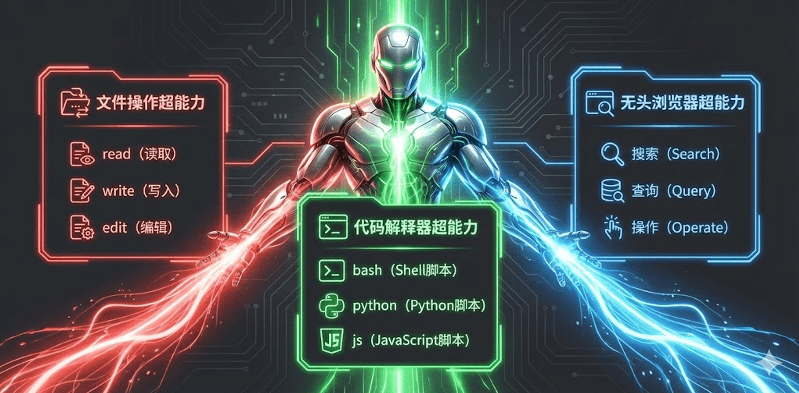
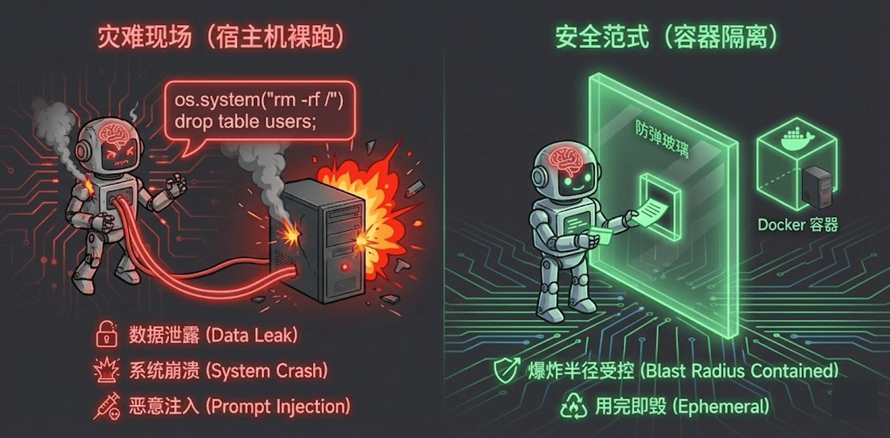
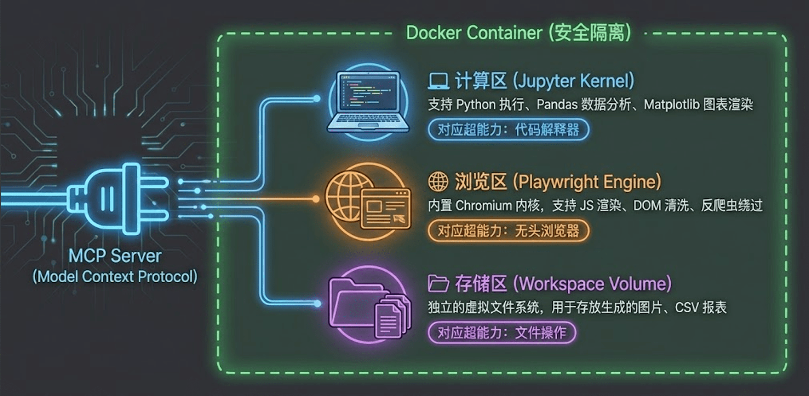
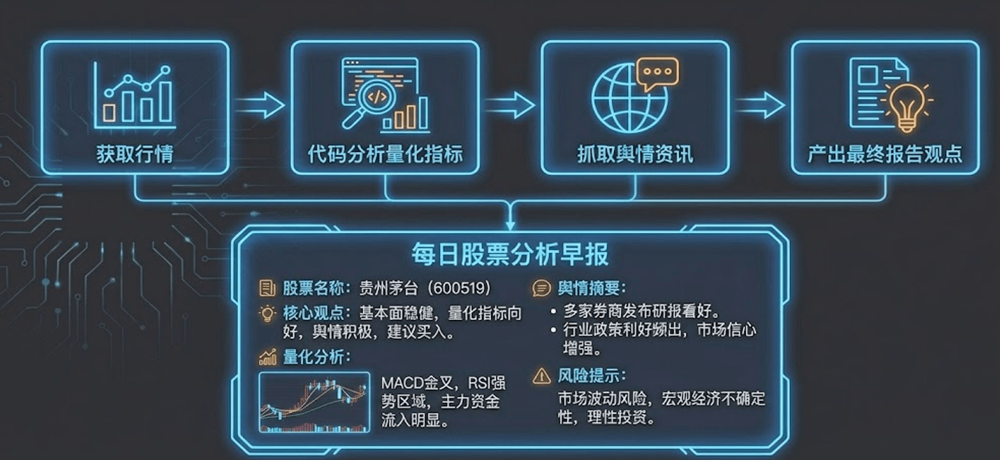

# 15｜王牌超能力：代码解释器与无头浏览器

> 来源：极客时间《企业级多智能体设计实战》
> 当前播放：15｜王牌超能力：代码解释器与无头浏览器
> 提取日期：2026-06-02
> 原文长度：4410 字

---

欢迎回来！在上一节课中，我们深入探讨了 MCP（模型上下文协议），它让我们能够用极低的代码成本，将 Agent 与各种外部系统连接起来。有了 MCP 这条“高速公路”，今天我们就要为 Agent 装载真正重量级的“武器”了。

如果说普通的工具让 Agent 勉强算个“实习生”，那么赋予它这节课要讲的**三大王牌超能力**，你的 Agent 将瞬间进化为全能的“数字白领”。这三大能力分别是：**文件操作**、**代码解释器（Code Interpreter）和无头浏览器（Headless Browser）**。

---

## 一、 Agent 的三大王牌超能力

要让 Agent 在复杂的真实世界中独立完成闭环任务，它必须具备以下三种递进的核心能力：



### 1. 文件操作能力 (File Operations)

这是最基础的超能力。Agent 不仅需要能读取（Read）和写入（Write）文件，更关键的是具备**局部编辑（Edit/Diff）**的能力。

就像我们在使用 Cursor 或 Claude 时经常看到的，面对一个庞大的代码文件或几万字的报告，Agent 不需要每次都全量重写，而是通过生成 Diff 差异来进行精准的局部修改。一旦掌握了这个能力，Agent 就具备了极强的条理性和规划性，能够从容应对复杂的文档编辑与代码重构任务。

### 2. 代码解释器 (Code Interpreter)

这是彻底拉开 Agent 智商差距的超能力。遇到了超出大模型自身计算能力复杂的数学题怎么办？需要处理清洗数十万行的 Excel 数据怎么办？

拥有代码解释器后，Agent 不再依赖单纯的“脑补推理”，而是会像人类程序员一样，**自主编写一段 Python 代码，运行它，并根据输出的结果进行下一步决策**。这极大地拓展了 Agent 处理数据、图表和复杂逻辑的边界。

### 3. 无头浏览器 (Headless Browser)

当目标信息没有现成的 API 接口时，无头浏览器就是终极武器。它赋予了 Agent 像人类一样在互联网上“冲浪”的能力。Agent 可以自主打开网页、滚动屏幕、点击按钮、甚至截取当前屏幕画面的快照（Screenshot）并配合多模态视觉模型进行深度分析。

---

## 二、 裸奔的代价：Agent 执行安全风控

听起来这些超能力非常酷炫，但在激动之余，作为企业级架构师，我们必须立刻拉响安全警报。

**千万、千万不要让你的 Agent 在你的宿主机（物理机或主要的云服务器）上“裸奔”执行代码！**



- 毁灭性的误操作：大模型产生幻觉时，可能会生成类似 rm -rf * 这种致命的删除指令。如果代码解释器直接在你的开发机上运行，你的整个系统瞬间就会灰飞烟灭。
- 沦为“肉鸡”的风险：如果你的 AI 应用对外暴露，黑客极易通过 Prompt Injection（提示词注入）攻击，诱导大模型下载恶意挖矿脚本或木马病毒。在没有任何隔离的宿主机上，你的电脑会立刻沦为受控的“肉鸡”。

因此，我们在赋予 Agent 强大执行力的同时，必须给它套上一个坚不可摧的“笼子”。

---

## 三、 全能数字实验室：AIO-Sandbox 架构解剖

为了完美解决安全与功能兼顾的问题，我们在工业界通常会采用**沙盒（Sandbox）隔离技术**。

结合上一节课的 MCP 协议，我为大家推荐并演示一个强大的开源方案：**AIO-Sandbox**。它利用 Docker 容器技术，在你的宿主机上隔离出一个绝对安全的独立环境。Agent 可以在这个沙盒里肆意妄为地写代码、装依赖、甚至把系统搞崩溃，而你只需要简单地重启一下 Docker 容器，一切又会恢复如初。



通过 MCP 协议，AIO-Sandbox 将沙盒内的极其丰富的工具库暴露给了外层的 Agent。比如我们在 [https://github.com/kid0317/crewai_mas_demo/blob/main/m2l10/m2l10_mcp_tools.md](https://github.com/kid0317/crewai_mas_demo/blob/main/m2l10/m2l10_mcp_tools.md) 中可以看到，沙盒不仅提供了基础的运行代码能力，还直接暴露了海量的浏览器操控原语：

- sandbox_browser_screenshot: 获取当前屏幕截图。
- browser_click / browser_scroll: 模拟真实用户的点击和滚动。
- browser_get_clickable_elements: 获取页面所有可交互元素的坐标与索引。

---

## 四、 代码实战：打造“阿里股票早报”分身

接下来，我们看一段极其硬核的代码实战。我们将利用沙盒的这些超能力，让 Agent 帮我们完成一个复杂的金融分析任务：撰写一份基于真实数据的阿里巴巴港股早盘报告。



在这个实战中，我们通过 MCP 将运行在 `8022` 端口的沙盒能力完美挂载到了 CrewAI 的 Agent 身上：

```python
# m2l10_sandbox.py 核心代码节选
from crewai.mcp import MCPServerHTTP
 
# 1. 定义拥有沙盒超能力的 Agent
quant_analyst = Agent(
    role="全能金融数据与舆情分析师",
    goal="使用代码抓取真实金融数据并进行严谨的量化分析，同时结合浏览器检索最新市场舆情，输出专业的投资早报。",
    backstory="你是一个精通 Python 和金融量化分析的极客分析师。当你需要获取复杂数据（如 K 线图）时，你会优先编写代码进行抓取和计算；当你需要收集新闻舆情时，你会熟练操作浏览器进行搜索。",
    # 核心：通过 MCP 挂载本地启动的 Docker 沙盒服务
    mcp_servers=[MCPServerHTTP(url="http://localhost:8022")], 
    llm=aliyun_llm,
)
 
# 2. 定义契约驱动的复杂 Task
task = Task(
    description=(
        "你需要作为我的阿里巴巴港股“个人工作助理”，完成早盘报告任务：\n"
        "1）基于沙盒可用的浏览器和代码执行能力，获取阿里巴巴港股的最新行情和最近 30 个交易日的 K 线数据；\n"
        "2）使用 Python 在沙盒中对这些数据进行量化分析（如涨跌幅、K 线形态、支撑位等），结论必须经过严格计算；\n"
        "3）通过浏览器检索阿里巴巴的最新新闻资讯（优先使用百度搜索），提炼影响股价的关键信息；\n"
        "4）整合量化分析与舆情，撰写一封可直接发送的分析报告。"
    ),
    expected_output="严格符合 AlibabaMorningReport Pydantic 模型结构的 JSON 数据",
    agent=quant_analyst,
)
```

在这个任务中，Agent 会极其聪明地交替使用它的超能力：它会先写一段 Python 代码去调用 Yahoo Finance 获取 K 线数据；然后唤醒无头浏览器去百度搜索最新的舆情新闻；最后把两者结合起来计算输出。整个过程完全在安全的沙盒中自动运行。

---

## 五、 避坑指南：最佳实践与反模式

这些超能力虽然强大，但如果没有正确的使用姿势，Agent 极容易陷入死循环或产出垃圾数据。

### 🚫 严重破坏稳定性的“反模式”

- 主机裸奔：如前所述，绝不允许在没有隔离环境的机器上直接赋权给 Agent 运行代码。
- 被污染的 stdout（标准输出）：代码解释器通常会将执行结果的 stdout 返回给模型。很多时候，模型写的代码里夹杂了大量的框架执行 Log 或者警告信息，或者它光算了结果却忘了 print() 到控制台，这会导致 Agent 拿到一堆乱码或者空结果，直接陷入死循环。
- 生吞 HTML 源码：如果你让浏览器工具直接把获取到的当前网页 Raw HTML 丢给大模型，那简直是一场灾难。里面充满了海量的 <div>、<script> 和 CSS 标签，不仅瞬间抽干你的 Token 余额，还会严重干扰模型的注意力。
- 忽视异步渲染 (SPA)：现在的网页大多是基于 Vue 或 React 开发的单页面应用（SPA），数据是异步加载的。如果 Agent 打开网页后立刻抓取，往往只能拿到一个正在 loading 的空壳。

### 💡 稳健落地的“最佳实践”

- 设定严格的工具优先级：一定要在 Prompt（Backstory）中教育 Agent：代码调用 API/ 第三方包 > 专业搜索工具 > 操作浏览器硬爬。就像在股票实战中，让它写 Python 代码调用专门的金融库（如 yfinance）获取数据的效率，要远远高于让它用浏览器去雅虎财经网页上一点点“抠”数据。
- 预置依赖包：为了提升速度和稳定性，强烈建议在你的 Docker 沙盒镜像中事先预装好常用的大型 Python 库（如 pandas, requests, beautifulsoup4 等），并且在 Agent 的系统提示词中明确告知它“你已经拥有了这些现成的包，请直接 import 使用”。这能省去模型反复尝试 pip install 的无用功。
- 潜行伪装防拦截：当你不得不使用无头浏览器去抓取数据时，极容易被目标网站的防爬虫机制拦截。记得在沙盒底层配置中，尽量开启“潜行模式”，伪装成真实的 User-Agent、正常的屏幕分辨率，甚至是伪造 WebGL 指纹。
- 必须使用足够强的模型：千万不要用便宜的小参数模型去尝试驾驭这三大超能力。规划复杂的代码逻辑和理解多步浏览器交互，对模型的智商要求极高。如果模型不够聪明，它只会在沙盒里疯狂撞墙报错，白白浪费你的时间和计算资源。

---

## 课程总结

今天，我们为 Agent 揭开了王牌超能力的面纱：

- 我们明确了文件操作、代码解释器和无头浏览器是将 Agent 从“聊天机器人”升级为“数字白领”的核心杠杆。
- 我们深刻认识到了安全隔离（Sandbox）的绝对必要性。
- 我们结合实战，梳理了在复杂抓取和执行任务中的工具优先级，以及避免踩坑的最佳工程实践。

目前为止，你的 Agent 已经拥有了极其锋利的“单兵作战武器”。但在更复杂的企业级流转中，我们如何将一套成熟的**业务心法（思维链）+ 专属工具**打包复用呢？

下一节课，我们将迎来工具篇的最后一次重磅升级：**Skills：面向 Agent 的技能封装与沉淀**。我们会探讨如何将高阶能力模块化，让你的 Agent 团队不仅有武器，还有一套传承的“武功秘籍”。
---

来源：极客时间《企业级多智能体设计实战》
提取日期：2026-06-02
