# 17｜项目实战2：能力篇——XiaoPaw飞书本地工作助手

> 来源：极客时间《企业级多智能体设计实战》
> 当前播放：17｜项目实战2：能力篇——XiaoPaw飞书本地工作助手
> 提取日期：2026-06-02
> 原文长度：17520 字

---

欢迎回来！在上一节课，我们系统拆解了 Skills 生态的设计哲学：如何用 SKILL.md 描述一项能力、如何用 `load_skills.yaml` 管理 Skill 清单、以及参考型与任务型两类 Skill 的本质区别。这节课，我们要把第 12 到 16 课积累的所有工具设计经验，全部装进一个真实运行的企业级产品里。

项目地址：[https://github.com/kid0317/xiaopow](https://github.com/kid0317/xiaopow)

这个产品叫 **XiaoPaw（小爪子）**。它部署在飞书，是一个能够接收文件、调度定时任务、通过沙盒执行代码的本地工作助手。今天不讲理论，我们直接看效果，然后逐层拆开代码，让你完全理解一个企业级 Multi-Agent 应用的工程骨架。

因为大量的代码演示，本节课推荐通过视频学习。

---

## 一、先看效果：两个真实场景

### 场景一：Excel 数据分析报告

你在飞书给 XiaoPaw 发一个 Excel 文件，附上一句话：“帮我分析一下这份饮食数据，写成报告发到飞书文档。”

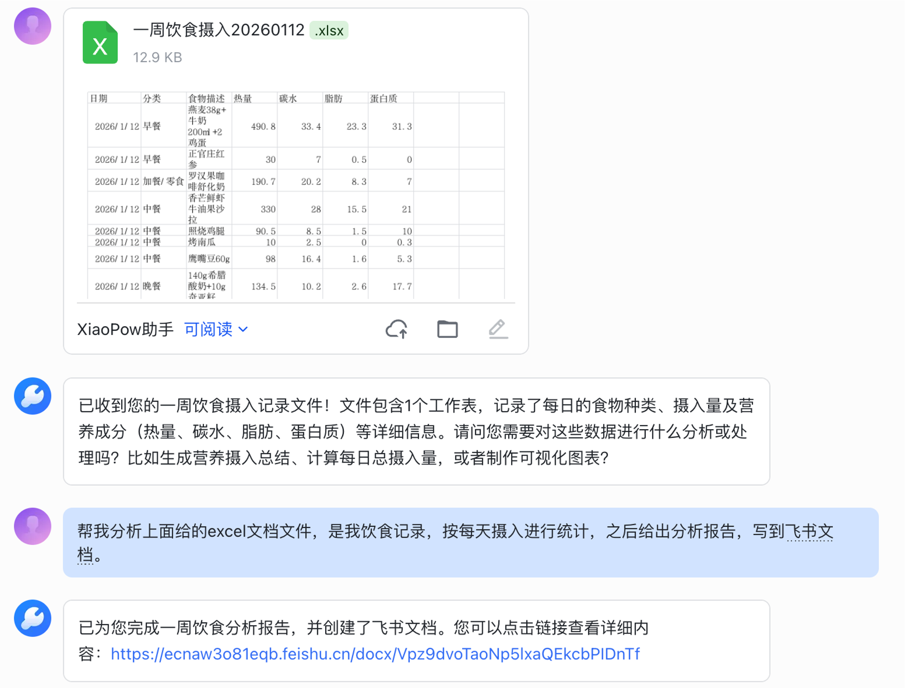

XiaoPaw 接到文件后，自动把文件保存到沙盒，然后激活 `xlsx` Skill。Sub-Crew 中的 AI 先用 pandas 读取数据，自主编写分析代码，生成图表和文字洞察，再调用 `feishu_ops` Skill 将报告写入飞书文档。几十秒后，飞书文档链接出现在对话框里。


整个过程你没有写一行代码，没有打开 Python，甚至不需要知道文件在哪里。

### 场景二：每日股票分析推送

你对 XiaoPaw 说：“每天早上九点，帮我分析一下茅台和腾讯的股价走势，发消息给我。”

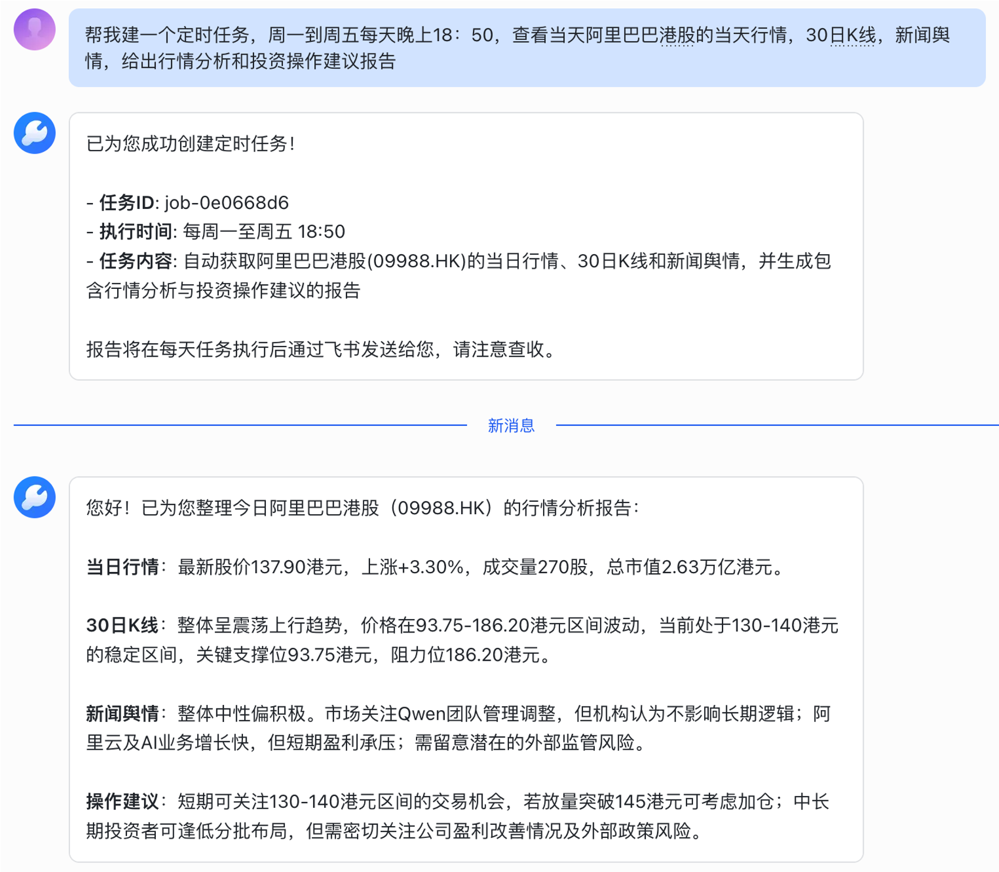

XiaoPaw 理解这是一个定时任务，自动写入 `cron/tasks.json`，注册一个 cron 表达式为 `0 9 * * *` 的任务。从明天开始，每天上午九点，CronService 触发一条虚拟消息进入 Runner 管道，系统自动完成分析并推送结果——即使你已经下线了。

这就是 XiaoPaw。接下来我们看它是怎么做到的。

---

## 二、为什么选飞书？以及如何接入

在动手写代码之前，我们先花几分钟回答一个问题：**为什么要把 XiaoPaw 部署在飞书，而不是微信、钉钉或者一个自己做的 Web 界面？**

### 2.1 选型理由：企业级生态的复利效应

飞书在国内的企业协作工具里有一个独特的定位——它不只是一个聊天工具，而是把 IM、文档、电子表格、多维表格、日历、会议室、审批流整合在一个平台里。这对 AI 助手来说意义重大：

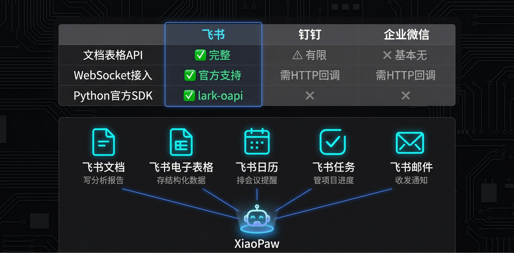

**用户不需要切换工具。** 他们在飞书对话框里发一句"帮我把这份 Excel 分析结果写进飞书文档"，XiaoPaw 就能直接操作飞书文档 API 完成任务。如果是微信，这条指令根本执行不了——没有可调用的文档 API。

**数据天然在平台内循环。** 销售数据在飞书电子表格，分析报告写到飞书文档，日程通知发到飞书消息——整个工作流闭环，不需要在多个 SaaS 之间跳来跳去。

**开放平台成熟度高。** 飞书开放平台提供了完整的 RESTful API + WebSocket 长连接 + 官方 SDK，还有详细的中文开发文档。开发者生态活跃，踩坑成本低。

对比总结：

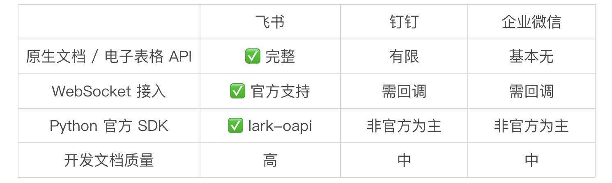

如果你所在的企业用的是钉钉或企业微信，架构思路是完全一样的，只需要替换 FeishuListener 这一层即可。

### 2.2 准备工作：创建飞书个人企业与应用

要开发飞书 Bot，你需要完成以下四步。**完整步骤图文详见飞书官方教程：**[https://open.feishu.cn/document/course](https://open.feishu.cn/document/course)，这里给出核心路径。

**第一步：创建飞书个人企业**

如果你没有企业飞书账号，可以用个人手机号免费创建一个"个人企业"（免费版，仅自己使用）。进入 [https://open.feishu.cn](https://open.feishu.cn/)，登录后选择"创建企业"，按提示填写即可。

**第二步：创建自建应用**

进入开发者后台 → “创建应用” → “自建应用”。填写应用名称（如 `XiaoPaw`）、描述，上传一个 Logo，提交后你会得到：

- App ID（应用唯一标识，格式 cli_xxxxxxxxxxxxxxxx）
- App Secret（应用密钥，只显示一次，请立即保存）

这两个值就是 `config.yaml` 里 `feishu.app_id` 和 `feishu.app_secret` 的来源。

**第三步：开启机器人能力并配置权限**

在应用后台找到"添加应用能力" → 开启"机器人"。然后进入"权限管理"，搜索并添加以下权限（XiaoPaw MVP 所需最小权限集）：

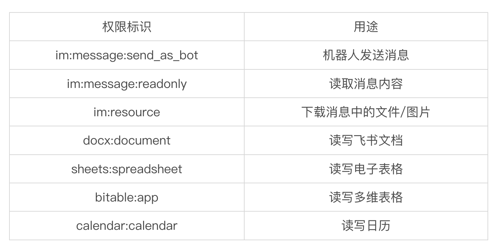

权限申请后需要"发布新版本"才会生效。

**第四步：启用 WebSocket 长连接**

在应用后台 → “事件与回调” → “事件配置” → 接入方式选择"长连接"（WebSocket）。

然后订阅事件：在"事件与回调" → "添加事件"中搜索并添加 `im.message.receive_v1`（接收消息事件）。

完成后回到"凭证与基本信息"页，把 `App ID` 和 `App Secret` 填入 `config.yaml`，就可以启动 XiaoPaw 了。

---

## 三、需求分析与整体架构

### 3.1 核心设计约束

在动手之前，我们面对三个约束条件：

1. 无公网 IP：企业内网部署，无法使用飞书 HTTP 回调模式
2. 能力要可扩展：不能把工具写死在代码里，业务方随时要加新能力
3. 执行要安全：Agent 不能直接访问宿主机文件系统，凭证不能进模型

这三个约束分别对应了三个核心设计决策：WebSocket 长连接、Skills 生态驱动、AIO-Sandbox 沙盒隔离。

### 3.2 整体架构

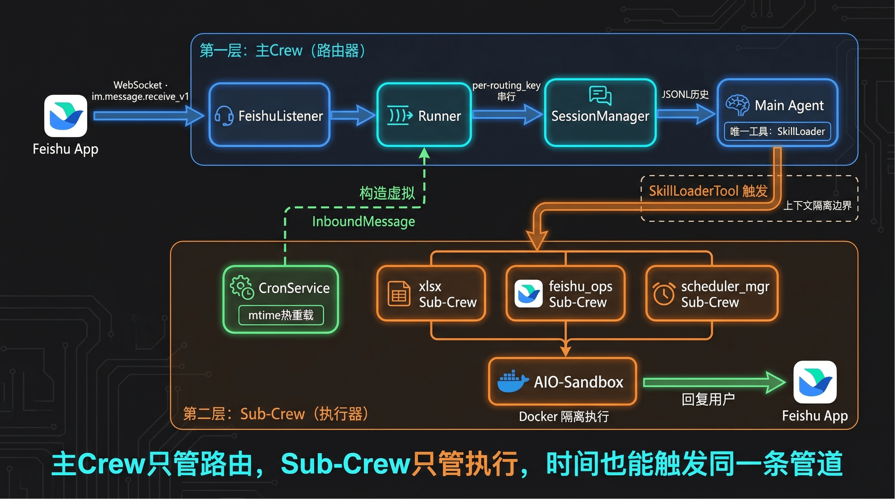

整个系统最核心的多智能体模式是**两层架构**：

- 主 Crew：单 Agent + 单 Task，只负责理解用户意图、决策调用哪个 Skill
- Sub-Crew：由主 Agent 通过 SkillLoaderTool 动态创建，在沙盒中执行具体任务

这正是第 3 课讲的"上下文隔离"的工程实现——主 Crew 的对话历史不传入 Sub-Crew，Sub-Crew 的执行细节也不污染主 Crew，两层之间只传递任务摘要。

这不只是功能设计，更是一种**防腐机制**。Transformer 架构会 attend to 上下文里的所有内容——Sub-Crew 的错误信息、幻觉输出、执行噪声一旦涌入主 Agent 上下文，就会持续影响主 Agent 对用户意图的判断，而且这是架构层面无法规避的。两层隔离的价值在于：让"坏信息根本进不了主 Agent"，而不是"进去了再想办法清除"。

### 3.3 XiaoPaw 当前集成的 Skills

XiaoPaw 目前内置 9 个 Skills，覆盖文件处理、飞书平台操作、信息获取和系统管理四个领域：

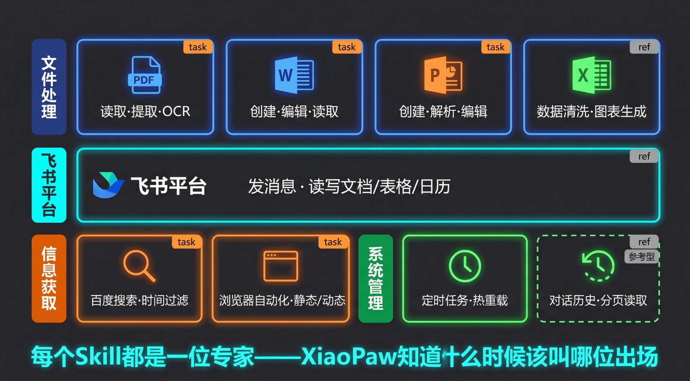

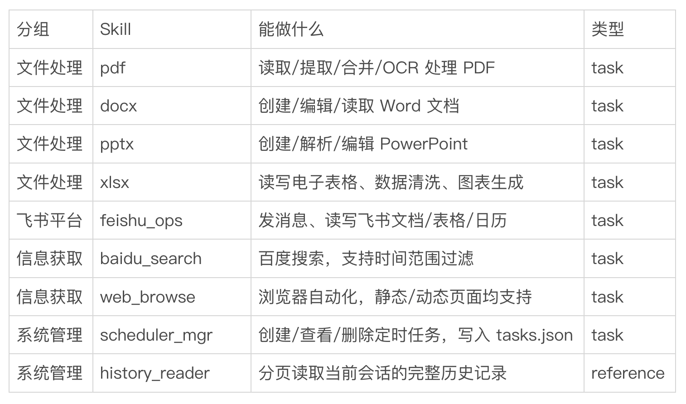

task 类型的 Skill 会触发独立 Sub-Crew 在沙盒中执行；`history_reader` 是 reference 类型，直接将操作规范注入主 Agent 上下文，无需启动 Sub-Crew。

---

## 四、核心实现：一条消息的完整旅程

### 4.1 飞书接入：WebSocket 长连接

>
> 💡 课程说明：本节代码路径 xiaopaw/feishu/listener.py
>
> 为什么用 WebSocket 而不是 HTTP 回调？因为 HTTP 回调需要飞书服务器主动往你的服务器发请求，这意味着你必须有公网 IP。WebSocket 模式反过来，是你的服务主动发起连接到飞书，内网部署完全没问题。
>

`FeishuListener` 封装了 lark-oapi 的 WebSocket 客户端，把飞书原始事件转换为内部的 `InboundMessage` 结构：

```python
# xiaopaw/feishu/listener.py
 
class _XiaoPawEventHandler(EventDispatcherHandler):
    """自定义事件处理器：拦截 im.message.receive_v1，并转发给 Runner."""
 
    def do_without_validation(self, payload: bytes) -> None:
        data = json.loads(payload.decode("utf-8"))
        event_type = data.get("header", {}).get("event_type")
 
        if event_type != "im.message.receive_v1":
            return  # 其它事件暂不处理
 
        # 💡 核心点：resolve_routing_key 根据聊天类型生成路由键
        # p2p:{open_id} / group:{chat_id} / thread:{chat_id}:{thread_id}
        routing_key = resolve_routing_key(
            chat_type=chat_type,
            sender_id=sender_open_id,
            chat_id=chat_id,
            thread_id=thread_id,
        )
 
        inbound = InboundMessage(
            routing_key=routing_key,
            content=content,
            attachment=attachment,  # 文件 / 图片元信息
            msg_id=msg_id,
            ...
        )
 
        # 💡 核心点：跨线程调度，lark-oapi 的 WebSocket 在独立线程中运行
        # asyncio.run_coroutine_threadsafe 把协程安全地投递到主事件循环
        asyncio.run_coroutine_threadsafe(self._on_message(inbound), self._loop)
```

有一个工程细节值得关注：lark-oapi 的 `ws.Client.start()` 是**阻塞同步方法**，内部自己管事件循环。我们在 `listener.start()` 中用 `loop.run_in_executor(None, ...)` 把它放到线程池运行，避免嵌套事件循环冲突。这是第 15 课讲过的异步双通道思路的应用场景。

---

### 4.2 Runner：per-routing_key 串行队列

>
> 💡 课程说明：本节代码路径 xiaopaw/runner.py
>
> 消息进来之后，交给 Runner 处理。Runner 最核心的设计是 per-routing_key 串行队列：
>

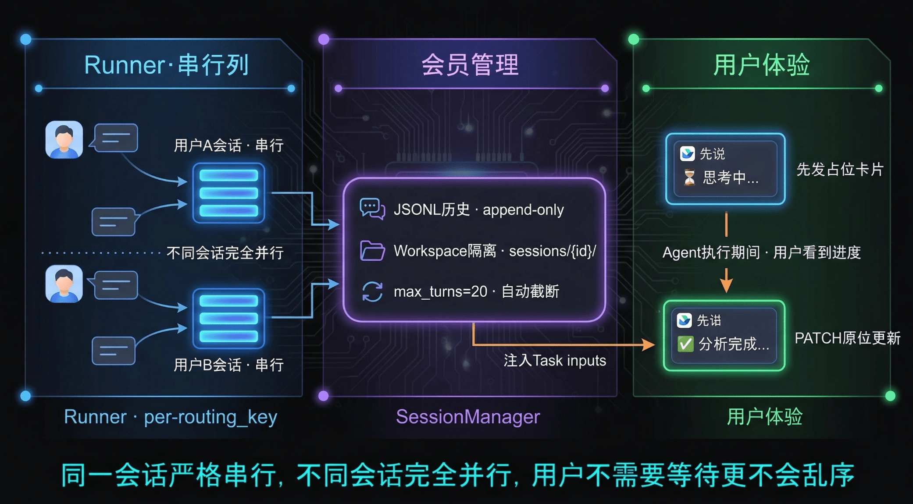

```python
# xiaopaw/runner.py
 
class Runner:
    def __init__(self, ...):
        self._queues: dict[str, asyncio.Queue] = {}
        self._workers: dict[str, asyncio.Task] = {}
        self._dispatch_lock = asyncio.Lock()
 
    async def dispatch(self, inbound: InboundMessage) -> None:
        """外部入口：消息入队，确保同一会话串行执行"""
        key = inbound.routing_key
        async with self._dispatch_lock:
            if key not in self._queues:
                # 💡 核心点：每个 routing_key 对应一个独立的 Queue + Worker
                # 不同会话之间完全并行；同一会话内严格串行（防止消息乱序）
                self._queues[key] = asyncio.Queue()
                self._workers[key] = asyncio.create_task(self._worker(key))
        await self._queues[key].put(inbound)
```

为什么要串行？因为同一个用户（或群组）可能连续发来多条消息，如果并行处理，Agent 的执行顺序会乱，Session 历史也会出现竞态写入。串行队列是最简单的解法。

`_worker` 会在队列空闲超过 300 秒后自动退出，释放内存——不活跃的会话不占资源。

每条消息在 `_handle` 方法中的处理流程：

```plain
Slash Command 拦截 → 动态加载 Session → 附件下载 → 加载历史
  → 发送 Loading 卡片 → 执行 Agent → 写 Trace + Session → 更新卡片（降级发消息）
```

Slash Command（`/new`、`/verbose`、`/help`、`/status`）在这里被直接拦截，不进入 Agent，不写历史，响应极快。

**Loading 卡片的用户体验设计**：Agent 执行通常需要 5–30 秒，如果什么反馈都没有，用户会反复重发消息。Runner 在调用 Agent 前先通过 `FeishuSender.send_thinking()` 发出一张"⏳ 思考中…"的交互式卡片，同时拿到该消息的 `card_msg_id`。Agent 执行完毕后，调用 `update_card(card_msg_id, reply)` 直接在原位把卡片内容替换为最终回复（使用 `lark_md` 格式支持 Markdown 渲染）。如果 PATCH 失败则降级为 `send()` 另发一条新消息。

---

### 4.3 Session 管理：让对话有记忆

>
> 💡 课程说明：本节代码路径 xiaopaw/session/manager.py
>
> SessionManager 负责管理对话历史，底层使用两种存储：
>

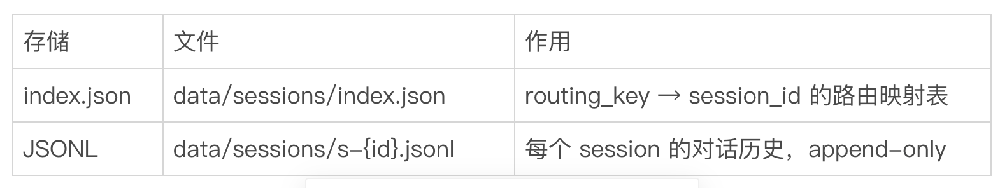

JSONL 格式天然适合对话历史：每行一条记录，只追加不修改，崩溃重启不丢数据。

```python
# xiaopaw/session/manager.py
 
async def load_history(self, session_id: str, max_turns: int = 20) -> list[MessageEntry]:
    """读取 session 的对话历史，截断到最近 max_turns 条"""
    messages = []
    for line in jsonl_path.read_text().strip().split("\n"):
        record = json.loads(line)
        if record.get("type") != "message":
            continue  # 跳过 meta 行
        messages.append(MessageEntry(role=record["role"], content=record["content"], ...))
 
    # 💡 核心点：只保留最近 max_turns 条，超出部分通过 history_reader Skill 按页查询
    if len(messages) > max_turns:
        messages = messages[-max_turns:]
    return messages
```

写入时用了两个并发安全设计：`index.json` 用 `asyncio.Lock` + write-then-rename 原子写入；JSONL 用 per-session 级别的 `asyncio.Lock` 防止并发追加乱序。

**Workspace 隔离**同步发生在这里：每个 session 在沙盒中有独立目录 `/workspace/sessions/{session_id}/`，用户上传的文件放在 `uploads/`，Skill 的输出写到 `outputs/`，临时文件放 `tmp/`。不同会话的文件完全隔离，互不可见。

---

### 4.4 主 Agent：极简路由器

>
> 💡 课程说明：本节代码路径 xiaopaw/agents/main_crew.py、xiaopaw/agents/config/agents.yaml
>
> 这是整个系统最关键的设计决策：主 Agent 被故意设计得极简。
>

看 `agents.yaml` 中主 Agent 的定义：

```yaml
# xiaopaw/agents/config/agents.yaml
 
orchestrator:
  role: XiaoPaw 工作助手
  goal: >
    理解用户的工作需求，通过合理使用 Skills 完成任务，给出准确、有帮助的回复。
    能力有限时，诚实告知用户并列出可用的 Skills。
   backstory: >
    你是 XiaoPaw（小爪子），部署在飞书的本地工作助手，专为企业内网场景设计。
    你的核心工具是 SkillLoaderTool，这是通往各种专业能力的门户。
    ...
   max_iter: 50
```

主 Agent 没有任何领域工具，只有两个工具：`SkillLoaderTool`（能力入口）和 `IntermediateTool`（记录中间思考，用于可观测性）。它的唯一职责是"理解用户意图 → 决定调哪个 Skill → 组织回复"，所有真正的执行都委托出去。

在 Python 层，用**工厂模式**防止 CrewAI 内部状态污染：

```python
# xiaopaw/agents/main_crew.py
 
def _build_crew(session_id, history_all, step_callback, sandbox_url) -> Crew:
    """构建主 Crew 实例（每次调用返回新实例，防止状态污染）。"""
 
    # 💡 核心点：每次请求构建新实例，上一轮的执行历史不会带入下一轮
    orchestrator = Agent(
        **orchestrator_cfg,   # 从 YAML 加载人设
        llm=AliyunLLM(model="qwen3-max", ...),
        tools=[SkillLoaderTool(session_id=session_id, ...), IntermediateTool()],
        verbose=True,
    )
 
    main_task = Task(
        **task_cfg,           # description 和 expected_output 从 YAML 加载
        agent=orchestrator,
        output_pydantic=MainTaskOutput,   # 强制结构化 JSON 输出
    )
 
    return Crew(
        agents=[orchestrator],
        tasks=[main_task],
        process=Process.sequential,
        step_callback=step_callback,   # verbose 模式：把推理过程推送到飞书
    )
```

`step_callback` 是这里的 verbose 模式实现：当用户开启 `/verbose on` 后，Agent 每轮 ReAct 循环的 `Thought` 都会实时推送到飞书，用户可以看到 AI 正在"思考什么"。这在调试和建立用户信任上都很有价值。

启动时，`build_agent_fn` 把这些打包成一个闭包供 Runner 注入：

```python
# xiaopaw/agents/main_crew.py
 
async def agent_fn(user_message, history, session_id, routing_key, root_id, verbose):
    crew = _build_crew(session_id=session_id, history_all=history, ...)
    result = await crew.akickoff(inputs={
        "user_message": user_message,
        # 💡 核心点：历史作为文本注入 Task description，而不是系统提示词
        # 超出 max_turns 的历史用 history_reader Skill 按页查询
        "history": _format_history(history, max_turns=max_history_turns),
    })
    return result.pydantic.reply
 
---
```

### 4.5 SkillLoaderTool：渐进式披露

>
> 💡 课程说明：本节代码路径 xiaopaw/tools/skill_loader.py
>
> 这是第 16 课渐进式披露（Progressive Disclosure）的完整工程落地。还记得我们在 16 课讲的核心矛盾吗——
>

**如果把所有 Skill 的完整指令都塞进主 Agent 的上下文，Token 消耗会爆炸。**

XiaoPaw 同样采用两阶段加载：启动时只解析各 SKILL.md 的 frontmatter，按需调用时才加载完整指令。与 16 课演示代码相比，XiaoPaw 的实现多了两个生产级细节：**session_id 绑定**（每个 Skill 调用知道自己在哪个会话里）和**沙盒路径注入**（消灭 LLM 的路径幻觉）。

**阶段一：初始化时只解析 frontmatter**

```python
# xiaopaw/tools/skill_loader.py
 
def _build_description(self) -> None:
    """💡 核心点：渐进式披露第一阶段
    只读 SKILL.md 的 YAML frontmatter，构建轻量 XML 注入 description。
    主 Agent 看到工具时只知道"有哪些 Skill、各自用途"，不加载完整指令。
    """
    for skill_conf in skills_conf:
        skill_md = skill_md_path.read_text()
        desc = self._extract_frontmatter_description(skill_md)  # 只取 description 字段，≤200 字
        xml_parts.append(f"""
  <skill>
    <name>{name}</name>
    <type>{skill_type}</type>
    <description>{desc}</description>
  </skill>""")
 
    self.description = (
        "当需要完成的任务涉及以下 XML 列表中的技能时，调用此工具。\n"
        f"当前 session 工作目录：{session_dir}/\n"
        + "\n".join(xml_parts)
    )
```

**阶段二：调用时按需加载完整指令**

```python
def _get_skill_instructions(self, skill_name: str) -> str:
    """💡 核心点：渐进式披露第二阶段
    读取完整 SKILL.md，剥离 frontmatter，拼接沙盒路径替换指令。
    结果写入缓存，同一 Skill 只读一次文件。
    """
    if skill_name in self._instruction_cache:
        return self._instruction_cache[skill_name]
 
    content = (skill_path / "SKILL.md").read_text()
    stripped = re.sub(r"^---\n.*?\n---\n?", "", content, flags=re.DOTALL)
 
    # 拼接沙盒路径约束，消灭 LLM 的路径幻觉
    sandbox_directive = (
        f"\n\n<sandbox_execution_directive>\n"
        f"Skill 资源挂载路径：{_SANDBOX_SKILLS_MOUNT}/{skill_name}/\n"
        f"Session 工作目录：{session_dir}/\n"
        f"  - 输入文件：{session_dir}/uploads/\n"
        f"  - 输出文件：{session_dir}/outputs/\n"
        f"</sandbox_execution_directive>"
    )
    result = stripped + sandbox_directive
    self._instruction_cache[skill_name] = result
    return result
```

当主 Agent 决定调用 `xlsx` Skill 时，完整的 SKILL.md 才被加载，拼上沙盒路径约束，一起注入 Sub-Crew。这样，主 Agent 的上下文始终保持轻量。

---

### 4.6 Sub-Crew + AIO-Sandbox：隔离执行

>
> 💡 课程说明：本节代码路径 xiaopaw/agents/skill_crew.py
>
> Sub-Crew 是真正干活的地方。每次 SkillLoaderTool 触发任务型 Skill，都调用 build_skill_crew() 创建一个全新的 Sub-Crew 实例。XiaoPaw 在这里做了一个和 16 课演示代码不同的设计取舍：不在接口层做工具白名单过滤，而是全量开放 AIO-Sandbox 的工具。
>

```python
# xiaopaw/agents/skill_crew.py
 
def build_skill_crew(skill_name, skill_instructions, session_id, sandbox_mcp_url) -> Crew:
 
    # 💡 核心点：AIO-Sandbox 所有工具全量开放，不设白名单过滤
    # 这和第 16 课 build_skill_crew() 用 create_static_tool_filter 做 4 工具白名单的思路不同。
    # XiaoPaw 的取舍：web_browse Skill 依赖 browser_* 系列工具，如果在接口层做白名单，
    # 就必须维护一张"哪些 Skill 能用哪些工具"的矩阵，复杂度高且脆弱。
    # 安全约束改由 Agent backstory 承载：通过指令约束行为，而非 API 层拦截工具。
    # 这是"行为约束优先于接口白名单"的工程取舍。
    sandbox_mcp = MCPServerHTTP(
        url=sandbox_mcp_url,
    )
 
    # 💡 核心点：Sub-Crew 的 role/goal/backstory 不来自 YAML，而是动态生成
    # 区别于主 Crew：主 Crew 人设固定，Sub-Crew 人设按 Skill 定制
    skill_agent = Agent(
        role=f"{skill_name.upper()} Skill 执行专家",
        goal=f"严格按照 {skill_name} Skill 的操作规范，在 AIO-Sandbox 中完成任务",
        backstory=(
            f"当前 Session 沙盒工作目录：{session_dir}/\n"
            f"{skill_instructions}"   # 完整的 SKILL.md 指令注入 backstory
        ),
        llm=AliyunLLM(model="qwen3-max", ...),
        mcps=[sandbox_mcp],   # 💡 核心点：CrewAI 原生 MCP 接入，框架自动管理工具转换
        max_iter=20,
    )
 
    skill_task = Task(
        description="根据以下任务要求，使用你掌握的 Skill 操作规范完成任务。\n 任务要求：{task_context}",
        expected_output="一份结构化的任务执行结果 JSON，包含 errcode、errmsg 及任务输出字段",
        agent=skill_agent,
    )
 
    # 💡 核心点：Sub-Crew 不传入 step_callback
    # verbose 模式只推主 Agent 的推理，Sub-Crew 的底层执行细节不推给用户（避免噪音）
    return Crew(agents=[skill_agent], tasks=[skill_task], process=Process.sequential)
```

然后 SkillLoaderTool 调用它：

```python
# xiaopaw/tools/skill_loader.py
 
async def _arun(self, skill_name: str, task_context: str = "") -> str:
    """💡 核心点：FastAPI 异步调用链的主路径，直接 await Sub-Crew"""
    crew = build_skill_crew(
        skill_name=skill_name,
        skill_instructions=instructions,
        session_id=self._session_id,
        sandbox_mcp_url=self._sandbox_url,
    )
    result = await crew.akickoff(inputs={"task_context": task_context})
    return str(result)
 
def _run(self, skill_name: str, task_context: str = "") -> str:
    """💡 核心点：同步 fallback，ThreadPoolExecutor 提供独立 event loop
    规避 'cannot run nested event loop' 报错
    """
    with concurrent.futures.ThreadPoolExecutor(max_workers=1) as pool:
        future = pool.submit(asyncio.run, self._execute_skill_async(skill_name, task_context))
        return future.result()
```

`_arun` 和 `_run` 双通道对应了第 13 课的异步双通道模式——第 16 课的 SkillLoaderTool 也是完全相同的实现，如果你当时跟着敲过代码这里应该很眼熟。CrewAI 框架在 `arun()` 中调 `_arun()`，在 `run()` 中调 `_run()`，自动选路。

---

### 4.7 定时任务：CronService

>
> 💡 课程说明：本节代码路径 xiaopaw/cron/service.py
>
> CronService 的设计思路非常干净：把定时任务统一转换为 InboundMessage，复用 Runner 管道。
>

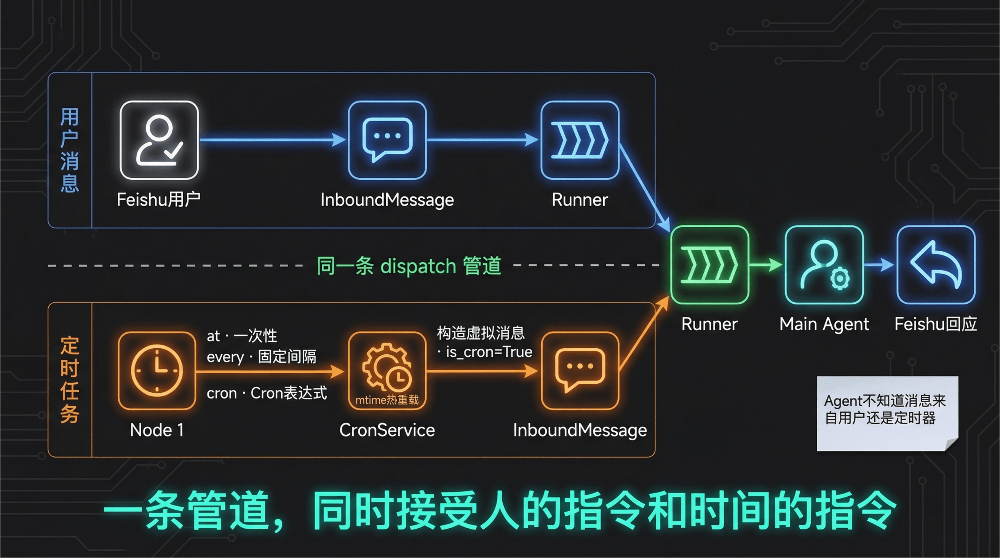

定时任务配置文件 `cron/tasks.json` 支持三种调度模式：

```json
// 一次性任务（at）
{ "schedule": { "kind": "at", "at_ms": 1740000000000 } }
 
// 固定间隔（every）
{ "schedule": { "kind": "every", "every_ms": 3600000 } }
 
// Cron 表达式（cron）
{ "schedule": { "kind": "cron", "expr": "0 9 * * *", "tz": "Asia/Shanghai" } }
```

每次触发时，CronService 构造一条 `is_cron=True` 的 `InboundMessage`，直接调用 `runner.dispatch()`：

```python
# xiaopaw/cron/service.py
 
async def _fire(self, job: CronJob) -> None:
    """触发一个 job：构造 InboundMessage 并 dispatch。"""
    inbound = InboundMessage(
        routing_key=job.payload.routing_key,   # 推送到哪个飞书会话
        content=job.payload.message,           # 触发的指令文本
        msg_id=f"cron_{uuid.uuid4().hex[:12]}",
        is_cron=True,
    )
    # 💡 核心点：复用 Runner 管道，定时任务和用户消息走完全相同的处理链路
    # Agent 不知道消息来自用户还是定时器——这是良好的关注点分离
    await self._dispatch_fn(inbound)
```

CronService 还支持**热重载**：检测 `tasks.json` 的 `mtime + size`，Agent 写入新定时任务后，CronService 自动感知变化并重新加载，无需重启进程。

---

## 五、进程启动：把所有服务串起来

>
> 💡 课程说明：本节代码路径 xiaopaw/main.py
>
> 理解了每个模块之后，再来看 main.py，就会发现它非常清晰——按顺序初始化，然后用 asyncio.gather 并行启动所有服务：
>

```python
# xiaopaw/main.py（启动序列）
 
async def async_main() -> None:
    # 1. 读取 config.yaml
    # 2. 初始化日志 + Prometheus metrics
    # 3. 构建飞书 HTTP Client
    # 4. 初始化 SessionManager、FeishuSender、FeishuDownloader、CleanupService
 
    # 💡 核心点：凭证在启动时写入沙盒 .config 目录，之后 LLM 永远不会看到它
    cleanup_svc.write_feishu_credentials(app_id=app_id, app_secret=app_secret)
 
    # 5. 构建 agent_fn 工厂
    agent_fn = build_agent_fn(sender=sender, sandbox_url=sandbox_url, ...)
 
    # 6. 构建 Runner（注入 agent_fn）
    runner = Runner(session_mgr=session_mgr, sender=sender, agent_fn=agent_fn, ...)
 
    # 7. 启动 CronService（注入 runner.dispatch）
    cron_svc = CronService(data_dir=data_dir, dispatch_fn=runner.dispatch)
    await cron_svc.start()
 
    # 8. 并行启动所有服务
    await asyncio.gather(
        asyncio.create_task(run_forever(listener), name="feishu-listener"),
        asyncio.create_task(start_metrics_server(...), name="metrics-server"),
        asyncio.create_task(_daily_cleanup_loop(cleanup_svc), name="cleanup-scheduler"),
    )
```

注意依赖注入的顺序：`agent_fn` 依赖 `sender`，`runner` 依赖 `agent_fn`，`cron_svc` 依赖 `runner.dispatch`。这条依赖链从内到外逐步组装，没有任何全局变量。

---

## 课程总结

- 我们看到了 XiaoPaw 的两个完整演示场景，感受了一个真实企业级 AI 助手的运行效果。
- 我们理解了飞书的选型逻辑——IM + 文档 + 表格 + 日历的数据闭环，让 AI 助手天然有了可操作的基础设施。
- 我们看到了 XiaoPaw 当前集成的 9 个 Skills，从文件处理到飞书操作到信息获取，覆盖真实工作场景的主要需求。
- 我们拆解了 两层 MAS 架构的工程实现：极简主 Crew 负责路由，Sub-Crew 按需创建，两层上下文完全隔离，这是第 3 课"上下文隔离"的落地。
- 我们理解了 Runner + Session 设计——per-routing_key 串行队列防乱序，JSONL 历史持久化，Workspace 按会话隔离，Loading 卡片消除等待焦虑。
- 我们看到了 CronService 复用 Runner 管道的设计——定时任务与用户消息走完全相同的链路，Agent 不知道消息从哪里来。
- 我们理解了 Sub-Crew 全量工具开放 + backstory 行为约束的取舍——这和第 16 课的白名单方案是两种不同的工程选择，原因在于 web_browse Skill 对浏览器工具的依赖。

这套架构是可以直接拿走的。代码仓库里每一个关键设计点都有 `💡【第X课】` 注释，方便你把代码和课程对应起来消化。

**下节课预告：** 系统跑起来了，但 Agent 还没有记忆。每次对话结束，用过的上下文就消失了。**第 18 课，我们将深入记忆管理**，看看 Short-term Memory、Long-term Memory 和 Entity Memory 分别在 CrewAI 中如何工作，以及如何让 XiaoPaw 真正"记住"你。我们下节课见！

---

## 课后思考题

1. XiaoPaw 的主 Agent 只有 SkillLoaderTool 一个能力工具。如果未来要给主 Agent 直接加一个"网页搜索"工具（而不是做成 Skill），在现有架构下应该怎么改？这样做和把它包成 Skill 相比，各有什么利弊？（提示：从上下文隔离、Token 消耗、错误传播三个角度思考。）
2. CronService 把定时任务和用户消息统一转换为 InboundMessage 复用 Runner 管道。这个设计的好处很明显，但有没有潜在的问题？如果某个定时任务执行时间很长，会对同一个 routing_key 的用户消息产生什么影响？应该如何处理？

欢迎在评论区分享你的真实案例，我们下一讲见！
---

来源：极客时间《企业级多智能体设计实战》
提取日期：2026-06-02
