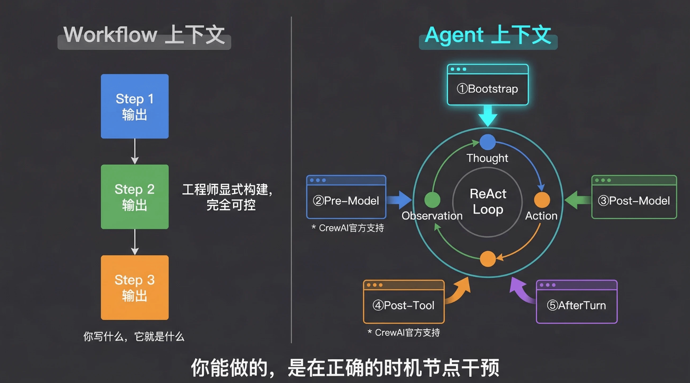
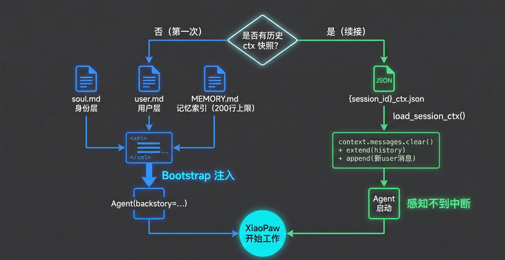
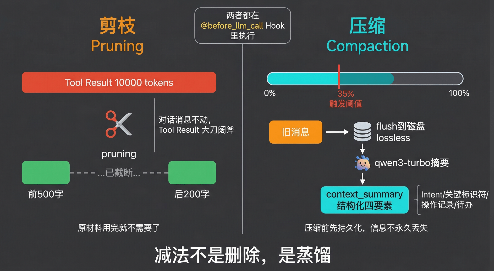
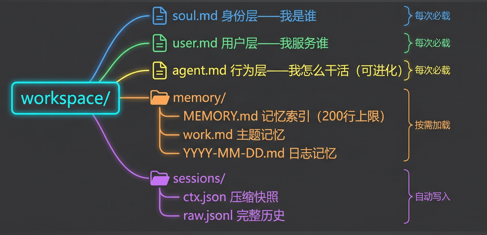
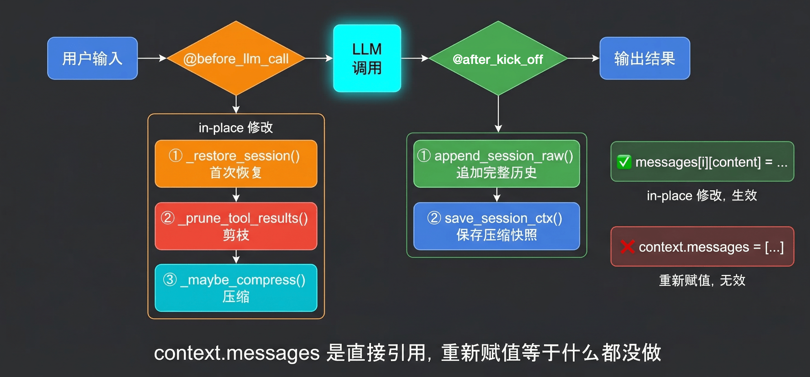

# 19｜上下文的生命周期：Bootstrap、剪枝与压缩

> 来源：极客时间《企业级多智能体设计实战》
> 当前播放：19｜上下文的生命周期：Bootstrap、剪枝与压缩
> 提取日期：2026-06-02
> 原文长度：21464 字

---

欢迎回来！

上节课我们建立了上下文工程的认知框架——记忆的本质是构建 message list，治理的核心是加法和减法。你现在知道了"该做什么"，但还不知道"在哪里做"。

这就像一个外科医生，知道病人需要切除肿瘤（减法）和植入支架（加法），但手术刀该从哪里下？什么时候下？

今天这节课，我们要回答的就是这个问题：**Agent 的上下文，在它运行的整个过程中，有哪些时刻是你能"动手术"的？** 这些时刻，就是上下文的生命周期节点。而且我们不只是讲概念——今天会写真正的代码，用 CrewAI 的 `backstory` 注入做 Bootstrap，用官方 `@before_llm_call` Hook 在模型调用前实现剪枝和压缩。

---

## 一、 认知原点：上下文生命周期的本质到底是什么？

先把一个关键区别说清楚。



在 Workflow 里，上下文是你直接写的——你决定 Step 1 的输出传给 Step 2，Step 2 的输出传给 Step 3。每一步的 message list 是你在代码里显式构建的，完全可控。

但 Agent 不一样。Agent 运行在 ReAct 循环里：Thought → Action → Observation → Thought → Action → Observation……每一轮循环，模型自己决定调什么工具、传什么参数，工具返回的结果自动塞进 message list。你没法提前知道 Agent 会走哪条路，也没法提前决定 message list 里会有什么。

这意味着：**Agent 的上下文是"生长"出来的，不是"写"出来的。** 你能做的，不是直接控制内容，而是在特定的时机节点进行干预。

**上下文生命周期的本质，就是你在 ReAct 循环中能够干预上下文的时机窗口。** 知道了这些窗口在哪里，你才能把上节课讲的"加法减法"落地成真正的代码。

一个完整的上下文生命周期包含六个节点：

CrewAI 目前提供两个官方干预点：Bootstrap 通过 Agent 的 `backstory` 参数注入 system prompt（①号节点）；剪枝和压缩通过 `@before_llm_call` Hook 在每次模型调用前拦截 messages（②号节点）。六个节点中 ③④⑤⑥ 在 CrewAI 里目前没有细粒度原生支持，但这两个关键节点已足够实现本课的三大操作。

---

## 二、 为什么需要它：不干预会怎样？

学员常见误区：上下文长了不就是"变慢"？大不了买更多 token。

真相是：不干预的上下文会导致三种生产级崩溃——性能崩溃、逻辑崩溃、成本崩溃。

**场景 1：上下文爆炸（Context Overflow）**

一个电商运营 Agent，需要对比 100 款商品。每款商品的描述、评价数据、竞品分析被完整塞进上下文。跑了 30 轮之后，token 超限，报错退出。重启之后，没有之前的分析结果，从头再跑一遍。

这是任何 while 循环都会遇到的问题。Agent 运行的时间越长，上下文越大，必然有个极限。没有主动管理机制，迟早撞墙。

**场景 2：Context Rot（上下文腐烂）**

一个代码审查 Agent，分析了 50 个文件之后，开始对已经审查过的文件重复提意见，甚至互相矛盾。上下文里堆满了各种分析结果，模型不知道该关注哪一段。

这不是"变慢"——这是模型真的变笨了。Transformer 注意力机制是 n² 复杂度，上下文越大，注意力越稀释。重要信息淹没在噪声里，模型开始出错。研究数据显示，上下文超过某个长度后，模型性能下降 15-47%。

**场景 3：Context Poisoning（上下文污染）**

一个客服 Agent 处理了一个刁钻用户的投诉。用户在对话中植入了错误信息：“根据你们之前的政策，退款期限是 90 天。” Agent 把这句话当成事实，记进了对话，后续所有回复都建立在"90 天"这个错误基础上。

Transformer 会 attend to 上下文里的所有内容——包括错误信息。错误信息一旦进入上下文，就会持续影响后续输出，这是架构层面无法规避的。

三种崩溃的共同根源：Agent 的上下文是"生长"出来的，不加干预就会无限增长、腐烂、污染。你必须主动管理它。

---

## 三、 工程实现：Bootstrap、剪枝与压缩

>
> 🧠 回忆一下：上节课我们讲到上下文治理的核心是"加法和减法"——加法让模型知道该知道的，减法让上下文没有不该有的。今天的三个操作，正是这两件事的具体落地：Bootstrap 是加法，剪枝和压缩是减法。
>

>
> 💡 课程说明：本节代码已同步至 GitHub，地址：https://github.com/kid0317/crewai_mas_demo/blob/main/m3l19/m3l19_context_mgmt.py
>

### 3.1 三个操作的通用原理

在看 CrewAI 代码之前，先把三个操作的概念搞清楚——它们是与框架无关的通用原理。

**Bootstrap：给 Agent 一个"起点"**



Bootstrap 解决的问题：Agent 默认每次对话从零开始，什么都不知道。

Bootstrap 是在 Agent 开始运行之前，把"它需要知道的东西"主动注入 system prompt 的过程。注入什么？两类：身份与规则（我是谁、我怎么工作、有哪些约束，固定不变）；状态与记忆（我已经知道了什么，随时间增长，但加载时截取精华）。

Bootstrap 三个原则：只注入"导航骨架"，不注入"全部内容"——索引 > 全文；结构化标签分块（`<soul>` / `<user_profile>` / `<memory_index>`），模型定位更准确；硬上限保护——每一块都有字数 / 行数上限，防止膨胀。

**剪枝（Pruning）：控制 Tool Result 膨胀**



最大的上下文膨胀体不是对话，是 Tool Result。一次搜索工具调用可能返回 10,000 tokens 的网页全文。10 次工具调用之后，上下文里有 100,000 tokens 是原始工具输出——大部分模型根本不需要。

剪枝的黄金规则：对话消息尽量不动（有语义连贯性要求）；Tool Result 可以大刀阔斧（它只是"原材料"，模型用完就不需要了）；如果 Tool Result 里有关键 ID 或数字，剪枝前先提取出来单独保存。

**压缩（Compaction）：把历史变成摘要**

压缩解决的问题：随着对话进行，早期消息越来越不相关，但依然占用空间。

什么时候触发？不要等到 token 快满了再触发（80% 阈值是很多教程的建议，但是错的）。Context Rot 表明上下文变长本身就导致性能下降，应该在 **30-40%** 时主动触发。

压缩必然丢失信息。所以有一个关键策略：**压缩前先持久化（lossless 策略）**——在触发压缩之前，先把重要信息写到磁盘文件里。这样即使压缩丢掉了细节，磁盘上还有完整记录。

### 3.2 在 CrewAI 中控制上下文

CrewAI 提供两个干预点，对应两种写法。

**干预点 1：**`backstory` 参数（Bootstrap 的实现位置）

CrewAI 的 Agent 定义时，`backstory` 参数会被渲染进 system prompt。Bootstrap 的逻辑在这里——定义 Agent 时读取记忆文件，拼成结构化字符串注入：

```python
agent = Agent(
    role="个人助手",
    goal="...",
    backstory=build_bootstrap_prompt(WORKSPACE_DIR),  # 💡 Bootstrap 在这里
    llm=LLM(model="qwen3-max"),
)
```

**干预点 2：**`@before_llm_call` Hook（剪枝 + 压缩的实现位置）

CrewAI 提供官方的 LLM 调用前后 Hook 系统，不需要继承或 monkey-patch：

| Hook | 触发时机 | 返回值 | 典型用途 |
| --- | --- | --- | --- |
| @before_llm_call | 每次 LLM 调用前 | None（继续）/ False（阻止） | 剪枝、压缩、session 恢复 |
| @after_llm_call | 每次 LLM 调用后 | 修改后的字符串 / None（保持原样） | 脱敏、格式化（⚠️ 存在副作用，见下文） |

>
> ⚠️ @after_llm_call使用注意：CrewAI 当前版本只要注册了 after hook，就会对 LLM answer 强制 str()，导致 executor 的 isinstance(answer, list) 判断失败，工具调用无法执行。不要用 after hook 做 session 持久化——持久化应在 kickoff() 返回后由 main() 统一完成。
>

Hook 写在 `@CrewBase` 类方法上，`@CrewBase` 会自动检测方法上的标记并注册为 Crew 级别 Hook，作用域限定在本 Crew，不影响其他 Crew：

```python
from crewai.hooks import before_llm_call, LLMCallHookContext
 
@CrewBase
class XiaoPawCrew:
 
    @before_llm_call
    def before_llm_hook(self, context: LLMCallHookContext) -> bool | None:
        prune_tool_results(context.messages)       # ① 剪枝
        maybe_compress(context.messages, context)  # ② 压缩
        return None  # 返回 None 继续调用，返回 False 则阻止
```

你可能会问：为什么不叫 `@before_llm_call_crew`，而是直接叫 `@before_llm_call`？

因为 CrewAI 只有一个 `@before_llm_call` 装饰器。当你把它写在 `@CrewBase` 类方法上时，框架会自动识别并将其注册为 Crew 级别的 Hook——作用域自动限定，不需要额外的 `_crew` 后缀。

**重要约束：in-place 修改**

```python
# ✅ 正确：in-place 修改
context.messages[i]["content"] = pruned_content
context.messages.clear()
context.messages.extend(new_messages)
 
# ❌ 错误：重新赋值会断开内部引用，修改无效
context.messages = [...]
```

这是 CrewAI 官方文档明确标注的约束：`context.messages` 是 executor 内部的直接引用，重新赋值会断开这个引用，修改对框架不可见。

### 3.3 代码实战：XiaoPaw 个人助手

整体结构一目了然：



**Bootstrap：加载 workspace 文件**

```python
from pathlib import Path
from crewai import Agent, LLM
from crewai.project import CrewBase, agent, task, crew
from crewai.hooks import before_llm_call, LLMCallHookContext
from crewai_tools import FileReadTool, FileWriterTool, ScrapeWebsiteTool
from tools import BaiduSearchTool, FixedDirectoryReadTool  # 项目公共工具
 
WORKSPACE_DIR = Path(__file__).parent / "workspace"
PRUNE_KEEP_TURNS   = 10     # 💡 剪枝：保留最近 N 轮原始 tool result
COMPRESS_THRESHOLD = 0.45   # 💡 45% 触发压缩，主动保持上下文干净
CHUNK_TOKENS       = 2000   # 压缩：每个 chunk 的近似 token 数
FRESH_KEEP_TURNS   = 10     # 压缩：保留最近 N 轮原文不压缩
MODEL_CTX_LIMIT    = 32000  # fallback：qwen3-max context window
 
 
def build_bootstrap_prompt(workspace_dir: Path) -> str:
    """
    💡 核心点：只加载"导航骨架"，不把所有文件塞进去
    soul（身份）+ user_profile（用户画像）+ agent_rules（行为规范）
    + memory_index（记忆索引，200 行硬上限）
    """
    parts = []
    for fname, tag in [
        ("soul.md",   "soul"),
        ("user.md",   "user_profile"),
        ("agent.md",  "agent_rules"),      # 💡 SOP + 可进化行为规范
    ]:
        path = workspace_dir / fname
        if path.exists():
            parts.append(f"<{tag}>\n{path.read_text(encoding='utf-8').strip()}\n</{tag}>")
 
    memory_path = workspace_dir / "memory.md"  # 💡 同级文件，不是子目录
    if memory_path.exists():
        lines = memory_path.read_text(encoding='utf-8').splitlines()[:200]  # 💡 200 行硬上限
        parts.append(f"<memory_index>\n{chr(10).join(lines)}\n</memory_index>")
 
    return "\n\n".join(parts)
 
 
@CrewBase
class XiaoPawCrew:
 
    def __init__(self, session_id: str, user_message: str) -> None:
        self.session_id      = session_id
        self.user_message    = user_message
        self._session_loaded = False        # 💡 flag：session 恢复只做一次
        self._last_msgs: list[dict] = []    # 💡 保存 executor messages 引用，kickoff 后持久化
        self._history_len    = 0            # 💡 恢复的历史消息数，用于切出本轮新增消息
 
    @agent
    def assistant_agent(self) -> Agent:
        return Agent(
            role="XiaoPaw 个人助手",
            goal="帮助晓寒高效完成各类任务，严谨、结果导向",
            backstory=build_bootstrap_prompt(WORKSPACE_DIR),  # 💡 Bootstrap 在这里
            llm=LLM(model="qwen3-max"),
            tools=[
                BaiduSearchTool(),
                ScrapeWebsiteTool(),
                FileWriterTool(),
                FileReadTool(),
                FixedDirectoryReadTool(directory=str(WORKSPACE_DIR)),
            ],
            verbose=True,
            max_iter=50,
        )
```

**Pre-Model Hook：首次恢复 session + 每次剪枝压缩**



```python
    @before_llm_call
    def before_llm_hook(self, context: LLMCallHookContext) -> bool | None:
        """
        💡 核心点：在每次 LLM 调用前拦截 messages，必须 in-place 修改
        首次：读 ctx.json → 替换 context → 追加新 user 消息（并记录 _history_len）
        每次：① 更新 _last_msgs 引用（kickoff 后据此持久化）
              ② 剪枝旧 tool result → ③ 超阈值时分块摘要压缩
        """
        if not self._session_loaded:
            self._restore_session(context)   # 💡 session 恢复只做一次
            self._session_loaded = True
 
        # 💡 每次都更新引用：kickoff 结束后 _last_msgs 就是含最终回答的完整消息列表
        self._last_msgs = context.messages
 
        prune_tool_results(context.messages)       # ① 剪枝
        maybe_compress(context.messages, context)  # ② 压缩
        return None  # 返回 None 继续调用；返回 False 则阻止 LLM 调用
```

**剪枝：按轮数清空旧 Tool Result**

```python
def prune_tool_results( 
    messages: list[dict],
    keep_turns: int = PRUNE_KEEP_TURNS,
 ) -> None:
    """
    💡 核心点：in-place 修改。Tool Result 是上下文膨胀的主要来源。
    策略：找到倒数第 keep_turns 个 user 消息的位置，
    该位置之前的所有 tool 消息内容替换为 [已剪枝]，保留消息占位和 tool_call_id。
 
    为什么保留占位而不删除？
    删除 tool 消息会导致框架内部 tool_call_id 引用断裂。用占位替换内容，
    既释放了 token，又保留了消息结构——模型能感知"有工具调用过"，但不需要知道结果。
    """
    user_indices = [i for i, m in enumerate(messages) if m.get("role") == "user"]
    if len(user_indices) <= keep_turns:
        return  # 轮数不足，无需剪枝
 
    cutoff_idx = user_indices[-keep_turns]   # 💡 保留点：倒数第 N 个 user 消息
    for i in range(cutoff_idx):
        if messages[i].get("role") == "tool":
            messages[i]["content"] = "[已剪枝]"
```

**压缩：分块摘要（chunk_by_tokens + 轻量模型）**

```python
_SUMMARY_PROMPT = """\
将以下对话历史压缩为结构化摘要，只保留关键信息：
1. 用户目标：这段对话要完成什么
2. 关键事实：重要的结论、文件路径、操作结果
3. 未完成事项：尚未完成的任务（如有）
 
禁止包含：中间过程、失败尝试、重复内容。
 
对话历史：
{history}
"""
 
 
def chunk_by_tokens( 
    messages: list[dict],
    chunk_tokens: int = CHUNK_TOKENS,
 ) -> list[list[dict]]:
    """
    💡 按近似 token 数切分消息列表，避免单次摘要输入过长。
    估算：中文 1 字 ≈ 1 token，英文 4 字 ≈ 1 token，取保守值 len // 2。
    单条消息超阈值时独立成 chunk（不截断内容）。
    """
    if not messages:
        return []
    chunks, current, current_tokens = [], [], 0
    for msg in messages:
        msg_tokens = len(str(msg.get("content", ""))) // 2
        if current_tokens + msg_tokens > chunk_tokens and current:
            chunks.append(current)
            current, current_tokens = [msg], msg_tokens
        else:
            current.append(msg)
            current_tokens += msg_tokens
    if current:
        chunks.append(current)
    return chunks
 
 
def maybe_compress( 
    messages: list[dict],
    context: LLMCallHookContext,
    fresh_keep_turns: int = FRESH_KEEP_TURNS,
    chunk_tokens: int = CHUNK_TOKENS,
    compress_threshold: float = COMPRESS_THRESHOLD,
 ) -> None:
    """
    💡 核心点：in-place 修改 messages。超过 compress_threshold 时触发压缩：
      ① 保留原 system 消息和最近 fresh_keep_turns 轮原文（新鲜区）
      ② 将更早的消息按 chunk_tokens 分块，逐块调 qwen3-turbo 生成摘要
      ③ 用摘要（system 角色）替换原消息，in-place 重建 messages
 
    切割点的确定方式：
      user_indices[-fresh_keep_turns] 定位倒数第 N 个 user 消息位置，
      以 user 消息边界切割，保证 tool_call + tool_result 成对保留在同一区，
      不产生 tool_call_id 引用断裂。
    """
    model_limit   = getattr(context.llm, "context_window_size", MODEL_CTX_LIMIT)
    approx_tokens = sum(len(str(m.get("content", ""))) // 2 for m in messages)
    if approx_tokens / model_limit < compress_threshold:
        return
 
    system_msgs = [m for m in messages if m.get("role") == "system"]
    non_system  = [m for m in messages if m.get("role") != "system"]
 
    user_indices = [i for i, m in enumerate(non_system) if m.get("role") == "user"]
    if len(user_indices) <= fresh_keep_turns:
        return  # 轮数不足，无法切出"新鲜区"，跳过
 
    cutoff     = user_indices[-fresh_keep_turns]   # 💡 以 user 消息边界切割
    old_msgs   = non_system[:cutoff]
    fresh_msgs = non_system[cutoff:]
 
    # 💡 分块摘要：每块独立调用轻量模型，比整体摘要更精准
    summary_llm  = LLM(model="qwen3-turbo")  # 💡 小模型做摘要，节省成本
    chunks       = chunk_by_tokens(old_msgs, chunk_tokens)
    summary_msgs = []
    for chunk in chunks:
        history = "\n".join(
            f"{m.get('role', '')}: {str(m.get('content', ''))[:300]}"
            for m in chunk
        )
        text = summary_llm.call([
            {"role": "user", "content": _SUMMARY_PROMPT.format(history=history)}
        ])
        summary_msgs.append({
            "role":    "system",  # 💡 system 角色：语义上是"背景信息"，不是用户发言
            "content": f"<context_summary>\n{text}\n</context_summary>",
        })
 
    # in-place 替换：system + 摘要 + 新鲜内容
    messages.clear()
    messages.extend(system_msgs + summary_msgs + fresh_msgs)
```

你可能会问：为什么摘要要用 `role: "system"` 而不是 `role: "user"` 注入？

因为语义不对。`role: "user"` 代表"用户说的话"，把摘要放进去，模型会误以为这是用户发言。`role: "system"` 代表"背景信息 / 指令"，语义上更准确——这是"你需要知道的历史背景"，不是"用户刚才说的"。

还有一个关键：为什么按 `user_indices[-fresh_keep_turns]` 找切割点，而不是直接按消息数量切？因为 assistant 的 tool_call 消息和对应的 tool result 消息必须成对——如果 tool_call 被压缩进摘要，但 tool result 还留在新鲜区，框架查找 tool_call_id 时找不到，就会报错崩溃。以 user 消息边界切割，天然保证一轮对话（user → assistant → tool → …）要么整体被压缩，要么整体保留。

**Session 持久化：kickoff 后由 main() 统一完成**

```python
# ⚠️ 为什么不用 @after_llm_call 做持久化：
# CrewAI 的 _setup_after_llm_call_hooks 只要有 after 钩子，
# 就会对 answer 强制 str()，导致 executor 的 isinstance(answer, list) 判断失败，
# 工具不执行。因此 session 持久化改为在 kickoff() 返回后由 main() 统一完成。
 
def main():
    for label, message in DEMO_ROUNDS:
        crew_instance = XiaoPawCrew(SESSION_ID, message)
        result = crew_instance.crew().kickoff(
            inputs={"user_request": message}
        )
 
        # 💡 kickoff() 返回后，_last_msgs 包含完整消息历史（含最终回答）
        # _history_len 是本轮之前的历史长度，切片即本轮所有新增消息
        if crew_instance._last_msgs:
            new_msgs = list(crew_instance._last_msgs)[crew_instance._history_len:]
            append_session_raw(SESSION_ID, new_msgs)              # ① append-only 原始历史
            save_session_ctx(SESSION_ID, list(crew_instance._last_msgs))  # ② 压缩快照
```

### 3.4 Session 恢复：让 Agent 看到连续的上下文

这是 17 课 XiaoPaw 和 19 课最核心的差距：

|  | 17 课 XiaoPaw | 19 课目标 |
| --- | --- | --- |
| session 内多轮 | 每条消息独立 kickoff，message list 每次重置 | message list 持续保留，每轮只追加一条 user 消息 |
| Agent 能看到的 | 只有当前这条消息 | 完整对话历史（含中间推理、工具调用等过程） |
| session 中断后 | 重新开始，完全失忆 | 读取上次保存的 ctx 快照，Agent 看到的是连续的上下文 |

**session 内多轮：append-only 模式**

session 内的每次用户输入，不是重新建 Crew kickoff，而是往已有的 message list 追加一条 user 消息：

```plain
第 1 轮：[system] [user: 帮我写方案] → kickoff → [assistant: 好的，先...] [tool] [assistant: 初稿如下...]
第 2 轮：追加 [user: 标题改一下]   → 继续执行 → [assistant: 修改后是...]
第 3 轮：追加 [user: 加个背景章节] → 继续执行 → [assistant: ...]
```

Agent 在第 3 轮时，能看到从第 1 轮开始的所有中间过程——包括用户没看到的工具调用结果、中间推理。这是 17 课做不到的。

**session 中断后恢复：直接读取 ctx 快照**

每次 `kickoff()` 返回后，`main()` 调用 `save_session_ctx()` 把 `_last_msgs`（完整消息列表）保存为 `{session_id}_ctx.json`。下次启动时，直接读取这个快照恢复 context：

```plain
{session_id}_ctx.json（上次保存的压缩 context 快照）
      ↓ load_session_ctx() 读取
context.messages.clear() + extend(history) + append(新 user 消息)
      ↓
Agent 启动，看到的是连续上下文——它不知道中间停过
    def _restore_session(self, context: LLMCallHookContext) -> None:
        """
        💡 核心点：用历史 ctx 替换 context.messages + 追加新 user 消息，
        使 Agent 感知不到 session 中断，看到的是连续的上下文。
 
        流程：
          ① 加载历史，记录历史长度（kickoff 后 _last_msgs[_history_len:] = 本轮新增消息）
          ② 有历史时：替换 context.messages = 历史 + 新 user 消息
        """
        history = load_session_ctx(self.session_id)
        self._history_len = len(history)  # 💡 kickoff 后据此切出本轮新增消息
 
        if not history:
            return  # 全新 session，无历史可恢复
 
        # 在 clear() 之前提取当前轮 user 消息，避免替换后丢失
        current_user_msg = next(
            (m for m in reversed(context.messages) if m.get("role") == "user"),
            {},
        )
 
        # 💡 替换：历史 messages + 新 user 消息 → Agent 看到连续上下文
        context.messages.clear()
        context.messages.extend(history)
        if current_user_msg:
            context.messages.append(current_user_msg)
```

ctx 快照本身已经是经过压缩管理的干净 context，直接续接即可。压缩只在 session 推进、context 超阈值时由 `@before_llm_call` 自动触发，两件事完全独立。

**运行方式**

```bash
# 修改文件底部的 SESSION_ID / DEMO_ROUNDS 配置，然后直接运行：
cd m3l19 && python3 m3l19_context_mgmt.py
 
# Session 文件（运行后自动生成）：
#   ctx  → workspace/sessions/{SESSION_ID}_ctx.json   （压缩快照，session 恢复用）
#   raw  → workspace/sessions/{SESSION_ID}_raw.jsonl  （原始完整历史，append-only）
 
---
```

## 四、 深入框架：`@before_llm_call` Hook 的底层运行机制

把这个 Hook 的黑盒撕开来看。

当你在 `@CrewBase` 类上写了 `@before_llm_call` 方法，框架在初始化时会做这几件事：

1. 标记检测：@before_llm_call 装饰器在方法上打上 is_before_llm_call_hook 标记
2. 自动注册：@CrewBase 的 _register_crew_hooks() 扫描类方法，发现标记后把 bound method 注册到全局 Hook 列表
3. 作用域绑定：注册的是 bound_hook = hook_method.__get__(instance, cls)——绑定到当前 Crew 实例，天然隔离
4. 每次 LLM 调用前触发：executor 在调用 LLM 之前，遍历全局 Hook 列表，依次执行，传入 LLMCallHookContext
5. in-place 生效：context.messages 是 executor 内部 messages 列表的直接引用，in-place 修改立即对框架可见

`LLMCallHookContext` 能拿到的信息：

```python
context.messages    # List[dict]，mutable，in-place 修改
context.agent       # 当前 Agent 对象（可读 role、backstory 等）
context.task        # 当前 Task
context.crew        # Crew 实例
context.llm         # LLM 实例（可读 context_window_size）
context.iterations  # 当前迭代次数（可用来做迭代上限控制）
context.response    # after-hook 专用（但 after hook 有工具执行副作用，实践中不用）
```

理解了这个底层逻辑，你完全可以做出更精准的设计决策：用 `context.iterations` 做迭代上限控制，用 `context.agent.role` 做多 Agent 场景下的差异化处理，用 `context.llm.context_window_size` 动态计算压缩阈值而不是写死常量。懂得了这个底层机制，哪怕脱离 CrewAI，你完全有能力在任何框架里手搓一套等效的 Hook 系统。

---

## 五、 避坑指南：最佳实践与反模式

### 🚫 严重破坏稳定性的"反模式"

**反模式 1：**`memory=True`**就算上下文管理**

**现象**：在 Crew 定义里加上 `memory=True`，以为上下文管理就搞定了。

**致命后果**：CrewAI 的 `memory=True` 是 Task 级别的 RAG 检索（从上一个 Task 找相关内容），不是对话历史压缩，不是 Bootstrap 加载，不是上下文生命周期管理。把它当上下文管理是根本性的概念混淆——你以为在治理上下文，实际上什么都没做。

**反模式 2：等 token 超限再处理**

**现象**：代码里没有任何上下文管理，等 API 返回 `context_length_exceeded` 错误才开始想办法。

**致命后果**：在生产环境，用户看到的是任务中断，所有中间状态丢失，Agent 从头再来。更糟糕的是，Context Rot 在上下文超限之前就已经让模型变笨了——你等到报错才处理，其实模型早就在出错了，只是你没发现。

**反模式 3：重新赋值**`context.messages`

**现象**：在 Hook 里写 `context.messages = filtered_messages`，以为替换了列表就替换了上下文。

**致命后果**：`context.messages` 是 executor 内部列表的直接引用。重新赋值只是让 `context.messages` 这个变量名指向了一个新列表，executor 内部的引用没有变。你的修改对框架完全不可见，等于什么都没做。必须用 `clear()` + `extend()` 做 in-place 替换。

**反模式 4：压缩时不保护 tool message pair**

**现象**：直接按消息数量切割（如 `messages[:-20]`），把 assistant 的 tool_call 消息压缩进摘要，但对应的 tool result 消息还留在新鲜区。

**致命后果**：框架在处理 tool result 时会查找对应的 tool_call_id，找不到就报错崩溃。正确做法是以 user 消息边界切割——`user_indices[-fresh_keep_turns]` 定位倒数第 N 个 user 消息位置，从这里切开，保证一轮对话（user → assistant tool_call → tool result）要么整体被压缩，要么整体保留，天然防止 tool_call_id 引用断裂。

**反模式 5：压缩粒度过细**

**现象**：以单条消息为单位压缩，或把 `chunk_tokens` 设得极小（如 200 tokens），逐句调用模型摘要。

**致命后果**：当一条 assistant 消息只有"好的"，或一条 tool result 只有一个数字时，单独压缩这条消息会完全丢失语义——模型不知道这句话是在回答什么问题。chunk 必须包含上下文关联的若干条消息，才能让摘要模型理解"这段对话在做什么"。太细的粒度不仅压缩质量差，还会产生大量小 API 调用，成本反而更高。

**反模式 6：压缩写磁盘不加并发保护**

**现象**：直接用 `json.dump()` 写快照，没有文件锁或原子写入保护。

**致命后果**：多进程或 Web 应用并发时，两个请求同时写 `_ctx.json`，一个写到一半被另一个覆盖，文件结构损坏。下次恢复 session 时读到破损的 JSON，Agent 崩溃退出，且原始记录已丢失无法恢复。正确做法：写临时文件，再原子替换（`os.replace()`）；或用文件锁（`fcntl.flock()`）串行化写入。

### 💡 稳健落地的"最佳实践"

**最佳实践 1：Bootstrap 四件套缺一不可**

**落地心法**：Soul（身份）+ User（用户画像）+ Agent（行为规范）+ Memory Index（记忆索引），四个文件对应四个 XML 标签注入。缺 soul，Agent 不知道自己是谁；缺 user，助手是无的放矢；缺 agent，Agent 不知道该怎么干活、有哪些规则；缺 memory index，Agent 不知道有什么记忆可以用。

`agent.md` 是这四个文件里最特殊的一个——它是 Agent 的自我进化日志。用户说"以后发消息前先确认"，这条行为约束不是事实记忆，应该由 Agent 增量追加到 `agent.md`，下次 Bootstrap 时自动注入，Agent 永久记住这条规则。这是 `soul.md`（我是谁）和 `agent.md`（我怎么干活）的本质区别。

MEMORY.md 设 200 行硬上限——这是 Claude Code 工程团队经过生产验证的数字，超过 200 行的索引反而让模型难以定位关键信息。

**最佳实践 2：激进的触发阈值（30-50%）**

**落地心法**：把 `COMPRESS_THRESHOLD` 设为 0.45，不要等到 80%。Context Rot 数据表明上下文变长本身就导致性能下降（15-47%），主动保持上下文干净比被动救火更有效。任务类型影响阈值：问答 / 助手类（30-50%）上下文独立性强，可以激进压缩；长任务 / 调试类（70-85%）状态依赖强，压缩要保守。

**最佳实践 3：Raw log 保证 lossless（原始历史 append-only 写入）**

**落地心法**：`append_session_raw()` 必须每次 kickoff 后都执行，不能只保存压缩快照。压缩会丢信息，这是设计，不是 bug。`_raw.jsonl` 是 append-only 的原始完整历史，即使 ctx 快照被压缩丢掉了细节，raw 里有每次 LLM 调用的完整上下文，后续可用于审计、调试或 22 课的长记忆集成。这就是 lossless 策略的工程实现：**不是压缩前写磁盘，而是持续双写——压缩快照（ctx）供恢复，原始历史（raw）保证 lossless**。

**最佳实践 4：摘要用小模型，对话用大模型**

**落地心法**：`_summarize()` 里用 `qwen3-turbo`，主 Agent 用 `qwen3-max`。摘要是"低创造性、高准确性"任务，适合小模型；对话是"高创造性、高理解力"任务，适合大模型。反过来用会导致：摘要过于随意丢关键信息 + 对话成本 10 倍膨胀。Claude Code 的 lossless-claw 把摘要模型单独配置，用 Haiku 做摘要，Sonnet 做对话，成本降低 60-70%。

**最佳实践 5：Bootstrap 文件定期治理**

**落地心法**：soul.md、user.md、memory.md 随时间自然增长，不治理就会膨胀。可以每周让 Agent 自己对 memory.md 做一次复盘：把可以合并的条目合并，把体量较大的主题移到子文件、只在 memory.md 留索引行（渐进式披露）。200 行硬上限是触发治理的信号，不是被动守住的红线。Bootstrap 文件是系统的"知识底座"，项目迭代到哪里，它就应该跟着迭代到哪里。

**最佳实践 6：后台静默压缩**

**落地心法**：压缩是计算密集操作，不要让用户同步等待。利用对话间隙（如 kickoff 刚结束、用户还没发下一条消息的窗口期），把压缩任务异步放到后台线程执行，用户感知的是瞬时响应，压缩在后台悄悄完成。一旦压缩触发条件不满足（上下文还不够大），这个后台任务直接跳过，零额外成本。同步压缩会把每次响应延迟拉长到几秒，用户体验极差。

**最佳实践 7：结构化压缩 Prompt**

**落地心法**：压缩 Prompt 里必须明确"保留什么、丢弃什么"，通用的"帮我总结这段对话"效果很差。好的压缩 Prompt 至少包含三个保留项：① 用户目标（这段对话要完成什么）② 关键事实（文件路径、操作结果、重要结论）③ 未完成事项。并明确禁止保留：中间过程、失败尝试、重复内容。`_SUMMARY_PROMPT` 之所以写得这么细，就是因为一个烂的压缩 Prompt，生成的摘要等于丢掉了 90% 的有用信息——压缩后的上下文反而比原始的更差。根据业务场景定制压缩 Prompt，是上下文管理里被低估的高回报动作。

---

## 本课总结

- 我们理解了上下文生命周期的本质：Agent 的上下文是"生长"出来的，不是"写"出来的。能干预的是六个节点：Bootstrap、Pre-Model、Post-Model、Pre-Tool、Post-Tool、AfterTurn——CrewAI 官方提供 Bootstrap（backstory）和 Pre-Model Hook（@before_llm_call）两把手术刀，其余节点理解原理即可，有需要时可手搓。
- 我们实现了 Bootstrap 四件套：soul + user_profile + agent_state + memory_index 结构化注入，通过 Agent(backstory=build_bootstrap_prompt()) 在 Agent 启动时一次性加载导航骨架，200 行硬上限防止膨胀。其中 agent.md 是 Agent 的自我进化日志，运行时可增量追加行为规范，下次启动自动生效。
- 我们实现了剪枝 + 压缩：@before_llm_call Hook 在每次 LLM 调用前自动触发，Tool Result 超 2000 字符截断，上下文超 35% 触发结构化摘要压缩——压缩前先 flush 到磁盘，lossless 策略保证信息不永久丢失。
- 我们实现了 Session 持久化与恢复：@after_llm_call 因 CrewAI 框架 bug 无法安全使用，改为 kickoff() 返回后由 main() 统一持久化——_last_msgs 保存 executor messages 引用，_history_len 切出本轮新增消息写入 _raw.jsonl（append-only 完整记录）；完整快照写入 _ctx.json。重启后 _restore_session() 读取快照替换 context.messages，Agent 看到的是连续上下文，感知不到中断。
- 我们扒开了 Hook 的底层机制：@before_llm_call 在 @CrewBase 类上自动注册为 Crew 级别 Hook，context.messages 是直接引用，必须 in-place 修改；压缩以 user_indices[-fresh_keep_turns] 找边界，天然保护 tool message pair 不被拆散；分块摘要（chunk_by_tokens + _summarize_chunk）比整体摘要更精准，也能控制单次摘要输入规模。

>
> 下节课预告： 今天的 Bootstrap 是工程代码决定加载什么——soul.md、user.md、agent.md、MEMORY.md，写死在代码里。但如果记忆文件越来越多，工程师怎么知道该加载哪些？下一节课，我们把"决定权"交给模型——文件系统记忆 + 渐进式披露，让 Agent 自己判断需要读哪个记忆文件，模型驱动的按需加载。我们下节课见！
>

---

## 课后思考

>
> 在你脑中，用一句话把"上下文生命周期管理"解释给一个没学过的同事听——不许用专业术语。
>

思考题：不看代码，你能说出实现"session 中断后恢复"的 3 个关键步骤吗？（提示：从保存在哪里、什么时候保存、怎么恢复三个角度思考）

欢迎在评论区分享你的真实案例，我们下一讲见！
---

来源：极客时间《企业级多智能体设计实战》
提取日期：2026-06-02
